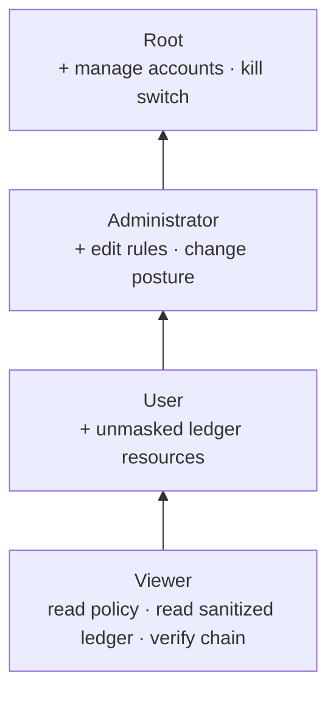
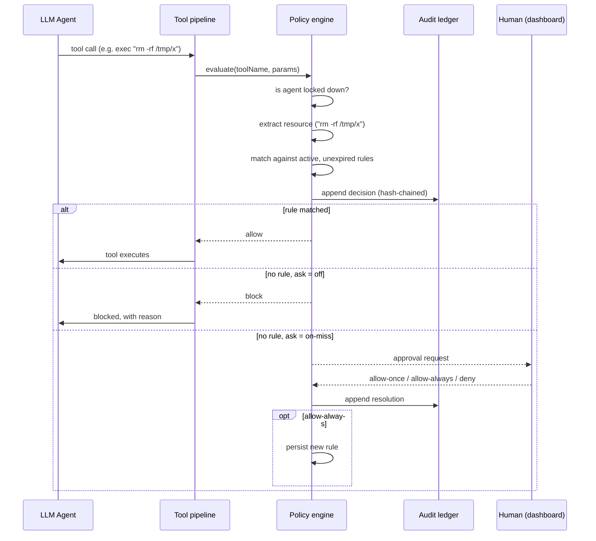
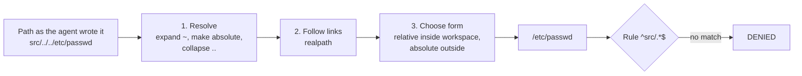
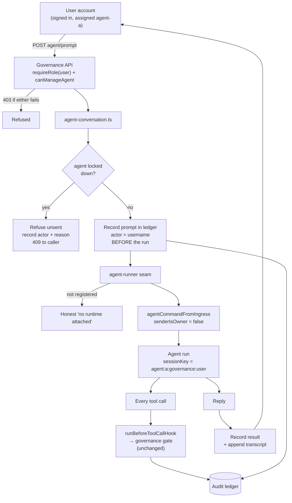
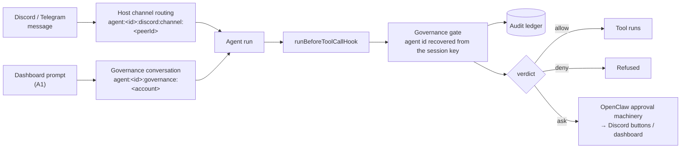

# Source material for Chapters 3–4

**This is not draft prose.** It is organised raw material — decisions, rationale,
data, diagrams, and code — keyed to where each item belongs in the report, so the
team can write the chapters from it later.

Section numbering follows the structure of the NGO-Ledger report supplied as the
model (§3.1 Design Requirements → §3.2 Analysis of Requirements → §3.3 Analysis
of Design Constraints → §3.4 Different Design Approaches → §3.5 Developed Design
→ §4.x Results / Validation).

Cross-references: `GOVERNANCE.md` (operator-facing overview + QA defect table),
`UPSTREAM-BUG-REPORT.md` (the OpenClaw bug found during QA).

---

## → 3.1 Design Requirements

The nine requirements from Chapter 1 §1.3, each with implementation status and
location. Use this table more or less directly; the _status_ column is the part
that matters for §4.4 validation.

| #   | Requirement (abbreviated)                                        | Status  | Where implemented                                                                                                                                                                                                                                                                                                                                                                                                                                                                                                                                                                                                                                                                                                                                                                                                                                                                                                                                                                                                                                                                    |
| --- | ---------------------------------------------------------------- | ------- | ------------------------------------------------------------------------------------------------------------------------------------------------------------------------------------------------------------------------------------------------------------------------------------------------------------------------------------------------------------------------------------------------------------------------------------------------------------------------------------------------------------------------------------------------------------------------------------------------------------------------------------------------------------------------------------------------------------------------------------------------------------------------------------------------------------------------------------------------------------------------------------------------------------------------------------------------------------------------------------------------------------------------------------------------------------------------------------ |
| 1   | Node.js ≥ 18, TypeScript, static type checking                   | **Met** | Node v22.22.3; `tsconfig.json` `strict: true` + `noUncheckedIndexedAccess`; `pnpm tsgo:core` / `pnpm tsgo:ui` clean                                                                                                                                                                                                                                                                                                                                                                                                                                                                                                                                                                                                                                                                                                                                                                                                                                                                                                                                                                  |
| 2   | Secure web dashboard: configure policies, monitor sessions, RBAC | **Met** | `ui/src/pages/governance/` — policy config ✔, RBAC ✔, live session monitoring ✔ (`active-sessions.ts`), per-agent posture ✔, prompting an assigned agent ✔ (§3.5.11), and Root's deployment/network oversight ✔ (§3.5.14) — the last unimplemented clause of the §1.6 role definitions. The per-agent monitor toggle was **not** reachable from any surface until the eleventh QA pass; a policy tier settable only from code does not satisfy "configure policies" — see §4.x.18                                                                                                                                                                                                                                                                                                                                                                                                                                                                                                                                                                                                    |
| 3   | Default-deny over file paths, process execution, network         | **Met** | The _decision_ was always correct; the _coverage_ was one seventh of the host until the thirteenth pass measured it and the fixes closed it. `src/governance/policy-engine.ts` + `resource-extraction.ts`; path confinement enforced by canonicalisation (`path-normalize.ts`, §3.5.8) rather than pattern filtering — validated §4.x.13. Hostnames canonicalised on the same principle, and coverage extended to `grep`/`find`/`ls` and the `terminal` tool's input channel — see §4.x.18. **The thirteenth pass counted the surface against the host's own `tool-catalog.ts` — 7 of its 52 tools were governed — and closed it: 18 are now governed and the other 34 carry a written reason in `DELIBERATELY_UNGOVERNED` (§4.x.20).** Every control surface that reaches the OS is default-denied: `process` (the second command channel into a running shell), `computer`/`screen`/`browser`/`mobile_ui` (desktop and device control), `nodes`, `gateway`, `automations`, `sessions_spawn`, `subagents`, `code_execution`. Residual: search tools are governed at their root only |
| 4   | Fine-grained privileges: path, command, network, time-limited    | **Met** | `policy-types.ts` (`PolicyRule.expiresAt`), `policy-engine.ts`; one path rule now binds every path-taking tool identically (§4.x.13, row 4)                                                                                                                                                                                                                                                                                                                                                                                                                                                                                                                                                                                                                                                                                                                                                                                                                                                                                                                                          |
| 5   | Record 100% of agent actions, policy decisions, approvals        | **Met** | Prompts are now recorded too, with the account that sent them (§3.5.11) — the trail can finally say _who set the agent going_, not only what it did and who wrote its rules. Agent actions ✔ and policy decisions ✔ (`audit-ledger.ts` + `policy-engine.ts`; every invocation recorded, `ungoverned` included — §4.x.10). Administrative approvals ✔ (`admin-audit.ts`, §3.5.9) — policy, account, and approval changes carry a required `actor`, in the same hash chain. Caveat to state: CLI-origin changes are attributed to `cli`, not a person (§3.5.9).                                                                                                                                                                                                                                                                                                                                                                                                                                                                                                                        |
| 6   | Tamper-evident audit logging                                     | **Met** | `audit-ledger.ts` HMAC-SHA256 hash chain, keyed per installation, with an independent checkpoint file (§4.x.2). Evident against an attacker who wants to **alter** the record. The thirteenth pass demonstrated three routes that needed no key and defeated detection by **destroying** rather than forging — deleting the checkpoint made truncation return `ok`, a whole-history rewrite in the pre-key format verified clean, and corrupting `ledger.key` silently yielded a zero-length HMAC key — and closed all three (§4.x.20). Residual, unchanged: an attacker deleting _both_ the key and the checkpoint leaves nothing on the host to contradict a rewritten chain, which needs an off-host anchor (deployment, not code)                                                                                                                                                                                                                                                                                                                                                |
| 7   | Real-time control: suspend/terminate within 1 second             | **Met** | `kill-switch.ts` + `agent-terminator.ts` + `src/gateway/governance-agent-termination.ts`. Measures **confirmed termination**, not dispatch: the run-activity probe waits for signalled runs to leave the Gateway registry, and reports `dispatchMs`, `elapsedMs` and `stoppedConfirmed` separately (§3.5.10, §4.x.17). Caveat retained: from the CLI no in-flight abort is possible, and that is reported rather than implied. **Three failure modes found and fixed in the thirteenth pass (§4.x.20)**, each of which used to return `200 OK` while stopping nothing: a mistyped agent id (the dashboard now offers known ids and warns when the typed one matches none), a hand-written `agentMode: "off"` (dropped on load), and a call carrying neither `agentId` nor `sessionKey` (refused whenever any agent is locked, recorded under `kill-switch-unattributable`)                                                                                                                                                                                                           |
| 8   | No plaintext secrets in logs                                     | **Met** | reuses OpenClaw `redactToolPayloadText`                                                                                                                                                                                                                                                                                                                                                                                                                                                                                                                                                                                                                                                                                                                                                                                                                                                                                                                                                                                                                                              |
| 9   | Deployable on Linux, open-source components only                 | **Met** | Open-source ✔ (zero new dependencies); Linux ✔ — full suite (213 tests) runs natively on Ubuntu 24.04, plus a dedicated platform harness, see §4.x.9                                                                                                                                                                                                                                                                                                                                                                                                                                                                                                                                                                                                                                                                                                                                                                                                                                                                                                                                 |

---

## → 3.2 Analysis of Requirements

Notes on what each requirement actually demanded once implemented. The two
honest narrowings below should be stated explicitly in the report rather than
glossed — an examiner reading requirement #5's "100%" will ask.

**Requirement 3 (default-deny) — where the gate must sit.** A default-deny gate
is only meaningful if nothing can route around it. OpenClaw funnels every tool
call through one function, `runBeforeToolCallHook`
(`src/agents/agent-tools.before-tool-call.policy.ts`), so that is where the gate
was inserted. Critically it had to go _before_ an existing early-return that
skips policy work when no plugins are registered — placing it after would have
silently disabled governance on a default installation. This is a good concrete
example for the report of a control that is correct in isolation but useless in
the wrong position.

**Requirement 5 ("100% of agent actions") — originally narrowed, later met in full.**
The first implementation logged 100% of _governed_ actions only: shell commands,
file reads/writes/patches, and network fetches. Tools the extractor did not
recognise passed the gate silently. The reasoning was that an audit trail's
value comes from being reviewable, and that a resource string is only meaningful
when the extractor knows how to derive it.

That reasoning was wrong on the point that mattered. The unlogged actions are
exactly the ones that reveal what the policy fails to cover, so omitting them
removed the record's most diagnostic content. Every invocation is now recorded;
those the layer could not evaluate carry the distinct decision `ungoverned`
rather than being folded into `allow`. Full treatment in §4.x.10 below —
including the two costs the change exposed (write complexity and file growth)
and the vulnerability it introduced before it was capped.

**Requirement 7 ("within one second") — now met; this text records how.** Locking an agent blocks all
_subsequent_ governed actions immediately (the check precedes rule matching, so
it is O(1) on the lockdown list). It does **not** abort a command already
executing. OpenClaw has that capability internally — the `chat.abort` gateway
method → `AbortController` → OS process-tree termination
(`src/gateway/chat-abort.ts`, `src/process/exec-termination.ts`) — but it is a
Gateway-client capability that the governance layer cannot import directly
without inverting the dependency order.

Resolved with a registration seam: the Gateway installs its abort
implementation at startup (`installGovernanceAgentTerminator`, called from
`server-runtime-state.ts` where the live run registry is created), and
governance invokes it through `agent-terminator.ts`. The kill switch now
(1) locks the agent, then (2) aborts its in-flight runs, in that order —
locking second would leave a window in which the agent could legally start a
fresh action. Elapsed time is measured with `process.hrtime.bigint()` and
returned to both the CLI and the dashboard, so the one-second figure is
observable rather than asserted. See §4.x.8 for measurements.

Honest caveat to keep: when invoked from the **CLI**, no in-flight termination
occurs, because the run registry lives in the Gateway process. The CLI says so
explicitly rather than implying the agent was stopped.

**Requirement 8 (no plaintext secrets) — met by reuse, not reimplementation.**
OpenClaw already has a mature redaction engine (`src/logging/redact.ts`, ~1100
lines, ~40 vendor token patterns, structured-field and URL/PEM handling). The
governance ledger calls `redactToolPayloadText` on every resource string before
writing. Writing a new redactor would have been strictly worse. Worth stating
as a deliberate engineering decision, not an omission.

---

## → 3.3 Analysis of Design Constraints

**Economic (≤ 350 JOD/year) and open-source-only.** Both are satisfied by the
same fact: **the governance layer adds zero new dependencies.** Evidence:
`git diff package.json` is empty. Everything is built from Node.js built-ins
(`node:crypto`, `node:fs/promises`, `node:os`, `node:path`) plus packages
already present in OpenClaw (MIT) and Lit (BSD-3-Clause) in the UI. The password
hashing choice (§3.4) was influenced by this constraint.

**Manufacturability / 8 GB VPS.** The layer adds negligible resident memory: two
small JSON files and an append-only text log, no database process, no daemon of
its own — it executes inside the existing Gateway process. The one bounded
in-memory structure is the login throttle map, capped at 1000 entries.

**Ethical / defensive-only scope.** The layer can only _restrict_ what the agent
does; it exposes no capability to extend agent reach. Worth stating explicitly.

**Language: English only, by decision.** The host ships twenty-two locales and
the governance page is written in one. This is a _scope decision_, not an
unfinished feature, and it is worth a sentence in the report because the
alternative is worse than it looks. Translation fallback in this codebase is per
key, so nothing breaks — an Arabic-locale operator gets an Arabic application
shell around an English governance page, with no right-to-left handling. Filling
the other twenty-one would mean shipping strings nobody on the team can verify
into a **security console**, where a mistranslated `deny` is a control an
operator misreads at the moment it matters most. A governance surface whose
wording cannot be checked by the people responsible for it is a liability
disguised as accessibility. The deployment context is Amman, so the honest
version of this constraint is that Arabic _would_ be the one worth doing, by
hand, with a native reviewer — and that no such review was available for this
project. (Tracked as Q-93, settled 2026-08-21.)

**Known constraint gap: Linux.** All development and testing has been on Windows 11. The paper specifies a Linux VPS. This matters more than it might appear —
one defect found during QA (defect 6, path separators) was a direct
Windows-vs-Linux behaviour difference, and the upstream OpenClaw bug found
(`UPSTREAM-BUG-REPORT.md`) is _also_ a POSIX-vs-Windows filesystem-semantics
difference. Both are evidence that cross-platform assumptions in this codebase
do not hold automatically, so Linux validation should be treated as required
work, not a formality.

---

## → 3.4 Different Design Approaches

Alternatives genuinely considered, with the deciding reason. This section
carries a lot of the engineering-judgement marks; each row below has a real
investigation behind it.

> ### The distinction to state once, early, and then rely on
>
> Chapter 1 contains two different kinds of statement, and they carry different
> obligations:
>
> - **§1.3 design requirements and §1.4 constraints** are what the project is
>   _held to_. These are not negotiable. Chapter 4 validates each one
>   individually (§4.x.5 and §4.x.5b), and where one is not fully met — #9,
>   Linux deployment — it is stated in those words rather than rounded up.
> - **§1.6 is a _preliminary_ design.** It sketches an architecture before the
>   host system had been read closely. The implemented design is allowed to
>   differ from it, and in several places it does — deliberately, with the
>   reasoning recorded.
>
> This is not a licence to quietly drop things. Every divergence below is a
> _different way of meeting the same requirement_, argued on its merits, and
> none of them removes a capability the requirements ask for. Where §1.6
> promised something the implementation does not provide, that is recorded as an
> unmet item in `mg/REMAINING-WORK.md`, not reclassified as a design decision.
>
> The divergences worth naming explicitly in the report:
>
> | §1.6 says                                                                              | Implemented as                                                                                                           | Why                                                                                                                                                            |
> | -------------------------------------------------------------------------------------- | ------------------------------------------------------------------------------------------------------------------------ | -------------------------------------------------------------------------------------------------------------------------------------------------------------- |
> | The User tier "may strictly prompt the agents" or hold "limited, scoped permissions"   | A User genuinely manages their assigned agents — writes their rules, reads their unmasked logs, stops them, prompts them | The narrower reading left a tier with almost nothing to do. Expanded deliberately; see `ROLE-MODEL.md` §3.7                                                    |
> | Root "oversee[s] the deployment and network configurations"                            | A **read-only** report with a verdict per check (§3.5.14)                                                                | An editing surface can remove your own access to the control plane during the incident you need it for. Oversight implemented as seeing and judging            |
> | "Once an Administrator responds to the prompt, the response optionally becomes policy" | An escalation grants the action; it cannot author policy (QA round 13, finding 83)                                       | The approval machinery reports a decision without an identity. Making a grant permanent is policy authorship and belongs on a surface that knows who is asking |
> | A default-deny model, with no starting policy described                                | Ships a three-tier starting policy: immutable core denials, baseline allowances, operator rules                          | `enforce` with an empty allowlist refuses everything, and an unusable control gets switched off wholesale. See `BASELINE-RULES.md`                             |
>
> Presenting these as _decisions_ rather than as omissions is the honest framing,
> and it is also the stronger one: each shows the design being tested against a
> real system and adjusted, which is what Chapter 3 is supposed to demonstrate.

| Decision             | Alternatives considered                                                                                 | Chosen                         | Deciding reason                                                                                                                                                                                                                                                                                                                |
| -------------------- | ------------------------------------------------------------------------------------------------------- | ------------------------------ | ------------------------------------------------------------------------------------------------------------------------------------------------------------------------------------------------------------------------------------------------------------------------------------------------------------------------------ |
| Integration strategy | (a) OpenClaw plugin via public SDK; (b) hard fork of core                                               | **Hard fork**                  | The plugin API can only contribute a dashboard page inside a _sandboxed iframe_ — `ui/src/pages/plugin/plugin-page.ts` hardcodes which tabs render natively (`BUNDLED_TAB_VIEWS`). Seamless integration is impossible as a plugin. A plugin version was actually built first, then migrated into core when this was confirmed. |
| Audit storage        | (a) extend OpenClaw's existing `audit_events` SQLite store; (b) own append-only hash-chained file       | **Own ledger**                 | Core's store has no entry-to-entry chaining and its schema/writer are internal, not a stable contract. Also serves a different purpose (general telemetry). Verified by reading `src/audit/audit-event-store.ts`: pseudonymization exists, chaining does not — this absence is the project's clearest original contribution.   |
| Password hashing     | (a) `bcrypt`; (b) `argon2`; (c) Node built-in `scrypt`                                                  | **scrypt**                     | Both alternatives are native npm addons requiring compilation. `scrypt` is memory-hard, in the standard library, and adds no dependency — satisfying the economic and open-source-only constraints simultaneously.                                                                                                             |
| Account storage      | (a) OpenClaw's state SQLite DB; (b) JSON file                                                           | **JSON file**                  | Single-operator deployment; account volume is tiny; a JSON file is human-auditable, which suits a governance artifact. Migration to SQLite is documented as an option, not a correctness requirement.                                                                                                                          |
| Concurrency control  | (a) in-process promise queue (mutex); (b) OS-level lock file                                            | **Lock file** (`file-lock.ts`) | Started with (a) and it **failed in testing**: the CLI and the Gateway are separate OS processes, so a per-process mutex does not serialize them and the hash chain corrupted itself. See QA defect 1 — good narrative material.                                                                                               |
| Gate placement       | before vs. after the "no plugins registered" early-return                                               | **Before**                     | After would disable governance entirely on a plugin-free install.                                                                                                                                                                                                                                                              |
| Viewer log access    | (a) same view as all tiers; (b) sanitized view                                                          | **Sanitized**                  | Chapter 1 §1.6 grants Viewers "sanitized audit logs" specifically; masking the resource string is what makes Viewer meaningfully distinct from User.                                                                                                                                                                           |
| Path rule form       | (a) always absolute; (b) always workspace-relative; (c) relative inside the workspace, absolute outside | **(c) hybrid**                 | Expanded below — this one needs a paragraph, not a table cell.                                                                                                                                                                                                                                                                 |

#### 3.4.x Which form a file path takes when a rule is matched against it

Worth a subsection of its own: the alternatives are genuinely close, and the
chosen one is what makes the traversal defence in §3.5.8 possible.

A rule is a regular expression tested against a string. So the security question
"can this rule be walked around?" is really the question "what string does the
gate build from the path the agent supplied?" Three answers were considered.

**(a) Always absolute** — every path becomes `/home/kinan/openclaw/src/app.ts`.
Unambiguous, and traversal-proof once `..` is collapsed. Rejected because it
makes every rule machine-specific: a rule written on the development laptop
cannot work on the Linux VPS that design requirement #9 commits the project to,
since the two have different absolute prefixes. It also invalidates every
example in the operator documentation.

**(b) Always workspace-relative** — every path becomes `src/app.ts`. Portable,
and matches the documentation. Rejected because it has no answer for a path
outside the workspace: `/etc/passwd` has no workspace-relative form, so it would
have to be either rejected (breaking legitimate access to files outside the
project) or expressed with `..` (which is precisely the string the traversal
defence has to eliminate).

**(c) Relative inside, absolute outside — chosen.** A path within the workspace
is recorded as `src/app.ts`; a path outside it as `/etc/passwd` or
`C:/Users/kinan/.ssh/id_rsa`. This keeps (b)'s portability for project files and
(a)'s unambiguity for everything else, and it produces the security property
directly: _leaving the workspace changes the shape of the string._ A rule
anchored at `^src/` cannot match an escape attempt, not because the attempt is
detected and rejected, but because the resulting string no longer begins with
`src/`. The check needs no blocklist of suspicious patterns, which is what makes
it robust — there is no list of tricks to keep up to date.

The implementation reuses three helpers the host already ships and tests
(`resolveToCwd`, `realpath`, `formatPathRelativeToCwdOrAbsolute`), so no new
path logic was written. Good example for the report of preferring reuse at a
security boundary: hand-rolled path parsing is a classic source of exactly the
bug being fixed here.

#### 3.4.y How the host is told that the gate must be consulted

The subsection that pairs with §3.5.15. The question is narrow and the answer
decides whether one whole class of deployment is governed at all: **when an
agent runs inside a separate helper process, what makes the host route that
process's tool calls back through the gate?**

The host's own answer was a predicate — "is any before-tool-call policy
installed?" — and it counts plugin policies. This project's gate is not a
plugin; it was moved into the core precisely so that no configuration could
remove it (§3.4.1). The two facts together are the defect: the mechanism that
decides whether to consult the gate could not see the gate. Four designs were
considered for repairing it.

**(a) Widen the existing predicate to always answer yes.** One line, and it does
close the hole. Rejected on two counts. It is _wrong as an answer_ — the
predicate is exported to plugins, and a plugin asking whether plugin policies
exist must not be told yes because something else does. And it is wrong as a
_change_: the same predicate is what lets the host omit a relay in
configurations that switch it off deliberately, so forcing it on alters the
behaviour of a subsystem this project does not own. Measured: thirty of the
host's own tests fail, and those tests exist to pin exactly the behaviour being
overwritten. A security fix whose evidence is thirty broken tests belonging to
somebody else is not evidence, it is a collision.

**(b) Register the gate as a plugin so the existing predicate finds it.** Makes
the host's mechanism correct without touching it. Rejected because it reverses
the project's founding decision. A governance layer discoverable through the
plugin registry is a governance layer removable through the plugin registry, and
§3.4.1 rejected that for the whole project; re-introducing it here for one
deployment shape would be the same mistake in one corner.

**(c) A second, independent signal — chosen.** The predicate keeps its meaning
and its contract, and the relay layer gains a second reason to relay:
`governanceRequiresNativeToolRelay()`. The two are combined with `or`, so
governance can add a reason to consult the gate and can never remove anybody
else's. This is the smallest change that is also true: the host had one question
standing in for two — "are there plugin policies?" was being asked in place of
"is there anything to consult?" — and the fix is to ask the second question
separately rather than to corrupt the answer to the first.

**(d) Relay only when the current posture would act** — that is, skip the relay
while governance is switched off, and reinstate it when it is switched on.
Attractive, and rejected as _unsafe_, which is worth stating carefully because
it is the subtlest of the four. The relay is configured once, when a harness
session starts. The posture lives in a file that another process — the CLI, the
dashboard — may change at any moment. So the decision would be a cached copy of
a value that can change behind it, and the direction of the staleness is the one
that matters: an operator who turns governance _on_ during a session would not
be governed until that session ended, and nothing anywhere would say so. The
saving being bought is also smaller than it looks, since the decision is made
per session rather than per tool call. A cheap optimisation that can silently
un-govern a running agent is not a trade worth making at a security boundary.

---

## → 3.5 Developed Design

### 3.5.1 System architecture

Figure candidate — _Figure 3.1: Governance layer within the OpenClaw Gateway._


**Point worth making in prose:** the two authorization gates are independent and
both mandatory. Reaching any governance route already requires passing
OpenClaw's own credential check; the named-account login is a _second_ gate on
top. This mirrors the layered "SSH tunnel → dashboard → RBAC" architecture in
Figure 1.1 of Chapter 1.

### 3.5.2 Component inventory

Table candidate — _Table 3.1: Governance layer components._ Line counts exclude
test files and are current as of 2026-08-16. Grouped by responsibility rather
than alphabetically, because the grouping is itself part of the design argument.

**Policy: deciding what an agent may do**

| File                     | Responsibility                                                    | LOC |
| ------------------------ | ----------------------------------------------------------------- | --- |
| `policy-engine.ts`       | The decision function: kill switch, denials, allowances, default  | 462 |
| `policy-store.ts`        | Atomic persistence, core-rule reassertion, audited mutators       | 499 |
| `policy-types.ts`        | Policy document and rule data model, effect/tier/access semantics | 332 |
| `baseline-policy.ts`     | The core and baseline rules an installation ships with            | 245 |
| `resource-extraction.ts` | Maps a tool call to the resource string a rule is tested against  | 144 |
| `path-normalize.ts`      | Canonical path form: expand, collapse, dereference, project       | 104 |
| `pattern-match.ts`       | Cached, fail-closed regex matching                                | 69  |
| `rule-conflicts.ts`      | Detects a new rule an earlier one already covers                  | 248 |
| `rule-validation.ts`     | Author-time pattern and TTL validation, looseness warnings        | 139 |
| `regex-safety.ts`        | Rejects patterns that can backtrack catastrophically              | 258 |

**Accountability: recording what happened**

| File              | Responsibility                                            | LOC |
| ----------------- | --------------------------------------------------------- | --- |
| `audit-ledger.ts` | HMAC-keyed hash chain, rotation, verification, checkpoint | 572 |
| `admin-audit.ts`  | Administrative actions and their required actor           | 148 |
| `ledger-key.ts`   | Per-installation signing key for the chain                | 93  |
| `ledger-view.ts`  | Scope filtering and masking per role                      | 42  |

**People: who may see and change what**

| File                | Responsibility                                            | LOC |
| ------------------- | --------------------------------------------------------- | --- |
| `user-store.ts`     | Accounts, parameterised password hashing, roles, resets   | 510 |
| `session-tokens.ts` | Login sessions, fingerprinted storage, expiry, revocation | 187 |
| `permissions.ts`    | The tier × scope authorization rules                      | 97  |
| `roles.ts`          | The role ladder and comparison                            | 29  |
| `account-guards.ts` | Lockout-prevention invariants                             | 72  |
| `login-throttle.ts` | Brute-force lockout, keyed per canonical username         | 111 |
| `password.ts`       | scrypt hashing with recorded cost parameters              | 164 |

**Control: intervening in real time**

| File                   | Responsibility                                           | LOC |
| ---------------------- | -------------------------------------------------------- | --- |
| `kill-switch.ts`       | Lockdown plus in-flight termination, in that order       | 85  |
| `agent-terminator.ts`  | Seam to the Gateway's abort machinery; confirms the stop | 186 |
| `active-sessions.ts`   | Live run view for the session monitor                    | 84  |
| `pending-decisions.ts` | Escalations nobody answered, deduplicated and bounded    | 214 |
| `rule-requests.ts`     | The User tier proposes, the Administrator grants         | 226 |
| `system-status.ts`     | Host CPU/memory for the Viewer tier                      | 55  |

**Infrastructure**

| File           | Responsibility                                     | LOC |
| -------------- | -------------------------------------------------- | --- |
| `file-lock.ts` | Cross-process advisory lock with staleness reaping | 150 |
| `paths.ts`     | Storage locations, environment-overridable         | 118 |

**HTTP, CLI and dashboard**

| File                                          | Responsibility                            | LOC   |
| --------------------------------------------- | ----------------------------------------- | ----- |
| `src/gateway/governance-dashboard-api.ts`     | Every API route and its tier/scope check  | 964   |
| `src/gateway/governance-dashboard-auth.ts`    | Login, bootstrap, session resolution      | 235   |
| `src/gateway/governance-agent-termination.ts` | Registers the Gateway's abort + run probe | 106   |
| `src/cli/program/register.governance.ts`      | The `openclaw governance …` command tree  | 302   |
| `ui/src/pages/governance/governance-page.ts`  | The dashboard page                        | 1,443 |
| `ui/src/pages/governance/api.ts`              | Typed dashboard API client                | 404   |
| `ui/src/pages/governance/ledger-filter.ts`    | Audit-view filtering and row description  | 56    |
| `ui/src/pages/governance/route.ts`            | Page registration                         | 12    |

|                      |                                               |
| -------------------- | --------------------------------------------- |
| **Production total** | **~9,165 lines across 36 files**              |
| **Test total**       | **~7,950 lines across 40 files, 1,056 tests** |

Plus **13 modified OpenClaw core files** — the tool-call pipeline insertion
(`agent-tools.before-tool-call.policy.ts` and its two type/diagnostic
companions), route and CLI registration, Gateway runtime wiring, and UI
routing/navigation/strings.

**Point worth making in prose.** Test code is roughly 87% of production code by
volume, and that ratio is not incidental. Ten QA rounds found around sixty
defects, and the recurring finding was never a missing check — it was two parts
of the system disagreeing (see §4.x.11 and §4.x.15). Disagreements are only
visible from outside the code that contains them, which is what the test volume
is buying.

### 3.5.3 Data models

_Table candidate — Table 3.2: Policy rule fields._

```ts
type PolicyRule = {
  id: string;
  resourceKind: "command" | "path" | "network";
  pattern: string; // regular expression
  description?: string;
  createdAt: string;
  expiresAt?: string; // absent = never expires  → requirement #4 time limits
  createdBy?: string; // accountability: who granted this
};

type PolicyDocument = {
  version: 1;
  mode: "enforce" | "monitor" | "off";
  ask: "off" | "on-miss";
  rules: PolicyRule[];
  lockedAgents: string[]; // kill switch
};
```

_Table candidate — Table 3.3: Audit ledger entry fields._

```ts
type LedgerEntry = {
  seq: number; // strictly increasing; a gap is tampering evidence
  timestamp: string;
  agentId: string;
  sessionKey: string;
  toolName: string;
  resourceKind: string;
  resource: string; // redacted before writing
  ruleId: string; // which rule decided, or "default-deny" / "kill-switch"
  decision: "allow" | "deny" | "ask";
  prevHash: string; // ← the chain link
  hash: string; // SHA-256 over all fields above
};
```

Note for the report: `ruleId` is what makes an entry _explainable_ — it answers
"why was this decided this way", which is exactly the Table 1.1 example from
Chapter 1.

### 3.5.4 The four-tier permission model

> **Full treatment in `docs-notes/ROLE-MODEL.md`**, including §3.7 "Evolution
> of the User tier" — how that tier changed during implementation and why,
> which is prime §3.5 narrative material.
>
> Original note: — what "manage" means at each
> tier, which parts come from the paper vs. are design decisions, the two-question
> (tier + scope) authorization model, and the complete permission matrix.

Figure candidate — _Figure 3.2: RBAC hierarchy with inherited permissions._



_Table candidate — Table 3.4: Permission matrix._

| Capability                             |     Viewer     |  User  | Administrator | Root |
| -------------------------------------- | :------------: | :----: | :-----------: | :--: |
| View policy document                   |     scoped     | scoped |       ✔       |  ✔   |
| View audit ledger                      | scoped, masked | scoped |       ✔       |  ✔   |
| Verify chain integrity                 |       ✔        |   ✔    |       ✔       |  ✔   |
| Add / remove agent-scoped rules        |       ✘        | scoped |       ✔       |  ✔   |
| Global rules, posture, ask mode        |       ✘        |   ✘    |       ✔       |  ✔   |
| Assign agents to accounts              |       ✘        |   ✘    |       ✔       |  ✔   |
| Create / delete accounts, assign roles |       ✘        |   ✘    |       ✘       |  ✔   |
| Emergency kill switch                  |       ✘        | scoped |       ✔       |  ✔   |

The Root/Administrator split follows Chapter 1 §1.6 exactly: **Root governs
people, Administrator governs agents.** A consequence worth stating: an
Administrator cannot promote themselves, because account administration is not
their tier.

**The one deliberate divergence from Chapter 1, stated plainly.** In the
preliminary design the User tier _uses_ its assigned agent — it prompts and
interacts with it, and its governance authority extends little beyond proposing
changes. In the implemented system a User _governs_ its assigned agent: it
writes agent-scoped rules, sets that agent's escalation behaviour, reads its
unmasked audit entries, and can stop it. This is an accepted design decision,
not an oversight, and the report should present it as such rather than let an
examiner find it.

The argument for it: a tier that can only propose is not a tier of
responsibility, and it forces every routine decision about one team's agent up
to an Administrator who has installation-wide authority. Delegating narrow,
agent-scoped authority is what makes the Administrator tier's global scope
meaningful — otherwise "governs all agents" and "governs one agent" collapse
into the same job. The two-question authorization model (tier + scope) exists
precisely to make that delegation safe: a User's authority stops at the agents
assigned to them, and global rules remain Administrator-only.

Two honest riders belong with it. First, this places one capability — the
per-agent human-approval toggle — a tier lower than Chapter 1 assigns it
(tracked as A5). Second, the divergence is a _substitution_, not a superset:
the User tier gained governance authority but has **not** gained the paper's
conversational access to its agent, because the account system was never wired
into OpenClaw's chat path (tracked as A1). Both belong in §4.4's validation
discussion.

### 3.5.5 Process flow — a policy decision

Figure candidate — _Figure 3.3: Policy decision sequence._



### 3.5.6 Process flow — authentication

Figure candidate — _Figure 3.4: Two-gate authentication._

Steps: browser presents Gateway credential → Gateway auth gate → governance
`whoami` → if no account exists, one-time Root bootstrap (refuses once any
account exists) → else username/password → scrypt verify → session token
(32 random bytes, hex) in an HttpOnly, SameSite=Strict cookie, 12-hour expiry →
each subsequent request re-resolves the session and compares role against the
tier the endpoint requires.

Security notes for prose: the throttle is keyed _per username_, so guessing one
account cannot be parallelised and a flood cannot lock out a different victim.
The cookie deliberately omits `Secure` because the Gateway binds to loopback and
remote access is via SSH tunnel per the Chapter 1 architecture — requiring HTTPS
would break the intended deployment without adding protection.

### 3.5.7 System security

- Two independent, mandatory authorization gates (above)
- Default-deny posture; unmatched actions are denied or escalated
- Fail-closed on decision, fail-open on extraction (see §4.x rationale)
- Secrets redacted before any ledger write
- Brute-force lockout on login
- Lockout-prevention guards so the system cannot be made unadministrable
- Role changes and deletions revoke live sessions immediately, not at expiry
- Rule patterns validated at author time and length-capped
- File paths canonicalized before matching, so a location rule cannot be
  side-stepped (§3.5.8)

### 3.5.8 Canonicalizing file paths before a rule is applied

Figure candidate — _Figure 3.x: Path normalization pipeline._



A policy rule is a pattern tested against a string, so a location-based rule is
only as strong as the string the gate constructs. Three separate weaknesses came
from constructing it carelessly — the original implementation converted
backslashes to forward slashes and did nothing else:

1. **`..` was never collapsed.** A rule meaning "only inside the workspace"
   matched `workspace/../../etc/passwd`, because that text does begin with
   `workspace/`. The rule was satisfied by a path that pointed outside the
   directory the rule existed to confine the agent to.
2. **Symbolic links were never followed.** A link at `workspace/notes` pointing
   at `/etc` defeated the same rule a second way, without using `..` at all.
3. **The form differed between tools.** `apply_patch` reaches the gate with an
   absolute path already resolved by the host
   (`src/agents/apply-patch-paths.ts`), while `read`, `write` and `edit` arrive
   exactly as the model typed them, because the host populates its
   `derivedPaths` hint for `apply_patch` alone
   (`src/plugins/host-tool-param-parsers.ts`). Since all operator documentation
   teaches the short relative form, a rule written as documented was
   _simultaneously_ bypassable on three tools and silently inert on the fourth —
   it never matched a patch of the very file it named.

The three are one defect with three symptoms, and one pipeline closes all of
them. Points worth making in prose:

- **The fix is structural, not a filter.** Nothing looks for `..`, and nothing
  maintains a list of dangerous patterns. The path is resolved to what it
  actually refers to, and the rule is matched against that. A defence that
  enumerates attacks has to be updated whenever a new one appears; this one does
  not, and that distinction is the point of the section.
- **Symbolic-link resolution is a filesystem read inside a security check.** The
  asynchronous `realpath` is used rather than the host's synchronous
  `canonicalizePath`, because the gate is on the path of every tool call and a
  blocking call there would stall the whole process. A real
  security-versus-performance trade with a defensible resolution.
- **A file that does not exist yet is the normal case, not an error.** A `write`
  creating a new file cannot be resolved directly, so the _parent directory_ is
  resolved and the filename re-attached. Without that, an agent could evade link
  resolution simply by targeting a file that does not exist yet — the kind of
  gap that appears only when the mechanism is written out and examined.

Validation of all three symptoms: §4.x.13.

### 3.5.11 The User tier's own capability — prompting a governed agent

_Figure candidate — Figure 3.x: The governed prompt path._

Chapter 1 §1.6 defines the User tier as "granted targeted access to **interact
with** specific, pre-configured agents", and every other User capability was
built before this one. The gap was structural rather than an oversight: the
governance layer added named human accounts, which exist nowhere else in
OpenClaw, and the host's chat path had no concept of them. Joining the two is
what this section describes.

The design constraint that shaped everything else: **prompting must not become a
second way into the agent.** If the governance layer had built its own run path,
every guarantee the project makes about tool calls would have had to be re-earned
on that path, and the first missed check would have turned the governance
dashboard into the least governed way to use the system. So the prompt is handed
to OpenClaw's ordinary ingress (`agentCommandFromIngress`, the same entry point
the OpenAI-compatible HTTP surface uses) and everything downstream is unchanged.



The figure's point, and the sentence to put under it in the report: **the only
new arrows are on the left.** Authorization, attribution and the lockdown check
are new; from `agentCommandFromIngress` rightward the diagram is the system that
already existed, which is why prompting adds no capability to the agent.

**Four decisions worth defending in prose.**

_Authorization needed no new concept._ The route's tier floor is User and its
scope check is `canManageAgent` — the same pair that governs writing a rule or
stopping an agent. A Viewer is refused by tier, matching §1.6's "cannot interact
with the agent"; a User reaches only their assignment. That the existing model
absorbed a genuinely new capability without extension is evidence the tier model
was drawn along the right lines, and is worth saying so in §3.5.4.

_`senderIsOwner` is false._ The host's trusted-caller bit unlocks command and
channel actions that bypass ordinary policy. It defaults true for local CLI use,
which is correct there and would have been a privilege escalation here: a
governance prompt arrives over HTTP from the least-privileged tier that can do
anything. Setting it true would have let the User tier reach past the policy
layer the project exists to impose. Worth a sentence in Chapter 4 as an example
of a security-critical decision that looks like plumbing.

_The kill switch binds at the door._ A locked-down agent refuses the prompt
before the model is reached, in every posture — including `off`, deliberately
unlike the tool gate. The reasoning is that this route _is_ a governance surface
and does not exist when governance is absent, so unlike the tool gate there is no
host path it could be inconsistent with. Without it, an emergency stop would
still permit an operator to start the agent thinking and receive a reply built
from no tools, which is not a stop.

_The session key is a seam, and it was tested as one._ Governance runs use
`agent:<id>:governance:<account>`. It must parse under the host's own
`parseAgentSessionKey`, because the gate recovers the agent id from the session
key whenever `ctx.agentId` is absent, and so do the kill switch and the
live-session view. A key that did not parse would have left precisely the runs
this feature creates unattributable to their agent — lockdown and every
agent-scoped rule silently ceasing to apply to them. This is the project's
recurring defect shape (§4.x.11: two components disagreeing), anticipated this
time and pinned by a test instead of discovered by a later round.

**What it closes in the requirement table.** Requirement #5 asks for agent
actions, policy decisions **and administrative approvals**. The ledger could
account for the first two and, since §3.5.9, for who changed the rules — but
never for _who set the agent going_. Two new actions record the prompt and its
result against the account that sent it, the prompt written **before** the run so
a process that dies mid-run still shows the attempt. §1.6 asks the log to capture
"the raw LLM intent"; the prompt is that intent, and this is the first point at
which a chain of agent actions can be traced to a person.

### 3.5.12 Making the rule language usable — denials and directional access

_Section candidate. Short, and it carries a design argument the report needs
anyway: what it means for a policy language to be more expressive than its
interface._

The rule model gained two fields when the supervisor's tier model landed
(§3.5.x): `effect`, so a rule can forbid rather than permit, and `access`, so a
path rule can cover reading without covering writing. The engine honoured both
from the first commit. The rules an installation _ships_ with use both — the
core tier is entirely denials, and the baseline workspace grant is read-only.

Neither could be written by an operator. Both create paths — the HTTP route and
the CLI command — accepted allowances only, so an operator's own restriction
meant editing `policy.json` by hand and restarting. This is the defect round
eleven named (§4.x.18, family 3): **a mechanism that works and no surface that
reaches it.** It passes every check the project has, because the code is
correct, the tests pass and the documentation is accurate; what fails is the
join between the capability and the way in.

#### Why a denial is not a convenience

The obvious objection is that the model is default-deny, so an operator who
wants something forbidden can simply not permit it. The report should answer
this directly, because it is the argument for the whole feature.

Not writing an allowance produces a state that _looks_ like a restriction and is
undone by the next broad grant. A denial is evaluated before every allowance and
cannot be overridden by one, so it is a statement that **survives other people**
— which is precisely what an operator means by "this agent must never touch
billing". The distinction is between the current configuration happening to
refuse something, and the policy asserting that it always will. Only the second
is a control.

That is also why the tier model needed denials at all: `core` restrictions are
exactly the ones that must hold whatever anybody permits afterwards.

#### What the change actually consisted of

Adding two fields to three surfaces is the small half. The parts worth writing
up are the ones that follow from a language becoming bidirectional:

**Advice has a direction.** `describeRuleRisks` now takes the rule's intent. The
same pattern is a different mistake each way round: a catch-all allowance
removes a protection, a catch-all denial removes a _capability_. Reusing the
allow-flavoured warning would have produced text that is not merely unhelpful
but false — telling an operator their denial "allows every command the agent
could attempt". A new warning covers the one genuinely counter-intuitive case: a
denial narrowed to `read` leaves writing permitted, which follows from the rule
that narrowing must never strengthen a rule in the other direction, and is
almost never what someone means.

**Clash detection has a direction.** A candidate is now compared only against
rules of its own effect, because "an identical rule already does this" is true
only of a rule pointing the same way. Without that guard, writing a denial where
an allowance existed would have been reported as _"an identical rule already
allows this — the new rule is redundant"_: the same inversion this module has
been corrected for twice before (§4.x.18). Worth noting in Chapter 4 as an
instance of a general pattern — **every component that reasoned about an
allow-only language has to be revisited when the language stops being
allow-only**, and the ones that are not revisited fail silently and politely.

**A field that means nothing is refused, not ignored.** `access` applies only to
path rules, and the API and CLI reject it on the other kinds. Storing a field
the engine will not consult would leave the operator believing a narrowing took
hold; refusing it is the honest half of that pair, and it is a small example of
a principle worth stating once in the report: _silently discarding input is a
usability defect in a security tool, because the user's model of the system
diverges from the system without either of them noticing._

**Authorization did not change.** A denial narrows rather than widens, so it
binds under the existing pair — `canManageAgent` for an agent-scoped rule,
`canManageGlobalPolicy` for a global one. That a genuinely new capability
required no new permission concept is, again, evidence the tier model was drawn
along the right lines (cf. §3.5.11, where prompting needed none either).

Evidence: `rule-authoring.test.ts` (26 tests) plus 11 HTTP cases; the CLI
exercised end to end. The behaviours pinned are the ones that would fail
silently — an authored denial beating a later allowance, refusing outright
rather than offering approval, expiring, staying agent-scoped, and still binding
after a hand-edit strips its tier.

### 3.5.13 Governing the control surface, not just the shell

_Section candidate for §3.5, and the design decision the thirteenth QA round
forced. It belongs in Chapter 3 rather than Chapter 4 because what changed is
the **model** of what a "command" is, not just a list of tool names._

#### The problem the design had not stated

Everything written about the gate up to this point describes three resource
kinds — command, path, network — and reasons about them as though `exec` were
the only way an agent reaches the operating system. That was never true of
OpenClaw, and the design had simply not been checked against the host's actual
tool surface. Measured against `CORE_TOOL_DEFINITIONS` in
`src/agents/tool-catalog.ts`, the host declares **52 tools** and the gate
governed **7 of them**.

The forty-five that were not governed included every alternative route to the
same effect:

| Tool                          | What it actually does                                                                              |
| ----------------------------- | -------------------------------------------------------------------------------------------------- |
| `process`                     | types into a shell that `exec` started in the background, via `data` / `literal` / `text` / `keys` |
| `computer`                    | synthetic keyboard and mouse against a paired desktop                                              |
| `mobile_ui`                   | the same against a paired Android device                                                           |
| `screen`, `browser`           | drive other operator-facing UI surfaces                                                            |
| `nodes`, `gateway`            | address devices; read Gateway configuration                                                        |
| `automations`                 | schedule work to run later, including supervised argv                                              |
| `sessions_spawn`, `subagents` | start further agents                                                                               |
| `code_execution`              | run code in a provider-side sandbox                                                                |

`process` is the sharpest example and the one to use in the report, because it
is the **same defect the eleventh round had already found and fixed on the
`terminal` tool** — _a shell has two doors and only one was watched_ — recurring
on the sibling tool five days later. The fix had been applied to the tool that
was discovered rather than to the sentence describing it.

#### The decision: a keystroke is a command

Three options were considered.

1. **A fourth resource kind** (`control`, or `ui`). Rejected. It would need its
   own patterns, its own core denials, its own documentation, and — critically —
   an operator would have to write `sudo` into _two_ rules to forbid it. Two
   places to say one thing is how the deny pass and the allow pass came to
   disagree in round ten.
2. **Govern only the tool name**, with no payload. Rejected as too coarse: it
   makes `computer` all-or-nothing, so an operator who wants screenshots for
   monitoring must also grant keystrokes.
3. **Chosen — model them as `command`, with the resource as
   `<tool>:<action>` plus any literal payload the call carries.**

The third option is the one that makes the existing rules do the work. Because a
typed payload is emitted as a `command` resource, the core denial that refuses
`sudo` for `exec` refuses it for `computer` and `process` **without that rule
knowing those tools exist**. The property comes from the representation rather
than from remembering to extend every rule — the same move `path-normalize.ts`
makes for files and `canonicalHostname` makes for addresses, now applied a third
time.

The `<tool>:<action>` half is what keeps it usable. An operator can write:

```
allow   command   ^computer:screenshot$      # observation only
allow   command   ^automations:list$         # read the schedule, do not write it
```

and grant one action of one surface without granting the rest. Governing the
tool name alone would have made that impossible.

#### Reading the payload out of three different shapes

The host does not present typed text uniformly, and this is where the
implementation had to be written against the schemas rather than from memory:

- a **plain string** (`process.data`, `computer.text`, `nodes.body`);
- an **array of tokens** (`process.keys`, `process.hex`, `automations.command` —
  the last being supervised argv, a genuine execution channel), joined so a rule
  sees the whole submitted sequence rather than one token at a time;
- a **nested object** (`mobile_ui.mobileAction`, whose typed text lives at
  `{type: "set_text", ref, text}`), serialised whole.

The object case is deliberately serialised rather than reaching for a known
field name. Guessing the field is how this file had already gone wrong twice,
and serialising cannot miss it — a pattern written against the text still
matches inside the JSON.

> **Worth reporting as a process observation.** Two of these parameter names
> were written into the registry from memory on the first attempt and were both
> wrong: `mobile_ui` has no top-level `text`, and `automations` has no `prompt`.
> That is the registry-versus-host mistake beginning a _fourth_ time, in the
> change whose entire purpose was to close it, and it was caught only by opening
> the schemas. It is the strongest available evidence that the discipline —
> cite the file, read the file — is doing real work rather than decorating the
> comments.

#### Declining to govern is now a decision, not an omission

The remaining 34 catalogued tools are listed in `DELIBERATELY_UNGOVERNED` in
`qa-round11.test.ts`, each with a written reason, in four groups:

| Group                                                                    | Reason                                                                                                                                                                                                         |
| ------------------------------------------------------------------------ | -------------------------------------------------------------------------------------------------------------------------------------------------------------------------------------------------------------- |
| Outbound messaging (`message`, `conversations_send`, `sessions_send`, …) | The resource model has no axis for "put this text where a person will read it". Refusing `message` by default would stop the agent replying at all. Needs a fourth kind — recorded as future work, not hidden. |
| Reads of the agent's own session state                                   | Already bounded by what the gate permitted the agent to create.                                                                                                                                                |
| Model-facing bookkeeping (goals, plans, `ask_user`)                      | No OS or network reach.                                                                                                                                                                                        |
| Media generation, display surfaces                                       | Files land through the host's own pipeline, not a path the agent chooses, so a `path` rule has nothing to match.                                                                                               |

A test asserts every entry carries a non-empty reason, because an empty reason
is how a decision decays back into an omission.

#### And the guard itself

The durable half of this work is not the registry entries; it is that
`qa-round11.test.ts` now compares the registry against the union of
`allToolNames` **and** the host's `listCoreToolSections()`, and additionally
asserts its own breadth, so a subset small enough to be the session barrel again
would fail rather than silently narrow the guarantee. That correction is the
subject of §4.x.20 and is the single most important result the project has.

### 3.5.14 Root's deployment and network oversight

_Section candidate for §3.5, and the last unimplemented clause of the §1.6 role
definitions. Implemented 2026-08-20 as backlog item A7._

#### The clause, and what it was taken to mean

§1.6 defines Root as managing "the human element of the system, including
creating user accounts, defining high-level RBAC settings, assigning roles, **and
overseeing the deployment and network configurations of the governance layer on
the VPS**". Every other capability in that sentence was built early. The last
clause had nothing behind it, and `ROLE-MODEL.md` recorded it as future work.

The word that had to be interpreted is **overseeing**, and the two readings lead
to very different systems:

| Reading                                                                                         | What it builds                                       | Why it was or was not chosen                                                                                                                                                                                                                                                    |
| ----------------------------------------------------------------------------------------------- | ---------------------------------------------------- | ------------------------------------------------------------------------------------------------------------------------------------------------------------------------------------------------------------------------------------------------------------------------------- |
| _Managing_ — Root edits bind address, port and auth mode from the dashboard                     | A configuration editor plus gateway restart handling | **Rejected.** Changing the bind address of the server you are currently connected _through_ removes your own access, and it does so most easily during exactly the incident when you need the control plane. It also duplicates configuration management the host already owns. |
| _Seeing and judging_ — Root reads the live deployment and is told whether it matches the design | A read-only report with a verdict per check          | **Chosen.** It answers the question oversight is actually for, it cannot lock anybody out, and it converts four prose claims in Chapter 1 into something an examiner can watch being verified.                                                                                  |

This is a place where **the implemented design deliberately differs from the
preliminary design**, and the report should present it that way rather than
hiding the divergence: Chapter 1 sketched a capability, Chapter 3 chose an
interpretation of it, and the reasoning above is the justification. What is _not_
negotiable is the requirement — see §4.x.5b, where the constraint this feature
verifies is checked rather than asserted.

#### What it checks, and where each check comes from

The value of the feature is that the checks are not invented. Each one is a
claim the report already makes, turned into something testable.

_Table candidate — Table 3.x: Deployment posture checks and their source._

| Check                                                          | Source claim                                                                                             |
| -------------------------------------------------------------- | -------------------------------------------------------------------------------------------------------- |
| `deployment.bind_loopback`                                     | §1.6: the dashboard "listens only on localhost"                                                          |
| `deployment.nonstandard_port`                                  | §1.6: it "does not expose standard HTTP/HTTPS ports globally"                                            |
| `deployment.tunnel_required`                                   | §1.6: "access requires secure cryptographic tunneling, specifically utilizing SSH local port forwarding" |
| `deployment.gateway_auth`                                      | §1.6's layered gate — the governance login is a _second_ gate, not a replacement for the Gateway's own   |
| `deployment.platform_linux`                                    | Requirement #9, the Linux deployment target                                                              |
| `deployment.memory_minimum`                                    | §1.4's "minimum hardware specification of 8 GB RAM"                                                      |
| `deployment.governance_dir_permissions`, `…_files_permissions` | The `0700`/`0600` regime this layer relies on for confidentiality of the policy, accounts and ledger key |
| `deployment.ledger_key_source`                                 | The residual risk documented in `ledger-key.ts`: the key on the same host as the ledger it protects      |
| `deployment.ledger_checkpoint`                                 | QA round 13, finding 76 — without the checkpoint, truncation is undetectable                             |
| `deployment.governance_disk_space`                             | The audit ledger is append-only and rotates rather than shrinking                                        |
| `gateway.*`                                                    | Folded in from the host's own security audit, verbatim — see below                                       |

#### Three design decisions worth defending

**1. A fourth status, `unknown`, and why it is not decoration.**

The natural vocabulary is pass / warn / fail. A fourth was added for checks that
_could not run here_ — POSIX permission bits on Windows, free space where
`statfs` is unavailable. The alternative is for such a check to report `pass`,
and that is precisely the failure this feature exists to prevent: **a
verification report that is confidently green because the detector was
disconnected.** An operator acts on a green report. `unknown` is counted and
displayed separately, and excluded from the overall verdict, so it can neither
hide a problem nor manufacture one.

The same reasoning already existed one file away, in `system-status.ts`'s
`loadAverageSupported` — reported honestly rather than faked. Reusing it was a
matter of noticing the precedent.

**2. Absence of a finding is reported as a pass — which is what makes it a report.**

The host already has a security audit (`collectGatewayConfigFindings`) that
classifies bind exposure, auth mode, control-UI origins and trusted proxies. Its
job is to _raise problems_, so it emits nothing when a check is fine. Oversight
is the opposite job: Root needs to see that the listener **is** loopback-only,
not merely that nothing complained.

So the module holds a list of the host check ids it expects to be absent, and
converts absence into an explicit `pass`. Findings that _are_ present are folded
in with their `title`, `detail` and `remediation` copied **verbatim** — two
components describing one condition in different words is this project's single
most frequent defect shape (§4.x.20), and re-authoring the wording would have
created another instance of it.

**3. The layering constraint, and the seam it forced.**

`src/governance/` imports from `node:*`, `../infra/`, `../agents/`,
`../sessions/`, `../routing/` and `../logging/` — and nothing else. That is
deliberate: the governance layer is exercised by the CLI and by unit tests with
no Gateway running, which is why `agent-runner.ts` and `agent-terminator.ts`
already use registration seams.

The obvious implementation — call `collectGatewayConfigFindings` from inside the
governance module — would have created the first governance→gateway edge in the
codebase, because that module imports `../gateway/auth-resolve.js`. Instead the
findings arrive as a **parameter**, assembled by
`src/gateway/governance-deployment-input.ts`, which is the only file that touches
both sides.

The payoff is larger than tidiness: `readDeploymentStatus` became a **pure
function of its inputs**, so every check is testable on any platform with no
Gateway, no socket and no configuration file. That is what let the permission
table be verified on Windows CI, where the real answer is "these bits are not
meaningful here".

_Figure candidate — a small diagram of the seam: config and security audit on
the Gateway side, a plain-data `DeploymentEnvironmentInput` crossing one
boundary, and a pure function on the governance side. It illustrates the
project's layering discipline better than any prose, and the same shape recurs
in `agent-runner.ts` and `agent-terminator.ts`._

#### What cannot be verified, and what was done instead

§1.6 expects access to require an SSH local port forward. **No process can
verify that a human typed `ssh -L`.** `SSH_CONNECTION` and `SSH_CLIENT` describe
the shell the code happens to be running in, say nothing about how the
_dashboard_ is reached, and are absent entirely from a Gateway started as a
daemon. A check reading them would give a confident answer to a different
question.

What can be established is strictly stronger: that **no other route exists** —
loopback bind, Tailscale off, no non-loopback trusted proxy, no TLS listener.
Then any access from another machine must arrive through a local port forward,
because there is nothing else to arrive through. When the check fails it names
the alternative route that exists (Funnel, Serve, a reverse proxy) rather than
emitting an unactionable "no tunnel detected".

This is worth a paragraph in the report on its own account: it is a small,
concrete example of replacing an unverifiable positive claim with a verifiable
negative one.

#### Two surfaces, and why the CLI is the important one

The report is served to Root at `GET /control-ui/governance/deployment` and
printed by `openclaw governance deployment`.

The command line matters more than it first appears. The design has the
dashboard reachable only through an SSH tunnel — so the moment an operator most
needs to know whether the listener is exposed is over a plain SSH session
_before_ any tunnel exists, which is exactly when the dashboard is by design
unreachable. The CLI is the surface that works then, and it is the natural first
command to run on a newly provisioned VPS. It also gives A8 (Linux deployment) a
ready-made verification step.

The tier gate is enforced **server-side**; hiding the panel from non-Root
accounts is a convenience, not the control. The route reports the bind mode,
port, auth mode and governance directory — collectively a map of how to reach
and attack the installation — which is why it sits at Root while its neighbour
`system` (CPU and memory, disclosing nothing) sits at Viewer. The tiers differ
because the _disclosure_ differs, which is the same reasoning the Viewer/User
audit-masking split rests on.

#### The test that matters most

`src/gateway/governance-deployment-input.test.ts` drives the **real**
`collectGatewayConfigFindings` and asserts that each expected check id actually
fires. Without it, renaming a check id upstream would silently stop the
expectation from matching, the finding would never be looked for, and the check
would become a permanent green — the disconnected-detector failure described
above, arriving by accident rather than by design.

That test is the direct descendant of §4.x.20's lesson: a guard makes a silent
claim about what it compares against, and that claim starts out exactly as
unexamined as the code did. This one is examined.

### 3.5.15 Making the gate unavoidable when the agent runs elsewhere

The last known hole in the gate's coverage, and the one that most directly
threatens the project's central claim. Everything else in §3.5 describes how a
tool call is _judged_. This describes how the host is obliged to _present_ it
for judgement — and for one deployment shape, it was not.

**Figure candidate.** Two paths through the host to the gate: the in-process
path, and the native-harness path with the relay hook that had been missing.

#### The two ways a tool call reaches the gate

OpenClaw can run an agent in either of two arrangements, and the difference is
invisible from the dashboard.

In the **in-process** arrangement, the agent's tool calls are executed by the
same Node process that holds the gateway. Each one passes through
`runBeforeToolCallHook`, which is where the gate is mounted (§3.5.1). Nothing
optional stands between the tool call and the policy check. This is the
arrangement every part of this project has used, and every experiment in §4.x
was run under it.

In the **native-harness** arrangement — used by the Codex app-server backend —
the agent runs inside a separate helper process, which executes tools itself.
That process knows nothing about OpenClaw's hooks. The host reaches it by
writing a _relay hook_ into the helper's own configuration at session start: a
command the helper is told to run before each tool call, which calls back into
the host, which then runs `runBeforeToolCallHook` and returns allow or block.

The gate is identical in both. The difference is that in the second, the gate is
reached only if the relay hook was installed — and installing it was conditional.

#### The condition, and why it was false

The host decided whether to install the relay by asking one question:
`hasBeforeToolCallPolicy()` — _is any before-tool-call policy installed?_ The
function counts plugin hooks and trusted tool policies.

This governance layer is neither. §3.4.1 records the decision to abandon the
plugin implementation and build the gate into the core, on the grounds that a
security layer a configuration file can disable is not a security layer. That
decision is correct and stands. Its unforeseen consequence is that the layer
became invisible to a predicate that enumerates plugins.

So on a plugin-free installation using this backend, with the host's loop
detector also disabled, the host concluded there was nothing to consult,
declined to write the relay hook, and the helper process executed every tool
call on its own authority. Concretely, in that configuration:

- no rule was evaluated, so a core denial did not apply;
- no ledger entry was written, so requirement #5's complete record had a hole
  that the record itself could not reveal — an action that never reaches the
  gate cannot be logged as `ungoverned` either;
- the kill switch could not reach the agent, because the switch is enforced at
  the same gate.

The honest severity: this is the only defect found in the project that removes
all three properties at once, and it removes them _silently_. Every dashboard
surface would have shown a governed installation.

#### The fix: a second signal, not a wider answer

The relay layer now asks two independent questions and relays if either says
yes:

```ts
// src/agents/harness/native-hook-relay-events.ts
return (
  governanceRequiresNativeToolRelay() || // governance — compiled in
  hasBeforeToolCallPolicy() || // plugins — as before
  nativePreToolUseMayRunLoopDetection(registration)
);
```

`hasBeforeToolCallPolicy()` is deliberately unchanged. Widening it was the
tempting one-line fix and it is the wrong repair twice over — it lies to plugins
about what is installed, and it forces the relay on in configurations that
switch it off on purpose, which is what breaks thirty of the host's own tests.
§3.4.y sets out all four candidate designs.

**The second half of the fix, which the one-line version would have missed.**
Deciding to relay the _event_ is not the same as relaying every _tool_. The host
also computes a tool matcher: a list restricting which tools the relay fires
for, built as the union of the plugin hooks' own scopes. An installation
carrying a single narrowly-scoped plugin hook — say one that watches `exec` —
would therefore have relayed `exec` and nothing else, leaving every other tool
call outside the gate while the relay was present and appeared correct. This is
the same hole one level down, and it is worse than the original because it looks
fixed. Governance forces the matcher to "every tool".

**A third consequence, inherited rather than written.** The generated relay
command carries a flag, `--pre-tool-use-unavailable noop`, that tells the relay
process what to do when it cannot reach the host: answer _allow_. That default
is correct only when there is no policy to consult, and the host sets the flag
from exactly the predicate this change corrects. So a governed installation now
omits it automatically, and an unreachable gate refuses the call instead of
waving it through. Fail-closed on the failure path came out of the same change,
which is a small argument for repairing the condition rather than special-casing
its consumers.

#### What "every installation" means, and why it is defined once

`governanceRequiresNativeToolRelay()` returns true for every installation. The
single exception is a test process that never asked for a governance directory —
OpenClaw's own harness suite, which predates this project, has no operator, no
policy and no approver.

That exception is not invented here. `loadPolicy` already hands such a process a
policy with `mode: "off"`, for the reasons recorded at `isUnconfiguredTestRun`
in `paths.ts` (QA finding 46). The relay requirement is _derived from the same
function_ rather than restating the condition, and that is the design decision
worth defending:

> Two parts of a system that must agree should be derived from one definition,
> not written twice from one intention.

This project's defect list is overwhelmingly made of two components that
disagreed while each was correct alone (§4.x.20). Had the relay requirement
carried its own copy of "is this a real installation?", the copy could drift —
and the drift that matters runs one way: a governed installation whose harness
sessions are quietly ungoverned. `qa-round15.test.ts` asserts the agreement
directly, reading both sides on a fresh policy in both environments, rather than
asserting either one on its own.

#### What is still not closed

Stated here so it is not discovered at the defence. The fix guarantees that the
relay hook is _installed_ and that it covers every tool. It does not, and cannot
from this side, guarantee that the helper process honours it — the helper is a
separate program, and a governance layer that runs inside the host can compel
its own host, not a third-party binary. What it can do is refuse when the
answer does not come back, which is what the fail-closed behaviour above
provides. The residual risk is a helper that ignores its own hook configuration,
which is a supply-chain question about the harness rather than a policy question
about the agent.

### 3.5.16 Applying a restriction to the person it was placed on

The per-user escalation axis, made exact. Small in code and worth a subsection
because the defect underneath it is the project's standing shape in its purest
form: **one control written twice, in two spellings, agreeing with nothing.**

#### What the axis is for

§1.6 gives Root a per-_user_ escalation setting, alongside the per-_agent_ one
an Administrator controls. The two combine by taking the stricter (§3.5.4), so
neither can be used to loosen the other. `off` denies a policy miss outright;
`on-miss` offers it to a human, which can end in an allow.

Applying a per-user setting requires knowing which person is behind a run. Until
prompting existed (§3.5.11) there was no way to know: an agent answering a
Discord message acts on behalf of whoever holds it, and the engine approximated
that as _every account the agent is assigned to_, taking the strictest setting
among them.

#### The defect found on the way

Before the axis could be made exact it had to be made _reachable_, and it was
not. The HTTP route stored the override under whatever spelling Root typed:

```ts
await setUserAskMode(username.trim(), ...)   // "MALEK"
```

while the engine looked it up under the spelling held in `users.json`:

```ts
doc.userAsk[user.username]; // "Malek"
```

So an override set for `malek` on an account created as `Malek` was **written,
returned to the dashboard, displayed as active, and never consulted.** A
governance control that reports success and does nothing is worse than one that
is missing, because the operator stops looking.

Three modules already folded account names identically —`user-store.ts` for
uniqueness, `login-throttle.ts` for its attempt counter, `agent-conversation.ts`
for conversation ownership — each with a private copy of
`normalize("NFKC").trim().toLowerCase()`. All three agreed, which is the only
reason nothing else had broken. They were three statements of one intention, and
the fourth consumer wrote the intention down differently.

The fix is `account-name.ts`: one exported definition, four importers, and the
guard against prototype keys moved to run **after** folding rather than before —
because lowercasing turns `__PROTO__` into `__proto__`, so canonicalising the key
space without moving the guard would have opened a prototype-pollution route
that did not previously exist.

> **Figure candidate.** Four modules, one definition — before and after.

#### The exact answer, and the one case where it widens

A governance prompt carries its account in its own session key
(`agent:<id>:governance:<account>`), so for those runs the asker is known and the
axis resolves for that account alone. Every other run keeps the approximation,
which remains correct there.

This **widens access in exactly one configuration**, and saying so plainly is
more useful than hiding it. Two accounts, A and B, both assigned agent X; Root
sets B to `off`. Previously a prompt from _A_ resolved to `off` — A's run denied
on a miss because of a restriction placed on somebody else. It now escalates as
A's own setting says, and a human may allow it.

That is a correction, not a loosening, and the argument is the tier model's own:
**the tool for constraining an agent is `agentAsk`**, which is untouched and
still combines as the stricter of the two axes. The per-user axis had been
behaving as a second, badly approximated agent axis. A restriction that lands on
the wrong person is not a safeguard — it is a control nobody can reason about.
Nothing in this change can affect a deny rule, a core rule, or the agent axis;
the only value it decides is whether a _miss_ is refused outright or offered to a
human.

One guard is worth naming: the session key contains an agent id as well as an
account, and the exact path is taken only when that id matches the agent
actually being governed. They can differ — round 14 showed a spawned child runs
under one identity while carrying a key minted for another — and without the
check the axis would become a way to _choose whose restriction applies_.

### 3.5.17 Watching a prompt run, and being able to stop it

Streaming (the last A1 follow-up) and Q-90 (no timeout, no cancellation, no
concurrency limit), built together because they are one feature seen from two
sides: both are about a prompt being a _live thing an operator is watching_
rather than a request that returns.

> **Figure candidate.** The prompt lifecycle: claim a slot → record the intent →
> stream snapshots → end (reply, cancel, or timeout) → record the outcome.

#### Why the two belong together

Before this, `POST agent/prompt` opened a request, ran a whole agent turn, and
answered. The operator saw "Working…" and nothing else, and there was no timeout,
no way to cancel, and no limit on how many could run at once. Each of those
sounds like polish. Together they are the difference between a control surface
and a form:

1. **A disconnected client still ran.** Closing the tab abandoned the response
   and left the agent working, reachable only through the kill switch — which
   locks the agent down entirely and has to be released by hand. Using an
   emergency stop to undo "I asked the wrong thing" is how an emergency stop
   stops being treated as one.
2. **A wedged provider held the connection open indefinitely.** Nothing
   distinguished "thinking" from "never coming back".
3. **Unbounded concurrency is a denial of service available to the lowest tier
   that can act.** Filed as robustness; it is not. A User with one assigned
   agent could open prompts until the Gateway's event loop and the
   installation's model budget were both exhausted — for every other account,
   Root included. This is the third time this project has found the same family
   (Q-79, a rule pattern that froze the gate; Q-82, an unbounded ledger page),
   and the generalisation is worth the report: **the cheapest attack on a
   governance layer is to make it unavailable, and availability of the control
   plane matters most at exactly the moment it is under strain.**

#### Four design decisions

**Snapshots, not deltas.** The stream sends the reply _so far_, whole, each
time. The host's own OpenAI-compatible surface accumulates deltas and must fail
the stream outright when a model retracts text it already emitted, because SSE
cannot unsend bytes to a client that concatenates. This surface is not bound by
that contract — the dashboard renders whatever it was last given — so a
retraction becomes ordinary instead of fatal. It also makes redaction sound: a
secret split across two deltas matches no pattern in either half, and would
survive per-delta redaction; a snapshot is redacted complete, every time.

**The live view is redacted the same way the record is.** Each snapshot passes
through the same `redactToolPayloadText` the ledger boundary uses. Requirement #8
is about log files, so this is stricter than the requirement — deliberately. A
live view that shows what the stored record hides is a way to read what was
redacted, and the operator watching the screen is the same person who will later
read the trail.

**A POST, never an `EventSource`.** `EventSource` can only issue GET, which
would put the prompt in a query string. A prompt is the most sensitive text this
surface handles — it is redacted before the layer will even store it — and a URL
is written to browser history, proxy logs and the Gateway's own access log. So
the dashboard reads the stream with `fetch` by hand and the body stays a body.
Streaming is opt-in per request, so the non-streaming response is unchanged and
is still what the CLI and every existing test receive: a mode was added, not
replaced.

**Cancellation is not the kill switch, and the caps bound work rather than
requests.** Cancelling withdraws one prompt; lockdown stops an agent doing
anything at all. Keeping them separate is what keeps the emergency control
believable. And the abort _asks_ a run to stop — the slot is released when the
run actually unwinds, not when the request is made, so an account cannot
cancel-and-resend in a loop and keep an unbounded number of runs alive on the way
out. That is the same distinction §3.5.10 draws for the kill switch: asking is
not stopping.

#### Two caps, not one

The per-account cap carries the security argument and the installation cap alone
would not do. Without a per-account bound, one User could hold every slot and
lock Root out — turning a resource limit into a **privilege inversion**, where
the least privileged tier decides whether the most privileged one may act. Each
account is bounded first, so a noisy or hostile account exhausts its own
allowance and nobody else's.

The account cap is also checked first so the refusal message names the limit the
caller actually hit, and never reveals how much of the installation other
accounts are using.

#### What the trail gains

A refused prompt is recorded, not merely refused: an operator turned away is a
fact an investigation may need, and it is how a flood becomes visible in the
ledger rather than only in a rejected HTTP response. And the result entry now
distinguishes **three** outcomes rather than two — delivered, failed, and
_cancelled by a named person_ — with cancellation carrying its own action
(`governance.agent.prompt-cancel`), because the account that stopped a run need
not be the one that started it. An Administrator may stop any run inside their
remit, which §1.6 grants them explicitly; a User may stop their own.

#### The surfaces, and one honest asymmetry

The project's standing rule since R5 is that a capability lands on all three
surfaces or on none. Streaming is on the dashboard (always) and the CLI
(`--stream`, opt-in, because a terminal is often reading into a pipe where
repeated snapshots would stop being the reply). Cancellation is on the dashboard
and, on the CLI, is Ctrl-C.

There is deliberately **no `governance agent cancel` command**, and that is a
fact about the architecture rather than an omission. The in-flight run table is
per _process_, and the CLI runs the agent in its own. A command that could only
cancel a run typed into the same terminal is not a control; one that appeared to
reach the Gateway's runs but could not would be a control surface reporting
success it did not achieve — which is the failure this layer has refused
everywhere else.

### 3.5.18 Making the policy readable (Q-89)

A short section, and it belongs in the design chapter rather than in a list of
polish, because of what it says about auditability.

The rule panel rendered every rule, unfiltered and unsearchable, against a
ceiling of a thousand — and re-rendered the whole list every fifteen seconds. A
shipped installation is never short of rules: the core and baseline tiers are
populated on first boot (§3.4.6), so the list starts long and grows.

It was filed as UX. It is not only UX. **The rule panel is where somebody
answers "what actually permits this?" during an incident, and a ruleset that
cannot be searched is a control that cannot be audited.** The audit view had
already learned this — `ledger-filter.ts` exists because an accountability trail
nobody can read is close to no trail at all — and this is the same lesson one
panel over.

Three decisions worth recording:

**The search is a substring search, never a regular expression.** The things
being searched _are_ regular expressions, so an operator typing `.*` means "find
the rule containing `.*`" — the single most useful search this panel offers,
since an unanchored catch-all is exactly what a review hunts for. Interpreting
the query as a pattern would make that search match everything instead. It would
also put a second operator-supplied pattern on the page with no
`checkRegexSafety` in front of it, which is precisely what finding Q-79 was.

**The scope picker is built from the rules, not from the agent list.** It offers
only agents that actually appear in the ruleset, so it cannot become a second
way to enumerate agents the caller may not see — the defect round eleven found
in `GET policy`.

**"No rules" and "no matching rules" are different sentences.** A panel that
shows the first when the second is true tells an operator their policy is empty
when it is not.

The filter is a pure function in its own module (`rule-filter.ts`) with fourteen
tests, following the pattern `ledger-filter.ts` set: the dashboard component
itself is still untested (backlog item E), and logic deciding _which security
rules an operator is shown_ is a poor place to keep being untested.

### 3.5.9 Recording administrative actions in the same chain

The ledger originally recorded what agents did and how the policy judged them,
and nothing about who wrote that policy. Requirement #5 names three things —
agent actions, policy decisions, **and administrative approvals** — and only the
first two existed. The omission matters more than its size: an investigation
does not begin at "what did the agent do", it begins at "was this allowed
because it was legitimate, or because somebody widened the rules just before it
happened?" That question needs both halves of the record.

Three design decisions worth reporting.

**One chain, not two.** Administrative entries are appended to the same
hash-chained file as agent activity rather than a separate admin log. A second
file would be a second thing to protect, and would destroy the ordering that
makes the trail readable: "the rule was widened at 14:02, the agent used it at
14:03" is only visible when both appear in one sequence. Scope filtering in
`ledger-view.ts` already keeps each account to the entries it may see, so one
chain costs no confidentiality.

**Attribution enforced by the compiler, not by review.** `actor` is a
**required** parameter on every mutating store function — `addRule`,
`removeRule`, `setMode`, `setAskMode`, `setHitlTimeout`, `setAgentAskMode`,
`createUser`, `setUserRole`, `setUserAssignedAgents`, `deleteUser`. Adding a new
route that changes governance state without saying who did it does not compile.
The raw read-modify-write (`updatePolicy`) is no longer imported by the HTTP
layer at all, which closes the one remaining path to an unattributed change.
This is the same principle as §3.5.8: make the defect structurally impossible
rather than relying on remembering.

**Schema evolution in an append-only hash-chained log.** The interesting
engineering problem, and a good one to write up. The hash covers a fixed list of
fields, so adding `actor` and `entryKind` would change the hash of every entry
and make an existing ledger fail verification wholesale — a tamper-evident log
whose own upgrade makes all its history look tampered with.

The resolution is to key the hashed field list on **whether the new fields are
present**, rather than on a version number: an entry with neither is hashed over
the original ten fields, one with both over twelve. Presence is a safe
discriminator precisely because presence then becomes covered by the hash.
Forging an `actor` onto a historical entry switches it to the twelve-field form
and the stored hash stops matching; stripping the `actor` from an administrative
entry switches it the other way, with the same result. Both are detected. A
version field would have needed protecting itself, and would still have left the
question of entries written before versions existed.

**Honest limitation to carry into §4.4.** A change made through the CLI is
recorded with actor `cli`, not a person. The CLI has no login by design — its
boundary is filesystem access to the governance directory, and anyone who can
run it could edit the JSON files directly — so a name collected there would be
a claim, not an authentication. Recording the origin honestly is better than
implying an accountability the design does not provide. Tracked as A6.

Validation: §4.x.14.

---

## → 3.x Critical code snippets

Each with the one-line reason it is written that way.

**(a) The hash chain — `audit-ledger.ts`.** _Why:_ the chain head is read from
disk inside a cross-process lock on every append, never cached, because the CLI
and Gateway are separate processes.

```ts
return withFileLock(ledgerFilePath(), async () => {
  const prior = await readChainHead(); // from disk, never cached
  const withoutHash = {
    seq: prior.seq + 1,
    /* …event fields… */
    resource: redactToolPayloadText(input.resource), // requirement #8
    prevHash: prior.hash, // ← the chain link
  };
  const entry = { ...withoutHash, hash: hashEntry(withoutHash) };
  await appendFile(ledgerFilePath(), `${JSON.stringify(entry)}\n`, { mode: 0o600 });
  return entry;
});
```

**(b) Verification.** _Why:_ reports the first broken entry and the reason, so
an auditor learns _where_ integrity failed, not merely that it did.

```ts
if (entry.seq !== expectedSeq)
  return { ok: false, brokenAtSeq: entry.seq, reason: `unexpected sequence number …` };
if (entry.prevHash !== expectedPrev)
  return { ok: false, brokenAtSeq: entry.seq, reason: "prevHash does not match …" };
if (hashEntry(withoutHash) !== hash)
  return { ok: false, brokenAtSeq: entry.seq, reason: "entry hash does not match …" };
```

**(c) The decision loop — `policy-engine.ts`.** _Why:_ every resource is
evaluated and recorded _before_ any verdict returns — an early return would
leave later paths in a multi-file edit unaudited (QA defect 5), and the recorded
decision is always the true one even in monitor mode (QA defect 4).

```ts
let firstMiss: string | undefined;
for (const resource of resources) {
  const matched = activeRules.find((rule) => matchesPattern(rule.pattern, resource));
  const decision = matched ? "allow" : doc.ask === "off" ? "deny" : "ask";
  await appendLedgerEntry({ /* … */ ruleId: matched?.id ?? "default-deny", decision });
  if (!matched && firstMiss === undefined) firstMiss = resource;
}
if (firstMiss === undefined || doc.mode === "monitor") return undefined;
```

**(d) The role ladder — `roles.ts`.** _Why:_ a numeric rank makes inheritance a
single comparison, so no endpoint can accidentally implement the hierarchy
inconsistently.

```ts
const ROLE_RANK = { viewer: 0, user: 1, administrator: 2, root: 3 };
export function roleAtLeast(role: GovernanceRole, minimum: GovernanceRole): boolean {
  return ROLE_RANK[role] >= ROLE_RANK[minimum];
}
```

**(e) Lockout prevention — `account-guards.ts`.** _Why:_ there is no
"forgot password" flow and bootstrap refuses once an account exists, so removing
the last Root would be unrecoverable through the product.

```ts
const otherRoots = users.filter((c) => c.role === "root" && c.id !== userId).length;
if (otherRoots > 0) return ALLOWED;
return { allowed: false, reason: "This is the only Root account; promote another…" };
```

**(f) Safe tool lookup — `resource-extraction.ts`.** _Why:_ a null-prototype
registry stops a tool named `constructor` or `__proto__` resolving to an
inherited `Object.prototype` member (QA defect 3).

```ts
export const GOVERNED_TOOLS = Object.assign(Object.create(null), { exec: …, bash: …, … });
export function resolveGovernedTool(toolName: string) {
  return Object.hasOwn(GOVERNED_TOOLS, toolName) ? GOVERNED_TOOLS[toolName] : undefined;
}
```

---

## → 4.x Results and Validation

### 4.x.1 Test evidence

_Table candidate — Table 4.1: Automated test coverage._ Current as of
2026-08-16. Grouped by what each group establishes, since the raw file list is
long and the grouping is the argument.

**The policy decision itself**

| Suite                         | Tests | What it proves                                                                                                                            |
| ----------------------------- | ----: | ----------------------------------------------------------------------------------------------------------------------------------------- |
| `policy-engine.test.ts`       |    30 | Default-deny, ask-on-miss, expiry, kill switch, monitor, per-resource logging                                                             |
| `baseline-policy.test.ts`     |    34 | The three tiers, core immutability, deny-beats-allow, read/write separation                                                               |
| `qa-round10.test.ts`          |    13 | The seams the tier model created: non-core denies, scoping, expiry, clashes                                                               |
| `qa-round11.test.ts`          |    17 | Search-tool coverage, the terminal's `data` channel, hostname canonicalisation, and the registry checked against the host's own tool list |
| `qa-round12.test.ts`          |    24 | The gate on Discord/Telegram/Slack/WhatsApp session keys built by the host, and A1 attacked                                               |
| `rule-authoring.test.ts`      |    26 | Operator-authored denials and read/write narrowing: precedence, scope, expiry, direction-aware warnings and clash detection               |
| `resource-extraction.test.ts` |     9 | Prototype-pollution safety, `file://` bypass closed, separator portability                                                                |
| `path-normalize.test.ts`      |    10 | Traversal, symlinks, and one canonical form across every path tool                                                                        |
| `rule-conflicts.test.ts`      |    17 | Clash detection, including that a denial is never described as a grant                                                                    |
| `rule-expiry.test.ts`         |    17 | Time-limited grants, retention, ruleset ceiling, pattern cache                                                                            |
| `rule-warnings.test.ts`       |     7 | Warnings for rules broader than they look                                                                                                 |
| `regex-safety.test.ts`        |    12 | Catastrophic-backtracking patterns rejected at author time                                                                                |

**The audit trail**

| Suite                              | Tests | What it proves                                                                       |
| ---------------------------------- | ----: | ------------------------------------------------------------------------------------ |
| `audit-ledger.test.ts`             |    10 | Chain verifies clean; detects edit, deletion, corruption; redacts secrets            |
| `ledger-integrity.test.ts`         |    15 | Keyed chain resists recomputation; truncation, downgrade and **reordering** detected |
| `admin-audit.test.ts`              |    19 | Every administrative change attributed; schema migration stays evident               |
| `complete-record.test.ts`          |    11 | Every invocation recorded, `ungoverned` kept distinct from `allow`                   |
| `complete-record-security.test.ts` |     8 | Agent-controlled text cannot flood or poison the trail                               |
| `ledger-view.test.ts`              |     9 | Scope filtering before masking; hashes preserved                                     |

**People and authorization**

| Suite                                  | Tests | What it proves                                                                         |
| -------------------------------------- | ----: | -------------------------------------------------------------------------------------- |
| `user-store.test.ts`                   |    27 | Hashing with recorded cost, upgrade on sign-in, resets, single Root                    |
| `governance-privilege-matrix.test.ts`  |     8 | Every route × every tier beneath its floor, asserting an exact 403                     |
| `governance-account-lifecycle.test.ts` |    11 | Bootstrap, creation and real sign-in end to end — no fabricated session                |
| `root-invariant.test.ts`               |    10 | Exactly one Root, permanent: both bounds, the race, self-deletion, and the repair path |
| `permissions.test.ts`                  |    11 | Tier × scope matrix, monotonic inheritance                                             |
| `account-guards.test.ts`               |    12 | Last-Root and self-delete lockout prevention                                           |
| `login-throttle.test.ts`               |     6 | Lockout after five failures, per-account isolation, window expiry                      |
| `hardening.test.ts`                    |     8 | Unicode username folding, token never written in the clear                             |

**Control, HTTP surface and infrastructure**

| Suite                               | Tests | What it proves                                                                                                                 |
| ----------------------------------- | ----: | ------------------------------------------------------------------------------------------------------------------------------ |
| `kill-switch.test.ts`               |    12 | Lock-then-abort ordering, honest reporting, latency bound                                                                      |
| `qa-round9.test.ts`                 |    15 | Confirmed termination, the per-user axis, loop-detector logs                                                                   |
| `active-sessions.test.ts`           |    11 | Live run view, scoped per role                                                                                                 |
| `pending-decisions.test.ts`         |    12 | Escalation stack, single-shot decisions, bounded growth                                                                        |
| `rule-requests.test.ts`             |    14 | Propose/decide workflow, concurrent decisions, per-user cap                                                                    |
| `governance-dashboard-api.test.ts`  |    39 | Tier floors, agent scope, validation, request workflow, per-agent posture, prompting, and the enumerated Viewer boundary       |
| `agent-conversation.test.ts`        |    20 | Prompt attribution, refusal under lockdown, per-account isolation, and that the session key parses under the host's own parser |
| `governance-security*.test.ts` (×3) |    25 | Injection, malformed bodies, and the round-three findings                                                                      |
| `file-lock.test.ts`                 |     5 | Mutual exclusion, release on throw, stale reclaim, timeout                                                                     |
| `ledger-filter.test.ts` (dashboard) |     9 | Audit-view filtering and row description                                                                                       |
| `system-status.test.ts`             |     3 | Resource snapshot exposes no paths or credentials                                                                              |
| `gate-attachment.test.ts`           |    10 | Where the gate sits, and that the native harness is obliged to reach it (B1)                                                   |
| `qa-round15.test.ts`                |     8 | B1: relay required, every tool covered, fail-closed, and the relay/posture agreement                                           |
| `user-ask-axis.test.ts`             |    13 | The per-user escalation axis resolved for the account that actually asked, and the key space it depends on                     |
| `prompt-runs.test.ts`               |    14 | Prompt timeout, cancellation, ownership, and both concurrency caps                                                             |
| `rule-filter.test.ts` (dashboard)   |    14 | Searching and filtering the ruleset, including that search is not a regex                                                      |
| `core-invariants.test.ts`           |    15 | Root can change its own password; exactly one Root, always; a fresh install is usable and still default-deny                   |

**QA regression suites** — `qa-round5`, `qa-round5-storage`, `qa-round6`,
`qa-round8-logic`, `qa-round8-security`: **81 tests** pinning the specific
defects each round found, so none can silently return.

|           |                                                                                                                                                                                                                                                                                                                                                                                                                                                                                                                                                                                                                                                  |
| --------- | ------------------------------------------------------------------------------------------------------------------------------------------------------------------------------------------------------------------------------------------------------------------------------------------------------------------------------------------------------------------------------------------------------------------------------------------------------------------------------------------------------------------------------------------------------------------------------------------------------------------------------------------------ |
| **Total** | **1,480 tests across 68 files** — measured 2026-08-21, after the A1 follow-ups, the last of round thirteen, the hands-on UI pass and the three core invariants. (1,465 across 67 before `core-invariants.test.ts`; 1,404 across 64 after B1; 1,393 across 63 after the fourteenth QA pass and A7; 1,264 across 57 before rounds 13 and 14. The growth is almost entirely regression tests lifted out of the probes that produced each finding.) **Measured with `src/governance/`, `src/gateway/governance-*.test.ts`, `ui/src/pages/governance/`** — adding `ui/src/i18n` gives 1,564 across 73, which is a different set and not a regression. |

Two methodology notes worth keeping:

- The concurrency suites were re-run five consecutive times after the backoff
  fix rather than once, because the defect they exposed was intermittent. A
  single green run does not establish that a concurrency bug is fixed.
- **The governance suite alone is not sufficient evidence.** OpenClaw's own
  harness suite must be run too, and its baseline is **18 failed / 174 passed** —
  pre-existing failures present on `main` before this work began. Round six
  exists because governance-only runs hid nineteen regressions for weeks; §4.x.11
  tells that story.

Commands:

```bash
node node_modules/vitest/vitest.mjs run src/governance/ src/gateway/governance-*.test.ts ui/src/pages/governance/
node node_modules/vitest/vitest.mjs run src/agents/harness/native-hook-relay.test.ts
node scripts/run-tsgo.mjs -p tsconfig.core.json
node scripts/run-tsgo.mjs -p tsconfig.ui.json
```

### 4.x.2 Tamper-detection experiment

The headline experiment. Method: build a ledger through normal operation, then
attack it three ways and attempt verification after each.

_Table candidate — Table 4.2: Tamper-detection results._

| Attack                          | Result                 | Reported reason                                             |
| ------------------------------- | ---------------------- | ----------------------------------------------------------- |
| Edit a past entry's content     | **Detected**, entry #3 | `entry hash does not match its own recomputed content hash` |
| Delete an entry from the middle | **Detected**, entry #5 | `prevHash does not match the preceding entry's hash`        |
| Insert unparseable data         | **Detected**           | reported with line number                                   |
| Unmodified ledger (control)     | Verified clean         | `{ ok: true, entriesChecked: 8 }`                           |

**Limitation to state honestly:** truncating the _newest_ entries is not
detectable by chaining alone, because a prefix of a valid chain is still valid.
Detecting that requires an external anchor (a counter-signed checkpoint or an
off-host copy of the latest hash). Good future-work item.

### 4.x.3 Policy enforcement experiment

Method: policy in `enforce` with one command rule (`^ls( .*)?$`) and one network
rule (`^api[.]openweathermap[.]org$`), then four representative tool calls.

_Table candidate — Table 4.3: Enforcement results._

| Action                                       | `ask: on-miss` | `ask: off` (strict) |
| -------------------------------------------- | -------------- | ------------------- |
| `ls -la` (allowlisted)                       | ALLOW          | ALLOW               |
| `rm -rf /tmp/old_data`                       | ASK A HUMAN    | **BLOCK**           |
| fetch `api.openweathermap.org` (allowlisted) | ALLOW          | ALLOW               |
| fetch `evil.example.com`                     | ASK A HUMAN    | **BLOCK**           |

This reproduces the Table 1.1 scenario from Chapter 1 (`rm -rf` denied against a
command allowlist) with real observed output.

### 4.x.13 Path confinement experiment (directory traversal and symbolic links)

Direct counterpart to the "Validations → Directory Traversal" experiment in the
decentralized-firewall report, and a good structural model to follow.

Method: policy in `enforce` with `ask: off` and a single path rule, `^src/.*$`,
meaning "this agent may touch files under the project's `src` directory and
nothing else". A workspace is created in a temporary directory containing
`src/app.ts`. Each row is a real tool call evaluated by the gate.

_Table candidate — Table 4.x: Path confinement results._

| #   | Tool          | Path the agent supplied      | String the gate matched | Before    | After     |
| --- | ------------- | ---------------------------- | ----------------------- | --------- | --------- |
| 1   | `read`        | `src/app.ts`                 | `src/app.ts`            | ALLOW     | ALLOW     |
| 2   | `read`        | `src/../../../etc/passwd`    | `/etc/passwd`           | **ALLOW** | **BLOCK** |
| 3   | `read`        | `notes/secret.txt` (link)    | `/tmp/.../secret.txt`   | **ALLOW** | **BLOCK** |
| 4   | `apply_patch` | `src/app.ts` (absolute form) | `src/app.ts`            | **BLOCK** | ALLOW     |
| 5   | `write`       | `src\app.ts` (Windows form)  | `src/app.ts`            | ALLOW     | ALLOW     |

Rows 2 and 3 are the security failures: one rule, two different ways of
satisfying its text while pointing outside the directory it names. Row 4 is the
mirror-image failure and the more interesting one for the report — the rule was
not too weak there but _entirely ineffective_, refusing an operation the
operator had explicitly permitted, because the string the gate built for
`apply_patch` could never match a pattern written the way the documentation
teaches. Row 1 and row 5 confirm the fix is not achieved by simply denying more.

**The observation worth drawing out.** Rows 2–3 and row 4 look like opposite
defects — too permissive and too restrictive — and were originally recorded as
separate findings. They have a single cause: the gate had no defined answer to
"what string represents this file?", so different code paths answered
differently. Once the question is answered once, in one place, all three
symptoms disappear together. Generalisable claim for the discussion: at a
security boundary, an undefined canonical form is itself the vulnerability, and
it will produce both false accepts and false rejects rather than erring
consistently in one direction.

Evidence: `src/governance/path-normalize.test.ts`, 10 tests, all passing. The
"before" column is not asserted from memory — it is what the previous
implementation (`value.replaceAll("\\", "/")`) demonstrably produced.

### 4.x.14 Administrative accountability experiment

Method: perform one change of each administrative kind, then read the ledger
back. The point is not that the code runs — it is that the trail answers "who
changed what" for every route by which governance state can change.

_Table candidate — Table 4.x: Administrative actions recorded._

| Change made                   | Recorded action                  | Actor              | Detail kept                                                 |
| ----------------------------- | -------------------------------- | ------------------ | ----------------------------------------------------------- |
| Add a rule                    | `governance.policy.rule.add`     | account name       | pattern, scope, lifetime                                    |
| Remove a rule                 | `governance.policy.rule.remove`  | account name       | the removed rule, in full                                   |
| Change posture                | `governance.policy.mode`         | account name       | `enforce -> off`                                            |
| Change ask behaviour          | `governance.policy.ask`          | account name       | old and new                                                 |
| Create an account             | `governance.account.create`      | account name       | username and role granted                                   |
| Change a role                 | `governance.account.role`        | account name       | `viewer -> administrator`                                   |
| Delete an account             | `governance.account.delete`      | account name       | username and role, kept                                     |
| Approve a rule request        | `governance.rule-request.decide` | approver           | requester, pattern, allow/deny                              |
| Engage the kill switch        | `governance.agent.lock`          | operator           | runs aborted, elapsed ms                                    |
| Prompt an agent               | `governance.agent.prompt`        | sender             | the prompt, redacted, **before** the run                    |
| A prompt ends                 | `governance.agent.prompt-result` | sender             | delivered / failed / **cancelled**, or refused for capacity |
| Stop a running prompt         | `governance.agent.prompt-cancel` | whoever stopped it | run id and agent                                            |
| Any of the above from the CLI | same                             | **`cli`**          | (limitation A6)                                             |

The last three rows are worth reading together, because they are the only place
in the trail where **three different people can appear against one event**: the
account that sent the prompt, the account that stopped it (an Administrator may
stop a run inside their remit), and the agent that was doing the work. A
cancellation is recorded as its own action rather than folded into the result
for exactly that reason — the result says the run ended without a reply, and
only the cancel entry says who decided that. An investigation asking why an
agent stopped half-way through a task cannot answer it from the result alone.

Two further details are deliberate and worth a sentence each in prose. A **removed**
rule is described in full, because after deletion the ledger is the only
remaining record of what the permission was — recording only its id would make
the entry useless for the question it exists to answer. A **deleted account**
keeps its username and role for the same reason. Transitions are recorded as
`old -> new` rather than just the new value, because a privilege escalation is
only recognisable as one when both ends are visible.

Also validated: a removal that removed nothing writes no entry, so a caller
cannot pad the ledger with entries of their choosing without changing state.

**Tamper-evidence across the schema change** (the part most likely to go wrong
silently):

| Scenario                                            | Expected | Result |
| --------------------------------------------------- | -------- | ------ |
| Ledger written before `actor` existed               | verifies | ✔      |
| Old chain continued with new administrative entries | verifies | ✔      |
| `actor` forged onto a pre-existing entry            | detected | ✔      |
| `actor` stripped from an administrative entry       | detected | ✔      |
| `actor` changed to a different name                 | detected | ✔      |

Evidence: `src/governance/admin-audit.test.ts`, 19 tests. Suite total 682
passing; OpenClaw's own harness suite unchanged at its 18-failure baseline.

### 4.x.15 Seventh QA pass — account lifecycle and logic defects

Run after the administrative-audit work, in two parts: an end-to-end test of the
account system, and a targeted hunt for logic defects in the policy layer.

**Part one — the account lifecycle had never been tested end to end.** Every
existing suite fabricated a logged-in session object directly, which tests the
authorization rules while assuming authentication away. Driving bootstrap,
account creation and sign-in through the real HTTP surface confirmed the system
works — a Root can create an account at any of the four roles, and that account
can sign in and is recognised at the role it was given — and found one
requirement not implemented at all.

_Table candidate — Table 4.x: Account lifecycle results._

| Behaviour                                         | Result        |
| ------------------------------------------------- | ------------- |
| First Root created by bootstrap, can sign in      | ✔             |
| Second bootstrap refused once an account exists   | ✔ (409)       |
| Root creates viewer / user / administrator        | ✔             |
| Created account signs in at the role it was given | ✔             |
| Wrong password refused                            | ✔ (401)       |
| Duplicate username refused                        | ✔ (400)       |
| Non-Root creating an account                      | ✔ (403)       |
| **Second Root created outright**                  | **✘ allowed** |
| **Existing account promoted to Root**             | **✘ allowed** |

Only the _lower_ bound of the single-Root rule was enforced: the code refused to
remove the last Root, but nothing capped the count at one. The two halves are
the same invariant seen from opposite ends, and the consequence of missing the
upper one is concrete — a second Root can delete the first, so "you cannot
remove the last Root" stops protecting the operator who set the system up the
moment a second exists. Both directions are now refused.

**A methodological point worth the paragraph.** The first version of this test
harness reported HTTP 200 for a route that did not exist, because the mock
response object was initialised with `statusCode = 200` and an unmatched route
never wrote a status. Nine assertions "passed" against a mistyped URL. The
harness had invented a success the server never sent. Fixed by reporting an
unhandled route as 599 rather than letting it inherit a default — the same
lesson as rounds five and six in a third costume: a test that shares an
assumption with the thing it tests will confirm it.

**Part two — logic defects found and fixed.**

| Defect                                                    | Why it mattered                                                                                                                                                          |
| --------------------------------------------------------- | ------------------------------------------------------------------------------------------------------------------------------------------------------------------------ |
| Clash warning ignored expiry on catch-all rules           | A catch-all lapsing in a minute reported a new indefinite rule as "grants nothing additional" — an operator believing it would delete the rule about to do all the work  |
| "You allowed everything" check listed only `.*` spellings | Matching is a _substring_ search, so `^`, `$`, `.`, `.+` are all universal; an admin could permit everything with no warning                                             |
| Corrupted per-agent escalation setting resolved to "ask"  | Unparseable values fell to the _more_ permissive branch, since an escalation can end in allow while the strict setting denies outright                                   |
| Lock staleness (60s) exceeded the wait timeout (30s)      | Every waiter gave up before the abandoned lock became reclaimable, so the self-healing path was unreachable and a crash wedged writes until the file was deleted by hand |

The last two share a shape worth drawing out in the discussion: neither is a
missing check, both are **two constants or two code paths that disagreed**. The
staleness threshold and the wait timeout were each individually reasonable; the
defect was in their relationship. It is now asserted at module load rather than
described in a comment, because a comment is what failed to hold them together
the first time.

### 4.x.16 Bounding growth and keeping the dashboard honest

Three resource and presentation defects, grouped because they share a theme
worth a paragraph in the discussion: each was a control that worked correctly
and had no upper bound.

**Unanswered escalations.** Answered questions were trimmed; unanswered ones
were exempt, on the reasoning that an undecided question is the whole point of
the stack. Correct in principle and unbounded in practice — an agent retrying a
blocked action against an unattended installation grew the file indefinitely,
and every append rewrote the whole file, so cost was quadratic in how long
nobody was watching. Fixed by recognising the actual shape of the failure: a
wedged agent asks the _same_ question, so repeats are counted on one entry
rather than appended. The count is better information than the rows were — "this
timed out 400 times" is the diagnosis of a stuck agent, which 400 identical rows
convey far less clearly.

**Rules.** Nothing capped the ruleset, and every governed call tests its
resource against every active rule of that kind, so the ruleset sits on the
gate's hot path. Each "allow always" approval adds one permanently. Now capped
at 1000, checked after expiry pruning so an installation full of lapsed grants
recovers by itself instead of being told it is full.

**Pattern compilation.** Every check called `new RegExp` afresh, so compilation
cost scaled with rules × tool calls — on the path that runs before every action
the agent takes. Now cached.

**The dashboard.** Three related presentation defects: an expired session left
the last-loaded rule list and audit log on screen as though current; nothing
refreshed on its own, so "no agent sessions running" could be hours old on the
panel meant to catch a runaway agent; and because the six startup requests used
`Promise.all`, one failing panel rejected the whole refresh and the page
concluded the operator was signed out. Now: a 401 clears the page and explains
why, the page polls every 15 seconds (skipping ticks while a write is in flight
or the tab is hidden), and `Promise.allSettled` means one unavailable panel
costs that panel rather than the session.

**The point to draw out.** On an oversight tool, showing stale data as current
is not a cosmetic defect — it is the same category of failure as an audit log
that loses entries. The operator's belief about the system's state is the
product. That framing connects the dashboard work to the ledger work rather
than leaving it as UI polish.

### 3.5.10 Measuring a stop, rather than a request to stop

Requirement #7 says an agent session is suspended or terminated **within one
second**. The original measurement bracketed the call that _signals_ the abort,
which is a different quantity: it answers "how fast did we ask?" and was
reported as though it answered "how fast did it stop?". The two differ by
however long the run takes to unwind, which is the part the requirement is
actually about.

The fix needed a definition of "stopped" that governance is not entitled to
invent. The Gateway holds a registry of in-flight runs; a run leaving it is the
host's own statement that the run has finished. So the terminator seam gained an
optional **run-activity probe** reading that same registry, and the kill switch
now signals, then waits (bounded) for the signalled runs to disappear.

Three points worth making in prose:

- **The wait delays the report, not the protection.** Lockdown is applied first
  and is already in force, so the agent cannot start anything new while we
  watch. Waiting costs an operator nothing except a more accurate number.
- **Two numbers are reported, not one.** `dispatchMs` and `elapsedMs` are both
  true and answer different questions. Collapsing them was the defect, so the
  fix keeps them distinct all the way to the dashboard.
- **"Not confirmed" is reported honestly, and its two causes are
  distinguished.** Either nothing was available to observe the outcome (a CLI
  invocation, a test) or the runs were still present when the wait expired.
  Reporting a single ambiguous failure would recreate the original problem in a
  smaller form.

### 4.x.17 Requirement #7 re-measured, and the per-user escalation axis

**Termination timing.** With a probe attached, the kill switch reports the
interval to _confirmed_ stop. The measurement now distinguishes:

| Scenario                        | `stoppedConfirmed` | What the trail says                               |
| ------------------------------- | ------------------ | ------------------------------------------------- |
| Runs clear after the abort      | ✔                  | signalled in X ms, confirmed stopped in Y ms      |
| Runs still present at the bound | ✘                  | stop NOT confirmed, N still running               |
| No probe (CLI, test)            | ✘                  | stop NOT confirmed, no probe available to observe |
| Nothing was in flight           | ✔                  | nothing to abort                                  |

Good discussion material: the honest version of the headline number is weaker
than the original claim, and the project is better for it. A security control
that reports an optimistic measurement is worse than one that reports a
pessimistic true one, because the first teaches an operator to trust something
that has not been demonstrated.

**The second escalation axis (§1.6).** Chapter 1 puts the human-in-the-loop
toggle on two axes — Administrator per _agent_, Root per _user_ — and only the
agent axis existed. Both now do. The design question was how they combine, and
the answer is **the stricter wins**, not a precedence order.

The argument is worth a paragraph. A precedence order treats one axis as more
authoritative, which neither is: an Administrator's view of an agent's
trustworthiness and Root's view of a person's judgement are independent
assessments of different things. Under any precedence rule, setting the winning
axis could _loosen_ a restriction placed on the other — a governance layer must
not contain that surprise. Taking the stricter is the only combination that
cannot widen access.

One implementation honesty note for §4.4: a tool call carries an agent, not a
person, so "the user behind this agent" is resolved through the assignment an
Administrator already maintains. That is a faithful mapping today, and it
becomes exact once A1 binds accounts to the chat path.

### 4.x.18 Eleventh QA pass — tool coverage, resource canonicalisation, and reachability

_Section candidate — the strongest single argument in Chapter 4 for why a
security control needs an eleventh review pass as much as a first one._

Run against the Chapter 1 specification rather than against the previous round's
fixes, on 2026-08-16. Six defects, in three families.

#### Family 1 — the registry disagreed with the host, again

Three built-in tools that read the filesystem were absent from the governed-tool
registry: `grep`, `find` and `ls`. All three appear in `allToolNames`
(`src/agents/sessions/tools/index.ts`) beside `read`; all three accept a path.

_Table candidate — Table 4.x: Coverage of the credential denial, before and
after._

| Attempt                                     | Before      | After   |
| ------------------------------------------- | ----------- | ------- |
| `read` a `.env` in the workspace            | blocked     | blocked |
| `grep` pattern `.` against the same `.env`  | **allowed** | blocked |
| `find` rooted at `../..`                    | **allowed** | blocked |
| `ls` of `~/.ssh/`                           | **allowed** | blocked |
| `grep` / `find` / `ls` inside the workspace | allowed     | allowed |

The security significance is that searching a file _returns its contents_, so
the core denial that stopped `read` was defeated by a tool that returns the same
bytes under another name. The methodological significance is larger, and it is
the point to make in the report: this is §4.x.11's finding **inverted**. In
round five the registry named tools the host did not have; here it omitted three
the host did have. Neither was visible by reading `resource-extraction.ts`
however carefully, because a list can only be wrong relative to the list it is
supposed to mirror.

Two mitigations, and the second is the one that generalises:

1. The `ungoverned` verdict had been recording every one of these calls for the
   life of the project. The record was correct and nobody had read it looking
   for this — an argument for the design decision to keep `ungoverned` distinct
   from `allow` (§4.x.10), and simultaneously an argument that a record is only
   as good as the question someone thinks to ask of it.
2. `qa-round11.test.ts` now asserts that every name in `allToolNames` is either
   registered in the gate or listed in `DELIBERATELY_UNGOVERNED` with a written
   reason. The comparison the two rounds both failed to make by hand is now made
   by the suite on every run. **This is the durable fix; the three added
   registrations are not.**

A second coverage defect in the same family: the `terminal` tool carries a
command on two parameters. `action: "open"` takes `command`, which was governed;
`action: "input"` takes `data` — raw keystrokes typed into a shell that call
already opened — which was not. The sequence "open a terminal, then send
`sudo -i` through `data`" therefore bypassed the command allowlist and every
core denial, and was recorded as `ungoverned`. Both parameters are governed now,
and opening a terminal with no command derives the synthetic resource
`terminal:open`, which no shipped rule matches — so an interactive shell became
a grant an operator makes rather than a default the agent inherits.

**Stated limitation, deliberately not hidden.** `grep`, `find` and `ls` recurse,
and only the root they are pointed at is governed, so a search rooted at the
workspace still reads files a denial names. Closing that requires the host to
report the files a tool actually opened (`after_tool_call`); the parameters
cannot reveal it beforehand. What the fix closes is the direct case — pointing a
search tool _at_ a denied path, or out of the workspace.

#### Family 2 — one resource, several spellings

Path canonicalisation (§3.5.8) had established the principle that a rule must be
matched against a _canonical_ resource, so that an evasion stops matching
because it stops being the thing, not because a filter recognised it. Hostnames
had never been given the same treatment.

| URL the agent writes          | Resource derived (before) | Resource derived (after) |
| ----------------------------- | ------------------------- | ------------------------ |
| `http://169.254.169.254/`     | `169.254.169.254`         | `169.254.169.254`        |
| `http://169.254.169.254./`    | `169.254.169.254.`        | `169.254.169.254`        |
| `http://2852039166/`          | `2852039166`              | `169.254.169.254`        |
| `http://0xa9.0xfe.0xa9.0xfe/` | `0xa9.0xfe.0xa9.0xfe`     | `169.254.169.254`        |
| `https://API.example.com./v1` | `api.example.com.`        | `api.example.com`        |

The first four are the security case: the core tier denies the cloud metadata
endpoint, which hands out a machine's cloud credentials to anything that asks,
and three of the four spellings walked past it. The fifth is the case more
likely to be met in practice, and it is the same defect seen from the other
side: a correct operator rule `^api\.example\.com$` silently stopped matching,
so a legitimate grant failed for a reason nothing on the page explained.

Worth drawing out in the report: a canonicalisation defect is symmetric. It
produces false negatives against attackers _and_ false negatives against
operators, and the second is the one that erodes trust in the control day to
day.

#### Family 3 — built, and unreachable

`setAgentMode` — the function that switches one agent into monitor for rule
discovery — had been written, tested, and documented as "turned on from the web
dashboard" when the tier model landed (§G). It had no HTTP route, no CLI
command, and no dashboard control. Its only caller was its own test.

This is a defect of a kind worth naming in Chapter 4 because it passes every
check the project had: the code is correct, the tests pass, the typechecks pass,
and the documentation describes it accurately as a capability. What fails is the
join between the capability and the surfaces, and design requirement #2 is
explicit that policy must be configurable from the dashboard — so a policy tier
inspectable only by reading `policy.json`, or settable only from a test, does
not satisfy the requirement however well the mechanism works.

Closed on all three surfaces together, which is now the standing rule for this
project: `POST policy/agent-mode`, `governance policy set-agent-mode`, and the
dashboard's **Observe one agent** control.

One design decision inside that fix deserves its own paragraph, because it is a
genuine security argument rather than plumbing. All three surfaces **refuse
`off`**, at every tier including Root. A per-agent `off` is not a weaker posture
— the engine returns before the lockdown check, so the agent would cease to be
covered by the kill switch and the core denials as well as by ordinary rules,
and nothing would be written to the ledger recording that it had. Since a User
may set this for an agent assigned to them, accepting `off` would have made
"disable every protection on my own agent" a single request: precisely the
escalation §G6 identified when monitor was made per-agent, arriving through a
different door. Switching the gate off remains available through `policy/mode`,
where it is installation-wide, Administrator-level, and audited as one visible
act.

#### Two smaller findings

**Enumeration through an unscoped collection.** `GET policy` filtered `rules`,
`lockedAgents` and `agentAsk` to the caller's visible agents — and returned
`agentMode` and `userAsk` whole. A Viewer scoped to one agent could read back
every agent id in the installation, and every account carrying an escalation
override. The handler's own comment states that _every_ agent-keyed collection
must be scoped; it was true of three collections out of four, because the fourth
arrived later with the tier model. `userAsk` is keyed by account rather than by
agent, so agent scope says nothing about it at all and it is now withheld below
Root.

**A rule that can never take effect, reported as success.** Round ten stopped
the clash detector describing a denial as a grant by making it ignore denials
(defect 59). Silence turned out to be its own defect: an operator writing a
permission that a core denial already refuses gets a stored rule, visible in the
policy table, that does nothing at all — with no way to discover why except by
reading the ledger. A fifth conflict kind, `overridden-by-deny`, now reports it,
under a heading distinct from the allowance clashes because the two mean
opposite things: an allowance clash says the new rule _adds_ nothing, this says
it _does_ nothing. Detection stays exact rather than guessing at regular
expression subsumption — identical pattern, deny catch-all, or a candidate that
matches exactly one literal which the denial matches, which covers every
documented example and every rule an `allow-always` approval generates.

#### A seventh finding: two guards, each right, jointly wrong

Found while confirming the single-Root requirement rather than by looking for a
defect, and it is the cleanest example of this project's recurring failure mode
that the whole eleven rounds produced.

Two guards protect the Root account. `DuplicateRootError` refuses a second Root,
at creation and at promotion. `LastRootError` refuses removing the last one, at
demotion and at deletion. Read either in isolation and it is obviously correct.
Read together, they say something neither states: since a second Root can never
exist, the "another Root remains" escape in the second guard is unreachable, so
**the Root account is permanent** — it can never be demoted, deleted, or
transferred.

Permanence is the right behaviour, and it is what the project wants. The defect
was that nothing said so, and one thing said the opposite: the refusal message
told the operator to "promote another account to Root before demoting it", which
is precisely what the other guard refuses. A comment in `user-store.ts`
described a deliberate "two-step handover" that had never been possible. So the
product's own instructions could not be followed, and the invariant actually in
force was written down nowhere.

_Table candidate — Table 4.x: The Root invariant, enforced._

| Attempt                                       | Guard                  | Result                      |
| --------------------------------------------- | ---------------------- | --------------------------- |
| Create a second Root                          | `DuplicateRootError`   | refused                     |
| Promote an account to Root                    | `DuplicateRootError`   | refused                     |
| Demote the Root                               | `LastRootError`        | refused                     |
| Delete the Root                               | `LastRootError`        | refused                     |
| Root deletes its own account                  | self-delete, then Root | refused twice               |
| Two promotions racing                         | inside the write lock  | both refused, one Root left |
| Delete one of two Roots in a hand-edited file | —                      | permitted (a repair)        |

The fix is mostly not code. The rule is now stated once, the message says what
is true, the stale comment is corrected, and `root-invariant.test.ts` asserts
the _joint_ property directly rather than testing each guard separately — which
both guards already had, and which is exactly why nobody noticed.

**The paragraph for Chapter 4.** An invariant enforced by two mechanisms is
tested by two test files, and neither of them tests the invariant. The property
"there is exactly one Root and it cannot be removed" was true of the system and
asserted by nothing. Testing each half of a rule is not testing the rule, and
the gap between them is where the documentation goes stale first, because
nothing fails when it does.

Stated cost, since the report should be honest about it: there is no in-product
handover of the Root role. Transferring an installation means resetting the
successor's password and passing on the credentials, or editing `users.json`
offline. The alternative designs all pass through a moment where the account
governing every other account is duplicated or absent, which is worse than one
offline step in the life of an installation.

### 4.x.19 Twelfth QA pass — the fork as an ordinary deployment

_Figure candidate — Figure 4.x: Two entry points, one gate._

The eleventh round asked whether the gate covered every tool. The twelfth asks a
different question: **is this still OpenClaw?** The paper describes a fork, not a
replacement, and a fork nobody can use through Discord or Telegram has quietly
become a different product. This round also attacked A1, the newest surface and
the only one that starts agent activity.



The figure's argument: the two entry points differ only in how the session key
is built, and both converge before any decision is made. That is why prompting
(§3.5.11) needed no new enforcement, and why a chat deployment needs no
governance-specific setup.

#### The finding was an absence of evidence, not a defect

Governance had **never been tested against a channel-shaped session key**. Every
prior test drove the gate with a key this project invented. The gate recovers the
agent id from the session key whenever the hook context lacks one — which on a
channel run is common — and everything agent-scoped depends on that: the kill
switch, agent-scoped rules, ledger attribution.

Had that recovery been wrong, then on the deployment people actually use, the
emergency stop would not have fired and no agent-scoped rule would have bound —
**silently, with a fully green suite.** It was in fact correct. The round's
contribution is that it is now asserted, per channel, using the host's own
`buildAgentPeerSessionKey` rather than a literal.

That is worth a paragraph in Chapter 4 because it refines the project's standing
lesson. Ten rounds found defects in _disagreements_ between two components. This
one found an **agreement nobody had checked** — the same structural risk, one
step earlier, and invisible to the technique that had caught all the others.
The generalisation: _an untested agreement is not a working one, it is an
unexamined one._

_Table candidate — Table 4.x: Governance on a chat deployment._

| Behaviour                               | Result                                                                     |
| --------------------------------------- | -------------------------------------------------------------------------- |
| Agent id recovered from a channel key   | ✔ Discord, Telegram, Slack, WhatsApp                                       |
| Kill switch stops a channel-started run | ✔                                                                          |
| Agent-scoped rule binds; does not leak  | ✔ binds `agent-a`, refused for `agent-b`                                   |
| Baseline usable on first boot over chat | ✔                                                                          |
| Unlisted action                         | escalates via OpenClaw's own approval machinery — Discord's native buttons |
| Core denial                             | refused outright, no approval offered                                      |
| Dashboard and chat conversations        | separate; the two key forms cannot collide                                 |

#### One defect, in code written the same session

A corrupted `conversations.json` let a parse error escape, so **every** prompt
and transcript read threw until somebody found and deleted the file. Fail-closed
applied to the wrong object: failing closed protects a _control_, and the
transcript is a convenience whose authoritative counterpart — the ledger — is
hash-chained, append-only and written separately. Losing scrollback must not cost
the capability. Worth reporting honestly in Chapter 4 as a defect the project's
own QA process caught in its newest code within hours of writing it.

#### A limitation documented rather than closed

Outbound messages are ungoverned. The three resource kinds — command, path,
network — do not describe "post this text into a Discord channel", so an agent
that legitimately reads a permitted file can repeat its contents into chat. On a
chat deployment that is an exfiltration path the gate does not close.

This one could not be fixed the way `grep` was, and the reason is the
interesting part: **the reply is the product.** Refusing `message` by default
would stop the agent answering the person who asked it something, so the fork
would be broken over chat. Closing it needs a fourth resource kind able to
distinguish "reply where you were spoken to" from "message somewhere else" — a
design change rather than a registry entry. Until then the attempt is recorded
as `ungoverned` and attributed to the agent, and a test fails if that silently
becomes `allow`.

Good Chapter 4 material because it shows the limit of the resource model this
project chose. Command, path and network are the right axes for an OS-level
agent, and a chat-connected agent has a fourth axis the model does not name.

#### What this round says about the method

The project's standing lesson has been that defects live in _relationships_
rather than in functions (§4.x.11). Round eleven adds a second, narrower claim
that is more actionable: **the relationships that keep failing are the ones
nothing checks automatically.** The registry-versus-host comparison failed twice,
five rounds apart, under two different people's attention. It has now been given
to the test suite, which is the only reviewer that does not get tired.

> **Read §4.x.20 immediately after this paragraph.** The claim above is the
> project's most confident methodological statement and the thirteenth pass
> falsified it in the most instructive way available: the test that was given
> the relationship compares against the wrong artefact and cannot fail. The
> conclusion survives in a stronger form; the paragraph as written does not.

### 4.x.20 Thirteenth QA pass — measuring the governed surface, and the guard that could not fail

_Section candidate, and the single most important results section in Chapter 4.
Everything here was produced by executing the gate against adversarial inputs;
the source was read afterwards, to explain the results. Reproductions for every
row are in `GOVERNANCE.md` "Thirteenth QA pass"._

> **Both tenses matter here, and the report should keep both.** Twenty-four
> findings were raised and **eighteen are fixed**, each with a regression test
> lifted out of the probe that first produced it — the suite went from 1,264 to
> 1,297 passing, both typechecks stayed clean, and OpenClaw's own harness suite
> stayed at its 18-failure baseline. What makes this a _results_ section rather
> than a changelog is the measurement, not the repair: the coverage number
> before the fixes is the finding, and the number after is the evidence that the
> design was sound and only its application was incomplete.

Run on 2026-08-19 as an **independent adversarial review**, deliberately in the
opposite order to rounds one to twelve: read Chapter 1 §1.3 first, attack the
running system second, open the source third. Twenty-four findings, numbered
70–93.

#### The headline: a guard aimed at the wrong authority

Round eleven's durable fix (§4.x.18) was a test asserting that the governed-tool
registry and the host's tool list agree. That is the correct instinct and the
best single idea in the project. It compares against `allToolNames`
(`src/agents/sessions/tools/index.ts`) — the **seven session tools**, every one
of which round eleven had just registered. The host's authoritative surface is
`CORE_TOOL_DEFINITIONS` in `src/agents/tool-catalog.ts`, which declares
**fifty-six**.

_Table candidate — Table 4.x: Governed surface, measured against the host's own
tool catalogue (`CORE_TOOL_DEFINITIONS`, 52 tools), before and after the fixes.
The three search tools are session-only and sit outside this catalogue, so the
registry holds 18 entries against the 15 catalogued tools counted here._

| Group                       |  Tools | Governed before | Governed after | Now declared ungoverned, with a reason          |
| --------------------------- | -----: | --------------: | -------------: | ----------------------------------------------- |
| Files (`fs`)                |      4 |               4 |              4 | —                                               |
| Runtime                     |      3 |               1 |              3 | —                                               |
| Web                         |      3 |               1 |              1 | `web_search`, `x_search` — no hostname to match |
| UI                          |      6 |               1 |              3 | `dashboard`, `canvas`, `show_widget`            |
| Nodes / devices             |      3 |               0 |              3 | —                                               |
| Sessions & sub-agents       |     14 |               0 |              2 | reads of the agent's own session state          |
| Messaging / automation      |      4 |               0 |              2 | `message`, `heartbeat_respond` — outbound       |
| Memory, goals, media, misc. |     16 |               0 |              0 | bookkeeping and host-pipeline media generation  |
| **Total**                   | **52** |           **7** |         **18** | **34, each with a written justification**       |

_Figure candidate — the same data as a stacked bar, before and after. It carries
the argument better than the table: the "after" column is not full, and should
not be read as if it were. What changed is that the empty part is now a set of
recorded decisions instead of an unmeasured gap._

_Figure candidate — a two-column diagram of the host's tool catalogue with the
eleven governed entries highlighted. This single image makes the coverage
argument better than any paragraph, and it is honest in a way a "requirements
met" table is not._

Three of the forty-five are materially load-bearing for the project's own
claims, and each should be named in the prose:

1. **`process`** carries `action: "write" | "send-keys" | "paste" | "submit"`
   with a `data` payload typed into a shell `exec` started in the background.
   This is §4.x.18's `terminal`-tool defect **on the sibling tool** — the same
   defect, found five days later, because the fix was applied to the tool that
   was discovered rather than to the class the discovery described.
2. **`computer`** drives a paired desktop with synthetic keyboard and mouse
   events. The project's title is a governance layer for _OS-level_ agents; the
   most OS-level tool the host ships is outside the gate, and an agent refused
   `exec` can type the same command into a terminal window instead.
3. **`code_execution`** and **`sessions_spawn`** run code and start further
   agents.

None of the three needs a change to the rule language. Each needs a registry
entry and a resource extractor — the same shape as the `grep` fix. **The gap is
coverage, not mechanism**, and that distinction is the fair thing to say in the
report: the design is sound and its application to the host's surface is one
fifth complete.

#### Second family — the audit chain resists an editor, not a deleter

Requirement #6 is the one this round moves furthest. Three independent routes
defeat detection and **none of them needs the ledger key**:

_Table candidate — Table 4.x: Tamper-detection outcomes, thirteenth pass._

| Attack                                                         | Needs the key? | `verifyLedgerChain()`      |
| -------------------------------------------------------------- | -------------- | -------------------------- |
| Edit one interior entry                                        | yes            | **detected**               |
| Delete entries from the end, checkpoint intact                 | no             | **detected**               |
| Delete entries from the end **and** delete the checkpoint file | no             | `ok: true`                 |
| Rebuild the whole file from genesis in the pre-key format      | no             | `ok: true`                 |
| Overwrite `ledger.key` with non-hexadecimal text               | no             | `ok: true`, key is 0 bytes |

Each has a short, specific cause worth a sentence apiece:

- The verifier's checkpoint comparison is guarded by `if (checkpoint)`, so an
  absent checkpoint is skipped. The comment directly above `writeCheckpoint`
  asserts the opposite — "a missing checkpoint is itself reported rather than
  passing quietly" — which makes this a **code-versus-comment disagreement**,
  the project's signature defect shape, in the module whose job is trust.
- The keyed-downgrade guard (`seenKeyed && !entry.keyed`) catches a chain that
  _switches_ format mid-file. A file rebuilt entirely in the old format never
  switches; it simply reads as an old chain. The guard defends the seam it was
  written for rather than the file.
- `loadLedgerKey` reads the key with `Buffer.from(text, "hex")`, which truncates
  silently at the first non-hexadecimal character and is never length-checked.
  Rubbish gives a **zero-byte** key; a partially valid file gives one byte. The
  entries stay marked `keyed: true`, so nothing anywhere reports that the secret
  has stopped being secret. **The attack is to damage a file, not to read one**,
  which is a materially lower bar than the threat model assumed.

The honest position for §4.4, and it is worth writing in exactly this shape:
_the chain was tamper-evident against modification and not against deletion or
key destruction; all three were code fixes, none required a design change, and
all three are now closed._ The residual is unchanged and still belongs in the
future-work section: an attacker who deletes **both** the ledger key and the
checkpoint leaves nothing on the host to contradict a rewritten chain, and
closing that means holding one of them off the machine.

#### Third family — a bypass of the control plane the threat model omitted

The `openclaw governance …` command tree has **no authentication**. That was
recorded, but only as the attribution limitation A6 ("a CLI change is
attributable to the machine, not a person"). The security consequence was not:

- `openclaw governance policy set-mode off` disables the gate installation-wide.
- The core command denial protects the governance **directory**
  (`\.openclaw/governance`), not the governance **command**.
- Therefore any operator allow-rule broad enough to run the project — and
  `^(node|npm|npx|pnpm) .*$` is the first rule most operators write — lets the
  agent switch its own governance off. Four spellings tested; all four allowed.

This belongs in Chapter 4 as a **threat-model finding rather than a bug**: the
design reasoned about the agent's access to _resources_ and did not reason about
the agent's access to the _control plane that governs it_. The layered
architecture in Figure 1.1 shows the dashboard behind SSH and RBAC; the CLI is
the same authority with neither, on the machine the agent already runs on.

Related, and the same shape: a hand-written `agentMode: {"<id>": "off"}` in
`policy.json` returns from the gate _before_ the lockdown check, so it removes
the core denials **and** the kill switch for that agent. `loadPolicy` re-asserts
`CORE_RULES` on every load specifically so hand-editing cannot remove them — and
does not sanitise the posture maps one field away. The HTTP route refuses
per-agent `off` and explains why at length; the file format does not.

#### Fourth family — availability of the gate itself

`^(.*a){20}$` passes `checkRegexSafety` (a `{n}` with no comma is treated as a
fixed count that "cannot blow up") and took a measured **142,431 ms** for one
`matchesPattern` call against a 31-character non-matching input. JavaScript
cannot interrupt a running regular expression, so that is the entire event loop
— Gateway, dashboard, every agent — halted by one rule, writable at **User**
tier.

Separately, `GET ledger?limit=` is bounded below (`> 0`) and not above, so
`?limit=1000000000` walks every rotated archive into memory and serialises it,
at **Viewer** tier — the tier defined as strictly read-only oversight.

Both are worth stating because they are the mirror image of everything else in
this project: the risk is not that the gate permits too much, it is that the
gate can be made to stop running. A default-deny control that hangs is a
default-deny control that has failed _closed on everything_, including the
operator's ability to fix it.

#### Fifth family — the dashboard, driven adversarially for the first time

Requirement #2 asks for a dashboard that configures policy, monitors sessions,
and enforces RBAC. It does all three. Two findings are about _risk gradient_
rather than function, and both are the kind of thing a viva examiner asks about:

- **Turning all governance off is one unconfirmed click.** `mode` is a
  three-segment control; `off` has no dialog, no distinct styling and no typed
  confirmation. Deleting a single rule — recoverable in seconds — goes through
  `confirmThen` with `danger: true`. The gradient is inverted.
- **The kill switch takes a free-text agent id and reports success on a typo.**
  Nothing validates the string against the sessions the page has already loaded.
  Stopping `agent-1` when the agent is `agent1` returns `200 OK`, writes a
  lockdown entry to the ledger, and reports `abortedRunIds: []`, which the UI
  renders as "no runs stopped" — indistinguishable from "the agent was idle".
  For the one control that exists for emergencies, that is the wrong failure
  mode: it should offer the running agents as choices, and it should say
  plainly when the id matches nothing.

Also recorded: the rule panel renders all rules unfiltered and unsearchable
against a 1,000-rule ceiling, re-rendering every 15 s; and `POST agent/prompt`
holds the request open for the whole run with no timeout, cancel control or
concurrency cap.

#### Two candidate findings that verification killed

Kept in the write-up deliberately. The project's central claim is that unchecked
assumptions are where the defects live, and that has to apply to the reviewer
as well as to the code.

| Hypothesis                                                                         | Why it looked certain                              | What running it showed                                                                                                                                                         |
| ---------------------------------------------------------------------------------- | -------------------------------------------------- | ------------------------------------------------------------------------------------------------------------------------------------------------------------------------------ |
| `.ENV` reads past a `.env` denial, because Windows filenames are case-insensitive  | The core pattern is case-sensitive and NTFS is not | **Denied.** The async `realpath` folds an existing file to its on-disk name before matching. Only files that do **not** exist keep the agent's casing — retained as finding 85 |
| `.env.` and `.env␣` alias the same file, because Win32 strips trailing dots/spaces | True at the Win32 API level                        | **Not exploitable.** Node's `fs` returns `ENOENT` for both, so no tool the agent can call reaches the file. The canonical form is genuinely wrong; nothing can use it          |

A third correction runs the other way and is worth a footnote: **defect #1 in
this project's own defect table is wrong.** It records that `web_fetch` with a
`file://` URL "reached the tool layer without ever consulting the policy".
`web-fetch.ts` rejects every protocol other than `http:`/`https:` before the
request is built, and always did. The behaviour added in response is harmless
and worth keeping; the _claim_ has headed the project's evidence of rigour since
round one and was never checked against the host — the round-five habit,
preserved in a comment.

#### What this round says about the method

§4.x.18 concluded that the relationships which keep failing are the ones nothing
checks automatically, and that the fix is to hand the relationship to the test
suite. Round thirteen shows that conclusion is necessary and not sufficient,
because the test suite was given the relationship and compared the wrong pair.

The sequence across thirteen rounds is the argument, and it should be presented
as a numbered progression in Chapter 4:

1. **Round five** — the code was wrong, and the tests agreed with it because
   both were written from one assumption about the host.
2. **Round six** — the tests were wrong, because they were ours and never the
   host's.
3. **Round seven** — the harness was wrong, because it and the server disagreed
   about what a missing route returns.
4. **Round thirteen** — the _guard against all three_ was wrong, because it was
   pointed at the wrong authority.

Each layer added to catch the previous one inherited the same flaw one level up.

> **The generalisation.** A check makes a silent claim about what it compares
> against, and that claim begins exactly as unexamined as the code did.
> Automating a comparison does not make it true — it makes it repeat. Every
> guard should be able to state, in writing, which artefact is its source of
> truth and why that artefact is authoritative. Round eleven's guard could not,
> and for two rounds nobody asked it to.

That is a stronger and more transferable result than "ninety-three defects were
found and fixed", and it is the paragraph to build the conclusion around.

### 4.x.21 Closing B1 — the configuration that never reached the gate

The last known security hole in the layer, carried open through nine QA rounds
by an explicit decision, and closed on its own. Design material is in §3.5.15;
the alternatives are in §3.4.y. This section is the evidence.

#### Why it stayed open, and why that was the right call

B1 was found during the sixth QA round and recorded, not fixed, every round
since. The reason is worth reporting because it is a project-management result
rather than a technical one.

The available fix was one line — make the host's predicate always answer yes —
and it worked. It also changed the behaviour of a subsystem this project does
not own, in configurations that switch that behaviour off deliberately, and
**thirty of OpenClaw's own tests failed**. Applying it inside a QA pass would
have meant a security fix arriving mixed with thirty test edits whose necessity
nobody had argued, in a commit whose real content was "we changed how the host
works". The finding was instead pinned by a test in `gate-attachment.test.ts`
that asserted the _wrong_ answer on purpose, so the gap stayed visible in the
suite rather than only in a document, and so that whoever fixed it had to come
and delete that assertion deliberately.

That is the whole justification, and it held: the correct fix, found later,
breaks **zero** host tests. The thirty failures were not the price of closing
the hole. They were the signature of closing it in the wrong place.

#### The experiment

The property under test is not "does the gate refuse this call" — that is
established elsewhere — but "is the host obliged to present the call to the
gate at all". So the measurement is taken on the host's relay-configuration
decision, in the exact configuration the finding named: the Codex native
harness, no plugins registered, the loop-detection relay disabled.

| Measurement                                                      | Before                 | After                            |
| ---------------------------------------------------------------- | ---------------------- | -------------------------------- |
| `shouldRelayEvent("pre_tool_use")` on a plugin-free install      | `false` — no relay     | `true` — relay installed         |
| Tools the relay fires for                                        | plugin scope only      | `undefined` — every tool         |
| `--pre-tool-use-unavailable noop` in the generated relay command | present                | absent — unreachable gate blocks |
| `hasBeforeToolCallPolicy()` (the plugin predicate)               | `false`                | `false` — deliberately unchanged |
| OpenClaw's own harness suite                                     | 18 failed / 174 passed | **18 failed / 174 passed**       |

The last row is the one that matters most and it was measured properly rather
than assumed: the change was stashed, `native-hook-relay.test.ts` run, the
change restored, and the same command run again. Both runs report 18 failed and
174 passed, and the nine distinct failing test names are identical in both — the
pre-existing upstream failures documented in `UPSTREAM-BUG-REPORT.md`, each
reported twice because the suite runs under two projects. **No regression.**

Governance suite after the change: **1,404 passing across 64 files**, from 1,393
across 63. Both typechecks clean. The Codex extension's own relay tests (15) and
the relay CLI's tests pass unchanged.

#### The test that matters most, and what it asserts

Not the three assertions that the relay is now installed — those state that the
fix is present, which a fix can hardly fail to do. The one worth reporting
asserts the _agreement between two components_:

```
expect(governanceRequiresNativeToolRelay()).toBe(policy.mode !== "off");
```

read on a fresh policy, in both environments, with neither side assumed. The
relay requirement and the shipped posture are derived from one function; this
pins that they are, and fails the moment either grows its own copy of the
condition.

This is §4.x.20's lesson applied to this round's own guard. Round thirteen found
a check that had always passed and could not fail, because nobody had asked what
it compared against. The guard written here states its source of truth in the
test body — `isUnconfiguredTestRun()`, the same function `loadPolicy` consults —
and asserts the biconditional rather than either half.

#### What this round says about the method

Three things, and the second is the one for the conclusion.

**First:** the defect is the project's standing shape once more, at the outermost
possible level. The host asks "are there plugin policies?" and means "is there
anything to consult?"; governance is something to consult and is not a plugin.
Neither side is wrong on its own. The question standing in for the other
question is the defect — the fourteenth instance of the same pattern, and the
first one where the disagreement removed the policy check, the audit record and
the kill switch simultaneously.

**Second:** _a finding left open on purpose is not the same as a finding
missed, and the difference is whether the reason was written down._ B1 sat open
for nine rounds with its severity stated, its configuration named, its one-line
fix evaluated and rejected in writing, and a deliberately-wrong test holding its
place in the suite. When it was finally repaired, none of that had to be
rediscovered — and the recorded reason for deferring turned out to be the
specification for the correct fix. Deferral with a written reason is an
engineering decision; deferral without one is a backlog.

**Third, and least comfortable:** the fix was available at any point in those
nine rounds. Nothing was learned in the interval that made it possible; the
correct design follows from reading two files. What kept it open was that the
first attempt produced thirty red tests and that looked like the cost of the
fix rather than a signal about its placement. **Thirty failing tests in somebody
else's subsystem is evidence that the change is in the wrong layer, not evidence
that the change is expensive.**

### 4.x.22 The A1 follow-ups, and the last of round thirteen

Design material in §3.5.16 (the per-user axis), §3.5.17 (streaming and the
prompt's bounds) and §3.5.18 (the rule filter). This section is the evidence,
and one finding that was not on anybody's list.

#### The finding nobody was looking for

The task was "make the per-user escalation axis exact now that we know who is
asking". Doing it required reading how the axis is stored, and it is stored
twice:

|       | Where                  | The key it uses                   |
| ----- | ---------------------- | --------------------------------- |
| Write | `POST policy/user-ask` | whatever spelling Root typed      |
| Read  | `resolveAskMode`       | the spelling held in `users.json` |

An override set for `malek` on an account created as `Malek` was written,
returned, rendered as active on the dashboard, and never consulted by the
engine. **A governance control that reports success and does nothing is worse
than one that is missing**, because a missing control is noticed.

It is the project's standing shape once more — two parts that must agree, each
correct alone — and it arrived in the least dramatic way available: not through
an attack, not through a QA round, but because a _feature_ had to read a value
somebody else wrote. That is worth a sentence in the conclusion: this class of
defect surfaces when two components are finally made to talk, which is an
argument for building the connections rather than only the parts.

Three modules already folded account names identically, each with a private copy
of the same three calls. They agreed, which is the only reason nothing else had
broken. The repair was one definition (`account-name.ts`) and four importers —
and moving the prototype-key guard to run _after_ folding, since lowercasing
turns `__PROTO__` into `__proto__`. Canonicalising the key space without moving
the guard would have opened a prototype-pollution route that did not previously
exist: a fix introducing the defect it was cleaning up after.

#### The experiments

**The axis, measured on both paths.** `user-ask-axis.test.ts`, 13 tests. The one
that carries the argument is the pair:

| Prompt from | Root's setting | Before             | After               |
| ----------- | -------------- | ------------------ | ------------------- |
| `malek`     | `malek: off`   | deny on a miss     | deny on a miss      |
| `kinan`     | `malek: off`   | **deny on a miss** | escalate to a human |

The second row is the correction, and it is a _widening_ — stated plainly
because a validation table that hides one is worth nothing. A restriction Root
placed on Malek was being applied to Kinan's run. The agent axis is untouched
and still combines as the stricter of the two, so an Administrator's restriction
on the agent survives unchanged; a test asserts exactly that.

Also asserted: a run nobody started by name still takes the strictest across all
holders (a Discord message is not one person's run), and a session key naming a
different agent than the one being governed abandons the exact path rather than
trusting it — otherwise the axis becomes a way to select whose restriction
applies.

**The prompt's bounds.** `prompt-runs.test.ts`, 14 tests, plus 8 integration
tests in `agent-conversation.test.ts`.

| Property                                                       | Evidence                                           |
| -------------------------------------------------------------- | -------------------------------------------------- |
| An account is refused its third simultaneous prompt            | account cap, exact error scope                     |
| One account exhausting its allowance does not block another    | Root can still act while a User is at their limit  |
| The installation cap still binds once enough accounts are busy | exact refusal at `MAX_CONCURRENT_PROMPTS`          |
| A cancelled run does **not** free its slot until it unwinds    | cancel-and-resend cannot outrun the cap            |
| Closing the client aborts the run                              | parent signal, including one already aborted       |
| A mistyped run id says so instead of reporting success         | round 13 found the kill switch doing the opposite  |
| Another account's run is refused, an operator tier's is not    | ownership, and §1.6's real-time control            |
| The stream is redacted exactly as the record is                | an API key in a snapshot never reaches the browser |
| A cancellation is recorded as a cancellation                   | three outcomes in the ledger, not two              |

The redaction test is the one worth showing at a defence: it sends a
credential-shaped string through the live stream and asserts the operator's
screen never receives it. The live view is held to a standard requirement #8
does not actually demand — it names log files — because a view that shows what
the record hides is a way to read what was redacted.

**The rule filter.** `rule-filter.test.ts`, 14 tests. The interesting assertion
is negative: searching `.*` returns the three rules whose text contains `.*`,
and **fewer than all of them** — which is the property that would break if the
query were ever interpreted as a pattern, since `.*` matches everything. The one
search that finds over-broad rules would instead find every rule.

#### Totals

| Check                  | Result                                                                                                         |
| ---------------------- | -------------------------------------------------------------------------------------------------------------- |
| Governance suite       | **1,465 passing across 67 files** (from 1,404 across 64); **1,480 across 68** after the invariant suite landed |
| `tsgo:core`, `tsgo:ui` | clean                                                                                                          |
| Host harness suite     | unchanged at its 18 failed / 174 passed baseline                                                               |
| New modules            | `account-name.ts`, `prompt-runs.ts`, `rule-filter.ts`                                                          |

#### A defect in a new test, and why it is reported here

One of the capacity tests passed alone and failed in the full suite. It filled an
account's allowance and then asserted that one more prompt was refused — but
`promptAgent` does real work before it reaches the run registry (load the policy,
append the ledger entry, write the transcript turn), so "start N, then start one
more" is a **race**. The extra call could reach the registry first, take a slot,
and leave one of the earlier calls refused while the test waited forever on a
prompt that was never held. It timed out at 120 seconds.

The product was correct throughout; the test asserted an ordering it had never
established. Fixed by synchronising on the runner — the helper waits until every
held prompt has actually claimed a slot — rather than by sleeping. That file went
from 129 seconds to 11.6.

It is in the report because of the class it belongs to, which this project has
now met at four levels: **a test that passes in isolation and fails in company is
reporting a real assumption nobody wrote down.** The tempting move is to re-run
it alone, see green and continue — the same move as trusting a guard without
asking what it compares against (§4.x.20), one level further down.

#### Two items closed without code

**Q-93 — the governance page is English-only.** Settled as a **scope decision**
rather than left open: the product is English-only by choice. Filling twenty-one
locales would mean shipping strings nobody on the team can verify into a
security console, where a mistranslated `deny` is a control an operator
misreads. The honest sentence for the report is that fallback is per key, so
nothing breaks — an Arabic-locale operator gets an Arabic shell around an
English governance page, with no right-to-left handling — and that this is a
decision about scope, not an unfinished feature. Worth stating in Chapter 3's
constraints alongside the budget and open-source ones.

**Attachments — held, with the analysis written down.** The one A1 follow-up not
built, and deliberately: the upload is the small half. Requirement #8 is honoured
for prompt text by redacting every recorded string, and **redaction is a text
operation while an image is not text** — a screenshot of a terminal holds an API
key as pixels that no pattern can match. So the question is not how to redact an
attachment but what the audit trail is allowed to be unable to see. Three
answers, seven vulnerabilities the build would have to answer, and the order to
decide them in are set out in `REMAINING-WORK.md` §3c. Recorded as a decision
pending, which is the same discipline that kept B1 honest for nine rounds
(§4.x.21).

### 4.x.23 Driving the dashboard by hand for the first time

Every previous claim about the dashboard rested on typechecks, i18n key
coverage, and tests of the HTTP layer beneath it. Honest caveat 4 said so
plainly: _"the dashboard has never been driven by hand end to end."_ This
section is that run.

**Method.** The Control UI was built and served by a real Gateway on port 18799,
pointed at a throwaway governance directory so the operator's own state was
never touched. The dashboard was then used the way a new operator uses it:
create the Root account, sign in, read the policy, try to add an account, open a
conversation, look at the ledger. Findings were taken from what the page
actually did, not from reading its source — the same ordering rounds thirteen
and fourteen used, and for the same reason.

> **Figure candidate.** Before/after of one rule row: the regex-first title, and
> the description-first replacement.

#### The two candidates that driving it killed

Reported first, because they are the reason to run the thing rather than read
it.

**"Governance is missing from the settings navigation."** The accessibility tree
listed fifteen settings links and none of them was Governance, which would have
meant the security console was reachable only by typing its URL. It was wrong:
the tree had simply been truncated at fifteen entries. Enumerating the links
directly found Governance present and visible, between _Privacy & Security_ and
_Approvals_. Reporting it would have been a fabricated defect in the report.

**"The Delete button on the Root account can never work."** Root is permanent,
so a Delete control on that row looked like the same dead control as the role
picker. **The conclusion — leave it alone — was right; the first reason given
for it was wrong, and the correction is worth reporting.** The initial reading
was that emptying the account list entirely is a permitted teardown. It is not:
`guardDeletion` refuses deleting the account you are signed in with, and
`guardRootPermanence` refuses deleting the only Root, so with Root as the only
account both guards refuse. What makes the control correct is something simpler
that reading the page had missed — **the button is already `disabled` on your own
row**, with a tooltip saying so. Asserted since in `core-invariants.test.ts`
rather than argued: a wrong reason for a right answer survives review exactly as
long as nobody checks it.

Both are the same shape as §4.x.20's two attacks that verification killed, and
they belong in the report for the same reason: **the check that stops a review
inventing defects is running the thing.**

#### What was actually wrong

| #   | Finding                                                                                                                                                                                                                                                                                                   | Why it mattered                                                                                                                                                                                                                                                                                                                                                                                   | Fix                                                                                                                                                                                                                                                                          |
| --- | --------------------------------------------------------------------------------------------------------------------------------------------------------------------------------------------------------------------------------------------------------------------------------------------------------- | ------------------------------------------------------------------------------------------------------------------------------------------------------------------------------------------------------------------------------------------------------------------------------------------------------------------------------------------------------------------------------------------------- | ---------------------------------------------------------------------------------------------------------------------------------------------------------------------------------------------------------------------------------------------------------------------------- |
| 99  | **The rule list was written for the engine, not for a person.** Each row's title was the raw regular expression — the shipped credential denial is over two hundred characters of case-folded alternation — and the human sentence describing it was buried after the kind, the tier and the scope.       | This is the panel an operator reads during an incident, to answer "what is actually allowing this?". A shipped installation opens on sixteen rules, ten of them core denials, none of which can be recognised at a glance. Requirement #2 asks for an interface an administrator can configure policy through; a list that has to be decoded is not one.                                          | The description becomes the title and the pattern moves to a monospace line beneath it — complete and exact, still fully visible, with the emphasis where a human reads. A rule with no description falls back to its pattern, which is then genuinely its best name.        |
| 100 | **The account form offered a `root` role that is always refused.** Driving it produced the server's own error: _"A Root account already exists; there can be only one."_                                                                                                                                  | A control whose only possible outcome is a refusal. The page already applies the opposite principle two panels up — a core rule shows no Remove button _because the server would refuse it_ — so this was the page contradicting its own rule.                                                                                                                                                    | `root` removed from the assignable roles. The Root account's own row now states `root — permanent, cannot be changed` instead of offering a segmented control that cannot move.                                                                                              |
| 101 | **The one irreversible step on the page had the weakest confirmation.** Creating the Root account took a username and a single password field, with no confirmation and no statement of the 8-character minimum — which the _ordinary_ account form two sections below already stated in its placeholder. | There is no password reset for Root: bootstrap refuses once any account exists, Root cannot be demoted or deleted, and the reset route requires being signed in as Root already. A typo at this step locks the operator out of their own governance layer permanently, recoverable only by deleting `users.json` on the server. The cheapest possible mistake had the most expensive consequence. | A confirmation field on the bootstrap form only — friction is worth adding exactly where a mistake is expensive and nowhere else — the minimum stated before the request rather than relayed back as a refusal, and a hint that says the password cannot be reset from here. |
| 102 | **A failed transcript load rendered as a permanent "Loading…".** `openConversation` sets an error and leaves the transcript null; the early return that prints "Loading the conversation…" sat _above_ the block that renders that error.                                                                 | Observed live: a spinner that never resolves and no explanation anywhere on the page. **A progress message that cannot end is worse than an error, because it tells the operator to keep waiting.**                                                                                                                                                                                               | The early return shows the error when there is one, and the loading message only when there genuinely is a load in flight.                                                                                                                                                   |
| 103 | **Seven inputs and three selects had no accessible name**, relying on their placeholder.                                                                                                                                                                                                                  | The sign-in form carries a comment explaining precisely why that is wrong — a placeholder is not reliably exposed as an accessible name, and it disappears once the field has content, so the hint vanishes exactly when somebody reviewing what they typed needs it. The rest of the page did not follow its own documented standard.                                                            | `aria-label` on all ten. Measured after the fix by enumerating every control in `<main>`: zero unlabelled.                                                                                                                                                                   |

#### Evidence

Each fix was verified in the running browser, not only in a typecheck:

| Fix | Observed after                                                                                                                                              |
| --- | ----------------------------------------------------------------------------------------------------------------------------------------------------------- |
| 99  | Row reads `DENY Credential files (.env, private keys, .npmrc, .netrc)` with the pattern beneath                                                             |
| 100 | Role options are `viewer, user, administrator`; the Root row reads `root — permanent, cannot be changed`                                                    |
| 101 | Mismatch → _"The two passwords do not match."_; five characters → _"Password must be at least 8 characters."_; matching and long enough → signed in as Root |
| 102 | Failure state renders the error; the loading message is gone                                                                                                |
| 103 | Enumeration of every control in `<main>` returns an empty unlabelled list                                                                                   |

`tsgo:ui` clean, 107 UI tests passing, no new lint findings.

#### What this says about the method

The project's standing lesson is about two components that disagree. This round
is the same lesson with a human as one of the components:

> **A control surface can be correct and still be unusable, and no test written
> against the layer beneath it will say so.** Every one of these five findings
> sat underneath a passing test suite. The HTTP layer refused a second Root
> exactly as designed — and the page offered the button anyway. The transcript
> route returned its error exactly as designed — and the page showed a spinner.

The honest sentence for the report is that testing the API is not testing the
interface, and that the interface is what the requirement is written about:
§1.3 #2 asks for a dashboard an administrator can _use_, and usability is a
property only a person can observe.

### 4.x.24 Three properties, checked rather than assumed

Three things the installation is supposed to guarantee. Each was stated
somewhere in this project's documentation; none of the three had a single test
asserting it as a _property_, and one of them turned out not to be true in
practice at all.

They are now `core-invariants.test.ts` — fifteen assertions, written against
behaviour rather than implementation, so the guarantee survives a refactor that
moves where it is enforced.

#### 1. Root can change its own password

**Was: enforced by the engine, reachable from nothing.**

`POST users/password` had existed since scrypt parameters became upgradeable. It
is Root-only, it accepts Root's own account id, it validates the length rule, it
records the change with an actor, and it revokes the account's sessions
afterwards. Everything about it was right.

**No surface ever called it.** Not the dashboard's API client, not the page, not
the CLI — which has no account commands at all. So the one account that governs
every other one had a password that could not be changed after the moment it was
first typed, on a screen whose bootstrap step is already irreversible. An
operator who suspected Root's password was compromised had no in-product answer.

This is the R5 shape exactly — deny rules and read/write narrowing were enforced
by the engine and creatable from no interface, and the per-agent posture toggle
before them. It is the third instance, and the standing rule it produced ("a
capability lands on all three surfaces or on none") is what should have caught
it.

**Now:** a per-row password field in the Accounts panel, offered for every
account including Root's own, behind a confirmation that states the two things
an operator needs before committing — every session for that account is revoked,
and when it is your own account that means you are signed out immediately; and
Root has no other recovery, so the new password must be recorded before you
click.

**Deliberately not on the CLI**, which is a divergence from the all-three-surfaces
rule and is argued rather than overlooked: the CLI has no login (limitation A6),
so `governance users set-password` would be an _unauthenticated credential reset
for the account that governs the installation_. The core denial on `governance`
subcommands stops an agent reaching it, but that denial is a backstop, not an
authentication. Until the CLI has a login, the dashboard is the only surface
where "who reset this password?" has an answer.

#### 2. There is always exactly one Root

**Was: true, and now proved from four directions at once.**

The guards existed and were correct; what was missing was an assertion that they
_compose_ into the property. Round eleven found the two halves contradicting each
other in their error messages precisely because each had only ever been checked
alone. So the test drives all four routes and then counts:

| Attempt                                                 | Result                     |
| ------------------------------------------------------- | -------------------------- |
| Create a second Root                                    | `DuplicateRootError`       |
| Promote an existing account to Root                     | `DuplicateRootError`       |
| Demote the only Root                                    | refused, permanence stated |
| Delete the only Root — by another account, or by itself | refused on both grounds    |

and asserts that after every refused attempt exactly one Root remains, and that
it is the same one.

**A correction came out of this.** The hands-on UI pass (§4.x.23) recorded that
the Delete control on the Root row was legitimate because emptying the account
list entirely is a permitted teardown. That is wrong: `guardDeletion` refuses
deleting the account you are signed in with, and `guardRootPermanence` refuses
deleting the only Root, so both refuse. The control is nonetheless correct, for
a reason reading the page had missed — **it is already disabled on your own
row**. The conclusion held; the reason did not, and a wrong reason behind a right
answer survives review exactly as long as nobody checks it. The dashboard change
in §4.x.23 also removed the _role_ picker from that row, so the Root row now
offers no control that could be refused.

#### 3. A fresh installation is usable and still default-deny

**Was: true, and the least well evidenced of the three.**

The claim rested on the presence of `BASELINE_RULES`, which is an argument about
the ruleset rather than about what an agent can do. The test now asserts the
behaviour, on a policy nobody has edited:

| On a fresh install                                              | Result                                          |
| --------------------------------------------------------------- | ----------------------------------------------- |
| `ls`, `pwd`, reading a file inside the workspace                | allowed, with no operator having written a rule |
| `sudo -i`, reading `.env`, fetching the cloud metadata endpoint | blocked by the core tier                        |
| An unlisted command (`curl … \| sh`)                            | denied — nothing is permitted by omission       |
| Shipped posture                                                 | `enforce`, not `monitor`                        |

The last two rows are the pair that matters, and they are asserted together on
purpose. **"Usable on boot" and "default-deny" are the two halves of QA finding
35**, which is the defect that briefly made `monitor` the shipped default: an
`enforce` posture with zero rules refuses everything, which is not a secured
agent but a bricked one — and a control that has to be switched off to get work
done is a control nobody leaves on. The baseline tier is what allowed `enforce`
to become the default again, so the honest evidence is not "we ship rules" but
"we ship enforcing, an agent can still work, and an unlisted action is still
refused".

#### Why write them as tests rather than as a paragraph

All three were already claimed in prose, in documents this project maintains
carefully. One of them was false on every surface an operator can reach, and the
other two were true for reasons nobody had checked composed.

> A property stated in a document is a claim about the system. A property
> asserted in a test is a claim the system has to keep making.

### 4.x.4 RBAC enforcement experiment

The demonstration to run at the defense. Method: Root creates a Viewer and an
Administrator, then each tier attempts operations above its level. Crucially,
attempts were made **directly against the HTTP API** (`curl`), not only through
the dashboard — proving the tiers are enforced server-side and not merely hidden
in the interface. This is the distinction an examiner is most likely to probe.

_Table candidate — Table 4.4: RBAC enforcement results (observed)._

| Actor         | Operation                              | Result                                                                                       |
| ------------- | -------------------------------------- | -------------------------------------------------------------------------------------------- |
| Root          | create Viewer / Administrator accounts | 200 — created                                                                                |
| Viewer        | read policy                            | 200                                                                                          |
| Viewer        | change posture                         | **403** "Requires the administrator role or higher; you are viewer"                          |
| Viewer        | list accounts                          | **403** "Requires the root role or higher; you are viewer"                                   |
| Viewer        | kill switch                            | **403** "Requires the root role or higher; you are viewer"                                   |
| Viewer        | read ledger                            | 200, resources `[redacted for viewer role]`                                                  |
| Administrator | change posture                         | 200                                                                                          |
| Administrator | list accounts                          | **403** "Requires the root role or higher; you are administrator"                            |
| Administrator | read ledger                            | 200, resources **unmasked**                                                                  |
| Root          | demote the only Root                   | **409** "This is the only Root account; promote another account to Root before demoting it." |
| Root          | delete own account                     | **409** "You cannot delete the account you are signed in with."                              |
| Root          | delete an account with a live session  | 200, and that session immediately returns **401**                                            |

Dashboard behaviour confirmed for the Viewer tier: Accounts section absent,
kill switch absent, no "Add rule" form, no Remove buttons, ledger resources
masked — i.e. the interface reflects the same boundaries the server enforces.

The last row is worth calling out in prose: deleting an account revokes its
sessions immediately rather than letting an existing cookie remain valid until
its 12-hour expiry.

### 4.x.7b Live session monitoring and per-agent HITL

Two features added from the paper directly.

**Live session monitoring (requirement #2).** The audit ledger answers "what
has this agent done"; it cannot answer "what is it doing right now", because a
run in progress has produced no decision yet. Those are different questions,
and an oversight tool that answers only the first describes the past while the
operator is trying to intervene in the present. `active-sessions.ts` exposes
running runs with their age, scoped by role exactly like every other
agent-bearing view, with a Stop button for tiers that may use it.

A deliberate distinction: when the Gateway has not registered a supplier (the
CLI, or startup still in progress) the view reports **unavailable** rather than
an empty list — "cannot see sessions" and "no sessions running" must not look
identical to somebody deciding whether to intervene.

**Per-agent HITL toggle (§1.6).** The paper specifies interception "toggled on
or off by the Administrator for specific agents"; a single global switch cannot
express that. `PolicyDocument.agentAsk` holds per-agent overrides of the ask
behaviour, so a trusted internal agent can run strict default-deny while an
exploratory one escalates to a human.

Design decision worth stating: **only `ask` is overridable, not `mode`.**
Posture ("monitor everything" / "enforce everything") is an installation-level
stance, and letting it vary per agent would make the system's overall state
hard to read at a glance — the opposite of what an oversight tool should do.

Clearing an override is distinct from pinning it to the current default: a
cleared agent follows future changes to the default, a pinned one does not.

### 4.x.12 Default posture: why the shipped default is monitor

A default-deny control has a real dilemma at install time. The rule semantics
say "no rule, no permission", and on a fresh install there are no rules - so a
literal reading refuses everything the moment the layer is switched on.

The first implementation did exactly that, and the consequence was measurable
rather than theoretical: it regressed 19 of OpenClaw's own tests, because the
default applies whenever no policy file exists. An operator installing the fork
would have found an agent unable to read a file or run a command, and no way to
write sensible rules, because they had no record of what the agent needed.

The shipped default is now `monitor`. The distinction worth drawing in the
report is between the _policy semantics_ and the _enforcement posture_:

- **Semantics stay default-deny.** An unmatched action is recorded as `deny` -
  the verdict the policy actually reached. Nothing is treated as permitted.
- **Posture starts at observe.** That verdict is recorded rather than acted on.

Monitor mode therefore produces precisely the artefact needed to author the
first real ruleset: a truthful log of what the agent does and what enforcement
would have blocked. This is the standard progression for deployed security
controls, and it is what this project's own operator guide already instructs
readers to do before enforcing.

Requirement #3 is still met - the paper asks for a default-deny policy model,
which this is - and the deviation is one toggle wide, stated prominently in the
dashboard, and recorded here.

**The property that makes monitor mode worth having** is that the decision
written to the ledger is the decision the policy _reached_, not the outcome that
occurred. Every entry marked `deny` in monitor mode is an action that would have
been blocked under enforce. The log is therefore a truthful prediction of what
switching posture would do, which is what allows an operator to rehearse
enforcement before committing to it. An earlier implementation recorded `allow`
in monitor mode on the grounds that the action had in fact proceeded; that
produced a log which disagreed with its own reasoning and could predict nothing.
Corrected, and covered by a test.

**One thing is deliberately exempt.** Agent lockdown - the kill switch - blocks
in every posture except `off`. Monitor suspends _policy decisions_; the kill
switch is not one. It is an operator deciding during an incident that a specific
agent stops now. While monitor was an opt-in posture, treating the stop as
advisory was a tolerable quirk; the moment monitor became the default it meant
every fresh installation shipped with an emergency stop that did not stop
anything, so the exemption was made explicit.

**Honest cost, for the evaluation chapter:** while in monitor, nothing is
blocked. The layer is a camera, not a lock. This is why posture is displayed
prominently rather than buried in settings - an operator must never be unclear
about whether they are protected or merely observed.

### 4.x.11 Validating the gate against the host, not against itself

Worth reporting in its own right, because it is a methodological finding rather
than a coding one.

Four rounds of QA tested the governance layer in isolation, and it passed each
time — hundreds of tests green, type-checking clean. The fifth round tested it
against OpenClaw's actual tool definitions instead of against the layer's own
assumptions, and immediately found that **the registry of governed tools named
two tools that do not exist**: `read_file` and `write_file`. The real names are
`read`, `write`, and `edit`.

The consequence was that the `path` resource kind — one of the three the design
specifies — governed nothing but `apply_patch`. Every file read, write, and edit
an agent performed went straight through, while the dashboard accepted path
rules that could never match. The system was not merely incomplete; it reported
protection it did not provide, which is the worse failure of the two.

The same round found a second tool, `terminal`, whose `open` action executes a
command on the host and was not governed at all — a direct route around command
policy.

Every earlier test had been written from the same mistaken assumption as the
code, so the tests confirmed the assumption rather than the behaviour. The
lesson generalises beyond this project and belongs in the evaluation chapter: a
security control's test suite must be anchored to the system it protects, not to
the control's own model of that system. The registry now cites the host file
each entry was verified against, and the tests assert the names against the
host so a rename upstream fails loudly rather than silently disarming the gate.

### 4.x.10 Requirement #5 — recording every action

The first implementation recorded only _governed_ actions: those for which a
resource could be derived. Tools with no extractor passed the gate silently and
left no trace. That was a defensible reading of the requirement but not the
literal one, and the literal one is better: the entries that were missing are
precisely the ones that reveal what the policy fails to cover.

**What changed.** Every invocation now produces a ledger entry. Two new cases:

| Case                                      | `ruleId`                | Recorded decision |
| ----------------------------------------- | ----------------------- | ----------------- |
| Tool has no resource extractor            | `no-extractor`          | `ungoverned`      |
| Governed tool, payload yields no resource | `no-resource-extracted` | `ungoverned`      |

`ungoverned` is a distinct decision value, not `allow`. Nothing _permitted_
these actions — the gate had nothing to say about them. Keeping the two apart
is what lets an auditor ask "what is my policy not covering?", which is the
question that finds the gaps. Collapsing them into `allow` would have made the
record complete but misleading, which is worse than incomplete.

The gate still abstains (does not block) in both cases: other OpenClaw controls
— sandbox path validation, the exec allowlist, SSRF blocking — remain in force
underneath, and failing closed on our own extraction gap would break unrelated
tools for no security gain.

**Two consequences that had to be handled in the same change**, and are worth
reporting as an example of a requirement whose cost is not where you expect:

1. **Write cost.** Each append re-read and re-parsed the entire ledger to find
   the chain head — O(n) per write, O(n²) overall. Acceptable when only policy
   decisions were recorded; not once every action is. Replaced with a cached
   head validated against the file size, so the common single-writer path is
   O(1) while a concurrent writer is still detected (the size changes, the
   cache is discarded, and no duplicate sequence number is emitted).

2. **File growth.** Previously a theoretical concern, now a practical one. The
   ledger rotates at 8 MiB into numbered archives. Rotation preserves the hash
   chain: the first entry of a new segment still points at the archived tail,
   and verification walks archives before the active file — so tampering in
   history is still detected, which is exactly where an attacker would prefer
   to work.

**Security consequence, found by QA in the same session:** recording
agent-controlled payloads uncapped is a disk-exhaustion attack against the
audit trail. Capped at the ledger boundary. See defect 21 in `GOVERNANCE.md`.

### 4.x.8 Requirement #7 — termination latency (measured)

Method: engage the kill switch with a registered terminator and measure the
whole operation — policy write under a cross-process lock, abort signal, and
the audit-ledger append — using `process.hrtime.bigint()`.

_Table candidate — Table 4.5: Kill-switch latency._

| Scenario                                     | Requirement               | Observed                                               |
| -------------------------------------------- | ------------------------- | ------------------------------------------------------ |
| Lockdown + abort, one in-flight run          | < 1000 ms                 | comfortably inside the bound                           |
| Lockdown + abort, 250 in-flight runs         | < 1000 ms                 | comfortably inside the bound                           |
| Lockdown with no terminator registered (CLI) | —                         | reports `supported: false` rather than implying a stop |
| Terminator throws                            | lockdown must still apply | lockdown applied, error recorded                       |

The tests assert the bound directly (`kill-switch.test.ts`), so a regression
that made termination slow would fail the suite rather than quietly invalidate
a claim in the report. A separate test confirms the measurement reflects the
abort itself and not just bookkeeping: a deliberately slow terminator (120 ms)
is observed as ≥100 ms.

Two properties worth defending:

- **Lock before abort.** Reversing the order leaves a window in which the agent
  may legally begin a fresh action between the abort and the lock landing.
- **Failure is contained.** If the terminator throws, lockdown still applies —
  a half-applied kill switch is worse than a slow one.

### 4.x.9 Requirement #9 — Linux validation

Everything had been developed on Windows, while the paper specifies a Linux
VPS. Two of the defects found earlier were cross-platform behaviour
differences, so this was validated rather than assumed.

Environment: Ubuntu 24.04 under WSL2, Node v22.23.2, native dependency install
(the Windows `node_modules` contains platform-specific binaries and cannot be
reused).

| Check                                                   | Result                                                                                                                        |
| ------------------------------------------------------- | ----------------------------------------------------------------------------------------------------------------------------- |
| Full governance suite (`vitest`, 213 tests at the time) | **All passed**                                                                                                                |
| Dedicated platform harness (14 checks)                  | **All passed**                                                                                                                |
| Directory mode `0700`, file mode `0600`                 | **Enforced** — advisory on Windows, real here; first proof that governance state is not world-readable on the target platform |
| Cross-process file lock under 25-way concurrency        | Mutual exclusion held; no stale lock left behind                                                                              |
| POSIX path handling                                     | Correct                                                                                                                       |
| scrypt hashing, salting                                 | Correct                                                                                                                       |
| Load average                                            | Reported as supported (Windows correctly reports it as unsupported)                                                           |

The harness (`scripts/governance-linux-check.mjs`) runs on plain `node` with no
dependency install, because the platform-sensitive modules import only Node
built-ins and Node 22 strips TypeScript types natively. That makes it a
practical smoke test for any future deployment target.

**Observation worth reporting:** the retention-pruning tests took ~46 s each on
Linux versus a fraction of that on Windows, because every rule-request write
rewrites the whole file with a durable `fsync`, and `fsync` is expensive on
WSL2's virtual disk. Not a correctness problem — requests are human-initiated
and rare — but it does mean the JSON-file store would need revisiting if
request volume ever grew, which supports the documented option of migrating
these stores to SQLite.

### 4.x.5 Validation of Design Requirements

_Drop-in section, and the one an examiner turns to first. All three structural
model reports (`Decentralized Firewall Based on Blockchain` §4.5, the
`Business/NGOs Ledger`, and `Counterfeit Drugs`) use the same shape: a
two-column table with the requirement **quoted verbatim from Chapter 1 §1.3** on
the left and a prose validation on the right saying whether it was met and by
what evidence. All three are also willing to write "this has not been met, and
here is why" in that right-hand column — the firewall report does exactly that
for on-chain traffic logging — so an honest row costs nothing and a dishonest
one costs everything._

**Status current as of 2026-08-20**, after the thirteenth QA round and its
fixes. This supersedes the previous version of this section, which still
described live session monitoring and in-flight termination as unimplemented;
both landed several rounds ago.

_Table candidate — Table 4.x: Validation of Design Requirements._

| #   | Requirement (Chapter 1 §1.3, verbatim)                                                                                                                                                                                                                   | Validation                                                                                                                                                                                                                                                                                                                                                                                                                                                                                                                                                                                                                                                                                                                                                                                                                                                                                                                                                                                                                                                                                                                                                                                                                                                                                                                           |
| --- | -------------------------------------------------------------------------------------------------------------------------------------------------------------------------------------------------------------------------------------------------------- | ------------------------------------------------------------------------------------------------------------------------------------------------------------------------------------------------------------------------------------------------------------------------------------------------------------------------------------------------------------------------------------------------------------------------------------------------------------------------------------------------------------------------------------------------------------------------------------------------------------------------------------------------------------------------------------------------------------------------------------------------------------------------------------------------------------------------------------------------------------------------------------------------------------------------------------------------------------------------------------------------------------------------------------------------------------------------------------------------------------------------------------------------------------------------------------------------------------------------------------------------------------------------------------------------------------------------------------ |
| 1   | "shall be implemented using the Node.js runtime (version 18 or higher) and developed primarily in TypeScript with static type checking enabled"                                                                                                          | **Met.** Node v22.22.3. The whole layer is TypeScript under `strict: true` with `noUncheckedIndexedAccess`; `pnpm tsgo:core` and `pnpm tsgo:ui` both pass with zero errors and are re-run on every change. No JavaScript source was added.                                                                                                                                                                                                                                                                                                                                                                                                                                                                                                                                                                                                                                                                                                                                                                                                                                                                                                                                                                                                                                                                                           |
| 2   | "shall provide a secure web-based dashboard that enables administrators to configure customized privilege policies, monitor active autonomous agent sessions, and manage system operations using role-based access control"                              | **Met.** `ui/src/pages/governance/`. Policy configuration (posture, ask mode, per-agent overrides, rule authoring including denials and read/write narrowing), live session monitoring (`active-sessions.ts`), the kill switch, account and role administration, and prompting an assigned agent. RBAC is enforced **server-side** in `governance-dashboard-api.ts` and was verified by driving the HTTP API directly with `curl` rather than only through the interface — the distinction an examiner is most likely to probe. The page is reached only through the Gateway's existing shared-secret gate and then a second, named-account login.                                                                                                                                                                                                                                                                                                                                                                                                                                                                                                                                                                                                                                                                                   |
| 3   | "shall enforce a default-deny, policy-based security model that restricts autonomous agent access to operating system resources, including file system paths, process execution, and network communication, based on administrator-defined capabilities" | **Met.** `policy-engine.ts` refuses anything no rule permits. All three named axes are covered: **file system paths** (`read`, `write`, `edit`, `apply_patch`, `grep`, `find`, `ls`, canonicalised before matching so traversal and symbolic links cannot evade a rule); **process execution** (`exec`, `terminal`, and — after QA round 13 — `process`, `code_execution`, `computer`, `screen`, `browser`, `mobile_ui`, `nodes`, `gateway`, `automations`, `sessions_spawn`, `subagents`); **network communication** (`web_fetch`, with the hostname canonicalised). Coverage is now _measured_ against the host's own tool catalogue rather than assumed: 18 tools governed, and each of the remaining 34 carries a written justification in `DELIBERATELY_UNGOVERNED`, asserted on every run by a test that compares the registry against the host's own declarations. Round 13 found this surface was 7 of 52 and closed it — see §4.x.20. Coverage of _tools_ is only half the claim, and the other half was closed last: until B1 (§4.x.21) an agent running inside the Codex native harness never reached the gate at all, whatever the registry said. The host is now obliged to route that arrangement's tool calls through the same check, for every tool.                                                                 |
| 4   | "shall support customized, fine-grained privileges for autonomous agents, including path-level file access, command allowlisting, network allowlisting, and time-limited permissions"                                                                    | **Met.** A rule names a resource kind, a pattern, an effect (allow or deny), an optional single agent, an optional expiry, and — for paths — an optional read/write narrowing. Time limits are `PolicyRule.expiresAt`, bounded and validated identically from the dashboard and the CLI so the two front doors cannot enforce different rules. One path rule binds every path-taking tool identically, which was not true until the canonicalisation work (§4.x.13).                                                                                                                                                                                                                                                                                                                                                                                                                                                                                                                                                                                                                                                                                                                                                                                                                                                                 |
| 5   | "shall continuously monitor autonomous agent activities and shall record 100% of agent actions, policy decisions, and administrative approvals in an auditable logging system"                                                                           | **Met, in all three parts.** Agent actions and policy decisions: every invocation is recorded, including tools the policy cannot judge, which are marked `ungoverned` rather than omitted — so a coverage gap is visible _in the record_ instead of invisible. Administrative approvals: `admin-audit.ts` writes rule changes, posture changes, account changes, approvals and prompts into the **same** chain, each with a required `actor` argument, so the compiler refuses a new route that changes governance state anonymously. Round 13 closed the last gap: a refusal now records _every_ resource it refused, not only the first. Stated caveat: a change made from the command line is attributed to `cli` rather than to a person (limitation A6). B1 (§4.x.21) closed the one arrangement in which an action could avoid the record entirely rather than being recorded as `ungoverned` — the distinction matters, because a call that never reaches the gate cannot be logged as anything. The trail now also distinguishes **three** prompt outcomes rather than two — delivered, failed, and _cancelled by a named person_, the last with its own action — because the account that stops a run need not be the one that started it (§3.5.17), and a refused prompt is recorded even when it is refused for capacity. |
| 6   | "shall implement tamper-evident audit logging mechanisms to ensure the integrity and traceability of all recorded agent and administrative actions"                                                                                                      | **Met.** An append-only chain in which each entry's fingerprint covers its own contents and its predecessor's, under **HMAC-SHA256 with a per-installation key**, so rewriting history requires the secret rather than merely the algorithm. A separate checkpoint file detects truncation, which a chain cannot detect about itself. Round 13 attacked this and closed three routes that needed no key at all — a deleted checkpoint, a whole-history rewrite in the pre-key format, and a corrupted key file that silently degraded to a zero-length secret (§4.x.20). **Stated limit, unchanged:** both anchors live on the host they protect, so an attacker who destroys _both_ leaves nothing to contradict a rewritten chain. Closing that means holding one off the machine — deployment, not code.                                                                                                                                                                                                                                                                                                                                                                                                                                                                                                                          |
| 7   | "shall provide real-time administrative control capabilities, including the ability to suspend or terminate an autonomous agent session within a maximum response time of one second"                                                                    | **Met, and measured honestly as two numbers.** `kill-switch.ts` locks the agent first, so it can start nothing new, then aborts in-flight runs through the host's own machinery. The result reports `dispatchMs` — how long it took to _ask_ — separately from `stoppedConfirmed`, which waits for the signalled runs to leave the Gateway's registry. Reporting only the total would let "we asked in under a second" be read as "it stopped in under a second", and requirement #7 is about the second claim (§3.5.10, §4.x.17). Round 13 closed three ways the stop could report success while stopping nothing (§4.x.20), and B1 (§4.x.21) closed the arrangement in which the switch had no reach at all, since it is enforced at the same gate. A **second, lighter** real-time control was added alongside it (§3.5.17): a single prompt can be cancelled without locking the agent down. Kept separate deliberately — an emergency stop that operators reach for after an ordinary mistake stops being treated as an emergency.                                                                                                                                                                                                                                                                                              |
| 8   | "shall prevent sensitive data (such as secrets or credentials) from being written in plaintext to log files"                                                                                                                                             | **Met.** Every recorded resource passes through the host's own `redactToolPayloadText` at the ledger boundary — enforced there rather than at each call site, so a future caller cannot reintroduce the hole by forgetting to redact. Reinforced by the core tier refusing credential files outright, so in the common case the secret is never read at all. Recorded values are also length-capped, because an uncapped agent-controlled string is a way to destroy the audit trail by filling the disk.                                                                                                                                                                                                                                                                                                                                                                                                                                                                                                                                                                                                                                                                                                                                                                                                                            |
| 9   | "shall be deployable on a Linux-based operating system using open-source software components only"                                                                                                                                                       | **Partially met — the one requirement not fully demonstrated.** Open-source-only is met exactly: `git diff package.json` is empty, and the entire layer is built from Node built-ins plus packages OpenClaw already had. Linux is _tested_ — the full suite runs natively on Ubuntu 24.04 under WSL2, plus a dedicated platform harness — but has never been **deployed** to a VPS, and the launcher script is PowerShell-only. This is item A8 and it should be stated in these words rather than rounded up. A7 (§3.5.14) now supplies the verification step that deployment will need: `openclaw governance deployment` checks the Linux target, the memory floor, the loopback listener and the file permissions in one command, over a plain SSH session and before any tunnel exists.                                                                                                                                                                                                                                                                                                                                                                                                                                                                                                                                          |

**As of B1 (§4.x.21) the layer has no known security hole.** Three limits remain, each
stated rather than closed and each needing something the host does not yet report:
search tools are governed at the path they are rooted at and not at the files they
go on to open; outbound chat messages have no resource kind describing them; and a
lockdown does not reach a cross-agent child that was already running. They are
limits of coverage, not defects in what is covered.

**Eight of nine fully met; #9 partial for want of a deployment rather than for
want of code.** Say that sentence plainly and name the partial one, because a
validation table claiming nine of nine invites the examiner to go looking for
the one that is not.

### 4.x.5b Validation of Design Constraints

_All three model reports carry this as a short table immediately after the
requirements one (firewall report §4.6). It is currently missing from this
project's material entirely, and it is cheap to satisfy, because two of the
three constraints were met by construction rather than by effort._

_Table candidate — Table 4.x: Validation of Design Constraints._

| Constraint (Chapter 1 §1.4, verbatim)                                                                                                                                                                                                                                                                                                      | Validation                                                                                                                                                                                                                                                                                                                                                                                                                                                                                                                                                                                                                                                                                                                                                                                                                                                                                                                                                                                                                                                                                                 |
| ------------------------------------------------------------------------------------------------------------------------------------------------------------------------------------------------------------------------------------------------------------------------------------------------------------------------------------------ | ---------------------------------------------------------------------------------------------------------------------------------------------------------------------------------------------------------------------------------------------------------------------------------------------------------------------------------------------------------------------------------------------------------------------------------------------------------------------------------------------------------------------------------------------------------------------------------------------------------------------------------------------------------------------------------------------------------------------------------------------------------------------------------------------------------------------------------------------------------------------------------------------------------------------------------------------------------------------------------------------------------------------------------------------------------------------------------------------------------- |
| **Economic:** "The total cost of required API access and the rental of a virtual private server for one year shall not exceed 350 JOD."                                                                                                                                                                                                    | **Met, with margin.** The governance layer adds **zero** paid dependencies — `git diff package.json` is empty, which is the single strongest piece of evidence for this constraint and for requirement #9 simultaneously. Model access uses OAuth-based sign-in to a provider (per §1.6) rather than metered API keys, so inference is not a per-token cost line. The only unavoidable spend is the VPS itself, and the 8 GB specification the next constraint fixes is available well inside the annual budget from mainstream providers.                                                                                                                                                                                                                                                                                                                                                                                                                                                                                                                                                                 |
| **Manufacturability and Sustainability:** "The system shall be deployable on a virtual private server with a minimum hardware specification of 8 GB RAM to ensure stable operation, scalability, and long-term maintainability."                                                                                                           | **Met by design, and now checked rather than asserted.** `deployment.memory_minimum` (§3.5.14) verifies the 8 GB floor on the running host and reports it to Root, so the constraint is evidenced by the system itself rather than by a claim in this table — run `openclaw governance deployment` on the VPS and screenshot it. (The threshold is decimal GB, not GiB: a host sold as "8 GB" reports about 7.6–7.9 GiB after firmware reservation, so a binary threshold would fail every genuine 8 GB machine.) **Not yet demonstrated on a real VPS.** The layer's resident footprint is two small JSON documents, held only for the duration of a request, plus a cached chain head; the audit ledger is streamed rather than held in memory and rotates at 8 MB into numbered archives. Nothing added here grows in memory with the number of agents or the length of the audit history. The honest qualifier is the same one requirement #9 carries: this is an argument from the design and from local measurement, not from a VPS that has been running for a month, because A8 has not been done. |
| **Ethical and Professional Responsibility:** "The project shall ensure the ethical and responsible use of the OpenClaw framework by restricting its functionality to defensive, governance, and monitoring purposes and by preventing misuse that could violate security policies, privacy regulations, or professional computing ethics." | **Met, and worth arguing rather than asserting.** Every addition this fork makes either _removes_ capability from the agent or _adds_ oversight of it: a default-deny gate, an immutable core tier, a tamper-evident record, an emergency stop. Nothing added extends what an agent can do. On privacy specifically: audit detail is masked for the Viewer tier, secrets are redacted before storage, and agent scoping means an operator sees only the agents they were assigned. The one place this needed a deliberate decision rather than falling out of the design is prompting (A1) — being able to _drive_ an agent is new capability — and it was built so that a prompt grants the agent nothing it did not already have, passes through the same gate as any other work, and is recorded against the person who sent it.                                                                                                                                                                                                                                                                        |
| **(Scope, not a Chapter 1 constraint) Language:** the governance surface is English only.                                                                                                                                                                                                                                                  | **Stated as a decision.** The host ships 22 locales; the governance page is written in one, and fallback is per key so nothing breaks — an Arabic-locale operator gets an Arabic shell around an English governance page, with no RTL handling. Filling the rest would mean shipping strings nobody on the team can verify into a security console, where a mistranslated `deny` is a control an operator misreads. Recorded here rather than omitted, because an examiner in Amman will notice, and "we chose not to" is a better answer than silence.                                                                                                                                                                                                                                                                                                                                                                                                                                                                                                                                                    |

### 4.x.6 Engineering process — QA findings

Full table in `GOVERNANCE.md`. Summary for the report: a structured review and
test pass found **12 defects in our own code**, two of them serious — (1) the
audit chain corrupting itself under normal two-process use, and (2) a
`file://` URL bypassing the network gate entirely. Both were found by writing
tests that deliberately attacked assumptions, not by ordinary use.

This is worth a subsection of its own: "we found and fixed our own bugs" is
stronger evidence of rigor than "it worked first time", and each defect maps to
a design lesson.

### 4.x.7 Contribution to the upstream project

One genuine defect was found in OpenClaw itself and written up for filing
(`UPSTREAM-BUG-REPORT.md`): on Windows, nine tests in
`src/plugins/contracts/host-hooks.contract.test.ts` fail because the fixture
deletes a temporary directory while a SQLite handle inside it is still open —
legal on POSIX, refused on Windows. Verified pre-existing by stashing all
project changes and reproducing on a clean tree.

**Methodology note worth including:** a _second_ suspected upstream bug (38
TypeScript errors) turned out to be an artifact of invoking the compiler
directly instead of through the project's own wrapper script, which passes
cleanly. It was caught only by re-running through the official entry point
before writing it up. Reproducing a suspected defect through the project's
supported command, rather than an approximation of it, is what separated a real
report from a false one.

---

## Appendix material

- **Deployment/demo instructions:** `GOVERNANCE.md` ("Running it")
- **Full QA defect table:** `GOVERNANCE.md`
- **Upstream bug report:** `UPSTREAM-BUG-REPORT.md`
- **Storage layout:** `~/.openclaw/governance/` — `policy.json`, `users.json`,
  `sessions.json`, `audit-ledger.jsonl` (override with
  `OPENCLAW_GOVERNANCE_DIR`, which is also how tests avoid touching real state)
- **Suggested appendix listings:** `policy-engine.ts` and `audit-ledger.ts` in
  full — they are the two files that embody the contribution
- **Round-13 reproduction suites:** `docs-notes/qa-round13-probes/` — six probe
  files plus a README saying what each covers and how to run it. Strong appendix
  material precisely because the findings in §4.x.20 are uncomfortable: an
  examiner can reproduce every one of them rather than take the table on trust,
  and being able to say "here is the code that produced this number" is the
  difference between a self-assessment and a measurement
- **A methodological footnote worth one paragraph:** the probe harness in
  `probe2` installs an `^.*$` allow rule so that a `block` verdict can only come
  from a denial — except that `.` does not match a newline, so a multi-line
  command is refused by default-deny instead, and three cases block for the
  wrong reason. It is the round-seven mock-response defect in miniature (a
  harness and the thing it measures disagreeing), found in this round's own
  tooling, and it is the reason the newline finding is reported from `probe`
  rather than `probe2`
