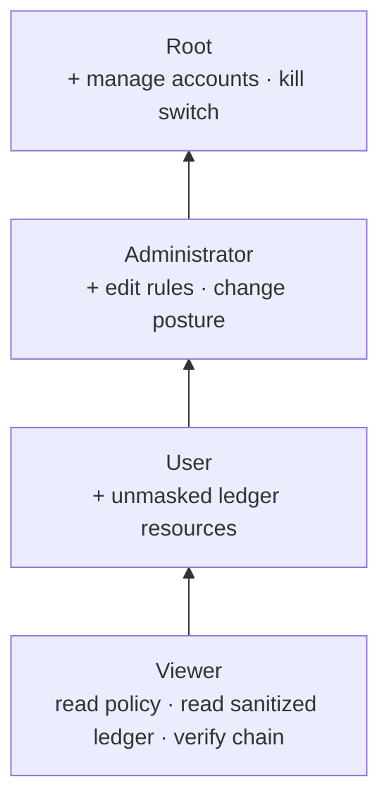
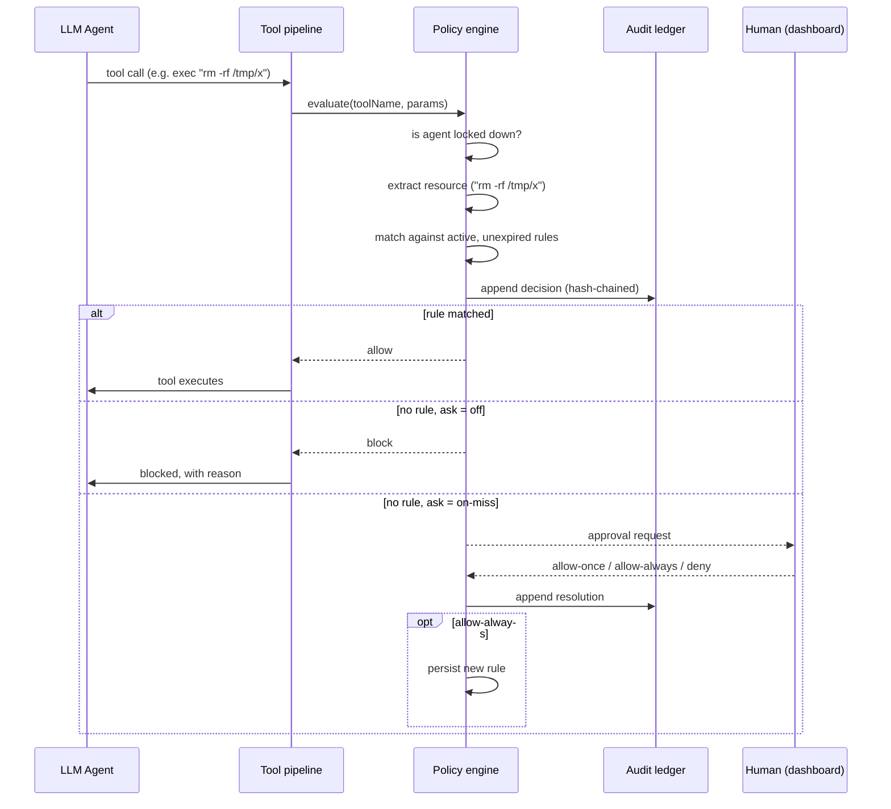

# Source material for Chapters 3–4

**This is not draft prose.** It is organised raw material — decisions, rationale,
data, diagrams, and code — keyed to where each item belongs in the report, so the
team can write the chapters from it later.

Section numbering follows the structure of the NGO-Ledger report supplied as the
model (§3.1 Design Requirements → §3.2 Analysis of Requirements → §3.3 Analysis
of Design Constraints → §3.4 Different Design Approaches → §3.5 Developed Design
→ §4.x Results / Validation).

Cross-references: `GOVERNANCE.md` (operator-facing overview + QA defect table),
`UPSTREAM-BUG-REPORT.md` (the OpenClaw bug found during QA).

---

## → 3.1 Design Requirements

The nine requirements from Chapter 1 §1.3, each with implementation status and
location. Use this table more or less directly; the _status_ column is the part
that matters for §4.4 validation.

| #   | Requirement (abbreviated)                                        | Status  | Where implemented                                                                                                                                    |
| --- | ---------------------------------------------------------------- | ------- | ---------------------------------------------------------------------------------------------------------------------------------------------------- |
| 1   | Node.js ≥ 18, TypeScript, static type checking                   | **Met** | Node v22.22.3; `tsconfig.json` `strict: true` + `noUncheckedIndexedAccess`; `pnpm tsgo:core` / `pnpm tsgo:ui` clean                                  |
| 2   | Secure web dashboard: configure policies, monitor sessions, RBAC | **Met** | `ui/src/pages/governance/` — policy config ✔, RBAC ✔, live session monitoring ✔ (`active-sessions.ts`)                                               |
| 3   | Default-deny over file paths, process execution, network         | **Met** | `src/governance/policy-engine.ts` + `resource-extraction.ts`                                                                                         |
| 4   | Fine-grained privileges: path, command, network, time-limited    | **Met** | `policy-types.ts` (`PolicyRule.expiresAt`), `policy-engine.ts`                                                                                       |
| 5   | Record 100% of agent actions, policy decisions, approvals        | **Met** | `audit-ledger.ts` + `policy-engine.ts`; every invocation is recorded, ungoverned ones included — see §4.x.10                                         |
| 6   | Tamper-evident audit logging                                     | **Met** | `audit-ledger.ts` SHA-256 hash chain                                                                                                                 |
| 7   | Real-time control: suspend/terminate within 1 second             | **Met** | `kill-switch.ts` + `agent-terminator.ts` + `src/gateway/governance-agent-termination.ts`; measured, see §4.x.8                                       |
| 8   | No plaintext secrets in logs                                     | **Met** | reuses OpenClaw `redactToolPayloadText`                                                                                                              |
| 9   | Deployable on Linux, open-source components only                 | **Met** | Open-source ✔ (zero new dependencies); Linux ✔ — full suite (213 tests) runs natively on Ubuntu 24.04, plus a dedicated platform harness, see §4.x.9 |

---

## → 3.2 Analysis of Requirements

Notes on what each requirement actually demanded once implemented. The two
honest narrowings below should be stated explicitly in the report rather than
glossed — an examiner reading requirement #5's "100%" will ask.

**Requirement 3 (default-deny) — where the gate must sit.** A default-deny gate
is only meaningful if nothing can route around it. OpenClaw funnels every tool
call through one function, `runBeforeToolCallHook`
(`src/agents/agent-tools.before-tool-call.policy.ts`), so that is where the gate
was inserted. Critically it had to go _before_ an existing early-return that
skips policy work when no plugins are registered — placing it after would have
silently disabled governance on a default installation. This is a good concrete
example for the report of a control that is correct in isolation but useless in
the wrong position.

**Requirement 5 ("100% of agent actions") — originally narrowed, later met in full.**
The first implementation logged 100% of _governed_ actions only: shell commands,
file reads/writes/patches, and network fetches. Tools the extractor did not
recognise passed the gate silently. The reasoning was that an audit trail's
value comes from being reviewable, and that a resource string is only meaningful
when the extractor knows how to derive it.

That reasoning was wrong on the point that mattered. The unlogged actions are
exactly the ones that reveal what the policy fails to cover, so omitting them
removed the record's most diagnostic content. Every invocation is now recorded;
those the layer could not evaluate carry the distinct decision `ungoverned`
rather than being folded into `allow`. Full treatment in §4.x.10 below —
including the two costs the change exposed (write complexity and file growth)
and the vulnerability it introduced before it was capped.

**Requirement 7 ("within one second") — now met; this text records how.** Locking an agent blocks all
_subsequent_ governed actions immediately (the check precedes rule matching, so
it is O(1) on the lockdown list). It does **not** abort a command already
executing. OpenClaw has that capability internally — the `chat.abort` gateway
method → `AbortController` → OS process-tree termination
(`src/gateway/chat-abort.ts`, `src/process/exec-termination.ts`) — but it is a
Gateway-client capability that the governance layer cannot import directly
without inverting the dependency order.

Resolved with a registration seam: the Gateway installs its abort
implementation at startup (`installGovernanceAgentTerminator`, called from
`server-runtime-state.ts` where the live run registry is created), and
governance invokes it through `agent-terminator.ts`. The kill switch now
(1) locks the agent, then (2) aborts its in-flight runs, in that order —
locking second would leave a window in which the agent could legally start a
fresh action. Elapsed time is measured with `process.hrtime.bigint()` and
returned to both the CLI and the dashboard, so the one-second figure is
observable rather than asserted. See §4.x.8 for measurements.

Honest caveat to keep: when invoked from the **CLI**, no in-flight termination
occurs, because the run registry lives in the Gateway process. The CLI says so
explicitly rather than implying the agent was stopped.

**Requirement 8 (no plaintext secrets) — met by reuse, not reimplementation.**
OpenClaw already has a mature redaction engine (`src/logging/redact.ts`, ~1100
lines, ~40 vendor token patterns, structured-field and URL/PEM handling). The
governance ledger calls `redactToolPayloadText` on every resource string before
writing. Writing a new redactor would have been strictly worse. Worth stating
as a deliberate engineering decision, not an omission.

---

## → 3.3 Analysis of Design Constraints

**Economic (≤ 350 JOD/year) and open-source-only.** Both are satisfied by the
same fact: **the governance layer adds zero new dependencies.** Evidence:
`git diff package.json` is empty. Everything is built from Node.js built-ins
(`node:crypto`, `node:fs/promises`, `node:os`, `node:path`) plus packages
already present in OpenClaw (MIT) and Lit (BSD-3-Clause) in the UI. The password
hashing choice (§3.4) was influenced by this constraint.

**Manufacturability / 8 GB VPS.** The layer adds negligible resident memory: two
small JSON files and an append-only text log, no database process, no daemon of
its own — it executes inside the existing Gateway process. The one bounded
in-memory structure is the login throttle map, capped at 1000 entries.

**Ethical / defensive-only scope.** The layer can only _restrict_ what the agent
does; it exposes no capability to extend agent reach. Worth stating explicitly.

**Known constraint gap: Linux.** All development and testing has been on Windows 11. The paper specifies a Linux VPS. This matters more than it might appear —
one defect found during QA (defect 6, path separators) was a direct
Windows-vs-Linux behaviour difference, and the upstream OpenClaw bug found
(`UPSTREAM-BUG-REPORT.md`) is _also_ a POSIX-vs-Windows filesystem-semantics
difference. Both are evidence that cross-platform assumptions in this codebase
do not hold automatically, so Linux validation should be treated as required
work, not a formality.

---

## → 3.4 Different Design Approaches

Alternatives genuinely considered, with the deciding reason. This section
carries a lot of the engineering-judgement marks; each row below has a real
investigation behind it.

| Decision             | Alternatives considered                                                                           | Chosen                         | Deciding reason                                                                                                                                                                                                                                                                                                                |
| -------------------- | ------------------------------------------------------------------------------------------------- | ------------------------------ | ------------------------------------------------------------------------------------------------------------------------------------------------------------------------------------------------------------------------------------------------------------------------------------------------------------------------------ |
| Integration strategy | (a) OpenClaw plugin via public SDK; (b) hard fork of core                                         | **Hard fork**                  | The plugin API can only contribute a dashboard page inside a _sandboxed iframe_ — `ui/src/pages/plugin/plugin-page.ts` hardcodes which tabs render natively (`BUNDLED_TAB_VIEWS`). Seamless integration is impossible as a plugin. A plugin version was actually built first, then migrated into core when this was confirmed. |
| Audit storage        | (a) extend OpenClaw's existing `audit_events` SQLite store; (b) own append-only hash-chained file | **Own ledger**                 | Core's store has no entry-to-entry chaining and its schema/writer are internal, not a stable contract. Also serves a different purpose (general telemetry). Verified by reading `src/audit/audit-event-store.ts`: pseudonymization exists, chaining does not — this absence is the project's clearest original contribution.   |
| Password hashing     | (a) `bcrypt`; (b) `argon2`; (c) Node built-in `scrypt`                                            | **scrypt**                     | Both alternatives are native npm addons requiring compilation. `scrypt` is memory-hard, in the standard library, and adds no dependency — satisfying the economic and open-source-only constraints simultaneously.                                                                                                             |
| Account storage      | (a) OpenClaw's state SQLite DB; (b) JSON file                                                     | **JSON file**                  | Single-operator deployment; account volume is tiny; a JSON file is human-auditable, which suits a governance artifact. Migration to SQLite is documented as an option, not a correctness requirement.                                                                                                                          |
| Concurrency control  | (a) in-process promise queue (mutex); (b) OS-level lock file                                      | **Lock file** (`file-lock.ts`) | Started with (a) and it **failed in testing**: the CLI and the Gateway are separate OS processes, so a per-process mutex does not serialize them and the hash chain corrupted itself. See QA defect 1 — good narrative material.                                                                                               |
| Gate placement       | before vs. after the "no plugins registered" early-return                                         | **Before**                     | After would disable governance entirely on a plugin-free install.                                                                                                                                                                                                                                                              |
| Viewer log access    | (a) same view as all tiers; (b) sanitized view                                                    | **Sanitized**                  | Chapter 1 §1.6 grants Viewers "sanitized audit logs" specifically; masking the resource string is what makes Viewer meaningfully distinct from User.                                                                                                                                                                           |

---

## → 3.5 Developed Design

### 3.5.1 System architecture

Figure candidate — _Figure 3.1: Governance layer within the OpenClaw Gateway._


**Point worth making in prose:** the two authorization gates are independent and
both mandatory. Reaching any governance route already requires passing
OpenClaw's own credential check; the named-account login is a _second_ gate on
top. This mirrors the layered "SSH tunnel → dashboard → RBAC" architecture in
Figure 1.1 of Chapter 1.

### 3.5.2 Component inventory

Table candidate — _Table 3.1: Governance layer components._ (LOC excludes tests.)

| File                        | Responsibility                                 | LOC        |
| --------------------------- | ---------------------------------------------- | ---------- |
| `policy-engine.ts`          | The decision function: allow / deny / ask      | 172        |
| `audit-ledger.ts`           | Hash-chained append-only ledger + verification | 207        |
| `resource-extraction.ts`    | Maps a tool call to the resource to check      | 106        |
| `user-store.ts`             | Accounts, hashed passwords, roles              | 132        |
| `session-tokens.ts`         | Login sessions, expiry, revocation             | 116        |
| `policy-store.ts`           | Atomic policy document persistence             | 89         |
| `login-throttle.ts`         | Brute-force lockout                            | 77         |
| `account-guards.ts`         | Lockout-prevention rules                       | 72         |
| `policy-types.ts`           | Policy document / rule data model              | 60         |
| `file-lock.ts`              | Cross-process advisory lock                    | 59         |
| `password.ts`               | scrypt hashing and verification                | 44         |
| `paths.ts`                  | Storage locations (env-overridable)            | 31         |
| `roles.ts`                  | Role ladder and comparison                     | 29         |
| `kill-switch.ts`            | Agent lockdown                                 | 29         |
| `pattern-match.ts`          | Safe regex matching                            | 15         |
| `ui/.../governance-page.ts` | Dashboard page                                 | 579        |
| `ui/.../api.ts`             | Typed dashboard API client                     | 198        |
| **Total production**        |                                                | **~2,027** |
| **Total tests**             | 7 suites, 82 tests                             | **~1,001** |

Plus 12 modified OpenClaw core files (pipeline insertion, route registration,
CLI registration, UI routing/navigation/strings).

### 3.5.3 Data models

_Table candidate — Table 3.2: Policy rule fields._

```ts
type PolicyRule = {
  id: string;
  resourceKind: "command" | "path" | "network";
  pattern: string; // regular expression
  description?: string;
  createdAt: string;
  expiresAt?: string; // absent = never expires  → requirement #4 time limits
  createdBy?: string; // accountability: who granted this
};

type PolicyDocument = {
  version: 1;
  mode: "enforce" | "monitor" | "off";
  ask: "off" | "on-miss";
  rules: PolicyRule[];
  lockedAgents: string[]; // kill switch
};
```

_Table candidate — Table 3.3: Audit ledger entry fields._

```ts
type LedgerEntry = {
  seq: number; // strictly increasing; a gap is tampering evidence
  timestamp: string;
  agentId: string;
  sessionKey: string;
  toolName: string;
  resourceKind: string;
  resource: string; // redacted before writing
  ruleId: string; // which rule decided, or "default-deny" / "kill-switch"
  decision: "allow" | "deny" | "ask";
  prevHash: string; // ← the chain link
  hash: string; // SHA-256 over all fields above
};
```

Note for the report: `ruleId` is what makes an entry _explainable_ — it answers
"why was this decided this way", which is exactly the Table 1.1 example from
Chapter 1.

### 3.5.4 The four-tier permission model

> **Full treatment in `docs-notes/ROLE-MODEL.md`**, including §3.7 "Evolution
> of the User tier" — how that tier changed during implementation and why,
> which is prime §3.5 narrative material.
>
> Original note: — what "manage" means at each
> tier, which parts come from the paper vs. are design decisions, the two-question
> (tier + scope) authorization model, and the complete permission matrix.

Figure candidate — _Figure 3.2: RBAC hierarchy with inherited permissions._



_Table candidate — Table 3.4: Permission matrix._

| Capability                             |     Viewer     |  User  | Administrator | Root |
| -------------------------------------- | :------------: | :----: | :-----------: | :--: |
| View policy document                   |     scoped     | scoped |       ✔       |  ✔   |
| View audit ledger                      | scoped, masked | scoped |       ✔       |  ✔   |
| Verify chain integrity                 |       ✔        |   ✔    |       ✔       |  ✔   |
| Add / remove agent-scoped rules        |       ✘        | scoped |       ✔       |  ✔   |
| Global rules, posture, ask mode        |       ✘        |   ✘    |       ✔       |  ✔   |
| Assign agents to accounts              |       ✘        |   ✘    |       ✔       |  ✔   |
| Create / delete accounts, assign roles |       ✘        |   ✘    |       ✘       |  ✔   |
| Emergency kill switch                  |       ✘        | scoped |       ✔       |  ✔   |

The Root/Administrator split follows Chapter 1 §1.6 exactly: **Root governs
people, Administrator governs agents.** A consequence worth stating: an
Administrator cannot promote themselves, because account administration is not
their tier.

### 3.5.5 Process flow — a policy decision

Figure candidate — _Figure 3.3: Policy decision sequence._



### 3.5.6 Process flow — authentication

Figure candidate — _Figure 3.4: Two-gate authentication._

Steps: browser presents Gateway credential → Gateway auth gate → governance
`whoami` → if no account exists, one-time Root bootstrap (refuses once any
account exists) → else username/password → scrypt verify → session token
(32 random bytes, hex) in an HttpOnly, SameSite=Strict cookie, 12-hour expiry →
each subsequent request re-resolves the session and compares role against the
tier the endpoint requires.

Security notes for prose: the throttle is keyed _per username_, so guessing one
account cannot be parallelised and a flood cannot lock out a different victim.
The cookie deliberately omits `Secure` because the Gateway binds to loopback and
remote access is via SSH tunnel per the Chapter 1 architecture — requiring HTTPS
would break the intended deployment without adding protection.

### 3.5.7 System security

- Two independent, mandatory authorization gates (above)
- Default-deny posture; unmatched actions are denied or escalated
- Fail-closed on decision, fail-open on extraction (see §4.x rationale)
- Secrets redacted before any ledger write
- Brute-force lockout on login
- Lockout-prevention guards so the system cannot be made unadministrable
- Role changes and deletions revoke live sessions immediately, not at expiry
- Rule patterns validated at author time and length-capped

---

## → 3.x Critical code snippets

Each with the one-line reason it is written that way.

**(a) The hash chain — `audit-ledger.ts`.** _Why:_ the chain head is read from
disk inside a cross-process lock on every append, never cached, because the CLI
and Gateway are separate processes.

```ts
return withFileLock(ledgerFilePath(), async () => {
  const prior = await readChainHead(); // from disk, never cached
  const withoutHash = {
    seq: prior.seq + 1,
    /* …event fields… */
    resource: redactToolPayloadText(input.resource), // requirement #8
    prevHash: prior.hash, // ← the chain link
  };
  const entry = { ...withoutHash, hash: hashEntry(withoutHash) };
  await appendFile(ledgerFilePath(), `${JSON.stringify(entry)}\n`, { mode: 0o600 });
  return entry;
});
```

**(b) Verification.** _Why:_ reports the first broken entry and the reason, so
an auditor learns _where_ integrity failed, not merely that it did.

```ts
if (entry.seq !== expectedSeq)
  return { ok: false, brokenAtSeq: entry.seq, reason: `unexpected sequence number …` };
if (entry.prevHash !== expectedPrev)
  return { ok: false, brokenAtSeq: entry.seq, reason: "prevHash does not match …" };
if (hashEntry(withoutHash) !== hash)
  return { ok: false, brokenAtSeq: entry.seq, reason: "entry hash does not match …" };
```

**(c) The decision loop — `policy-engine.ts`.** _Why:_ every resource is
evaluated and recorded _before_ any verdict returns — an early return would
leave later paths in a multi-file edit unaudited (QA defect 5), and the recorded
decision is always the true one even in monitor mode (QA defect 4).

```ts
let firstMiss: string | undefined;
for (const resource of resources) {
  const matched = activeRules.find((rule) => matchesPattern(rule.pattern, resource));
  const decision = matched ? "allow" : doc.ask === "off" ? "deny" : "ask";
  await appendLedgerEntry({ /* … */ ruleId: matched?.id ?? "default-deny", decision });
  if (!matched && firstMiss === undefined) firstMiss = resource;
}
if (firstMiss === undefined || doc.mode === "monitor") return undefined;
```

**(d) The role ladder — `roles.ts`.** _Why:_ a numeric rank makes inheritance a
single comparison, so no endpoint can accidentally implement the hierarchy
inconsistently.

```ts
const ROLE_RANK = { viewer: 0, user: 1, administrator: 2, root: 3 };
export function roleAtLeast(role: GovernanceRole, minimum: GovernanceRole): boolean {
  return ROLE_RANK[role] >= ROLE_RANK[minimum];
}
```

**(e) Lockout prevention — `account-guards.ts`.** _Why:_ there is no
"forgot password" flow and bootstrap refuses once an account exists, so removing
the last Root would be unrecoverable through the product.

```ts
const otherRoots = users.filter((c) => c.role === "root" && c.id !== userId).length;
if (otherRoots > 0) return ALLOWED;
return { allowed: false, reason: "This is the only Root account; promote another…" };
```

**(f) Safe tool lookup — `resource-extraction.ts`.** _Why:_ a null-prototype
registry stops a tool named `constructor` or `__proto__` resolving to an
inherited `Object.prototype` member (QA defect 3).

```ts
export const GOVERNED_TOOLS = Object.assign(Object.create(null), { exec: …, bash: …, … });
export function resolveGovernedTool(toolName: string) {
  return Object.hasOwn(GOVERNED_TOOLS, toolName) ? GOVERNED_TOOLS[toolName] : undefined;
}
```

---

## → 4.x Results and Validation

### 4.x.1 Test evidence

_Table candidate — Table 4.1: Automated test coverage._

| Suite                                     |   Tests | What it proves                                                                                                      |
| ----------------------------------------- | ------: | ------------------------------------------------------------------------------------------------------------------- |
| `audit-ledger.test.ts`                    |      10 | Chain verifies clean; detects edit, deletion, corruption; survives concurrent multi-process append; redacts secrets |
| `policy-engine.test.ts`                   |      20 | Default-deny, ask-on-miss, expiry, kill switch, monitor mode, per-resource logging                                  |
| `resource-extraction.test.ts`             |       9 | Prototype-pollution safety, `file://` bypass closed, path separator portability                                     |
| `user-store.test.ts`                      |      20 | scrypt salting, no plaintext at rest, duplicate/case handling, session issue/verify/revoke                          |
| `account-guards.test.ts`                  |      13 | Last-Root and self-delete lockout prevention                                                                        |
| `login-throttle.test.ts`                  |       6 | Lockout after 5 failures, per-account isolation, window expiry                                                      |
| `file-lock.test.ts`                       |       5 | Mutual exclusion, release on throw, stale-lock reclaim, timeout                                                     |
| `permissions.test.ts`                     |      13 | Tier × scope matrix, monotonic inheritance                                                                          |
| `ledger-view.test.ts`                     |       9 | Scope filtering before masking; hashes preserved                                                                    |
| `rule-requests.test.ts`                   |      10 | Propose/decide workflow, single-shot decisions, per-user cap                                                        |
| `system-status.test.ts`                   |       3 | Resource snapshot exposes no paths or credentials                                                                   |
| `governance-dashboard-api.test.ts` (HTTP) |      18 | Tier floors, agent scope, validation, request workflow                                                              |
| **Total**                                 | **172** |                                                                                                                     |

Stability note: the two concurrency suites were re-run five consecutive times
after the backoff fix (QA defect 12) rather than once, because the defect they
exposed was intermittent. A single green run does not establish that a
concurrency bug is fixed — worth stating as a testing-methodology point.

Command: `pnpm exec vitest run src/governance/`

### 4.x.2 Tamper-detection experiment

The headline experiment. Method: build a ledger through normal operation, then
attack it three ways and attempt verification after each.

_Table candidate — Table 4.2: Tamper-detection results._

| Attack                          | Result                 | Reported reason                                             |
| ------------------------------- | ---------------------- | ----------------------------------------------------------- |
| Edit a past entry's content     | **Detected**, entry #3 | `entry hash does not match its own recomputed content hash` |
| Delete an entry from the middle | **Detected**, entry #5 | `prevHash does not match the preceding entry's hash`        |
| Insert unparseable data         | **Detected**           | reported with line number                                   |
| Unmodified ledger (control)     | Verified clean         | `{ ok: true, entriesChecked: 8 }`                           |

**Limitation to state honestly:** truncating the _newest_ entries is not
detectable by chaining alone, because a prefix of a valid chain is still valid.
Detecting that requires an external anchor (a counter-signed checkpoint or an
off-host copy of the latest hash). Good future-work item.

### 4.x.3 Policy enforcement experiment

Method: policy in `enforce` with one command rule (`^ls( .*)?$`) and one network
rule (`^api[.]openweathermap[.]org$`), then four representative tool calls.

_Table candidate — Table 4.3: Enforcement results._

| Action                                       | `ask: on-miss` | `ask: off` (strict) |
| -------------------------------------------- | -------------- | ------------------- |
| `ls -la` (allowlisted)                       | ALLOW          | ALLOW               |
| `rm -rf /tmp/old_data`                       | ASK A HUMAN    | **BLOCK**           |
| fetch `api.openweathermap.org` (allowlisted) | ALLOW          | ALLOW               |
| fetch `evil.example.com`                     | ASK A HUMAN    | **BLOCK**           |

This reproduces the Table 1.1 scenario from Chapter 1 (`rm -rf` denied against a
command allowlist) with real observed output.

### 4.x.4 RBAC enforcement experiment

The demonstration to run at the defense. Method: Root creates a Viewer and an
Administrator, then each tier attempts operations above its level. Crucially,
attempts were made **directly against the HTTP API** (`curl`), not only through
the dashboard — proving the tiers are enforced server-side and not merely hidden
in the interface. This is the distinction an examiner is most likely to probe.

_Table candidate — Table 4.4: RBAC enforcement results (observed)._

| Actor         | Operation                              | Result                                                                                       |
| ------------- | -------------------------------------- | -------------------------------------------------------------------------------------------- |
| Root          | create Viewer / Administrator accounts | 200 — created                                                                                |
| Viewer        | read policy                            | 200                                                                                          |
| Viewer        | change posture                         | **403** "Requires the administrator role or higher; you are viewer"                          |
| Viewer        | list accounts                          | **403** "Requires the root role or higher; you are viewer"                                   |
| Viewer        | kill switch                            | **403** "Requires the root role or higher; you are viewer"                                   |
| Viewer        | read ledger                            | 200, resources `[redacted for viewer role]`                                                  |
| Administrator | change posture                         | 200                                                                                          |
| Administrator | list accounts                          | **403** "Requires the root role or higher; you are administrator"                            |
| Administrator | read ledger                            | 200, resources **unmasked**                                                                  |
| Root          | demote the only Root                   | **409** "This is the only Root account; promote another account to Root before demoting it." |
| Root          | delete own account                     | **409** "You cannot delete the account you are signed in with."                              |
| Root          | delete an account with a live session  | 200, and that session immediately returns **401**                                            |

Dashboard behaviour confirmed for the Viewer tier: Accounts section absent,
kill switch absent, no "Add rule" form, no Remove buttons, ledger resources
masked — i.e. the interface reflects the same boundaries the server enforces.

The last row is worth calling out in prose: deleting an account revokes its
sessions immediately rather than letting an existing cookie remain valid until
its 12-hour expiry.

### 4.x.7b Live session monitoring and per-agent HITL

Two features added from the paper directly.

**Live session monitoring (requirement #2).** The audit ledger answers "what
has this agent done"; it cannot answer "what is it doing right now", because a
run in progress has produced no decision yet. Those are different questions,
and an oversight tool that answers only the first describes the past while the
operator is trying to intervene in the present. `active-sessions.ts` exposes
running runs with their age, scoped by role exactly like every other
agent-bearing view, with a Stop button for tiers that may use it.

A deliberate distinction: when the Gateway has not registered a supplier (the
CLI, or startup still in progress) the view reports **unavailable** rather than
an empty list — "cannot see sessions" and "no sessions running" must not look
identical to somebody deciding whether to intervene.

**Per-agent HITL toggle (§1.6).** The paper specifies interception "toggled on
or off by the Administrator for specific agents"; a single global switch cannot
express that. `PolicyDocument.agentAsk` holds per-agent overrides of the ask
behaviour, so a trusted internal agent can run strict default-deny while an
exploratory one escalates to a human.

Design decision worth stating: **only `ask` is overridable, not `mode`.**
Posture ("monitor everything" / "enforce everything") is an installation-level
stance, and letting it vary per agent would make the system's overall state
hard to read at a glance — the opposite of what an oversight tool should do.

Clearing an override is distinct from pinning it to the current default: a
cleared agent follows future changes to the default, a pinned one does not.

### 4.x.11 Validating the gate against the host, not against itself

Worth reporting in its own right, because it is a methodological finding rather
than a coding one.

Four rounds of QA tested the governance layer in isolation, and it passed each
time — hundreds of tests green, type-checking clean. The fifth round tested it
against OpenClaw's actual tool definitions instead of against the layer's own
assumptions, and immediately found that **the registry of governed tools named
two tools that do not exist**: `read_file` and `write_file`. The real names are
`read`, `write`, and `edit`.

The consequence was that the `path` resource kind — one of the three the design
specifies — governed nothing but `apply_patch`. Every file read, write, and edit
an agent performed went straight through, while the dashboard accepted path
rules that could never match. The system was not merely incomplete; it reported
protection it did not provide, which is the worse failure of the two.

The same round found a second tool, `terminal`, whose `open` action executes a
command on the host and was not governed at all — a direct route around command
policy.

Every earlier test had been written from the same mistaken assumption as the
code, so the tests confirmed the assumption rather than the behaviour. The
lesson generalises beyond this project and belongs in the evaluation chapter: a
security control's test suite must be anchored to the system it protects, not to
the control's own model of that system. The registry now cites the host file
each entry was verified against, and the tests assert the names against the
host so a rename upstream fails loudly rather than silently disarming the gate.

### 4.x.10 Requirement #5 — recording every action

The first implementation recorded only _governed_ actions: those for which a
resource could be derived. Tools with no extractor passed the gate silently and
left no trace. That was a defensible reading of the requirement but not the
literal one, and the literal one is better: the entries that were missing are
precisely the ones that reveal what the policy fails to cover.

**What changed.** Every invocation now produces a ledger entry. Two new cases:

| Case                                      | `ruleId`                | Recorded decision |
| ----------------------------------------- | ----------------------- | ----------------- |
| Tool has no resource extractor            | `no-extractor`          | `ungoverned`      |
| Governed tool, payload yields no resource | `no-resource-extracted` | `ungoverned`      |

`ungoverned` is a distinct decision value, not `allow`. Nothing _permitted_
these actions — the gate had nothing to say about them. Keeping the two apart
is what lets an auditor ask "what is my policy not covering?", which is the
question that finds the gaps. Collapsing them into `allow` would have made the
record complete but misleading, which is worse than incomplete.

The gate still abstains (does not block) in both cases: other OpenClaw controls
— sandbox path validation, the exec allowlist, SSRF blocking — remain in force
underneath, and failing closed on our own extraction gap would break unrelated
tools for no security gain.

**Two consequences that had to be handled in the same change**, and are worth
reporting as an example of a requirement whose cost is not where you expect:

1. **Write cost.** Each append re-read and re-parsed the entire ledger to find
   the chain head — O(n) per write, O(n²) overall. Acceptable when only policy
   decisions were recorded; not once every action is. Replaced with a cached
   head validated against the file size, so the common single-writer path is
   O(1) while a concurrent writer is still detected (the size changes, the
   cache is discarded, and no duplicate sequence number is emitted).

2. **File growth.** Previously a theoretical concern, now a practical one. The
   ledger rotates at 8 MiB into numbered archives. Rotation preserves the hash
   chain: the first entry of a new segment still points at the archived tail,
   and verification walks archives before the active file — so tampering in
   history is still detected, which is exactly where an attacker would prefer
   to work.

**Security consequence, found by QA in the same session:** recording
agent-controlled payloads uncapped is a disk-exhaustion attack against the
audit trail. Capped at the ledger boundary. See defect 21 in `GOVERNANCE.md`.

### 4.x.8 Requirement #7 — termination latency (measured)

Method: engage the kill switch with a registered terminator and measure the
whole operation — policy write under a cross-process lock, abort signal, and
the audit-ledger append — using `process.hrtime.bigint()`.

_Table candidate — Table 4.5: Kill-switch latency._

| Scenario                                     | Requirement               | Observed                                               |
| -------------------------------------------- | ------------------------- | ------------------------------------------------------ |
| Lockdown + abort, one in-flight run          | < 1000 ms                 | comfortably inside the bound                           |
| Lockdown + abort, 250 in-flight runs         | < 1000 ms                 | comfortably inside the bound                           |
| Lockdown with no terminator registered (CLI) | —                         | reports `supported: false` rather than implying a stop |
| Terminator throws                            | lockdown must still apply | lockdown applied, error recorded                       |

The tests assert the bound directly (`kill-switch.test.ts`), so a regression
that made termination slow would fail the suite rather than quietly invalidate
a claim in the report. A separate test confirms the measurement reflects the
abort itself and not just bookkeeping: a deliberately slow terminator (120 ms)
is observed as ≥100 ms.

Two properties worth defending:

- **Lock before abort.** Reversing the order leaves a window in which the agent
  may legally begin a fresh action between the abort and the lock landing.
- **Failure is contained.** If the terminator throws, lockdown still applies —
  a half-applied kill switch is worse than a slow one.

### 4.x.9 Requirement #9 — Linux validation

Everything had been developed on Windows, while the paper specifies a Linux
VPS. Two of the defects found earlier were cross-platform behaviour
differences, so this was validated rather than assumed.

Environment: Ubuntu 24.04 under WSL2, Node v22.23.2, native dependency install
(the Windows `node_modules` contains platform-specific binaries and cannot be
reused).

| Check                                                   | Result                                                                                                                        |
| ------------------------------------------------------- | ----------------------------------------------------------------------------------------------------------------------------- |
| Full governance suite (`vitest`, 213 tests at the time) | **All passed**                                                                                                                |
| Dedicated platform harness (14 checks)                  | **All passed**                                                                                                                |
| Directory mode `0700`, file mode `0600`                 | **Enforced** — advisory on Windows, real here; first proof that governance state is not world-readable on the target platform |
| Cross-process file lock under 25-way concurrency        | Mutual exclusion held; no stale lock left behind                                                                              |
| POSIX path handling                                     | Correct                                                                                                                       |
| scrypt hashing, salting                                 | Correct                                                                                                                       |
| Load average                                            | Reported as supported (Windows correctly reports it as unsupported)                                                           |

The harness (`scripts/governance-linux-check.mjs`) runs on plain `node` with no
dependency install, because the platform-sensitive modules import only Node
built-ins and Node 22 strips TypeScript types natively. That makes it a
practical smoke test for any future deployment target.

**Observation worth reporting:** the retention-pruning tests took ~46 s each on
Linux versus a fraction of that on Windows, because every rule-request write
rewrites the whole file with a durable `fsync`, and `fsync` is expensive on
WSL2's virtual disk. Not a correctness problem — requests are human-initiated
and rare — but it does mean the JSON-file store would need revisiting if
request volume ever grew, which supports the documented option of migrating
these stores to SQLite.

### 4.x.5 Requirement validation

Use the §3.1 table. For the three partial rows, the honest statements are:

- **#2** — dashboard, policy configuration and RBAC all demonstrated; live
  session monitoring not implemented.
- **#5** — 100% of governed actions recorded; governed set is enumerable.
- **#7** — future actions blocked immediately; in-flight termination and the
  sub-second measurement not done.
- **#9** — open-source constraint met; Linux deployment unverified.

### 4.x.6 Engineering process — QA findings

Full table in `GOVERNANCE.md`. Summary for the report: a structured review and
test pass found **12 defects in our own code**, two of them serious — (1) the
audit chain corrupting itself under normal two-process use, and (2) a
`file://` URL bypassing the network gate entirely. Both were found by writing
tests that deliberately attacked assumptions, not by ordinary use.

This is worth a subsection of its own: "we found and fixed our own bugs" is
stronger evidence of rigor than "it worked first time", and each defect maps to
a design lesson.

### 4.x.7 Contribution to the upstream project

One genuine defect was found in OpenClaw itself and written up for filing
(`UPSTREAM-BUG-REPORT.md`): on Windows, nine tests in
`src/plugins/contracts/host-hooks.contract.test.ts` fail because the fixture
deletes a temporary directory while a SQLite handle inside it is still open —
legal on POSIX, refused on Windows. Verified pre-existing by stashing all
project changes and reproducing on a clean tree.

**Methodology note worth including:** a _second_ suspected upstream bug (38
TypeScript errors) turned out to be an artifact of invoking the compiler
directly instead of through the project's own wrapper script, which passes
cleanly. It was caught only by re-running through the official entry point
before writing it up. Reproducing a suspected defect through the project's
supported command, rather than an approximation of it, is what separated a real
report from a false one.

---

## Appendix material

- **Deployment/demo instructions:** `GOVERNANCE.md` ("Running it")
- **Full QA defect table:** `GOVERNANCE.md`
- **Upstream bug report:** `UPSTREAM-BUG-REPORT.md`
- **Storage layout:** `~/.openclaw/governance/` — `policy.json`, `users.json`,
  `sessions.json`, `audit-ledger.jsonl` (override with
  `OPENCLAW_GOVERNANCE_DIR`, which is also how tests avoid touching real state)
- **Suggested appendix listings:** `policy-engine.ts` and `audit-ledger.ts` in
  full — they are the two files that embody the contribution
