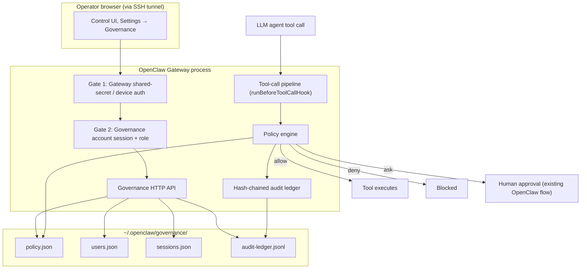
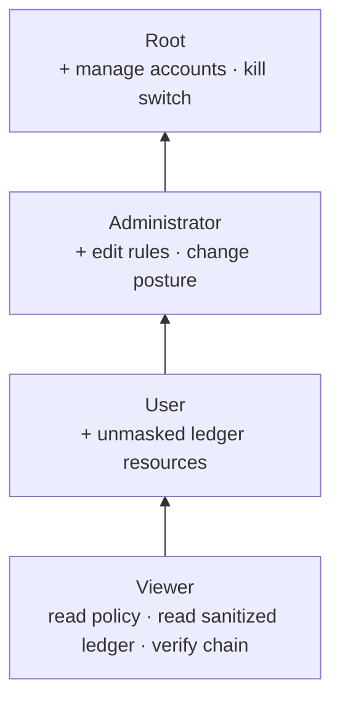
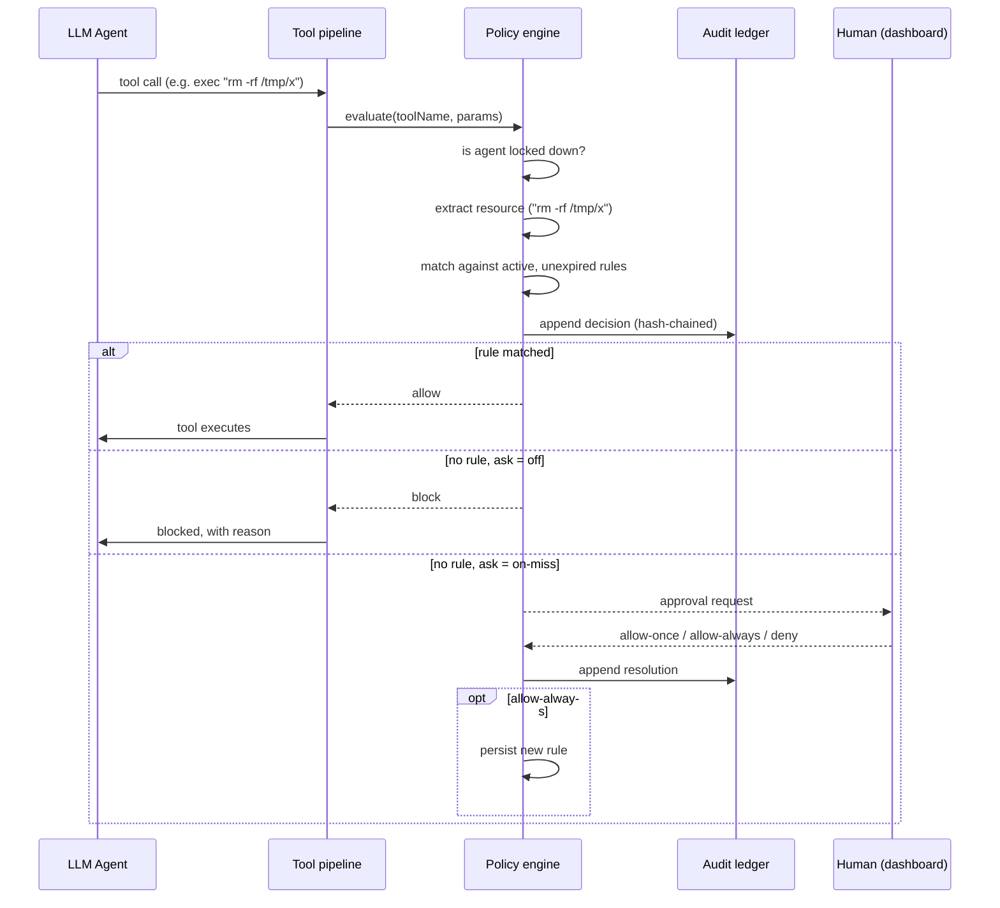
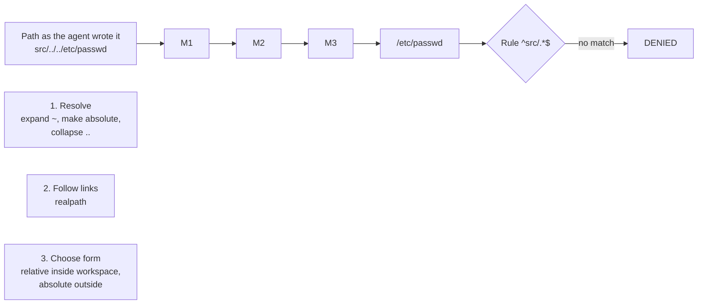
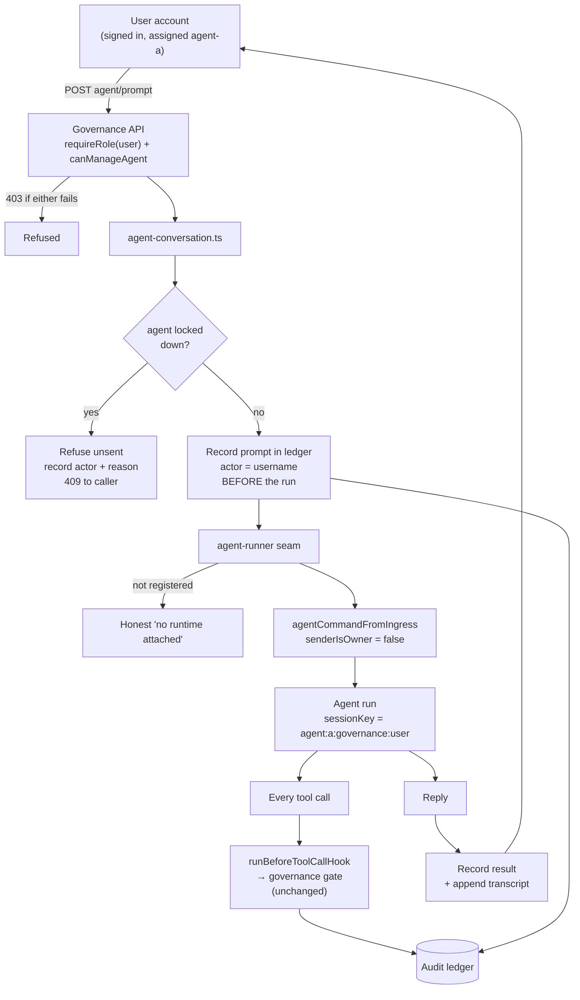
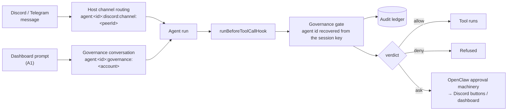
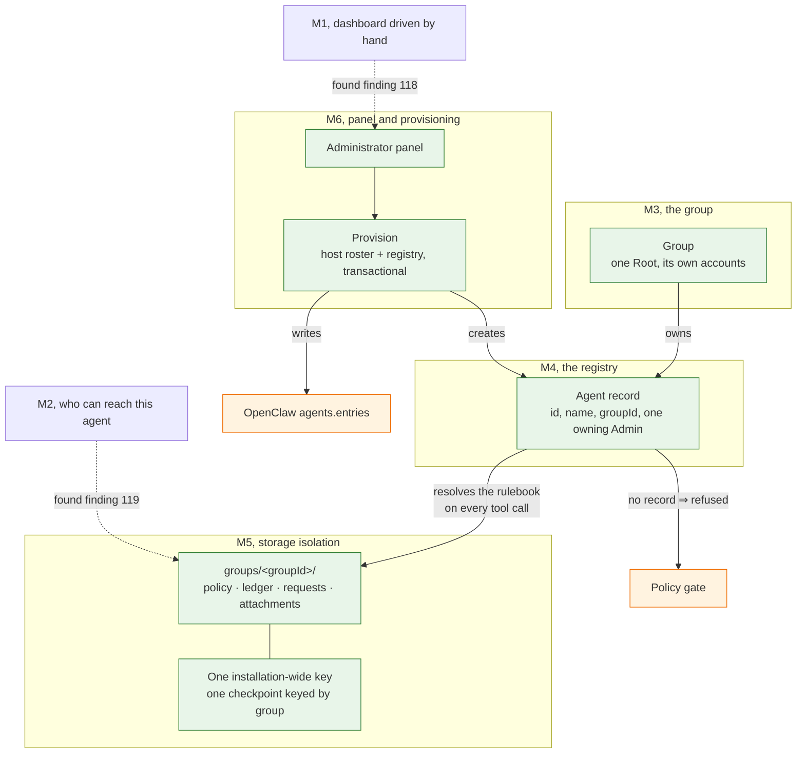

# Source material for Chapters 3–4

**This is not draft prose.** It is organised raw material, decisions, rationale,
data, diagrams, and code, keyed to where each item belongs in the report, so the
team can write the chapters from it later.

Section numbering follows the structure of the NGO-Ledger report supplied as the
model (§3.1 Design Requirements → §3.2 Analysis of Requirements → §3.3 Analysis
of Design Constraints → §3.4 Different Design Approaches → §3.5 Developed Design
→ §4.x Results / Validation).

Cross-references: `GOVERNANCE.md` (operator-facing overview + QA defect table),
`UPSTREAM-BUG-REPORT.md` (the OpenClaw bug found during QA).

> **Newest material, 2026-09-02:** §3.1's requirements table was re-verified by
> **running** each requirement rather than re-reading its row, and carries the
> evidence for each. §3.5.71–3.5.74 are the last four sweeps' results, and
> §3.5.73–3.5.74 are the two worth taking into §4's methodology discussion: why
> the sampling axis was changed once the module pool closed, and why a
> performance property asserted in wall-clock time is asserted against the host
> rather than the code.

---

## → 3.1 Design Requirements

The nine requirements from Chapter 1 §1.3, each with implementation status and
location. Use this table more or less directly; the _status_ column is the part
that matters for §4.4 validation.

| #   | Requirement (abbreviated)                                        | Status            | Where implemented                                                                                                                                                                                                                                                                                                                                                                                                                                                                                                                                                                                                                                                                                                                                                                                                                                                                                                                                                                                                                                                                                                                                                                                                                                                                                                                                                                                                                                                                                                                                                                                                                                                                                                                                                                                                        |
| --- | ---------------------------------------------------------------- | ----------------- | ------------------------------------------------------------------------------------------------------------------------------------------------------------------------------------------------------------------------------------------------------------------------------------------------------------------------------------------------------------------------------------------------------------------------------------------------------------------------------------------------------------------------------------------------------------------------------------------------------------------------------------------------------------------------------------------------------------------------------------------------------------------------------------------------------------------------------------------------------------------------------------------------------------------------------------------------------------------------------------------------------------------------------------------------------------------------------------------------------------------------------------------------------------------------------------------------------------------------------------------------------------------------------------------------------------------------------------------------------------------------------------------------------------------------------------------------------------------------------------------------------------------------------------------------------------------------------------------------------------------------------------------------------------------------------------------------------------------------------------------------------------------------------------------------------------------------ |
| 1   | Node.js ≥ 18, TypeScript, static type checking                   | **Met**           | Node v22.22.3; `tsconfig.json` `strict: true` + `noUncheckedIndexedAccess`; `pnpm tsgo:core` / `pnpm tsgo:ui` clean                                                                                                                                                                                                                                                                                                                                                                                                                                                                                                                                                                                                                                                                                                                                                                                                                                                                                                                                                                                                                                                                                                                                                                                                                                                                                                                                                                                                                                                                                                                                                                                                                                                                                                      |
| 2   | Secure web dashboard: configure policies, monitor sessions, RBAC | **Met**           | `ui/src/pages/governance/`, policy config ✔, RBAC ✔, live session monitoring ✔ (`active-sessions.ts`), per-agent posture ✔, prompting an assigned agent ✔ (§3.5.11), and Root's deployment/network oversight ✔ (§3.5.14), the last unimplemented clause of the §1.6 role definitions. The per-agent monitor toggle was **not** reachable from any surface until the eleventh QA pass; a policy tier settable only from code does not satisfy "configure policies". See §4.x.18. **Root can also delete the whole organisation from here (T44, §3.5.67)**, which is the account surface completing itself: every other account act was already on the page, and the one that removes Root's own was refused with a message pointing nowhere. **Two dashboard controls were found not to work at all in the same week (findings 197, 200)**, demoting an Administrator returned a 500 every time, and an agent assignment typed in a different case was saved and never consulted, which is worth this row carrying, because "the dashboard can do X" is a claim about a control an operator can actually complete                                                                                                                                                                                                                                                                                                                                                                                                                                                                                                                                                                                                                                                                                                         |
| 3   | Default-deny over file paths, process execution, network         | **Met**           | The _decision_ was always correct; the _coverage_ was one seventh of the host until the thirteenth pass measured it and the fixes closed it. `src/governance/policy-engine.ts` + `resource-extraction.ts`; path confinement enforced by canonicalisation (`path-normalize.ts`, §3.5.8) rather than pattern filtering. Validated §4.x.13. Hostnames canonicalised on the same principle, and coverage extended to `grep`/`find`/`ls` and the `terminal` tool's input channel. See §4.x.18. **The thirteenth pass counted the surface against the host's own `tool-catalog.ts`, 7 of its 52 tools were governed, and closed it: 18 are now governed and the other 34 carry a written reason in `DELIBERATELY_UNGOVERNED` (§4.x.20).** Every control surface that reaches the OS is default-denied: `process` (the second command channel into a running shell), `computer`/`screen`/`browser`/`mobile_ui` (desktop and device control), `nodes`, `gateway`, `automations`, `sessions_spawn`, `subagents`, `code_execution`. Residual: search tools are governed at their root only                                                                                                                                                                                                                                                                                                                                                                                                                                                                                                                                                                                                                                                                                                                                         |
| 4   | Fine-grained privileges: path, command, network, time-limited    | **Met**           | `policy-types.ts` (`PolicyRule.expiresAt`), `policy-engine.ts`; one path rule now binds every path-taking tool identically (§4.x.13, row 4)                                                                                                                                                                                                                                                                                                                                                                                                                                                                                                                                                                                                                                                                                                                                                                                                                                                                                                                                                                                                                                                                                                                                                                                                                                                                                                                                                                                                                                                                                                                                                                                                                                                                              |
| 5   | Record 100% of agent actions, policy decisions, approvals        | **Met**           | Prompts are now recorded too, with the account that sent them (§3.5.11). The trail can finally say _who set the agent going_, not only what it did and who wrote its rules. Agent actions ✔ and policy decisions ✔ (`audit-ledger.ts` + `policy-engine.ts`; every invocation recorded, `ungoverned` included, §4.x.10). Administrative approvals ✔ (`admin-audit.ts`, §3.5.9). Policy, account, and approval changes carry a required `actor`, in the same hash chain. ~~Caveat to state: CLI-origin changes are attributed to `cli`, not a person (§3.5.9).~~ **False since T5 on 2026-08-24. Finding 163, found by T36 on 2026-08-31.** Command-line changes resolve the signed-in account through `verifySession` and are recorded by name and tier. `cli` survives only where no account _can_ sign in: the pre-groups repair command and the first-account bootstrap. **Also added since this row was written:** searches reaching a denied path are recorded (T7 audit half), and results withheld from the model are recorded distinctly from reaches (T7 prevention), so the trail now separates _what leaked_ from _what was stopped_.                                                                                                                                                                                                                                                                                                                                                                                                                                                                                                                                                                                                                                                                          |
| 6   | Tamper-evident audit logging                                     | **Met**           | `audit-ledger.ts` HMAC-SHA256 hash chain, keyed per installation, with an independent checkpoint file (§4.x.2). Evident against an attacker who wants to **alter** the record. The thirteenth pass demonstrated three routes that needed no key and defeated detection by **destroying** rather than forging, deleting the checkpoint made truncation return `ok`, a whole-history rewrite in the pre-key format verified clean, and corrupting `ledger.key` silently yielded a zero-length HMAC key, and closed all three (§4.x.20). Residual, unchanged: an attacker deleting _both_ the key and the checkpoint leaves nothing on the host to contradict a rewritten chain, which needs an off-host anchor (deployment, not code)                                                                                                                                                                                                                                                                                                                                                                                                                                                                                                                                                                                                                                                                                                                                                                                                                                                                                                                                                                                                                                                                                      |
| 7   | Real-time control: suspend/terminate within 1 second             | **Met**           | `kill-switch.ts` + `agent-terminator.ts` + `src/gateway/governance-agent-termination.ts`. Measures **confirmed termination**, not dispatch: the run-activity probe waits for signalled runs to leave the Gateway registry, and reports `dispatchMs`, `elapsedMs` and `stoppedConfirmed` separately (§3.5.10, §4.x.17). Caveat retained: from the CLI no in-flight abort is possible, and that is reported rather than implied. **Three failure modes found and fixed in the thirteenth pass (§4.x.20)**, each of which used to return `200 OK` while stopping nothing: a mistyped agent id (the dashboard now offers known ids and warns when the typed one matches none), a hand-written `agentMode: "off"` (dropped on load), and a call carrying neither `agentId` nor `sessionKey` (refused whenever any agent is locked, recorded under `kill-switch-unattributable`). **Blast radius completed 2026-08-25 (T6, §3.5.38):** a lockdown now reaches a cross-agent child already running, by walking the `spawnedBy` chain the host records on the session entry. Finding 96 closed without any upstream change. **A fourth failure mode of the same class was found on 2026-09-01 and is the worst of the four (finding 202, §3.5.68):** the agent id was taken raw from the request body, so a stop engaged on `Scout` for an agent called `scout` wrote a lockdown the gate did not recognise, matched no runs, and reported `stoppedConfirmed: true`, because zero aborted runs reads as "nothing was in flight". Folded now at every boundary, on read as well as write. **And two throws could escape after the lockdown had landed (195)**, reporting a stop that had _worked_ as a failure; both are guarded, with the ledger write best-effort here alone and its failure carried back rather than swallowed |
| 8   | No plaintext secrets in logs                                     | **Met**           | Recorded text is redacted at the ledger boundary by OpenClaw's own `redactToolPayloadText`, so a future caller cannot reintroduce the hole by forgetting. **Restated for attachments (T14, §3.5.28):** redaction is a text operation and an image is not text, so attachment _content_ is never recorded at all. The ledger holds SHA-256, sniffed MIME type, size and the declared name, and the bytes live in a store the governed agent cannot read (inherited from the self-protecting core denial, asserted by test). The claim is therefore "recorded text is redacted; attachment content is never recorded", not "everything is scanned"                                                                                                                                                                                                                                                                                                                                                                                                                                                                                                                                                                                                                                                                                                                                                                                                                                                                                                                                                                                                                                                                                                                                                                         |
| 9   | Deployable on Linux, open-source components only                 | **Partially met** | Open-source ✔ (zero new dependencies, `git diff package.json` empty); Linux **tested, not deployed**, the full suite (213 tests at the time) runs natively on Ubuntu 24.04 under WSL2, plus a dedicated platform harness (`scripts/governance-linux-check.mjs`), but **the application itself has never been built or started on Linux**, the Linux evidence is unit tests plus `governance-linux-check.mjs`, which states in its own header that it runs "without needing a full monorepo install". `scripts/linux-setup.sh` hardcodes a `/mnt/c/...` WSL mount, installs with `--ignore-scripts` and never runs `pnpm build`, so `dist/`, which `openclaw.mjs` refuses to start without, has never existed on Linux. Nothing has run on a VPS and the launcher is PowerShell-only. See §4.x.9, **T33** (the prerequisite added 2026-08-28) and T3. **Two lint errors sat in the install path itself until 2026-09-02** (finding 221): `scripts/register-ts-resolver.mjs` began with a **UTF-8 BOM**, and `scripts/governance-linux-check.mjs`, the probe the installer runs, and whose failure aborts the install, carried an unused import and a `return` inside a Promise executor. None was reachable by the documented lint command, which does not target `scripts/`. All four are fixed and both files are syntax-clean, which matters here more than anywhere else in this table: **this is the row about to be tested on real hardware**. **This row said "Met" until 2026-08-28 and contradicted §4.x.5b in this same file**, which has always read "Partially met. The one requirement not fully demonstrated"; §3.4 below says the same. The status column is the one the report quotes, so the optimistic reading was in the place most likely to be believed                                              |

---

---

### The nine requirements, re-verified before the VPS trip: 2026-09-02

Kinan is about to install this on a real Linux VPS, configure it, and drive Kimi
through it. So each of §1.3's nine requirements was checked again, **by running
something, not by re-reading the table**. Where a claim could only be argued
rather than executed, that is said.

`scripts/governance-demo-rehearsal.mjs` was written for this and is the main new
evidence: **20 checks, all passing**, walking the sequence a demonstration walks
against real modules and a real governance directory.

| #   | Requirement                                          | Re-verified how                                                                                                                                                                                                                                                                                                                                                                     | Verdict                                       |
| --- | ---------------------------------------------------- | ----------------------------------------------------------------------------------------------------------------------------------------------------------------------------------------------------------------------------------------------------------------------------------------------------------------------------------------------------------------------------------- | --------------------------------------------- |
| 1   | Node ≥ 18, TypeScript, static type checking          | `node --version` → v22.22.3; `tsconfig.json` carries `strict: true` and `noUncheckedIndexedAccess`; `tsgo:core`, `tsgo:ui` and `tsgo:core:test` all clean                                                                                                                                                                                                                           | **Met**                                       |
| 2   | Secure dashboard: policies, session monitoring, RBAC | Rehearsal §1: bootstrap creates Root and its group, a second Root is refused, and the four tiers answer the _two_ scope questions independently, including the folded agent id (finding 213). `governance-privilege-matrix.test.ts` covers the route surface                                                                                                                        | **Met**                                       |
| 3   | Default-deny over paths, execution, network          | Rehearsal §3, driving the real gate: an unlisted command is never simply allowed, a core credential denial blocks **outright** rather than escalating, and an operator rule permits exactly what it names. `qa-round11.test.ts` is the trip-wire that keeps every host tool either governed or listed in `DELIBERATELY_UNGOVERNED` with a reason                                    | **Met**                                       |
| 4   | Fine-grained privileges, incl. time-limited          | Rule written and enforced live in the rehearsal; `expiresAt` and the tier/effect/access model in `policy-types.ts`, covered by `policy-engine.test.ts`                                                                                                                                                                                                                              | **Met**                                       |
| 5   | Record 100% of actions, decisions, approvals         | Rehearsal §5: every refusal above appears in the ledger, and **every administrative entry names an actor**. Asserted over the whole tail rather than a sample                                                                                                                                                                                                                       | **Met**                                       |
| 6   | Tamper-evident audit logging                         | Rehearsal §5 **demonstrates** it rather than asserting it: an entry in the middle of the chain is rewritten, verification fails, the file is restored, verification passes                                                                                                                                                                                                          | **Met**                                       |
| 7   | Real-time control: suspend/terminate                 | Rehearsal §4: a locked agent is refused even for a command a rule allows, the lockdown is stored canonically, **a stop engaged on `SCOUT` locks `scout`** (finding 202 pinned in the rehearsal, because it is the failure an operator would never notice), and release restores the allowance                                                                                       | **Met**                                       |
| 8   | No plaintext secrets in logs                         | Rehearsal §5: a command carrying `Authorization: Bearer sk-live-…` is driven through the gate and the ledger file is then searched for the token verbatim. It is not there                                                                                                                                                                                                          | **Met**                                       |
| 9   | Deployable on Linux, open-source only                | Open-source ✔, `git diff HEAD -- package.json pnpm-lock.yaml` is **empty**, so still zero new dependencies. Linux: `scripts/vps-install.sh` and `governance-linux-check.mjs` are present and syntax-clean, and **the four lint errors that sat in those two install-path scripts are fixed** (finding 221), one of them a BOM that would have been read as part of the first import | **Still "partially met" until the VPS boots** |

**Requirement 9 is the honest one, and it is about to change.** Everything else
on this list has been executed. Number 9 says "deployable on Linux", and the
evidence is still unit tests plus a platform probe. The application has never
been built or started on a Linux host. That is precisely what this trip does,
and the moment it succeeds the row can move to **Met** with a real citation.

**What to capture on the VPS, in this order**, because each is evidence for a
different row:

1. `./scripts/vps-install.sh` completing, including its `governance-linux-check`
   run. Requirement 9.
2. `openclaw governance deployment`. The deployment posture, over plain SSH
   before any tunnel.
3. `pnpm exec tsx scripts/governance-demo-rehearsal.mjs`, 20/20 on Linux.
4. A real Kimi prompt that attempts a command the policy refuses, and the
   `openclaw governance audit tail` entry recording it. Requirements 3, 5 and 7
   together, with a live model behind them for the first time.

That last one is the only thing in this project that has never been done.

## → 3.2 Analysis of Requirements

Notes on what each requirement actually demanded once implemented. The two
honest narrowings below should be stated explicitly in the report rather than
glossed. An examiner reading requirement #5's "100%" will ask.

**Requirement 3 (default-deny). Where the gate must sit.** A default-deny gate
is only meaningful if nothing can route around it. OpenClaw funnels every tool
call through one function, `runBeforeToolCallHook`
(`src/agents/agent-tools.before-tool-call.policy.ts`), so that is where the gate
was inserted. Critically it had to go _before_ an existing early-return that
skips policy work when no plugins are registered. Placing it after would have
silently disabled governance on a default installation. This is a good concrete
example for the report of a control that is correct in isolation but useless in
the wrong position.

**Requirement 5 ("100% of agent actions"). Originally narrowed, later met in full.**
The first implementation logged 100% of _governed_ actions only: shell commands,
file reads/writes/patches, and network fetches. Tools the extractor did not
recognise passed the gate silently. The reasoning was that an audit trail's
value comes from being reviewable, and that a resource string is only meaningful
when the extractor knows how to derive it.

That reasoning was wrong on the point that mattered. The unlogged actions are
exactly the ones that reveal what the policy fails to cover, so omitting them
removed the record's most diagnostic content. Every invocation is now recorded;
those the layer could not evaluate carry the distinct decision `ungoverned`
rather than being folded into `allow`. Full treatment in §4.x.10 below,
including the two costs the change exposed (write complexity and file growth)
and the vulnerability it introduced before it was capped.

**Requirement 7 ("within one second"). Now met; this text records how.** Locking an agent blocks all
_subsequent_ governed actions immediately (the check precedes rule matching, so
it is O(1) on the lockdown list). It does **not** abort a command already
executing. OpenClaw has that capability internally, the `chat.abort` gateway
method → `AbortController` → OS process-tree termination
(`src/gateway/chat-abort.ts`, `src/process/exec-termination.ts`), but it is a
Gateway-client capability that the governance layer cannot import directly
without inverting the dependency order.

Resolved with a registration seam: the Gateway installs its abort
implementation at startup (`installGovernanceAgentTerminator`, called from
`server-runtime-state.ts` where the live run registry is created), and
governance invokes it through `agent-terminator.ts`. The kill switch now
(1) locks the agent, then (2) aborts its in-flight runs, in that order,
locking second would leave a window in which the agent could legally start a
fresh action. Elapsed time is measured with `process.hrtime.bigint()` and
returned to both the CLI and the dashboard, so the one-second figure is
observable rather than asserted. See §4.x.8 for measurements.

Honest caveat to keep: when invoked from the **CLI**, no in-flight termination
occurs, because the run registry lives in the Gateway process. The CLI says so
explicitly rather than implying the agent was stopped.

**Requirement 8 (no plaintext secrets). Met by reuse, not reimplementation.**
OpenClaw already has a mature redaction engine (`src/logging/redact.ts`, ~1100
lines, ~40 vendor token patterns, structured-field and URL/PEM handling). The
governance ledger calls `redactToolPayloadText` on every resource string before
writing. Writing a new redactor would have been strictly worse. Worth stating
as a deliberate engineering decision, not an omission.

---

## → 3.3 Analysis of Design Constraints

**Economic (≤ 350 JOD/year) and open-source-only.** Both are satisfied by the
same fact: **the governance layer adds zero new dependencies.** Evidence:
`git diff package.json` is empty. Everything is built from Node.js built-ins
(`node:crypto`, `node:fs/promises`, `node:os`, `node:path`) plus packages
already present in OpenClaw (MIT) and Lit (BSD-3-Clause) in the UI. The password
hashing choice (§3.4) was influenced by this constraint.

**Manufacturability / 8 GB VPS.** The layer adds negligible resident memory: two
small JSON files and an append-only text log, no database process, no daemon of
its own. It executes inside the existing Gateway process. The one bounded
in-memory structure is the login throttle map, capped at 1000 entries.

**Ethical / defensive-only scope.** The layer can only _restrict_ what the agent
does; it exposes no capability to extend agent reach. Worth stating explicitly.

**Language: English only, by decision.** The host ships twenty-two locales and
the governance page is written in one. This is a _scope decision_, not an
unfinished feature, and it is worth a sentence in the report because the
alternative is worse than it looks. Translation fallback in this codebase is per
key, so nothing breaks. An Arabic-locale operator gets an Arabic application
shell around an English governance page, with no right-to-left handling. Filling
the other twenty-one would mean shipping strings nobody on the team can verify
into a **security console**, where a mistranslated `deny` is a control an
operator misreads at the moment it matters most. A governance surface whose
wording cannot be checked by the people responsible for it is a liability
disguised as accessibility. The deployment context is Amman, so the honest
version of this constraint is that Arabic _would_ be the one worth doing, by
hand, with a native reviewer, and that no such review was available for this
project. (Tracked as Q-93, settled 2026-08-21.)

**Known constraint gap: Linux.** Development is on Windows 11, and **testing is
no longer only there**. The governance suite runs natively on Ubuntu 24.04 under
WSL2 and `scripts/governance-linux-check.mjs` exists as a platform harness
(§4.x.9). _(This paragraph read "All development and testing has been on Windows
11" until 2026-08-28, which stopped being true when the Linux runs were done and
was never updated. The same drift §3.1 row 9 carried in the other direction.)_
What is still missing is **deployment**: nothing has run on a VPS and the
launcher is PowerShell-only. The paper specifies a Linux VPS. This matters more
than it might appear,
one defect found during QA (defect 6, path separators) was a direct
Windows-vs-Linux behaviour difference, and the upstream OpenClaw bug found
(`UPSTREAM-BUG-REPORT.md`) is _also_ a POSIX-vs-Windows filesystem-semantics
difference. Both are evidence that cross-platform assumptions in this codebase
do not hold automatically, so Linux validation should be treated as required
work, not a formality.

---

## → 3.4 Different Design Approaches

Alternatives genuinely considered, with the deciding reason. This section
carries a lot of the engineering-judgement marks; each row below has a real
investigation behind it.

> ### The distinction to state once, early, and then rely on
>
> Chapter 1 contains two different kinds of statement, and they carry different
> obligations:
>
> - **§1.3 design requirements and §1.4 constraints** are what the project is
>   _held to_. These are not negotiable. Chapter 4 validates each one
>   individually (§4.x.5 and §4.x.5b), and where one is not fully met, #9,
>   Linux deployment, it is stated in those words rather than rounded up.
> - **§1.6 is a _preliminary_ design.** It sketches an architecture before the
>   host system had been read closely. The implemented design is allowed to
>   differ from it, and in several places it does. Deliberately, with the
>   reasoning recorded.
>
> This is not a licence to quietly drop things. Every divergence below is a
> _different way of meeting the same requirement_, argued on its merits, and
> none of them removes a capability the requirements ask for. Where §1.6
> promised something the implementation does not provide, that is recorded as an
> unmet item in `mg/REMAINING-WORK.md`, not reclassified as a design decision.
>
> The divergences worth naming explicitly in the report:
>
> | §1.6 says                                                                              | Implemented as                                                                                                          | Why                                                                                                                                                            |
> | -------------------------------------------------------------------------------------- | ----------------------------------------------------------------------------------------------------------------------- | -------------------------------------------------------------------------------------------------------------------------------------------------------------- |
> | The User tier "may strictly prompt the agents" or hold "limited, scoped permissions"   | A User genuinely manages their assigned agents. Writes their rules, reads their unmasked logs, stops them, prompts them | The narrower reading left a tier with almost nothing to do. Expanded deliberately; see `ROLE-MODEL.md` §3.7                                                    |
> | Root "oversee[s] the deployment and network configurations"                            | A **read-only** report with a verdict per check (§3.5.14)                                                               | An editing surface can remove your own access to the control plane during the incident you need it for. Oversight implemented as seeing and judging            |
> | "Once an Administrator responds to the prompt, the response optionally becomes policy" | An escalation grants the action; it cannot author policy (QA round 13, finding 83)                                      | The approval machinery reports a decision without an identity. Making a grant permanent is policy authorship and belongs on a surface that knows who is asking |
> | A default-deny model, with no starting policy described                                | Ships a three-tier starting policy: immutable core denials, baseline allowances, operator rules                         | `enforce` with an empty allowlist refuses everything, and an unusable control gets switched off wholesale. See `BASELINE-RULES.md`                             |
>
> Presenting these as _decisions_ rather than as omissions is the honest framing,
> and it is also the stronger one: each shows the design being tested against a
> real system and adjusted, which is what Chapter 3 is supposed to demonstrate.

| Decision             | Alternatives considered                                                                                 | Chosen                         | Deciding reason                                                                                                                                                                                                                                                                                                               |
| -------------------- | ------------------------------------------------------------------------------------------------------- | ------------------------------ | ----------------------------------------------------------------------------------------------------------------------------------------------------------------------------------------------------------------------------------------------------------------------------------------------------------------------------- |
| Integration strategy | (a) OpenClaw plugin via public SDK; (b) hard fork of core                                               | **Hard fork**                  | The plugin API can only contribute a dashboard page inside a _sandboxed iframe_, `ui/src/pages/plugin/plugin-page.ts` hardcodes which tabs render natively (`BUNDLED_TAB_VIEWS`). Seamless integration is impossible as a plugin. A plugin version was actually built first, then migrated into core when this was confirmed. |
| Audit storage        | (a) extend OpenClaw's existing `audit_events` SQLite store; (b) own append-only hash-chained file       | **Own ledger**                 | Core's store has no entry-to-entry chaining and its schema/writer are internal, not a stable contract. Also serves a different purpose (general telemetry). Verified by reading `src/audit/audit-event-store.ts`: pseudonymization exists, chaining does not. This absence is the project's clearest original contribution.   |
| Password hashing     | (a) `bcrypt`; (b) `argon2`; (c) Node built-in `scrypt`                                                  | **scrypt**                     | Both alternatives are native npm addons requiring compilation. `scrypt` is memory-hard, in the standard library, and adds no dependency. Satisfying the economic and open-source-only constraints simultaneously.                                                                                                             |
| Account storage      | (a) OpenClaw's state SQLite DB; (b) JSON file                                                           | **JSON file**                  | Single-operator deployment; account volume is tiny; a JSON file is human-auditable, which suits a governance artifact. Migration to SQLite is documented as an option, not a correctness requirement.                                                                                                                         |
| Concurrency control  | (a) in-process promise queue (mutex); (b) OS-level lock file                                            | **Lock file** (`file-lock.ts`) | Started with (a) and it **failed in testing**: the CLI and the Gateway are separate OS processes, so a per-process mutex does not serialize them and the hash chain corrupted itself. See QA defect 1. Good narrative material.                                                                                               |
| Gate placement       | before vs. after the "no plugins registered" early-return                                               | **Before**                     | After would disable governance entirely on a plugin-free install.                                                                                                                                                                                                                                                             |
| Viewer log access    | (a) same view as all tiers; (b) sanitized view                                                          | **Sanitized**                  | Chapter 1 §1.6 grants Viewers "sanitized audit logs" specifically; masking the resource string is what makes Viewer meaningfully distinct from User.                                                                                                                                                                          |
| Path rule form       | (a) always absolute; (b) always workspace-relative; (c) relative inside the workspace, absolute outside | **(c) hybrid**                 | Expanded below. This one needs a paragraph, not a table cell.                                                                                                                                                                                                                                                                 |

#### 3.4.x Which form a file path takes when a rule is matched against it

Worth a subsection of its own: the alternatives are genuinely close, and the
chosen one is what makes the traversal defence in §3.5.8 possible.

A rule is a regular expression tested against a string. So the security question
"can this rule be walked around?" is really the question "what string does the
gate build from the path the agent supplied?" Three answers were considered.

**(a) Always absolute**. Every path becomes `/home/kinan/openclaw/src/app.ts`.
Unambiguous, and traversal-proof once `..` is collapsed. Rejected because it
makes every rule machine-specific: a rule written on the development laptop
cannot work on the Linux VPS that design requirement #9 commits the project to,
since the two have different absolute prefixes. It also invalidates every
example in the operator documentation.

**(b) Always workspace-relative**. Every path becomes `src/app.ts`. Portable,
and matches the documentation. Rejected because it has no answer for a path
outside the workspace: `/etc/passwd` has no workspace-relative form, so it would
have to be either rejected (breaking legitimate access to files outside the
project) or expressed with `..` (which is precisely the string the traversal
defence has to eliminate).

**(c) Relative inside, absolute outside. Chosen.** A path within the workspace
is recorded as `src/app.ts`; a path outside it as `/etc/passwd` or
`C:/Users/kinan/.ssh/id_rsa`. This keeps (b)'s portability for project files and
(a)'s unambiguity for everything else, and it produces the security property
directly: _leaving the workspace changes the shape of the string._ A rule
anchored at `^src/` cannot match an escape attempt, not because the attempt is
detected and rejected, but because the resulting string no longer begins with
`src/`. The check needs no blocklist of suspicious patterns, which is what makes
it robust. There is no list of tricks to keep up to date.

The implementation reuses three helpers the host already ships and tests
(`resolveToCwd`, `realpath`, `formatPathRelativeToCwdOrAbsolute`), so no new
path logic was written. Good example for the report of preferring reuse at a
security boundary: hand-rolled path parsing is a classic source of exactly the
bug being fixed here.

#### 3.4.y How the host is told that the gate must be consulted

The subsection that pairs with §3.5.15. The question is narrow and the answer
decides whether one whole class of deployment is governed at all: **when an
agent runs inside a separate helper process, what makes the host route that
process's tool calls back through the gate?**

The host's own answer was a predicate, "is any before-tool-call policy
installed?", and it counts plugin policies. This project's gate is not a
plugin; it was moved into the core precisely so that no configuration could
remove it (§3.4.1). The two facts together are the defect: the mechanism that
decides whether to consult the gate could not see the gate. Four designs were
considered for repairing it.

**(a) Widen the existing predicate to always answer yes.** One line, and it does
close the hole. Rejected on two counts. It is _wrong as an answer_. The
predicate is exported to plugins, and a plugin asking whether plugin policies
exist must not be told yes because something else does. And it is wrong as a
_change_: the same predicate is what lets the host omit a relay in
configurations that switch it off deliberately, so forcing it on alters the
behaviour of a subsystem this project does not own. Measured: thirty of the
host's own tests fail, and those tests exist to pin exactly the behaviour being
overwritten. A security fix whose evidence is thirty broken tests belonging to
somebody else is not evidence, it is a collision.

**(b) Register the gate as a plugin so the existing predicate finds it.** Makes
the host's mechanism correct without touching it. Rejected because it reverses
the project's founding decision. A governance layer discoverable through the
plugin registry is a governance layer removable through the plugin registry, and
§3.4.1 rejected that for the whole project; re-introducing it here for one
deployment shape would be the same mistake in one corner.

**(c) A second, independent signal. Chosen.** The predicate keeps its meaning
and its contract, and the relay layer gains a second reason to relay:
`governanceRequiresNativeToolRelay()`. The two are combined with `or`, so
governance can add a reason to consult the gate and can never remove anybody
else's. This is the smallest change that is also true: the host had one question
standing in for two, "are there plugin policies?" was being asked in place of
"is there anything to consult?", and the fix is to ask the second question
separately rather than to corrupt the answer to the first.

**(d) Relay only when the current posture would act**. That is, skip the relay
while governance is switched off, and reinstate it when it is switched on.
Attractive, and rejected as _unsafe_, which is worth stating carefully because
it is the subtlest of the four. The relay is configured once, when a harness
session starts. The posture lives in a file that another process, the CLI, the
dashboard, may change at any moment. So the decision would be a cached copy of
a value that can change behind it, and the direction of the staleness is the one
that matters: an operator who turns governance _on_ during a session would not
be governed until that session ended, and nothing anywhere would say so. The
saving being bought is also smaller than it looks, since the decision is made
per session rather than per tool call. A cheap optimisation that can silently
un-govern a running agent is not a trade worth making at a security boundary.

---

## → 3.5 Developed Design

### 3.5.1 System architecture

Figure candidate, _Figure 3.1: Governance layer within the OpenClaw Gateway._



**Point worth making in prose:** the two authorization gates are independent and
both mandatory. Reaching any governance route already requires passing
OpenClaw's own credential check; the named-account login is a _second_ gate on
top. This mirrors the layered "SSH tunnel → dashboard → RBAC" architecture in
Figure 1.1 of Chapter 1.

### 3.5.2 Component inventory

Table candidate, _Table 3.1: Governance layer components._ Line counts are
`wc -l` on the working tree, exclude test files, and are **current as of
2026-08-24**. Grouped by responsibility rather than alphabetically, because the
grouping is itself part of the design argument.

> **Correction, 2026-08-24.** This table previously said it was re-measured in
> full on 2026-08-22 under T19. It was not. Re-measuring every row on 2026-08-24
> found **twenty-one of thirty-seven rows already wrong before that week's work
> began**, `resource-extraction.ts` was recorded at 144 lines against an actual
> 545, `register.governance.ts` at 302 against 977, `ledger-view.ts` at 42
> against 137, and **eleven modules absent from the table altogether**,
> totalling 3,177 lines. What T19 actually updated was the totals row; the
> per-file rows were carried forward unchanged and the summary was written as
> though they had been checked.
>
> Tabulated as findings 108-111 in `GOVERNANCE.md`, "Documentation audit
> (2026-08-24)", alongside the other three the same pass found: the test-count
> headline, `ROLE-MODEL.md` §3.7 contradicting shipped code, and two shipped
> features that were on no list.
>
> This is worth a sentence in Chapter 4 rather than a silent fix, because it is
> the project's own recurring finding turned on its own documentation: **a
> summary makes a silent claim about the detail beneath it, and that claim
> starts out exactly as unexamined as the detail did.** The totals were
> re-derived and looked right, which is precisely why nobody re-read the rows.

> **Re-measure this table before the report is written, with the command below,
> rather than trusting the numbers here.** They move every time work lands, and
> a stale inventory in a submitted report is a defect a reader can check.
>
> ```bash
> for f in src/governance/*.ts; do case "$f" in *.test.ts) continue;; esac; printf "%s %s
> ```

" "$(wc -l < "$f")" "$(basename "$f")"; done | sort -rn

> ```
>
> ```

**Policy: deciding what an agent may do**

| File                     | Responsibility                                                    | LOC |
| ------------------------ | ----------------------------------------------------------------- | --- |
| `policy-engine.ts`       | The decision function: kill switch, denials, allowances, default  | 568 |
| `policy-store.ts`        | Atomic persistence, core-rule reassertion, audited mutators       | 663 |
| `policy-types.ts`        | Policy document and rule data model, effect/tier/access semantics | 373 |
| `baseline-policy.ts`     | The core and baseline rules an installation ships with            | 453 |
| `resource-extraction.ts` | Maps a tool call to the resource string a rule is tested against  | 545 |
| `path-normalize.ts`      | Canonical path form: expand, collapse, dereference, project       | 104 |
| `pattern-match.ts`       | Cached, fail-closed regex matching                                | 69  |
| `rule-conflicts.ts`      | Detects a new rule an earlier one already covers                  | 383 |
| `rule-validation.ts`     | Author-time pattern and TTL validation, looseness warnings        | 210 |
| `regex-safety.ts`        | Rejects patterns that can backtrack catastrophically              | 281 |
| `policy-projection.ts`   | Reads the policy both ways: agent → rules, rule → agents          | 223 |

**Accountability: recording what happened**

| File              | Responsibility                                                         | LOC |
| ----------------- | ---------------------------------------------------------------------- | --- |
| `audit-ledger.ts` | HMAC-keyed hash chain, rotation, verification, checkpoint              | 671 |
| `admin-audit.ts`  | Administrative actions and their required actor                        | 299 |
| `ledger-key.ts`   | Per-installation signing key for the chain                             | 201 |
| `ledger-view.ts`  | Scope filtering and masking per role                                   | 137 |
| `auth-audit.ts`   | Authentication events, bounded so a failure flood cannot fill the disk | 350 |

**People: who may see and change what**

| File                | Responsibility                                            | LOC |
| ------------------- | --------------------------------------------------------- | --- |
| `user-store.ts`     | Accounts, parameterised password hashing, roles, resets   | 593 |
| `session-tokens.ts` | Login sessions, fingerprinted storage, expiry, revocation | 214 |
| `permissions.ts`    | The tier × scope authorization rules                      | 164 |
| `roles.ts`          | The role ladder and comparison                            | 29  |
| `account-guards.ts` | Lockout-prevention invariants                             | 106 |
| `login-throttle.ts` | Brute-force lockout, keyed per canonical username         | 133 |
| `password.ts`       | scrypt hashing with recorded cost parameters              | 164 |
| `account-name.ts`   | Canonical username form, so one person is one account     | 56  |
| `cli-identity.ts`   | The command line's signed-in account and tier (T5)        | 145 |

**Control: intervening in real time**

| File                    | Responsibility                                                              | LOC |
| ----------------------- | --------------------------------------------------------------------------- | --- |
| `kill-switch.ts`        | Lockdown plus in-flight termination, in that order                          | 90  |
| `agent-terminator.ts`   | Seam to the Gateway's abort machinery; confirms the stop                    | 186 |
| `active-sessions.ts`    | Live run view for the session monitor                                       | 84  |
| `pending-decisions.ts`  | Escalations nobody answered, deduplicated and bounded                       | 214 |
| `rule-requests.ts`      | The User tier proposes, the Administrator grants                            | 289 |
| `system-status.ts`      | Host CPU/memory for the Viewer tier                                         | 55  |
| `agent-conversation.ts` | Prompting an agent: attribution, lockdown, transcripts                      | 550 |
| `agent-runner.ts`       | The seam a host registers a real runner into                                | 121 |
| `prompt-runs.ts`        | Per-account run accounting and bounds                                       | 271 |
| `attachment-store.ts`   | Attachment bytes, hashed and quota-bounded, outside the agent's reach (T14) | 341 |

**Infrastructure**

| File                          | Responsibility                                                          | LOC |
| ----------------------------- | ----------------------------------------------------------------------- | --- |
| `file-lock.ts`                | Cross-process advisory lock: heartbeat, ownership token, loss reporting | 354 |
| `paths.ts`                    | Storage locations, environment-overridable                              | 155 |
| `deployment-status.ts`        | Root's deployment/network report, as a pure function                    | 742 |
| `native-relay-requirement.ts` | Governance as its own relay signal (B1)                                 | 71  |

**HTTP, CLI and dashboard**

| File                                           | Responsibility                                              | LOC   |
| ---------------------------------------------- | ----------------------------------------------------------- | ----- |
| `src/gateway/governance-dashboard-api.ts`      | Every API route and its tier/scope check                    | 1,484 |
| `src/gateway/governance-dashboard-auth.ts`     | Login, bootstrap, session resolution                        | 287   |
| `src/gateway/governance-agent-termination.ts`  | Registers the Gateway's abort + run probe                   | 106   |
| `src/cli/program/register.governance.ts`       | The `openclaw governance …` command tree                    | 977   |
| `ui/src/pages/governance/governance-page.ts`   | The dashboard page                                          | 2,847 |
| `ui/src/pages/governance/api.ts`               | Typed dashboard API client                                  | 795   |
| `ui/src/pages/governance/ledger-filter.ts`     | Audit-view filtering and row description                    | 104   |
| `ui/src/pages/governance/route.ts`             | Page registration                                           | 12    |
| `ui/src/pages/governance/rule-filter.ts`       | Rule-list filtering                                         | 134   |
| `src/gateway/governance-deployment-input.ts`   | The one bridge from Gateway config to the deployment report | 89    |
| `src/gateway/governance-dashboard-accounts.ts` | Account administration, split out at 700 lines (T16)        | 307   |

|                      |                                                                                                                                                                                                                                                                                                                                                                                                                                                                                                                                                                                                                                |
| -------------------- | ------------------------------------------------------------------------------------------------------------------------------------------------------------------------------------------------------------------------------------------------------------------------------------------------------------------------------------------------------------------------------------------------------------------------------------------------------------------------------------------------------------------------------------------------------------------------------------------------------------------------------ |
| **Production total** | **19,215 lines**, 11,201 across 40 files in `src/governance/`, plus 8,014 across the 11 HTTP, CLI and dashboard surface files tabulated below                                                                                                                                                                                                                                                                                                                                                                                                                                                                                  |
| **Test total**       | **The suite reports 2,757 across 150 file runs (2,737 passed + 20 skipped), re-measured 2026-09-04.** The 20 skipped are by design: 15 need a layout engine and are skipped in this jsdom config (finding 250), and 5 are platform skips. **The _distinct_ total behind it has not been re-derived since 2026-08-27**, when it was 1,467 across 81 against a reported 2,311/107; the gateway files run under three Vitest projects, so runs exceed distinct tests and the two answer different questions. Quote the run figure with its date, or re-derive the distinct one by the method in the row below — **do not divide** |

> **The 107 is a count of test-file _runs_, not of files. 2,311 is a count of
> test _executions_, not of distinct tests.** Thirteen of the governance test
> files live under `src/gateway/` and the repository runs that directory under
> three Vitest projects, `gateway-core`, `gateway-server`, `gateway-client`, so
> each of the thirteen is executed three times. 63 unit + 5 ui + (13 × 3) =
> **107**, and the distinct totals are **1,467 tests across 81 files**.
> (This note read 99 / 2,116 / 1,343 / 75 until 2026-08-27; the figures moved
> with T16, T6, M5 and M6 and the note did not.)
>
> **The distinct figure was measured, not divided.** Running the gateway glob on
> its own reports 1,266 executions over 39 file runs, so 422 of the tests are
> distinct; 2,311 − 1,266 + 422 = 1,467. Dividing the _total_ by three would have
> been wrong, because only thirteen of the files run three times.
>
> Neither number is wrong and the larger one is not inflated by accident: every
> one of those 2,311 executions really ran, and running the gateway suite under
> three project configurations is the point of doing it that way. But "2,311
> tests across 107 files" invites a reader to believe there are 107 files, and
> there are 81.
>
> **This is the same mistake this project already documented and warned about.**
> `HANDOFF.md` §4 records that the host harness baseline was once written as "9
> failures" when the suite prints 18, because it runs under two projects, and
> tells the reader to compare like for like. The governance headline had the
> identical defect for as long as it has been quoted, in the same repository, a
> few paragraphs from the warning. Chapter 4 should say so: **a lesson recorded
> in one place is not a lesson applied in the next.**

Plus **13 modified OpenClaw core files**. The tool-call pipeline insertion
(`agent-tools.before-tool-call.policy.ts` and its two type/diagnostic
companions), route and CLI registration, Gateway runtime wiring, and UI
routing/navigation/strings.

**Point worth making in prose.** Test code is **92% of production code by
volume**, 16,372 lines against 17,799, and that ratio is not incidental. It
was 87% when this table was first written and has stayed near ninety since,
entirely through regression tests lifted out of the probes that produced each
finding. Sixteen QA rounds have found more than a hundred defects,
and the recurring one was never a missing check: it was two parts of the system
disagreeing (§4.x.11, §4.x.15, §4.x.20, §4.x.25). Disagreements are only visible
from outside the code that contains them, which is what the test volume is
buying.

**The other half of the inventory**, what this project did _not_ write, and why
the repository looks 89% TypeScript with a visible Swift and Kotlin share, is
§3.5.2b. Read the two together before quoting any size figure.

### 3.5.2b The inherited codebase, and the boundary of this work

**Why this section exists.** Anyone who opens the repository, a supervisor, an
examiner, a second marker, sees a language bar at the top of the page before
they see a line of code, and it does not say what they might expect. TypeScript
is 89% of it; the next four entries are Swift, JavaScript, Kotlin and Shell.
None of that is an accident, and none of it except a fraction of a percent is
this project's work.

Table candidate, _Table 3.3: Repository composition by language, and its origin._

| Language   | Share  | Bytes       | Files | Origin                                                                                                                                              |
| ---------- | ------ | ----------- | ----- | --------------------------------------------------------------------------------------------------------------------------------------------------- |
| TypeScript | 89.40% | 249,400,627 | -     | Upstream OpenClaw core, plus this project's ~1.16 MB                                                                                                |
| Swift      | 5.09%  | 14,190,209  | 1,089 | Upstream, `apps/macos` (503 incl. tests), `apps/shared/OpenClawKit` (285), `apps/ios` (242 incl. tests, watch app, share extension), `apps/swabble` |
| Kotlin     | 2.09%  | 5,824,506   | 433   | Upstream, `apps/android/app` (392), `apps/android/wear` (31), Wear-shared, benchmark, Gradle build files                                            |
| JavaScript | 2.00%  | 5,571,753   | 504   | Upstream build and release tooling (mostly `.mjs`), plus this project's 3 scripts                                                                   |
| Shell      | 0.58%  | 1,619,903   | 216   | Upstream CI and release scripts, plus this project's 3 Linux scripts                                                                                |
| CSS        | 0.39%  | 1,100,943   | 59    | Upstream, `ui/src/styles/` (51). **None of it is this project's**                                                                                   |
| Other      | ~0.44% | ~1,275,000  | -     | Upstream Python (438 KB), Go (345 KB), Rust (340 KB), HTML, Objective-C; plus this project's one PowerShell launcher                                |

**The plain-language answer.** OpenClaw is not only a TypeScript program. It
ships native desktop and phone applications alongside its core: a macOS app and
an iOS app, both written in Swift, with a watch app and a share extension; and an
Android app written in Kotlin, with a Wear OS companion. Forking OpenClaw meant
taking all of that with it. The Swift and Kotlin in this repository is the
inherited furniture of the house, not anything built for this project. The
governance layer never touches it. It governs the TypeScript agent runtime, and
the native applications are clients that talk to that runtime over the network.

**Reproducing the figures.** The bar is produced by GitHub Linguist, which counts
**bytes of source, not files**. That distinction explains the shape of the table:
1,089 Swift files amount to only 5% of the repository, because TypeScript
outweighs everything else by a factor of seventeen. The percentages above were
reproduced independently on 2026-08-21 at commit `e5a7876431b` by summing tracked
blob sizes per extension:

```bash
git ls-tree -r -l HEAD | awk '{s=$4; p=$5; n=split(p,a,"."); e=(n>1)?tolower(a[n]):"none"; b[e]+=s} END{for(k in b) print b[k], k}' | sort -rn
```

Every figure lands within 0.1 percentage points of what GitHub reports, which is
close enough to treat the bar as understood rather than mysterious. Two caveats
if the number is ever quoted precisely: Linguist excludes prose and data formats
(Markdown, JSON, YAML) from the bar entirely, so the repository's 17 MB of
Markdown, including every document in `docs-notes/` and `mg/`, is invisible in
it; and it honours `linguist-` overrides in `.gitattributes`, which in this
repository marks `ui/src/i18n/.i18n/*` as generated.

**What of it is this project's own work.** Measured as lines and bytes added on
branch `governance-layer` against `main`, 144 files, 43,014 insertions, 18
deletions across fifteen commits:

| Language   | Lines added | Bytes added | Share of that language in the repo |
| ---------- | ----------- | ----------- | ---------------------------------- |
| TypeScript | 28,247      | 1,156,879   | 0.46%                              |
| JavaScript | 269         | 11,514      | 0.21%                              |
| Shell      | 31          | 1,558       | 0.10%                              |
| PowerShell | 47          | 1,917       | 2.82%                              |
| **Swift**  | **0**       | **0**       | **0%**                             |
| **Kotlin** | **0**       | **0**       | **0%**                             |
| **CSS**    | **0**       | **0**       | **0%**                             |

**Reconciling this with the component inventory above.** §3.5.2 counts ~9,165
production lines across 36 files and ~7,950 test lines across 40, measured on
2026-08-16. The 28,247 figure here is larger for three reasons and they are not
in conflict: it is measured five days later and includes everything built since
(`agent-conversation.ts`, `deployment-status.ts`, `prompt-runs.ts`,
`native-relay-requirement.ts`, `rule-filter.ts` and QA rounds 11–15); it counts
added lines in modified upstream files as well as whole new ones; and it counts
test code, which §3.5.2 tabulates separately. When the inventory is refreshed
for the report, refresh both together.

No file under `apps/` was created, modified or deleted by this project. The
non-TypeScript files that _are_ this project's are few enough to list
exhaustively, and all seven are requirement #9 (Linux deployment) scaffolding or
a local convenience:

| File                                 | Bytes          | Purpose                                                                                                                                                                                                                               |
| ------------------------------------ | -------------- | ------------------------------------------------------------------------------------------------------------------------------------------------------------------------------------------------------------------------------------- |
| `scripts/governance-linux-check.mjs` | 10,097         | The Linux platform harness. See §4.x.9                                                                                                                                                                                                |
| `scripts/ts-extension-resolver.mjs`  | 1,262          | Node loader hook so `.ts` imports resolve under the harness                                                                                                                                                                           |
| `scripts/register-ts-resolver.mjs`   | 155            | Registers the above                                                                                                                                                                                                                   |
| `start-governance.ps1`               | 1,917          | Windows developer launcher                                                                                                                                                                                                            |
| `scripts/vps-install.sh`             | new 2026-08-28 | **The Linux install (T33).** Clone → `pnpm install` → `pnpm build` → `pnpm ui:build` → platform probe → `openclaw` on PATH. Exists because neither of upstream's install routes can deliver a fork: both fetch upstream's npm package |
| `scripts/start-governance.sh`        | new 2026-08-28 | The launcher's Linux twin. Prints the `ssh -L` command instead of opening a browser. A VPS has no display and the Gateway binds loopback by design                                                                                    |
| `deploy/openclaw-governance.service` | new 2026-08-28 | systemd unit. Restart-on-failure is a governance property here, not an operations nicety: the kill switch and the ledger only mean something while the Gateway runs                                                                   |
| `scripts/wsl-dev-setup.sh`           | 982            | **Renamed from `linux-setup.sh` 2026-08-28.** A WSL2 development helper, never an installer. Hardcoded `/mnt/c` mount, `--ignore-scripts`, and it never builds                                                                        |
| `scripts/wsl-dev-sync.sh`            | 389            | **Renamed from `linux-sync-test.sh`.** Syncs the working tree into that environment                                                                                                                                                   |
| `scripts/wsl-dev-test.sh`            | 187            | **Renamed from `linux-run-tests.sh`.** Runs the suite there                                                                                                                                                                           |

**Why the dashboard added no CSS, which is a design point and not an omission.**
`ui/src/pages/governance/governance-page.ts` is 2,489 lines and contains no
stylesheet of any kind. It renders through the host's existing shared components
in `ui/src/components/settings-ui.ts`, the same `renderSettingsPage`,
`renderSettingsSection` and `renderSettingsRow` helpers every other page in the
control UI uses, and therefore inherits the host's stylesheet, theming and
dark-mode handling for nothing. Writing bespoke CSS would have produced a page
that looked like a bolted-on addition and drifted visually the first time
upstream restyled anything. This is the same reasoning as the zero-new-dependency
constraint in §3.3, applied to presentation rather than to code.

**Point worth making in prose.** Taken together the governance layer is about
**0.42% of this repository by bytes**, and stating that plainly is stronger than
avoiding it. The project was never to write an agent runtime; it was to place a
default-deny gate over one that already existed and was already dangerous. A
small diff against a large host is the expected shape of that work, and the
alternative shape, a large diff, would have meant rewriting code the project
had no reason to touch, making the fork harder to rebase and the security
argument harder to audit. The size figure that actually bears on the claim is
not the percentage of the repository but the percentage of the **governed
surface**: 18 of the host's 52 declared tools governed, with each of the
remaining 34 carrying a written reason in `DELIBERATELY_UNGOVERNED` (§3.5.13,
§4.x.20). A reviewer who asks "how much of this is yours?" is usually asking
"how much of it did you have to understand?", and the answer to that is the
whole tool-call pipeline, which is §3.5.5.

**If a panel asks it directly**, the two-sentence answer is: the Swift and Kotlin
are OpenClaw's own macOS, iOS and Android applications, inherited with the fork
and never modified; this project's contribution is 28,594 added lines of code, of
which 28,247 are the TypeScript implementing the governance layer and the
remaining 347 are seven small scripts for Linux validation and local startup.
Nothing in the native applications was written, changed, or claimed.

### 3.5.3 Data models

_Table candidate, Table 3.2: Policy rule fields._

```ts
type PolicyRule = {
  id: string;
  resourceKind: "command" | "path" | "network";
  pattern: string; // regular expression
  description?: string;
  createdAt: string;
  expiresAt?: string; // absent = never expires  → requirement #4 time limits
  createdBy?: string; // accountability: who granted this
};

type PolicyDocument = {
  version: 1;
  mode: "enforce" | "monitor" | "off";
  ask: "off" | "on-miss";
  rules: PolicyRule[];
  lockedAgents: string[]; // kill switch
};
```

_Table candidate, Table 3.3: Audit ledger entry fields._

```ts
type LedgerEntry = {
  seq: number; // strictly increasing; a gap is tampering evidence
  timestamp: string;
  agentId: string;
  sessionKey: string;
  toolName: string;
  resourceKind: string;
  resource: string; // redacted before writing
  ruleId: string; // which rule decided, or "default-deny" / "kill-switch"
  decision: "allow" | "deny" | "ask";
  prevHash: string; // ← the chain link
  hash: string; // SHA-256 over all fields above
};
```

Note for the report: `ruleId` is what makes an entry _explainable_. It answers
"why was this decided this way", which is exactly the Table 1.1 example from
Chapter 1.

### 3.5.4 The four-tier permission model

> **Full treatment in `docs-notes/ROLE-MODEL.md`**, including §3.7 "Evolution
> of the User tier". How that tier changed during implementation and why,
> which is prime §3.5 narrative material.
>
> Original note: what "manage" means at each
> tier, which parts come from the paper vs. are design decisions, the two-question
> (tier + scope) authorization model, and the complete permission matrix.

Figure candidate, _Figure 3.2: RBAC hierarchy with inherited permissions._



_Table candidate, Table 3.4: Permission matrix._

| Capability                             |     Viewer     |  User  | Administrator | Root |
| -------------------------------------- | :------------: | :----: | :-----------: | :--: |
| View policy document                   |     scoped     | scoped |       ✔       |  ✔   |
| View audit ledger                      | scoped, masked | scoped |       ✔       |  ✔   |
| Verify chain integrity                 |       ✔        |   ✔    |       ✔       |  ✔   |
| Add / remove agent-scoped rules        |       ✘        | scoped |       ✔       |  ✔   |
| Global rules, posture, ask mode        |       ✘        |   ✘    |       ✔       |  ✔   |
| Assign agents to accounts              |       ✘        |   ✘    |       ✔       |  ✔   |
| Create / delete accounts, assign roles |       ✘        |   ✘    |       ✘       |  ✔   |
| Emergency kill switch                  |       ✘        | scoped |       ✔       |  ✔   |

The Root/Administrator split follows Chapter 1 §1.6 exactly: **Root governs
people, Administrator governs agents.** A consequence worth stating: an
Administrator cannot promote themselves, because account administration is not
their tier.

**The one deliberate divergence from Chapter 1, stated plainly.** In the
preliminary design the User tier _uses_ its assigned agent. It prompts and
interacts with it, and its governance authority extends little beyond proposing
changes. In the implemented system a User _governs_ its assigned agent: it
writes agent-scoped rules, sets that agent's escalation behaviour, reads its
unmasked audit entries, and can stop it. This is an accepted design decision,
not an oversight, and the report should present it as such rather than let an
examiner find it.

The argument for it: a tier that can only propose is not a tier of
responsibility, and it forces every routine decision about one team's agent up
to an Administrator who has installation-wide authority. Delegating narrow,
agent-scoped authority is what makes the Administrator tier's global scope
meaningful. Otherwise "governs all agents" and "governs one agent" collapse
into the same job. The two-question authorization model (tier + scope) exists
precisely to make that delegation safe: a User's authority stops at the agents
assigned to them, and global rules remain Administrator-only.

Two honest riders belong with it. First, this places one capability, the
per-agent human-approval toggle, a tier lower than Chapter 1 assigns it
(tracked as A5). Second, the divergence is a _substitution_, not a superset:
the User tier gained governance authority but has **not** gained the paper's
conversational access to its agent, because the account system was never wired
into OpenClaw's chat path (tracked as A1). Both belong in §4.4's validation
discussion.

### 3.5.5 Process flow: a policy decision

Figure candidate, _Figure 3.3: Policy decision sequence._



### 3.5.6 Process flow: authentication

Figure candidate, _Figure 3.4: Two-gate authentication._

Steps: browser presents Gateway credential → Gateway auth gate → governance
`whoami` → if no account exists, one-time Root bootstrap (refuses once any
account exists) → else username/password → scrypt verify → session token
(32 random bytes, hex) in an HttpOnly, SameSite=Strict cookie, 12-hour expiry →
each subsequent request re-resolves the session and compares role against the
tier the endpoint requires.

Security notes for prose: the throttle is keyed _per username_, so guessing one
account cannot be parallelised and a flood cannot lock out a different victim.
The cookie deliberately omits `Secure` because the Gateway binds to loopback and
remote access is via SSH tunnel per the Chapter 1 architecture. Requiring HTTPS
would break the intended deployment without adding protection.

### 3.5.7 System security

- Two independent, mandatory authorization gates (above)
- Default-deny posture; unmatched actions are denied or escalated
- Fail-closed on decision, fail-open on extraction (see §4.x rationale)
- Secrets redacted before any ledger write
- Brute-force lockout on login
- Lockout-prevention guards so the system cannot be made unadministrable
- Role changes and deletions revoke live sessions immediately, not at expiry
- Rule patterns validated at author time and length-capped
- File paths canonicalized before matching, so a location rule cannot be
  side-stepped (§3.5.8)

### 3.5.8 Canonicalizing file paths before a rule is applied

Figure candidate, _Figure 3.x: Path normalization pipeline._



A policy rule is a pattern tested against a string, so a location-based rule is
only as strong as the string the gate constructs. Three separate weaknesses came
from constructing it carelessly. The original implementation converted
backslashes to forward slashes and did nothing else:

1. **`..` was never collapsed.** A rule meaning "only inside the workspace"
   matched `workspace/../../etc/passwd`, because that text does begin with
   `workspace/`. The rule was satisfied by a path that pointed outside the
   directory the rule existed to confine the agent to.
2. **Symbolic links were never followed.** A link at `workspace/notes` pointing
   at `/etc` defeated the same rule a second way, without using `..` at all.
3. **The form differed between tools.** `apply_patch` reaches the gate with an
   absolute path already resolved by the host
   (`src/agents/apply-patch-paths.ts`), while `read`, `write` and `edit` arrive
   exactly as the model typed them, because the host populates its
   `derivedPaths` hint for `apply_patch` alone
   (`src/plugins/host-tool-param-parsers.ts`). Since all operator documentation
   teaches the short relative form, a rule written as documented was
   _simultaneously_ bypassable on three tools and silently inert on the fourth,
   it never matched a patch of the very file it named.

The three are one defect with three symptoms, and one pipeline closes all of
them. Points worth making in prose:

- **The fix is structural, not a filter.** Nothing looks for `..`, and nothing
  maintains a list of dangerous patterns. The path is resolved to what it
  actually refers to, and the rule is matched against that. A defence that
  enumerates attacks has to be updated whenever a new one appears; this one does
  not, and that distinction is the point of the section.
- **Symbolic-link resolution is a filesystem read inside a security check.** The
  asynchronous `realpath` is used rather than the host's synchronous
  `canonicalizePath`, because the gate is on the path of every tool call and a
  blocking call there would stall the whole process. A real
  security-versus-performance trade with a defensible resolution.
- **A file that does not exist yet is the normal case, not an error.** A `write`
  creating a new file cannot be resolved directly, so the _parent directory_ is
  resolved and the filename re-attached. Without that, an agent could evade link
  resolution simply by targeting a file that does not exist yet. The kind of
  gap that appears only when the mechanism is written out and examined.

Validation of all three symptoms: §4.x.13.

### 3.5.11 The User tier's own capability: prompting a governed agent

_Figure candidate, Figure 3.x: The governed prompt path._

Chapter 1 §1.6 defines the User tier as "granted targeted access to **interact
with** specific, pre-configured agents", and every other User capability was
built before this one. The gap was structural rather than an oversight: the
governance layer added named human accounts, which exist nowhere else in
OpenClaw, and the host's chat path had no concept of them. Joining the two is
what this section describes.

The design constraint that shaped everything else: **prompting must not become a
second way into the agent.** If the governance layer had built its own run path,
every guarantee the project makes about tool calls would have had to be re-earned
on that path, and the first missed check would have turned the governance
dashboard into the least governed way to use the system. So the prompt is handed
to OpenClaw's ordinary ingress (`agentCommandFromIngress`, the same entry point
the OpenAI-compatible HTTP surface uses) and everything downstream is unchanged.



The figure's point, and the sentence to put under it in the report: **the only
new arrows are on the left.** Authorization, attribution and the lockdown check
are new; from `agentCommandFromIngress` rightward the diagram is the system that
already existed, which is why prompting adds no capability to the agent.

**Four decisions worth defending in prose.**

_Authorization needed no new concept._ The route's tier floor is User and its
scope check is `canManageAgent`. The same pair that governs writing a rule or
stopping an agent. A Viewer is refused by tier, matching §1.6's "cannot interact
with the agent"; a User reaches only their assignment. That the existing model
absorbed a genuinely new capability without extension is evidence the tier model
was drawn along the right lines, and is worth saying so in §3.5.4.

_`senderIsOwner` is false._ The host's trusted-caller bit unlocks command and
channel actions that bypass ordinary policy. It defaults true for local CLI use,
which is correct there and would have been a privilege escalation here: a
governance prompt arrives over HTTP from the least-privileged tier that can do
anything. Setting it true would have let the User tier reach past the policy
layer the project exists to impose. Worth a sentence in Chapter 4 as an example
of a security-critical decision that looks like plumbing.

_The kill switch binds at the door._ A locked-down agent refuses the prompt
before the model is reached, in every posture, including `off`, deliberately
unlike the tool gate. The reasoning is that this route _is_ a governance surface
and does not exist when governance is absent, so unlike the tool gate there is no
host path it could be inconsistent with. Without it, an emergency stop would
still permit an operator to start the agent thinking and receive a reply built
from no tools, which is not a stop.

_The session key is a seam, and it was tested as one._ Governance runs use
`agent:<id>:governance:<account>`. It must parse under the host's own
`parseAgentSessionKey`, because the gate recovers the agent id from the session
key whenever `ctx.agentId` is absent, and so do the kill switch and the
live-session view. A key that did not parse would have left precisely the runs
this feature creates unattributable to their agent. Lockdown and every
agent-scoped rule silently ceasing to apply to them. This is the project's
recurring defect shape (§4.x.11: two components disagreeing), anticipated this
time and pinned by a test instead of discovered by a later round.

**What it closes in the requirement table.** Requirement #5 asks for agent
actions, policy decisions **and administrative approvals**. The ledger could
account for the first two and, since §3.5.9, for who changed the rules, but
never for _who set the agent going_. Two new actions record the prompt and its
result against the account that sent it, the prompt written **before** the run so
a process that dies mid-run still shows the attempt. §1.6 asks the log to capture
"the raw LLM intent"; the prompt is that intent, and this is the first point at
which a chain of agent actions can be traced to a person.

### 3.5.12 Making the rule language usable: denials and directional access

_Section candidate. Short, and it carries a design argument the report needs
anyway: what it means for a policy language to be more expressive than its
interface._

The rule model gained two fields when the supervisor's tier model landed
(§3.5.x): `effect`, so a rule can forbid rather than permit, and `access`, so a
path rule can cover reading without covering writing. The engine honoured both
from the first commit. The rules an installation _ships_ with use both. The
core tier is entirely denials, and the baseline workspace grant is read-only.

Neither could be written by an operator. Both create paths, the HTTP route and
the CLI command, accepted allowances only, so an operator's own restriction
meant editing `policy.json` by hand and restarting. This is the defect round
eleven named (§4.x.18, family 3): **a mechanism that works and no surface that
reaches it.** It passes every check the project has, because the code is
correct, the tests pass and the documentation is accurate; what fails is the
join between the capability and the way in.

#### Why a denial is not a convenience

The obvious objection is that the model is default-deny, so an operator who
wants something forbidden can simply not permit it. The report should answer
this directly, because it is the argument for the whole feature.

Not writing an allowance produces a state that _looks_ like a restriction and is
undone by the next broad grant. A denial is evaluated before every allowance and
cannot be overridden by one, so it is a statement that **survives other people**
which is precisely what an operator means by "this agent must never touch
billing". The distinction is between the current configuration happening to
refuse something, and the policy asserting that it always will. Only the second
is a control.

That is also why the tier model needed denials at all: `core` restrictions are
exactly the ones that must hold whatever anybody permits afterwards.

#### What the change actually consisted of

Adding two fields to three surfaces is the small half. The parts worth writing
up are the ones that follow from a language becoming bidirectional:

**Advice has a direction.** `describeRuleRisks` now takes the rule's intent. The
same pattern is a different mistake each way round: a catch-all allowance
removes a protection, a catch-all denial removes a _capability_. Reusing the
allow-flavoured warning would have produced text that is not merely unhelpful
but false. Telling an operator their denial "allows every command the agent
could attempt". A new warning covers the one genuinely counter-intuitive case: a
denial narrowed to `read` leaves writing permitted, which follows from the rule
that narrowing must never strengthen a rule in the other direction, and is
almost never what someone means.

**Clash detection has a direction.** A candidate is now compared only against
rules of its own effect, because "an identical rule already does this" is true
only of a rule pointing the same way. Without that guard, writing a denial where
an allowance existed would have been reported as _"an identical rule already
allows this. The new rule is redundant"_: the same inversion this module has
been corrected for twice before (§4.x.18). Worth noting in Chapter 4 as an
instance of a general pattern, **every component that reasoned about an
allow-only language has to be revisited when the language stops being
allow-only**, and the ones that are not revisited fail silently and politely.

**A field that means nothing is refused, not ignored.** `access` applies only to
path rules, and the API and CLI reject it on the other kinds. Storing a field
the engine will not consult would leave the operator believing a narrowing took
hold; refusing it is the honest half of that pair, and it is a small example of
a principle worth stating once in the report: _silently discarding input is a
usability defect in a security tool, because the user's model of the system
diverges from the system without either of them noticing._

**Authorization did not change.** A denial narrows rather than widens, so it
binds under the existing pair, `canManageAgent` for an agent-scoped rule,
`canManageGlobalPolicy` for a global one. That a genuinely new capability
required no new permission concept is, again, evidence the tier model was drawn
along the right lines (cf. §3.5.11, where prompting needed none either).

Evidence: `rule-authoring.test.ts` (26 tests) plus 11 HTTP cases; the CLI
exercised end to end. The behaviours pinned are the ones that would fail
silently. An authored denial beating a later allowance, refusing outright
rather than offering approval, expiring, staying agent-scoped, and still binding
after a hand-edit strips its tier.

### 3.5.13 Governing the control surface, not just the shell

_Section candidate for §3.5, and the design decision the thirteenth QA round
forced. It belongs in Chapter 3 rather than Chapter 4 because what changed is
the **model** of what a "command" is, not just a list of tool names._

#### The problem the design had not stated

Everything written about the gate up to this point describes three resource
kinds, command, path, network, and reasons about them as though `exec` were
the only way an agent reaches the operating system. That was never true of
OpenClaw, and the design had simply not been checked against the host's actual
tool surface. Measured against `CORE_TOOL_DEFINITIONS` in
`src/agents/tool-catalog.ts`, the host declares **52 tools** and the gate
governed **7 of them**.

The forty-five that were not governed included every alternative route to the
same effect:

| Tool                          | What it actually does                                                                              |
| ----------------------------- | -------------------------------------------------------------------------------------------------- |
| `process`                     | types into a shell that `exec` started in the background, via `data` / `literal` / `text` / `keys` |
| `computer`                    | synthetic keyboard and mouse against a paired desktop                                              |
| `mobile_ui`                   | the same against a paired Android device                                                           |
| `screen`, `browser`           | drive other operator-facing UI surfaces                                                            |
| `nodes`, `gateway`            | address devices; read Gateway configuration                                                        |
| `automations`                 | schedule work to run later, including supervised argv                                              |
| `sessions_spawn`, `subagents` | start further agents                                                                               |
| `code_execution`              | run code in a provider-side sandbox                                                                |

`process` is the sharpest example and the one to use in the report, because it
is the **same defect the eleventh round had already found and fixed on the
`terminal` tool**, _a shell has two doors and only one was watched_, recurring
on the sibling tool five days later. The fix had been applied to the tool that
was discovered rather than to the sentence describing it.

#### The decision: a keystroke is a command

Three options were considered.

1. **A fourth resource kind** (`control`, or `ui`). Rejected. It would need its
   own patterns, its own core denials, its own documentation, and, critically,
   an operator would have to write `sudo` into _two_ rules to forbid it. Two
   places to say one thing is how the deny pass and the allow pass came to
   disagree in round ten.
2. **Govern only the tool name**, with no payload. Rejected as too coarse: it
   makes `computer` all-or-nothing, so an operator who wants screenshots for
   monitoring must also grant keystrokes.
3. **Chosen. Model them as `command`, with the resource as
   `<tool>:<action>` plus any literal payload the call carries.**

The third option is the one that makes the existing rules do the work. Because a
typed payload is emitted as a `command` resource, the core denial that refuses
`sudo` for `exec` refuses it for `computer` and `process` **without that rule
knowing those tools exist**. The property comes from the representation rather
than from remembering to extend every rule. The same move `path-normalize.ts`
makes for files and `canonicalHostname` makes for addresses, now applied a third
time.

The `<tool>:<action>` half is what keeps it usable. An operator can write:

```
allow   command   ^computer:screenshot$      # observation only
allow   command   ^automations:list$         # read the schedule, do not write it
```

and grant one action of one surface without granting the rest. Governing the
tool name alone would have made that impossible.

#### Reading the payload out of three different shapes

The host does not present typed text uniformly, and this is where the
implementation had to be written against the schemas rather than from memory:

- a **plain string** (`process.data`, `computer.text`, `nodes.body`);
- an **array of tokens** (`process.keys`, `process.hex`, `automations.command`,
  the last being supervised argv, a genuine execution channel), joined so a rule
  sees the whole submitted sequence rather than one token at a time;
- a **nested object** (`mobile_ui.mobileAction`, whose typed text lives at
  `{type: "set_text", ref, text}`), serialised whole.

The object case is deliberately serialised rather than reaching for a known
field name. Guessing the field is how this file had already gone wrong twice,
and serialising cannot miss it. A pattern written against the text still
matches inside the JSON.

> **Worth reporting as a process observation.** Two of these parameter names
> were written into the registry from memory on the first attempt and were both
> wrong: `mobile_ui` has no top-level `text`, and `automations` has no `prompt`.
> That is the registry-versus-host mistake beginning a _fourth_ time, in the
> change whose entire purpose was to close it, and it was caught only by opening
> the schemas. It is the strongest available evidence that the discipline,
> cite the file, read the file, is doing real work rather than decorating the
> comments.

#### Declining to govern is now a decision, not an omission

The remaining 34 catalogued tools are listed in `DELIBERATELY_UNGOVERNED` in
`qa-round11.test.ts`, each with a written reason, in four groups:

| Group                                                                    | Reason                                                                                                                                                                                                        |
| ------------------------------------------------------------------------ | ------------------------------------------------------------------------------------------------------------------------------------------------------------------------------------------------------------- |
| Outbound messaging (`message`, `conversations_send`, `sessions_send`, …) | The resource model has no axis for "put this text where a person will read it". Refusing `message` by default would stop the agent replying at all. Needs a fourth kind. Recorded as future work, not hidden. |
| Reads of the agent's own session state                                   | Already bounded by what the gate permitted the agent to create.                                                                                                                                               |
| Model-facing bookkeeping (goals, plans, `ask_user`)                      | No OS or network reach.                                                                                                                                                                                       |
| Media generation, display surfaces                                       | Files land through the host's own pipeline, not a path the agent chooses, so a `path` rule has nothing to match.                                                                                              |

A test asserts every entry carries a non-empty reason, because an empty reason
is how a decision decays back into an omission.

#### And the guard itself

The durable half of this work is not the registry entries; it is that
`qa-round11.test.ts` now compares the registry against the union of
`allToolNames` **and** the host's `listCoreToolSections()`, and additionally
asserts its own breadth, so a subset small enough to be the session barrel again
would fail rather than silently narrow the guarantee. That correction is the
subject of §4.x.20 and is the single most important result the project has.

### 3.5.14 Root's deployment and network oversight

_Section candidate for §3.5, and the last unimplemented clause of the §1.6 role
definitions. Implemented 2026-08-20 as backlog item A7._

#### The clause, and what it was taken to mean

§1.6 defines Root as managing "the human element of the system, including
creating user accounts, defining high-level RBAC settings, assigning roles, **and
overseeing the deployment and network configurations of the governance layer on
the VPS**". Every other capability in that sentence was built early. The last
clause had nothing behind it, and `ROLE-MODEL.md` recorded it as future work.

The word that had to be interpreted is **overseeing**, and the two readings lead
to very different systems:

| Reading                                                                                        | What it builds                                       | Why it was or was not chosen                                                                                                                                                                                                                                                    |
| ---------------------------------------------------------------------------------------------- | ---------------------------------------------------- | ------------------------------------------------------------------------------------------------------------------------------------------------------------------------------------------------------------------------------------------------------------------------------- |
| _Managing_, Root edits bind address, port and auth mode from the dashboard                     | A configuration editor plus gateway restart handling | **Rejected.** Changing the bind address of the server you are currently connected _through_ removes your own access, and it does so most easily during exactly the incident when you need the control plane. It also duplicates configuration management the host already owns. |
| _Seeing and judging_, Root reads the live deployment and is told whether it matches the design | A read-only report with a verdict per check          | **Chosen.** It answers the question oversight is actually for, it cannot lock anybody out, and it converts four prose claims in Chapter 1 into something an examiner can watch being verified.                                                                                  |

This is a place where **the implemented design deliberately differs from the
preliminary design**, and the report should present it that way rather than
hiding the divergence: Chapter 1 sketched a capability, Chapter 3 chose an
interpretation of it, and the reasoning above is the justification. What is _not_
negotiable is the requirement. See §4.x.5b, where the constraint this feature
verifies is checked rather than asserted.

#### What it checks, and where each check comes from

The value of the feature is that the checks are not invented. Each one is a
claim the report already makes, turned into something testable.

_Table candidate, Table 3.x: Deployment posture checks and their source._

| Check                                                          | Source claim                                                                                             |
| -------------------------------------------------------------- | -------------------------------------------------------------------------------------------------------- |
| `deployment.bind_loopback`                                     | §1.6: the dashboard "listens only on localhost"                                                          |
| `deployment.nonstandard_port`                                  | §1.6: it "does not expose standard HTTP/HTTPS ports globally"                                            |
| `deployment.tunnel_required`                                   | §1.6: "access requires secure cryptographic tunneling, specifically utilizing SSH local port forwarding" |
| `deployment.gateway_auth`                                      | §1.6's layered gate, the governance login is a _second_ gate, not a replacement for the Gateway's own    |
| `deployment.platform_linux`                                    | Requirement #9, the Linux deployment target                                                              |
| `deployment.memory_minimum`                                    | §1.4's "minimum hardware specification of 8 GB RAM"                                                      |
| `deployment.governance_dir_permissions`, `…_files_permissions` | The `0700`/`0600` regime this layer relies on for confidentiality of the policy, accounts and ledger key |
| `deployment.ledger_key_source`                                 | The residual risk documented in `ledger-key.ts`: the key on the same host as the ledger it protects      |
| `deployment.ledger_checkpoint`                                 | QA round 13, finding 76, without the checkpoint, truncation is undetectable                              |
| `deployment.governance_disk_space`                             | The audit ledger is append-only and rotates rather than shrinking                                        |
| `gateway.*`                                                    | Folded in from the host's own security audit, verbatim, see below                                        |

#### Three design decisions worth defending

**1. A fourth status, `unknown`, and why it is not decoration.**

The natural vocabulary is pass / warn / fail. A fourth was added for checks that
_could not run here_, POSIX permission bits on Windows, free space where
`statfs` is unavailable. The alternative is for such a check to report `pass`,
and that is precisely the failure this feature exists to prevent: **a
verification report that is confidently green because the detector was
disconnected.** An operator acts on a green report. `unknown` is counted and
displayed separately, and excluded from the overall verdict, so it can neither
hide a problem nor manufacture one.

The same reasoning already existed one file away, in `system-status.ts`'s
`loadAverageSupported`. Reported honestly rather than faked. Reusing it was a
matter of noticing the precedent.

**2. Absence of a finding is reported as a pass, which is what makes it a report.**

The host already has a security audit (`collectGatewayConfigFindings`) that
classifies bind exposure, auth mode, control-UI origins and trusted proxies. Its
job is to _raise problems_, so it emits nothing when a check is fine. Oversight
is the opposite job: Root needs to see that the listener **is** loopback-only,
not merely that nothing complained.

So the module holds a list of the host check ids it expects to be absent, and
converts absence into an explicit `pass`. Findings that _are_ present are folded
in with their `title`, `detail` and `remediation` copied **verbatim**, two
components describing one condition in different words is this project's single
most frequent defect shape (§4.x.20), and re-authoring the wording would have
created another instance of it.

**3. The layering constraint, and the seam it forced.**

`src/governance/` imports from `node:*`, `../infra/`, `../agents/`,
`../sessions/`, `../routing/` and `../logging/`, and nothing else. That is
deliberate: the governance layer is exercised by the CLI and by unit tests with
no Gateway running, which is why `agent-runner.ts` and `agent-terminator.ts`
already use registration seams.

The obvious implementation, call `collectGatewayConfigFindings` from inside the
governance module, would have created the first governance→gateway edge in the
codebase, because that module imports `../gateway/auth-resolve.js`. Instead the
findings arrive as a **parameter**, assembled by
`src/gateway/governance-deployment-input.ts`, which is the only file that touches
both sides.

The payoff is larger than tidiness: `readDeploymentStatus` became a **pure
function of its inputs**, so every check is testable on any platform with no
Gateway, no socket and no configuration file. That is what let the permission
table be verified on Windows CI, where the real answer is "these bits are not
meaningful here".

_Figure candidate. A small diagram of the seam: config and security audit on
the Gateway side, a plain-data `DeploymentEnvironmentInput` crossing one
boundary, and a pure function on the governance side. It illustrates the
project's layering discipline better than any prose, and the same shape recurs
in `agent-runner.ts` and `agent-terminator.ts`._

#### What cannot be verified, and what was done instead

§1.6 expects access to require an SSH local port forward. **No process can
verify that a human typed `ssh -L`.** `SSH_CONNECTION` and `SSH_CLIENT` describe
the shell the code happens to be running in, say nothing about how the
_dashboard_ is reached, and are absent entirely from a Gateway started as a
daemon. A check reading them would give a confident answer to a different
question.

What can be established is strictly stronger: that **no other route exists**,
loopback bind, Tailscale off, no non-loopback trusted proxy, no TLS listener.
Then any access from another machine must arrive through a local port forward,
because there is nothing else to arrive through. When the check fails it names
the alternative route that exists (Funnel, Serve, a reverse proxy) rather than
emitting an unactionable "no tunnel detected".

This is worth a paragraph in the report on its own account: it is a small,
concrete example of replacing an unverifiable positive claim with a verifiable
negative one.

#### Two surfaces, and why the CLI is the important one

The report is served to Root at `GET /control-ui/governance/deployment` and
printed by `openclaw governance deployment`.

The command line matters more than it first appears. The design has the
dashboard reachable only through an SSH tunnel, so the moment an operator most
needs to know whether the listener is exposed is over a plain SSH session
_before_ any tunnel exists, which is exactly when the dashboard is by design
unreachable. The CLI is the surface that works then, and it is the natural first
command to run on a newly provisioned VPS. It also gives A8 (Linux deployment) a
ready-made verification step.

The tier gate is enforced **server-side**; hiding the panel from non-Root
accounts is a convenience, not the control. The route reports the bind mode,
port, auth mode and governance directory, collectively a map of how to reach
and attack the installation, which is why it sits at Root while its neighbour
`system` (CPU and memory, disclosing nothing) sits at Viewer. The tiers differ
because the _disclosure_ differs, which is the same reasoning the Viewer/User
audit-masking split rests on.

#### The test that matters most

`src/gateway/governance-deployment-input.test.ts` drives the **real**
`collectGatewayConfigFindings` and asserts that each expected check id actually
fires. Without it, renaming a check id upstream would silently stop the
expectation from matching, the finding would never be looked for, and the check
would become a permanent green. The disconnected-detector failure described
above, arriving by accident rather than by design.

That test is the direct descendant of §4.x.20's lesson: a guard makes a silent
claim about what it compares against, and that claim starts out exactly as
unexamined as the code did. This one is examined.

### 3.5.15 Making the gate unavoidable when the agent runs elsewhere

The last known hole in the gate's coverage, and the one that most directly
threatens the project's central claim. Everything else in §3.5 describes how a
tool call is _judged_. This describes how the host is obliged to _present_ it
for judgement, and for one deployment shape, it was not.

**Figure candidate.** Two paths through the host to the gate: the in-process
path, and the native-harness path with the relay hook that had been missing.

#### The two ways a tool call reaches the gate

OpenClaw can run an agent in either of two arrangements, and the difference is
invisible from the dashboard.

In the **in-process** arrangement, the agent's tool calls are executed by the
same Node process that holds the gateway. Each one passes through
`runBeforeToolCallHook`, which is where the gate is mounted (§3.5.1). Nothing
optional stands between the tool call and the policy check. This is the
arrangement every part of this project has used, and every experiment in §4.x
was run under it.

In the **native-harness** arrangement, used by the Codex app-server backend,
the agent runs inside a separate helper process, which executes tools itself.
That process knows nothing about OpenClaw's hooks. The host reaches it by
writing a _relay hook_ into the helper's own configuration at session start: a
command the helper is told to run before each tool call, which calls back into
the host, which then runs `runBeforeToolCallHook` and returns allow or block.

The gate is identical in both. The difference is that in the second, the gate is
reached only if the relay hook was installed, and installing it was conditional.

#### The condition, and why it was false

The host decided whether to install the relay by asking one question:
`hasBeforeToolCallPolicy()`, _is any before-tool-call policy installed?_ The
function counts plugin hooks and trusted tool policies.

This governance layer is neither. §3.4.1 records the decision to abandon the
plugin implementation and build the gate into the core, on the grounds that a
security layer a configuration file can disable is not a security layer. That
decision is correct and stands. Its unforeseen consequence is that the layer
became invisible to a predicate that enumerates plugins.

So on a plugin-free installation using this backend, with the host's loop
detector also disabled, the host concluded there was nothing to consult,
declined to write the relay hook, and the helper process executed every tool
call on its own authority. Concretely, in that configuration:

- no rule was evaluated, so a core denial did not apply;
- no ledger entry was written, so requirement #5's complete record had a hole
  that the record itself could not reveal. An action that never reaches the
  gate cannot be logged as `ungoverned` either;
- the kill switch could not reach the agent, because the switch is enforced at
  the same gate.

The honest severity: this is the only defect found in the project that removes
all three properties at once, and it removes them _silently_. Every dashboard
surface would have shown a governed installation.

#### The fix: a second signal, not a wider answer

The relay layer now asks two independent questions and relays if either says
yes:

```ts
// src/agents/harness/native-hook-relay-events.ts
return (
  governanceRequiresNativeToolRelay() || // governance, compiled in
  hasBeforeToolCallPolicy() || // plugins, as before
  nativePreToolUseMayRunLoopDetection(registration)
);
```

`hasBeforeToolCallPolicy()` is deliberately unchanged. Widening it was the
tempting one-line fix and it is the wrong repair twice over. It lies to plugins
about what is installed, and it forces the relay on in configurations that
switch it off on purpose, which is what breaks thirty of the host's own tests.
§3.4.y sets out all four candidate designs.

**The second half of the fix, which the one-line version would have missed.**
Deciding to relay the _event_ is not the same as relaying every _tool_. The host
also computes a tool matcher: a list restricting which tools the relay fires
for, built as the union of the plugin hooks' own scopes. An installation
carrying a single narrowly-scoped plugin hook, say one that watches `exec`,
would therefore have relayed `exec` and nothing else, leaving every other tool
call outside the gate while the relay was present and appeared correct. This is
the same hole one level down, and it is worse than the original because it looks
fixed. Governance forces the matcher to "every tool".

**A third consequence, inherited rather than written.** The generated relay
command carries a flag, `--pre-tool-use-unavailable noop`, that tells the relay
process what to do when it cannot reach the host: answer _allow_. That default
is correct only when there is no policy to consult, and the host sets the flag
from exactly the predicate this change corrects. So a governed installation now
omits it automatically, and an unreachable gate refuses the call instead of
waving it through. Fail-closed on the failure path came out of the same change,
which is a small argument for repairing the condition rather than special-casing
its consumers.

#### What "every installation" means, and why it is defined once

`governanceRequiresNativeToolRelay()` returns true for every installation. The
single exception is a test process that never asked for a governance directory,
OpenClaw's own harness suite, which predates this project, has no operator, no
policy and no approver.

That exception is not invented here. `loadPolicy` already hands such a process a
policy with `mode: "off"`, for the reasons recorded at `isUnconfiguredTestRun`
in `paths.ts` (QA finding 46). The relay requirement is _derived from the same
function_ rather than restating the condition, and that is the design decision
worth defending:

> Two parts of a system that must agree should be derived from one definition,
> not written twice from one intention.

This project's defect list is overwhelmingly made of two components that
disagreed while each was correct alone (§4.x.20). Had the relay requirement
carried its own copy of "is this a real installation?", the copy could drift,
and the drift that matters runs one way: a governed installation whose harness
sessions are quietly ungoverned. `qa-round15.test.ts` asserts the agreement
directly, reading both sides on a fresh policy in both environments, rather than
asserting either one on its own.

#### What is still not closed

Stated here so it is not discovered at the defence. The fix guarantees that the
relay hook is _installed_ and that it covers every tool. It does not, and cannot
from this side, guarantee that the helper process honours it. The helper is a
separate program, and a governance layer that runs inside the host can compel
its own host, not a third-party binary. What it can do is refuse when the
answer does not come back, which is what the fail-closed behaviour above
provides. The residual risk is a helper that ignores its own hook configuration,
which is a supply-chain question about the harness rather than a policy question
about the agent.

### 3.5.16 Applying a restriction to the person it was placed on

The per-user escalation axis, made exact. Small in code and worth a subsection
because the defect underneath it is the project's standing shape in its purest
form: **one control written twice, in two spellings, agreeing with nothing.**

#### What the axis is for

§1.6 gives Root a per-_user_ escalation setting, alongside the per-_agent_ one
an Administrator controls. The two combine by taking the stricter (§3.5.4), so
neither can be used to loosen the other. `off` denies a policy miss outright;
`on-miss` offers it to a human, which can end in an allow.

Applying a per-user setting requires knowing which person is behind a run. Until
prompting existed (§3.5.11) there was no way to know: an agent answering a
Discord message acts on behalf of whoever holds it, and the engine approximated
that as _every account the agent is assigned to_, taking the strictest setting
among them.

#### The defect found on the way

Before the axis could be made exact it had to be made _reachable_, and it was
not. The HTTP route stored the override under whatever spelling Root typed:

```ts
await setUserAskMode(username.trim(), ...)   // "MALEK"
```

while the engine looked it up under the spelling held in `users.json`:

```ts
doc.userAsk[user.username]; // "Malek"
```

So an override set for `malek` on an account created as `Malek` was **written,
returned to the dashboard, displayed as active, and never consulted.** A
governance control that reports success and does nothing is worse than one that
is missing, because the operator stops looking.

Three modules already folded account names identically, `user-store.ts` for
uniqueness, `login-throttle.ts` for its attempt counter, `agent-conversation.ts`
for conversation ownership, each with a private copy of
`normalize("NFKC").trim().toLowerCase()`. All three agreed, which is the only
reason nothing else had broken. They were three statements of one intention, and
the fourth consumer wrote the intention down differently.

The fix is `account-name.ts`: one exported definition, four importers, and the
guard against prototype keys moved to run **after** folding rather than before,
because lowercasing turns `__PROTO__` into `__proto__`, so canonicalising the key
space without moving the guard would have opened a prototype-pollution route
that did not previously exist.

> **Figure candidate.** Four modules, one definition. Before and after.

#### The exact answer, and the one case where it widens

A governance prompt carries its account in its own session key
(`agent:<id>:governance:<account>`), so for those runs the asker is known and the
axis resolves for that account alone. Every other run keeps the approximation,
which remains correct there.

This **widens access in exactly one configuration**, and saying so plainly is
more useful than hiding it. Two accounts, A and B, both assigned agent X; Root
sets B to `off`. Previously a prompt from _A_ resolved to `off`, A's run denied
on a miss because of a restriction placed on somebody else. It now escalates as
A's own setting says, and a human may allow it.

That is a correction, not a loosening, and the argument is the tier model's own:
**the tool for constraining an agent is `agentAsk`**, which is untouched and
still combines as the stricter of the two axes. The per-user axis had been
behaving as a second, badly approximated agent axis. A restriction that lands on
the wrong person is not a safeguard. It is a control nobody can reason about.
Nothing in this change can affect a deny rule, a core rule, or the agent axis;
the only value it decides is whether a _miss_ is refused outright or offered to a
human.

One guard is worth naming: the session key contains an agent id as well as an
account, and the exact path is taken only when that id matches the agent
actually being governed. They can differ, round 14 showed a spawned child runs
under one identity while carrying a key minted for another, and without the
check the axis would become a way to _choose whose restriction applies_.

### 3.5.17 Watching a prompt run, and being able to stop it

Streaming (the last A1 follow-up) and Q-90 (no timeout, no cancellation, no
concurrency limit), built together because they are one feature seen from two
sides: both are about a prompt being a _live thing an operator is watching_
rather than a request that returns.

> **Figure candidate.** The prompt lifecycle: claim a slot → record the intent →
> stream snapshots → end (reply, cancel, or timeout) → record the outcome.

#### Why the two belong together

Before this, `POST agent/prompt` opened a request, ran a whole agent turn, and
answered. The operator saw "Working…" and nothing else, and there was no timeout,
no way to cancel, and no limit on how many could run at once. Each of those
sounds like polish. Together they are the difference between a control surface
and a form:

1. **A disconnected client still ran.** Closing the tab abandoned the response
   and left the agent working, reachable only through the kill switch, which
   locks the agent down entirely and has to be released by hand. Using an
   emergency stop to undo "I asked the wrong thing" is how an emergency stop
   stops being treated as one.
2. **A wedged provider held the connection open indefinitely.** Nothing
   distinguished "thinking" from "never coming back".
3. **Unbounded concurrency is a denial of service available to the lowest tier
   that can act.** Filed as robustness; it is not. A User with one assigned
   agent could open prompts until the Gateway's event loop and the
   installation's model budget were both exhausted, for every other account,
   Root included. This is the third time this project has found the same family
   (Q-79, a rule pattern that froze the gate; Q-82, an unbounded ledger page),
   and the generalisation is worth the report: **the cheapest attack on a
   governance layer is to make it unavailable, and availability of the control
   plane matters most at exactly the moment it is under strain.**

#### Four design decisions

**Snapshots, not deltas.** The stream sends the reply _so far_, whole, each
time. The host's own OpenAI-compatible surface accumulates deltas and must fail
the stream outright when a model retracts text it already emitted, because SSE
cannot unsend bytes to a client that concatenates. This surface is not bound by
that contract, the dashboard renders whatever it was last given, so a
retraction becomes ordinary instead of fatal. It also makes redaction sound: a
secret split across two deltas matches no pattern in either half, and would
survive per-delta redaction; a snapshot is redacted complete, every time.

**The live view is redacted the same way the record is.** Each snapshot passes
through the same `redactToolPayloadText` the ledger boundary uses. Requirement #8
is about log files, so this is stricter than the requirement. Deliberately. A
live view that shows what the stored record hides is a way to read what was
redacted, and the operator watching the screen is the same person who will later
read the trail.

**A POST, never an `EventSource`.** `EventSource` can only issue GET, which
would put the prompt in a query string. A prompt is the most sensitive text this
surface handles, it is redacted before the layer will even store it, and a URL
is written to browser history, proxy logs and the Gateway's own access log. So
the dashboard reads the stream with `fetch` by hand and the body stays a body.
Streaming is opt-in per request, so the non-streaming response is unchanged and
is still what the CLI and every existing test receive: a mode was added, not
replaced.

**Cancellation is not the kill switch, and the caps bound work rather than
requests.** Cancelling withdraws one prompt; lockdown stops an agent doing
anything at all. Keeping them separate is what keeps the emergency control
believable. And the abort _asks_ a run to stop. The slot is released when the
run actually unwinds, not when the request is made, so an account cannot
cancel-and-resend in a loop and keep an unbounded number of runs alive on the way
out. That is the same distinction §3.5.10 draws for the kill switch: asking is
not stopping.

#### Two caps, not one

The per-account cap carries the security argument and the installation cap alone
would not do. Without a per-account bound, one User could hold every slot and
lock Root out. Turning a resource limit into a **privilege inversion**, where
the least privileged tier decides whether the most privileged one may act. Each
account is bounded first, so a noisy or hostile account exhausts its own
allowance and nobody else's.

The account cap is also checked first so the refusal message names the limit the
caller actually hit, and never reveals how much of the installation other
accounts are using.

#### What the trail gains

A refused prompt is recorded, not merely refused: an operator turned away is a
fact an investigation may need, and it is how a flood becomes visible in the
ledger rather than only in a rejected HTTP response. And the result entry now
distinguishes **three** outcomes rather than two, delivered, failed, and
_cancelled by a named person_, with cancellation carrying its own action
(`governance.agent.prompt-cancel`), because the account that stopped a run need
not be the one that started it. An Administrator may stop any run inside their
remit, which §1.6 grants them explicitly; a User may stop their own.

#### The surfaces, and one honest asymmetry

The project's standing rule since R5 is that a capability lands on all three
surfaces or on none. Streaming is on the dashboard (always) and the CLI
(`--stream`, opt-in, because a terminal is often reading into a pipe where
repeated snapshots would stop being the reply). Cancellation is on the dashboard
and, on the CLI, is Ctrl-C.

There is deliberately **no `governance agent cancel` command**, and that is a
fact about the architecture rather than an omission. The in-flight run table is
per _process_, and the CLI runs the agent in its own. A command that could only
cancel a run typed into the same terminal is not a control; one that appeared to
reach the Gateway's runs but could not would be a control surface reporting
success it did not achieve, which is the failure this layer has refused
everywhere else.

### 3.5.18 Making the policy readable (Q-89)

A short section, and it belongs in the design chapter rather than in a list of
polish, because of what it says about auditability.

The rule panel rendered every rule, unfiltered and unsearchable, against a
ceiling of a thousand, and re-rendered the whole list every fifteen seconds. A
shipped installation is never short of rules: the core and baseline tiers are
populated on first boot (§3.4.6), so the list starts long and grows.

It was filed as UX. It is not only UX. **The rule panel is where somebody
answers "what actually permits this?" during an incident, and a ruleset that
cannot be searched is a control that cannot be audited.** The audit view had
already learned this, `ledger-filter.ts` exists because an accountability trail
nobody can read is close to no trail at all, and this is the same lesson one
panel over.

Three decisions worth recording:

**The search is a substring search, never a regular expression.** The things
being searched _are_ regular expressions, so an operator typing `.*` means "find
the rule containing `.*`". The single most useful search this panel offers,
since an unanchored catch-all is exactly what a review hunts for. Interpreting
the query as a pattern would make that search match everything instead. It would
also put a second operator-supplied pattern on the page with no
`checkRegexSafety` in front of it, which is precisely what finding Q-79 was.

**The scope picker is built from the rules, not from the agent list.** It offers
only agents that actually appear in the ruleset, so it cannot become a second
way to enumerate agents the caller may not see. The defect round eleven found
in `GET policy`.

**"No rules" and "no matching rules" are different sentences.** A panel that
shows the first when the second is true tells an operator their policy is empty
when it is not.

The filter is a pure function in its own module (`rule-filter.ts`) with fourteen
tests, following the pattern `ledger-filter.ts` set: the dashboard component
itself is still untested (backlog item E), and logic deciding _which security
rules an operator is shown_ is a poor place to keep being untested.

### 3.5.19 Recording who was signed in (T9)

**The gap.** §3.5.9 closed requirement #5's third clause by putting
administrative actions into the ledger, so the trail could say who changed the
rules an agent was judged by. §3.5.11 added the prompt, so it could say who set
the agent going. Neither addressed a more basic question, and the ledger could
not answer it at all: **who was signed in?**

Successful logins, rejected passwords, lockouts and logouts reached the ledger
nowhere. The system detected all four, `login-throttle.ts` counts failures
precisely enough to lock an account after five within fifteen minutes, but held
the counts in process memory, discarded them on restart, and surfaced them to
nobody. Detection without a record is half a control.

Both standards the report names expect this explicitly: ISO 27001 lists
authentication events among the event types an audit log is expected to carry,
and OWASP's Secure Coding Practices name authentication successes and failures
as required log entries. It is among the first items in either, not an exotic
requirement.

**What is recorded.** Five actions, in `ADMIN_ACTIONS` alongside the
administrative ones, written into the same hash chain:

| Action                                | Actor             | Recorded when                        |
| ------------------------------------- | ----------------- | ------------------------------------ |
| `governance.auth.login`               | the account       | credentials accepted, session issued |
| `governance.auth.logout`              | the account       | a session is deliberately ended      |
| `governance.auth.login-failed`        | `unauthenticated` | credentials rejected                 |
| `governance.auth.lockout`             | `unauthenticated` | the throttle trips, once per lockout |
| `governance.auth.failures-suppressed` | `unauthenticated` | the bound below has dropped entries  |

Implementation in `src/governance/auth-audit.ts`; wiring at the three routes in
`src/gateway/governance-dashboard-auth.ts`; tests in `auth-audit.test.ts` and
`auth-audit.contract.test.ts`.

**Point worth making in prose. The repair for one weakness nearly opened
another.** Writing five entry kinds is trivial. The design question was what
happens under attack, and it changes the shape of the feature.

A successful login and a logout both require valid credentials, so an attacker
cannot cause either; they are self-limiting. A _failed_ login requires nothing
but reachability. And the ledger deliberately never deletes: `rotateIfNeeded`
archives segments and keeps them, because audit history that ages out is not
audit history (§3.5.9). Those two facts compose into a disk-fill vector
available to an unauthenticated caller, **the fix for a missing log would have
introduced a denial of service.**

The per-account throttle does not close it. It bounds one account to five
failures per window; it cannot bound the number of _distinct_ usernames an
attacker invents, and that is the axis that matters. So the bound is global:
`MAX_FAILURE_ENTRIES_PER_WINDOW = 200` per fifteen minutes across the
installation, far outside anything real usage produces. Past it, failures are
counted rather than written, and the count is emitted as a single
`failures-suppressed` entry.

That last entry is the part worth arguing in the report. **An audit trail that
silently stops recording under load is worse than one that records less and says
so**, because the gap reads as an attack that ended. The opposite of the truth.
The bound is honest about itself.

**Three subsidiary decisions, each defensible in a sentence and each with a
failure mode if taken the other way.**

1. **A failed login is attributed to `UNAUTHENTICATED_ACTOR`, never to the
   submitted name.** Nobody demonstrated they hold that account. That is the
   entry's whole content. Putting the submitted string in the actor field would
   read as though the account acted, and would place unbounded
   attacker-controlled text into a field `appendLedgerEntry` neither redacts nor
   clamps. The submitted name is still recorded, in `resource`, where both
   apply. The canonical form goes to `subjectId` for filtering, clamped by hand
   because that field lands in `ruleId`, which is also unclamped.
2. **A wrong password and an unknown account are recorded identically.** The
   login response is careful not to distinguish them; writing the distinction
   into the ledger would rebuild the account-existence oracle the response
   avoids, in a file. An investigator loses nothing. What they need is the
   attempt pattern, present either way.
3. **Authentication auditing is best-effort, and everything else is not.**
   Elsewhere an unrecordable change is a change that does not happen:
   `recordAdminAction` is awaited and its error propagates, so a rule cannot be
   added if adding it cannot be logged. Applying that here would mean an
   unwritable ledger locks every account out of the dashboard, including the
   Root account whose job is to repair it, turning an audit outage into a total
   one with no way back in, which is the lockout class `account-guards.ts`
   exists to prevent. On the failure paths it is worse: refusing a login because
   the ledger is unwritable hands an attacker who can break the ledger a way to
   deny service to everyone. Requirement #5's three kinds are unaffected and
   still fail closed; authentication events are an addition beyond it, and for
   an addition, degrading is the right direction. **Stated in the report rather
   than implied.**

**Scope, stated rather than left to be inferred.** Session _expiry_ and
administrative revocation are not recorded. Both happen without a request, so
there is no moment to hang an entry from without a timer inside an audit path.
A login with no matching logout therefore means the session either ran to expiry
or is still open. The entry bounds the span when it exists and does not claim
to when it does not.

**A consequence for §3.5.13's principle, in a new place.** Authentication
entries carry `agentId: "-"`, so `projectLedgerForActor`'s existing agent-scope
filter makes them visible to Administrator and above only. That falls out of the
scoping rule rather than needing one of its own, and it is the right audience
twice over: who signed in is not a User's business, and a Viewer reading the
pattern of failed attempts against named accounts would be handed a
reconnaissance aid.

**And one label that would have quietly stopped being true.** The dashboard's
ledger filter offers "Policy changes", implemented as `entryKind === "admin"`.
Authentication entries _are_ administrative by that test, and there are far more
of them, so they would have appeared under that button and buried "who removed
that rule?" exactly as agent entries once buried the unfiltered ledger (§4.x.16).
Sign-ins therefore got their own filter, and `admin` now excludes them.

This is the project's most-repeated defect in yet another set of clothes: **a
label that was accurate when written and became inaccurate because something new
arrived underneath it**. The same shape as the coverage guard measuring against
a stale seven-name list (§4.x.20). It is also why the dashboard's hand-mirrored
copy of the action names is pinned by `auth-audit.contract.test.ts` rather than
by a comment: the UI bundle deliberately does not import from `src/`, so the two
lists cannot be derived from one definition, and where that is true the
agreement gets a test. The test asserts the set size as well as the two
differences, because a guard comparing two empty sets passes and means nothing.

**Validation.** Nineteen tests across three files: each event recorded with the
right attribution; failure and unknown-account entries indistinguishable;
canonical folding matching the throttle's, so three spellings of one account
read as one target; the enormous-username clamp on the unclamped field; the cap
holding, the suppression notice naming its count, the window resetting; the cap
never reaching successes, logouts or lockouts, so an attacker cannot erase the
record of a successful break-in by making noise first; the throttle reporting
exactly one lockout edge; and the hash chain verifying with all four kinds
interleaved. Governance suite **1,499 passing across 70 files** (from 1,480
across 68), both typechecks clean, host harness suite unchanged at 18 failed /
174 passed.

### 3.5.20 Reading the policy in both directions

**The gap, which was a product gap rather than a defect.** The policy document
is one flat list of rules, each either global (no `agentId`) or written for a
single agent. That shape is right for evaluation, the engine filters the list
once per call, and wrong for both questions an operator actually has:

- _What is this agent allowed to do?_ Answering it from the document means
  reading every rule and deciding, per rule, whether an absent `agentId` means
  "not this agent" or "every agent, including this one". The most common case
  reads like the least.
- _Who does this rule affect?_ Answering it means knowing which agents exist,
  which the document records only incidentally: an agent appears in it once
  somebody writes a rule for it, sets its posture, or locks it.

Neither was available on any surface, not the dashboard, not the CLI, not the
API. An operator deciding whether to remove a rule could not see what it was
holding up; an operator investigating an agent could not see what that agent was
permitted to do without reading the whole document by eye. **For a control whose
entire purpose is to make authority legible, that is a hole in the product.**

**What was built.** `src/governance/policy-projection.ts`, pure functions with
no notion of who is asking, on all three surfaces:

| Direction         | Dashboard                            | CLI                                  | API                      |
| ----------------- | ------------------------------------ | ------------------------------------ | ------------------------ |
| agent → policies  | "What an agent may do" section       | `governance policy for-agent <id>`   | `GET policy/by-agent`    |
| policies → agents | "Who does this affect?" on each rule | `governance policy rule-agents <id>` | `GET policy/rule-agents` |

Three surfaces together is the standing rule from §R5, and it exists because a
capability reachable from only one of them is one an operator will not find.

**Two design decisions worth defending in the report.**

_First, the projection must agree with the gate, and that is pinned rather than
asserted._ A view of "what this agent may do" that disagrees with what the
engine decides is worse than no view. An operator would be reassured by a list
that is not the one being consulted. The predicate is deliberately the same
expression `policy-engine.ts` uses, and `policy-projection.test.ts` checks the
agreement by _evaluating real tool calls_ against the projection rather than by
reading the rules a second time. One test goes further and asserts the negative:
every rule the projection omits must be another agent's or expired, never one
that would in fact bind the agent being asked about.

_Second, a global rule's answer must not look complete._ "This rule affects
agents A and B" is a false statement about a global rule: it affects A, B, and
every agent anybody creates tomorrow. So `bindsFutureAgents` rides alongside the
list, and both the CLI and the dashboard state the global fact **before** the
list rather than as a footnote. A reader shown three ids and then a
qualification has already formed the wrong impression. This is the same failure
mode as the coverage guard measuring against a stale list (§4.x.20), in the
gentler clothes of an interface that is technically accurate and practically
misleading.

**Scoping. The part that made this safe to expose at Viewer tier.** §1.6 gives
Viewer and User oversight of the agents an Administrator assigned them, so the
gate on both routes is `canViewAgent` rather than a role floor:

- **Administrator and Root** have unlimited agent scope and may ask about any
  agent and any rule.
- **User and Viewer** may ask about their assigned agents. Asking about another
  team's agent returns **403, not an empty result**. An empty answer would
  assert "this agent has no rules", which is both false and a way to distinguish
  an agent that does not exist from one the caller may not see.
- The _policies → agents_ direction is narrowed through `visibleAgents`, so a
  User assigned one agent learns that a global rule binds **their** agent
  without being handed an inventory of every other agent in the installation.
  That route would otherwise have been the cheapest agent-inventory disclosure
  in the system. The same class as the `agentMode` map leaking every agent id
  through the policy route (§4.x.20). The response carries `scopedToAssignment`
  so a narrowed caller is told the list was narrowed rather than left to read it
  as the whole truth.
- A rule scoped to an agent the caller may not see is refused, because the
  `policy` route already hides that rule from them and this route must not
  become the way around it.

**A defect found while building it.** The dashboard's own `knownAgentIds()`,
which populates the kill switch's agent picker, among others, collected ids
from live sessions, locked agents and account assignments, but **not** from the
policy document's rules, `agentMode` or `agentAsk`. An agent that was configured
but not currently running was therefore absent from every picker on the page,
including the emergency stop's. Fixed in the same change; the projection module
reads all four doors by construction and a test asserts each one.

**Reported alongside the value: whether it is an override.** `agentPosture`
returns `mode` and `modeIsOverride` separately, because "this agent is in
monitor" and "this agent is in monitor _because somebody set it that way_" lead
to different actions. Since §G the installation default is `enforce` with a
shipped baseline ruleset and monitor is an opt-in per-agent tool, so an agent
showing a monitor override is always a deliberate decision, and it is the one
configuration where that agent's policy decisions are recorded and not acted
upon, which an operator scanning for surprises should see at a glance.

**Validation.** Fifteen unit tests on the projection (including hostile agent
ids: `toString`, `constructor` and `__proto__` must be ordinary unknown agents,
not a posture read off the prototype chain) and thirteen HTTP tests on the two
routes, most of them about what a scoped account is _not_ told. Suite after the
change: **1,564 across 75 files**, both typechecks clean, host harness suite
unchanged at 18 failed / 174 passed.

**Not verified in a browser.** The dashboard section's logic is tested and both
typechecks pass, but the rendered component has not been driven by hand. The
standing T15 gap, unchanged by this work.

### 3.5.21 The emergency stop, verified end to end

Requirement #7 asks that an active agent session be suspended or terminated
within one second. §3.5.10 covers _how_ the stop is measured; this section
covers whether the **feature** works, which is a different claim and was tested
one layer below the surface anybody uses.

**Why a second suite was needed.** `kill-switch.test.ts` exercises the
mechanism: lockdown blocks, termination aborts, the ledger records, the latency
bound holds. All true. But the operator's stop runs through a role check, an
agent-scope check, a policy write under the cross-process lock, the engine, and
the ledger, and **round thirteen found three ways that whole path returned
`200 OK` while stopping nothing**, none of which the mechanism tests could have
caught, because each failed before the mechanism was reached. A test of the
mechanism is not a test of the feature.

`src/gateway/governance-kill-switch-e2e.test.ts` drives the HTTP route.
Fourteen tests, in four groups.

**What was verified.**

| Property                                                                             | How                                                                                        |
| ------------------------------------------------------------------------------------ | ------------------------------------------------------------------------------------------ |
| An action that was allowed becomes blocked, and _stays_ blocked on later attempts    | Evaluate the same call before and twice after                                              |
| Only the named agent is stopped                                                      | A second agent's identical call still passes                                               |
| In-flight runs are aborted, and the outcome distinguishes _signalled_ from _stopped_ | A registered terminator plus a run-activity probe                                          |
| The whole HTTP path completes inside one second                                      | Wall clock across the route, the locked policy write, the abort and the confirmation probe |
| The ledger names who pressed it                                                      | `actor` on the `governance.agent.lock` entry                                               |
| It is reversible, and the release is recorded too                                    | Release, re-evaluate, check for the release entry                                          |

The stop being a _state_ rather than an _event_ is the property worth naming in
the report: aborting the current run alone would leave the agent free to start
another, so lockdown is written to the policy document first and the abort
follows. The ordering is asserted rather than assumed.

**Who may press it.** The floor is User, gated by assignment:

- A **User** may stop an agent assigned to them, and is refused another team's.
- A **Viewer** is refused even for an agent they can see. Assignment grants
  visibility; the role grants authority; both are required, and stopping an
  agent is authority.
- An unauthenticated caller gets 401.

**Round thirteen's three silent failures are re-asserted here** so they cannot
return quietly:

1. **Monitor posture does not suspend it.** Monitor suspends _policy decisions_;
   the kill switch is not one. Since §G monitor is opt-in and off by default,
   but the exemption is kept, because an operator who switched one agent to
   observe has not thereby said the emergency stop should stop working.
2. **A hand-written `agentMode: "off"` does not switch the gate off.** `off`
   means the gate is not running, which would have made a JSON edit a way to opt
   out of the emergency stop. Dropped on load.
3. **An unattributable call is refused while any agent is locked**, and recorded
   under `kill-switch-unattributable` so an auditor can count coverage gaps
   rather than read them as ordinary hits. Failing closed over-blocks, and that
   is the deliberate choice: an operator who has pressed the emergency stop is
   asking for that error rather than the other one.

**What this still does not prove**, and it is the same gap as everywhere else:
the terminator is a registered test double, not the Gateway's real
`abortChatRunById` driving a real model's run. The seam is exercised; the thing
behind it is not. That is A9/T2, and it is the reason the section says _verified_
rather than _demonstrated_.

---

### 3.5.22 Who may write policy, and for whom

The tier model has two axes that are easy to conflate, and the distinction is
worth stating plainly in the report because §1.6's role table does not make it
obvious: **role grants authority, assignment grants reach, and writing a rule
needs both.**

| Actor             | Global rule (binds every agent) | Rule for an assigned agent                                                          | Rule for another team's agent | Installation posture |
| ----------------- | ------------------------------- | ----------------------------------------------------------------------------------- | ----------------------------- | -------------------- |
| **Root**          | Yes                             | Yes, any agent                                                                      | Yes                           | Yes                  |
| **Administrator** | Yes                             | Yes, any agent                                                                      | Yes                           | Yes                  |
| **User**          | **No**                          | **Yes**, add, forbid, remove, and set that agent's escalation and posture overrides | No                            | No                   |
| **Viewer**        | No                              | **No**                                                                              | No                            | No                   |

The reasoning behind the one row people query, a User's, is that a global rule
is not "managing your agent", it is managing everyone's, so it sits above the
User tier no matter how many agents that account happens to hold. Within their
own agents a User is not restricted to proposing: they add rules, write denials,
remove what they wrote, and set that agent's escalation behaviour, which is the
expansion recorded in `ROLE-MODEL.md` §3.7 and is a deliberate divergence from
the paper's narrower User tier.

**Viewer writes nothing at either scope**, and that is the line that makes the
two axes visible: a Viewer assigned an agent can read its policy in full and
change none of it.

**Core rules are immutable at every tier, Root included.** A Root who could
delete a core denial would make the immutable tier a naming convention rather
than a floor, so the removal is refused and the refusal is tested against the
most privileged account rather than a convenient one.

`src/gateway/governance-rule-authoring-scope.test.ts` asserts all twenty-one
cells and refusals, each as an **exact 403** rather than "some 4xx". The
privilege-matrix discipline, because a route that starts accepting a lower tier
but still rejects the body keeps passing a loose assertion while the escalation
is wide open. Authorization for removal is read from the **stored** rule rather
than the caller's payload, so a User cannot delete a global rule by claiming it
belongs to their agent.

**One interface defect found while verifying this.** The dashboard's add-rule
form left the agent field optional for everybody. An empty field means "global
rule", which the server refuses below Administrator, so for a User the natural,
empty form was a guaranteed 403. That is the shape of finding 100, where the
account form offered a `root` role the server always rejects: an interface that
lets somebody complete an action it knows will fail is teaching them the tool is
broken. The field is now required for a User, its placeholder says so, their
assigned agents are offered as suggestions, and a hint explains that only an
Administrator can write a rule binding every agent. Administrators keep the
optional field, because for them the empty case is the meaningful one.

### 3.5.23 Root's control over how much a User may change

**The question that produced this.** §3.7 of `ROLE-MODEL.md` deliberately
widened the paper's User tier from "proposes changes" to "genuinely manages its
assigned agents". Writing agent-scoped rules, setting escalation behaviour,
reading unmasked logs, stopping the agent. That widening is right for the common
case and was never right for _every_ installation: an operator running several
teams may reasonably want some Users to manage their agents and others only to
watch them and raise requests.

Before this, the choice was all or nothing at the tier. An operator who wanted
the narrower behaviour for one account had to demote them to Viewer, which also
took away reading unmasked logs, prompting, and the emergency stop, three
things that have nothing to do with authoring policy.

**What was built.** A per-account flag, `canAuthorPolicy`, set by **Root only**,
on all three surfaces (`users/policy-authoring`, `governance set-policy-authoring`,
and a per-row control in the accounts panel). Meaningful for the User tier
alone: Administrator and above manage every agent by role, and a Viewer writes
nothing regardless.

**Absent means allowed**, which is the design decision worth stating. This is a
control Root can _take away_, not one Root must grant before the tier does its
documented job, so every account and session issued before the flag existed
keeps working exactly as it did, and §3.7 remains the shipped default rather
than becoming an opt-in.

**What a withheld User keeps**, which is the whole point of the flag being
narrower than a demotion:

| Capability                                       | Withheld User |
| ------------------------------------------------ | ------------- |
| Read their agents' policy, in full               | Yes           |
| Read their agents' unmasked audit entries        | Yes           |
| Prompt their agent, read the transcript          | Yes           |
| **Stop their agent (the kill switch)**           | **Yes**       |
| Submit a rule _request_ for an Administrator     | Yes           |
| Add, remove or narrow a rule                     | **No**        |
| Set their agent's posture or escalation override | **No**        |

That last pair is exactly the power the paper did not give the User tier in the
first place, so withholding returns one account to the paper's shape without
changing anybody else's.

**A defect introduced and caught inside the same change, worth the report.** The
first implementation made `canManageAgent` consult the new flag. That function
was already answering two different questions for eight call sites, and folding
the flag into it meant **withholding an account's ability to write rules also
took away its ability to stop its own agent.** A permission intended to reduce
how much policy somebody can change had silently removed a safety control. A
regression dressed as a restriction, and precisely the kind an operator would
never think to test for.

It was caught by a test written for that risk before the code was written, which
is the only reason it did not ship. The repair was to separate the two
questions rather than to special-case the kill switch:

- **`canManageAgent`**: _may this actor act on this agent?_ Kill switch,
  prompting, transcript, runs, deciding a held escalation. None of these change
  the rules; they exercise authority the tier already has over a workload it is
  responsible for.
- **`canAuthorPolicyForAgent`**: _may this actor change the rules this agent is
  judged by?_ Rule add and remove, agent posture, agent escalation.

Every call site now picks one, and which one it picks is a decision the reviewer
can see. The general form is this project's recurring lesson in another set of
clothes: **a permission function that answers two questions will eventually be
asked the wrong one**, and the cost is paid by whichever caller nobody was
thinking about at the time.

**Root cannot withhold it from an Administrator or from Root**, and that is
deliberate rather than unimplemented: the flag is not consulted above the User
tier, so a Root cannot revoke their own authority to change policy. That is the
lockout class `account-guards.ts` exists to prevent, and the same reasoning that
stops Root deleting the last Root account.

**Recorded separately in the ledger** as `governance.account.policy-authoring`,
not folded into a role change, because the account's tier does not change, and
an investigation asking "why could this account no longer write rules?" would
find nothing if the answer were hidden inside a role change that never happened.
When the flag is set on an account above the User tier the entry says plainly
that it has no effect, so an auditor does not read it as a restriction that was
never applied.

**Validation.** Twenty-one authoring-scope cases plus ten for the flag itself:
that a withheld User cannot add, remove or set posture; that they _can_ still
read, stop and request; that the flag does not restrain Administrator or Root;
that an absent flag means allowed; that only Root may set it; and that a
malformed request is refused rather than guessed. Sessions are updated in the
same request as the account record, so revocation takes effect on a User who is
already signed in. A permission that only applied to future sessions would be
the `userAsk` defect again, where a setting was saved, displayed as active, and
never consulted.

### 3.5.24 Splitting the immutable tier: what a floor is for (T24)

**The question, and why the premise mattered.** The request was: _"the core rules
are they the same as the baseline rules an agent has on startup? if so, Root
and Admin should be able to change them."_ The conditional turned out to be the
important part, because **core and baseline are two different tiers** and the
distinction decides the answer:

| Tier         | What it is                                                                                                                  | Count | Editable before T24                                      |
| ------------ | --------------------------------------------------------------------------------------------------------------------------- | ----- | -------------------------------------------------------- |
| **core**     | Denials. Credentials, the governance state, privilege escalation, the governance CLI, host destruction, cloud metadata      | 8     | No, by anyone                                            |
| **baseline** | Allowances shipped so an agent is useful on first boot. Read the workspace, bare inspection commands, `ls`, read-only `git` | 6     | **Yes, already**, Administrator may narrow or remove any |

So half the request was already satisfied: the rules an agent has on startup are
the _baseline_ set, and an Administrator could always change them. Recording
that rather than building it is worth a line in the report, **a request that
turns out to be already met is a documentation failure, not a feature gap**, and
this one arose because the two tiers were described in `baseline-policy.ts` and
nowhere an operator would look.

**The decision.** The core tier was split rather than opened or left closed:
**Root may switch off the five core rules that are ordinary security opinions,
and may not touch the three that protect the layer from the agent it governs.**

| Core rule                                                | Root may disable |
| -------------------------------------------------------- | ---------------- |
| Credential files (`.env`, private keys, `.npmrc`)        | Yes              |
| Credential directories (`.ssh`, `.aws`, `.gnupg`)        | Yes              |
| Privilege escalation (`sudo`, `su`, `doas`)              | Yes              |
| Host destruction (`shutdown`, `mkfs`, `fdisk`)           | Yes              |
| Cloud instance metadata endpoints                        | Yes              |
| **The governance state** (policy, accounts, ledger, key) | **No**           |
| **Any command naming the governance directory**          | **No**           |
| **The governance command line**                          | **No**           |

**The line the split is drawn on, which is the part worth arguing.** It is not
severity. A credential denial matters enormously and is disableable; a rule
about a directory name is not obviously more important and is not. The line is
**what the ability to lift the rule would mean**: a self-protecting rule is one
whose removal lets the governed agent reach the policy, the accounts, the
ledger, or the command line that switches the gate off. Lift any of those and
every other control becomes advisory, **including the list recording which core
rules are disabled.** The three are exactly the set that keeps the other five
meaningful, which is why they are the set that cannot move.

**Why not leave the tier wholly immutable.** Because an inflexible control gets
switched off wholesale, and this project has already learned that lesson once:
QA finding 35 shipped `enforce` with zero rules, bricked the agent, and the
first response was to make the entire gate observe-only. An installation whose
agent genuinely needs `sudo` had no way to say so and no option short of
disabling everything. The five disableable rules are opinions, good defaults an
operator with a real deployment may legitimately disagree with, and a security
layer that cannot accommodate legitimate disagreement is one that will be
removed rather than adjusted.

**Why Root and not Administrator.** The narrower of the two readings available.
Lowering the shipped floor is the most consequential change any account can
make, so it sits with account administration. Widening it to Administrator is a
one-line change and is recorded here as a decision rather than an oversight.

**Three properties keep this safe, and each is tested.**

1. **Nothing is deleted.** `disabledCoreRules` records a _decision_; the rule
   stays declared in `baseline-policy.ts`, is still rebuilt on every load, is
   still visible in the dashboard, and returns intact when re-enabled. The
   reassertion that defeats a hand-edited `policy.json` is untouched.
2. **Self-protecting rules are refused twice**, at the setter and again at the
   load path. The second is not redundant: a `disabledCoreRules` entry naming a
   self-protecting rule can only arrive by editing the file directly, which is
   precisely the attack the core tier exists to survive, so the load path must
   not trust the file any more than it trusts a stored rule claiming
   `tier: "core"`.
3. **A lowered floor cannot hide.** The change is its own audit action
   (`governance.policy.core-rule`, naming the rule in full rather than saying "a
   core rule was disabled"), and `governance deployment` reports the
   installation as **`fail`**, not `warn`, while any core rule is off. Chapter
   4 quotes that report as evidence, and an installation that looked clean while
   a shipped denial was switched off would be worse than having no report.

**A subtlety worth stating, because it reads backwards at first.** Disabling a
core _denial_ grants nothing by itself. Core denials are consulted before
allowances, so switching one off does not permit the action. It stops the
denial from overriding an allowance the operator writes afterwards. Under
default-deny the action is still refused until somebody permits it explicitly.
That is why the feature is safer than it sounds: it converts "this is forbidden
absolutely" into "this is forbidden unless you say otherwise, in writing, on the
record". Pinned by a test, because a reader will assume the opposite.

**Surfaces.** Root-only on all three, per the standing rule: `POST
policy/core-rules`, `governance policy core-rule <id> true|false` (with
`governance policy core-rules` to list them and their state), and a per-row
control in the dashboard's rule list that appears only on the five and carries a
confirmation naming the consequence. The dashboard's list of which rules to hide
the control on is mirrored by hand, the bundle does not import from `src/`,
and pinned by `core-rule-mirror.contract.test.ts`, which asserts the _property_
rather than array equality: every self-protecting rule matched, no ordinary rule
matched, and no fragment matching nothing.

**Validation.** Eleven tests on the toggle and three on the mirror: the 5/3 split
asserted as counts so a new core rule cannot be added without deciding which
side it falls on; enforcement stopping and resuming; an operator allowance taking
effect once the denial is off; the rule surviving a disable intact; refusal of
each self-protecting rule; refusal of a hand-edited file naming one; refusal of
an id that is not a core rule; the audit entry naming the rule; disable and
re-enable distinguishable in the ledger; and the deployment report failing while
any rule is off.

### 3.5.25 How enforcement actually works, end to end

The mechanism is described piecemeal across §3.5.1 (the engine), §3.5.5 (a
decision), §3.5.13 (the governed surface) and §3.5.15 (the native harness). This
section is the single narrative a reader needs, and it is the answer to the
question a panel will ask first: **what stops the agent doing something it is
not allowed to do?**

The answer has five parts, and only the third is about rules.

#### 1. There is exactly one place an agent can act, and the gate is in it

An OpenClaw agent affects the outside world in exactly one way: it emits a
**tool call**. It cannot open a file, run a command, or reach the network by any
other route. The model produces text, the runtime turns a tool call into an
action, and everything else is conversation. That is a property of the host, not
something this project built, and it is what makes a single chokepoint possible
at all.

Every tool call funnels through `runBeforeToolCallHook`
(`src/agents/agent-tools.before-tool-call.policy.ts`). The governance check is
inserted as the **outermost gate**, deliberately ahead of the short-circuit that
skips policy work when no plugins are registered, because a plugin-free
deployment is exactly the configuration where a policy layer must still run.

So enforcement is not a matter of the agent choosing to comply. The agent's
request is intercepted between deciding and doing, and the decision is made by
code the agent does not run.

#### 2. The agent cannot remove, disable, or route around the gate

A chokepoint is only worth having if it cannot be stepped over. Five separate
properties hold it in place, and each closed a real defect:

| Property                                 | What it prevents                                                                                                                                                                                                                       |
| ---------------------------------------- | -------------------------------------------------------------------------------------------------------------------------------------------------------------------------------------------------------------------------------------- |
| **Compiled into the fork, not a plugin** | No configuration file can unload it. The project began as an extension and was rebuilt for exactly this reason                                                                                                                         |
| **The native harness must relay** (B1)   | A Codex-backed session runs in a helper process that does not call the hook itself. The relay is now required _unconditionally_, because a posture-conditional relay is a cache that goes stale in the direction that reopens the hole |
| **Core rules reasserted on every load**  | Hand-editing `policy.json` cannot remove the floor; any stored rule claiming `tier: "core"` is discarded first, so an attacker cannot inject a core-tier _allow_ either                                                                |
| **The governance directory is denied**   | The agent cannot read or write the policy, the accounts, the ledger, or the signing key. Path _and_ command rules, on both separator spellings                                                                                         |
| **The governance CLI is denied**         | `openclaw governance policy set-mode off` needs no login and would have switched the whole gate off. Matched on the subcommand pair, because the binary has many spellings and the subcommand has one                                  |

The last three are the **self-protecting** core rules, and they are the three
that stayed immutable when the tier was split in T24 (§3.5.24). That is not a
coincidence. They are precisely the set whose removal would make every other
control advisory.

#### 3. What the gate compares, and in what order

For each tool call the engine extracts the **resource** being acted on
(`resource-extraction.ts`) and canonicalises it before any matching happens:

- **Paths** are expanded, made absolute, `..` collapsed, and symbolic links
  resolved, then rendered workspace-relative inside the project and absolute
  outside it (§3.5.8). A path that escapes the workspace _becomes visibly
  absolute_, so a rule like `^src/` stops matching it however it was spelled.
- **Hostnames** are canonicalised on the same principle, four IPv4 spellings
  and the IPv6 family, after QA rounds 11 and 13.

Then `evaluateGovernancePolicy` decides, in this order, and the order is
load-bearing:

1. **Posture.** If the agent's mode is `off`, return without recording,
   recording would imply an oversight that is not happening.
2. **Kill switch.** Checked before asking whether the tool is one we know how to
   judge, because an emergency stop that only covers enumerated tools is not an
   emergency stop. A call that cannot be attributed to an agent is refused too,
   while any agent is locked.
3. **Denials**, core and operator alike, filtered by resource kind, access
   direction, expiry, and agent scope. Every matching resource is recorded, not
   just the first. A patch touching three forbidden files is three ledger
   entries.
4. **Allowances.** A rule authorises an agent only if it is global or written
   for that exact agent.
5. **Default-deny.** Anything unmatched is refused, or escalated to a human when
   `ask` is on. On timeout the escalation **denies** and lands on the pending
   stack; an unattended installation must not decay into no governance.

Denials are consulted before allowances, so a later broad grant cannot re-open
something an operator closed. That is the whole reason denials exist as a
separate effect rather than as the absence of an allowance.

#### 4. Failure is refusal, not permission

Three separate fail-closed behaviours, each of which was once the other way
round:

- **An exception in the gate blocks the call.** The chain returns
  `blocked: true, kind: "failure"`, so a bug, a full disk, or a lost lock refuses
  the action rather than waving it through.
- **An unattributable call is refused while any agent is locked** (finding 81).
  This over-blocks, deliberately: an operator who has pressed the emergency stop
  is asking for that error rather than the other one.
- **A cold-start with no policy yet answers deny**, not allow (found while
  closing B1).

#### 5. Coverage is measured against the host, not assumed

The most valuable thing this project learned is that a check makes a silent
claim about _what it compares against_. The gate can only govern tools it knows
how to extract a resource from, so the registry is compared on every test run
against **the host's own tool catalogue** (`tool-catalog.ts`), not against a
list somebody wrote from memory. Round thirteen found that guard comparing
against a stale seven-name list while the host declared fifty-two. It had
always passed and could not fail.

Today: **18 tools governed, and each of the other 34 carries a written
justification** in `DELIBERATELY_UNGOVERNED`. Adding a tool to the host without
deciding which side it falls on fails the suite.

And **every invocation is recorded**, including the ones no rule covered, with
`ungoverned` as a distinct verdict, so coverage gaps are visible in the ledger
rather than invisible.

#### What this does _not_ guarantee, stated plainly

Enforcement is bounded, and the report is stronger for naming the boundary than
for implying there is none.

| Limit                                                                                                                                                       | Status                                                                                                                                                              |
| ----------------------------------------------------------------------------------------------------------------------------------------------------------- | ------------------------------------------------------------------------------------------------------------------------------------------------------------------- |
| **Search tools are governed at their root only.** `grep`/`find`/`ls` recurse; only the path they were pointed at is checked                                 | T7, needs the host to report files actually opened                                                                                                                  |
| **A path is checked, then the tool re-resolves it.** A symlink swapped in between defeats the check                                                         | T10 demonstrated, T23 is the fix, the hook _can_ carry the resolved path back                                                                                       |
| **Outbound messages are not gated**, an agent can repeat a permitted file's contents into a chat channel. **Recorded, with the destination, never refused** | T8, **closed 2026-08-26 by decision, not a gap.** §1.3 names three resource categories and messaging is not one; connecting an agent to a channel is the permission |
| **`web_search` / `x_search` reach the network ungoverned**, a query has no hostname to match                                                                | T12, the accurate claim is "network communication _to a named destination_"                                                                                         |
| **A lockdown does not reach a cross-agent child already running**                                                                                           | Finding 96, needs `spawnedBy` in `HookContext`                                                                                                                      |
| **Prompt injection is out of scope by design.** The gate governs _what_, never _why_                                                                        | §4.x.26, containment is what bounds the damage when persuasion succeeds                                                                                             |

**The honest summary sentence, and the one to use in the defence:** the agent is
prevented from acting outside policy because every action it can take goes
through one gate it cannot disable, which refuses by default and fails closed,
and the residual risk is not that the gate can be bypassed, but that a handful of
_permitted_ actions are coarser than the policy language can currently describe.

### 3.5.26 Moving agent settings up a tier, without taking the capability away (T4)

**The gap.** `POST policy/agent-ask` sets whether one agent escalates an
unlisted action to a human or refuses it outright. Its tier floor was **User**;
the paper assigns that control to the **Administrator**.

**Why it was substantive rather than paper-fidelity**, which is the part worth
arguing: `ask: "off"` _refuses_ an unlisted action and `ask: "on-miss"`
_escalates it to a human who may approve it_. A User moving their own agent from
the first to the second converts a hard refusal into a request somebody might
grant. A **widening**, made by the tier the paper gives the least authority.
What bounded it: `resolveAskMode` takes the stricter of the per-agent and
per-user settings, so a User could not override a Root who had set `off` for
them. The widening was available only where no Root override existed, which on a
default installation is everywhere.

**Both controls moved, not one.** Per-agent _posture_ (`agentMode`) sat at the
same floor, and switching an agent to `monitor` stops policy decisions being
_acted on_ for it. A wider grant than the escalation toggle T4 is named for.
Moving one and leaving the other would have been a fix aimed at the item's title
rather than at its reasoning.

**Root inherits, and that is asserted rather than assumed.** `roleAtLeast`
treats the four tiers as a ladder, so nothing in either route names Root and
nothing needs to. A test drives both routes as Root anyway, because "the ladder
covers it" is exactly the class of claim this project has been wrong about
before.

#### The request path, which is what makes the move acceptable

Removing a capability from a tier is easy and usually wrong. The User tier was
_deliberately_ widened in `ROLE-MODEL.md` §3.7 from the paper's "proposes
changes" to "genuinely manages its assigned agents", and that widening is right
for the common case. So the capability was **relocated, not removed**: a User
asks, an Administrator decides.

**Built on the existing rule-request queue rather than beside it.** That
mechanism already implements this exact shape, submit, review, decide, link the
result back to the request, and one review surface is worth more than two. A
parallel queue would have meant a second place for an Administrator to look and
a second place to forget to look.

The record gained a discriminator:

```ts
kind?: "rule" | "agent-setting"   // absent means "rule"
setting?: "ask" | "mode"
value?: string
```

**Absent means `"rule"`**, the presence-based migration this project uses for
every optional field (`entryKind`, `actor`, `keyed`, `canAuthorPolicy`,
`disabledCoreRules`), so a request stored before T4 is byte-identical to one
stored after and every existing reader keeps working.

Four decisions inside that are worth recording:

1. **Approval applies the setting from the _stored_ request**, never from the
   approving client's payload. The same rule the rule branch already followed,
   so an Administrator cannot be tricked into granting something other than what
   they reviewed.
2. **The approver is the actor, not the requester.** The change is made under
   the Administrator's authority and the ledger has to say so; the requester is
   already named on the submit entry and in the description.
3. **Submission is gated by `canManageAgent`, not `canAuthorPolicyForAgent`.**
   Requesting is not authoring, so a User whose authoring Root has withheld may
   still ask. Asking is precisely the fallback that withholding leaves them.
   Gating both the same way would have made the withholding flag a demotion in
   disguise.
4. **A rejected request changes nothing**, and is recorded as a refusal.

#### The test churn was the intended outcome

Four suites asserted that a User _may_ set these. The authoring-scope matrix,
the privilege matrix, the dashboard API tests and a round-three security test.
Every one encoded the old tier placement and every one was inverted deliberately.
Flagged here because a reviewer reading the diff sees four "expected 200, got
403" changes, and that pattern is normally a regression.

One of them changed shape rather than value and is the more interesting case:
`policy/agent-mode` refuses `mode: "off"` at every tier, because a per-agent
`off` would remove the kill switch and the core denials along with the ordinary
rules. That refusal is still total, but a User now meets the **tier** check
(403) before the value is ever examined, while an Administrator reaches the
**validation** (400). The test asserts both codes separately rather than "some
4xx", for the privilege matrix's own reason: a route that starts accepting a
lower tier while still rejecting the body keeps passing a loose assertion with
the escalation wide open.

---

### 3.5.27 Giving the command line an identity, and the record a tier (T5)

Two halves, one requirement each, and they are worth separating because only one
of them is a security control.

#### Part A: who ran the command

Every command-line change was recorded against the literal actor `cli`. The
trail could say _a change came from this machine_ and never _by whom_. It was
recorded as limitation **A6** and described there as an attribution problem,
which understated it: with no identity there was also **no authorization**, so
the command line ignored the tier model entirely. A Viewer with shell access
could add rules the dashboard would have refused them.

`governance login` / `logout` / `whoami` now exist. The mechanics reuse what was
already there, `authenticate()` and `issueSession()`, no new auth machinery,
and four details carry the design:

- **A masked prompt.** `promptText` echoes every keystroke, which is right for a
  username and wrong for a password: it leaves the secret on screen, in a shared
  terminal, and in whatever recorded the session. `promptSecret` suppresses the
  echo and writes the trailing newline the suppression swallows.
- **The session file lives inside the governance directory**, mode `0600`, so
  the self-protecting core denial that already covers that directory covers the
  token too: a governed agent cannot read it and act as the operator who owns it.
- **Resolved through `verifySession`, not by trusting the file.** A session
  revoked in the browser stops working on the command line at the same moment. A
  token file that outlived its session would be a way to keep authority after
  being signed out.
- **Sign-out revokes rather than forgets.** Deleting the local file alone would
  leave a live session that any copy of the token could still use.

**It enforces, using the same helpers as the HTTP routes**,
`canManageGlobalPolicy`, `canAuthorPolicyForAgent`, `canManageAgent`, through a
single `requireCliActor` gate that takes the question as a predicate and returns
the audit actor on success. Making the actor _the return value_ means the only
way past the check is holding the thing it produces; a command cannot forget to
call it and still compile a call that needs an actor.

**The limitation that must not be overstated away, and is written as a test.** A
CLI login is a real control against mistakes and casual misuse, and it is **not
a security boundary**: anyone who can run these commands can edit `policy.json`,
`users.json` and the ledger directly, and no login changes that. The boundary is
the filesystem's and always was. `cli-identity.test.ts` ends with a test that
performs exactly that edit and asserts it succeeds, so the suite states the
limitation rather than letting the other twelve tests imply it away.

#### Part B: under what authority

The ledger recorded _who_. It did not record _as what_. An action taken by
someone who was an Administrator at the time reads differently from the same
action by the same person after a demotion, and the trail could not tell them
apart.

`actorRole` now sits beside `actor`, on both surfaces. **It is recorded as it
was at the moment of the action and never looked up afterwards**. The ledger
records history, and an account's tier is part of the history of an action
rather than a property to resolve later.

**This touched `canonicalPayload`, which is the riskiest edit in the project**,
and the migration is the part the report should carry:

- Fields join the hashed array **by presence**, the scheme `entryKind`, `actor`
  and `keyed` already use. An entry without a role hashes the array it hashed
  before this existed, so every chain written earlier verifies **byte-identically**
  rather than merely still verifying. A test recomputes a pre-change payload by
  hand and matches it against the stored hash.
- The role is written **tagged**, as `role:<value>`, not bare. The element after
  the administrative fields is either a role or the literal `"keyed"`; appended
  bare, a role of `"keyed"` would give `[…, "keyed"]`-with-no-role and
  `[…, "keyed"]`-as-a-role the same payload, so two different entries could share
  a hash. Roles come from a four-value set that does not contain `"keyed"`, which
  is exactly the kind of unexamined premise this project keeps finding on the
  wrong side of a defect. The prefix removes the question instead of answering it.

**One mechanical decision saved seventeen edits.** Seventeen store mutators take
an actor and forward it to `recordAdminAction` unchanged. Rather than adding a
parameter to each, seventeen signature changes and seventeen call-site changes,
on the paths that write the audit trail, the _type_ widened to
`string | { name, role }` with one normalisation point. A bare string still means
"an actor with no tier", which is correct for the labelled actors (`cli`,
`bootstrap`, `hitl-approval`, `unauthenticated`): they are not accounts and hold
no role, and supplying one would invent an authority that never existed.

**And it broke a hundred tests before it broke none.** Moving the split earlier
moved a tolerance with it: the old code absorbed a missing actor in
`input.actor || UNKNOWN_ACTOR`, and the new helper did not. The suite caught it
in one run. Worth recording because it is the argument for the test volume in
miniature. A mechanical refactor of a shared write path, with the mistake found
in seconds rather than in an incident.

---

### 3.5.28 Attachments, and what an audit trail is allowed to be unable to see (T14)

**The collision.** Requirement #8 says sensitive data must not be written in
plaintext to logs. The layer honours that for prompt text by passing every
recorded string through `redactToolPayloadText` at the ledger boundary.

**Redaction is a text operation. An image is not text.** A screenshot of a
terminal showing an API key contains that key as pixels; no pattern matches it,
and no equivalent of the redactor could. The same is true, less obviously, of a
PDF, an office document, or anything compressed. Scanning the bytes for a token
pattern finds nothing, because the token is not in the bytes in that form.

So the question was never _how do we redact an attachment_. It was **what the
audit trail is allowed to be unable to see**, and there were three answers:

| Answer                                                   | What it buys                                                 | What it costs                                                                                                                                    |
| -------------------------------------------------------- | ------------------------------------------------------------ | ------------------------------------------------------------------------------------------------------------------------------------------------ |
| (a) Record content in the ledger                         | The strongest trail                                          | Makes the hash chain a store of unredacted secrets, in the one file whose value is that it is kept, replicated and read. Contradicts #8 directly |
| **(b) Record metadata; keep bytes elsewhere, protected** | A trail that is **provable** without **holding** the content | A store to protect, a quota, a retention rule                                                                                                    |
| (c) Refuse attachments                                   | A surface with nothing to get wrong                          | A real capability                                                                                                                                |

**(b) was chosen.** The ledger records SHA-256, sniffed MIME type, byte size and
the declared filename, and never the content. An investigator holding the file
can prove it is the file that was sent; one without it learns that a 2.1 MB PNG
was sent, by whom, to which agent, when. That is how evidence handling usually
works, and it satisfies #8 by construction rather than by filtering.

#### Why the store lives where it does

Under the governance directory, not for tidiness. The three **self-protecting**
core rules already deny the agent every path and command naming
`~/.openclaw/governance`, and those three are the ones Root cannot switch off
(§3.5.24). Putting attachments there means the protection is **inherited from a
rule that cannot be removed**, rather than resting on a new rule somebody might.

A test drives the real gate against a real stored file and asserts the block, on
both the path tool and a command naming it. Inherited protection that nobody
checks is the shape of the coverage guard that always passed and could not fail.

#### The hostile-input list, answered before the code was written

1. **The filename is attacker-controlled and reaches the filesystem**. Traversal,
   NTFS alternate data streams, a name folding onto a governance state file.
   **Answered by never using it**: files are named by their content hash, and the
   declared name is metadata, redacted and clamped. Traversal is not defended
   against here; it is unreachable.
2. **Size is a denial-of-service axis**, and this layer has been bitten by that
   family three times (Q-79 a rule pattern, Q-82 an unbounded ledger page, Q-90
   unbounded concurrency). **The cap bites while streaming**, not after
   buffering. Checking the length afterwards lets an attacker choose how much
   memory the process allocates before being told no, which is the denial of
   service the cap exists to prevent rather than a check against it. Plus a
   per-account quota, so one uploader cannot deny the feature to everybody else.
3. **The declared MIME type is a claim, not a fact.** Sniffed from content, and
   anything unrecognised is `application/octet-stream`. The honest answer,
   "bytes we did not recognise", rather than a guess dressed as a fact.
4. **The dashboard never renders an attachment back.** A decision, not an
   omission: an SVG is a script, and the governance page is the one page in this
   product where a script would run beside Root's session cookie.
5. **The sweep is driven by the ledger, never the transcript.**
   `conversations.json` is a bounded convenience that forgets its oldest
   entries; sweeping against it would delete evidence while the ledger entry
   naming that evidence remained, leaving a trail pointing at files that are not
   there.

Content addressing also means an identical file sent twice is stored once and
named once, which is not a deduplication trick but a property an investigator
can use: Tuesday's file is _provably_ byte-identical to Monday's.

#### Requirement #8's claim, restated

The old form, "prompt text is scanned for secrets before it is recorded",
stopped being the whole story the moment this landed. The accurate claim is:
**recorded text is redacted; attachment content is never recorded at all, and is
held in a store the governed agent cannot read.**

#### What is not finished

The store, the protection, the bounds and the CLI (`governance prompt --attach`)
are done. **The HTTP route and the dashboard upload control are not**, so the
project's standing three-surface rule is not yet met for this capability. Stated
plainly rather than rounded up: T14 is built and one surface short.

### 3.5.29 Binding the decision to the file it was made about (T23)

The last remaining security fix in the backlog, and the one whose write-up is
most useful to Chapter 4, because the interesting part is not the code, which
is small, but the sequence of claims the project made about this gap and had to
withdraw one at a time.

#### The defect, in one sentence

The gate resolved the path an agent asked for, decided about the file that path
named _at that instant_, and then handed the agent's original text back for the
tool to resolve a second time, so anything that changed the meaning of that
text in between was acted on without ever having been judged.

A symbolic link is the easy way to change it. `workspace/notes` points at a
harmless file when the gate looks; the gate says yes; the link is repointed at
`/etc/shadow`; the tool opens `workspace/notes` and reads the secret. Two
resolutions of one string, and only the first was governed.

**Figure candidate**, _Figure 3.x: The check-then-open window._ Two timelines,
gate and tool, with the swap between them: the gate resolving `notes` → `safe`,
the attacker repointing `notes` → `secret`, the tool resolving `notes` → `secret`.
The point the figure has to make is that both resolutions are correct; it is
having two of them that is the defect.

#### Three claims, each weaker than the last

This is the part worth narrating, because the project's confidence about this
gap was wrong three times in a row and each correction came from a different
kind of work.

1. **"The gate canonicalizes paths, so links are handled."** True of the
   _static_ escape and still true. A link pointing outside the workspace at
   decision time is caught, because canonicalization makes the path visibly
   absolute and a workspace-relative allow rule stops matching it
   (`path-toctou.test.ts` pins this beside the gap, because the two are easy to
   confuse). It says nothing about a link repointed afterwards. **Corrected by
   reading**, during round thirteen.

2. **"The gap is real but inherent to any check-then-delegate design."** This
   was recorded in the backlog as a limitation and would have gone into the
   report as one. It is **false**, and finding that out cost one grep:
   `PluginHookBeforeToolCallResult`, the shape a `before_tool_call` hook
   returns, carries an optional `params` field, and the host applies it to the
   call. The gate was never obliged to hand the string back. **Corrected by
   T10's own qualification work**: writing the executable demonstration forced
   someone to look at what the host actually accepts, which reading the
   limitation had not.

3. **"Re-resolving inside the gate would narrow the window."** Considered and
   **rejected as theatre**. Two resolutions microseconds apart agree during an
   attack; an attacker who can win a race can win it twice. A narrower window is
   not a smaller defect, it is a defect that reproduces less often, which is
   worse. It converts a finding a test can catch into one that only production
   catches.

The through-line for Chapter 4: **an admission is a claim too.** The project has
argued that a promise needs a test asserting its boundary (§4.x.24); this is the
same argument applied to a limitation. "Inherent to the design" sounds like
humility and was doing the work of an unexamined assumption. It closed the
question instead of opening it, and it survived twelve reviews because nobody
audits the things a document already concedes.

#### The design

**Remove the second resolution rather than try to win the race.** The gate
already computes the canonical absolute path in order to decide; it now returns
that path, and the host substitutes it into the call. The link is followed once,
by the gate, and never looked at again. There is no window because there is no
second lookup.

```
before:  agent "via-link/notes.txt" → gate resolves → decides → tool re-resolves → opens ???
after:   agent "via-link/notes.txt" → gate resolves → decides → tool opens the resolved path
```

Three pieces:

| Piece                         | Where                                    | What it does                                                                                                          |
| ----------------------------- | ---------------------------------------- | --------------------------------------------------------------------------------------------------------------------- |
| `resolveGovernedPath`         | `path-normalize.ts`                      | Returns the matching form, **the canonical absolute path**, and whether canonicalization actually redirected the call |
| `resolveGovernedParamBinding` | `policy-engine.ts`                       | Turns that into a `params` override, for path tools only, and only when redirected                                    |
| The substitution              | `agent-tools.before-tool-call.policy.ts` | Rebinds `params` above the rest of the chain, so every later stage judges the same file                               |

`normalizeGovernedPath` survives unchanged as a one-line wrapper, so all
fourteen call sites in the extractors are untouched.

#### Why it is deliberately narrow, and what "narrow" bought

The backlog flagged this task as risky before it was attempted, and the risk was
real: `normalizedParams` is threaded through skill-workshop approval, voice
confirmation, trusted tool policies and every plugin hook below the governance
step. Substituting unconditionally would change the input to all of them on
every call.

So the substitution fires **only when canonicalization actually changed which
file the path addresses**. Four exclusions:

1. **Not when nothing was redirected**, which is nearly every call an agent
   ever makes. Those flow on byte-identical, and a test asserts it.
2. **Not for non-`path` tools.** A command or a URL has no path parameter to
   rebind.
3. **Not for `apply_patch`.** Its paths arrive as host-derived `derivedPaths`
   rather than `params.path`; there is no parameter to rebind and writing one
   would invent a field the tool does not read. Its resolution already happens
   host-side, before the gate sees it.
4. **Not on a block.** A refused call is not going to be made, and a `params`
   field on a veto invites a reader to think the veto is conditional.

The exclusion list is the design. A security fix whose blast radius is "every
tool call in the system" is one that gets reverted after the first unrelated
outage; one that fires on the small set of calls that actually carry the defect
can be argued for on its merits.

#### Two decisions that a probe made, not a preference

**Written before the implementation, in the project's usual order.** Both came
out of a ten-line probe against the real filesystem, and both would have been
wrong if guessed.

- **Separator drift.** `resolveToCwd` can return a mixed-slash form on Windows
  while `realpath` returns the native one. A naive string comparison reports
  "redirected" for a path with no link in it. Both sides go through
  `path.resolve` before they are compared.
- **Case correction.** `realpath` on Windows returns the on-disk spelling: an
  agent that writes `SAFE/NOTES.TXT` gets `safe/notes.txt` back with no link
  anywhere near it. Treating that as a redirection would have made T23 fire on
  ordinary Windows calls, precisely the blast radius the task said to avoid,
  so the comparison ignores case on Windows.

  The justification is not convenience, and it matters that it is not: **case
  cannot be swapped underneath the gate.** On a case-insensitive filesystem the
  two spellings address the same file permanently, so there is no second
  resolution to race. A link is the opposite. Its target is data, and data can
  change. On a case-_sensitive_ filesystem the comparison stays exact, for the
  same reason: there, two spellings really are two files.

#### The consequence that broke a hundred assertions in one line

Allowing used to mean returning `undefined`. It no longer always does. An
allowed call whose path was redirected returns `{ params }`. Every test helper
in the project that read _absence of a decision_ as "allow" therefore reported
that redirected call as an escalation:

```ts
// before. Infers allow from a missing value
return "block" in decision ? "block" : "ask";
```

Fifteen copies of that helper existed across the test suite, and one of them
failed immediately. All fifteen now ask the question directly
(`"requireApproval" in decision ? "ask" : "allow"`).

**Worth a paragraph in Chapter 4**, because it is the project's central finding
appearing one more time and in its purest form: _the helper was not checking
whether the call was allowed; it was checking whether anything was returned, and
treating the two as the same thing._ That held for as long as they happened to
coincide. It is the check/claim line, a check makes a silent claim about what
it compares against, restated as: **a value's absence is a claim about meaning,
and it is exactly as unexamined as the value.**

That fifteen identical copies existed is itself the reason the change was cheap
to make and expensive to have needed: one shared helper would have been one
edit, and would also have made the assumption visible enough to question.

#### What this closes, and what it honestly does not

**Closed.** The link-swap window for path tools taking `path` or `file_path`.
The tool receives an absolute path with no link left in it. Asserted directly,
by resolving the returned path again and requiring that it resolves to itself,
because a substitution that still contained a link would look like a fix while
changing nothing. And the end-to-end replay: decide, swap the link, and the path
the tool holds still names the file that was judged.

**Not closed, and this needs saying in Chapter 4 rather than being discovered:**

1. **Replacing the target itself.** The canonical path is link-free when
   produced, but if the file _at that path_ is replaced afterwards, the tool
   opens the replacement. This is a different attack, it needs write access to
   the target, not to a name pointing at it, and no parameter substitution can
   prevent it. Closing it needs the tool to open by handle rather than by path,
   which is a host change.
2. **A file that does not exist yet.** Canonicalization resolves the parent and
   re-attaches the final segment, so a link created _at that final segment_
   between the decision and the open is still followed. The narrow residual
   inside the case above.
3. **`apply_patch`, by exclusion.** Its paths are host-resolved before the gate
   sees them, so the gate is not the place this would be fixed.
4. **The recursive search tools** (`grep`, `find`, `ls`) are unaffected: their
   root is bound like any other path, and the descendants they walk were never
   governed in the first place (T7, host-blocked).

#### The sentence for the conclusion

> The fix was not to check faster. It was to notice that the system was asking
> the same question twice and only listening to the first answer, and to stop
> asking it twice.

### 3.5.30 Who can reach an agent, and the first step toward a tenant model (M2)

A small change with a disproportionate amount of design behind it, and the first
slice of a much larger piece of work.

#### The question the dashboard could not answer

`findUsersForAgent()` has existed in `user-store.ts` since agent assignment was
built, and **nothing ever called it**. The dashboard could always answer _which
agents does this account have?_ and never _which people does this agent have?_

The asymmetry is not cosmetic. The second question is the one an Administrator
actually asks. Before changing a rule, before handing an agent over, before
deciding whether an agent is orphaned. A control plane whose purpose is making
authority legible could show authority in one direction only.

#### Three decisions worth stating

**`canViewAgent`, not `canManageAgent`.** Seeing who else shares an agent is a
visibility question, not a management one. A Viewer assigned to an agent already
reads its unmasked audit entries, which name the accounts that acted; refusing
them the roster while showing them the trail would be a distinction with no
content. Authority is still required to _change_ anything, and this changes
nothing.

**Scoped, because otherwise it is an enumeration oracle.** Without the scope
check any account could ask about any agent id and map the whole installation's
staffing. The same class of leak the login response avoids for account
existence, and the attachment reference check avoids for file existence. This is
the third time that argument has decided a design in this project, which is
itself worth a sentence: **a lookup that answers for inputs you do not own is a
directory, whatever it was built for.**

**Administrators and Root are deliberately absent from the answer.** They reach
every agent by role, so listing them would make every agent look identically
staffed and hide exactly the distinction the panel exists to show. The answer is
"who was _given_ this", not "who could open it".

#### The empty answer is an answer

An agent with nobody assigned is a real and interesting state, it is running
under Administrator authority alone, and the page says so in words rather than
rendering an empty region. Three states, three renderings: a list, "Nobody, no
User or Viewer has been assigned this agent", and "Could not load who has
access."

That third one exists because the first two must not be confused with a failure.
Finding 102 was a failed transcript load rendering as a permanent "Loading…",
and the same trap is one line away here: an empty list and a failed request both
produce nothing to draw.

#### Where this is going

This is subtask M2 of a much larger change requested on 2026-08-24: a tenant
model in which one person creates a Root, that Root creates the Admin, User and
Viewer accounts of their **group**, every User and Viewer is associated with an
Administrator, and each Administrator sees a panel of the agents in their
ecosystem, who holds them, what policy binds them, and controls to create,
edit, assign and unassign.

Almost none of that exists yet, and the gap is worth stating precisely because
it is larger than it looks:

| Piece                                                                             | State                                                                                               |
| --------------------------------------------------------------------------------- | --------------------------------------------------------------------------------------------------- |
| Four-tier ladder, Root-created accounts, agent assignment, per-agent policy views | **Built**                                                                                           |
| Multiple Roots                                                                    | **Forbidden in code today**, `DuplicateRootError` caps the installation at one                      |
| A group / tenant                                                                  | No such concept anywhere                                                                            |
| User or Viewer belonging to an Administrator                                      | No link; Administrators manage every agent by role                                                  |
| An agent registry                                                                 | **None**, an agent "exists" only once a rule, posture, lock or assignment happens to mention its id |

The last row is the one that reshapes the work. `knownAgentIds()` reconstructs
the set of agents incidentally, from whatever the policy document mentions;
there is no record of an agent, so there is nothing to own, nothing to name, and
nothing to list when the answer is "none". **Creating an agent is not a missing
button; it is a missing noun.**

The decisions taken before any of it was designed are recorded here so the
sequence is legible in the report: full isolation per group (its own policy
document and its own audit chain), exactly one owning Administrator per agent,
one Root **per group** rather than per installation, keeping the original
single-Root argument intact at a new scope rather than discarding it, and
provisioning that reaches into the host's own agent roster.

That last one is a change of kind rather than degree, and Chapter 4 should say
so: every governance change so far has _observed and gated_ OpenClaw. Writing
its configuration would be the first time this layer mutates the host it
governs.

### 3.5.31 The group: making the layer multi-tenant (M3)

The change that turns a single-operator control plane into one that can hold
several organisations at once. The data model only, per-group storage
isolation (M5), the agent registry (M4) and the Administrator's panel (M6) build
on it.

#### What a group is, and why the model needed one

Before this, the layer described **one installation with one operator**. Exactly
one Root existed and was permanent; there was no notion of an organisation; and
an Administrator managed every agent on the machine by virtue of the tier. That
is coherent, and it is a single-tenant product.

A **group** is now the unit a Root owns: its Root, its Administrators, its Users
and Viewers, and (from M4) its agents. Accounts in different groups never see
each other. Two new invariants join the tier model:

1. **Every account belongs to exactly one group.**
2. **Every User and Viewer has one Administrator answerable for it.**

**Figure candidate**, _Figure 3.x: Two groups on one installation._ Two boxes,
each containing a Root, two Administrators, and Users hanging off individual
Administrators; a dividing line between them labelled with what does not cross
it (accounts, the account list, agent assignment).

#### The invariant that moved rather than weakened

The single-Root rule was enforced in code (`DuplicateRootError`) and written up
as a deliberate security decision. The argument was: Root manages people, a
second Root can delete the first, and the moment two exist "you cannot remove
the last Root" stops protecting the operator who set the system up.

Every word of that survives. **None of it argues for one Root per _machine_**,
it argues for one Root per _thing a Root is responsible for_, which is now a
group. So the cap is group-scoped and so is the lockout guard beneath it. The
report should present this as a scope correction rather than a reversal: the
old rule was the right rule with an accidental boundary, and the accident was
that only one organisation had ever existed.

This is worth a paragraph in its own right because it is the second time this
project has found a **correct rule stated at the wrong scope**. The first being
the attachment quota, which bounded what an operator had _clicked_ rather than
what they had _sent_ (finding 113). A rule can be true, tested, and scoped to
the wrong noun.

#### Three decisions, and what each costs

**Creating a Root creates a group, and signup is open.** The endpoint that
bootstrapped the first account refused once any account existed; it now creates
a new group every time. The `onlyAsFirstAccount` guard that made the first
account unraceable was **deleted**, because the race it closed no longer exists:
a second Root is not an attacker stealing the first one's layer, it is a
different organisation with its own world.

The cost is stated plainly rather than discovered: **anyone who can reach this
endpoint can create a group and become a Root in it.** That is defensible only
because of the architecture Chapter 1 already describes, the Gateway binds
loopback-only and is reached through an SSH tunnel, so "anyone who can reach
the dashboard" already means "anyone who can reach the host". On a deployment
that exposes the port directly, this endpoint is self-service Root and needs
something in front of it deciding who may ask. Chapter 4 should say so.

**Managed accounts, enforced in the store rather than at the route.** A User or
Viewer cannot be created without an Administrator in the same group answerable
for it. The rule lives in `user-store.ts`, not in the HTTP layer, because the
command line creates accounts too, and a rule enforced by the dashboard alone
is a rule the CLI does not have. Two surfaces asking one question two ways is
this project's most-found defect (§4.x.11, §4.x.15, §4.x.20).

**Root cannot be the manager.** Root outranks every Administrator, so allowing
it would be natural, and it is refused. If Root wants to run a User directly it
creates an Administrator account and signs into that. The gain is one statable
rule ("a User is managed by an Administrator") instead of two, and an act that
stays attributable to the hat it was done in.

#### Absence means something different here, and that is the interesting part

Three fields in this project are optional and read as a safe default when
missing: `actorRole` (not recorded), `canAuthorPolicy` (allowed),
`selfProtecting` (no). Each is a _property whose default is knowable_, which is
what made presence-based migration work. A pre-existing ledger verifies
byte-identically because a role-less entry hashes exactly what it always did
(§3.5.27).

`groupId` looks identical and behaves oppositely. **A missing group is not a
default; it is an unanswered question** about which organisation an account
belongs to, and nothing can infer it. Reading absent as "the founding group"
would silently place people in an organisation nobody put them in.

So an account with no group **cannot sign in**, checked after the password, so
it tells an attacker nothing a wrong password would not, and the operator's way
out is `openclaw governance groups migrate --delete`, which removes them.

The migration is deliberately **not** automatic. It deletes credentials, and a
migration that removes accounts the first time a new build starts is one nobody
consented to. The sign-in refusal is what makes leaving them sitting safe.

> **The transferable point for Chapter 4.** "Optional field, absent means the
> old behaviour" is a migration pattern this project has used successfully three
> times, and applying it a fourth time by pattern-match would have been wrong.
> The question is not whether the field is optional; it is **whether absence has
> a meaning you can defend.**

#### What the tests found, which the design had not

Writing the invariants surfaced a hole in the first version: `setUserRole`
refused to move an account _into_ a managed tier because no manager was
supplied, **and offered no way to supply one**, so an Administrator could never
be demoted at all. It was caught by an existing test that demoted one, which is
what a test suite is for. `setUserRole` now takes the manager alongside the
role, and refuses an account made answerable for itself.

The blast radius is worth recording: **72 test call sites** across 13 files
needed a group, and 23 accounts that had been Users or Viewers incidentally were
changed to Administrators, because the tier had never been the subject of those
tests and adding a manager to each would have changed counts they assert.

#### Finding 119: M2 became a leak without changing

Reading the M3 diff against the route M2 had shipped two commits earlier found
that `agents/access` answered from a lookup that searches **every account on the
installation**. Agent ids are free-form and are not owned by a group until M4,
so two organisations can independently assign the same id, and an
Administrator asking "who can reach agent-x?" would have been told the names of
people in another organisation.

No test could have caught it, because until M3 there was no second group to leak
across. **M2 was correct in a single-tenant world and became a defect the moment
the world changed underneath it, without a line of M2 changing.**

> **Since M4 (§3.5.33), a registered agent belongs to one group**, so the
> collision this describes can no longer be created between two groups that both
> register their agents. The group filter added here stays, because an agent that
> predates the registry is still owned by nobody. The fix outlives the specific
> gap that motivated it, which is the right direction for a fix to outlive
> something.

That belongs in Chapter 4 beside the "correct rule, wrong noun" pair as a third
variant of the same family:

| Variant                                              | Example                                                                                                     |
| ---------------------------------------------------- | ----------------------------------------------------------------------------------------------------------- |
| A rule scoped to the wrong noun                      | The attachment quota bounded clicks, not sends (113); the Root cap bounded machines, not organisations (M3) |
| A check that could not run                           | An unreachable base64 validator (112); a guard with no caller (`sweepOrphans`, 113)                         |
| **Correct code turned into a defect from elsewhere** | **This (119)**                                                                                              |

The isolation is defeated by a coincidence of naming rather than by an attack,
which is what makes it easy to miss and cheap to exploit.

#### Deliberately not done

Usernames remain unique across the **installation**, not per group, because
login is by username alone. Two organisations cannot both have an `admin`. The
alternative is a group-qualified login, which is a larger change to a surface
that has been stable since the beginning. Recorded as a limitation rather than
smuggled in.

### 3.5.32 The M-series: what multi-tenancy asked of a single-tenant design

An overview section, because M1–M6 are one feature reported across several
places and a reader meeting §3.5.30 or §3.5.31 alone will not know what they
are part of.

#### The request, and what made it large

The layer was built for **one installation with one operator**, and that
assumption was never written down. It was simply what you get when only one
organisation has ever used something. Exactly one Root existed and was
permanent; there was no notion of an organisation; and an Administrator managed
every agent on the machine by virtue of the tier.

The request was Active-Directory-shaped: a person creates a Root, that Root
creates their organisation's Admin/User/Viewer accounts, others sign in to
accounts they were given, and each Administrator sees a panel of the agents in
their ecosystem, who can reach each one, what policy binds it, and controls to
create, edit, assign and unassign.

**What made it larger than it reads** was not the account model. It was one row
of the gap analysis: **there is no agent registry.** An agent "exists" only once
a rule, posture, lock or assignment happens to mention its id, and
`knownAgentIds()` reconstructs the set incidentally from whatever the policy
document names. "Create a new agent in the panel" is therefore **not a missing
button; it is a missing noun**. There is nothing to own, nothing to name, and
nothing to list when the answer is "none".

#### The four decisions taken before designing anything

| Question                          | Decision                                                  | Consequence                                            |
| --------------------------------- | --------------------------------------------------------- | ------------------------------------------------------ |
| What does creating an agent _do_? | Provision a real OpenClaw agent                           | The layer would **mutate** its host for the first time |
| How separate are groups?          | Full isolation. Policy document and audit chain per group | The ledger's security argument becomes per-group       |
| Agent ownership                   | Exactly one owning Administrator                          | Makes "their ecosystem" statable                       |
| The single-Root rule              | Kept, per group                                           | A scope correction rather than a reversal              |

#### The six subtasks, and why the order is forced

| #   | What                                           | State         |
| --- | ---------------------------------------------- | ------------- |
| M1  | Drive the dashboard upload in a browser        | Done, §4.x.30 |
| M2  | "Who can reach this agent", including "nobody" | Done, §3.5.30 |
| M3  | The group as a data model                      | Done, §3.5.31 |
| M4  | The agent registry                             | Done, §3.5.33 |
| M5  | Per-group storage isolation                    | Not started   |
| M6  | The Administrator panel, and provisioning      | Not started   |

M5 before M3 would split storage before knowing what a group is. M6 before M4
would provision agents with nowhere to record who owns them. **M4 is the
unlock**, because the noun has to exist before anything can be built on it, and
with §3.5.33 landed, it does.

#### What the finished third has already taught

Three findings came out of M1–M3, and each is a different _shape_ of defect. The
report should present them together, because the set is more interesting than
any one:

| Shape                                            | Finding | What it looked like                                                                                                                     |
| ------------------------------------------------ | ------- | --------------------------------------------------------------------------------------------------------------------------------------- |
| A control that only worked one way               | **118** | The Attach button could not be reached by keyboard, `display:none` removes an input from the tab order and a `<label>` is not focusable |
| A correct rule attached to the wrong noun        | **M3**  | The single-Root rule was right and bounded _machines_ rather than _organisations_                                                       |
| Correct code turned into a defect from elsewhere | **119** | M2's route answered across every group, and became a leak the moment groups existed, without a line of M2 changing                      |

The third is the one worth the most space. **No test could have caught it**,
because until M3 there was no second group to leak across; and no review of M2
would have found it, because M2 was correct when written. It was found by
re-reading an older feature while building a newer one.

> **The transferable claim:** adding a boundary to a system does not apply that
> boundary to anything written before it. Every pre-existing surface has to be
> re-asked the question, one at a time, and that audit is **not finished**
> here. Chapter 4 should say so rather than imply the isolation is complete.

#### The honest limits, as of 2026-08-24

- ~~**Isolation is enforced by the layer, not by storage.** One policy document and
  one audit chain serve every group until M5.~~ **Closed by M5 (§3.5.47–50),
  2026-08-26/27**, per-group storage, with the ledger key and checkpoint kept
  installation-wide so requirement #6's claim needed no restating. The rest of
  this list stands.
- **Signup is open.** Creating a Root creates a group and the endpoint is
  ungated. Defensible only because the Gateway binds loopback-only behind an SSH
  tunnel; a directly exposed port makes it self-service Root.
- **Usernames are unique per installation, not per group**, because login is by
  username alone. Two organisations cannot both have an `admin`.
- ~~**Agents are not group-owned until M4**~~: **closed by M4 (§3.5.33).** A
  registered agent belongs to exactly one group and one Administrator, and an id
  another group holds is refused. The residue is that an agent which predates the
  registry is still owned by nobody; §3.5.33 states why that is kept and what
  closing it needs.

### 3.5.33 The agent registry: giving the layer a noun for an agent (M4)

The second subtask of the tenant model, and the one M5 and M6 were both blocked
on. **M5 has since shipped** (§3.5.47–50), and made registration mandatory,
which closed the ownership hole this section records as needing M6. Engineering detail in `GOVERNANCE.md` §"M4"; plain language in
`QA-IN-PLAIN-TERMS.md` §5.26.

#### The problem, and why it is larger than it reads

Every capability described so far in §3.5 is about agents. The policy engine
decides what an agent may do; the ledger records what it did; the kill switch
stops it; the tier model decides who may see it. And until this subtask, **the
layer held no record that any particular agent existed.**

An agent entered the layer's awareness through four doors, all of them in the
policy document: a rule scoped to it, a posture override, an escalation
override, or an entry in the locked-down set. A fifth arrived later. An account
assignment naming it. `knownAgentIds()` (`policy-projection.ts`) reconstructed
the set of agents by walking those collections, and every surface that needed a
list of agents consumed that reconstruction: the dashboard's rule-scope picker,
its agent-policy lookup, the kill switch's datalist, and the CLI's
`policy rule-agents`.

The inference is reasonable and it has one hole it cannot close by construction:

> **An agent that exists and has never been the subject of a rule, a posture, a
> lock or an assignment is invisible to it.**

A newly provisioned agent is precisely that agent. This is what turned the
requested feature, "an Administrator panel with a control to create an agent",
from an afternoon's UI work into a subtask of its own, and it is the single most
useful sentence to carry into Chapter 4:

> **Creating an agent was not a missing button. It was a missing noun.**

There was nothing to name, nothing to own, and nothing to list when the honest
answer was "none". The panel M6 builds could not have been built on the
reconstruction, because the objects it exists to manage would not have appeared
in it.

#### The design

A first-class record, kept in `agents.json` beside `users.json`:

| Field         | Meaning                                                    |
| ------------- | ---------------------------------------------------------- |
| `id`          | the key the host roster and every rule use; never changes  |
| `displayName` | what an operator calls it; free text, bounded, never a key |
| `groupId`     | the group that owns it (§3.5.31)                           |
| `adminId`     | the **single** Administrator answerable for it             |
| `createdAt`   | when the claim was made                                    |

**Not inside the policy document**, and the separation is load-bearing rather
than tidy. The policy document says how an agent is _judged_; the registry says
that it _exists_, who owns it, and what it is called. Folding the second into the
first would make removing a rule capable of removing an agent, two questions
with different lifetimes sharing one storage decision.

**The registry leads and the reconstruction follows.** Both halves are retained
and neither is redundant:

| Source                        | Holds                                                       |
| ----------------------------- | ----------------------------------------------------------- |
| the registry                  | agents no rule has ever named, including new ones           |
| `knownAgentIds()` as fallback | agents that predate the registry, on existing installations |

Removing the fallback would delete every pre-registry agent from every picker on
the dashboard, including the kill switch's. A regression on the one control that
exists for emergencies. Removing the registry would leave the original hole. The
inversion is the deliverable: what was the source of truth becomes the fallback.

#### The invariant this adds

**A User or Viewer may hold only agents owned by the Administrator answerable for
them.** Without it, "each Administrator owns a set of agents and a set of
accounts" is a description of a screen rather than a property of the system: any
Administrator could hand another's agent to their own staff, and the ownership
field would be true of the record and false of the world.

Enforcement has three outcomes:

| The agent is…                                    | Assignment  | Reasoning                                                      |
| ------------------------------------------------ | ----------- | -------------------------------------------------------------- |
| registered, owned by the account's Administrator | allowed     | the ordinary case                                              |
| **not registered at all**                        | **allowed** | pre-registry; refusing breaks every installation that upgrades |
| registered to somebody else                      | refused     | covers another Administrator _and_ another group               |

#### The honest limit, stated rather than discovered

The middle row means the constraint **can be sidestepped by not registering an
agent**. That makes the registry a statement of ownership rather than a gate on
it, and Chapter 4 should say so plainly.

The alternative was considered and rejected. Refusing unregistered ids would
break assignment on every deployment that upgrades into M4, their agents all
predate the registry, and it would protect nothing, because an agent nobody has
claimed cannot be stolen from an owner who does not exist. Closing it properly
requires registration to be mandatory, which requires the layer to be able to
_create_ agents, which is M6. There is no honest way to demand a record for
agents the layer cannot yet produce.

A test is named for the hole (`agent-registry.test.ts`, "allows an agent that
predates the registry, which is the honest hole") so a later reader cannot
mistake the rule for a stronger one.

#### The finding worth the most space: one absence, two opposite readings

This project has used **presence-based migration** repeatedly, `actorRole`,
`canAuthorPolicy`, `selfProtecting`, `entryKind`, `keyed`, where a field may be
absent and absence reads as the old, knowable behaviour. It is what lets a
pre-existing ledger verify byte-identically across versions.

§3.5.31 broke that pattern deliberately: a missing `groupId` means **unmigrated**
an unanswered question that blocks sign-in, because an account with no group
cannot be placed in one without inventing an answer, and inventing one would file
a person into an organisation nobody put them in.

M4 faces a structurally identical situation, a record that may simply not exist
and arrives at the **opposite** answer: a missing agent record means the agent
carries on exactly as before.

| Missing                    | Read as      | Because                                                                                |
| -------------------------- | ------------ | -------------------------------------------------------------------------------------- |
| an account's `groupId`     | unmigrated   | no safe guess exists; a wrong guess misfiles a person into an organisation             |
| an agent's registry record | pre-registry | the agent is still fully governed; refusing breaks working systems and protects nobody |

Both are defensible and neither follows from the shape of the data. What decides
each is **what the absence would cost**, and the two costs point in opposite
directions.

> **The transferable claim:** "what does a missing value mean?" is a question
> about consequences, not about schema. The same blank deserves opposite answers
> in different places, and answering it out of habit, the pattern had worked
> five times, is how one of those answers comes out wrong.

Together with §3.5.31's "a correct rule attached to the wrong noun" and finding
119's "correct code turned into a defect from elsewhere", this gives Chapter 4
three distinct _shapes_ of design finding from the tenant work, which is more
interesting to a reader than any one of them.

#### Repair at the producer, not compensation downstream

Handing an agent to a different Administrator, or removing its record entirely,
**releases it from every account that no longer qualifies to hold it**, and
mirrors that into any live session.

This is an application of a principle §3.5 has already paid to learn. Assignment
is constrained by ownership, so leaving the previous holders in place would leave
the account file asserting something the registry contradicts. An invariant true
at the instant it was written and false immediately afterwards. The `userAsk`
defect was exactly that shape: a setting saved, displayed as active, and never
consulted. The correction in both cases is the same:

> Record the fact where it changes, rather than requiring every later reader to
> re-derive whether what they are reading is still true.

The two files are locked independently, so an ownership change racing an
assignment can land after the check has passed. The consequence is an account
holding an agent its Administrator no longer owns. A state the next transfer
repairs, and one the system can describe, rather than a corruption it cannot.

#### Authorization: one statable rule per module

Both new modules, the HTTP routes and the CLI commands, carry a single
authorization sentence for their whole contents:

> **Agent management is the Administrator tier, and an Administrator administers
> the agents they own. Root is exempt from the ownership half.**

This is the same property that made the earlier account-route split worth doing
(§3.5.24): a file whose authorization can be stated in one sentence is one a
reviewer can check, while a file with a mixture must be checked per route.

Two decisions inside that sentence are worth reporting:

- **Root is exempt from ownership**, because Root manages the people who own
  agents. Without the exemption, an agent whose owning Administrator has left the
  organisation is one nobody can ever re-home. A lockout with extra steps, which
  is the class `account-guards.ts` exists to prevent.
- **Root cannot itself own an agent**, for the same reason §3.5.31 refuses Root
  as a `managedBy`. If Root wants to own an agent it creates an Administrator
  account and signs into that: one statable rule instead of two, and the act
  stays attributable to the hat it was done in.

Naming a _different_ owner at registration is likewise Root-only. Deciding who
answers for a workload is people management, and the role model has drawn that
line since the beginning.

#### What a refusal may reveal

An agent belonging to another group is reported as **absent**, never as
forbidden. "That is not yours" is more helpful and also confirms the id is in
use, which would turn every mutator into a probe for what other organisations
have named their agents. Reporting absence is the same choice the login
response, the attachment lookup and the agent-access route each already make.

One bit does leak and is recorded rather than argued away: attempting to register
an id another group holds is refused as a clash. That is unavoidable while a
single policy document serves every group, and it is the same leak "that username
is taken" has always carried. The limitation §3.5.31 already records for
usernames, now with a second instance.

#### Surfaces

| Surface      | State                                                                                                          |
| ------------ | -------------------------------------------------------------------------------------------------------------- |
| HTTP         | complete, list, register, rename, transfer, unregister                                                         |
| Command line | complete, `governance agents list/register/rename/set-owner/unregister`                                        |
| Dashboard    | **consumption only**, the registry drives every agent list and shows registered names; authoring is M6's panel |

The third row is a deliberate deviation from the project's three-surface rule
rather than an oversight, because M6 _is_ the dashboard surface for this
capability. Chapter 4 should state it that way rather than claim the rule is met.

#### An incidental repayment of T16

M4 adds a route group and a command group, and both would naturally have landed
in files already past the project's 700-line limit. Each was split along a seam
T16 had already identified, and both finished smaller than they started:
`governance-dashboard-api.ts` 1,219 → 1,208, `register.governance.ts` 863 → 848.

> **Superseded 2026-08-25: T16 is closed**. See §3.5.37, which also records
> where the limit comes from and why it binds nothing here.

Both remain over the limit and T16 stays open. The point worth reporting is the
direction: a feature change that would ordinarily deepen a piece of technical
debt was made to reduce it slightly instead, at the cost of two file moves.

#### Verification

| Suite                                           | Tests | Covers                                                                                     |
| ----------------------------------------------- | ----- | ------------------------------------------------------------------------------------------ |
| `src/governance/agent-registry.test.ts`         | 23    | registry-leads/fallback-follows, single owner, the assignment constraint, repair, the hole |
| `src/gateway/governance-agent-registry.test.ts` | 16    | who may name an owner, what a refusal reveals, group taken from the session not the body   |

The privilege matrix and malformed-body suites were extended to cover all five
new routes rather than left describing the previous set. The round-eleven lesson
about a guard that cannot say what it is checking against.

### 4.x.31 The regression baseline that was never what the notes said (T25)

Engineering detail in `GOVERNANCE.md` §"T25"; plain language in
`QA-IN-PLAIN-TERMS.md` §5.27.

#### What was believed

From 2026-08-13 onward every verification step in this project recorded the same
figure: OpenClaw's own harness suite at **18 failed / 174 passed**, described as
pre-existing upstream failures present on `main` before any of this work began.
`UPSTREAM-BUG-REPORT.md` wrote them up as a single defect,
`src/plugins/contracts/host-hooks.contract.test.ts` removing a temporary
directory while a SQLite handle inside it is still open, which POSIX permits and
Windows refuses with `EBUSY`.

The count was checked. The reasoning was recorded. The note even warns the
reader about a related measurement trap: the baseline had once been written as
"9 failures", the count of _distinct test names_, when the suite runs under two
projects and prints 18.

#### What was true

The 18 are in a different file, `src/agents/harness/native-hook-relay.test.ts`
and only one of its nine distinct failures is the EBUSY defect.

| Distinct failures | Actual cause                                                               |
| ----------------- | -------------------------------------------------------------------------- |
| 6                 | POSIX shell quoting asserted against correct Windows quoting               |
| 2                 | A `path.join` expectation asserted against a correct `path.resolve` result |
| 1                 | The EBUSY teardown                                                         |

**In eight of the nine, the production code was right and the test was wrong**,
which inverts the usual reading of a failing test and is part of why the
explanation went unexamined. `shellQuoteArg` chooses double quotes on `win32`
and single quotes elsewhere, because a POSIX-quoted argument handed to `cmd.exe`
is a different argument; the derived-path code uses `path.resolve` because a
derived path must be absolute, and on Windows that means drive-qualified.

#### Why the wrong explanation survived: the finding worth reporting

**Both files have exactly nine distinct failures.**

The note's arithmetic was "9 distinct names × 2 projects = 18", which is correct
for the relay file, and the 9 was cross-checked against the other file's count.
Every re-reading reconciled. The file name was never checked, because nothing in
the sum invited anyone to check it.

> **The transferable claim: a figure that reconciles is not evidence that it is a
> figure about the subject you think it is.** Verification effort concentrates on
> the part that can be recomputed, and a claim whose _subject_ is wrong survives
> precisely because its _arithmetic_ keeps passing.

This is the third instance of one pattern in this project's own records, and
Chapter 4 should present the three together rather than separately:

| Instance                  | The claim                            | What was actually true                                           |
| ------------------------- | ------------------------------------ | ---------------------------------------------------------------- |
| Round eleven's guard      | "This check protects against X"      | It could not say what artefact it compared to                    |
| T19's component inventory | "Re-measured every row"              | Only the totals row was re-measured; 21 of 37 were already wrong |
| T25's baseline            | "The 18 are the SQLite teardown bug" | Mostly shell quoting, in a different file                        |

Each is a claim that is **cheap to re-read and expensive to re-verify**, and in
each case re-reading quietly replaced re-verifying. That is a finding about
verification practice rather than about code, which makes it more useful to a
report than any individual defect in the list.

#### The repair

Three fixes, all test-side, because the production code was correct:

1. **The platform quoting rule, restated in the test.** Deliberately _not_
   imported from the module under test. A test that builds its expectation by
   calling the function it is testing asserts `f(x) === f(x)` and would pass
   whatever the rule became, including a wrong one. The duplication is the
   mechanism by which the assertion can ever disagree, not a compromise.
2. **`path.resolve` in the derived-path expectation**, matching what an absolute
   path means on the platform running the test.
3. **Close the cached database before removing its directory**, in both
   fixtures. `openclaw-agent-db.ts` already carried the note _"Windows otherwise
   cannot remove the file during caller cleanup"_ and exported
   `closeOpenClawAgentDatabases()` for exactly this; two callers never used it.

| Suite                                               | Before                 | After          |
| --------------------------------------------------- | ---------------------- | -------------- |
| `src/agents/harness/native-hook-relay.test.ts`      | 18 failed / 174 passed | **192 passed** |
| `src/plugins/contracts/host-hooks.contract.test.ts` | 9 failed / 62 passed   | **71 passed**  |

**27 tests fixed and the standing baseline is zero.** The value is not the 27.
A permanent list of known failures imposes a lookup on every future test run
before any new failure can be believed, and §4.x's round six exists because
partial test runs hid nineteen genuine regressions for weeks. A clean baseline
does not prevent that; it removes the step at which a real regression can be
mistaken for the weather.

### 3.5.34 Splitting a route file by what it is permitted to do (T16)

`governance-dashboard-api.ts` had grown to **1,219 code lines** against the
project's own 700-line limit. It is now **613**, split five ways.

#### The criterion, and why it is not line count

Each cut had to leave a file whose authorization can be stated in **one
sentence**. That is the property that makes a split worth doing rather than
merely making two files out of one, and it is a reviewability argument: a file
with one rule can be checked against that rule as a whole, while a file holding
a mixture must be checked route by route, which is where an error hides.

| Module           | Its one sentence                                                                          | Code lines |
| ---------------- | ----------------------------------------------------------------------------------------- | ---------- |
| `-accounts`      | Root manages people                                                                       | 299        |
| `-agents`        | An Administrator administers the agents they own; Root is exempt (§3.5.33)                | 280        |
| `-agent-control` | User tier or above, and you must manage this agent                                        | 414        |
| `-oversight`     | Viewer and above; nothing changes state, and every answer is filtered to what you may see | 81         |
| `-rule-requests` | One queue: read by Viewers, added to by Users, decided by Administrators                  | 240        |
| `-api`           | The policy document, and the dispatcher                                                   | 613        |

#### Two placements a line-count split would have got wrong

- **The kill switch sits with the prompt routes, not with policy.** Stopping an
  agent is _acting on a workload you are responsible for_, not _changing the
  rules it is judged by_. The distinction §3.5.23 (T27) was built on, where
  folding the two together briefly meant that withholding an account's ability
  to write rules also removed its ability to stop its own agent. The routes in
  that module check `canManageAgent`, never `canAuthorPolicyForAgent`.
- **`deployment` and `pending-decisions/decide` were kept out of `-oversight`**
  although both resemble its contents. `deployment` reads at Root because it
  maps how to reach and attack the installation (A7); the decide route writes.
  Admitting either would have made the file need two sentences, which is exactly
  the mixture the split exists to remove.

A shared constant moved rather than being copied: the JSON body ceiling now
lives in `http-common.ts` beside the reader it is always passed to, because two
copies of a body limit is how the two drift apart and the smaller becomes a
bound nobody knows about.

#### Not closed, and the remainder is the harder half

Two files are still over the limit, and neither has the property that made this
one tractable:

- **`governance-page.ts`, 2,412 code lines**, one Lit component, no seam yet
  named. The largest single file in the project.
- ~~**`register.governance.ts`, 848.**~~ **Closed later the same day at 459,
  §3.5.36**, which also records why the criterion this section states had to
  narrow when applied to it.

Reporting this as "T16 partially done" rather than as a win is the honest
position, and the useful part for a reader is the criterion rather than the
count: **the seam that made five of these files reviewable was the authorization
sentence, and the two files that remain are the two where no such sentence has
been found.**

### 3.5.35 Unreachable code in the gate, and what a test can honestly claim (T28)

Engineering detail in `GOVERNANCE.md` §"T28"; plain language in
`QA-IN-PLAIN-TERMS.md` §5.29.

#### The defect

`oxlint` reported `no-unreachable` at the closing `return undefined;` of
`evaluateGovernancePolicy`. The function every governed tool call passes
through. It was recorded as a backlog item rather than deleted on sight, because
two readings have opposite fixes:

1. The section above always returns, so the line is dead and should go.
2. A path that _should_ reach it returns early somewhere it should not, in which
   case deleting it hides a defect.

Only reading the whole function separates them, and this is the file §3.5.1's
entire argument rests on. **Recording it rather than deleting it is the reported
decision**, and it is the same instinct §3.5.29 applied to T23: the cost of
being wrong about a security-critical control is asymmetric, so the cheap fix is
not automatically the right one.

#### Reading one, established exhaustively

The function has eight exits and every one returns: posture `off`; lockdown (or
an unattributable call while any lock is engaged); no extractor for the tool;
the extractor yielding nothing; a matched deny rule; everything allowed or the
posture monitor; unlisted with `ask: "off"`; unlisted with `ask: "on-miss"`.

The last two sit inside a bare `{ … }` block. That block is the explanation: it
was once `if (firstMiss !== undefined) { … }`, which needs a statement beneath
it. When the negation moved into the preceding `if`, which returns, the
condition became redundant, the `if` degenerated to a block used only to name a
variable, and the statement below it was orphaned.

#### Why an unreachable line mattered here

**In this file `undefined` is the value that means _allowed_.** The dead
statement was therefore a default-allow at the bottom of the policy gate:
correct only because nothing could reach it, and one careless edit above from
becoming reachable. A future change that dropped a `return` while editing a
branch would have landed on it silently, and the resulting grant would appear in
no ledger entry, because the ledger records decisions and this would have been
the absence of one.

Third instance of one family in this project, and the first inside the engine:

|             | Advertised                                  | Actually                               |
| ----------- | ------------------------------------------- | -------------------------------------- |
| Finding 112 | A validator that rejects malformed headers  | The rejection branch could not execute |
| Finding 113 | `sweepOrphans`, an exported cleanup routine | Nothing called it                      |
| **T28**     | A final fallback in the gate                | Unreachable, and it meant _allow_      |

The family is worth naming in Chapter 4 because its members look different and
fail the same way: **code that exists, passes review, and makes a promise the
control flow does not keep.** Two were found by tooling and one by reading a
diff; none by a failing test, because in each case nothing was failing.

#### What a test can and cannot claim here

This is the part worth the most space, because it is a methodological point
rather than a defect.

**The deletion cannot be tested.** The statement was unreachable, so removing it
changes nothing observable, and a test asserting its absence would be theatre.
Reporting "fixed, with a regression test" would be the comfortable sentence and
a false one.

What _is_ testable is the property the statement pretended to provide, so
`policy-engine.test.ts` gained a block driving all eight exits and asserting the
decision each returns. A future edit that lets a path fall through makes one of
them return `undefined`, which the suite's own `verdict` helper reports as
`"allow"`. A failing test instead of a silent grant.

That guard was then **mutation-checked rather than assumed**: the `ask: "off"`
branch was temporarily made to fall through instead of blocking, twelve tests
failed, and it was restored. Checking that a new test can fail is a step this
project has learned to take, §4.x.25's round-eleven finding was a guard that
could not say what it compared against, and a test nobody has watched fail is
the same shape of unexamined claim.

**The honest accounting of what is new:** most of those twelve were pre-existing
tests already covering that path. The addition is not first coverage of any
single exit. It is the _set_, asserted together, under a name that states the
property, so the invariant is visible in one place instead of reconstructable
from a dozen scattered cases.

### 3.5.36 The command line finishes T16, and the criterion narrows

`register.governance.ts` went from **848 code lines to 459**, and every file in
`src/cli/program/` is now within the project's 700-line limit.

| Module                          | Subject                                         | Code lines |
| ------------------------------- | ----------------------------------------------- | ---------- |
| `register.governance.policy.ts` | The policy document, and requests to change it  | 400        |
| `register.governance.agents.ts` | The agent registry (§3.5.33)                    | 169        |
| `governance-cli-gate.ts`        | The identity gate all three share               | 33         |
| `register.governance.ts`        | Identity, groups, oversight, audit, kill switch | 459        |

#### The criterion had to narrow, and that is the finding

§3.5.34 reported the route split's criterion as **one statable authorization
rule per file**, and that held for all five route modules.

It does not hold here. The policy command module spans tiers by design. A
Viewer runs `policy show`, a User submits `request-setting`, an Administrator
sets a per-agent posture, Root toggles a core denial. There is no single
authorization sentence, and writing one would have been the tidy claim and the
false one.

What makes the file coherent is its **subject**: everything in it reads or edits
the policy document. Authorization consistency is preserved by a different
mechanism. Every command asks through `requireCliActor` and the same
`permissions.ts` helpers the HTTP routes use, which is the property T5
introduced that gate for, so the two surfaces cannot drift into different
answers about who may do what.

> **The corrected criterion, for the report:** a file should have **one
> subject**; where it can _also_ have one authorization rule, that is stronger
> and worth stating. Reporting the narrower rule as though it were universal
> would have been a claim that fitted five files and broke on the sixth, which
> is precisely the shape of error §4.x.31 is about.

**One file remains over the limit**: `governance-page.ts` at 2,412 code lines, a
single Lit component. It is the largest file in the project, and no seam,
subject or authorization, has yet been named for it.

### 3.5.37 Splitting the dashboard, and an inherited rule examined (T16)

Engineering detail in `GOVERNANCE.md` §"T16 closed"; plain language in
`QA-IN-PLAIN-TERMS.md` §5.31.

#### The rule, and why the report should name its provenance

`governance-page.ts` was 2,412 code lines against a 700-line limit. Before
describing the work, the report should say where that limit comes from, because
it changes what the work proves.

**It is upstream OpenClaw's**, in `.oxlintrc.json`, inherited with the fork,
700 for `.ts`, 800 for `.mjs`, 1,000 for tests, plus two hand-written per-file
exemptions upstream wrote for its own oversized code. **It is not one of the
nine requirements**; the nearest, #1, is about TypeScript and static type
checking, which `strict: true` and clean `tsgo` runs satisfy. And **nothing in
this fork enforces it**: the pre-commit hook runs a formatter only, and Actions
are disabled on the private remote (T21).

That combination made "add an exemption, as upstream did twice" a defensible
option, and it was considered rather than dismissed. The work was done anyway
for a reason the line count only pointed at, which is the part worth reporting:

> **The limit was the prompt, not the payoff.** What the splits bought was a
> reviewability property, each route file states one authorization rule, and
> the dashboard now sits at the same granularity as the routes feeding it, and
> that property is worth stating on its own terms, independent of any number.

#### The result

| Panel module                    | Route counterpart             | Code lines                                                                                                     |
| ------------------------------- | ----------------------------- | -------------------------------------------------------------------------------------------------------------- |
| `panels/policy-panels.ts`       | `-api` (policy routes)        | 590                                                                                                            |
| `panels/agent-panels.ts`        | `-agent-control`              | 513                                                                                                            |
| `panels/account-panels.ts`      | `-accounts`, `-rule-requests` | 489                                                                                                            |
| `panels/oversight-panels.ts`    | `-oversight`                  | 213                                                                                                            |
| `panels/session-panels.ts`      | `-auth`                       | 169                                                                                                            |
| `panels/agent-policy-lookup.ts` | the two projection reads      | 155                                                                                                            |
| `agent-directory.ts`            | -(pure derivation)            | 53                                                                                                             |
| `panels/format.ts`              | -(shared formatters)          | 20                                                                                                             |
| `governance-page.ts`            | state, lifecycle, effects     | **697** (696 at T16; 703, over the limit, under M6; restored 2026-08-28, finding 136; **3 lines of headroom**) |

The two non-panel cuts are the more interesting ones. `agent-directory.ts` holds
the derivations (`knownAgentIds`, `agentLabel`) as pure functions in the shape
`rule-filter.ts` and `ledger-filter.ts` already use. The pattern that is why
_their_ logic was always tested and the component's was not. `format.ts` exists
so no panel imports the page, which would be a cycle between a component and its
own views.

#### Method: characterization tests first, and what they caught

Only two of the nine sections had coverage. Extracting seven untested panels and
reporting "the suite still passes" would have been a claim about the suite.

24 characterization tests were therefore written against the component **as it
was**, run green, and committed before the extraction. Describing behaviour
that already existed, so that any later difference is a regression by definition
rather than a disagreement about intent.

**They caught a real defect within the hour, and it is a good one for the
report.** The first extraction handed each panel a pre-built API client. The
client is constructed from the application context, which is not guaranteed to
exist at first paint, and every real call site is an event handler, so building
it eagerly moved that work from click-time to render-time and the page threw
before drawing. Twelve tests failed at once. The fix is a getter
(`api: () => GovernanceApi`), preserving the laziness the component always had.

That is a specific instance of a general claim worth making in §4: **a
refactoring's risk is not in the code that moves, which a type checker verifies,
but in the evaluation order that moving changes, which it does not.**

### 3.5.38 A lockdown that reaches what the locked agent started (T6)

Engineering detail in `GOVERNANCE.md` §"T6 closed"; plain language in
`QA-IN-PLAIN-TERMS.md` §5.32.

#### The gap, and the requirement it touched

Requirement #7 asks that an agent session be suspended or terminated within one
second. Finding 96 established that its blast radius was incomplete: an agent
spawning work under a _different_ agent's identity left a child that a lockdown
on the parent did not reach, because `mintSpawnSessionKey` records only the
target's identity and the layer had no lineage to trace.

#### Why it sat open for six days: the finding worth reporting

The backlog recorded T6 as needing OpenClaw "to report the requester
(`spawnedBy`) through `HookContext`". Read carefully, that is a **true statement
about the hook**: the `before_tool_call` payload carries `agentId` and
`sessionKey` and no lineage.

It was read as a statement about the project, and it is not, because **this is a
fork**. The host already writes `spawnedBy` onto the session entry
(`src/config/sessions/types.ts`, set by `acp-spawn.ts`); a fork can read the
session store rather than wait for a field to appear in a payload it does not
control. Nothing upstream had to change.

> **The transferable claim:** in a fork, _"the host does not report X"_ is a
> statement about one interface, not about what is reachable. The gate had
> silently adopted the hook payload as the boundary of what it was allowed to
> consult, and the assumption went unexamined because the sentence recording it
> was accurate.
>
> This is the same shape as §4.x.31's misdiagnosed baseline: a claim that is
> correct in its own terms, cheap to re-read, and expensive to re-verify, so
> re-reading replaces re-verifying and the error survives.

#### The design, and its three deliberate limits

`findLockedAncestor` walks the `spawnedBy` chain and returns the **first**
locked ancestor, so an operator is shown the nearest cause rather than the
oldest.

| Limit                                  | Why                                                                                                                                        |
| -------------------------------------- | ------------------------------------------------------------------------------------------------------------------------------------------ |
| Nothing is read when nothing is locked | The check exits on an empty `lockedAgents`, so the ordinary hot path is untouched. A control for incidents should cost nothing outside one |
| Bounded depth (16) and a cycle guard   | The session store is on disk and a security path must not assume it is well-formed                                                         |
| No `await` inside the walk             | `openSessionEntryReadView` borrows rows rather than cloning; its contract requires the view be dropped before any await                    |

**Fail-closed on an unreadable store.** A call whose lineage cannot be read
_while a lockdown is in force_ is refused. The same choice finding 81 made for
an unattributable call, and for the same reason: during an incident,
over-blocking costs one unrelated call while under-blocking costs the
containment that was asked for. It is narrow by construction, since with nothing
locked the check is never consulted.

Four ledger ids now separate the cases (`kill-switch`, `-lineage`,
`-lineage-unknown`, `-unattributable`), so an auditor can count "we stopped the
agent you named" apart from the three ways a call is stopped _because of_ it.

#### The methodological point: a limitation pinned by a test

`qa-round14.test.ts` asserted the **broken** behaviour deliberately, with a
comment stating that closing the gap would make the test fail and send whoever
closed it to the explanation.

That is precisely what happened. The test failed, the comment was read, and it
now asserts the opposite, a cross-agent child refused _even though its own agent
holds an explicit allowance for that exact command_, because lineage is checked
before any rule, with a companion test asserting an unrelated agent keeps
running.

This is the strongest evidence the project has produced for **pinning a known
limitation with a test rather than only documenting it.** The document said what
to do; the test guaranteed somebody read it at the moment it mattered.

### 3.5.39 T7 re-examined: the hook exists, and it buys audit rather than prevention

Not closed. Recorded because the investigation corrected the row.

T7 states that `grep`, `find` and `ls` are governed only at the root they are
pointed at, so a search rooted at the workspace still reads files a core denial
names. The row said it needed "the host to report files actually opened
(`after_tool_call`)".

**That hook exists** (`src/plugins/hook-types.ts:1327`) and is fired from both
the embedded and harness paths with `result`, `error` and `durationMs`.

**It cannot close the gap, for a structural reason rather than a missing
feature.** It runs after the tool has executed; its handler returns
`Promise<void>`; and on the embedded path it is dispatched fire-and-forget. By
the time it fires the bytes are read and the result is on its way to the model.
A hook that can neither refuse nor alter can _record_ that a search reached a
denied path; it cannot prevent it.

So the row splits in two, where it previously read as one item:

| Half                                                       | Status                            |
| ---------------------------------------------------------- | --------------------------------- |
| **Audit**, make the blind spot recorded rather than silent | Closable here, no upstream change |
| **Prevention**, stop the read happening                    | Not closable by this route        |

Prevention has two candidate designs, both changes of kind rather than plumbing:
the search tool accepting an exclusion set from the gate (a genuine host
change), or the gate narrowing the search root before the call using the
parameter rewriting T23 established (reachable in this fork, and carrying an
obvious risk of silently changing what an operator asked for).

> **Both descriptions were corrected on 2026-08-30 and neither survived.** Root
> narrowing cannot express an exception; the exclusion route is limited by globs
> versus regular expressions rather than by the host. A third route, filtering
> the result, works in-process and is impossible on the native harness. See
> §3.5.41 and `REMAINING-WORK.md` §"T7 prevention. The three routes".

Recorded rather than attempted, because choosing between them is a decision
about how far a security control may alter a request without saying so, which
belongs beside the M5/M6 decisions, not inside a refactoring session.

### 3.5.40 Verifying a closed item, and the guard that could not fire (finding 120)

T6 was closed on 2026-08-25 and was **verified** on 2026-08-26 rather than taken
on its record. The verification is the interesting part, because the item passed
every check it had and still had a hole.

The walk itself is sound. Its own tests pass, and, the step that makes that
mean something, disabling `findLockedAncestor` fails four of them, including
the round-fourteen test that had pinned the limitation before T6 closed it. A
test nobody has watched fail is an unexamined claim, so it was made to fail.

The same treatment applied to the other half gave the opposite answer.
`lineageUnknown` exists so that a call whose lineage **cannot be read during an
incident** is treated as unproven and refused, rather than waved through as
proven-unrelated. Disabling it, making it never fail closed, left **all 867
governance tests passing**. Nothing was holding the property.

Reading the code with that in hand explained why. The function reports "unknown"
only when its store probe throws, and the probe throws only for a session key
whose store scope cannot be resolved, which the guard above it has already
excluded. For every key that actually reaches the probe, the storage layer
answers `undefined` whether the entry is simply absent **or the entire store is
unreadable**. The two cases the design depends on separating are, through that
interface, the same answer.

The consequence was then measured rather than argued. With an agent locked and a
cross-agent child of it running, the gate refuses the child. Make the session
store unreadable and the same call is **allowed**. Containment degrades
silently, and no ledger entry records that it did.

**Why this belongs in the report even though it is not exploitable as shipped.**
The baseline policy grants no write anywhere and the immutable denials cover the
governance directory, not the session store, so reaching this needs either an
over-broad operator rule or an ordinary operational failure. A corrupt
database, an interrupted cleanup, a disk error. What makes it worth a section is
the _shape_, which this project has now met four times: code that exists, passes
review, and makes a promise the control flow does not keep. The three before it
were an unreachable validator branch, an exported function nothing called, and a
dead default-allow at the bottom of the gate. The distinction that matters:

> The first three were dead **protections that were not needed**. The dead
> default-allow was harmless precisely because nothing reached it. This one is a
> protection that **is** needed and is not there. Unreachability was the
> mitigation in three cases and is the defect in the fourth.

**It was closed the same day, and how matters more than that it was.**

The obvious fix was the wrong one. Treating every missing record as "unknown"
closes the gap and costs _narrowness_, six existing tests assert that an
unrelated agent with no recorded session keeps working while another is locked,
and narrowness is exactly what makes failing closed defensible rather than a
blunt instrument. That fix would have traded one real property for another and
called it progress.

What closed it was a better question rather than a stricter policy. The keyed
probe the code used answers `undefined` for both cases. A **scoped listing** of
one agent's sessions distinguishes them: an empty list for an agent that has
none, an exception for a store that cannot be opened. The gap closes and
narrowness is kept, because a session genuinely absent from a store that
_answers_ is still treated as unrelated. The listing is consulted only when the
keyed probe has already come back empty, so an ordinary walk never pays for it.

Two defects were fixed, not one. Sessions are stored per agent, so a chain
crossing three agents crosses three stores; readability is checked at every hop.
Checking only the first would have left one unreadable store in the middle
truncating the walk into a confident "nothing here". The same defect, moved two
hops up. The walk now returns three answers where it returned two, because the
underlying bug was that a two-way answer had no way to say _I could not tell_.

**Verified the way it was found.** Making the readability check always report
"readable" now fails two tests. Before the fix, disabling the equivalent branch
failed none, which is the difference between a property being written down and
a property being held.

**Method point for the defence.** Two of this project's findings were produced
by deliberately breaking working code to see whether anything objected. The
guard here, and T28's exhaustiveness set. Neither would have been found by
adding tests, because both areas already had tests that passed. **Coverage
answers "is this line executed"; mutation answers "does anything depend on what
it does", and only the second is a claim about protection.**

### 3.5.41 T7's audit half: making a known gap answerable

`grep`, `find` and `ls` are governed at their **root**. The gate resolves the
path the agent named, judges that one string, and the tool then recurses, so a
search rooted somewhere permitted reads files a denial names, and the gate never
sees them. This was recorded as a limitation long before it was addressed.

The half that could be closed here has been. Every path such a search returned
that a live denial covers is now written to the audit ledger. The question "did
any search reach something it should not have?" has an answer, where before it
had no answer at all, which is different from, and more honest than, having a
reassuring one.

Three design choices are worth carrying into the report, because in each case
the alternative would have read better and been false.

**It is recorded as `ungoverned`, not as a refusal.** The call was allowed and
it happened. Writing it to the ledger as a denial would make the audit trail
claim a protection the layer did not provide, which is the very failure the
item exists to correct, and would corrupt any count of what the gate actually
stopped. The ledger already has a value meaning "this happened without the gate
judging it", and this is that.

**It is a direct call, not a plugin hook.** The host's `after_tool_call` hook
exists, but both places that fire it first check whether any plugin registered
one, and skip it if not. Routing the audit through that hook would have been the
smaller change and would have made the audit trail **conditional on a plugin
being loaded**. The exact property this layer is built into the core to avoid.

**It reports less than it could rather than more.** It reads back rendered tool
output, so it misses whatever truncation dropped, and it resolves paths against
the tool's own search directory because neither call site carries the agent's
working directory. Both failure directions are toward under-reporting: it can
fail to record a reach, and it cannot invent one. For an audit that never
blocks, that is the only safe way to be wrong, and saying so is better than a
completeness claim that would not survive a question.

**Prevention was built on 2026-08-30 (§3.5.61); what follows is the correction
that preceded it and the reason two of the three routes were dead.** This section
read "prevention remains open, and remains a decision" until then.

**The original decision was not the decision at all.** The paragraph that stood here said prevention
needed either the search tools to accept an exclusion set (a real host change) or
the gate to narrow the search root before the call, reachable using T23's
parameter rewriting. **Both halves were reasoned rather than read, and both are
wrong**; the correction is dated 2026-08-30 and written up in full in
`REMAINING-WORK.md` §"T7 prevention. The three routes".

In summary, for the report: narrowing the root **cannot** work, because the
ordinary case is a denied file inside a permitted directory and a single root
expresses no exception. The exclusion route is **not** blocked by the host,
`grep` runs ripgrep and `find` runs fd, both of which take exclusion arguments,
but by a language mismatch, since those arguments are globs and policy denials
are regular expressions. A third route nobody had considered, filtering denied
entries out of the result before the model sees it, works in the rules' own
language and reuses the set this file already computes; it is reachable on the
in-process runtime through `afterToolCall`, whose return value replaces the tool
result, and is **impossible on the native harness**, because the Codex hook
protocol has no field for substituting a result. Stated in upstream's own
comment at `native-hook-relay-events.ts`. Refusing the call outright, by
contrast, works on both.

**That last point is worth Chapter 4 on its own account.** This project recorded
"blocked on the host" three times and all three dissolved when the premise was
checked (§3.5.42). This is the fourth, and it is the first that survives
checking: the limit is in a separate program, in another language and repository,
documented by its own authors, and no amount of forking on this side reaches it.

### 3.5.42 The third "blocked on the host" claim, and the audit of all three

T8, outbound messages are ungoverned, was the last backlog item still carrying
a blocker nobody had checked. Its row said closing it "needs a fourth resource
kind, separable from the `message` tool", and filed it under **Host**.

Every part needed is inside this fork:

- The **resource kinds** are an enumeration in the governance layer's own type
  file. Adding a fourth is a local edit.
- The **destination** of a message is already in the parameters the gate
  receives: the message tool's routing schema carries the channel, the target
  and the account.
- The **origin** of the conversation is on the session entry, in the same store
  the kill switch's lineage walk already reads.

So the distinction the row itself says it needs, "reply where you were spoken
to" versus "send elsewhere", is computable at the gate today. Nothing is
missing from the upstream project.

What is genuinely open is a decision about the shipped default, and it is a real
one. Governing these tools under default-deny would stop a chat deployment
replying to the person who addressed it, which is why they are recorded as
deliberately ungoverned rather than overlooked. Shipping a permissive baseline
gives the policy language the axis, an operator could finally write "this agent
may not message anywhere but its origin", which is impossible today, while
leaving default behaviour unchanged.

**The finding is the tally, not the item.** "Blocked on the host" was recorded
three times in this project's backlog. It has now been audited three times and
was true **zero** times.

| Item | The recorded blocker          | What it actually was                                                           |
| ---- | ----------------------------- | ------------------------------------------------------------------------------ |
| T6   | `spawnedBy` via `HookContext` | True of the hook payload. The data was already on the session entry, readable  |
| T7   | Needs `after_tool_call`       | The hook already existed. It cannot prevent, which is a different limitation   |
| T8   | Needs a fourth resource kind  | The enumeration is this fork's own file; the data is already in the parameters |

Each was a true statement about **one interface**, a hook payload, a hook's
return type, a resource enumeration, recorded in language that read as a
statement about what the project could reach. In a fork those are never the same
claim, because a fork can go around an interface it does not like. The cost is
measurable: T6 sat open for six days and closed in one, in the session that
finally asked the question.

The generalisable lesson, and the one worth offering a panel: **a recorded
blocker is a claim with a date on it, and re-reading it is not re-checking it.**
Every one of these survived repeated readings by the person who wrote it. What
broke them was asking, once, what specifically was unavailable and where that
had been verified.

### 3.5.43 Auditing the defect count, and finding it wrong

The project reports a number of defects found and fixed. That number is quoted
in Chapter 4, which makes it a claim a reader can check, so it was checked, by
extracting every numbered row from the engineering register rather than by
reading the totals.

It was wrong. **There are 121 defects, not 120.** Two unrelated findings, both
recorded on the same day in separate exercises, had both been given the number
104: a locking defect from the sixteenth QA pass, and a defect where the Root
account could not change its own password. The QA pass had declared "findings
104 to 107" as a block and the three that follow depend on that sequence, so the
locking defect keeps 104 and the other was renumbered to 121.

> **Superseded 2026-08-27: the total is now 127.** M5's four defects and M6's two
> were fixed and written up the next day and **not** entered on the numbered
> list, so for one day "121" meant _the numbered series_ rather than _defects
> found_. They are now 122–127. T29's own lesson arriving as an omission rather
> than a collision, and an omission is harder to see, because nothing
> contradicts anything. The standing rule since: **number a defect when it is
> found.**

Two details make it worth a section rather than a footnote.

**The wrong number had already spread.** By the time it was found, two other
documents were independently calling the password defect #104. Nobody had
copied a mistake; each had taken the number from a document rather than from the
rows, which is how a single collision becomes a consistent-looking error across
a whole document set.

**It survived eighteen rounds of review.** Every one of those rounds read these
tables. None compared them against each other, because the total was available
at the top and re-reading a total is cheaper than recounting rows. That is
precisely the pattern this project has documented three times elsewhere, a
sentence cheap to re-read and expensive to re-verify, and here it had attached
itself to the project's own record of that pattern.

A convention also clarified in passing, because it first looked like a
violation. The plain-language register never uses finding numbers, deliberately:
a number is jargon to the audience it is written for. Coverage there is by topic
rather than by number, so the "every finding in all three registers" rule cannot
be verified by matching numbers, and that half of the audit remains open.

### 3.5.44 A slow test is not a faithful test

Two of the project's tests covered the audit ledger's rotation. The behaviour
that keeps the tamper-evident chain continuous when the active file is archived
and a new one begins. Both reached the real eight-megabyte rotation threshold by
**writing eight megabytes**: several thousand ledger appends, each taking a file
lock and extending a hash chain, inside a two-minute budget.

One of them timed out. Reproducibly, on an ordinary loaded laptop, both on its
own and inside a full run. A test whose result depends on what else the machine
is doing is not reporting on the code.

The fix was to stop confusing the threshold with the behaviour. The property
under test is _the chain continues across a rotation_; that is true at any
threshold. Lowering it for the test checks the same thing in a dozen entries and
under a second, and the one thing the brute force had been covering by accident
that the shipped threshold really is eight megabytes, is now asserted on its
own line, where it cannot be lost.

**The second defect is the one worth the section.** With the tests fast enough
to experiment on, both were mutation-checked by disabling rotation entirely. One
failed, as it should. The other **passed**. It asserts that an existing archive
is not destroyed when a new one is created, and with rotation switched off,
nothing is created, so nothing is destroyed, so the test goes green. It would
have passed if the feature it exists to test had never run at all.

That weakness was older than the timeout and had not been fixable cheaply:
asserting a second fact about rotation would have meant triggering a second
eight-megabyte write. So the two problems were bound together, and the honest
statement of the result inverts a common intuition:

> **Making the test cheaper is what made it honest.** The usual defence of a
> slow, realistic test is that it is more faithful to production. Here the cost
> of realism was that nobody could afford to assert enough, and the gap that
> left was a test which passed with the feature switched off.

A documentation lesson came with it. The handoff already warned that _one_
rotation test times out under load and that a failure there should be re-run
before it is believed. The warning was accurate and it named one of two
identical cases. A reader who hit the other one had no warning; a reader who had
absorbed the warning might have waved away a genuine regression. **A caveat that
covers some of the cases teaches a reader to dismiss the ones it does not.** The
caveat has been deleted rather than extended, because both tests are now
deterministic and there is nothing left to excuse.

### 3.5.45 Outbound messaging measured against the specification

The layer governs three kinds of resource: file system paths, process execution,
and network destinations. It does **not** govern what the agent says into a chat
channel it is connected to. On a Discord or Telegram deployment an agent that is
permitted to read a file can repeat that file's contents into a channel, and no
rule stands in the way.

That is a real property of the system, and the right question is not whether it
sounds uncomfortable but whether the design was asked to prevent it. Measured
against §1.3, it was not.

Requirement 3 states the default-deny model restricts agent access to operating
system resources, _"including file system paths, process execution, and network
communication"_. Requirement 4 names the fine-grained axes: _"path-level file
access, command allowlisting, network allowlisting, and time-limited
permissions"_. The same three categories, stated twice, and they correspond
exactly to the three resource kinds the policy language implements. A fourth
kind for messaging would be work **beyond** the specification rather than a gap
within it.

The specification's only reference to chat platforms points the same way. §2.1.1
describes the gateway binding to loopback and notes that users _"usually interact
with the agent through messaging APIs (like Telegram or Slack) rather than
exposing the application directly to the internet"_. Messaging is presented as
the **interface**. The safer alternative to opening a port. Treating that
interface as governed egress would mean gating the front door the architecture
recommends using.

One requirement sounds adjacent and is not. Requirement 8 requires that sensitive
data not be _"written in plaintext to log files"_. That is a duty about the audit
trail rather than about what the agent communicates to a person, and it is met
independently: every value written to the ledger passes through redaction that
cannot be disabled.

**What the layer does provide, and it is not nothing.** Outbound sends are not
invisible. Because the messaging tools are recorded as deliberately ungoverned
rather than simply unrecognised, each call takes the gate's no-extractor path and
writes a ledger entry carrying its redacted parameters, destination included.
Requirement 5's obligation to record every agent action is therefore satisfied
for these calls. What does not exist is a way to _refuse_ one.

**The position, stated as a decision rather than an omission.** Connecting an
agent to a channel is itself the permission: an operator who attaches an agent to
a Discord server has expressed the intent that it speak there, and a system that
then refused would be overriding the grant it was given. This is recorded as a
decision with a date, in the same form as the other deliberate divergences,
because the distinction between _"we did not think of this"_ and _"we considered
this and declined"_ is the whole difference when a panel asks.

**Closing it required one change, and it was not to the gate.** The behaviour
already existed and was already pinned by a test asserting the verdict, the tool
and the agent. What no test asserted was that the ledger entry carries the
**destination**, and the entire defence of the decision is that an operator can
see afterwards where the agent sent things. A position resting on a property
nothing checked is the same shape as the fail-closed guard that could not fire;
the assertion was added before the claim was made rather than after it broke.

The rest was language. The registry of deliberately-ungoverned tools, the
permission specification and the chat-deployment notes all described this as a
limitation awaiting a fourth resource kind, which reads as work not yet done.
Restating it as a boundary rather than a gap is the difference between _"we did
not get to this"_ and _"we considered this and declined"_, and only the second
survives being asked about.

### 3.5.46 An interface must not promise what the gate cannot keep

A requested feature: where an operator sees an agent's policies, let them grant a
folder and except particular subfolders or files from that grant.

The behaviour already exists. Verified rather than assumed, by driving the gate
directly with an allow rule on a folder and a deny rule on a subfolder beneath
it:

| Call                                       | Verdict                                 |
| ------------------------------------------ | --------------------------------------- |
| read an allowed file in the granted folder | allowed                                 |
| read the excepted file directly            | **refused**                             |
| a recursive search rooted at the folder    | allowed, **and it reads the exception** |

The first two rows are the feature working, through precedence that has been in
the engine since the tiers were introduced: denials are evaluated before
allowances, across every tier. So the authoring half of the request is an
affordance over capability that already exists. Today it takes two hand-written
regular expressions and knowledge that denial wins, and no part of the interface
says so.

The third row is the reason the feature cannot be built on its own. A grant
displayed as "this folder, except `secrets/`" will be read as a guarantee that
the agent cannot reach `secrets/`, and a recursive search still can. That is the
search-recursion limitation, unchanged and separately tracked.

This project has now recorded four defects of one shape, an unreachable
validator branch, an exported function nothing called, a dead default-allow, and
a fail-closed guard that could not fire, all of them code that advertised a
property the control flow did not deliver. Building this interface before the
enforcement would produce a fifth, and the worst-placed of them:

> The previous four were promises made in code, discoverable by reading it. This
> one would be a promise made **to a person, in words they chose themselves, and
> displayed back to them as confirmed.** Nothing about the interface would look
> wrong, and the operator would have no reason to doubt a restriction they had
> written and been shown.

The dependency also runs the other way, usefully. Preventing a recursive search
from reading a forbidden path requires an exclusion set, and an exception list
authored by an operator _is_ that exclusion set, expressed in exactly the form
the enforcement needs. The feature that cannot ship without the fix is also the
feature that supplies the fix its input.

### 3.5.47 Per-group storage, and a requirement that decided the design

Until this point the layer held one policy document, one audit chain and one
account list for the whole installation. The group had been introduced as a
_record_, accounts belong to one, agents belong to one, but the storage
beneath those records was undivided, so isolation between organisations was
enforced by remembering to filter every read by group.

The cost of that arrangement is already in this project's defect record.
Finding 119 was a lookup that searched every account on the installation instead
of one group's, so an Administrator asking _"who can reach this agent?"_ was told
the names of people in another organisation. Nothing was wrong with the code that
leaked; it had been written when there was only one group, and became a leak when
the world changed underneath it. **Filtering is a rule that every present and
future reader has to keep. Separate files are a wall.**

#### The requirement that settled the hardest question

Before designing anything, the specification was searched for multi-tenancy.
It is not there, no requirement in §1.3 or elsewhere mentions tenants,
organisations-as-tenants, or groups. Multi-tenancy is a feature added on top of
the project. Requirement **#6**, tamper-evident logging over _all_ recorded
actions, is not optional.

That converts a matter of taste into a rule that can be applied consistently:

> **Where group isolation and a numbered requirement pull against each other,
> the requirement wins.**

It decides the sharpest question immediately. Splitting the audit ledger by group
invites splitting its cryptographic key by group, and the project's strongest
security claim is that fingerprints are _"HMAC-SHA256 under a per-installation
key"_, one secret, stated once, so rewriting history requires possession of it
rather than knowledge of the algorithm. Per-group keys would turn one secret into
one per organisation and force that sentence to be restated weaker. The
requirement forbids it, so the design had to find another way.

#### The resolution: split the files, share the secret

The ledger is now one file per group; the key remains a single
installation-wide secret; the checkpoint remains a single file whose _contents_
are keyed by group.

Sharing the key isolates nothing away, because isolation is a claim about what an
**account** can reach and no account has ever been able to reach the key.
Accounts act through the layer's interface, never the filesystem, and the key sits
in a directory two immutable restrictions already deny the agent. Every group has
exactly the access to it that every group had before: none.

What the arrangement buys is that the claim survives word for word, and improves
slightly. A convincing erasure of one organisation's recent history now requires
editing a file that lives _outside that organisation's directory_, so the two
coordinated edits the original design demanded are now in two different parts of
the tree rather than two files side by side.

#### One correctness trap worth recording

The chain head was cached in a single module-level variable, which was correct
while there was one chain. Left shared across groups, the next entry written for
one organisation would take **another organisation's head** as its predecessor
hash. That is not a stale read; it is a **forged link**, a claim of continuity
with an entry that does not exist in that chain, and it would surface later as a
verification failure with no diagnosable cause. The cache is now keyed by group.

A second trap came from the other direction. A group identifier had been an
opaque label; the moment it names a directory it becomes a path segment, and a
`..` in the wrong field stops being a bad label and becomes an escape from the
governance directory. The identifiers this system mints cannot contain one, but
they are read back from a file an operator can edit, and _"no current code path
produces a bad value"_ is a statement about today's code paths rather than about
the value. The directory helper validates the shape, and **throws rather than
falling back to the installation root**. A caller that lost track of its group
would otherwise write where every group can read, which is finding 119 again by a
different route.

#### What this changes about the architecture

Three consequences outlast the subtask.

**The gate acquires a question it never had to ask.** Deciding a tool call used to
need only the agent's identity, because there was one rulebook. It now needs to
know _whose_ rulebook, which means resolving agent to organisation on every
governed call. The hottest path in the system. The registry is the only thing
that knows, so it is held in memory and dropped on every write. This is also why
mandatory registration is load-bearing rather than tidy-minded: without it the
gate needs a fallback document for unregistered agents, and a fallback document
is a hole shaped exactly like every agent nobody registered.

**Isolation moves from a property of code to a property of the filesystem.**
Before, a reviewer had to confirm that every read filtered correctly. After, most
reads cannot see another organisation's data because they are not reading the same
file. The reviewing burden drops from _every query_ to _every path_, and paths are
enumerable.

**The tier model comes through unchanged, which is the result rather than a
coincidence.** The immutable restrictions stay installation-wide, because what
they protect, the governance directory itself, is shared. The floor described by
requirement #3 remains a single floor, and no organisation's Root can move
another's.

### 3.5.48 Building per-group storage: what the type checker asked

The design in §3.5.47 described where each file should live. Building it turned
that description into a list of questions, and the mechanism that produced the
list is worth recording because it was chosen rather than inherited.

Every path function that became per-group takes its group as a **required**
parameter. An optional one would have compiled everywhere, including at every
call site that forgot to supply it, and each of those would have written to a
shared location. Failing silently, in the direction of leaking, which is the
exact failure the separation exists to prevent. Requiring it made the type
checker enumerate every caller that has to answer _whose data is this?_: seventy-
eight errors, each a real decision about ownership, none of them discoverable by
reading. **The compiler was used as a census rather than as a safety net.**

Two answers came out of that census that the design had not settled.

**Administrative actions belong to the subject's organisation, not the actor's.**
A Root changing an account's role, an Administrator registering an agent, a
password reset, each is performed by somebody and _about_ somebody, and the two
can differ. Recording against the actor would scatter one person's administrative
history across every organisation they touched; recording against the subject
keeps each organisation's trail complete on its own terms. Accounts predating
groups have no organisation, and their entries fall to the installation trail.

**Some events belong to no organisation at all.** This was the design's real
omission. Mandatory registration means the gate refuses an agent it has no record
of, and requirement #5 asks that _every_ agent action be recorded. That refusal
cannot be written to the agent's own organisation's log, because not having one
is precisely why it was refused. Without somewhere installation-scoped to put it,
the single event that says "an unregistered agent tried to act" would be the one
event the audit trail omits. A reserved installation-scope trail now holds it,
and it turned out to be the right home for failed sign-ins too: a failed login
often names an account that belongs to nobody, and **an attacker must not get to
choose which organisation's log records the attack on it.**

### 3.5.49 Four defects found by building it, and what each one teaches

None of these was in the plan. All four came from the work itself, and three
were caught by tests rather than by review.

**A cache keyed by something that can change underneath it.** Resolving an agent
to its organisation happens on every governed call, so the registry is held in
memory. It is correctly dropped whenever the registry is written, but the file
it caches is chosen by an environment variable, so one process can be asked about
two different installations. Under the test runner that happens constantly, and a
suite passed alone while failing in a full run, having inherited the previous
file's registry. The fix was to key the cache by _the path it was read from_,
which turns a directory change into a cache miss automatically. The general form:
**an invalidation strategy is only as good as the assumption that the identity of
the cached thing is fixed.**

**A fixture that manufactured the tampering the system detects.** Seeding a test
organisation registers agents, and registrations are recorded, so the fixture
cleared the group's log to hand each suite an empty one. It left the
_checkpoint_. The separate record of how far the chain had got, kept outside the
group's own directory precisely so that deleting the log cannot erase the
evidence. The result was a chain ending earlier than the record of its length,
which is the definition of truncation, correctly reported as a failure across a
dozen suites. The fixture had built the exact attack the design defends against.
It is a pleasing way to discover the defence works, and a caution: **test support
code participates in the security model whether or not it was written to.**

**A path that every installation takes exactly once.** Locking a file creates a
lock beside it, so the first write for a brand-new organisation failed on the
_lock_ rather than on the write it was protecting, three stores were still
creating only the installation's root directory, not the group's. A fresh group
is the state every installation passes through once and never again, which is
exactly the kind of path that is easy to leave untested.

**An ownership hole that was closed by asking the same question a fourth time.**
The registry's assignment check skipped any agent it had no record of, and said
so in a comment: the constraint could be sidestepped by never registering, and
closing it "needs provisioning to exist first". That rested on reading
_registering_ an agent and _provisioning_ one as a single act. They are not,
registration had been available on every surface since the registry shipped. This
is the fourth time in this project that a recorded blocker turned out to be a
true statement about one thing written in words that read as true about another,
after the three "blocked on the host" claims. The test that pinned the hole now
asserts its closure, with the old comment preserved above it.

### 3.5.50 Two dead branches, and a green tick for a defence that was gone

Completing the migration removed two conditions from the policy gate and
corrected one check in the deployment report. All three are the same shape as
defects this project has recorded before, and finding them in the same week is
the argument for the habit rather than a coincidence.

**A refusal that could no longer be reached.** Finding 81 added a rule: while any
agent is locked down, refuse a call the gate cannot attribute to one, because _an
emergency stop that holds on some code paths and not others is not an emergency
stop_. Per-group storage made that condition unreachable. The check sits after
the group has been resolved, and the group is resolved _from_ the agent identity,
so the case it tested for cannot arrive there. The refusal it asked for still
happens, earlier and for a broader reason; the branch was deleted on the
precedent set by the dead default-allow, because in a gate a condition that
cannot fire advertises a protection the control flow does not provide.

The behaviour also **widened without being designed to**. An unattributable call
used to be refused only during an incident, and the comment explaining that said
the over-blocking was "bounded to an active incident: with an empty lockdown list
an unattributable call is evaluated exactly as before". True while a single
document governed the installation. With a document per organisation there is no
document to evaluate against, so the refusal is now unconditional, and the bound
the original comment relied on turns out to have been the shared document, not
the lockdown list. Worth reporting as an example of a security property changing
because something underneath it moved, with no change to the rule itself.

**An ownership rule that skipped what it was written to catch.** The registry's
assignment check passed over any agent it had no record of, and said so in a
comment: the constraint could be sidestepped by never registering, and closing it
"needs provisioning to exist first". It did not. That rested on treating
_recording_ an agent and _creating_ one as a single act, when recording had been
available on every surface since the registry shipped. It now refuses, over HTTP
as well as in the store.

**A check that asked the wrong question after the data moved.** The deployment
report tested whether the checkpoint _file_ existed. That was the right question
while one chain existed. With one file holding a head per organisation, the file
exists as soon as _any_ organisation has written, so an organisation with no
checkpoint of its own would be reported as protected by a truncation defence it
did not have. It now asks whether this organisation has an entry. **A check that
reports green for something absent is worse than no check**, because it also
answers the question a reader would otherwise go and ask themselves.

### 3.5.9 Recording administrative actions in the same chain

The ledger originally recorded what agents did and how the policy judged them,
and nothing about who wrote that policy. Requirement #5 names three things,
agent actions, policy decisions, **and administrative approvals**, and only the
first two existed. The omission matters more than its size: an investigation
does not begin at "what did the agent do", it begins at "was this allowed
because it was legitimate, or because somebody widened the rules just before it
happened?" That question needs both halves of the record.

Three design decisions worth reporting.

**One chain, not two.** Administrative entries are appended to the same
hash-chained file as agent activity rather than a separate admin log. A second
file would be a second thing to protect, and would destroy the ordering that
makes the trail readable: "the rule was widened at 14:02, the agent used it at
14:03" is only visible when both appear in one sequence. Scope filtering in
`ledger-view.ts` already keeps each account to the entries it may see, so one
chain costs no confidentiality.

**Attribution enforced by the compiler, not by review.** `actor` is a
**required** parameter on every mutating store function, `addRule`,
`removeRule`, `setMode`, `setAskMode`, `setHitlTimeout`, `setAgentAskMode`,
`createUser`, `setUserRole`, `setUserAssignedAgents`, `deleteUser`. Adding a new
route that changes governance state without saying who did it does not compile.
The raw read-modify-write (`updatePolicy`) is no longer imported by the HTTP
layer at all, which closes the one remaining path to an unattributed change.
This is the same principle as §3.5.8: make the defect structurally impossible
rather than relying on remembering.

**Schema evolution in an append-only hash-chained log.** The interesting
engineering problem, and a good one to write up. The hash covers a fixed list of
fields, so adding `actor` and `entryKind` would change the hash of every entry
and make an existing ledger fail verification wholesale. A tamper-evident log
whose own upgrade makes all its history look tampered with.

The resolution is to key the hashed field list on **whether the new fields are
present**, rather than on a version number: an entry with neither is hashed over
the original ten fields, one with both over twelve. Presence is a safe
discriminator precisely because presence then becomes covered by the hash.
Forging an `actor` onto a historical entry switches it to the twelve-field form
and the stored hash stops matching; stripping the `actor` from an administrative
entry switches it the other way, with the same result. Both are detected. A
version field would have needed protecting itself, and would still have left the
question of entries written before versions existed.

**Honest limitation to carry into §4.4, and it was closed four days after it
was written.** This paragraph read: _"A change made through the CLI is recorded
with actor `cli`, not a person. The CLI has no login by design"_, on the argument
that a name collected without authentication would be a claim rather than an
authentication. **T5 built the login on 2026-08-24** (§3.5.27), and CLI commands
now resolve a signed-in account through `verifySession` and record it by name and
tier via `toCliAuditActor`. A6 is closed.

**What survives is narrower and is still worth §4.4.** The login makes the
command line _attributable and authorized_; it is not a _security boundary_.
Anyone who can run these commands can still edit the governance directory
directly, so the boundary remains the filesystem's. Stated in `cli-identity.ts`'s
own header, which is why `requireCliActor` refuses rather than warns.
`CLI_ACTOR` survives for two narrow cases: the repair command that deletes
accounts predating groups, where by definition nobody can sign in, and the
bootstrap of the very first account.

Validation: §4.x.14.

---

## → 3.x Critical code snippets

Each with the one-line reason it is written that way.

**(a) The hash chain, `audit-ledger.ts`.** _Why:_ the chain head is read from
disk inside a cross-process lock on every append, never cached, because the CLI
and Gateway are separate processes.

```ts
return withFileLock(ledgerFilePath(), async () => {
  const prior = await readChainHead(); // from disk, never cached
  const withoutHash = {
    seq: prior.seq + 1,
    /* …event fields… */
    resource: redactToolPayloadText(input.resource), // requirement #8
    prevHash: prior.hash, // ← the chain link
  };
  const entry = { ...withoutHash, hash: hashEntry(withoutHash) };
  await appendFile(ledgerFilePath(), `${JSON.stringify(entry)}\n`, { mode: 0o600 });
  return entry;
});
```

**(b) Verification.** _Why:_ reports the first broken entry and the reason, so
an auditor learns _where_ integrity failed, not merely that it did.

```ts
if (entry.seq !== expectedSeq)
  return { ok: false, brokenAtSeq: entry.seq, reason: `unexpected sequence number …` };
if (entry.prevHash !== expectedPrev)
  return { ok: false, brokenAtSeq: entry.seq, reason: "prevHash does not match …" };
if (hashEntry(withoutHash) !== hash)
  return { ok: false, brokenAtSeq: entry.seq, reason: "entry hash does not match …" };
```

**(c) The decision loop, `policy-engine.ts`.** _Why:_ every resource is
evaluated and recorded _before_ any verdict returns, an early return would
leave later paths in a multi-file edit unaudited (QA defect 5), and the recorded
decision is always the true one even in monitor mode (QA defect 4).

```ts
let firstMiss: string | undefined;
for (const resource of resources) {
  const matched = activeRules.find((rule) => matchesPattern(rule.pattern, resource));
  const decision = matched ? "allow" : doc.ask === "off" ? "deny" : "ask";
  await appendLedgerEntry({ /* … */ ruleId: matched?.id ?? "default-deny", decision });
  if (!matched && firstMiss === undefined) firstMiss = resource;
}
if (firstMiss === undefined || doc.mode === "monitor") return undefined;
```

**(d) The role ladder, `roles.ts`.** _Why:_ a numeric rank makes inheritance a
single comparison, so no endpoint can accidentally implement the hierarchy
inconsistently.

```ts
const ROLE_RANK = { viewer: 0, user: 1, administrator: 2, root: 3 };
export function roleAtLeast(role: GovernanceRole, minimum: GovernanceRole): boolean {
  return ROLE_RANK[role] >= ROLE_RANK[minimum];
}
```

**(e) Lockout prevention, `account-guards.ts`.** _Why:_ there is no
"forgot password" flow and bootstrap refuses once an account exists, so removing
the last Root would be unrecoverable through the product.

```ts
const otherRoots = users.filter((c) => c.role === "root" && c.id !== userId).length;
if (otherRoots > 0) return ALLOWED;
return { allowed: false, reason: "This is the only Root account; promote another…" };
```

**(f) Safe tool lookup, `resource-extraction.ts`.** _Why:_ a null-prototype
registry stops a tool named `constructor` or `__proto__` resolving to an
inherited `Object.prototype` member (QA defect 3).

```ts
export const GOVERNED_TOOLS = Object.assign(Object.create(null), { exec: …, bash: …, … });
export function resolveGovernedTool(toolName: string) {
  return Object.hasOwn(GOVERNED_TOOLS, toolName) ? GOVERNED_TOOLS[toolName] : undefined;
}
```

---

## → 4.x Results and Validation

### 4.x.1 Test evidence

_Table candidate, Table 4.1: Automated test coverage._ Current as of
2026-08-16. Grouped by what each group establishes, since the raw file list is
long and the grouping is the argument.

**The policy decision itself**

| Suite                         | Tests | What it proves                                                                                                                            |
| ----------------------------- | ----: | ----------------------------------------------------------------------------------------------------------------------------------------- |
| `policy-engine.test.ts`       |    30 | Default-deny, ask-on-miss, expiry, kill switch, monitor, per-resource logging                                                             |
| `baseline-policy.test.ts`     |    34 | The three tiers, core immutability, deny-beats-allow, read/write separation                                                               |
| `qa-round10.test.ts`          |    13 | The seams the tier model created: non-core denies, scoping, expiry, clashes                                                               |
| `qa-round11.test.ts`          |    17 | Search-tool coverage, the terminal's `data` channel, hostname canonicalisation, and the registry checked against the host's own tool list |
| `qa-round12.test.ts`          |    24 | The gate on Discord/Telegram/Slack/WhatsApp session keys built by the host, and A1 attacked                                               |
| `rule-authoring.test.ts`      |    26 | Operator-authored denials and read/write narrowing: precedence, scope, expiry, direction-aware warnings and clash detection               |
| `resource-extraction.test.ts` |     9 | Prototype-pollution safety, `file://` bypass closed, separator portability                                                                |
| `path-normalize.test.ts`      |    10 | Traversal, symlinks, and one canonical form across every path tool                                                                        |
| `rule-conflicts.test.ts`      |    17 | Clash detection, including that a denial is never described as a grant                                                                    |
| `rule-expiry.test.ts`         |    17 | Time-limited grants, retention, ruleset ceiling, pattern cache                                                                            |
| `rule-warnings.test.ts`       |     7 | Warnings for rules broader than they look                                                                                                 |
| `regex-safety.test.ts`        |    12 | Catastrophic-backtracking patterns rejected at author time                                                                                |

**The audit trail**

| Suite                              | Tests | What it proves                                                                       |
| ---------------------------------- | ----: | ------------------------------------------------------------------------------------ |
| `audit-ledger.test.ts`             |    10 | Chain verifies clean; detects edit, deletion, corruption; redacts secrets            |
| `ledger-integrity.test.ts`         |    15 | Keyed chain resists recomputation; truncation, downgrade and **reordering** detected |
| `admin-audit.test.ts`              |    19 | Every administrative change attributed; schema migration stays evident               |
| `complete-record.test.ts`          |    11 | Every invocation recorded, `ungoverned` kept distinct from `allow`                   |
| `complete-record-security.test.ts` |     8 | Agent-controlled text cannot flood or poison the trail                               |
| `ledger-view.test.ts`              |     9 | Scope filtering before masking; hashes preserved                                     |

**People and authorization**

| Suite                                    | Tests | What it proves                                                                                                                                  |
| ---------------------------------------- | ----: | ----------------------------------------------------------------------------------------------------------------------------------------------- |
| `user-store.test.ts`                     |    31 | Hashing with recorded cost, upgrade on sign-in, resets, single Root, and assigned agent ids folded so an assignment is actually consulted (200) |
| `governance-privilege-matrix.test.ts`    |     8 | Every route × every tier beneath its floor, asserting an exact 403                                                                              |
| `governance-account-lifecycle.test.ts`   |    11 | Bootstrap, creation and real sign-in end to end, no fabricated session                                                                          |
| `root-invariant.test.ts`                 |    10 | Exactly one Root, permanent: both bounds, the race, self-deletion, and the repair path                                                          |
| `permissions.test.ts`                    |    11 | Tier × scope matrix, monotonic inheritance                                                                                                      |
| `account-guards.test.ts`                 |    12 | Last-Root and self-delete lockout prevention                                                                                                    |
| `organisation-deletion.test.ts`          |    12 | T44: the organisation deleted as one act, ordering, refusals, the retained ledger, and that the installation can be set up again                |
| `governance-organisation-delete.test.ts` |    21 | The same over HTTP (×3 gateway projects): the tier gate, the group taken from the session and never the body, and the now-dead session          |
| `cli-organisation-delete.test.ts`        |     8 | The same on the command line: both confirmations required, and the same guard the route uses                                                    |
| `login-throttle.test.ts`                 |     6 | Lockout after five failures, per-account isolation, window expiry                                                                               |
| `hardening.test.ts`                      |     8 | Unicode username folding, token never written in the clear                                                                                      |

**Control, HTTP surface and infrastructure**

| Suite                               | Tests | What it proves                                                                                                                                                                                                             |
| ----------------------------------- | ----: | -------------------------------------------------------------------------------------------------------------------------------------------------------------------------------------------------------------------------- |
| `kill-switch.test.ts`               |    20 | Lock-then-abort ordering, honest reporting, latency bound, an unwritable ledger reported beside the stop rather than as a failed stop (195), and the agent id folded so a differently-cased id still stops the agent (202) |
| `qa-round9.test.ts`                 |    15 | Confirmed termination, the per-user axis, loop-detector logs                                                                                                                                                               |
| `active-sessions.test.ts`           |    11 | Live run view, scoped per role                                                                                                                                                                                             |
| `pending-decisions.test.ts`         |    12 | Escalation stack, single-shot decisions, bounded growth                                                                                                                                                                    |
| `rule-requests.test.ts`             |    16 | Propose/decide workflow, concurrent decisions, per-user cap, and a decision entry that names what was decided for both kinds of request (201)                                                                              |
| `governance-dashboard-api.test.ts`  |    39 | Tier floors, agent scope, validation, request workflow, per-agent posture, prompting, and the enumerated Viewer boundary                                                                                                   |
| `agent-conversation.test.ts`        |    20 | Prompt attribution, refusal under lockdown, per-account isolation, and that the session key parses under the host's own parser                                                                                             |
| `governance-security*.test.ts` (×3) |    25 | Injection, malformed bodies, and the round-three findings                                                                                                                                                                  |
| `file-lock.test.ts`                 |     5 | Mutual exclusion, release on throw, stale reclaim, timeout                                                                                                                                                                 |
| `ledger-filter.test.ts` (dashboard) |     9 | Audit-view filtering and row description                                                                                                                                                                                   |
| `system-status.test.ts`             |     3 | Resource snapshot exposes no paths or credentials                                                                                                                                                                          |
| `attachment-store.test.ts`          |    21 | T14: content never reaches the ledger, the hostile-input list, and (194) the index locked, atomic, and refusing to read a damaged file as empty                                                                            |
| `gate-attachment.test.ts`           |    10 | Where the gate sits, and that the native harness is obliged to reach it (B1)                                                                                                                                               |
| `qa-round15.test.ts`                |     8 | B1: relay required, every tool covered, fail-closed, and the relay/posture agreement                                                                                                                                       |
| `user-ask-axis.test.ts`             |    13 | The per-user escalation axis resolved for the account that actually asked, and the key space it depends on                                                                                                                 |
| `prompt-runs.test.ts`               |    14 | Prompt timeout, cancellation, ownership, and both concurrency caps                                                                                                                                                         |
| `rule-filter.test.ts` (dashboard)   |    14 | Searching and filtering the ruleset, including that search is not a regex                                                                                                                                                  |
| `core-invariants.test.ts`           |    15 | Root can change its own password; exactly one Root, always; a fresh install is usable and still default-deny                                                                                                               |

**QA regression suites**, `qa-round5`, `qa-round5-storage`, `qa-round6`,
`qa-round8-logic`, `qa-round8-security`: **81 tests** pinning the specific
defects each round found, so none can silently return.

|           |                                                                                                                                                                                                                                                                                                                                                                                                                                                                                                                                                                                                                                                                                                                                                                                                                                                                                                                                                                                                                                                                                                                                                                                                                                                                                                                                                                                                                                                                                                                                                                                                                                                                                                                                                                                                                                                                                                                                                                                                                                                                                                                                                                                                                                                                                                                                                                                                                                                                                                                                                                                                                                                                                                                                                                                                                                                                                                                                                                                                                                                                                                                                                                                                                                                                                                |
| --------- | ---------------------------------------------------------------------------------------------------------------------------------------------------------------------------------------------------------------------------------------------------------------------------------------------------------------------------------------------------------------------------------------------------------------------------------------------------------------------------------------------------------------------------------------------------------------------------------------------------------------------------------------------------------------------------------------------------------------------------------------------------------------------------------------------------------------------------------------------------------------------------------------------------------------------------------------------------------------------------------------------------------------------------------------------------------------------------------------------------------------------------------------------------------------------------------------------------------------------------------------------------------------------------------------------------------------------------------------------------------------------------------------------------------------------------------------------------------------------------------------------------------------------------------------------------------------------------------------------------------------------------------------------------------------------------------------------------------------------------------------------------------------------------------------------------------------------------------------------------------------------------------------------------------------------------------------------------------------------------------------------------------------------------------------------------------------------------------------------------------------------------------------------------------------------------------------------------------------------------------------------------------------------------------------------------------------------------------------------------------------------------------------------------------------------------------------------------------------------------------------------------------------------------------------------------------------------------------------------------------------------------------------------------------------------------------------------------------------------------------------------------------------------------------------------------------------------------------------------------------------------------------------------------------------------------------------------------------------------------------------------------------------------------------------------------------------------------------------------------------------------------------------------------------------------------------------------------------------------------------------------------------------------------------------------- |
| **Total** | **2,757 across 150 file runs (2,737 passed + 20 skipped), re-measured 2026-09-04**, after the 2026-09-04 dashboard, path-form and parity work (findings 241–255). It was 2,732/149 earlier that day, 2,701/146 and 2,695/145 on 2026-09-03, and 2,684/144 on 2026-09-02. **The distinct total below is from 2026-08-27 and has not been re-derived since; it is kept because the method matters more than the figure.** Everything from here down is the chain as it stood then: **2,311 tests across 107 files**, re-measured 2026-08-27 with the command named at the end of this row, after QA rounds nineteen to twenty-one (§3.5.57–59). Round twenty-one's intent field added 19; round twenty added 9; round nineteen added 36 over M6's 2,247/104. M6 (§3.5.51–56) added 76 executions of which only 22 are its two new test files: the other 54 came from entering two routes in the privilege matrix and the malformed-body table. The distinct totals behind it are **1,403 tests across 78 files**. Before M6: 2,171 across 102 after M5's per-group storage migration (§3.5.47–50), which moved the figure not at all because it rewrote existing tests rather than adding any. 2,168 across 102, then 2,165 across 102, then 2,151 across 101 after T16's dashboard split and T6 (§3.5.45–46); 2,116 across 99 after T28 added the gate's eight exhaustiveness cases (§3.5.35); 2,108 across 99 after M4, the agent registry (§3.5.33); 1,926 across 95 after M3, the group data model (§3.5.31); 1,902 across 94 after the live browser pass and M2 (§3.5.30); 1,877 across 91 after T14's HTTP and dashboard surfaces and QA round seventeen (§4.x.29); 1,802 across 88 after T23 (§3.5.29); 1,794 across 87 after T4, T5 and T14 (§3.5.26–§3.5.28); 1,722 across 84 after the first dashboard component tests (§4.x.27), the core-tier split (§3.5.24), Root's authoring control (§3.5.23), the kill-switch end-to-end verification and the authoring-scope matrix (§3.5.21, §3.5.22). (1,564 across 75 after the bidirectional policy views, §3.5.20. (1,510 across 71 after the sixteenth QA pass, §4.x.25. (1,499 across 70 after T9, authentication auditing, §3.5.19. (1,480 across 68 before it, after the A1 follow-ups, the last of round thirteen, the hands-on UI pass and the three core invariants; 1,465 across 67 before `core-invariants.test.ts`; 1,404 across 64 after B1; 1,393 across 63 after the fourteenth QA pass and A7; 1,264 across 57 before rounds 13 and 14. The growth is almost entirely regression tests lifted out of the probes that produced each finding.) **Measured with `src/governance/`, `src/gateway/governance-*.test.ts`, `ui/src/pages/governance/`**. Adding `ui/src/i18n` gives 1,564 across 73, which is a different set and not a regression. **Every figure in this row is a count of test-file _runs_ and test _executions_:** the thirteen `src/gateway/` files run under three Vitest projects, so the distinct totals behind the current 2,311/107 are **1,467 tests across 81 files**. M4's 182-execution jump is mostly _not_ its two new files, 111 of it came from adding the five new routes to the malformed-body table and the privilege matrix, which is what those two tables exist to make cheap. See §3.5.2. |

Two methodology notes worth keeping:

- The concurrency suites were re-run five consecutive times after the backoff
  fix rather than once, because the defect they exposed was intermittent. A
  single green run does not establish that a concurrency bug is fixed.
- **The governance suite alone is not sufficient evidence.** OpenClaw's own
  harness suite must be run too, and its baseline is **18 failed / 174 passed**,
  pre-existing failures present on `main` before this work began. Round six
  exists because governance-only runs hid nineteen regressions for weeks; §4.x.11
  tells that story.

Commands:

```bash
node node_modules/vitest/vitest.mjs run src/governance/ src/gateway/governance-*.test.ts ui/src/pages/governance/
node node_modules/vitest/vitest.mjs run src/agents/harness/native-hook-relay.test.ts
node scripts/run-tsgo.mjs -p tsconfig.core.json
node scripts/run-tsgo.mjs -p tsconfig.ui.json
```

### 4.x.2 Tamper-detection experiment

The headline experiment. Method: build a ledger through normal operation, then
attack it three ways and attempt verification after each.

_Table candidate, Table 4.2: Tamper-detection results._

| Attack                          | Result                 | Reported reason                                             |
| ------------------------------- | ---------------------- | ----------------------------------------------------------- |
| Edit a past entry's content     | **Detected**, entry #3 | `entry hash does not match its own recomputed content hash` |
| Delete an entry from the middle | **Detected**, entry #5 | `prevHash does not match the preceding entry's hash`        |
| Insert unparseable data         | **Detected**           | reported with line number                                   |
| Unmodified ledger (control)     | Verified clean         | `{ ok: true, entriesChecked: 8 }`                           |

**Limitation to state honestly:** truncating the _newest_ entries is not
detectable by chaining alone, because a prefix of a valid chain is still valid.
Detecting that requires an external anchor (a counter-signed checkpoint or an
off-host copy of the latest hash). Good future-work item.

### 4.x.3 Policy enforcement experiment

Method: policy in `enforce` with one command rule (`^ls( .*)?$`) and one network
rule (`^api[.]openweathermap[.]org$`), then four representative tool calls.

_Table candidate, Table 4.3: Enforcement results._

| Action                                       | `ask: on-miss` | `ask: off` (strict) |
| -------------------------------------------- | -------------- | ------------------- |
| `ls -la` (allowlisted)                       | ALLOW          | ALLOW               |
| `rm -rf /tmp/old_data`                       | ASK A HUMAN    | **BLOCK**           |
| fetch `api.openweathermap.org` (allowlisted) | ALLOW          | ALLOW               |
| fetch `evil.example.com`                     | ASK A HUMAN    | **BLOCK**           |

This reproduces the Table 1.1 scenario from Chapter 1 (`rm -rf` denied against a
command allowlist) with real observed output.

### 4.x.13 Path confinement experiment (directory traversal and symbolic links)

Direct counterpart to the "Validations → Directory Traversal" experiment in the
decentralized-firewall report, and a good structural model to follow.

Method: policy in `enforce` with `ask: off` and a single path rule, `^src/.*$`,
meaning "this agent may touch files under the project's `src` directory and
nothing else". A workspace is created in a temporary directory containing
`src/app.ts`. Each row is a real tool call evaluated by the gate.

_Table candidate, Table 4.x: Path confinement results._

| #   | Tool          | Path the agent supplied      | String the gate matched | Before    | After     |
| --- | ------------- | ---------------------------- | ----------------------- | --------- | --------- |
| 1   | `read`        | `src/app.ts`                 | `src/app.ts`            | ALLOW     | ALLOW     |
| 2   | `read`        | `src/../../../etc/passwd`    | `/etc/passwd`           | **ALLOW** | **BLOCK** |
| 3   | `read`        | `notes/secret.txt` (link)    | `/tmp/.../secret.txt`   | **ALLOW** | **BLOCK** |
| 4   | `apply_patch` | `src/app.ts` (absolute form) | `src/app.ts`            | **BLOCK** | ALLOW     |
| 5   | `write`       | `src\app.ts` (Windows form)  | `src/app.ts`            | ALLOW     | ALLOW     |

Rows 2 and 3 are the security failures: one rule, two different ways of
satisfying its text while pointing outside the directory it names. Row 4 is the
mirror-image failure and the more interesting one for the report. The rule was
not too weak there but _entirely ineffective_, refusing an operation the
operator had explicitly permitted, because the string the gate built for
`apply_patch` could never match a pattern written the way the documentation
teaches. Row 1 and row 5 confirm the fix is not achieved by simply denying more.

**The observation worth drawing out.** Rows 2–3 and row 4 look like opposite
defects, too permissive and too restrictive, and were originally recorded as
separate findings. They have a single cause: the gate had no defined answer to
"what string represents this file?", so different code paths answered
differently. Once the question is answered once, in one place, all three
symptoms disappear together. Generalisable claim for the discussion: at a
security boundary, an undefined canonical form is itself the vulnerability, and
it will produce both false accepts and false rejects rather than erring
consistently in one direction.

Evidence: `src/governance/path-normalize.test.ts`, 10 tests, all passing. The
"before" column is not asserted from memory. It is what the previous
implementation (`value.replaceAll("\\", "/")`) demonstrably produced.

### 4.x.14 Administrative accountability experiment

Method: perform one change of each administrative kind, then read the ledger
back. The point is not that the code runs. It is that the trail answers "who
changed what" for every route by which governance state can change.

_Table candidate, Table 4.x: Administrative actions recorded._

| Change made                   | Recorded action                  | Actor              | Detail kept                                                 |
| ----------------------------- | -------------------------------- | ------------------ | ----------------------------------------------------------- |
| Add a rule                    | `governance.policy.rule.add`     | account name       | pattern, scope, lifetime                                    |
| Remove a rule                 | `governance.policy.rule.remove`  | account name       | the removed rule, in full                                   |
| Change posture                | `governance.policy.mode`         | account name       | `enforce -> off`                                            |
| Change ask behaviour          | `governance.policy.ask`          | account name       | old and new                                                 |
| Create an account             | `governance.account.create`      | account name       | username and role granted                                   |
| Change a role                 | `governance.account.role`        | account name       | `viewer -> administrator`                                   |
| Delete an account             | `governance.account.delete`      | account name       | username and role, kept                                     |
| Approve a rule request        | `governance.rule-request.decide` | approver           | requester, pattern, allow/deny                              |
| Engage the kill switch        | `governance.agent.lock`          | operator           | runs aborted, elapsed ms                                    |
| Prompt an agent               | `governance.agent.prompt`        | sender             | the prompt, redacted, **before** the run                    |
| A prompt ends                 | `governance.agent.prompt-result` | sender             | delivered / failed / **cancelled**, or refused for capacity |
| Stop a running prompt         | `governance.agent.prompt-cancel` | whoever stopped it | run id and agent                                            |
| Any of the above from the CLI | same                             | **`cli`**          | (limitation A6)                                             |

The last three rows are worth reading together, because they are the only place
in the trail where **three different people can appear against one event**: the
account that sent the prompt, the account that stopped it (an Administrator may
stop a run inside their remit), and the agent that was doing the work. A
cancellation is recorded as its own action rather than folded into the result
for exactly that reason. The result says the run ended without a reply, and
only the cancel entry says who decided that. An investigation asking why an
agent stopped half-way through a task cannot answer it from the result alone.

Two further details are deliberate and worth a sentence each in prose. A **removed**
rule is described in full, because after deletion the ledger is the only
remaining record of what the permission was. Recording only its id would make
the entry useless for the question it exists to answer. A **deleted account**
keeps its username and role for the same reason. Transitions are recorded as
`old -> new` rather than just the new value, because a privilege escalation is
only recognisable as one when both ends are visible.

Also validated: a removal that removed nothing writes no entry, so a caller
cannot pad the ledger with entries of their choosing without changing state.

**Tamper-evidence across the schema change** (the part most likely to go wrong
silently):

| Scenario                                            | Expected | Result |
| --------------------------------------------------- | -------- | ------ |
| Ledger written before `actor` existed               | verifies | ✔      |
| Old chain continued with new administrative entries | verifies | ✔      |
| `actor` forged onto a pre-existing entry            | detected | ✔      |
| `actor` stripped from an administrative entry       | detected | ✔      |
| `actor` changed to a different name                 | detected | ✔      |

Evidence: `src/governance/admin-audit.test.ts`, 19 tests. Suite total 682
passing; OpenClaw's own harness suite unchanged at its 18-failure baseline.

### 4.x.15 Seventh QA pass: account lifecycle and logic defects

Run after the administrative-audit work, in two parts: an end-to-end test of the
account system, and a targeted hunt for logic defects in the policy layer.

**Part one. The account lifecycle had never been tested end to end.** Every
existing suite fabricated a logged-in session object directly, which tests the
authorization rules while assuming authentication away. Driving bootstrap,
account creation and sign-in through the real HTTP surface confirmed the system
works, a Root can create an account at any of the four roles, and that account
can sign in and is recognised at the role it was given, and found one
requirement not implemented at all.

_Table candidate, Table 4.x: Account lifecycle results._

| Behaviour                                         | Result        |
| ------------------------------------------------- | ------------- |
| First Root created by bootstrap, can sign in      | ✔             |
| Second bootstrap refused once an account exists   | ✔ (409)       |
| Root creates viewer / user / administrator        | ✔             |
| Created account signs in at the role it was given | ✔             |
| Wrong password refused                            | ✔ (401)       |
| Duplicate username refused                        | ✔ (400)       |
| Non-Root creating an account                      | ✔ (403)       |
| **Second Root created outright**                  | **✘ allowed** |
| **Existing account promoted to Root**             | **✘ allowed** |

Only the _lower_ bound of the single-Root rule was enforced: the code refused to
remove the last Root, but nothing capped the count at one. The two halves are
the same invariant seen from opposite ends, and the consequence of missing the
upper one is concrete. A second Root can delete the first, so "you cannot
remove the last Root" stops protecting the operator who set the system up the
moment a second exists. Both directions are now refused.

**A methodological point worth the paragraph.** The first version of this test
harness reported HTTP 200 for a route that did not exist, because the mock
response object was initialised with `statusCode = 200` and an unmatched route
never wrote a status. Nine assertions "passed" against a mistyped URL. The
harness had invented a success the server never sent. Fixed by reporting an
unhandled route as 599 rather than letting it inherit a default. The same
lesson as rounds five and six in a third costume: a test that shares an
assumption with the thing it tests will confirm it.

**Part two. Logic defects found and fixed.**

| Defect                                                    | Why it mattered                                                                                                                                                          |
| --------------------------------------------------------- | ------------------------------------------------------------------------------------------------------------------------------------------------------------------------ |
| Clash warning ignored expiry on catch-all rules           | A catch-all lapsing in a minute reported a new indefinite rule as "grants nothing additional". An operator believing it would delete the rule about to do all the work   |
| "You allowed everything" check listed only `.*` spellings | Matching is a _substring_ search, so `^`, `$`, `.`, `.+` are all universal; an admin could permit everything with no warning                                             |
| Corrupted per-agent escalation setting resolved to "ask"  | Unparseable values fell to the _more_ permissive branch, since an escalation can end in allow while the strict setting denies outright                                   |
| Lock staleness (60s) exceeded the wait timeout (30s)      | Every waiter gave up before the abandoned lock became reclaimable, so the self-healing path was unreachable and a crash wedged writes until the file was deleted by hand |

The last two share a shape worth drawing out in the discussion: neither is a
missing check, both are **two constants or two code paths that disagreed**. The
staleness threshold and the wait timeout were each individually reasonable; the
defect was in their relationship. It is now asserted at module load rather than
described in a comment, because a comment is what failed to hold them together
the first time.

### 4.x.16 Bounding growth and keeping the dashboard honest

Three resource and presentation defects, grouped because they share a theme
worth a paragraph in the discussion: each was a control that worked correctly
and had no upper bound.

**Unanswered escalations.** Answered questions were trimmed; unanswered ones
were exempt, on the reasoning that an undecided question is the whole point of
the stack. Correct in principle and unbounded in practice. An agent retrying a
blocked action against an unattended installation grew the file indefinitely,
and every append rewrote the whole file, so cost was quadratic in how long
nobody was watching. Fixed by recognising the actual shape of the failure: a
wedged agent asks the _same_ question, so repeats are counted on one entry
rather than appended. The count is better information than the rows were, "this
timed out 400 times" is the diagnosis of a stuck agent, which 400 identical rows
convey far less clearly.

**Rules.** Nothing capped the ruleset, and every governed call tests its
resource against every active rule of that kind, so the ruleset sits on the
gate's hot path. Each "allow always" approval adds one permanently. Now capped
at 1000, checked after expiry pruning so an installation full of lapsed grants
recovers by itself instead of being told it is full.

**Pattern compilation.** Every check called `new RegExp` afresh, so compilation
cost scaled with rules × tool calls, on the path that runs before every action
the agent takes. Now cached.

**The dashboard.** Three related presentation defects: an expired session left
the last-loaded rule list and audit log on screen as though current; nothing
refreshed on its own, so "no agent sessions running" could be hours old on the
panel meant to catch a runaway agent; and because the six startup requests used
`Promise.all`, one failing panel rejected the whole refresh and the page
concluded the operator was signed out. Now: a 401 clears the page and explains
why, the page polls every 15 seconds (skipping ticks while a write is in flight
or the tab is hidden), and `Promise.allSettled` means one unavailable panel
costs that panel rather than the session.

**The point to draw out.** On an oversight tool, showing stale data as current
is not a cosmetic defect. It is the same category of failure as an audit log
that loses entries. The operator's belief about the system's state is the
product. That framing connects the dashboard work to the ledger work rather
than leaving it as UI polish.

### 3.5.10 Measuring a stop, rather than a request to stop

Requirement #7 says an agent session is suspended or terminated **within one
second**. The original measurement bracketed the call that _signals_ the abort,
which is a different quantity: it answers "how fast did we ask?" and was
reported as though it answered "how fast did it stop?". The two differ by
however long the run takes to unwind, which is the part the requirement is
actually about.

The fix needed a definition of "stopped" that governance is not entitled to
invent. The Gateway holds a registry of in-flight runs; a run leaving it is the
host's own statement that the run has finished. So the terminator seam gained an
optional **run-activity probe** reading that same registry, and the kill switch
now signals, then waits (bounded) for the signalled runs to disappear.

Three points worth making in prose:

- **The wait delays the report, not the protection.** Lockdown is applied first
  and is already in force, so the agent cannot start anything new while we
  watch. Waiting costs an operator nothing except a more accurate number.
- **Two numbers are reported, not one.** `dispatchMs` and `elapsedMs` are both
  true and answer different questions. Collapsing them was the defect, so the
  fix keeps them distinct all the way to the dashboard.
- **"Not confirmed" is reported honestly, and its two causes are
  distinguished.** Either nothing was available to observe the outcome (a CLI
  invocation, a test) or the runs were still present when the wait expired.
  Reporting a single ambiguous failure would recreate the original problem in a
  smaller form.

### 4.x.17 Requirement #7 re-measured, and the per-user escalation axis

**Termination timing.** With a probe attached, the kill switch reports the
interval to _confirmed_ stop. The measurement now distinguishes:

| Scenario                        | `stoppedConfirmed` | What the trail says                               |
| ------------------------------- | ------------------ | ------------------------------------------------- |
| Runs clear after the abort      | ✔                  | signalled in X ms, confirmed stopped in Y ms      |
| Runs still present at the bound | ✘                  | stop NOT confirmed, N still running               |
| No probe (CLI, test)            | ✘                  | stop NOT confirmed, no probe available to observe |
| Nothing was in flight           | ✔                  | nothing to abort                                  |

Good discussion material: the honest version of the headline number is weaker
than the original claim, and the project is better for it. A security control
that reports an optimistic measurement is worse than one that reports a
pessimistic true one, because the first teaches an operator to trust something
that has not been demonstrated.

**The second escalation axis (§1.6).** Chapter 1 puts the human-in-the-loop
toggle on two axes, Administrator per _agent_, Root per _user_, and only the
agent axis existed. Both now do. The design question was how they combine, and
the answer is **the stricter wins**, not a precedence order.

The argument is worth a paragraph. A precedence order treats one axis as more
authoritative, which neither is: an Administrator's view of an agent's
trustworthiness and Root's view of a person's judgement are independent
assessments of different things. Under any precedence rule, setting the winning
axis could _loosen_ a restriction placed on the other. A governance layer must
not contain that surprise. Taking the stricter is the only combination that
cannot widen access.

One implementation honesty note for §4.4: a tool call carries an agent, not a
person, so "the user behind this agent" is resolved through the assignment an
Administrator already maintains. That is a faithful mapping today, and it
becomes exact once A1 binds accounts to the chat path.

### 4.x.18 Eleventh QA pass: tool coverage, resource canonicalisation, and reachability

_Section candidate. The strongest single argument in Chapter 4 for why a
security control needs an eleventh review pass as much as a first one._

Run against the Chapter 1 specification rather than against the previous round's
fixes, on 2026-08-16. Six defects, in three families.

#### Family 1: the registry disagreed with the host, again

Three built-in tools that read the filesystem were absent from the governed-tool
registry: `grep`, `find` and `ls`. All three appear in `allToolNames`
(`src/agents/sessions/tools/index.ts`) beside `read`; all three accept a path.

_Table candidate, Table 4.x: Coverage of the credential denial, before and
after._

| Attempt                                     | Before      | After   |
| ------------------------------------------- | ----------- | ------- |
| `read` a `.env` in the workspace            | blocked     | blocked |
| `grep` pattern `.` against the same `.env`  | **allowed** | blocked |
| `find` rooted at `../..`                    | **allowed** | blocked |
| `ls` of `~/.ssh/`                           | **allowed** | blocked |
| `grep` / `find` / `ls` inside the workspace | allowed     | allowed |

The security significance is that searching a file _returns its contents_, so
the core denial that stopped `read` was defeated by a tool that returns the same
bytes under another name. The methodological significance is larger, and it is
the point to make in the report: this is §4.x.11's finding **inverted**. In
round five the registry named tools the host did not have; here it omitted three
the host did have. Neither was visible by reading `resource-extraction.ts`
however carefully, because a list can only be wrong relative to the list it is
supposed to mirror.

Two mitigations, and the second is the one that generalises:

1. The `ungoverned` verdict had been recording every one of these calls for the
   life of the project. The record was correct and nobody had read it looking
   for this. An argument for the design decision to keep `ungoverned` distinct
   from `allow` (§4.x.10), and simultaneously an argument that a record is only
   as good as the question someone thinks to ask of it.
2. `qa-round11.test.ts` now asserts that every name in `allToolNames` is either
   registered in the gate or listed in `DELIBERATELY_UNGOVERNED` with a written
   reason. The comparison the two rounds both failed to make by hand is now made
   by the suite on every run. **This is the durable fix; the three added
   registrations are not.**

A second coverage defect in the same family: the `terminal` tool carries a
command on two parameters. `action: "open"` takes `command`, which was governed;
`action: "input"` takes `data`, raw keystrokes typed into a shell that call
already opened, which was not. The sequence "open a terminal, then send
`sudo -i` through `data`" therefore bypassed the command allowlist and every
core denial, and was recorded as `ungoverned`. Both parameters are governed now,
and opening a terminal with no command derives the synthetic resource
`terminal:open`, which no shipped rule matches, so an interactive shell became
a grant an operator makes rather than a default the agent inherits.

**Stated limitation, deliberately not hidden.** `grep`, `find` and `ls` recurse,
and only the root they are pointed at is governed, so a search rooted at the
workspace still reads files a denial names. Closing that requires the host to
report the files a tool actually opened (`after_tool_call`); the parameters
cannot reveal it beforehand. What the fix closes is the direct case. Pointing a
search tool _at_ a denied path, or out of the workspace.

#### Family 2: one resource, several spellings

Path canonicalisation (§3.5.8) had established the principle that a rule must be
matched against a _canonical_ resource, so that an evasion stops matching
because it stops being the thing, not because a filter recognised it. Hostnames
had never been given the same treatment.

| URL the agent writes          | Resource derived (before) | Resource derived (after) |
| ----------------------------- | ------------------------- | ------------------------ |
| `http://169.254.169.254/`     | `169.254.169.254`         | `169.254.169.254`        |
| `http://169.254.169.254./`    | `169.254.169.254.`        | `169.254.169.254`        |
| `http://2852039166/`          | `2852039166`              | `169.254.169.254`        |
| `http://0xa9.0xfe.0xa9.0xfe/` | `0xa9.0xfe.0xa9.0xfe`     | `169.254.169.254`        |
| `https://API.example.com./v1` | `api.example.com.`        | `api.example.com`        |

The first four are the security case: the core tier denies the cloud metadata
endpoint, which hands out a machine's cloud credentials to anything that asks,
and three of the four spellings walked past it. The fifth is the case more
likely to be met in practice, and it is the same defect seen from the other
side: a correct operator rule `^api\.example\.com$` silently stopped matching,
so a legitimate grant failed for a reason nothing on the page explained.

Worth drawing out in the report: a canonicalisation defect is symmetric. It
produces false negatives against attackers _and_ false negatives against
operators, and the second is the one that erodes trust in the control day to
day.

#### Family 3: built, and unreachable

`setAgentMode`, the function that switches one agent into monitor for rule
discovery, had been written, tested, and documented as "turned on from the web
dashboard" when the tier model landed (§G). It had no HTTP route, no CLI
command, and no dashboard control. Its only caller was its own test.

This is a defect of a kind worth naming in Chapter 4 because it passes every
check the project had: the code is correct, the tests pass, the typechecks pass,
and the documentation describes it accurately as a capability. What fails is the
join between the capability and the surfaces, and design requirement #2 is
explicit that policy must be configurable from the dashboard, so a policy tier
inspectable only by reading `policy.json`, or settable only from a test, does
not satisfy the requirement however well the mechanism works.

Closed on all three surfaces together, which is now the standing rule for this
project: `POST policy/agent-mode`, `governance policy set-agent-mode`, and the
dashboard's **Observe one agent** control.

One design decision inside that fix deserves its own paragraph, because it is a
genuine security argument rather than plumbing. All three surfaces **refuse
`off`**, at every tier including Root. A per-agent `off` is not a weaker posture
the engine returns before the lockdown check, so the agent would cease to be
covered by the kill switch and the core denials as well as by ordinary rules,
and nothing would be written to the ledger recording that it had. Since a User
may set this for an agent assigned to them, accepting `off` would have made
"disable every protection on my own agent" a single request: precisely the
escalation §G6 identified when monitor was made per-agent, arriving through a
different door. Switching the gate off remains available through `policy/mode`,
where it is installation-wide, Administrator-level, and audited as one visible
act.

#### Two smaller findings

**Enumeration through an unscoped collection.** `GET policy` filtered `rules`,
`lockedAgents` and `agentAsk` to the caller's visible agents, and returned
`agentMode` and `userAsk` whole. A Viewer scoped to one agent could read back
every agent id in the installation, and every account carrying an escalation
override. The handler's own comment states that _every_ agent-keyed collection
must be scoped; it was true of three collections out of four, because the fourth
arrived later with the tier model. `userAsk` is keyed by account rather than by
agent, so agent scope says nothing about it at all and it is now withheld below
Root.

**A rule that can never take effect, reported as success.** Round ten stopped
the clash detector describing a denial as a grant by making it ignore denials
(defect 59). Silence turned out to be its own defect: an operator writing a
permission that a core denial already refuses gets a stored rule, visible in the
policy table, that does nothing at all, with no way to discover why except by
reading the ledger. A fifth conflict kind, `overridden-by-deny`, now reports it,
under a heading distinct from the allowance clashes because the two mean
opposite things: an allowance clash says the new rule _adds_ nothing, this says
it _does_ nothing. Detection stays exact rather than guessing at regular
expression subsumption. Identical pattern, deny catch-all, or a candidate that
matches exactly one literal which the denial matches, which covers every
documented example and every rule an `allow-always` approval generates.

#### A seventh finding: two guards, each right, jointly wrong

Found while confirming the single-Root requirement rather than by looking for a
defect, and it is the cleanest example of this project's recurring failure mode
that the whole eleven rounds produced.

Two guards protect the Root account. `DuplicateRootError` refuses a second Root,
at creation and at promotion. `LastRootError` refuses removing the last one, at
demotion and at deletion. Read either in isolation and it is obviously correct.
Read together, they say something neither states: since a second Root can never
exist, the "another Root remains" escape in the second guard is unreachable, so
**the Root account is permanent**. It can never be demoted, deleted, or
transferred.

Permanence is the right behaviour, and it is what the project wants. The defect
was that nothing said so, and one thing said the opposite: the refusal message
told the operator to "promote another account to Root before demoting it", which
is precisely what the other guard refuses. A comment in `user-store.ts`
described a deliberate "two-step handover" that had never been possible. So the
product's own instructions could not be followed, and the invariant actually in
force was written down nowhere.

_Table candidate, Table 4.x: The Root invariant, enforced._

| Attempt                                       | Guard                       | Result                      |
| --------------------------------------------- | --------------------------- | --------------------------- |
| Create a second Root                          | `DuplicateRootError`        | refused                     |
| Promote an account to Root                    | `DuplicateRootError`        | refused                     |
| Demote the Root                               | `LastRootError`             | refused                     |
| Delete the Root                               | `LastRootError`             | refused                     |
| Root deletes its own account                  | self-delete, then Root      | refused twice               |
| Root deletes its **organisation**             | `guardOrganisationDeletion` | permitted, see §3.5.67      |
| Two promotions racing                         | inside the write lock       | both refused, one Root left |
| Delete one of two Roots in a hand-edited file | -                           | permitted (a repair)        |

**Updated 2026-09-01 (T44): permanent and undeletable are not the same claim.**
The row added above is the one exception, and it does not weaken the two guards
it sits beside them. Root cannot be deleted _as an account_, because that
leaves accounts answering to nobody. Root **is** deleted along with its
organisation, because that removes everybody at once and so never produces the
state the guards exist to prevent. The refusal above is about leaving people
behind, not about the Root account being sacred, and the refusal message now
says which act does work.

The fix is mostly not code. The rule is now stated once, the message says what
is true, the stale comment is corrected, and `root-invariant.test.ts` asserts
the _joint_ property directly rather than testing each guard separately, which
both guards already had, and which is exactly why nobody noticed.

**The paragraph for Chapter 4.** An invariant enforced by two mechanisms is
tested by two test files, and neither of them tests the invariant. The property
"there is exactly one Root and it cannot be removed" was true of the system and
asserted by nothing. Testing each half of a rule is not testing the rule, and
the gap between them is where the documentation goes stale first, because
nothing fails when it does.

Stated cost, since the report should be honest about it: there is no in-product
handover of the Root role. Transferring an installation means resetting the
successor's password and passing on the credentials, or editing `users.json`
offline. The alternative designs all pass through a moment where the account
governing every other account is duplicated or absent, which is worse than one
offline step in the life of an installation. (Deleting the organisation is not a
handover and is not offered as one. It is a reset, and it takes every account
and every agent with it.)

### 4.x.19 Twelfth QA pass: the fork as an ordinary deployment

_Figure candidate, Figure 4.x: Two entry points, one gate._

The eleventh round asked whether the gate covered every tool. The twelfth asks a
different question: **is this still OpenClaw?** The paper describes a fork, not a
replacement, and a fork nobody can use through Discord or Telegram has quietly
become a different product. This round also attacked A1, the newest surface and
the only one that starts agent activity.



The figure's argument: the two entry points differ only in how the session key
is built, and both converge before any decision is made. That is why prompting
(§3.5.11) needed no new enforcement, and why a chat deployment needs no
governance-specific setup.

#### The finding was an absence of evidence, not a defect

Governance had **never been tested against a channel-shaped session key**. Every
prior test drove the gate with a key this project invented. The gate recovers the
agent id from the session key whenever the hook context lacks one, which on a
channel run is common, and everything agent-scoped depends on that: the kill
switch, agent-scoped rules, ledger attribution.

Had that recovery been wrong, then on the deployment people actually use, the
emergency stop would not have fired and no agent-scoped rule would have bound,
**silently, with a fully green suite.** It was in fact correct. The round's
contribution is that it is now asserted, per channel, using the host's own
`buildAgentPeerSessionKey` rather than a literal.

That is worth a paragraph in Chapter 4 because it refines the project's standing
lesson. Ten rounds found defects in _disagreements_ between two components. This
one found an **agreement nobody had checked**. The same structural risk, one
step earlier, and invisible to the technique that had caught all the others.
The generalisation: _an untested agreement is not a working one, it is an
unexamined one._

_Table candidate, Table 4.x: Governance on a chat deployment._

| Behaviour                               | Result                                                                    |
| --------------------------------------- | ------------------------------------------------------------------------- |
| Agent id recovered from a channel key   | ✔ Discord, Telegram, Slack, WhatsApp                                      |
| Kill switch stops a channel-started run | ✔                                                                         |
| Agent-scoped rule binds; does not leak  | ✔ binds `agent-a`, refused for `agent-b`                                  |
| Baseline usable on first boot over chat | ✔                                                                         |
| Unlisted action                         | escalates via OpenClaw's own approval machinery, Discord's native buttons |
| Core denial                             | refused outright, no approval offered                                     |
| Dashboard and chat conversations        | separate; the two key forms cannot collide                                |

#### One defect, in code written the same session

A corrupted `conversations.json` let a parse error escape, so **every** prompt
and transcript read threw until somebody found and deleted the file. Fail-closed
applied to the wrong object: failing closed protects a _control_, and the
transcript is a convenience whose authoritative counterpart, the ledger, is
hash-chained, append-only and written separately. Losing scrollback must not cost
the capability. Worth reporting honestly in Chapter 4 as a defect the project's
own QA process caught in its newest code within hours of writing it.

#### A limitation documented rather than closed

Outbound messages are ungoverned. The three resource kinds, command, path,
network, do not describe "post this text into a Discord channel", so an agent
that legitimately reads a permitted file can repeat its contents into chat. On a
chat deployment that is an exfiltration path the gate does not close.

This one could not be fixed the way `grep` was, and the reason is the
interesting part: **the reply is the product.** Refusing `message` by default
would stop the agent answering the person who asked it something, so the fork
would be broken over chat. Closing it needs a fourth resource kind able to
distinguish "reply where you were spoken to" from "message somewhere else". A
design change rather than a registry entry. Until then the attempt is recorded
as `ungoverned` and attributed to the agent, and a test fails if that silently
becomes `allow`.

Good Chapter 4 material because it shows the limit of the resource model this
project chose. Command, path and network are the right axes for an OS-level
agent, and a chat-connected agent has a fourth axis the model does not name.

#### What this round says about the method

The project's standing lesson has been that defects live in _relationships_
rather than in functions (§4.x.11). Round eleven adds a second, narrower claim
that is more actionable: **the relationships that keep failing are the ones
nothing checks automatically.** The registry-versus-host comparison failed twice,
five rounds apart, under two different people's attention. It has now been given
to the test suite, which is the only reviewer that does not get tired.

> **Read §4.x.20 immediately after this paragraph.** The claim above is the
> project's most confident methodological statement and the thirteenth pass
> falsified it in the most instructive way available: the test that was given
> the relationship compares against the wrong artefact and cannot fail. The
> conclusion survives in a stronger form; the paragraph as written does not.

### 4.x.20 Thirteenth QA pass: measuring the governed surface, and the guard that could not fail

_Section candidate, and the single most important results section in Chapter 4.
Everything here was produced by executing the gate against adversarial inputs;
the source was read afterwards, to explain the results. Reproductions for every
row are in `GOVERNANCE.md` "Thirteenth QA pass"._

> **Both tenses matter here, and the report should keep both.** Twenty-four
> findings were raised and **eighteen are fixed**, each with a regression test
> lifted out of the probe that first produced it. The suite went from 1,264 to
> 1,297 passing, both typechecks stayed clean, and OpenClaw's own harness suite
> stayed at its 18-failure baseline. What makes this a _results_ section rather
> than a changelog is the measurement, not the repair: the coverage number
> before the fixes is the finding, and the number after is the evidence that the
> design was sound and only its application was incomplete.

Run on 2026-08-19 as an **independent adversarial review**, deliberately in the
opposite order to rounds one to twelve: read Chapter 1 §1.3 first, attack the
running system second, open the source third. Twenty-four findings, numbered
70–93.

#### The headline: a guard aimed at the wrong authority

Round eleven's durable fix (§4.x.18) was a test asserting that the governed-tool
registry and the host's tool list agree. That is the correct instinct and the
best single idea in the project. It compares against `allToolNames`
(`src/agents/sessions/tools/index.ts`). The **seven session tools**, every one
of which round eleven had just registered. The host's authoritative surface is
`CORE_TOOL_DEFINITIONS` in `src/agents/tool-catalog.ts`, which declares
**fifty-six**.

_Table candidate, Table 4.x: Governed surface, measured against the host's own
tool catalogue (`CORE_TOOL_DEFINITIONS`, 52 tools), before and after the fixes.
The three search tools are session-only and sit outside this catalogue, so the
registry holds 18 entries against the 15 catalogued tools counted here._

| Group                       |  Tools | Governed before | Governed after | Now declared ungoverned, with a reason         |
| --------------------------- | -----: | --------------: | -------------: | ---------------------------------------------- |
| Files (`fs`)                |      4 |               4 |              4 | -                                              |
| Runtime                     |      3 |               1 |              3 | -                                              |
| Web                         |      3 |               1 |              1 | `web_search`, `x_search`, no hostname to match |
| UI                          |      6 |               1 |              3 | `dashboard`, `canvas`, `show_widget`           |
| Nodes / devices             |      3 |               0 |              3 | -                                              |
| Sessions & sub-agents       |     14 |               0 |              2 | reads of the agent's own session state         |
| Messaging / automation      |      4 |               0 |              2 | `message`, `heartbeat_respond`, outbound       |
| Memory, goals, media, misc. |     16 |               0 |              0 | bookkeeping and host-pipeline media generation |
| **Total**                   | **52** |           **7** |         **18** | **34, each with a written justification**      |

_Figure candidate. The same data as a stacked bar, before and after. It carries
the argument better than the table: the "after" column is not full, and should
not be read as if it were. What changed is that the empty part is now a set of
recorded decisions instead of an unmeasured gap._

_Figure candidate. A two-column diagram of the host's tool catalogue with the
eleven governed entries highlighted. This single image makes the coverage
argument better than any paragraph, and it is honest in a way a "requirements
met" table is not._

Three of the forty-five are materially load-bearing for the project's own
claims, and each should be named in the prose:

1. **`process`** carries `action: "write" | "send-keys" | "paste" | "submit"`
   with a `data` payload typed into a shell `exec` started in the background.
   This is §4.x.18's `terminal`-tool defect **on the sibling tool**. The same
   defect, found five days later, because the fix was applied to the tool that
   was discovered rather than to the class the discovery described.
2. **`computer`** drives a paired desktop with synthetic keyboard and mouse
   events. The project's title is a governance layer for _OS-level_ agents; the
   most OS-level tool the host ships is outside the gate, and an agent refused
   `exec` can type the same command into a terminal window instead.
3. **`code_execution`** and **`sessions_spawn`** run code and start further
   agents.

None of the three needs a change to the rule language. Each needs a registry
entry and a resource extractor. The same shape as the `grep` fix. **The gap is
coverage, not mechanism**, and that distinction is the fair thing to say in the
report: the design is sound and its application to the host's surface is one
fifth complete.

#### Second family: the audit chain resists an editor, not a deleter

Requirement #6 is the one this round moves furthest. Three independent routes
defeat detection and **none of them needs the ledger key**:

_Table candidate, Table 4.x: Tamper-detection outcomes, thirteenth pass._

| Attack                                                         | Needs the key? | `verifyLedgerChain()`      |
| -------------------------------------------------------------- | -------------- | -------------------------- |
| Edit one interior entry                                        | yes            | **detected**               |
| Delete entries from the end, checkpoint intact                 | no             | **detected**               |
| Delete entries from the end **and** delete the checkpoint file | no             | `ok: true`                 |
| Rebuild the whole file from genesis in the pre-key format      | no             | `ok: true`                 |
| Overwrite `ledger.key` with non-hexadecimal text               | no             | `ok: true`, key is 0 bytes |

Each has a short, specific cause worth a sentence apiece:

- The verifier's checkpoint comparison is guarded by `if (checkpoint)`, so an
  absent checkpoint is skipped. The comment directly above `writeCheckpoint`
  asserts the opposite, "a missing checkpoint is itself reported rather than
  passing quietly", which makes this a **code-versus-comment disagreement**,
  the project's signature defect shape, in the module whose job is trust.
- The keyed-downgrade guard (`seenKeyed && !entry.keyed`) catches a chain that
  _switches_ format mid-file. A file rebuilt entirely in the old format never
  switches; it simply reads as an old chain. The guard defends the seam it was
  written for rather than the file.
- `loadLedgerKey` reads the key with `Buffer.from(text, "hex")`, which truncates
  silently at the first non-hexadecimal character and is never length-checked.
  Rubbish gives a **zero-byte** key; a partially valid file gives one byte. The
  entries stay marked `keyed: true`, so nothing anywhere reports that the secret
  has stopped being secret. **The attack is to damage a file, not to read one**,
  which is a materially lower bar than the threat model assumed.

The honest position for §4.4, and it is worth writing in exactly this shape:
_the chain was tamper-evident against modification and not against deletion or
key destruction; all three were code fixes, none required a design change, and
all three are now closed._ The residual is unchanged and still belongs in the
future-work section: an attacker who deletes **both** the ledger key and the
checkpoint leaves nothing on the host to contradict a rewritten chain, and
closing that means holding one of them off the machine.

#### Third family: a bypass of the control plane the threat model omitted

The `openclaw governance …` command tree has **no authentication**. That was
recorded, but only as the attribution limitation A6 ("a CLI change is
attributable to the machine, not a person"). The security consequence was not:

- `openclaw governance policy set-mode off` disables the gate installation-wide.
- The core command denial protects the governance **directory**
  (`\.openclaw/governance`), not the governance **command**.
- Therefore any operator allow-rule broad enough to run the project, and
  `^(node|npm|npx|pnpm) .*$` is the first rule most operators write, lets the
  agent switch its own governance off. Four spellings tested; all four allowed.

This belongs in Chapter 4 as a **threat-model finding rather than a bug**: the
design reasoned about the agent's access to _resources_ and did not reason about
the agent's access to the _control plane that governs it_. The layered
architecture in Figure 1.1 shows the dashboard behind SSH and RBAC; the CLI is
the same authority with neither, on the machine the agent already runs on.

Related, and the same shape: a hand-written `agentMode: {"<id>": "off"}` in
`policy.json` returns from the gate _before_ the lockdown check, so it removes
the core denials **and** the kill switch for that agent. `loadPolicy` re-asserts
`CORE_RULES` on every load specifically so hand-editing cannot remove them, and
does not sanitise the posture maps one field away. The HTTP route refuses
per-agent `off` and explains why at length; the file format does not.

#### Fourth family: availability of the gate itself

`^(.*a){20}$` passes `checkRegexSafety` (a `{n}` with no comma is treated as a
fixed count that "cannot blow up") and took a measured **142,431 ms** for one
`matchesPattern` call against a 31-character non-matching input. JavaScript
cannot interrupt a running regular expression, so that is the entire event loop
Gateway, dashboard, every agent, halted by one rule, writable at **User**
tier.

Separately, `GET ledger?limit=` is bounded below (`> 0`) and not above, so
`?limit=1000000000` walks every rotated archive into memory and serialises it,
at **Viewer** tier. The tier defined as strictly read-only oversight.

Both are worth stating because they are the mirror image of everything else in
this project: the risk is not that the gate permits too much, it is that the
gate can be made to stop running. A default-deny control that hangs is a
default-deny control that has failed _closed on everything_, including the
operator's ability to fix it.

#### Fifth family: the dashboard, driven adversarially for the first time

Requirement #2 asks for a dashboard that configures policy, monitors sessions,
and enforces RBAC. It does all three. Two findings are about _risk gradient_
rather than function, and both are the kind of thing a viva examiner asks about:

- **Turning all governance off is one unconfirmed click.** `mode` is a
  three-segment control; `off` has no dialog, no distinct styling and no typed
  confirmation. Deleting a single rule, recoverable in seconds, goes through
  `confirmThen` with `danger: true`. The gradient is inverted.
- **The kill switch takes a free-text agent id and reports success on a typo.**
  Nothing validates the string against the sessions the page has already loaded.
  Stopping `agent-1` when the agent is `agent1` returns `200 OK`, writes a
  lockdown entry to the ledger, and reports `abortedRunIds: []`, which the UI
  renders as "no runs stopped". Indistinguishable from "the agent was idle".
  For the one control that exists for emergencies, that is the wrong failure
  mode: it should offer the running agents as choices, and it should say
  plainly when the id matches nothing.

Also recorded: the rule panel renders all rules unfiltered and unsearchable
against a 1,000-rule ceiling, re-rendering every 15 s; and `POST agent/prompt`
holds the request open for the whole run with no timeout, cancel control or
concurrency cap.

#### Two candidate findings that verification killed

Kept in the write-up deliberately. The project's central claim is that unchecked
assumptions are where the defects live, and that has to apply to the reviewer
as well as to the code.

| Hypothesis                                                                         | Why it looked certain                              | What running it showed                                                                                                                                                        |
| ---------------------------------------------------------------------------------- | -------------------------------------------------- | ----------------------------------------------------------------------------------------------------------------------------------------------------------------------------- |
| `.ENV` reads past a `.env` denial, because Windows filenames are case-insensitive  | The core pattern is case-sensitive and NTFS is not | **Denied.** The async `realpath` folds an existing file to its on-disk name before matching. Only files that do **not** exist keep the agent's casing. Retained as finding 85 |
| `.env.` and `.env␣` alias the same file, because Win32 strips trailing dots/spaces | True at the Win32 API level                        | **Not exploitable.** Node's `fs` returns `ENOENT` for both, so no tool the agent can call reaches the file. The canonical form is genuinely wrong; nothing can use it         |

A third correction runs the other way and is worth a footnote: **defect #1 in
this project's own defect table is wrong.** It records that `web_fetch` with a
`file://` URL "reached the tool layer without ever consulting the policy".
`web-fetch.ts` rejects every protocol other than `http:`/`https:` before the
request is built, and always did. The behaviour added in response is harmless
and worth keeping; the _claim_ has headed the project's evidence of rigour since
round one and was never checked against the host. The round-five habit,
preserved in a comment.

#### What this round says about the method

§4.x.18 concluded that the relationships which keep failing are the ones nothing
checks automatically, and that the fix is to hand the relationship to the test
suite. Round thirteen shows that conclusion is necessary and not sufficient,
because the test suite was given the relationship and compared the wrong pair.

The sequence across thirteen rounds is the argument, and it should be presented
as a numbered progression in Chapter 4:

1. **Round five**. The code was wrong, and the tests agreed with it because
   both were written from one assumption about the host.
2. **Round six**. The tests were wrong, because they were ours and never the
   host's.
3. **Round seven**. The harness was wrong, because it and the server disagreed
   about what a missing route returns.
4. **Round thirteen**. The _guard against all three_ was wrong, because it was
   pointed at the wrong authority.

Each layer added to catch the previous one inherited the same flaw one level up.

> **The generalisation.** A check makes a silent claim about what it compares
> against, and that claim begins exactly as unexamined as the code did.
> Automating a comparison does not make it true. It makes it repeat. Every
> guard should be able to state, in writing, which artefact is its source of
> truth and why that artefact is authoritative. Round eleven's guard could not,
> and for two rounds nobody asked it to.

That is a stronger and more transferable result than "ninety-three defects were
found and fixed", and it is the paragraph to build the conclusion around.

### 4.x.21 Closing B1: the configuration that never reached the gate

The last known security hole in the layer, carried open through nine QA rounds
by an explicit decision, and closed on its own. Design material is in §3.5.15;
the alternatives are in §3.4.y. This section is the evidence.

#### Why it stayed open, and why that was the right call

B1 was found during the sixth QA round and recorded, not fixed, every round
since. The reason is worth reporting because it is a project-management result
rather than a technical one.

The available fix was one line, make the host's predicate always answer yes,
and it worked. It also changed the behaviour of a subsystem this project does
not own, in configurations that switch that behaviour off deliberately, and
**thirty of OpenClaw's own tests failed**. Applying it inside a QA pass would
have meant a security fix arriving mixed with thirty test edits whose necessity
nobody had argued, in a commit whose real content was "we changed how the host
works". The finding was instead pinned by a test in `gate-attachment.test.ts`
that asserted the _wrong_ answer on purpose, so the gap stayed visible in the
suite rather than only in a document, and so that whoever fixed it had to come
and delete that assertion deliberately.

That is the whole justification, and it held: the correct fix, found later,
breaks **zero** host tests. The thirty failures were not the price of closing
the hole. They were the signature of closing it in the wrong place.

#### The experiment

The property under test is not "does the gate refuse this call", that is
established elsewhere, but "is the host obliged to present the call to the
gate at all". So the measurement is taken on the host's relay-configuration
decision, in the exact configuration the finding named: the Codex native
harness, no plugins registered, the loop-detection relay disabled.

| Measurement                                                      | Before                 | After                           |
| ---------------------------------------------------------------- | ---------------------- | ------------------------------- |
| `shouldRelayEvent("pre_tool_use")` on a plugin-free install      | `false`, no relay      | `true`, relay installed         |
| Tools the relay fires for                                        | plugin scope only      | `undefined`, every tool         |
| `--pre-tool-use-unavailable noop` in the generated relay command | present                | absent, unreachable gate blocks |
| `hasBeforeToolCallPolicy()` (the plugin predicate)               | `false`                | `false`, deliberately unchanged |
| OpenClaw's own harness suite                                     | 18 failed / 174 passed | **18 failed / 174 passed**      |

The last row is the one that matters most and it was measured properly rather
than assumed: the change was stashed, `native-hook-relay.test.ts` run, the
change restored, and the same command run again. Both runs report 18 failed and
174 passed, and the nine distinct failing test names are identical in both. The
pre-existing upstream failures documented in `UPSTREAM-BUG-REPORT.md`, each
reported twice because the suite runs under two projects. **No regression.**

Governance suite after the change: **1,404 passing across 64 files**, from 1,393
across 63. Both typechecks clean. The Codex extension's own relay tests (15) and
the relay CLI's tests pass unchanged.

#### The test that matters most, and what it asserts

Not the three assertions that the relay is now installed. Those state that the
fix is present, which a fix can hardly fail to do. The one worth reporting
asserts the _agreement between two components_:

```
expect(governanceRequiresNativeToolRelay()).toBe(policy.mode !== "off");
```

read on a fresh policy, in both environments, with neither side assumed. The
relay requirement and the shipped posture are derived from one function; this
pins that they are, and fails the moment either grows its own copy of the
condition.

This is §4.x.20's lesson applied to this round's own guard. Round thirteen found
a check that had always passed and could not fail, because nobody had asked what
it compared against. The guard written here states its source of truth in the
test body, `isUnconfiguredTestRun()`, the same function `loadPolicy` consults,
and asserts the biconditional rather than either half.

#### What this round says about the method

Three things, and the second is the one for the conclusion.

**First:** the defect is the project's standing shape once more, at the outermost
possible level. The host asks "are there plugin policies?" and means "is there
anything to consult?"; governance is something to consult and is not a plugin.
Neither side is wrong on its own. The question standing in for the other
question is the defect. The fourteenth instance of the same pattern, and the
first one where the disagreement removed the policy check, the audit record and
the kill switch simultaneously.

**Second:** _a finding left open on purpose is not the same as a finding
missed, and the difference is whether the reason was written down._ B1 sat open
for nine rounds with its severity stated, its configuration named, its one-line
fix evaluated and rejected in writing, and a deliberately-wrong test holding its
place in the suite. When it was finally repaired, none of that had to be
rediscovered, and the recorded reason for deferring turned out to be the
specification for the correct fix. Deferral with a written reason is an
engineering decision; deferral without one is a backlog.

**Third, and least comfortable:** the fix was available at any point in those
nine rounds. Nothing was learned in the interval that made it possible; the
correct design follows from reading two files. What kept it open was that the
first attempt produced thirty red tests and that looked like the cost of the
fix rather than a signal about its placement. **Thirty failing tests in somebody
else's subsystem is evidence that the change is in the wrong layer, not evidence
that the change is expensive.**

### 4.x.22 The A1 follow-ups, and the last of round thirteen

Design material in §3.5.16 (the per-user axis), §3.5.17 (streaming and the
prompt's bounds) and §3.5.18 (the rule filter). This section is the evidence,
and one finding that was not on anybody's list.

#### The finding nobody was looking for

The task was "make the per-user escalation axis exact now that we know who is
asking". Doing it required reading how the axis is stored, and it is stored
twice:

|       | Where                  | The key it uses                   |
| ----- | ---------------------- | --------------------------------- |
| Write | `POST policy/user-ask` | whatever spelling Root typed      |
| Read  | `resolveAskMode`       | the spelling held in `users.json` |

An override set for `malek` on an account created as `Malek` was written,
returned, rendered as active on the dashboard, and never consulted by the
engine. **A governance control that reports success and does nothing is worse
than one that is missing**, because a missing control is noticed.

It is the project's standing shape once more, two parts that must agree, each
correct alone, and it arrived in the least dramatic way available: not through
an attack, not through a QA round, but because a _feature_ had to read a value
somebody else wrote. That is worth a sentence in the conclusion: this class of
defect surfaces when two components are finally made to talk, which is an
argument for building the connections rather than only the parts.

Three modules already folded account names identically, each with a private copy
of the same three calls. They agreed, which is the only reason nothing else had
broken. The repair was one definition (`account-name.ts`) and four importers,
and moving the prototype-key guard to run _after_ folding, since lowercasing
turns `__PROTO__` into `__proto__`. Canonicalising the key space without moving
the guard would have opened a prototype-pollution route that did not previously
exist: a fix introducing the defect it was cleaning up after.

#### The experiments

**The axis, measured on both paths.** `user-ask-axis.test.ts`, 13 tests. The one
that carries the argument is the pair:

| Prompt from | Root's setting | Before             | After               |
| ----------- | -------------- | ------------------ | ------------------- |
| `malek`     | `malek: off`   | deny on a miss     | deny on a miss      |
| `kinan`     | `malek: off`   | **deny on a miss** | escalate to a human |

The second row is the correction, and it is a _widening_. Stated plainly
because a validation table that hides one is worth nothing. A restriction Root
placed on Malek was being applied to Kinan's run. The agent axis is untouched
and still combines as the stricter of the two, so an Administrator's restriction
on the agent survives unchanged; a test asserts exactly that.

Also asserted: a run nobody started by name still takes the strictest across all
holders (a Discord message is not one person's run), and a session key naming a
different agent than the one being governed abandons the exact path rather than
trusting it. Otherwise the axis becomes a way to select whose restriction
applies.

**The prompt's bounds.** `prompt-runs.test.ts`, 14 tests, plus 8 integration
tests in `agent-conversation.test.ts`.

| Property                                                       | Evidence                                           |
| -------------------------------------------------------------- | -------------------------------------------------- |
| An account is refused its third simultaneous prompt            | account cap, exact error scope                     |
| One account exhausting its allowance does not block another    | Root can still act while a User is at their limit  |
| The installation cap still binds once enough accounts are busy | exact refusal at `MAX_CONCURRENT_PROMPTS`          |
| A cancelled run does **not** free its slot until it unwinds    | cancel-and-resend cannot outrun the cap            |
| Closing the client aborts the run                              | parent signal, including one already aborted       |
| A mistyped run id says so instead of reporting success         | round 13 found the kill switch doing the opposite  |
| Another account's run is refused, an operator tier's is not    | ownership, and §1.6's real-time control            |
| The stream is redacted exactly as the record is                | an API key in a snapshot never reaches the browser |
| A cancellation is recorded as a cancellation                   | three outcomes in the ledger, not two              |

The redaction test is the one worth showing at a defence: it sends a
credential-shaped string through the live stream and asserts the operator's
screen never receives it. The live view is held to a standard requirement #8
does not actually demand, it names log files, because a view that shows what
the record hides is a way to read what was redacted.

**The rule filter.** `rule-filter.test.ts`, 14 tests. The interesting assertion
is negative: searching `.*` returns the three rules whose text contains `.*`,
and **fewer than all of them**, which is the property that would break if the
query were ever interpreted as a pattern, since `.*` matches everything. The one
search that finds over-broad rules would instead find every rule.

#### Totals

| Check                  | Result                                                                                                         |
| ---------------------- | -------------------------------------------------------------------------------------------------------------- |
| Governance suite       | **1,465 passing across 67 files** (from 1,404 across 64); **1,480 across 68** after the invariant suite landed |
| `tsgo:core`, `tsgo:ui` | clean                                                                                                          |
| Host harness suite     | unchanged at its 18 failed / 174 passed baseline                                                               |
| New modules            | `account-name.ts`, `prompt-runs.ts`, `rule-filter.ts`                                                          |

#### A defect in a new test, and why it is reported here

One of the capacity tests passed alone and failed in the full suite. It filled an
account's allowance and then asserted that one more prompt was refused, but
`promptAgent` does real work before it reaches the run registry (load the policy,
append the ledger entry, write the transcript turn), so "start N, then start one
more" is a **race**. The extra call could reach the registry first, take a slot,
and leave one of the earlier calls refused while the test waited forever on a
prompt that was never held. It timed out at 120 seconds.

The product was correct throughout; the test asserted an ordering it had never
established. Fixed by synchronising on the runner, the helper waits until every
held prompt has actually claimed a slot, rather than by sleeping. That file went
from 129 seconds to 11.6.

It is in the report because of the class it belongs to, which this project has
now met at four levels: **a test that passes in isolation and fails in company is
reporting a real assumption nobody wrote down.** The tempting move is to re-run
it alone, see green and continue. The same move as trusting a guard without
asking what it compares against (§4.x.20), one level further down.

#### Two items closed without code

**Q-93. The governance page is English-only.** Settled as a **scope decision**
rather than left open: the product is English-only by choice. Filling twenty-one
locales would mean shipping strings nobody on the team can verify into a
security console, where a mistranslated `deny` is a control an operator
misreads. The honest sentence for the report is that fallback is per key, so
nothing breaks, an Arabic-locale operator gets an Arabic shell around an
English governance page, with no right-to-left handling, and that this is a
decision about scope, not an unfinished feature. Worth stating in Chapter 3's
constraints alongside the budget and open-source ones.

**Attachments. Held, with the analysis written down.** The one A1 follow-up not
built, and deliberately: the upload is the small half. Requirement #8 is honoured
for prompt text by redacting every recorded string, and **redaction is a text
operation while an image is not text**. A screenshot of a terminal holds an API
key as pixels that no pattern can match. So the question is not how to redact an
attachment but what the audit trail is allowed to be unable to see. Three
answers, seven vulnerabilities the build would have to answer, and the order to
decide them in are set out in `REMAINING-WORK.md` §3c. Recorded as a decision
pending, which is the same discipline that kept B1 honest for nine rounds
(§4.x.21).

### 4.x.23 Driving the dashboard by hand for the first time

Every previous claim about the dashboard rested on typechecks, i18n key
coverage, and tests of the HTTP layer beneath it. Honest caveat 4 said so
plainly: _"the dashboard has never been driven by hand end to end."_ This
section is that run.

**Method.** The Control UI was built and served by a real Gateway on port 18799,
pointed at a throwaway governance directory so the operator's own state was
never touched. The dashboard was then used the way a new operator uses it:
create the Root account, sign in, read the policy, try to add an account, open a
conversation, look at the ledger. Findings were taken from what the page
actually did, not from reading its source. The same ordering rounds thirteen
and fourteen used, and for the same reason.

> **Figure candidate.** Before/after of one rule row: the regex-first title, and
> the description-first replacement.

#### The two candidates that driving it killed

Reported first, because they are the reason to run the thing rather than read
it.

**"Governance is missing from the settings navigation."** The accessibility tree
listed fifteen settings links and none of them was Governance, which would have
meant the security console was reachable only by typing its URL. It was wrong:
the tree had simply been truncated at fifteen entries. Enumerating the links
directly found Governance present and visible, between _Privacy & Security_ and
_Approvals_. Reporting it would have been a fabricated defect in the report.

**"The Delete button on the Root account can never work."** Root is permanent,
so a Delete control on that row looked like the same dead control as the role
picker. **The conclusion, leave it alone, was right; the first reason given
for it was wrong, and the correction is worth reporting.** The initial reading
was that emptying the account list entirely is a permitted teardown. It is not:
`guardDeletion` refuses deleting the account you are signed in with, and
`guardRootPermanence` refuses deleting the only Root, so with Root as the only
account both guards refuse. What makes the control correct is something simpler
that reading the page had missed, **the button is already `disabled` on your own
row**, with a tooltip saying so. Asserted since in `core-invariants.test.ts`
rather than argued: a wrong reason for a right answer survives review exactly as
long as nobody checks it.

_(Updated 2026-09-01, T44. The initial reading, "emptying the account list
entirely is a permitted teardown", was wrong then and is **right now**, but by
a different route than the one it assumed. It is not `users/delete` that empties
the list; both guards there still refuse, exactly as this paragraph says. It is
`organisation/delete`, a separate act with its own confirmation. The tooltip on
that disabled button now names it, so the row says what does work instead of
stopping at what does not.)_

Both are the same shape as §4.x.20's two attacks that verification killed, and
they belong in the report for the same reason: **the check that stops a review
inventing defects is running the thing.**

#### What was actually wrong

| #   | Finding                                                                                                                                                                                                                                                                                                  | Why it mattered                                                                                                                                                                                                                                                                                                                                                                                   | Fix                                                                                                                                                                                                                                                                        |
| --- | -------------------------------------------------------------------------------------------------------------------------------------------------------------------------------------------------------------------------------------------------------------------------------------------------------- | ------------------------------------------------------------------------------------------------------------------------------------------------------------------------------------------------------------------------------------------------------------------------------------------------------------------------------------------------------------------------------------------------- | -------------------------------------------------------------------------------------------------------------------------------------------------------------------------------------------------------------------------------------------------------------------------- |
| 99  | **The rule list was written for the engine, not for a person.** Each row's title was the raw regular expression, the shipped credential denial is over two hundred characters of case-folded alternation, and the human sentence describing it was buried after the kind, the tier and the scope.        | This is the panel an operator reads during an incident, to answer "what is actually allowing this?". A shipped installation opens on sixteen rules, ten of them core denials, none of which can be recognised at a glance. Requirement #2 asks for an interface an administrator can configure policy through; a list that has to be decoded is not one.                                          | The description becomes the title and the pattern moves to a monospace line beneath it. Complete and exact, still fully visible, with the emphasis where a human reads. A rule with no description falls back to its pattern, which is then genuinely its best name.       |
| 100 | **The account form offered a `root` role that is always refused.** Driving it produced the server's own error: _"A Root account already exists; there can be only one."_                                                                                                                                 | A control whose only possible outcome is a refusal. The page already applies the opposite principle two panels up, a core rule shows no Remove button _because the server would refuse it_, so this was the page contradicting its own rule.                                                                                                                                                      | `root` removed from the assignable roles. The Root account's own row now states `root. Permanent, cannot be changed` instead of offering a segmented control that cannot move.                                                                                             |
| 101 | **The one irreversible step on the page had the weakest confirmation.** Creating the Root account took a username and a single password field, with no confirmation and no statement of the 8-character minimum, which the _ordinary_ account form two sections below already stated in its placeholder. | There is no password reset for Root: bootstrap refuses once any account exists, Root cannot be demoted or deleted, and the reset route requires being signed in as Root already. A typo at this step locks the operator out of their own governance layer permanently, recoverable only by deleting `users.json` on the server. The cheapest possible mistake had the most expensive consequence. | A confirmation field on the bootstrap form only, friction is worth adding exactly where a mistake is expensive and nowhere else, the minimum stated before the request rather than relayed back as a refusal, and a hint that says the password cannot be reset from here. |
| 102 | **A failed transcript load rendered as a permanent "Loading…".** `openConversation` sets an error and leaves the transcript null; the early return that prints "Loading the conversation…" sat _above_ the block that renders that error.                                                                | Observed live: a spinner that never resolves and no explanation anywhere on the page. **A progress message that cannot end is worse than an error, because it tells the operator to keep waiting.**                                                                                                                                                                                               | The early return shows the error when there is one, and the loading message only when there genuinely is a load in flight.                                                                                                                                                 |
| 103 | **Seven inputs and three selects had no accessible name**, relying on their placeholder.                                                                                                                                                                                                                 | The sign-in form carries a comment explaining precisely why that is wrong. A placeholder is not reliably exposed as an accessible name, and it disappears once the field has content, so the hint vanishes exactly when somebody reviewing what they typed needs it. The rest of the page did not follow its own documented standard.                                                             | `aria-label` on all ten. Measured after the fix by enumerating every control in `<main>`: zero unlabelled.                                                                                                                                                                 |

#### Evidence

Each fix was verified in the running browser, not only in a typecheck:

| Fix | Observed after                                                                                                                                              |
| --- | ----------------------------------------------------------------------------------------------------------------------------------------------------------- |
| 99  | Row reads `DENY Credential files (.env, private keys, .npmrc, .netrc)` with the pattern beneath                                                             |
| 100 | Role options are `viewer, user, administrator`; the Root row reads `root. Permanent, cannot be changed`                                                     |
| 101 | Mismatch → _"The two passwords do not match."_; five characters → _"Password must be at least 8 characters."_; matching and long enough → signed in as Root |
| 102 | Failure state renders the error; the loading message is gone                                                                                                |
| 103 | Enumeration of every control in `<main>` returns an empty unlabelled list                                                                                   |

`tsgo:ui` clean, 107 UI tests passing, no new lint findings.

#### What this says about the method

The project's standing lesson is about two components that disagree. This round
is the same lesson with a human as one of the components:

> **A control surface can be correct and still be unusable, and no test written
> against the layer beneath it will say so.** Every one of these five findings
> sat underneath a passing test suite. The HTTP layer refused a second Root
> exactly as designed, and the page offered the button anyway. The transcript
> route returned its error exactly as designed, and the page showed a spinner.

The honest sentence for the report is that testing the API is not testing the
interface, and that the interface is what the requirement is written about:
§1.3 #2 asks for a dashboard an administrator can _use_, and usability is a
property only a person can observe.

### 4.x.24 Three properties, checked rather than assumed

Three things the installation is supposed to guarantee. Each was stated
somewhere in this project's documentation; none of the three had a single test
asserting it as a _property_, and one of them turned out not to be true in
practice at all.

They are now `core-invariants.test.ts`. Fifteen assertions, written against
behaviour rather than implementation, so the guarantee survives a refactor that
moves where it is enforced.

#### 1. Root can change its own password

**Was: enforced by the engine, reachable from nothing.**

`POST users/password` had existed since scrypt parameters became upgradeable. It
is Root-only, it accepts Root's own account id, it validates the length rule, it
records the change with an actor, and it revokes the account's sessions
afterwards. Everything about it was right.

**No surface ever called it.** Not the dashboard's API client, not the page, not
the CLI, which has no account commands at all. So the one account that governs
every other one had a password that could not be changed after the moment it was
first typed, on a screen whose bootstrap step is already irreversible. An
operator who suspected Root's password was compromised had no in-product answer.

This is the R5 shape exactly. Deny rules and read/write narrowing were enforced
by the engine and creatable from no interface, and the per-agent posture toggle
before them. It is the third instance, and the standing rule it produced ("a
capability lands on all three surfaces or on none") is what should have caught
it.

**Now:** a per-row password field in the Accounts panel, offered for every
account including Root's own, behind a confirmation that states the two things
an operator needs before committing. Every session for that account is revoked,
and when it is your own account that means you are signed out immediately; and
Root has no other recovery, so the new password must be recorded before you
click.

**Deliberately not on the CLI**, which is a divergence from the all-three-surfaces
rule and is argued rather than overlooked: the CLI had no login when this was
decided (limitation A6),
so `governance users set-password` would be an _unauthenticated credential reset
for the account that governs the installation_. The core denial on `governance`
subcommands stops an agent reaching it, but that denial is a backstop, not an
authentication. **T5 built the CLI login on 2026-08-24, so the condition this
paragraph ends on has been met and the argument no longer stands as written**
(corrected 2026-08-30); the omission is now a decision to revisit rather than a
consequence. Until the CLI had a login, the dashboard was the only surface
where "who reset this password?" has an answer.

#### 2. There is always exactly one Root

**Was: true, and now proved from four directions at once.**

The guards existed and were correct; what was missing was an assertion that they
_compose_ into the property. Round eleven found the two halves contradicting each
other in their error messages precisely because each had only ever been checked
alone. So the test drives all four routes and then counts:

| Attempt                                                | Result                     |
| ------------------------------------------------------ | -------------------------- |
| Create a second Root                                   | `DuplicateRootError`       |
| Promote an existing account to Root                    | `DuplicateRootError`       |
| Demote the only Root                                   | refused, permanence stated |
| Delete the only Root, by another account, or by itself | refused on both grounds    |

and asserts that after every refused attempt exactly one Root remains, and that
it is the same one.

**A correction came out of this.** The hands-on UI pass (§4.x.23) recorded that
the Delete control on the Root row was legitimate because emptying the account
list entirely is a permitted teardown. That is wrong: `guardDeletion` refuses
deleting the account you are signed in with, and `guardRootPermanence` refuses
deleting the only Root, so both refuse. The control is nonetheless correct, for
a reason reading the page had missed, **it is already disabled on your own
row**. The conclusion held; the reason did not, and a wrong reason behind a right
answer survives review exactly as long as nobody checks it. The dashboard change
in §4.x.23 also removed the _role_ picker from that row, so the Root row now
offers no control that could be refused.

#### 3. A fresh installation is usable and still default-deny

**Was: true, and the least well evidenced of the three.**

The claim rested on the presence of `BASELINE_RULES`, which is an argument about
the ruleset rather than about what an agent can do. The test now asserts the
behaviour, on a policy nobody has edited:

| On a fresh install                                              | Result                                          |
| --------------------------------------------------------------- | ----------------------------------------------- |
| `ls`, `pwd`, reading a file inside the workspace                | allowed, with no operator having written a rule |
| `sudo -i`, reading `.env`, fetching the cloud metadata endpoint | blocked by the core tier                        |
| An unlisted command (`curl … \| sh`)                            | denied. Nothing is permitted by omission        |
| Shipped posture                                                 | `enforce`, not `monitor`                        |

The last two rows are the pair that matters, and they are asserted together on
purpose. **"Usable on boot" and "default-deny" are the two halves of QA finding
35**, which is the defect that briefly made `monitor` the shipped default: an
`enforce` posture with zero rules refuses everything, which is not a secured
agent but a bricked one, and a control that has to be switched off to get work
done is a control nobody leaves on. The baseline tier is what allowed `enforce`
to become the default again, so the honest evidence is not "we ship rules" but
"we ship enforcing, an agent can still work, and an unlisted action is still
refused".

#### Why write them as tests rather than as a paragraph

All three were already claimed in prose, in documents this project maintains
carefully. One of them was false on every surface an operator can reach, and the
other two were true for reasons nobody had checked composed.

> A property stated in a document is a claim about the system. A property
> asserted in a test is a claim the system has to keep making.

### 4.x.25 Sixteenth QA pass: the concurrency primitive, and a bound that became a blindfold

Run 2026-08-21, after T9. Adversarial in the same shape as rounds thirteen and
fourteen: each probe written from the claim being tested before re-reading the
code that implements it. Four findings, **104-107**, all fixed. Probes kept in
`docs-notes/qa-round16-probes/`.

What makes this round worth a section is not its size. Three of the four
findings are in code the project had already looked at and been satisfied with,
two of them in code written **the same day**, and each was found by attacking a
claim rather than by reading a diff.

| #       | Where           | Defect                                                                                | Status |
| ------- | --------------- | ------------------------------------------------------------------------------------- | ------ |
| **104** | `file-lock.ts`  | A reaped holder is never told, and keeps running as though it holds the lock          | Fixed  |
| **105** | `file-lock.ts`  | That holder's release then deletes its _successor's_ lock, cascading                  | Fixed  |
| **106** | `file-lock.ts`  | The fix for 104/105 made a tokenless lock permanently unreclaimable. A total deadlock | Fixed  |
| **107** | `auth-audit.ts` | The flood bound let an attacker choose which account the ledger would not name        | Fixed  |

#### 104 and 105: the backlog described the smaller half

T11 had been recorded as one sentence: stale locks are reclaimed after fifteen
seconds with no heartbeat, which is fine while critical sections are
milliseconds and not guaranteed on a loaded host with a large ledger. True, and
worth fixing. The ledger's own append reads and parses the whole active segment
on a cold cache, and that segment is allowed to reach eight megabytes.

Probing it found that being reaped was where the failure _started_. The reaped
holder was never informed, so it continued its critical section believing it was
protected, and on the way out ran `rm(lockPath, { force: true })`, which
removes whatever lock file is at that path without asking whose it is. By then
it was the successor's. **One slow writer did not merely lose its own exclusion;
it unlocked the process that had replaced it**, and that process's release then
did the same to the next.

The repair is three separate things, and separating them is the point:

1. **A heartbeat.** The holder refreshes the lock's mtime while it works.
   Staleness now means _the holder stopped responding_, not _the holder is slow_
   which decouples the threshold from the length of the longest critical
   section and answers T11 as originally written.
2. **An identity.** The lock file carries a token, and every removal checks it.
   Release removes only its own lock; reaping is compare-and-delete, reading the
   token again immediately before removal so a lock that changed hands between
   the judgement and the removal is spared.
3. **A report.** `GovernanceLockLostError` when a holder finds at release time
   that the lock is no longer its own. The critical section ran unprotected, and
   for a ledger append that means a chain that may not verify. Discovering that
   months later from a broken chain is far worse than being told at the moment.

**Worth stating in the report:** the gate fails closed on an exception
(`agent-tools.before-tool-call.policy.ts` returns `blocked: true, kind:
"failure"`), so a lost lock during a ledger append blocks the tool call rather
than allowing it. The new error therefore fails in the safe direction, which was
checked rather than assumed.

#### 106: the fix deadlocked everything, and a probe caught it

Requiring an identity before removing a lock meant a lock file with _no_
readable token could never be reclaimed. Those exist: one written by a build
predating tokens, or one from a crash between creating the file and writing into
it. Every governance write would have waited thirty seconds and failed, forever,
until somebody deleted the file by hand, **exactly the wedge the staleness
reaper was written to prevent, reintroduced by the fix for a different bug.**

It survived for about four minutes, because a probe written for finding 106
turned from a passing attack into a timeout. That is the argument for keeping
probes that find nothing: this one found nothing about reaping identity and
everything about the repair.

#### 107: a bound that became a way to suppress evidence

T9 had bounded failure entries at two hundred per fifteen minutes, globally,
because a failed login needs no credentials and the ledger never deletes. The
reasoning was sound and the implementation handed an attacker a new capability.

The cap was purely global, so **an attacker could choose what the ledger would
not say.** Flood the window with two hundred invented usernames; every failure
after that is counted but never named. Then guess patiently at `root`, staying
under the five attempts that trigger a lockout, because a lockout is never
suppressed and would have named the account. The result is an audit trail
holding two hundred entries about accounts that never existed and nothing at all
about the one that does.

The fix turns on how the two behaviours differ. A flood needs _fresh_ names to
be a flood; a guessing attack needs to _repeat_ against one account. So novelty
and repetition draw from separate purses: a name seen for the first time
competes for the general budget, and a name seen again may draw on a reserve
that no flood can reach without ceasing to be one. The total is unchanged, so
the denial-of-service bound is exactly as tight. Only the _choice_ of which
failures deserve an entry has changed, from "whichever arrived first" to
"whichever tells an investigator more".

**And the first version of that fix was itself defective, in a way this project
has a name for.** It kept a private per-subject table and evicted from it when
full. A `Map` iterates in insertion order, so eviction removed the _oldest_
entry, and the account an attacker is patiently working is the oldest. The
table written to make the fix possible would have thrown away the one record
worth keeping.

`login-throttle.ts` documents that exact defect, at length, from an earlier
round. It was reproduced in a fresh file a few hours later, and the repair was
not to fix the eviction but to **delete the second counter**: the route already
learns the attempt number from `recordLoginFailure`, whose table is bounded and
whose eviction has already been hardened for this attack. One definition, one
eviction policy, one place to get it wrong.

#### What did not break

Four of the five authentication attacks came back clean, and they are recorded
in the probe artefact because knowing which attacks were tried and failed is
worth as much to the next reviewer as knowing which succeeded: the suppressed
count survives a long quiet period and a window roll without being lost or
understated; a lockout is recorded even when the window is exhausted; and a
secret mistyped into the username field is recorded, which is **unfixable in
principle**, nothing can distinguish a mistyped password from a username, and
is therefore recorded here as a scope limit on requirement #8 rather than as a
defect. The ledger is Administrator-and-above only, which bounds the exposure
without removing it.

#### The lesson, which is the round's real output

Rounds five and eleven produced "a check makes a silent claim about what it
compares against". This round produces its sibling: **a bound makes a silent
claim about which of the things it drops were the ones worth keeping.**

The two hundred-per-window cap and the fifteen-second staleness threshold are
both bounds written for good reasons, one against a disk-fill vector, one
against a wedged lock. Both were correct about the resource they protected and
silent about the _selection_ they were performing, and in both cases an attacker
who understood the selection could steer it. A limit is a policy decision
wearing the clothes of an implementation detail.

**Measured after the round:** 1,510 governance tests across 71 files (from 1,499
across 70), both typechecks clean, OpenClaw's own harness suite unchanged at its
pre-existing 18 failed / 174 passed. No new lint findings. The two in
`file-lock.ts` were verified pre-existing by stashing the round's changes and
re-running.

### 4.x.26 Prompt injection, and why this project does not claim to stop it (T13)

**Prepare this answer before the viva, not during it.** Chapter 2's literature
review is largely about prompt injection, and a panel that has read it will
reasonably ask what this project does about the attack it spent a chapter
describing. The answer is _nothing directly_, and saying so confidently is much
stronger than being caught improvising a defence the system does not have.

**The one-sentence answer.** This is a containment layer, not a persuasion
detector: it governs **what an agent does**, never **why it decided to do it**,
and containment is precisely what limits the damage when persuasion succeeds.

**The three-minute answer, in the order it should be given.**

1. **State the scope boundary plainly and first.** Prompt injection is an attack
   on the model's _intent_. Text arriving from a web page, a file, or a chat
   message that convinces the agent to want something it should not want. This
   layer sits below intent. It receives a tool call that has already been
   decided on and asks a single question: is this action permitted for this
   agent? A perfectly persuaded agent and a perfectly honest one produce
   identical tool calls, and the gate treats them identically. It has to: any
   attempt to judge motive would be a heuristic, and a security control built on
   a heuristic about model psychology is one that fails silently.

2. **Then make the positive case, which is the real answer.** Injection is the
   _reason_ a containment layer is worth building rather than an argument
   against it. Chapter 2 establishes that the attack cannot be reliably
   prevented at the prompt layer. That is the literature's own conclusion, not
   this project's excuse. If persuasion cannot be prevented, the remaining
   question is what an agent can _do_ once persuaded, and that is exactly the
   question this project answers. Concretely, against an agent that has been
   fully convinced to exfiltrate credentials:

   - The shipped core denials refuse `.env`, `.ssh`, `.aws`, `.gnupg`, and the
     cloud metadata endpoint outright, before any allowance is consulted
     (§3.5.x, `baseline-policy.ts`).
   - Default-deny means the persuasive text must name an action some
     administrator already permitted; nothing is available merely because
     nobody thought to forbid it.
   - Path canonicalisation means the injected instruction cannot reach a denied
     file by spelling it differently (§3.5.8).
   - Every attempt is recorded, refused or not, so the injection leaves a trail
     that names the agent, the resource, and the verdict (§4.x.10).
   - An operator who notices can stop the agent inside a second, and the stop is
     a state rather than an event, so the agent cannot simply try again
     (§3.5.21).

   **The honest framing: injection changes what the agent wants, and changes
   nothing about what it is allowed to have.**

3. **Name the residual, before the panel does.** Containment bounds the damage
   to _the set of actions the agent was already permitted to take_. An agent
   permitted to read the workspace and post to a Discord channel can be
   persuaded to read the workspace and post its contents to that channel, and
   every individual action is one an administrator authorised. This is not
   hypothetical for this build. It is the ungoverned-outbound-message limit
   recorded as **T8**, and the layer records it as `ungoverned` rather than
   pretending otherwise. The correct claim is therefore **narrower than
   "prevents exfiltration"**: it prevents an injected instruction from reaching
   anything outside the agent's existing authority, and it makes the attempt
   visible.

4. **Close on the design principle.** The value of separating _what_ from _why_
   is that the boundary is checkable. A claim about what an agent may do can be
   tested, this project tests it 1,700 times, while a claim about whether the
   model was fooled cannot be. A control whose correctness is verifiable and
   whose scope is narrow is worth more than one whose scope is broad and whose
   correctness is a matter of opinion.

**If pressed on "so you did not solve the problem in Chapter 2":** correct, and
deliberately. Chapter 2 surveys the attack; Chapter 1's requirements never claim
to prevent it, and none of the nine mention model intent. Solving injection at
the prompt layer is an open research problem that a graduation project should
not claim to have closed. What the project claims is that the _consequences_ of
that unsolved problem can be bounded by an enforcement layer the model does not
control, and that claim is the one the whole build supports.

**Do not offer these as defences, because they are not:** system-prompt
hardening, instruction-vs-data delimiters, or an LLM-based injection classifier.
None is implemented here, each is defeatable, and offering an unimplemented
mitigation invites a question the project cannot answer. The layer's position is
that it assumes persuasion has already succeeded.

### 4.x.27 Testing the dashboard, and the seventh label that stopped being true (T15)

**The gap.** The dashboard's extracted logic had always been tested, filtering,
projection, rule matching, and the _component_ never was. Every rendering
decision was therefore unverified, and the cost is measurable rather than
theoretical: **seven defects, every one found by a person looking at the page**,
none of which could have been caught below the component because each was a
question about what the operator sees.

| #          | Defect                                                                          |
| ---------- | ------------------------------------------------------------------------------- |
| 99         | Rule rows titled with the raw regular expression, not the sentence              |
| 100        | The account form offered a `root` role the server always refuses                |
| 101        | Root creation had no confirmation and did not state the password minimum        |
| 102        | A failed transcript load rendered as a permanent "Loading…"                     |
| 103        | Ten controls with no accessible name                                            |
| 2026-08-22 | The add-rule agent field optional for a User, for whom empty is a 403           |
| 2026-08-22 | **The authoring form headed "Add an allow rule"**. Found by writing these tests |

**What was built.** Twelve tests in `ui/src/pages/governance/governance-page.test.ts`,
under the jsdom harness the project already had. They assert what an operator
sees rather than template structure. A test on the internal shape of a Lit
template would break on every restyle and would have caught none of the seven.

**One mounting detail worth recording**, because it is the kind of thing that
makes a first component test look impossible. Assigning state _before_ appending
the element does not work: `connectedCallback` starts a load that calls
`whoami`, fails without a server, and clears `identity`, so the page renders
its sign-in form and every assertion is about the wrong screen. State is
assigned after connection instead, which is also closer to the component's real
life: it renders empty, then fills in.

**The seventh defect is the interesting one**, and it was found by the act of
writing a test rather than by the test failing. The form is headed "Add an allow
rule". R5 made denials authorable and put an allow/deny selector inside that
very form, and the heading above it went on describing a form that did one
thing. It is the second label in a week to have quietly stopped being true. The
first was the ledger's "Policy changes" filter, which would have silently
started including sign-ins.

That gives the pattern a name worth using in the report: **a label is a claim
with no test attached.** Every other claim this project makes is pinned by
something. The coverage guard reads the host's catalogue, the projection is
checked against the engine, the mirrored action lists have contract tests. A
string in an interface is a claim that nothing checks, and it goes stale exactly
when the thing beneath it grows, which is when nobody is looking at the string.

---

### 4.x.28 Splitting the dashboard API along the tier seam (T16, partial)

`governance-dashboard-api.ts` had reached 1,561 lines against the project's own
700-line limit. A pre-existing lint failure that this work had made worse
several times over.

**The split is along a seam the design already draws**, which is the part that
makes it worth doing. §1.6 divides the two top tiers by what they govern: **Root
manages people, Administrator manages agents.** Account administration,
creating and deleting accounts, roles, passwords, agent assignment, and the new
policy-authoring flag, is Root-only in its entirety, so the extracted module
has **one statable authorization rule for its whole contents** instead of a
mixture. A split that merely halved the line count would have produced two files
each needing the same explanation; this one produces a file whose contents can
be described in a sentence.

`src/gateway/governance-dashboard-accounts.ts`, 301 lines. The parent is now
1,369 lines (954 excluding comments), which is **still over the limit**. Honest
to state rather than round off. The remaining seams are the agent routes
(prompt, transcript, runs, kill) and the ledger routes.

**Behaviour is unchanged, and that is the claim the refactor has to support.**
The routes, tier checks, status codes and audit calls moved verbatim; the
privilege matrix, account-lifecycle, authoring-scope and kill-switch suites all
pass without modification. That is the evidence this was a move and not a
rewrite, and it is the reason the refactor was safe to attempt at all, which is
worth saying in a report about a security layer: **the test volume is what makes
the code changeable**, not merely what makes it correct today.

### 4.x.29 The seventeenth QA pass, and what reviewing a fix is worth (findings 112-117)

The round that reviewed **only recent work**, everything since round sixteen,
and found six defects, five of them in code written that same week and two in
code written that same day.

**Figure candidate**, _Figure 4.x: Where defects were found, by the age of the
code containing them._ A simple bar chart across all seventeen rounds. The
argument it has to carry: the distribution is not flat and does not favour old
code. If it did, the case for continuous review would be much weaker.

#### The three that are worth a paragraph each

**116, the fix that reintroduced its own defect.** T23 (§3.5.29) exists because
the gate resolved a path, judged the file, and let the tool resolve the path
again, a window an attacker could act in. Its whole argument is that
_re-resolving does not close a race, it narrows one_, so a second lookup before
the open is theatre.

The implementation then performed a second lookup of its own. `spec.extract`
resolved the agent's string to match rules against; the parameter binding
resolved the same string again, independently, to decide what to hand over. A
link swapped between them would have the rules judge one file and the tool
receive another. The same defect, in miniature, inside the function written to
remove it.

Two things made it survivable to write and hard to see. The two resolutions were
authored minutes apart, in different functions, for different purposes: one is
"what am I deciding about", the other is "what do I pass on". And the code was
_plainly better than what it replaced_, which is the condition under which
nobody looks for a problem. **A fix is not audited as hard as the thing it
fixes**. A sentence Chapter 4 should carry, because it is the argument for
reviewing changes rather than reviewing systems.

The repair is also the simpler design: resolve once, extract from the bound
parameters, and the two cannot disagree by construction rather than by timing.

**112 and 117. A check that could not fail, and its replacement that failed on
almost everything.** The attachment filename arrives base64-encoded in a header,
and the first implementation wrapped the decode in a try/catch that returned
400 on error. `Buffer.from(value, "base64")` does not throw. It discards
characters outside the alphabet and returns what remains, so the rejection
branch was **unreachable code that read as validation**. A malformed name
became mojibake in the ledger, and a duplicated header became a run of NUL
bytes, since Node joins repeats with `", "` and base64 drops both characters.

The replacement was a hand-written validator, and it was wrong by one step in
its handling of padding: it rejected every name whose encoding ends in `==`,
which is most names and every non-ASCII one. Precisely the case it had been
added to protect. The tests written for 112 caught it within a minute.

The pair brackets this project's central line from both sides. **112 made a
silent claim that its input had been examined. 117 examined the input and got
the answer wrong.** And only one of them was catchable by a test suite:
unreachable code passes every test that does not assert it is reachable, which
is why 112 had to be found by reading and 117 did not.

**113. A limit that stopped meaning what it said when a surface was added.**
The attachment store is content-addressed and never deletes; each account has a
64 MB quota. Correct for the CLI, where storing and sending are one action.

The dashboard uploads when a file is **chosen**, which is what makes its size and
type knowable before the prompt goes out. The rule did not change and its meaning
did: the quota stopped bounding what an operator had _sent_ and began bounding
what they had ever _clicked_. Nine abandoned picks of an 8 MB file exhaust an
account permanently, because nothing in the system could delete anything,
`sweepOrphans` was exported and never called.

The fix adds a release for an attachment no prompt has named, and refuses it for
one that has: at that point a ledger entry depends on the file, and **a record
whose evidence can be deleted by the person it describes is not a record.**

The generalisation for Chapter 4: **a limit is a statement about a workflow, and
adding a workflow can invalidate it without touching the limit.** Sibling of
round sixteen's line, that a limit makes a silent claim about which of the
things it drops were the ones worth keeping.

#### The two smaller ones, which are the same finding twice

**114**. The attachment store keyed accounts by their _display_ spelling, for
the quota and then for ownership. `account-name.ts` exists to prevent exactly
this and says so in its own header; eight modules fold through it and the newest
one did not. The bug that file documents, `policy.userAsk` written under one
spelling and read under another, so a governance control silently did nothing,
was one login away from recurring.

**115**. The upload route did not bound `agentId`, because it arrived in a
header rather than a JSON body and so inherited none of the validation the
body-reading routes apply. `canManageAgent` cannot reject an invented id for an
Administrator, who manages every agent by role.

Both are the cost of adding a surface: **a new entry point does not inherit the
habits of the old ones**, and each is a place where a rule that "the system"
follows turns out to have been followed by particular functions.

#### Negative results, kept deliberately

A round that reports only what it found reads as though everything it did not
mention was unexamined. Probed and sound: the prompt route reads every recorded
fact from the store's index rather than from the request, so a caller cannot
describe a one-byte file as a 4 MB PDF; the ownership check answers "exists but
not yours" and "does not exist" identically, closing the existence oracle the
login response is also careful about; the size cap refuses _during_ the read
across a genuinely chunked body; and T23's exclusions all hold.

#### The sentence for the conclusion

> Five of the six defects in the last round were in code written that week. The
> case for reviewing continuously is not that old code decays. It is that new
> code has never been looked at, and a fix is the newest code of all.

### 4.x.4 RBAC enforcement experiment

The demonstration to run at the defense. Method: Root creates a Viewer and an
Administrator, then each tier attempts operations above its level. Crucially,
attempts were made **directly against the HTTP API** (`curl`), not only through
the dashboard. Proving the tiers are enforced server-side and not merely hidden
in the interface. This is the distinction an examiner is most likely to probe.

_Table candidate, Table 4.4: RBAC enforcement results (observed)._

| Actor         | Operation                              | Result                                                                                       |
| ------------- | -------------------------------------- | -------------------------------------------------------------------------------------------- |
| Root          | create Viewer / Administrator accounts | 200. Created                                                                                 |
| Viewer        | read policy                            | 200                                                                                          |
| Viewer        | change posture                         | **403** "Requires the administrator role or higher; you are viewer"                          |
| Viewer        | list accounts                          | **403** "Requires the root role or higher; you are viewer"                                   |
| Viewer        | kill switch                            | **403** "Requires the root role or higher; you are viewer"                                   |
| Viewer        | read ledger                            | 200, resources `[redacted for viewer role]`                                                  |
| Administrator | change posture                         | 200                                                                                          |
| Administrator | list accounts                          | **403** "Requires the root role or higher; you are administrator"                            |
| Administrator | read ledger                            | 200, resources **unmasked**                                                                  |
| Root          | demote the only Root                   | **409** "This is the only Root account; promote another account to Root before demoting it." |
| Root          | delete own account                     | **409** "You cannot delete the account you are signed in with."                              |
| Root          | delete an account with a live session  | 200, and that session immediately returns **401**                                            |

Dashboard behaviour confirmed for the Viewer tier: Accounts section absent,
kill switch absent, no "Add rule" form, no Remove buttons, ledger resources
masked. I.e. the interface reflects the same boundaries the server enforces.

The last row is worth calling out in prose: deleting an account revokes its
sessions immediately rather than letting an existing cookie remain valid until
its 12-hour expiry.

### 4.x.7b Live session monitoring and per-agent HITL

Two features added from the paper directly.

**Live session monitoring (requirement #2).** The audit ledger answers "what
has this agent done"; it cannot answer "what is it doing right now", because a
run in progress has produced no decision yet. Those are different questions,
and an oversight tool that answers only the first describes the past while the
operator is trying to intervene in the present. `active-sessions.ts` exposes
running runs with their age, scoped by role exactly like every other
agent-bearing view, with a Stop button for tiers that may use it.

A deliberate distinction: when the Gateway has not registered a supplier (the
CLI, or startup still in progress) the view reports **unavailable** rather than
an empty list, "cannot see sessions" and "no sessions running" must not look
identical to somebody deciding whether to intervene.

**Per-agent HITL toggle (§1.6).** The paper specifies interception "toggled on
or off by the Administrator for specific agents"; a single global switch cannot
express that. `PolicyDocument.agentAsk` holds per-agent overrides of the ask
behaviour, so a trusted internal agent can run strict default-deny while an
exploratory one escalates to a human.

Design decision worth stating: **only `ask` is overridable, not `mode`.**
Posture ("monitor everything" / "enforce everything") is an installation-level
stance, and letting it vary per agent would make the system's overall state
hard to read at a glance. The opposite of what an oversight tool should do.

Clearing an override is distinct from pinning it to the current default: a
cleared agent follows future changes to the default, a pinned one does not.

### 4.x.12 Default posture: why the shipped default is enforce, with baselines

A default-deny control has a real dilemma at install time. The rule semantics
say "no rule, no permission", and on a fresh install there are no rules - so a
literal reading refuses everything the moment the layer is switched on.

The first implementation did exactly that, and the consequence was measurable
rather than theoretical: it regressed 19 of OpenClaw's own tests, because the
default applies whenever no policy file exists. An operator installing the fork
would have found an agent unable to read a file or run a command, and no way to
write sensible rules, because they had no record of what the agent needed.

**The first answer was `monitor`, and it was the wrong one.** Making observation
the shipped posture solved the bricking problem by suspending enforcement on
every fresh installation, which meant the fork's central claim, a default-deny
gate, was false of every installation until somebody changed a setting. A
security control whose advertised behaviour begins switched off is a control
that will be described one way and deployed another.

**The shipped default is `enforce`, and the install-time dilemma is solved by
shipping rules rather than by suspending enforcement** (§G, supervisor-directed;
`baseline-policy.ts`). A fresh installation is default-deny from the first
second _and_ usable from the first second, because it arrives with a tiered
baseline: immutable core denials, then shipped allowances broad enough for
ordinary work. Nothing has to be observed first, because the common cases were
decided in advance and written down where an operator can read and narrow them.

The distinction worth drawing in the report is between the _policy semantics_
and the _enforcement posture_:

- **Semantics are default-deny.** An unmatched action is recorded as `deny`,
  the verdict the policy actually reached. Nothing is treated as permitted.
- **Posture is enforce.** That verdict is acted on.

**Monitor still exists, demoted to what it should always have been: an opt-in
observation tool, off by default, settable per agent** (`agentMode`) rather than
an installation-wide default. Pointing it at one new agent to discover what that
agent needs is a legitimate and useful thing to do; making it the condition of a
usable installation was not.

Requirement #3 is therefore met without deviation. The paper asks for a
default-deny policy model and the shipped default _is_ one, rather than being
one toggle away from it.

**The property that makes monitor mode worth having** is that the decision
written to the ledger is the decision the policy _reached_, not the outcome that
occurred. Every entry marked `deny` in monitor mode is an action that would have
been blocked under enforce. The log is therefore a truthful prediction of what
switching posture would do, which is what allows an operator to rehearse
enforcement before committing to it. An earlier implementation recorded `allow`
in monitor mode on the grounds that the action had in fact proceeded; that
produced a log which disagreed with its own reasoning and could predict nothing.
Corrected, and covered by a test.

**One thing is deliberately exempt.** Agent lockdown - the kill switch - blocks
in every posture except `off`. Monitor suspends _policy decisions_; the kill
switch is not one. It is an operator deciding during an incident that a specific
agent stops now. While monitor was an opt-in posture, treating the stop as
advisory was a tolerable quirk; during the period when monitor _was_ the default
it meant every fresh installation shipped with an emergency stop that did not
stop anything, so the exemption was made explicit. It is kept now that monitor
is opt-in again, because the reasoning never depended on the default: an
operator who switches one agent to observe-only has not thereby said that the
emergency stop should stop being an emergency stop.

**Honest cost, for the evaluation chapter:** while in monitor, nothing is
blocked. The layer is a camera, not a lock. This is why posture is displayed
prominently rather than buried in settings - an operator must never be unclear
about whether they are protected or merely observed.

### 4.x.11 Validating the gate against the host, not against itself

Worth reporting in its own right, because it is a methodological finding rather
than a coding one.

Four rounds of QA tested the governance layer in isolation, and it passed each
time. Hundreds of tests green, type-checking clean. The fifth round tested it
against OpenClaw's actual tool definitions instead of against the layer's own
assumptions, and immediately found that **the registry of governed tools named
two tools that do not exist**: `read_file` and `write_file`. The real names are
`read`, `write`, and `edit`.

The consequence was that the `path` resource kind, one of the three the design
specifies, governed nothing but `apply_patch`. Every file read, write, and edit
an agent performed went straight through, while the dashboard accepted path
rules that could never match. The system was not merely incomplete; it reported
protection it did not provide, which is the worse failure of the two.

The same round found a second tool, `terminal`, whose `open` action executes a
command on the host and was not governed at all. A direct route around command
policy.

Every earlier test had been written from the same mistaken assumption as the
code, so the tests confirmed the assumption rather than the behaviour. The
lesson generalises beyond this project and belongs in the evaluation chapter: a
security control's test suite must be anchored to the system it protects, not to
the control's own model of that system. The registry now cites the host file
each entry was verified against, and the tests assert the names against the
host so a rename upstream fails loudly rather than silently disarming the gate.

### 4.x.10 Requirement #5: recording every action

The first implementation recorded only _governed_ actions: those for which a
resource could be derived. Tools with no extractor passed the gate silently and
left no trace. That was a defensible reading of the requirement but not the
literal one, and the literal one is better: the entries that were missing are
precisely the ones that reveal what the policy fails to cover.

**What changed.** Every invocation now produces a ledger entry. Two new cases:

| Case                                      | `ruleId`                | Recorded decision |
| ----------------------------------------- | ----------------------- | ----------------- |
| Tool has no resource extractor            | `no-extractor`          | `ungoverned`      |
| Governed tool, payload yields no resource | `no-resource-extracted` | `ungoverned`      |

`ungoverned` is a distinct decision value, not `allow`. Nothing _permitted_
these actions. The gate had nothing to say about them. Keeping the two apart
is what lets an auditor ask "what is my policy not covering?", which is the
question that finds the gaps. Collapsing them into `allow` would have made the
record complete but misleading, which is worse than incomplete.

The gate still abstains (does not block) in both cases: other OpenClaw controls
sandbox path validation, the exec allowlist, SSRF blocking, remain in force
underneath, and failing closed on our own extraction gap would break unrelated
tools for no security gain.

**Two consequences that had to be handled in the same change**, and are worth
reporting as an example of a requirement whose cost is not where you expect:

1. **Write cost.** Each append re-read and re-parsed the entire ledger to find
   the chain head, O(n) per write, O(n²) overall. Acceptable when only policy
   decisions were recorded; not once every action is. Replaced with a cached
   head validated against the file size, so the common single-writer path is
   O(1) while a concurrent writer is still detected (the size changes, the
   cache is discarded, and no duplicate sequence number is emitted).

2. **File growth.** Previously a theoretical concern, now a practical one. The
   ledger rotates at 8 MiB into numbered archives. Rotation preserves the hash
   chain: the first entry of a new segment still points at the archived tail,
   and verification walks archives before the active file, so tampering in
   history is still detected, which is exactly where an attacker would prefer
   to work.

**Security consequence, found by QA in the same session:** recording
agent-controlled payloads uncapped is a disk-exhaustion attack against the
audit trail. Capped at the ledger boundary. See defect 21 in `GOVERNANCE.md`.

### 4.x.8 Requirement #7: termination latency (measured)

Method: engage the kill switch with a registered terminator and measure the
whole operation, policy write under a cross-process lock, abort signal, and
the audit-ledger append, using `process.hrtime.bigint()`.

_Table candidate, Table 4.5: Kill-switch latency._

| Scenario                                     | Requirement               | Observed                                               |
| -------------------------------------------- | ------------------------- | ------------------------------------------------------ |
| Lockdown + abort, one in-flight run          | < 1000 ms                 | comfortably inside the bound                           |
| Lockdown + abort, 250 in-flight runs         | < 1000 ms                 | comfortably inside the bound                           |
| Lockdown with no terminator registered (CLI) | -                         | reports `supported: false` rather than implying a stop |
| Terminator throws                            | lockdown must still apply | lockdown applied, error recorded                       |

The tests assert the bound directly (`kill-switch.test.ts`), so a regression
that made termination slow would fail the suite rather than quietly invalidate
a claim in the report. A separate test confirms the measurement reflects the
abort itself and not just bookkeeping: a deliberately slow terminator (120 ms)
is observed as ≥100 ms.

Two properties worth defending:

- **Lock before abort.** Reversing the order leaves a window in which the agent
  may legally begin a fresh action between the abort and the lock landing.
- **Failure is contained.** If the terminator throws, lockdown still applies,
  a half-applied kill switch is worse than a slow one.

### 4.x.9 Requirement #9: Linux validation

Everything had been developed on Windows, while the paper specifies a Linux
VPS. Two of the defects found earlier were cross-platform behaviour
differences, so this was validated rather than assumed.

Environment: Ubuntu 24.04 under WSL2, Node v22.23.2, native dependency install
(the Windows `node_modules` contains platform-specific binaries and cannot be
reused).

| Check                                                   | Result                                                                                                                                                                                                                                             |
| ------------------------------------------------------- | -------------------------------------------------------------------------------------------------------------------------------------------------------------------------------------------------------------------------------------------------- |
| Full governance suite (`vitest`, 213 tests at the time) | **All passed**                                                                                                                                                                                                                                     |
| Dedicated platform harness (14 checks)                  | **All passed, but only since 2026-08-28.** This row was **false when written and for seventeen days after** (findings 137 and 138): the harness could not run at all, and separately had gone stale. Now genuinely 14/14, see the correction below |
| Directory mode `0700`, file mode `0600`                 | **Enforced**, advisory on Windows, real here; first proof that governance state is not world-readable on the target platform                                                                                                                       |
| Cross-process file lock under 25-way concurrency        | Mutual exclusion held; no stale lock left behind                                                                                                                                                                                                   |
| POSIX path handling                                     | Correct                                                                                                                                                                                                                                            |
| scrypt hashing, salting                                 | Correct                                                                                                                                                                                                                                            |
| Load average                                            | Reported as supported (Windows correctly reports it as unsupported)                                                                                                                                                                                |

> **Correction, 2026-08-28, and this one is Chapter 4 material in its own
> right.** The paragraph that stood here said the harness "runs on plain `node`
> with no dependency install, because the platform-sensitive modules import only
> Node built-ins and Node 22 strips TypeScript types natively". **Every clause of
> that was wrong, and the file had therefore never executed once** between being
> written on 2026-08-11 and 2026-08-28, while this very table recorded it as
> "14 checks, all passed" and cited it as evidence for design requirement #9.
>
> **Finding 137.** Three independent things stop bare `node`, and each only
> becomes visible once the previous is fixed, which is how the claim survived so
> long unexamined:
>
> 1. `permissions.ts` imports `./roles.js`. The TypeScript convention for a
>    sibling `.ts`. Node strips types but does **not** rewrite specifiers, so it
>    looked for a `roles.js` that has never existed.
> 2. The graph reaches `@openclaw/acp-core`, a **workspace** package pnpm does
>    not hoist into the root `node_modules`. The bundler resolves it; `node`
>    cannot see it.
> 3. `src/config/env-substitution.ts` uses a constructor **parameter property**,
>    which Node's strip-only mode cannot transform at any resolution setting.
>
> **Finding 138, which only existed because of 137.** With the harness running,
> one check failed immediately: the `0600` file-mode check called
> `ledgerFilePath()` with no argument, and **M5 had made `groupId` mandatory two
> days earlier**. The call had rotted and nothing said so, _a check that never
> runs does not merely fail to catch regressions, it also stops reporting when it
> has itself gone out of date._
>
> **Fixed by running it under `tsx`**, already a devDependency, which handles all
> three. It now genuinely reports **14/14 on Ubuntu 24.04**, and
> `scripts/vps-install.sh` runs it as the last step of every install, so the
> claim is re-earned on each deployment rather than asserted once.

The harness (`scripts/governance-linux-check.mjs`) needs `pnpm install` and is
invoked as `pnpm exec tsx scripts/governance-linux-check.mjs`. It does **not**
need `pnpm build`, so it remains a practical smoke test for a candidate
deployment target. The property the original claim was reaching for, now stated
in terms that are true.

**Observation worth reporting:** the retention-pruning tests took ~46 s each on
Linux versus a fraction of that on Windows, because every rule-request write
rewrites the whole file with a durable `fsync`, and `fsync` is expensive on
WSL2's virtual disk. Not a correctness problem, requests are human-initiated
and rare, but it does mean the JSON-file store would need revisiting if
request volume ever grew, which supports the documented option of migrating
these stores to SQLite.

### 4.x.5 Validation of Design Requirements

_Drop-in section, and the one an examiner turns to first. All three structural
model reports (`Decentralized Firewall Based on Blockchain` §4.5, the
`Business/NGOs Ledger`, and `Counterfeit Drugs`) use the same shape: a
two-column table with the requirement **quoted verbatim from Chapter 1 §1.3** on
the left and a prose validation on the right saying whether it was met and by
what evidence. All three are also willing to write "this has not been met, and
here is why" in that right-hand column, the firewall report does exactly that
for on-chain traffic logging, so an honest row costs nothing and a dishonest
one costs everything._

**Status current as of 2026-08-20**, after the thirteenth QA round and its
fixes. This supersedes the previous version of this section, which still
described live session monitoring and in-flight termination as unimplemented;
both landed several rounds ago.

_Table candidate, Table 4.x: Validation of Design Requirements._

| #   | Requirement (Chapter 1 §1.3, verbatim)                                                                                                                                                                                                                   | Validation                                                                                                                                                                                                                                                                                                                                                                                                                                                                                                                                                                                                                                                                                                                                                                                                                                                                                                                                                                                                                                                                                                                                                                                                                                                                                                                                                                                                                                                                                                                                                                                                                                                                                                                                                                                                                                                                                                                                                                                                                                                                                                                       |
| --- | -------------------------------------------------------------------------------------------------------------------------------------------------------------------------------------------------------------------------------------------------------- | -------------------------------------------------------------------------------------------------------------------------------------------------------------------------------------------------------------------------------------------------------------------------------------------------------------------------------------------------------------------------------------------------------------------------------------------------------------------------------------------------------------------------------------------------------------------------------------------------------------------------------------------------------------------------------------------------------------------------------------------------------------------------------------------------------------------------------------------------------------------------------------------------------------------------------------------------------------------------------------------------------------------------------------------------------------------------------------------------------------------------------------------------------------------------------------------------------------------------------------------------------------------------------------------------------------------------------------------------------------------------------------------------------------------------------------------------------------------------------------------------------------------------------------------------------------------------------------------------------------------------------------------------------------------------------------------------------------------------------------------------------------------------------------------------------------------------------------------------------------------------------------------------------------------------------------------------------------------------------------------------------------------------------------------------------------------------------------------------------------------------------- |
| 1   | "shall be implemented using the Node.js runtime (version 18 or higher) and developed primarily in TypeScript with static type checking enabled"                                                                                                          | **Met.** Node v22.22.3. The whole layer is TypeScript under `strict: true` with `noUncheckedIndexedAccess`; `pnpm tsgo:core` and `pnpm tsgo:ui` both pass with zero errors and are re-run on every change. No JavaScript source was added.                                                                                                                                                                                                                                                                                                                                                                                                                                                                                                                                                                                                                                                                                                                                                                                                                                                                                                                                                                                                                                                                                                                                                                                                                                                                                                                                                                                                                                                                                                                                                                                                                                                                                                                                                                                                                                                                                       |
| 2   | "shall provide a secure web-based dashboard that enables administrators to configure customized privilege policies, monitor active autonomous agent sessions, and manage system operations using role-based access control"                              | **Met.** `ui/src/pages/governance/`. Policy configuration (posture, ask mode, per-agent overrides, rule authoring including denials and read/write narrowing), live session monitoring (`active-sessions.ts`), the kill switch, account and role administration, and prompting an assigned agent. RBAC is enforced **server-side** in `governance-dashboard-api.ts` and was verified by driving the HTTP API directly with `curl` rather than only through the interface. The distinction an examiner is most likely to probe. The page is reached only through the Gateway's existing shared-secret gate and then a second, named-account login.                                                                                                                                                                                                                                                                                                                                                                                                                                                                                                                                                                                                                                                                                                                                                                                                                                                                                                                                                                                                                                                                                                                                                                                                                                                                                                                                                                                                                                                                                |
| 3   | "shall enforce a default-deny, policy-based security model that restricts autonomous agent access to operating system resources, including file system paths, process execution, and network communication, based on administrator-defined capabilities" | **Met.** `policy-engine.ts` refuses anything no rule permits. All three named axes are covered: **file system paths** (`read`, `write`, `edit`, `apply_patch`, `grep`, `find`, `ls`, canonicalised before matching so traversal and symbolic links cannot evade a rule); **process execution** (`exec`, `terminal`, and, after QA round 13, `process`, `code_execution`, `computer`, `screen`, `browser`, `mobile_ui`, `nodes`, `gateway`, `automations`, `sessions_spawn`, `subagents`); **network communication** (`web_fetch`, with the hostname canonicalised). **One qualification belongs on this row rather than in a footnote (T12):** `web_search` and `x_search` reach the network and are _not_ governed, because they carry a search query and no hostname, and the resource model has no query axis to match one against. They are recorded in `DELIBERATELY_UNGOVERNED` with that reason rather than given a made-up resource string, which would look like protection and provide none. So the accurate claim is that network communication **to a named destination** is controlled; an agent can still reach a search provider and receive arbitrary content back. Closing it needs a fourth axis on the resource model, the same missing piece as outbound chat messages (T8), and until then the honest form of requirement #3 is that its three named axes are covered with one stated exception on the third. Coverage is now _measured_ against the host's own tool catalogue rather than assumed: 18 tools governed, and each of the remaining 34 carries a written justification in `DELIBERATELY_UNGOVERNED`, asserted on every run by a test that compares the registry against the host's own declarations. Round 13 found this surface was 7 of 52 and closed it. See §4.x.20. Coverage of _tools_ is only half the claim, and the other half was closed last: until B1 (§4.x.21) an agent running inside the Codex native harness never reached the gate at all, whatever the registry said. The host is now obliged to route that arrangement's tool calls through the same check, for every tool. |
| 4   | "shall support customized, fine-grained privileges for autonomous agents, including path-level file access, command allowlisting, network allowlisting, and time-limited permissions"                                                                    | **Met.** A rule names a resource kind, a pattern, an effect (allow or deny), an optional single agent, an optional expiry, and, for paths, an optional read/write narrowing. Time limits are `PolicyRule.expiresAt`, bounded and validated identically from the dashboard and the CLI so the two front doors cannot enforce different rules. One path rule binds every path-taking tool identically, which was not true until the canonicalisation work (§4.x.13).                                                                                                                                                                                                                                                                                                                                                                                                                                                                                                                                                                                                                                                                                                                                                                                                                                                                                                                                                                                                                                                                                                                                                                                                                                                                                                                                                                                                                                                                                                                                                                                                                                                               |
| 5   | "shall continuously monitor autonomous agent activities and shall record 100% of agent actions, policy decisions, and administrative approvals in an auditable logging system"                                                                           | **Met, in all three parts.** Agent actions and policy decisions: every invocation is recorded, including tools the policy cannot judge, which are marked `ungoverned` rather than omitted, so a coverage gap is visible _in the record_ instead of invisible. Administrative approvals: `admin-audit.ts` writes rule changes, posture changes, account changes, approvals and prompts into the **same** chain, each with a required `actor` argument, so the compiler refuses a new route that changes governance state anonymously. Round 13 closed the last gap: a refusal now records _every_ resource it refused, not only the first. Stated caveat: a change made from the command line is attributed to `cli` rather than to a person (limitation A6). B1 (§4.x.21) closed the one arrangement in which an action could avoid the record entirely rather than being recorded as `ungoverned`. The distinction matters, because a call that never reaches the gate cannot be logged as anything. The trail now also distinguishes **three** prompt outcomes rather than two, delivered, failed, and _cancelled by a named person_, the last with its own action, because the account that stops a run need not be the one that started it (§3.5.17), and a refused prompt is recorded even when it is refused for capacity.                                                                                                                                                                                                                                                                                                                                                                                                                                                                                                                                                                                                                                                                                                                                                                                                 |
| 6   | "shall implement tamper-evident audit logging mechanisms to ensure the integrity and traceability of all recorded agent and administrative actions"                                                                                                      | **Met.** An append-only chain in which each entry's fingerprint covers its own contents and its predecessor's, under **HMAC-SHA256 with a per-installation key**, so rewriting history requires the secret rather than merely the algorithm. A separate checkpoint file detects truncation, which a chain cannot detect about itself. Round 13 attacked this and closed three routes that needed no key at all. A deleted checkpoint, a whole-history rewrite in the pre-key format, and a corrupted key file that silently degraded to a zero-length secret (§4.x.20). **Stated limit, unchanged:** both anchors live on the host they protect, so an attacker who destroys _both_ leaves nothing to contradict a rewritten chain. Closing that means holding one off the machine. Deployment, not code.                                                                                                                                                                                                                                                                                                                                                                                                                                                                                                                                                                                                                                                                                                                                                                                                                                                                                                                                                                                                                                                                                                                                                                                                                                                                                                                        |
| 7   | "shall provide real-time administrative control capabilities, including the ability to suspend or terminate an autonomous agent session within a maximum response time of one second"                                                                    | **Met, and measured honestly as two numbers.** `kill-switch.ts` locks the agent first, so it can start nothing new, then aborts in-flight runs through the host's own machinery. The result reports `dispatchMs`, how long it took to _ask_, separately from `stoppedConfirmed`, which waits for the signalled runs to leave the Gateway's registry. Reporting only the total would let "we asked in under a second" be read as "it stopped in under a second", and requirement #7 is about the second claim (§3.5.10, §4.x.17). Round 13 closed three ways the stop could report success while stopping nothing (§4.x.20), and B1 (§4.x.21) closed the arrangement in which the switch had no reach at all, since it is enforced at the same gate. **A fourth, and the worst, was closed on 2026-09-01 (finding 202, §3.5.68):** the agent id reached the lockdown exactly as an operator typed it, while everything it keys on uses the canonical form, so a stop on `Scout` for an agent called `scout` locked nothing, aborted nothing, and reported a confirmed stop. The claim in this row is therefore "met **and now tested against the identifier as well as the timing**", which it was not before that date. A **second, lighter** real-time control was added alongside it (§3.5.17): a single prompt can be cancelled without locking the agent down. Kept separate deliberately. An emergency stop that operators reach for after an ordinary mistake stops being treated as an emergency.                                                                                                                                                                                                                                                                                                                                                                                                                                                                                                                                                                                                                         |
| 8   | "shall prevent sensitive data (such as secrets or credentials) from being written in plaintext to log files"                                                                                                                                             | **Met.** Every recorded resource passes through the host's own `redactToolPayloadText` at the ledger boundary. Enforced there rather than at each call site, so a future caller cannot reintroduce the hole by forgetting to redact. Reinforced by the core tier refusing credential files outright, so in the common case the secret is never read at all. Recorded values are also length-capped, because an uncapped agent-controlled string is a way to destroy the audit trail by filling the disk.                                                                                                                                                                                                                                                                                                                                                                                                                                                                                                                                                                                                                                                                                                                                                                                                                                                                                                                                                                                                                                                                                                                                                                                                                                                                                                                                                                                                                                                                                                                                                                                                                         |
| 9   | "shall be deployable on a Linux-based operating system using open-source software components only"                                                                                                                                                       | **Partially met. The one requirement not fully demonstrated.** Open-source-only is met exactly: `git diff package.json` is empty, and the entire layer is built from Node built-ins plus packages OpenClaw already had. Linux is _tested_, the full suite runs natively on Ubuntu 24.04 under WSL2, plus a dedicated platform harness, but has never been **deployed** to a VPS, and the launcher script is PowerShell-only. This is item A8 and it should be stated in these words rather than rounded up. A7 (§3.5.14) now supplies the verification step that deployment will need: `openclaw governance deployment` checks the Linux target, the memory floor, the loopback listener and the file permissions in one command, over a plain SSH session and before any tunnel exists.                                                                                                                                                                                                                                                                                                                                                                                                                                                                                                                                                                                                                                                                                                                                                                                                                                                                                                                                                                                                                                                                                                                                                                                                                                                                                                                                         |

**The layer has no known security hole**, and that sentence should be quoted with
its date attached. _(It was true when written on 2026-08-31 and false three days
later without anybody knowing: findings **194**, **195** and **202** are all
security-relevant and all predate this line. It is restored rather than softened,
because "no known hole" is a claim about what is known, and the honest reading,
which belongs in Chapter 4, is that **the sentence is worth exactly what the most
recent sweep was worth**. Five sweeps have now run and each found more. Say when
it was last tested, not only that it holds.)_ ~~Three limits remain, each stated
rather than closed and each needing something the host does not yet report:
search tools are governed at the path they are rooted at and not at the files
they go on to open; outbound chat messages have no resource kind describing them;
and a lockdown does not reach a cross-agent child that was already running.~~

> **Two of those three closed and this paragraph did not move. Finding 159,
> 2026-08-31.** It is the paragraph Chapter 4's validation argument is built
> from, which makes it the worst place in the document set to carry a stale
> sentence: it understates the project by naming limits that no longer exist, and
> an examiner who checks one of them finds the code contradicting the claim.
>
> - **Lockdown reaching a running cross-agent child. Closed 2026-08-25 (T6),
>   six days before this was last read.** `session-lineage.ts` walks the spawn
>   chain and refuses a call descending from a locked agent. It never needed
>   anything from the host: the host already wrote `spawnedBy` onto the session
>   entry, and only the _hook payload_ lacked it.
> - **Search tools governed only at their root. Closed 2026-08-30 (T7), on the
>   runtime where it can be.** Results a denial covers are withheld before the
>   model sees them, and the count withheld is stated. Unclosable on the native
>   Codex harness, which is why that backend now sits behind two consent
>   switches (§3.5.62) rather than being available by default.
> - **Outbound chat messages. Still true, and settled rather than open.** §1.3
>   requirements 3 and 4 name three resource categories and messaging is not one;
>   connecting an agent to a channel is itself the permission. Every send is
>   recorded, redacted, attributed and carrying its destination (§3.5.45).
>
> **All three were once labelled "needs something the host does not report", and
> that phrase was wrong about all three**. Twice because a fork can read further
> than the note assumed, once because the specification never asked. The
> replacement sentence below states what is true now and names where each claim
> can be re-checked.

**One limit remains, and it is a decision rather than a gap:** outbound chat
messages are recorded rather than gated, because §1.3 does not name messaging
among the resources the default-deny model governs. What was true of the other
two is now the opposite of what this paragraph said: a lockdown reaches a running
cross-agent child (T6), and a recursive search cannot hand the model a file a
denial covers on the in-process runtime (T7). The honest summary is **limits of
coverage, stated and dated, not defects in what is covered**, and each one is
re-checkable, which is the property that matters more than the count.

> ### T36. This table re-derived from the code, 2026-08-31
>
> **Every row below was re-checked against the source rather than re-read**, on
> the argument that a validation table is the one artefact in this project that
> nothing else audits: it is copied into Chapter 4 and defended in a viva, and
> until now it had been _written_ carefully and _re-derived_ never.
>
> It found **one stale claim (finding 163)**, row 5's caveat that command-line
> changes are attributed to `cli` rather than to a person, false since
> 2026-08-24, which is the **third** location this same sentence was found in
> during 2026-08-31, after `CLI-REFERENCE.md` §1 (finding 160) and the two
> citations corrected the day before. **One claim, four places, seven days.** A
> fact stated once and cited three times becomes four things to maintain, and
> nothing in this project links a claim to its citations.
>
> **What each row now rests on**, so the next pass re-derives rather than re-reads:
>
> | #   | Re-derived from                                                                                        | Verdict                   |
> | --- | ------------------------------------------------------------------------------------------------------ | ------------------------- |
> | 1   | `node -v` → v22.22.3; `tsgo:core`/`tsgo:ui` clean under `strict`                                       | Met                       |
> | 2   | `ui/src/pages/governance/`; `requireRole` on every route, the agent listing gated at `viewer`          | Met                       |
> | 3   | `policy-engine.ts`, the `default-deny` exit is reached when no allow rule matches                      | Met                       |
> | 4   | `policy-types.ts` `resourceKind` + `PolicyRule.expiresAt`; `isRuleExpired` consulted at evaluation     | Met                       |
> | 5   | `appendLedgerEntry` on every branch of the gate, `ungoverned` included; `admin-audit.ts` for approvals | Met, **caveat corrected** |
> | 6   | `audit-ledger.ts` `createHmac` chain + checkpoint                                                      | Met                       |
> | 7   | `kill-switch.ts` measures `dispatchMs` and `elapsedMs` separately via `process.hrtime.bigint()`        | Met                       |
> | 8   | `redactToolPayloadText` applied to `resource` and `intent` before storage; strengthened by finding 147 | Met                       |
> | 9   | Built and started on Ubuntu 24.04 (T33); never deployed to a host (T3)                                 | **Partial**               |
>
> **Row 7's caveat was re-derived and survives.** "From the CLI no in-flight
> abort is possible" is not an accident of the code: `terminateAgentRuns` reads
> a module-level `registeredTerminator` that the _Gateway_ process registers, so
> a separate CLI process finds it unset and returns `supported: false`. It is a
> property of process boundaries and will stay true until the CLI talks to the
> Gateway. Kept, and now with the reason attached rather than the assertion
> alone.
>
> **Do this again immediately before Chapter 4 is written, not on a schedule.**
> Re-deriving it now does not stop it going stale; it resets a clock. The value
> is in the derivation being recent _relative to the writing_, which is why T36
> was deliberately not done when it was raised.

**Eight of nine fully met; #9 partial for want of a deployment rather than for
want of code.** Say that sentence plainly and name the partial one, because a
validation table claiming nine of nine invites the examiner to go looking for
the one that is not.

### 4.x.5b Validation of Design Constraints

_All three model reports carry this as a short table immediately after the
requirements one (firewall report §4.6). It is currently missing from this
project's material entirely, and it is cheap to satisfy, because two of the
three constraints were met by construction rather than by effort._

_Table candidate, Table 4.x: Validation of Design Constraints._

| Constraint (Chapter 1 §1.4, verbatim)                                                                                                                                                                                                                                                                                                      | Validation                                                                                                                                                                                                                                                                                                                                                                                                                                                                                                                                                                                                                                                                                                                                                                                                                                                                                                                                                                                                                                                                                                |
| ------------------------------------------------------------------------------------------------------------------------------------------------------------------------------------------------------------------------------------------------------------------------------------------------------------------------------------------ | --------------------------------------------------------------------------------------------------------------------------------------------------------------------------------------------------------------------------------------------------------------------------------------------------------------------------------------------------------------------------------------------------------------------------------------------------------------------------------------------------------------------------------------------------------------------------------------------------------------------------------------------------------------------------------------------------------------------------------------------------------------------------------------------------------------------------------------------------------------------------------------------------------------------------------------------------------------------------------------------------------------------------------------------------------------------------------------------------------- |
| **Economic:** "The total cost of required API access and the rental of a virtual private server for one year shall not exceed 350 JOD."                                                                                                                                                                                                    | **Met, with margin.** The governance layer adds **zero** paid dependencies, `git diff package.json` is empty, which is the single strongest piece of evidence for this constraint and for requirement #9 simultaneously. Model access uses OAuth-based sign-in to a provider (per §1.6) rather than metered API keys, so inference is not a per-token cost line. The only unavoidable spend is the VPS itself, and the 8 GB specification the next constraint fixes is available well inside the annual budget from mainstream providers.                                                                                                                                                                                                                                                                                                                                                                                                                                                                                                                                                                 |
| **Manufacturability and Sustainability:** "The system shall be deployable on a virtual private server with a minimum hardware specification of 8 GB RAM to ensure stable operation, scalability, and long-term maintainability."                                                                                                           | **Met by design, and now checked rather than asserted.** `deployment.memory_minimum` (§3.5.14) verifies the 8 GB floor on the running host and reports it to Root, so the constraint is evidenced by the system itself rather than by a claim in this table. Run `openclaw governance deployment` on the VPS and screenshot it. (The threshold is decimal GB, not GiB: a host sold as "8 GB" reports about 7.6–7.9 GiB after firmware reservation, so a binary threshold would fail every genuine 8 GB machine.) **Not yet demonstrated on a real VPS.** The layer's resident footprint is two small JSON documents, held only for the duration of a request, plus a cached chain head; the audit ledger is streamed rather than held in memory and rotates at 8 MB into numbered archives. Nothing added here grows in memory with the number of agents or the length of the audit history. The honest qualifier is the same one requirement #9 carries: this is an argument from the design and from local measurement, not from a VPS that has been running for a month, because A8 has not been done. |
| **Ethical and Professional Responsibility:** "The project shall ensure the ethical and responsible use of the OpenClaw framework by restricting its functionality to defensive, governance, and monitoring purposes and by preventing misuse that could violate security policies, privacy regulations, or professional computing ethics." | **Met, and worth arguing rather than asserting.** Every addition this fork makes either _removes_ capability from the agent or _adds_ oversight of it: a default-deny gate, an immutable core tier, a tamper-evident record, an emergency stop. Nothing added extends what an agent can do. On privacy specifically: audit detail is masked for the Viewer tier, secrets are redacted before storage, and agent scoping means an operator sees only the agents they were assigned. The one place this needed a deliberate decision rather than falling out of the design is prompting (A1), being able to _drive_ an agent is new capability, and it was built so that a prompt grants the agent nothing it did not already have, passes through the same gate as any other work, and is recorded against the person who sent it.                                                                                                                                                                                                                                                                         |
| **(Scope, not a Chapter 1 constraint) Language:** the governance surface is English only.                                                                                                                                                                                                                                                  | **Stated as a decision.** The host ships 22 locales; the governance page is written in one, and fallback is per key so nothing breaks. An Arabic-locale operator gets an Arabic shell around an English governance page, with no RTL handling. Filling the rest would mean shipping strings nobody on the team can verify into a security console, where a mistranslated `deny` is a control an operator misreads. Recorded here rather than omitted, because an examiner in Amman will notice, and "we chose not to" is a better answer than silence.                                                                                                                                                                                                                                                                                                                                                                                                                                                                                                                                                    |

### 4.x.6 Engineering process: QA findings

Full table in `GOVERNANCE.md`. Summary for the report: a structured review and
test pass found **12 defects in our own code**, two of them serious, (1) the
audit chain corrupting itself under normal two-process use, and (2) a
`file://` URL bypassing the network gate entirely. Both were found by writing
tests that deliberately attacked assumptions, not by ordinary use.

This is worth a subsection of its own: "we found and fixed our own bugs" is
stronger evidence of rigor than "it worked first time", and each defect maps to
a design lesson.

### 4.x.7 Contribution to the upstream project

One genuine defect was found in OpenClaw itself and written up for filing
(`UPSTREAM-BUG-REPORT.md`): on Windows, nine tests in
`src/plugins/contracts/host-hooks.contract.test.ts` fail because the fixture
deletes a temporary directory while a SQLite handle inside it is still open,
legal on POSIX, refused on Windows. Verified pre-existing by stashing all
project changes and reproducing on a clean tree.

**Methodology note worth including:** a _second_ suspected upstream bug (38
TypeScript errors) turned out to be an artifact of invoking the compiler
directly instead of through the project's own wrapper script, which passes
cleanly. It was caught only by re-running through the official entry point
before writing it up. Reproducing a suspected defect through the project's
supported command, rather than an approximation of it, is what separated a real
report from a false one.

---

## Appendix material

- **Deployment/demo instructions:** `GOVERNANCE.md` ("Running it")
- **Full QA defect table:** `GOVERNANCE.md`
- **Upstream bug report:** `UPSTREAM-BUG-REPORT.md`
- **Storage layout:** `~/.openclaw/governance/`-`policy.json`, `users.json`,
  `sessions.json`, `audit-ledger.jsonl` (override with
  `OPENCLAW_GOVERNANCE_DIR`, which is also how tests avoid touching real state)
- **Suggested appendix listings:** `policy-engine.ts` and `audit-ledger.ts` in
  full, they are the two files that embody the contribution
- **Round-13 reproduction suites:** `docs-notes/qa-round13-probes/`, six probe
  files plus a README saying what each covers and how to run it. Strong appendix
  material precisely because the findings in §4.x.20 are uncomfortable: an
  examiner can reproduce every one of them rather than take the table on trust,
  and being able to say "here is the code that produced this number" is the
  difference between a self-assessment and a measurement
- **A methodological footnote worth one paragraph:** the probe harness in
  `probe2` installs an `^.*$` allow rule so that a `block` verdict can only come
  from a denial. Except that `.` does not match a newline, so a multi-line
  command is refused by default-deny instead, and three cases block for the
  wrong reason. It is the round-seven mock-response defect in miniature (a
  harness and the thing it measures disagreeing), found in this round's own
  tooling, and it is the reason the newline finding is reported from `probe`
  rather than `probe2`

### 3.5.51 Provisioning: the first time the layer writes to what it governs (M6)

_Figure candidate: the M-series as a whole. See §3.5.56._

Every mechanism described so far in this chapter **observes and gates**. The
policy gate reads a proposed tool call and answers; the ledger records what was
decided; the kill switch asks running work to stop. None of them alters
OpenClaw's own configuration. M6 does, and the report should introduce that as a
deliberate change of kind rather than a further feature.

**The trust direction reverses.** A compromised governance layer had, until this
point, one failure mode available to it: refusing things it should have allowed.
That is irritating and it is fail-closed. A compromised layer that can write the
agent roster can _create an agent_, and an agent is a thing that executes
commands on the host. The blast radius is strictly larger.

The mitigations are worth stating precisely because none of them is new:

1. Provisioning sits at the **Administrator tier** and is ownership-scoped,
   exactly like every other registry operation (§3.5.33).
2. The organisation is taken from the **session**, never from the request,
   the rule `registerAgent` established and M5 generalised to every surface
   (§3.5.47).
3. Every provisioning attempt reaches the ledger **before it is attempted**, so
   a refused attempt still leaves a record.

That third point is a small design decision with a disproportionate payoff. An
action written only when it succeeds cannot answer _"who kept trying to create
agents and failing?"_, and a repeatedly refused creation is precisely the
pattern an investigator is looking for.

### 3.5.52 A question that the host had already answered, and the narrower one underneath it

M6 carried five recorded decisions. The fourth read: _does a provisioned agent
exist immediately, or does the host need a reload?_ It had been open since
2026-08-25.

It needs no reload. `src/gateway/config-reload-plan.ts` classifies
`agents.entries` as `kind: "hot"`, and the gateway runs a filesystem watcher over
the configuration. Eleven lines of the host's own code answered a question the
backlog had been carrying for two days.

**This is the fifth occurrence of one pattern in this project's records**, and
the chapter should present them together rather than separately, because the
individual instances look like carelessness and the set looks like a finding:

| #   | The claim                                   | What was true                                               |
| --- | ------------------------------------------- | ----------------------------------------------------------- |
| 1   | T6 needs `spawnedBy` in `HookContext`       | True of the hook; the data was already on the session entry |
| 2   | T7 needs `after_tool_call`                  | The hook already existed and always had                     |
| 3   | T8 needs a fourth resource kind             | The specification names three, and messaging is not one     |
| 4   | M4's ownership hole needs M6's provisioning | It needed mandatory registration, which M5 delivered        |
| 5   | M6 must decide whether the host reloads     | The host hot-reloads the roster already                     |

> Each was **a true statement about one interface, written in words that read as
> a claim about what the project could do.** In a fork those are never the same
> statement, and the cost of confusing them is measured in days.

**What survives the correction is a real decision, and a sharper one.** Hot
reload is asynchronous and debounced, so between _saved_ and _exists_ there is a
window. Reporting success at the opening of that window makes a green tick mean
"the file was written" while the operator reads it as "the agent is there".
§3.5.50 records this project shipping exactly one such tick, a deployment check
that asked whether a file existed when it should have asked whether _this group_
had an entry in it, and treats the class as its worst kind of defect.

So the tick waits for the fact it claims. The confirmation polls the **running
host's** view of the roster, not the file the write just produced:

> Re-reading the file would confirm only that our own write landed, which was
> never in doubt. **A check whose answer is guaranteed by the thing it is
> checking is not a check**. The same sentence as round eleven's guard that
> compared against the wrong list, arrived at from a different direction.

The command line cannot do this, because it is not the running gateway, and it
says so rather than asserting a confirmation nobody made.

### 3.5.53 A two-write transaction, and why the order is an argument

Creating a governed agent requires two writes: OpenClaw's roster, and this
layer's registry. Either can fail. The decision taken was **all or nothing**,
undo the first write, and report loudly.

**The order is the interesting part.** The host write happens first, and the
reasoning generalises past this feature:

> **Do the fallible write first, so the probable failure happens while there is
> still nothing to undo.**

The host write touches a large file the operator also edits by hand, can be
refused by include ownership, is validated against a schema, and competes for a
mutation lock shared with other writers. The governance write is a small keyed
JSON file, written by code in this repository, under a lock this layer owns. The
asymmetry is large, and putting the risky write first converts most failures from
"roll back" into "nothing happened".

**The intermediate state is fail-closed, and not by luck.** Between the two
writes the agent exists on the host with no registry record, and M5 made an
unregistered agent _refused at the gate_ (§3.5.47). The window this transaction
opens is therefore harmless because of a decision taken weeks earlier for an
entirely unrelated reason. That is an argument for mandatory registration worth
making in the report: a default-deny choice paid for itself in a place nobody
was thinking about when it was taken.

**Reversing the order costs something the ledger cannot give back.**
`registerAgent` writes to the tamper-evident chain, and the chain never deletes.
Rolling a registration back would leave a permanent register/unregister pair for
an agent that never existed, _a true record of a thing that did not happen_,
which is worse than no record at all. The ordering is thus constrained by the
audit design, not only by failure probability.

**Deletion follows the same rule, and the first draft of it did not.** Removing an
agent was first written as "drop the governance record, then delete the agent,
and put the record back if the host refuses". The reversible step first, which
reads as the cautious order. It is not reversible. Unregistering also **revokes
the agent from every account holding it**, and re-registering restores the row
and not the assignments; a refused deletion would have left every User who had
that agent silently without it. Reversing the order removes the failure instead
of handling it: if the host refuses, nothing has happened at all. The
transferable form:

> **"Reversible" is a claim about what an operation does, not about what its name
> suggests.** `unregister` sounds like the inverse of `register`, and it is not,
> one of them has a side effect the other cannot restore.

**And the rollback is only safe because two verbs were kept apart.** `register`
claims an id the host already has; `provision` brings an agent into being.
Provisioning therefore **refuses** an id already present on the host and points
the caller at register. Because provisioning only ever creates, undoing it only
ever deletes something that call brought into existence. A provision that
quietly adopted an existing agent would, on a later failure, delete an agent
somebody else was using. The distinction that closed M4's ownership hole in M5
turns out to be load-bearing a second time.

### 3.5.54 Composing the host rather than writing its files

M6 was recorded in the backlog as _"provision a real OpenClaw agent by writing
`agents.entries` in the host config"_. Taken literally that is an instruction to
open a file, add a key and write it back. It would have been wrong in four
independent ways, and the host already handles all four.

| What a direct write would have missed                                                                     | Where the host already does it                                               |
| --------------------------------------------------------------------------------------------------------- | ---------------------------------------------------------------------------- |
| Id validation, reserved and duplicate ids, the deletion journal                                           | `createAgent` (`src/agents/agent-create.ts`)                                 |
| Workspace, agent directory, identity file, channel bindings                                               | same                                                                         |
| Interleaving with another config writer, including the MCP writer on a different section of the same file | `withConfigMutationExclusive` and a base-hash check (`src/config/mutate.ts`) |
| An agent list that lives in a separate file behind a `$include`                                           | `tryWriteSingleTopLevelIncludeMutation` (same file)                          |

The implementation therefore **composes** two host routines with the registry,
transactionally, and writes no configuration itself. It is the sixth instance of
the pattern tabulated in §3.5.52.

**The include case deserves its own paragraph, because it is the one where this
layer could have damaged what it governs.** An operator may keep their agent list
in a separate file, referenced by a pointer:

```json
{ "agents": { "entries": { "$include": "./agents.json" } } }
```

A naive write to `agents.entries` replaces the pointer with a literal list
containing one agent. The operator's file remains on disk and OpenClaw stops
reading it. Every agent they had disappears, nothing raises an error, and the
result is still valid JSON. For a project whose central claim is that it protects
the system it runs on, that is the worst available bug.

The decision taken was: follow the pointer where possible, refuse and name the
file where not. That maps onto a boundary the host already draws, it writes
through a **top-level** include and not a nested one, so the fallback triggers
exactly where the host's own support ends, and matches what upstream's `setup.ts`
does in the same situation. **The safe behaviour was obtained by agreeing with
the host rather than by inventing a rule.**

### 3.5.55 A defect the type checker could not see

Worth a short subsection because it is the clearest example in the project of a
class of defect that static checking cannot reach.

The dashboard assembles one props bundle for all of its agent panels. The
registry panel's controller contributes `onDraft`; the conversation panel already
contributed an `onDraft` of its own. In a merged object the later spread wins,
and it was the wrong one. **The Remove button rendered correctly and did nothing
when clicked**, no error, no console warning, no failed request. The click ran a
different panel's draft handler, which updated a field nobody read.

The type checker was satisfied throughout, and the reason generalises:

> Both handlers satisfy `(patch: Partial<T>) => void` for their own `T`, and an
> intersection type is content for one to shadow the other. **The types agreed;
> the behaviours did not.**

It was caught by a panel test that clicked the button and looked at the words
that came back. The kind of test §4.x.27 argues for, written for this panel at
the same time as the panel itself precisely because M4's registry had shipped
without one.

The fix is a stated rule rather than a patch: the controller's slice is spread
**last**, its doc comment says why, and the boundary between _data the server
sent_ and _what the operator has half-typed_ is now carried by a named type
rather than by the order of two lines. The transferable form:

> **A generic key in a merged object is a collision waiting for a second user.**
> `onDraft` had exactly one user for two months, which is exactly how long the
> hazard was invisible. A design that is safe while something has one user is not
> safe. It is untested for the case that matters.

### 3.5.56 The M-series as one system

_Figure candidate. A diagram of the whole tenant model, suitable for Chapter 3._

The six subtasks are easier to defend as one argument than as six features. Each
one supplies a noun the next one needs.



Read as a sentence: **M3 created the organisation, M4 gave it a first-class agent
record, M5 gave each organisation its own storage while keeping one audit key,
and M6 made the record creatable, which is also the moment the arrow reverses
and the layer writes to the host.**

Two dependencies in that diagram are worth pointing out to a reader, because
both were initially recorded the other way round:

- **M4 → gate.** Mandatory registration means the agent record is consulted on
  every tool call; an agent with no record is refused. This was believed to
  require M6 and was delivered by M5.
- **M6 → host.** The only arrow in the entire system that points _into_
  OpenClaw. Everything else reads from it or answers it.

### 3.5.57 Round nineteen: auditing a feature rather than a release

The first eighteen QA rounds reviewed the governance layer as it stood. Round
nineteen reviewed **the M-series as one system**, groups, the registry,
per-group storage and provisioning, on the argument that a feature assembled
from four subtasks has seams no subtask owns.

It found three defects, **128–130**, and the first is the most instructive
finding in the project since round eleven.

#### The key and the spelling: finding 128

Agent ids pass through the host's `normalizeAgentId`, lowercased,
non-`[a-z0-9_-]` coerced to `-`, truncated at 64, everywhere OpenClaw uses them.
The governance registry stored `id.trim()`.

Each half is obviously correct read alone. Together they mean the registry's key
and the gate's lookup are the same string **only when the operator happens to
type the canonical form.** Measured:

| Registered as         | Gate resolves        | Consequence                                    |
| --------------------- | -------------------- | ---------------------------------------------- |
| `Scout`               | `scout` → nothing    | Refused on every call; panel shows it governed |
| `my agent`            | `my-agent` → nothing | as above                                       |
| 80 × `a`              | 64 × `a` → nothing   | as above                                       |
| `Scout`, then `scout` | both accepted        | **Two records, one real agent**                |

The first three are one defect: **an agent that looks governed and is not**, with
no error, no log entry and no screen that would reveal it. The operator's only
evidence is that the agent does nothing.

The fourth is a security property failing. §3.5.47 records M5's decision 2,
agent-id uniqueness stays _installation-wide_ rather than becoming per-group,
because session keys are `agent:<id>:…` and global, so two groups sharing an id
would collide in the session store, in T6's lineage walk and in the kill switch.
Case made the duplicate check bypassable, so **that uniqueness did not hold.**
Two organisations could each hold a record of one agent; the canonical spelling
wins the gate, and the other organisation's Administrator writes rules into a
document the gate never reads, _policy that is a no-op and looks exactly like
policy that works._

**The transferable claim, and it is the one for Chapter 4:**

> A system with a canonical form has exactly one correct place to apply it: the
> boundary where a value becomes a key. Applying it _later_ is a lookup that
> sometimes works. Applying it _nowhere_ is two components agreeing on a name
> and disagreeing on which name.

And the project had already learned this. Finding 114 was the display spelling of
an _account_ used as a key; `account-name.ts` exists to prevent exactly that and
says so in its header; eight modules fold through it. The registry, written
later, did not, **a codebase that has solved a problem once solves it again only
where somebody remembers to ask.**

#### Finding 129, and the third fix to introduce its own defect

`normalizeAgentId` is a **coercion, not a validator**: given nothing usable it
returns `main`, the host's default agent id. Harmless while the registry stored
raw input. The moment 128's fix made it store the canonical form, registering an
agent called `"###"` silently claimed **the installation's default agent**.

The guard intended to stop this read `if (!agentId)` and could never fire,
because the coercion never returns empty.

This is the third instance in the project's records, after 116 (T23
reintroducing its own defect) and 117 (introduced by the fix for 112), and three
is enough to state the rule rather than the anecdote:

> **A fix is not audited as hard as the thing it fixes**, because writing one
> requires having already decided you understand the problem. The audit that
> catches it is not more testing of the same kind; it is asking what a function
> does _at its edges_, which for a coercion is the only interesting place.

#### Finding 130: a comment describing a property the code lacked

Provisioning's preflight carries a comment stating that every knowable refusal is
moved ahead of the first write. The property Kinan's all-or-nothing decision
rests on (§3.5.53). The owner-eligibility check was not in it, so naming an
ineligible owner built a real agent, with workspace and identity file, and then
deleted it.

Same class as round eleven's guard naming the wrong source of truth and M5's
deployment check reporting an absent defence, **except the false claim lived in
a comment**, and a comment cannot be run. That makes it strictly worse than a
wrong assertion, and it is worth saying so: prose in source is documentation with
none of documentation's review.

#### What the round pinned rather than found

Thirty-six tests, several asserting properties the M-series had argued for in
prose and never checked: the cross-organisation boundary on listing, renaming,
deleting, assigning and ownership transfer; absence-not-forbidden replies so the
registry is not an enumeration oracle; mandatory registration and its cache
invalidation; and, the central claim of M5, **per-group directories, policy
documents and ledger files verified on disk, each chain verifying independently
on one installation-wide key, including under interleaved writes.**

That last one is the important addition. §3.5.47 argued the design; nothing
tested it. An architectural claim with no assertion behind it is the same
category as round eleven's guard: it is believed because it was written down.

### 3.5.58 Round twenty: reading the code against the requirements

Round nineteen audited the M-series against itself. Round twenty took the rest of
the window's work, T6 and finding 120's fix, T7's audit half, T28, T30, T16,
and read it against **§1.3's nine design requirements**, on the argument that a
review measuring code against its own comments cannot find a requirement breach.

It found one, and the method is the transferable part.

#### Finding 131, and how a requirement read produced it in one step

`search-audit.ts` recovers the paths a completed search returned, by reading the
filename off the front of each result line. Where no filename was found it fell
back to the whole line. `grep` searching a _single_ file omits the filename, so
the whole line is the file's **content**, and that content was resolved as a path
and written into the tamper-evident ledger under any broad denial.

Reproduced with an ordinary confinement rule:

```
search-reached-denied | 12:AWS_SECRET_ACCESS_KEY=wJalrX…EKEY
search-reached-denied | 13:password=hunter2
```

**Requirement 8** reads: _"The system shall prevent sensitive data (such as
secrets or credentials) from being written in plaintext to log files."_ The
breach is in the most durable file the project has. The one three core denials
protect and which never deletes.

The function's own doc comment is what hid it:

> "a line that is not a path is simply one that will normalize to something no
> denial matches"

True, and only while no denial is broad. The commonest rule an operator writes,
confine this agent to its workspace, matches nearly everything beneath it. **The
comment described a property that held under an assumption the comment did not
state.** Round eleven's guard again, and finding 130's comment-that-cannot-be-run
one week later.

> **A review that reads code against its own comments inherits the comments'
> assumptions.** Reading requirement 8 first, then asking what a broad denial
> does to that sentence, produced the reproduction immediately. Mutation testing
> alone would not have: no mutation of correct-looking code makes a requirement
> appear.

#### The stronger claim about requirement 8, which the report should make

The ledger already passes every recorded resource through `redactToolPayloadText`
before writing it, **and these secrets went through unredacted.**

That is not a defect in the redactor. It targets _registered_ secret values and
recognised token shapes, which is the correct contract for tool payloads;
arbitrary text out of a user's file is not in its remit and no version of it
could be.

So the honest formulation, and it is worth stating plainly at the defence because
the expected answer is the weaker one:

> **Requirement 8 is met by not writing file content into the log, not by
> redacting what is written.** A pattern-based redactor is a second line of
> defence. Treating it as the first is precisely how content arrives in front of
> it.

#### A test that measured the floor

Recorded because the project has documented this failure twice already and it
recurred in the round's own instrumentation.

Mutation testing showed the expiry filter in `applicableDenials` was unasserted,
removing it left all eleven search-audit tests green. That is a **requirement 4**
property ("time-limited permissions"), so it needed an assertion. The first one
used an expired denial on `secrets/key.pem`, saw the reach recorded anyway, and
looked like proof the filter was broken.

It was not. `.pem` is covered by a **shipped core denial**, which never expires.
The entry came from the floor, not from the expired rule.

> **A test about one rule must use a resource no other rule matches, or it is
> measuring the baseline.** Round five's lesson, tests and code written from the
> same wrong assumption agree with each other, reappearing in a test written to
> catch exactly that class of error.

#### Requirement conformance, checked rather than assumed

| Req | Property                                                        | Status                                                                                                                                                                                                                    |
| --- | --------------------------------------------------------------- | ------------------------------------------------------------------------------------------------------------------------------------------------------------------------------------------------------------------------- |
| 4   | Time-limited permissions bind the **audit** as well as the gate | Now asserted, both directions                                                                                                                                                                                             |
| 5   | Record 100% of actions and decisions                            | A reach past a denial is recorded as `ungoverned`, the ledger's word for "happened without the gate judging it", rather than as a `deny`, which would pad the count of things the gate stopped                            |
| 6   | Tamper-evident logging                                          | T30's test-only rotation override is unreachable from configuration, policy or network, and the shipped 8 MB constant is asserted separately so lowering the override cannot hide a change to it                          |
| 7   | Stop an agent within one second                                 | Asserted in three places, including end-to-end through the HTTP surface, measured _and_ bounded                                                                                                                           |
| 8   | No secrets in plaintext in logs                                 | **Breached (131), fixed.** Met by exclusion rather than redaction, see above                                                                                                                                              |
| 2   | RBAC over the dashboard and CLI                                 | T16's CLI split kept every gate. Two commands are deliberately ungated and say why: they act only on accounts that predate groups and therefore cannot sign in, on an installation where there may be nobody left who can |

### 3.5.59 Recording the raw LLM intent (round twenty-one)

§1.6's "Granular Event Tracking" names six fields for the log. Five were present
from the first ledger entry; the sixth, **the raw LLM intent**, was recorded as
a conformance gap in §3.5.58 and is now implemented.

**The interpretation matters and should be stated in the report.** "Raw LLM
intent" is taken here as _the assistant's own words on the turn that produced the
call_: its reasoning blocks where the provider emits them, its visible narration
otherwise. Not a re-derivation by the layer, and not a second question put to the
model, both of which would make the field the layer's opinion rather than the
model's statement. The value of the field is precisely that it is quotable
against the action beside it.

**Where it comes from.** The gate runs at `before_tool_call` and receives a tool
name, parameters and a session key, no assistant text, because the message that
requested the call is already behind it. The text exists one step earlier, at
`llm_output`. So intent is captured when the model speaks, held per session, and
read when the tool runs. The capture is a **direct call** rather than a
registered hook, because the host dispatches `llm_output` only when some plugin
has registered for it, and B1 is the finding that governance must not be present
only in configurations where a plugin happens to be loaded.

**Joining a hash chain safely.** The field enters the canonical payload _by
presence_, the migration `actor`, `actorRole` and `keyed` each used, so every
chain written before the field existed hashes the array it hashed then. A test
verifies a chain that mixes entries with and without an intent, and mutation
testing confirms the property is held: making the field append unconditionally
fails two independent integrity tests.

#### Three defects in one day's work, and what they have in common

| #   | Defect                                                                                                                                                                                                           | Class                                                                           |
| --- | ---------------------------------------------------------------------------------------------------------------------------------------------------------------------------------------------------------------- | ------------------------------------------------------------------------------- |
| 132 | A comment claiming the payload tag closed an agent-reachable collision. It is not reachable. Every entry is keyed, so the colliding pair cannot exist. Mutation testing found it: removing the tag broke nothing | **A comment describing a property the code lacks**, finding 130, one week later |
| 133 | The Viewer sanitiser masks `resource` and nothing else, so the new field reached a read-only account verbatim, and narration discloses more than a path does                                                     | **A new field not inheriting an existing protection**                           |
| 134 | `forgetAgentIntent` written, exported, never called; the size cap already did the work                                                                                                                           | **An exported function with no caller**, finding 113's family, fourth member    |

The three together make a claim worth putting in Chapter 4: **adding one field to
a tamper-evident record is not a small change.** It touches verification (132),
disclosure tiering (133) and lifetime (134), and the first version got each of
those wrong in a different way while the field itself worked perfectly. A feature
that "works" is not the same as a feature that is finished.

And 133 has a sharper edge: the rule it broke was already written down. Two
functions below the sanitiser, `isPromptEntry` carries a comment saying that
"which entries carry private text" is a judgement each new action must make
explicitly. That was written for a different field a month earlier, and did not
prevent the same mistake being made for this one. **A lesson recorded in one
place is not a lesson applied in the next**, §3.5.52's finding, arriving again.

#### The honest limit

The end-to-end ordering, `llm_output` firing before the same turn's tool calls
execute, is **reasoned from the runner's structure, not observed**, because no
language model has yet driven a tool call through this layer (T2). Every piece is
unit-tested; the seam between them is not.

The failure mode is safe and worth stating alongside the limit: on a live run the
field is either populated or absent. It cannot be _wrong_, because an intent is
only ever read for the session that produced it and is replaced on that session's
next turn.

---

### 3.5.60 Masking credentials in the ledger, and the cost of touching upstream

The ledger is the project's evidence. Requirement 8 says sensitive data must not
be written to it in plaintext, and requirement 5 says every action must be
recorded, **the two pull against each other**, because the most faithful record
of a command is its exact text, and the exact text is where a password sits.
This section is about where that line was drawn, and about the one place it had
been drawn wrongly since the fork began.

#### How the masking actually works

The ledger does not mask anything itself. `appendLedgerEntry` calls
`redactToolPayloadText` on the `resource` field, and, since round twenty-one, on
`intent`, before the entry is hashed into the chain:

```ts
resource: clampResource(redactToolPayloadText(input.resource)),
// …
...(input.intent ? { intent: clampIntent(redactToolPayloadText(input.intent)) } : {}),
```

Two properties follow from that placement and both matter to the report.
**Masking happens before hashing**, so the chain commits to the redacted text and
there is no window in which a plaintext secret is covered by a valid signature.
And **the call is unconditional**. The surrounding comment says tool payloads
"never skip redaction, even if some caller wanted it off", because the host's
logging configuration can disable redaction globally and the ledger must not
inherit that choice.

`redactToolPayloadText` is upstream's, and it is a list of regular expressions,
`DEFAULT_REDACT_PATTERNS`, applied in order. Four families are relevant here:
structured fields (JSON keys), environment variables, config assignments, and
**command-line flags**.

#### The gap: an anchor that made a whole list unreachable

The two CLI-flag patterns were anchored directly to the flag introducer:

```
--(?:…|token|secret|password|passwd|…)=([^\s"']+)
--(?:…|token|secret|password|passwd|…)\s+…
```

The key has to begin immediately after `--`. So `--password=` matched and
`--http-password=` did not. The alternation never gets a chance to match
`password`, because the text at that position is `http-password`. **One component
of prefix disabled the entire list.** Not one key: `--db-password=`,
`--admin-password=`, `--gateway-password=`, `--http-token=` and any other
component-scoped credential flag went into the tamper-evident chain verbatim.

Figure candidate, _the same secret, several spellings, two outcomes._ The
asymmetry is the whole point and reads better as a table than as prose:

| Flag                | Before     | After    |
| ------------------- | ---------- | -------- |
| `--password=`       | masked     | masked   |
| `--client-secret=`  | masked     | masked   |
| `--http-password=`  | **leaked** | masked   |
| `--db-password=`    | **leaked** | masked   |
| `--admin-password=` | **leaked** | masked   |
| `--password-file=`  | readable   | readable |

#### Why the fix is upstream's idea rather than the fork's

The interesting part is that **OpenClaw had already solved this, twice, for other
spellings of the same secret.** `redact-patterns.ts` defines
`CONFIG_PREFIXED_PASSWORD_ASSIGNMENT_SECRET_KEYS` for config assignments, so
`http_password: hunter2` in a config file is masked; and `redact.ts` defines
`STRUCTURED_SECRET_ENV_FIELD_RE` as
`(?:[A-Z0-9]+[_-])+(?:KEY|TOKEN|SECRET|PASSWORD|PASSWD)`, so the environment
variable `DB_PASSWORD` is masked. Both encode exactly the rule "a component
prefix does not stop this being a password".

Neither was ever applied to the flag patterns. The fix therefore adds one
constant in the shape of the two that already exist:

```ts
const CLI_PREFIXED_SECRET_FLAG_KEYS = String.raw`[a-z0-9][a-z0-9._-]{0,79}[-_](?:password|passphrase|passwd|token|secret)`;
```

and references it from the two flag patterns, as an alternative to the bare list.
Because both patterns still require the key to end at `=` or whitespace, adding
an alternative cannot loosen what the existing keys match; it can only add cases
that previously fell through.

**This is worth stating plainly in the report:** the change is not a
fork-specific patch layered on top of an upstream design, it is an upstream
invariant reaching the one input class it had not reached. That distinction is
what makes modifying inherited code defensible here.

#### What was deliberately left unmasked, and why that is the security argument

`pass` and `key` appear in upstream's config-assignment list. They are
**excluded** here. `--first-pass=2`, `--sort-key=name` and `--partition-key=region`
are ordinary arguments, and a masker that hid them would make the ledger say
something other than what ran.

The pattern also matches **prefixes only, never suffixes**, so
`--password-file=/etc/pw.txt` keeps showing its path. A filename is not a
credential, and hiding it would delete the very detail an investigator needs.

> **The general principle, and it is requirement 5 defending itself against
> requirement 8.** Over-masking is not a free safety margin. Every value replaced
> by `***` is a fact the audit trail no longer holds, and an audit trail that
> quietly rewrites commands is worth less than one that occasionally shows a
> secret you can rotate. The masker's job is to be _precise_, not aggressive.

This is the same reasoning that produced the 2026-08-27 decision to leave
`mysql -phunter2` alone: a bare `-p` means "make parent directories" to `mkdir`,
"publish a port" to `docker` and "preserve permissions" to `tar`. That short form
remains a **stated limitation**, and §2.1.5.2's suggested entropy analysis would
not have caught it either. A memorable password is low-entropy by definition.

#### The cost, which is why this was a decision and not a task

`redact-patterns.ts` is upstream code. Editing it grows the fork diff §3.5.2b
measures: **eight lines added, six of them comment, and the count of modified
upstream files goes from 23 to 24.**

Three options were on the table and the trade is worth recording:

| Option                                   | Reach                                      | Fork diff         |
| ---------------------------------------- | ------------------------------------------ | ----------------- |
| Fix upstream's pattern list **(chosen)** | All 59 files that log through the redactor | +1 file, +8 lines |
| Fix inside `audit-ledger.ts` (fork code) | The ledger only                            | none              |
| Record as a stated limitation            | none                                       | none              |

The second was genuinely tempting. Requirement 8 is about the ledger, and the
fork diff is something the report has to defend. It was rejected for two reasons:
it puts **two maskers in the system that can drift apart**, and the leak is real
in OpenClaw's ordinary logs too, so fixing it only where this project is graded
would be fixing the measurement rather than the problem.

**This is also the first upstream file modified for a security guarantee rather
than to wire the layer in.** Every other entry on that list of 24 exists because
governance had to be _reachable_. Hook payloads, route registration, navigation,
the control UI. This one exists because inherited code was wrong. Chapter 4
should say so: "we found and fixed a real defect in the host" is a stronger
contribution claim than the diff size is a weakness.

#### Where the proof lives

The regression tests were added to `src/governance/audit-ledger.test.ts` rather
than to upstream's `redact.test.ts`. Two reasons: it holds the upstream diff to
the pattern change alone, and it puts requirement 8's proof in the requirement's
own suite, where §4.x.5's traceability table can cite it.

There are two tests, and the second is the unusual one. The first asserts that
five prefixed credential flags do not survive into the ledger file; reverting the
pattern change fails it. The second asserts that `--password-file=`, `--sort-key=`
and `--first-pass=` **do** survive verbatim. A test that the control does _not_
fire. It passes with or without the fix, which by this project's own mutation
standard makes it worthless as proof of the fix. It is not there for that. It is
there so that a future widening of the pattern fails loudly instead of silently
degrading the record.

---

### 3.5.61 T7 prevention: withholding what a search should not have found

**Built 2026-08-30.** §3.5.39 split T7 into an audit half and a prevention half
and closed the first. This closes the second, on the runtime where it can be
closed, and states precisely why the other runtime is beyond reach. Both halves
of that sentence belong in the report: the limitation is as much a result as the
control.

#### What the gap is, in one paragraph

`grep`, `find` and `ls` are governed at their **root**. The gate resolves the
path the agent named, judges that one string, and the tool then walks below it.
A denial on `.env` therefore stops `read .env` and does not stop
`grep "password" .`, because the resource the gate saw was the directory and the
directory is permitted. The file is discovered by the tool after the gate has
already answered.

#### Three routes, and why two of them are dead

Recorded because the project's own documents recommended the route that cannot
work, and the correction is Chapter 4 material.

1. **Narrow the search root before the call.** Named in three documents as the
   reachable option, using T23's parameter rewriting. It **cannot work**. The
   ordinary case is a denied file _inside_ a permitted directory; a search root
   is a single location and no single location expresses "everything under `.`
   except this file". Narrowing can only move the root deeper, which either
   still contains the file or discards what the operator asked for.
2. **Hand the tools an exclusion set.** Smaller than recorded, `grep` runs
   ripgrep and `find` runs fd, and both accept exclusions natively, so this was
   never the "real host change" the rows describe. It fails for a different
   reason: those arguments take **globs**, and policy denials are **regular
   expressions** (`pattern-match.ts` compiles every pattern with `new RegExp`).
   Simple patterns translate and expressive ones do not, so the result would be
   partial enforcement presenting as total.
3. **Remove the covered entries from the result before the model sees them.**
   This is what was built.

#### What the control actually claims

**The file is still read from disk. Its contents do not reach the model.**

That distinction should be stated plainly rather than smoothed over, because it
bounds the claim honestly. This is a containment layer: the threat it addresses
is an agent obtaining and acting on content a rule forbids, and that is what is
prevented. Preventing the read itself would require the tool to accept an
exclusion set, which route 2 rules out.

#### Where it runs, and why nowhere else would do

The audit half runs at two sites and **neither can be used**:
`handleToolExecutionEnd` handles a `tool_execution_end` **event**, and
`runAgentHarnessAfterToolCallHook` returns `Promise<void>`. Both are observers.
Filtering there would change the transcript and the logs while the original text
still reached the model. Worse than doing nothing, because it would look like a
control while being none.

The seam that works is `afterToolCall`. In `finalizeExecutedToolCall`
(`packages/agent-core/src/agent-loop.ts`) its return value **replaces**
`content`, `details` and `isError` before the result is appended to the turn.
That is the last point at which a tool result is still the host's.

`installGovernanceSearchFilterHook`
(`src/agents/embedded-agent-runner/run/governance-search-filter.ts`) installs it
onto each run in `attempt-session.ts`, beside the two hooks that already claim
that slot. Three properties of the installation are load-bearing:

- **It wraps rather than assigns.** `agent.afterToolCall` is one slot with
  several claimants: `agent-session-base.ts` assigns it for extension
  `tool_result` handlers and `installMessageToolOnlyTerminalHook` wraps it.
  Assigning would silently drop whichever arrived first.
- **It installs last, so governance runs last.** An extension may legitimately
  rewrite a tool result. A filter that inspected the pre-rewrite text would be
  checking something nobody receives while the delivered text went unchecked.
  Two tests pin this, and reverting it fails exactly those two.
- **It is unconditional.** `agent-session-base.ts` returns early unless an
  extension registered a handler; governance must not inherit that condition,
  for the reason `native-relay-requirement.ts` gives about the relay and B1.

#### The decision rule, shared with the audit half

`filterSearchResult` lives beside `auditSearchReach` in `search-audit.ts` and
both call one extraction, `candidateFromLine`. That sharing is deliberate: two
copies of "which path does this line refer to" would eventually disagree, and
the disagreement would be a path recorded as reached that the filter had not
removed. The ledger and the model's context telling different stories about one
search. It also means the filter inherits **finding 131's fix** for free: grep's
matched _content_ is not a path candidate, so a broad denial cannot cause file
text to be treated as a resource. That inheritance is asserted rather than
assumed, by a test that greps for the secret in the ledger.

Line-by-line, a covered file's **match lines and its context lines** are both
removed. `grep` renders context as `path-N- text`, which carries the file's text
just as a match does; removing only `path:N:` lines would withhold the match and
disclose its surroundings.

#### Two design choices that are arguable, and the argument

**It fails closed.** If the comparison throws, the agent receives a refusal
rather than the unchecked result. This is the opposite of `auditSearchReach`,
which swallows every error, and the difference is the point: an audit that fails
silently loses a record, while a **filter** that fails silently hands over the
exact content it exists to withhold. The blast radius is bounded to three tools,
and by the time this runs the policy was readable moments earlier. The gate read
it to allow the call at all.

**It tells the agent.** A withheld result is replaced by
`[N results withheld by governance policy: …]` rather than silently shortening
the list. Silence would teach the model the file does not exist, and it may then
act on that belief. Reporting a clean scan, or creating a file it thinks absent.
The notice counts **distinct files, not matching lines**, because three matches
in one denied file is one withheld result and reporting three would disclose how
much is in a file the agent may not read.

#### What the ledger now distinguishes

| Ledger id               | Decision     | Means                                                |
| ----------------------- | ------------ | ---------------------------------------------------- |
| `search-reached-denied` | `ungoverned` | A search reached it and the model saw it             |
| `search-withheld`       | `deny`       | A search reached it and the model did **not** see it |

Keeping them apart is what lets an auditor count _what leaked_ and _what was
stopped_ as separate questions. Recording a prevention as `ungoverned` would
corrupt the first count; recording a leak as `deny` would claim a protection
that did not happen, which is the failure §3.5.41 exists to avoid.

#### The half that cannot be closed, and why it is a finding

On the **native Codex harness** this does not apply, and no amount of work on
this side changes that. Codex executes its own tools in its own process and
reports afterwards; its hook protocol carries a permission decision at
`pre_tool_use` and has **no field for substituting a result** at
`post_tool_use`. Upstream states this at `native-hook-relay-events.ts`.

Two things follow that the report should say plainly.

**This is the project's first true "blocked on the host" claim.** Three earlier
ones were recorded and all three dissolved when the premise was checked
(§3.5.42). This one survives checking: the limit is in a separate program, in
another language and repository, documented by its own authors, and forking
OpenClaw does not reach it.

**And the limitation is broader than this feature.** OpenClaw ships a
first-class **tool-result middleware** extension point whose purpose is to
transform a result before the model sees it. On that backend the middleware
_runs_, computes a transformed result, and the transformed result is handed only
to observers while the model receives the original. Any user relying on that
extension point gets it silently not applied there. This project's feature is one
casualty of a general platform limitation rather than a special case, which is a
contribution-shaped finding rather than a limitation-shaped one, and belongs in
Chapter 4 on that footing.

_Figure candidate. The two runtimes and one seam: tool result → `afterToolCall`
→ model on the in-process path, versus tool result → observers only on the Codex
path, with the model unreachable from the hook. It makes the asymmetry visible in
a way the prose cannot._

---

### 3.5.62 Two switches for one backend, and why the tiers differ

**Built 2026-08-30.** §3.5.61 closed T7's prevention half on the in-process
runtime and established that it cannot be closed on the native Codex harness.
This is what the layer does about the half it cannot close, and the design
argument is worth the section on its own: **an enforcement gap that cannot be
removed can still be made a decision rather than a surprise.**

#### The three options, and why this one

1. **Refuse every recursive search on that backend.** Real prevention, uniform,
   and blunt: whether a search _would_ reach a denied file is not knowable before
   it runs, so the refusal must be conservative and an agent with any file denial
   loses recursive search entirely.
2. **Say nothing.** The gap exists, is recorded, nobody is told. What the layer
   did before today.
3. **Default to the runtime that can be enforced, and make the other an explicit,
   recorded decision.** Built.

The third is the honest one. It does not pretend the backends are equivalent, it
does not punish an operator for a limitation they did not cause, and it produces
the artefact an investigation needs: a dated, attributed record of when this
installation began accepting the gap and for which agents.

**Default-off is default-deny one level up.** The layer default-denies _actions_;
this default-denies a _runtime_ whose enforcement is incomplete.

#### Two switches, two tiers, and the reasoning is the tier model itself

| Switch          | Question                                      | Tier              | Why                                                                                                                                                                                                                      |
| --------------- | --------------------------------------------- | ----------------- | ------------------------------------------------------------------------------------------------------------------------------------------------------------------------------------------------------------------------ |
| `backend/codex` | Does this backend exist on this installation? | **Root**          | Writes OpenClaw's configuration. Disabling also withdraws the Codex-managed model catalogue, media understanding and prompt overlays, and leaves supervised chats locked. Deployment consequences, which §1.6 gives Root |
| `agents/codex`  | May _this agent_ use it?                      | **Administrator** | An agent's security boundary, which §1.6 gives the Administrator. Ownership-scoped like every other registry mutation; Root reaches it by inheritance                                                                    |

**They compose in the safe direction.** An agent permitted by an Administrator
still cannot use a backend Root has not enabled. Neither switch alone opens the
gap.

**The first pass put both at Administrator and that was wrong**, for a reason
worth recording. `policy/mode` is Administrator, and matching it looked
consistent. But the posture changes _governance's own state_ in `policy.json`,
which this layer owns, while the installation switch writes **the host's**
configuration. The layer reaching outside itself, which M6 established as a
reversal of the trust direction. An Administrator toggling what reads as a
security setting could have removed an operator's model access. The per-agent
switch has no such reach, which is exactly why it stays with the Administrator.

#### What "off by default" means precisely

`readCodexBackendState` returns `{ enabled, explicit }`, and `codexAllowed` on an
agent record is absent until set. Both report the safe answer when nobody has
decided.

The `explicit` field is the design point: **consent and coincidence are different
states.** "Off by default, nobody has enabled this" is not the same sentence as
"off, somebody decided that", and the dashboard says which. A malformed entry, a
string where a boolean belongs, also reports `explicit: false`, because a typo
is not consent and the only reading that cannot turn one into an accepted
enforcement gap is to fall back to the safe answer.

#### Making the permission real: the runtime marker

A permission nothing checks is a setting. Enforcing this one required the gate to
know **which runtime a call arrived from**, and it could not: the relay passed no
such fact.

`nativeHarness?: boolean` was added to three context types, `HookContext`,
`AgentHarnessHookContext` and `PluginHookAgentContext`, and set at the two
native relay sites whose value something reads, `pre_tool_use`, which is the one
that reaches the gate, and `before_agent_finalize`. **Not at `post_tool_use`**,
which passes no context object at all, so there is nothing there that could read
it; finding 153 corrected three write-ups that said "both relay call sites" and
would have been read as covering it. The gate reads it
in `evaluateGovernancePolicy` and, when the agent has no permission, refuses:

```
governance: agent "…" is not permitted to run on the Codex backend, where denied
search results cannot be withheld. An Administrator can permit it in the agent's
settings.
```

Recorded as `agent-not-permitted-on-codex`, decision `deny`.

**Four properties of that check are deliberate.** It runs **after the posture and
after the lockdown, before any rule**, because it asks whether the agent may be
running _here at all_ rather than what it may do. An agent on a forbidden
runtime should be refused uniformly, not judged rule by rule on a path where a
denial cannot be enforced. It **blocks in monitor mode**, for the reason the kill
switch and the core denials do: monitor suspends policy _opinions_, and this is
not one. It is **skipped entirely** when the marker is absent, so the in-process
path pays one property read. And the reason **names the remedy**, so a refusal
explains itself at the point it occurs. This project's worst bug class is a
failure with no visible cause.

> **This paragraph read "before the lockdown" until 2026-08-31, and the code
> matched it. Both were wrong. Finding 152.** The outcome never differed: a
> locked, unpermitted agent on Codex was refused either way. The **ledger entry**
> differed, and that is the whole value of the kill switch after the fact. It
> read `agent-not-permitted-on-codex`, so an operator asking the one question an
> emergency stop exists to answer, _did it hold?_, got a true sentence about
> the wrong subject.
>
> The comment above the lockdown block has said "checked before anything else"
> since finding 81, and this branch was written past it by somebody (me) who read
> that comment as being about the tools with no extractor, which is the example
> it gives. **An invariant stated with an example is read as being about the
> example.** It is now stated as a rule first.
>
> Worth Chapter 4: three of this project's defects, 81, 120 and 152, are the
> same sentence about the kill switch failing in a different way, and each time
> the enforcement was right and the _evidence_ was wrong. A control whose value
> is retrospective fails quietly, because nothing is broken until somebody asks.

**This is the second time this week upstream code was edited for a security
guarantee rather than for wiring**, after finding 147's redaction patterns. The
fork diff §3.5.2b measures grows by three type fields and two call sites, and
Chapter 3 should count that honestly against what it buys.

#### Two dialogs, deliberately asymmetric

Turning the installation switch **on** warns about the enforcement gap. Turning
it **off** warns about something else entirely: supervised chats become locked
and unavailable rather than rerouting, and recovering them needs the Gateway
restarted even though the setting itself is hot (`config-reload-plan.ts`
classifies `plugins` as hot).

Warning in one direction only would have left the second to be discovered by an
operator who thought they were tightening security. **A control whose two
directions break different things needs two different warnings**, and this is the
first place in the project where that is true.

The per-agent control confirms in the **permissive direction only**, matching
finding 87's lesson: `off` is gated and `enforce` is not, so operators are not
trained to dismiss the dialog that matters.

Dialogs are brief on purpose, with the full explanation in a "Why this is off by
default" disclosure beneath the switch. A dialog nobody finishes reading is a
dialog nobody consents through, and consent is the entire mechanism here.

#### Composing the host, not writing its files

`readConfigFileSnapshot` → `setPluginEnabledInConfig` → `replaceConfigFile` →
`refreshPluginRegistryAfterConfigMutation`: exactly what `openclaw plugins
disable` performs. M6's rule again. Governance decides _whether_; the host
decides _how_, keeping its invariants about entry merging, alias folding and
config-size guards.

It also means the dashboard and the command line change **one** thing, so the two
surfaces cannot drift into disagreeing about what this installation is doing.

#### What the ledger distinguishes

| Action                             | Means                                                    |
| ---------------------------------- | -------------------------------------------------------- |
| `governance.backend.codex-request` | Root **asked** to change whether the backend exists here |
| `governance.backend.codex`         | …and the configuration now holds that change             |
| `governance.agent.codex`           | An Administrator permitted or refused one agent          |

**The first two are a pair, added 2026-09-02 (finding 217.)** There was one
entry, written before the configuration change was attempted, which is the
right moment, so a change that fails half-way still shows who asked, and
phrased as the accomplished change. `replaceConfigFile` takes a base hash and
throws when the configuration moved underneath it, so a failed toggle left the
tamper-evident trail asserting that this installation had begun accepting the
enforcement gap when it had not: the exact question this entry exists to answer,
answered wrongly in the permissive direction. The pair matches
`governance.organisation.delete-request` / `governance.organisation.delete`,
which had the shape right already.

Kept apart so an auditor can ask "which agents were allowed onto the runtime
where denied search results are not withheld, and who allowed them?" separately
from the machine-level decision. Both record actor, tier and **both ends of the
transition**, for the reason `setMode` does: an entry recording only the new
value cannot answer "was this a change, or a restatement?" The per-agent mutator
records restatements too, because "who last confirmed this?" is a question an
investigation asks.

Both are **recorded before the change is attempted**, matching `registerAgent`
and M6's provisioning. A change that fails part-way is exactly the event an
investigation wants, and recording only success hides it.

#### Making the consent visible afterwards

Consent given once decays: six weeks later nobody remembers which agents it
covered. So every agent row, in every listing, states its engine permission, and
it is shown to **every tier that can see the agent, Viewers included**. It is a
permission rather than a secret, and noticing that an agent is permitted onto a
runtime where denials are not fully enforced is precisely what oversight is for.

**It is phrased as a permission, never as an observation**, and that distinction
is load-bearing. The layer _cannot_ see which runtime an agent is actually using:
that is resolved at session start from the model provider and recorded nowhere.
A column claiming "running on Codex" would be inventing precision the data does
not support. "Engine: built-in only" and "engine: built-in or Codex" are true.

_Figure candidate. The two-layer permission: Root's machine switch and the
Administrator's per-agent one as two gates in series, with an agent reaching the
Codex runtime only when both are open, and the in-process runtime always
available. It makes "they compose in the safe direction" visible in a way the
table does not._

### 3.5.63 Two ways to record the wrong person, and why only one is a type problem

**Built 2026-08-31 (T35).** `AuditActorInput` is the parameter every
administrative write in this layer passes through. Seventeen store mutators
forward it unchanged into `recordAdminAction`, which is the single point where
"who did this" enters the tamper-evident chain. It is therefore the place in the
codebase where being wrong is **least visible and most consequential**: the
ledger is what an investigation has instead of memory, and a wrong entry is not
detectably wrong.

It produced two defects in two days. The design turns on the fact that **they are
different mistakes**, which the first statement of this task got wrong.

|                 | The defect                                                                                                                   | The mistake                             |
| --------------- | ---------------------------------------------------------------------------------------------------------------------------- | --------------------------------------- |
| **Finding 149** | `lockDownAgent(group, agentId, "cli")`, written two lines below a resolved operator and discarding it                        | **Forgetting an authority you hold**    |
| **Finding 161** | `{ name: "cli", role: "root" }` on the pre-groups repair path, recording a destructive account deletion as the act of a Root | **Inventing an authority nobody holds** |

#### The type as it stood, and why it was that shape

```ts
type AuditActorInput = string | { name: string; role?: GovernanceRole };
```

The union is deliberate and its design note explains it: a bare string is a
**labelled origin**, `cli`, `bootstrap`, `unknown`, `unauthenticated`,
`hitl-approval`, which is not an account and holds no tier, while the object arm
is a named account acting at a known tier. Two shapes rather than two fields,
because widening a _type_ let a caller supply a tier without editing seventeen
forwarding signatures.

The looseness is that **a bare string means two things at once**: a labelled
origin, and a named account whose tier simply was not carried this far. Both are
legitimate and the type cannot tell them apart.

#### What was tried, measured, and rejected

The obvious fix is to brand the labelled arm, so the five constants are the only
values of that type and a bare `"cli"` stops compiling. **It was built and
measured.** The result argues against it, and the measurement is the part worth
carrying into the report:

- **Eight rewrites in shipped code: and not one of them was a defect.** All
  eight were legitimate usernames (`input.username`, `params.decidedBy`,
  `created.requestedBy`) flowing in as plain strings, exactly the second meaning
  the union has always carried.
- **311 further errors across roughly thirty test files**, because writing a
  named actor as a bare string is the ordinary idiom throughout the suite.
- **The command that would enforce it where that churn lands is not run.**
  `tsgo:test:src` exists upstream and is **absent from this project's five
  verification commands**, and it already carries **189 pre-existing errors**
  (finding 162). The guarantee would have been unenforced precisely where it was
  paid for.

So the brand buys one historical defect and costs 319 edits, most of them in a
file set no gate checks. **It was reverted, and the measurement recorded in the
type's own doc comment** rather than in a commit message nobody re-reads.

> **The generalisable point for Chapter 4.** A stronger type is not free, and its
> cost is paid where the _idiom_ lives rather than where the _defect_ lived. The
> defect was in two lines of shipped code; the cost was in three hundred lines of
> tests that were never wrong. Deciding that trade requires running the compiler,
> not reasoning about it, which is the same lesson as finding 155, whose
> write-up asserted a compiler behaviour that reintroducing the bug disproved.

#### What was built instead

A runtime guard at the choke point:

```ts
if (RESERVED_ACTOR_NAMES.has(actor.name)) {
  throw new FabricatedActorError(actor.name);
}
```

A named actor may not claim a labelled origin's name, with or without a tier.
This catches finding 161 exactly, costs nothing in churn, and lives in
`splitAuditActor`. The one function every recorded actor passes through, whether
it arrived from the dashboard, the CLI or an internal path.

**Three design choices inside it are worth stating.**

**It throws rather than normalising.** Rewriting `{ name: "cli", role: "root" }`
to `CLI_ACTOR` would produce a plausible entry and hide the bug, which is how
finding 149 survived six days. A caller in this position has a real actor
available and is discarding it; that is worth stopping.

**It refuses the tier-less form too** (`{ name: "cli" }`), which records no false
authority. One rule is easier to hold than two, and the caller who genuinely
wants the label has the exported constant two characters away.

**The message names the remedy**, because a thrown error on an audit path is read
by whoever is least expecting it. The same reason the gate's refusals name the
Administrator who can fix them.

#### Why finding 149 is not closed by this, and what actually closed it

Nothing cheap in the type system catches `"cli"` passed where a real actor was
available, because `"cli"` **is** a legitimate value. It is legitimate on the two
paths where nobody can sign in. The distinction is not about the value; it is
about whether the _call site_ had an alternative.

What caught it was a test at the seam between authenticating and recording
(`kill-switch-cli-attribution.test.ts`), written because `kill-switch.test.ts`
passed throughout the defect's life by calling the function directly with a good
actor. **That is the durable control**, and it is worth saying plainly in the
report: some defects live in the _gap between two correct components_, and only a
test that spans the gap can see them. A type system sees neither side of it.

---

### 3.5.64 Re-deriving the validation table, and a claim that lived in four places

**Done 2026-08-31 (T36).** §4.x.5's requirements table is the artefact Chapter 4's
central argument is built from, and it is the one thing in this project that
**nothing else audits**. Every other claim is checked by a test, a typecheck, a
lint rule or a later QA round. The table is written by hand, read by an examiner,
and until this pass had been _re-derived_ never.

**The method was deliberately the inverse of reading it.** Each row was
re-established from the source, the file, the function, the branch that makes
the claim true, and only then compared with what the row said. Reading the row
first is how a stale claim survives: it supplies the conclusion, and the code is
then skimmed for agreement.

**Eight rows re-derived clean. One caveat was false.** Row 5 carried _"CLI-origin
changes are attributed to `cli`, not a person"_. Untrue since T5 on 2026-08-24
(finding 163). Row 5 also under-claimed: since it was written, the ledger gained
records for searches reaching a denied path and for results withheld from the
model, so the trail now separates _what leaked_ from _what was stopped_.

> **The number worth putting in Chapter 4 is four.** That single sentence, the
> CLI has no login, was found and corrected in **four separate documents in
> seven days**: two citations in `CLI-REFERENCE.md` on 2026-08-30, the section
> that _defines_ it in the same file on 2026-08-31 (finding 160), and this
> validation table the same afternoon (finding 163).
>
> **A fact stated once and cited three times is four things to maintain, and
> nothing links them.** The correction pass on the 30th searched for where the
> claim was _used_ and missed where it was _defined_; T36 then found it in a
> fourth place that neither pass looked at. This is not carelessness, each pass
> was thorough within the scope it chose, it is what happens when a claim has no
> canonical home and every restatement is an independent copy.

**Row 7's caveat was re-derived and survives**, which is the other half of what
this pass is for: _"from the CLI no in-flight abort is possible"_ is not an
accident but a property of process boundaries. `terminateAgentRuns` reads a
module-level `registeredTerminator` that the **Gateway** process registers; a CLI
process finds it unset and reports `supported: false`. The caveat now carries its
reason, so the next reader can re-derive it in ten seconds rather than trusting
it.

**The table now records what each row rests on**, which is the actual deliverable:
not a fresher set of verdicts, but a set of verdicts that can be re-checked
without re-deriving the method. A validation table whose evidence is implicit can
only be re-read; one whose evidence is named can be re-run.

**Scheduling, stated because it was argued about.** T36 was raised on 2026-08-31
and the recommendation was to do it _immediately before Chapter 4 is written_
rather than at once. Re-deriving early does not prevent staleness, it only resets
a clock. Kinan directed that it be done now. Both are recorded: the pass is done
and dated, and the instruction to repeat it against the writing rather than
against the calendar stands.

### 3.5.65 Typechecking the tests, and a guarantee resting on someone else's ordering

**Built 2026-08-31 (T37, finding 164).** Two pieces of work that arrived
together and belong together in the report, because both are about **a check
that was not happening and nothing said so.**

#### Part one: no test file was typechecked

`tsconfig.core.json` and `tsconfig.ui.json` both exclude `**/*.test.ts`. Those
are the two typechecks in the project's verification set, so **not one of 116
test files was seen by a typechecker.** Upstream ships `tsgo:test:src` for
precisely this; it had never been run in this fork, and it reported **189
errors**.

**It was found by falling into it.** A test written that morning referenced
`ADMIN_ACTIONS.accountDelete`, which does not exist. The key is `userDelete`.
The test **passed**: `action: undefined` reached the ledger, an entry was
written, and every assertion still held because none looked at that field.

> **A test asserting the wrong thing about the right thing is the failure this
> project's whole review process exists to catch**, and the mechanism that would
> have caught this one in under a second was switched off. It is finding 148 one
> level up: not two failing tests outside the verification set, but an entire
> _category of checking_ outside it.

**The classification mattered more than the fixing**, because "make the type
errors go away" would have been the wrong instruction. Three of the five classes
were tests that were **weaker than they appeared**:

- **~97 missing actor arguments.** `addRule`, `createUser`, `setAgentAskMode`,
  `deleteUser` and `setUserRole` all require an actor and the calls omitted it,
  so every one of those actions was recorded against `unknown`. The suite was
  exercising the audit trail's **fallback** path while appearing to exercise its
  ordinary one.
- **~30 detyped helpers.** Three test helpers used
  `Partial<Parameters<typeof fn>[0]>`. **M5 made `groupId` parameter 0**, so each
  quietly became `Partial<string>` and stopped checking its overrides. A
  signature change silently disabling a test's own type safety.
- **~14 union reads.** `verdict?.block`, `outcome.reason`. Properties read off
  unions that do not carry them. At runtime they are `undefined`, so
  `expect(undefined).not.toBe(true)` **passed for the wrong reason.**

The other two classes (inferred-default parameters, and signature drift needing a
decision each) were ordinary.

**The property that had to be protected was that nothing changed.** A pass like
this can destroy a real signal by making a stale assertion compile. The evidence
that it did not: **2,338 tests passed before and 2,338 after**, across roughly
140 edits. Not one result moved.

**Then, and only then, added to the verification set.** Zero first, gate second,
a check that is red on the day it arrives teaches everyone to skip it, and a
skipped gate is worse than an absent one because it looks like coverage.

**And the honest residue, stated before somebody else has to.** `tsgo:test:src`
covers `src/`. It does not cover `ui/`, `test/`, `packages/` or `extensions/`,
each with its own upstream config. The claim is **"every test under `src/` is
typechecked"**, not "the tests are typechecked", which is finding 148's lesson
applied to finding 148's own fix.

#### Part two: the ledger's honesty rested on three lines of upstream code

T7 ships two halves that **both run on the in-process runtime**.
`filterSearchResult` removes denied entries at `afterToolCall` and records
`search-withheld` ("the model did not see it"). `auditSearchReach` records every
denied path a search returned as `search-reached-denied` ("the model did"). The
two ids exist so an auditor can count **what leaked** apart from **what was
stopped**.

If the audit half read the _unfiltered_ result, every successfully withheld path
would also be recorded as reached. The ledger reporting a leak for exactly the
cases where prevention worked.

It does not, because `agent-loop.ts` runs `finalizeExecutedToolCall`, which
applies `afterToolCall`, **before** `emitToolExecutionEnd`. The audit half reads
already-filtered text.

**The finding is that nothing said so**, not a comment at either call site, not
the design write-up, not a test. And the failure would have been invisible:

> **Reverse that ordering and every existing test stays green.** The filter's
> tests pass. The audit half's tests pass. Only the _meaning_ of the ledger
> changes, and only for an auditor reading it months later, asking the one
> question the two ids exist to answer.

**This is the fourth instance of one pattern**, and Chapter 4 should say so
plainly: findings **81, 120, 152 and 164** are all the enforcement being right
while the **evidence** goes wrong. A control whose value is retrospective fails
silently, because nothing is broken until somebody asks, and by then the moment
it was describing has passed.

**Closed by making it loud rather than by changing it**, since the behaviour is
correct. A regression test pins the composition, adds the native counter-case so
it cannot pass by the audit half never firing, and **demonstrates the failure
mode** by feeding both halves the same unfiltered result and showing the two
contradictory entries that would result. Notes at both ends state the dependency.

**Why a test and not just a comment.** The ordering is not this fork's to keep. A
comment informs a reader who is already looking; a failing test informs one who
is not, and the person who reverses that ordering will be working in a different
repository, on something unrelated, with no reason to look here at all.

### 3.5.66 Granting a folder with exceptions, and what an affordance is allowed to promise

**Built 2026-08-31 (T32).** The last engineering item on the original backlog,
and the one whose write-up is least about code: **nothing here changes what the
gate does.**

#### What was already true, and what was missing

A `path` rule is a pattern; `^work(/|$)` binds a subtree; denials are evaluated
before allowances across every tier. So "allow this folder, forbid this file
inside it" has always worked, and driving the gate proved it long before this
task existed:

```
1. read an allowed file in the granted folder  => ALLOW
2. read the excepted file directly             => BLOCK
3. grep rooted at the granted folder           => ALLOW   <-- read the exception
```

Line 3 was T7, and it closed on 2026-08-30. What remained was **line 1 and 2
being unsayable**: an operator had to write two regular expressions by hand and
know that deny beats allow, and nothing in the interface said so.

**T32 is therefore an authoring affordance over behaviour that already exists.**
That sentence is the design, and every decision below follows from it.

#### The constraint that shaped it

Kinan set it explicitly: **do not remove the ability to write the two rules by
hand.** The new control is additive. The add-rule form is untouched; deny still
beats allow; and, most importantly, **everything the control produces is an
ordinary rule**. Its own id, its own row in the list, removable on its own.
Delete the exception and the folder stays granted; delete the grant and the
exception stays denied.

A generated pair that could only be deleted together would have traded a
capability for a convenience, and it would have made "these are ordinary rules"
a claim rather than a fact. The dashboard lists the rules it wrote immediately
after writing them, which is what turns the claim into something the operator
can see.

#### Three decisions inside the implementation

**It composes `addRuleChecked` rather than writing rules itself.** The rule M6
established for provisioning: compose the mutators that already exist. Every
rule inherits the write lock, conflict detection, tier validation and the ledger
entry, and cannot drift from what the ordinary path does. Assembling
`PolicyRule` objects directly would have been a second way to write policy, and
two ways to write one thing is how they come to disagree.

**Exceptions are written before the grant.** Evaluation does not depend on it,
deny beats allow whenever both exist, but _failure_ does. If writing stops
half-way, having written the denials leaves the agent with **less** access than
intended; the grant first would leave it with more, for as long as nobody
noticed. **When a partial result is possible, the safe half goes first.**

**An exception is never narrowed by `access`, even when the grant is.** A
read-narrowed grant plus a read-narrowed exception would leave the excepted path
_writable_. The opposite of what "except this" means to the person who typed
it. An exception is an exception to the whole folder.

#### The decision that needed the operator: what may it promise?

T32 was blocked for weeks on a decision that **dissolved rather than being
taken**. It was recorded as waiting on "may a security control silently narrow
what an operator asked for", because the two routes then believed available for
T7 both rewrote the request. Both descriptions turned out to be wrong; the route
that was built narrows nothing.

A **new** decision replaced it, created by T7 closing on one runtime of two. On
the Codex backend a denied file still cannot be _opened_, but it can still appear
in a _search result_. So the question became: what does an exception promise for
an agent that may run there?

Three answers were put to Kinan, and the case for each is worth Chapter 4:

|                                    | What it buys                            | What it costs                                                                      |
| ---------------------------------- | --------------------------------------- | ---------------------------------------------------------------------------------- |
| **A, author it, state the limit**  | The capability plus an honest interface | Relies on the reader                                                               |
| **B, refuse the combination**      | "Exception" means one thing everywhere  | Removes a real combination; couples a policy edit to an agent's engine setting     |
| **C, author it, show it inactive** | Honest without removing the capability  | Introduces rules that exist but do not apply, which every future reader must learn |

**A was chosen**, and one correction moved the recommendation there. The
shorthand "with Codex on we record but not prevent" had been travelling as a
general statement; re-reading the code showed it is true only of **searches**.
A denial still refuses a direct open on Codex, because the gate runs before every
tool call there and a block is a real refusal. An exception on that backend is
therefore **mostly enforced with one named hole**, which makes B an
over-correction: refusing to write a rule that still blocks direct access, and
pushing operators toward hand-writing the same rules anyway.

**The note goes on the rule row, not only in the dialog**, and that is the part
worth defending. A policy is written once and read for months, usually by
somebody who did not write it. A caveat shown only at the moment of authoring
would be finding 150 again on a delay: a true statement, in a place nobody
returns to. It is shown only where all three conditions hold, a path denial, an
installation offering Codex, and an agent actually permitted onto it, because a
warning that appears where it does not apply is a warning operators learn to
skip.

#### What QA found in it, and the shape of those findings

Four defects, all in code written the same day, and **three of the four were
caught by a check that already existed rather than by inspection**:

- **The escape trap (165).** `pattern-match.ts` exports `escapeRegExp`, which
  does not only escape. It also anchors, because its job is turning a literal
  into a pattern matching only that value. Used inside a larger expression it
  produced a doubly-anchored pattern that compiles and matches nothing, so every
  folder grant would have bound no paths at all. The module's own tests caught it
  before it shipped. **The lesson is the name**: a function called `escapeRegExp`
  that also anchors is doing two things, and the second is invisible at the call
  site.
- **Unvalidated patterns (166).** `addRuleChecked` does _not_ validate patterns;
  the HTTP add-rule route calls `validateRulePattern` itself. So this control
  wrote patterns the dashboard's own form would have refused, two surfaces
  applying one rule two ways, this project's most-found defect class, introduced
  by the person who had spent the week cataloguing it. Fixed in the **domain
  function**, not the route, so the CLI inherits it too.
- **Unbounded exceptions (167).** Nothing capped them, so one request could write
  unbounded rules, each taking the write lock and each appended to the ledger.
- **The explainer promised something unbuilt (168).** The disclosure text said
  affected agents "are marked in the rule list". Written in the same hour as the
  panel, and the marking did not exist yet. **Finding 150 exactly, committed by
  the author of finding 150's write-up, in text about the feature finding 150 was
  about.** It was fixed by building the marking rather than softening the text,
  because the text described the design that had been agreed.

### 3.5.67 Deleting an organisation, and a guard that was right to refuse

**The request.** Root should be able to delete any account, and its own. The
second taking the organisation and every account and agent below it.

**What the system already did.** Deleting any _other_ account in the
organisation had worked since the account routes existed. Root's own row was
refused twice: once as a self-deletion, and once by the Root-permanence guard.
That guard did not merely refuse; `account-guards.ts` argued for the permanence
at length and wrote down its cost, ending "there is no in-product transfer,
because every design for one ends in a window where the account that governs all
the others is either duplicated or absent."

**The design decision.** The argument is correct and was kept. What it protects
against is **leaving accounts behind with no Root above them**. Unrecoverable on
an installation with no password reset and no second bootstrap. It is not an
argument that the Root account is sacred. Deleting Root's row and deleting the
organisation are therefore two different acts:

| Act                       | Leaves                          | Verdict   |
| ------------------------- | ------------------------------- | --------- |
| Delete Root's account row | accounts answering to nobody    | refused   |
| Delete the organisation   | nothing. Everybody goes at once | permitted |

They are separated at every level, a separate domain module, a separate route,
a separate command, a separate panel, rather than folded into `users/delete`
with a wider filter. Two meanings behind one path, distinguished only by which id
happened to be posted, is how a mis-click becomes an unrecoverable installation.

**Four decisions worth defending in the report.**

1. **The confirmation is the Root username, typed, and compared on the server.**
   A dialog does not survive a double-submitted form or a forged cross-site POST
   that does not know who is signed in; a typed name does. Compared server-side
   so all three surfaces ask for the same word, and folded through
   `canonicalAccountName` so the control's readiness and the server's answer
   cannot disagree.
2. **Agents first, while Root still exists.** The host write is the fallible
   step (M6's rule). Failing there leaves the organisation intact and the
   operator still able to retry; the reverse order strands a half-deleted
   organisation with nobody left to finish it. A partial deletion therefore
   always leaves _more_ than intended, never less, and the result says which
   agents already went.
3. **The audit ledger is kept; everything else in the group directory goes.** An
   operator who can erase the trail by deleting the organisation it covers has a
   one-click way to destroy every record of everything their agents ever did,
   the exact capability an append-only, HMAC-keyed hash chain exists to deny
   them. Requirement #6 is a property of the installation, not a courtesy
   extended to organisations that still exist. Keeping it also keeps the
   checkpoint honest: it is keyed by group and stored outside the group
   directory, so deleting the chain while leaving its recorded head would
   manufacture exactly the truncation signal the checkpoint exists to detect.
4. **The purge is "everything except the ledger", not a list of filenames**, so
   a per-group file added later is removed without anyone remembering that this
   module exists. The retain rule is the narrow, explicit half; the delete rule
   is the open-ended one, which is the safe way round for a directory whose
   contents are all reconstructible except one.

**Fail-closed afterwards.** A still-running agent has no registry record, and
mandatory registration (M5) means the gate refuses an agent it has no record of
so anything surviving the host deletion is stopped at its next tool call.

**A reset, not a brick.** Every account gone means the one-organisation cap no
longer holds the installation, so `bootstrap-root` mints a fresh Root and a fresh
group and the sign-in screen becomes the create-the-first-account form.

**Recorded twice, deliberately.** `governance.organisation.delete-request` before
the first destructive step, into the organisation's own retained chain, so a
deletion killed half-way still shows who asked; then `governance.organisation.delete`
into that chain **and** into the installation chain. The second copy being what
an operator finds once the organisation's own directory is no longer somewhere
they would think to look.

**A cost worth reporting.** `governance-page.ts` was at **exactly** the 700 code
lines the project holds itself to, and the file's own comment had predicted that
"the next panel added to this page will break it again". Rather than raise the
limit, the six account-draft fields moved into an `AccountsController` following
the pattern M6's registry panel set, and two redundant props were dropped. The
page came back to 698. `api.ts` hit the same wall and was split along the seam
`api.policy-writes.ts` had already established.

### 3.5.68 One identifier, folded on one axis and not the other

**The single most instructive defect in this project, and the most serious.**

`account-name.ts` exists because three modules folded account names
independently, a fourth did not, and a governance control was therefore written,
displayed, and never consulted. Its header states the rule: _the canonical form
anywhere an account is a key, the stored spelling only for display._

That rule was applied thoroughly to **account names** and never once to **agent
ids**, although agent ids are keys in more places. The host mints session keys
through `normalizeAgentId`, which lowercases; the registry stores canonical ids;
and the gate resolves the id out of the session key. Everything that stored an
agent id as an operator typed it was therefore comparing against something that
would never match.

Eight places had the gap. In descending order of consequence:

| Where                                 | Consequence                                                                                                   |
| ------------------------------------- | ------------------------------------------------------------------------------------------------------------- |
| The kill switch                       | **The stop reported success and did nothing**, see below                                                      |
| An agent-scoped rule (`rule.agentId`) | Bound nothing: an allow that did not grant and a **deny that did not forbid**                                 |
| `promptAgent`'s lockdown check        | The kill switch stopped binding at the prompt door, "an emergency stop that does not stop", in its own header |
| `policy.agentMode` / `agentAsk`       | Per-agent posture and escalation overrides saved, displayed, never applied                                    |
| An account's `assignedAgents`         | The assignee could not see, prompt, stop or write policy for the agent they had been given                    |
| `governanceSessionKey`                | A transcript written under one spelling and unreadable under the other                                        |
| `agentPolicyView`                     | The panel answering "why is my agent blocked?" reporting `lockedDown: false` for a locked agent               |
| `runsForAgent` (Gateway)              | No runs matched, which produced the false confirmation above                                                  |

**The kill-switch chain in full**, because it is what makes this a requirement
failure rather than an inconvenience. Engaging the stop on `Scout`, for an agent
whose id is `scout`:

1. the route took the id **raw from the request body**;
2. `canManageAgent` passed. An Administrator has unlimited agent scope;
3. `requireAgentInGroup` passed, `findAgent` canonicalises for its own lookup,
   finds `scout`, and returns a boolean rather than the canonical id;
4. `lockAgent` wrote `lockedAgents: ["Scout"]`;
5. the gate asked `lockedAgents.includes("scout")` → **false**, so the agent was
   never blocked;
6. the Gateway's run registry, keyed canonically, matched no runs;
7. `terminateAgentRuns` saw zero aborted runs and returned
   **`stoppedConfirmed: true`**, because zero aborted runs is read as "nothing
   was in flight". The honest reading of that number, and the wrong conclusion.

The dashboard rendered "Lockdown engaged". Requirement #7 reported success for an
emergency stop that did nothing.

**The repair, and why it is at boundaries rather than at comparisons.** Folding
at each `===` would have been eight fixes with a ninth waiting for the next
caller. Instead the fold happens where the value enters a store or a decision:
`loadPolicy` on read and every policy setter on write, `normalizeAgentIds` in the
account store on read and write, the conversation key, the projection, the
Gateway's run matcher, and once at the top of `lockDownAgent` and
`releaseAgentLockdown` so the policy write, the run registry and the ledger entry
cannot disagree. Folding **on read** is what repairs an installation that already
holds the typed spelling: it starts working on this build rather than waiting for
somebody to notice.

**Why it survived so long, which is the part for Chapter 4.** Every individual
failure was _safe_. The missing fold could only ever withhold access or fail to
find a row, never grant something. Nothing crashed, nothing logged an error, and
every affected control returned `200 OK` with the value the operator had typed
echoed back. The project's own severity order names this class first: _silent
failure > crash > missing feature._

And the diagnosis generalises past this defect. The account axis of these same
structures had been folded years of findings ago, `policy.userAsk` through
`canonicalAccountName`, the conversation's account segment, the attachment
store's owner key. One half of one document was repaired and the half beside it
was never looked at. Finding 116's lesson, _a fix is not audited as hard as the
thing it fixes_, applied to a whole class rather than to one function.

**The question that found it** is worth stating as method: not "does this
comparison work?" but "**what else has the shape of the last thing we fixed?**"

### 3.5.69 Two defences that were one case short, and why reading found neither

**Chapter 4 material, and the strongest single argument for how this project was
verified.** Three disjoint 20% segments had already been swept when a fourth
drew the modules that exist to _be_ defences. The audit ledger, the login
throttle, the regex safety checker, path normalisation. It found two security
defects (**207**, **208**), both in files whose comments are long, careful and
**correct about the case they describe**.

Neither was reachable by reading. One needed a stopwatch; one needed a real
symbolic link on a real filesystem.

#### 207: the checker did not model `?`

`regex-safety.ts` refuses catastrophic backtracking in operator-authored
patterns, and states its threat model exactly: the pattern "is written by the
least-privileged tier that can author a rule and is then run, on the Gateway's
only thread, against agent-controlled text."

It modelled `*`, `+` and `{n,m}` as making a group body variable-length, and not
`?`. Measured against the checker as it stood:

| pattern      | verdict      | elapsed, non-matching input |
| ------------ | ------------ | --------------------------- |
| `^(a+)+$`    | refused      | -                           |
| `^(a?){18}$` | **accepted** | 176 ms                      |
| `^(a?){22}$` | **accepted** | 2,718 ms                    |
| `^(a?){26}$` | **accepted** | **44,513 ms**               |

**The growth is the finding, not the number.** Time doubles per increment of `n`,
and `n` is chosen by the rule's author, so 44 seconds is a floor rather than a
worst case. During it the Gateway's single thread serves nothing, not the
dashboard, not the ledger, not the kill switch.

The gap is finding 79's, on the sibling function. Finding 79 taught
`isQuantified` that a **fixed count** of a variable-length body is still
dangerous; `containsQuantifier` was never taught the matching lesson about an
**optional** body. One half of one idea was corrected and the half beside it was
not. The same shape as findings 200/202 a day earlier, and as finding 116
before them.

**The fix is bounded by the module's own stated policy**, that over-rejecting
"would push operators toward catch-alls, which is a worse outcome than missing
an exotic case". Two exclusions are therefore kept and argued: a `?` immediately
after `(` opens `(?:` / `(?=` / `(?!` / `(?<` and quantifies nothing, and `{n}`
on a fixed-length body stays fixed-length. Verified in both directions, eight
dangerous shapes refused, twelve patterns operators actually write still
accepted.

#### 208: path confinement, walked around by two missing components

`path-normalize.ts` provides the property the whole path axis rests on, in its
own words: _"an escape stops matching precisely because it stops being
workspace-relative."_

Resolving a path that does not exist yet is the ordinary case, `write` creating
a new file. The module handled it by resolving the **parent** and re-attaching
the last segment, "so a link in a directory component is still followed for a
file that has not been created yet". It tried exactly one level.

```
workspace/data -> /etc            a link that exists
write "data/newdir/evil.conf"     neither newdir nor the file exists
```

`realpath` failed on the file; `realpath` failed on `data/newdir`; the raw path
was returned with the link unresolved; and the gate matched its rules against
`data/newdir/evil.conf`, which reads as workspace-relative. The `write` tool then
created the missing directories with `mkdir(dir, { recursive: true })`, which
follows the link, and the file landed outside the workspace.

**Reachability was checked in the host rather than assumed**, which is the step
that turns a hypothesis into a finding: `write.ts` really does create parents
recursively.

Fixed by walking up to the deepest ancestor that exists and re-attaching the
segments below it. The generalisation of the fallback's own stated intent rather
than a new rule. The regression test was **run against the unfixed code and
fails there**, returning `data/newdir/evil.conf`.

#### The methodological point for Chapter 4

Both defects lived in code that had been reviewed and whose documentation was
accurate about everything it discussed. What the documentation did not discuss
was the case that was missing, which is precisely what documentation cannot do.

So the two claims worth separating in the report are:

- **"This module has been reviewed"**: true of both, and worth little.
- **"This module has been measured against the property it claims"**. False of
  both until this segment, and what found them.

The project's verification set is six commands and a test suite; neither of these
defects was visible to any of them, because both files' tests asserted the
behaviours the authors had thought of. The mechanical draw is what put a
stopwatch on a file nobody suspected.

### 3.5.70 A probe that depended on a status the route never promised

**Finding 205**, and it belongs in the report as the clearest example of a defect
made of two correct halves.

The dashboard decides between "sign in" and "create the first account" by calling
`bootstrap-root` with **empty credentials** and reading the status code. Its
comment names the contract it relies on:

> The server checks "does any account exist" (409) before it validates the body
> (400), so deliberately empty credentials distinguish the two states without
> ever creating anything.

M3 removed that check. Correctly, because a Root then owned an organisation
rather than the installation, so there was nothing left to race for. The
one-organisation cap (2026-08-30) restored the refusal. Correctly, and in the
right place, inside `createUser` where every other account rule lives. Neither
change was wrong.

**Between them the probe's premise evaporated.** `createUser` runs _after_ body
validation and reports 400 like any malformed request, so both states answered
400, the probe returned "needs bootstrap" unconditionally, and **every
unauthenticated visitor to an established installation was shown the
create-the-first-account form.** Filling it in produced "this installation
already hosts an organisation".

A default-path regression on the first screen an operator sees, produced by two
sound decisions and one inference nobody re-checked.

**Fixed on the server rather than in the probe**, and the choice is the lesson:
the page was inferring an answer from a status the route did not promise, which
is a second copy of a rule. Making the route answer the question first turns the
inference into a contract. The refusal also became a 409 for real second
attempts, which is the correct class. A well-formed request conflicting with the
state of the installation is not a malformed request.

**Finding 206 is why it survived**, and is the more uncomfortable half. The
end-to-end account suite asserted that a second bootstrap **succeeds**, shipped
behaviour for six days, contradicted since 30 August, and stayed green because
importing the shared fixture calls `setMultiOrganisationAllowedForTests(true)` as
a module side effect. The one file a reader would open to learn what bootstrap
does was describing the fixture. Had it asserted the shipped rule, 205 could not
have happened.

### 3.5.71 One fact, two places, one of them maintained

**The seventh mechanically-drawn segment (2026-09-02) found seven defects, and
four of them are the same defect.** They are worth Chapter 3 as a group rather
than individually, because the group states a design result the individual
findings do not.

#### The pattern

Four times in this layer, one fact is deliberately stored in two places:

| The fact                         | Its home         | Its second copy         | Why the copy exists                                               |
| -------------------------------- | ---------------- | ----------------------- | ----------------------------------------------------------------- |
| May this account write policy?   | `users.json`     | the session record      | an authorization check on every request must not cost a file read |
| Which agents is it assigned?     | `users.json`     | the session record      | the same                                                          |
| Is this agent in my scope?       | `permissions.ts` | -                       | one comparison, two spellings of the argument                     |
| The same question, for rendering | `permissions.ts` | `identity.ts` (browser) | a page should not offer a control the server will refuse          |

Every one of those reasons is good, and every one of them is **written down in
the code, at length, in the file that makes the copy.** What is not written down
anywhere is the obligation the copy creates: that a second copy has to be
updated wherever the first one is.

In all four cases the maintenance was partial, and in all four cases the gap was
invisible at the site of the defect:

- **209.** `setUserPolicyAuthoring` updates live sessions and argues in its own
  comment that not doing so would be wrong. `issueSession`, a different file,
  a different author's afternoon, never copied the field, so a withheld
  permission was restored by signing out and back in.
- **210.** Finding 200 folded agent ids at the account store. The route that
  mirrors the same list onto the session passed the request body unfolded, so
  the two copies disagreed and an assignment did not take effect until its
  holder re-authenticated.
- **213.** Finding 200's write-up _names_ `canViewAgent` as the function that had
  answered `["Scout"].includes("scout")` → `false`. The fix folded the data; the
  named comparison was never touched.
- **215.** The browser twin of that comparison, which the file explicitly calls a
  twin, was left comparing raw strings. Where it disabled the emergency stop
  for an agent the operator does manage.

#### The result for the report

**A duplicated fact is a design decision with two halves, and this project
consistently recorded one of them.** The justification for the copy is present
and well argued in every case. The invariant the copy creates, _these must be
written together_, is present in none.

That is a more useful finding than "somebody forgot", because it is
structural and it suggests a structural answer: where a fact is mirrored for
performance, the mirror should be written through **one function that owns
both**, so that forgetting is not reachable. Two of the four fixes are exactly
that shape. The fold moved into `updateSessionsAssignedAgents` rather than into
its callers, and `visibleAgents` reduced to a call to `canViewAgent` rather than
a second copy of its comparison.

#### The second-order result, which is about method

**Findings 200 and 202 were about this exact class**, were investigated
thoroughly, and were fixed at the account store and the policy document, and
reached none of the three copies beside them. This is the third recorded
instance of **finding 116** (_a fix is not audited as hard as the thing it
fixes_), and the first where the missed site is quoted verbatim in the earlier
finding's own write-up.

The practical conclusion is about what kind of review finds it. None of the four
is reachable by reading the file it is in: each file is internally consistent and
its comments are correct about the case they describe. They are reachable by
reading `session-tokens.ts` and `permissions.ts` **in the same sitting**, which a
mechanical draw over the whole module list forces and a review that returns to
the scene of the last defect does not.

#### Two findings outside the pattern, both about evidence

**211** is the segment's other security finding and belongs with requirement #6.
`organisation-deletion.ts` retains the audit ledger when an organisation is
deleted, arguing, correctly, and at length, that an operator able to erase the
trail by deleting what it covers has a one-click way to destroy the requirement.
Attachments live inside the directory that deletion purges, so the trail was kept
and every file its entries name was destroyed, by the Root those entries would
incriminate.

The rule it broke was already stated in the module next door: `releaseAttachment`
refuses to discard an attachment once it has been sent, _"because a ledger entry
names it and the store is the evidence behind that entry"_. The fix applies that
same rule at the deletion rather than inventing a second one, which is the
correct shape, and the shape §3.5.71's first half says was missing elsewhere.

**The sentence in the file header is where it is visible in hindsight**: the
open-ended delete rule was justified as _"the safe way round for a directory
whose contents are all reconstructible except one"_. Attachments are not
reconstructible and had not been since T14. A rule argued from a property of the
system, where the property later stopped being true and the rule did not move.

**214** is documentation drift at an authorization boundary: a nineteen-line
block arguing why the deployment route is Root-only was left behind in the file
it moved out of, sitting directly above a Viewer-tier route. Findings 135 and 192
are the same shape at a JSDoc tag and a ledger-id count; this one is at the class
of comment a reader is most likely to trust and least able to verify.

#### A correction to the method itself

The fourth, fifth and sixth segments recorded their **size** and never their
**membership**, so the claim that they are mutually disjoint could only be
inferred from which modules their write-ups happened to name. The seventh records
the seed that produced it.

For Chapter 3 this matters because _"a fifth of the layer, four times, drawn
mechanically, with no overlap"_ is an evidence claim about coverage. It is now
reproducible for one of the four and reconstructed for three.

### 3.5.72 The closing pass, and the second failure mode: a statement that outlived its code

**The eighth segment (2026-09-02) is not a draw.** It is the eleven modules the
four mechanical draws left, so the five passes together close the pool: every
governance module with no evidence of having been read has been read. That is
the coverage claim Chapter 3 can make, and it is now a claim about a set rather
than about a sampling rate.

**Six findings, 216–221, five fixed, 221 open**, and taken with §3.5.71's four
they identify a _second_ recurring failure mode, distinct from the duplicated-fact one, with
**220 sitting in both**, being one value copied six ways of which two were
maintained.

#### The second mode, stated

**A decision is recorded once, correctly, and then the thing it describes
moves.** The record does not move with it, and because it was written carefully
it goes on being believed.

| Finding | What the statement said                                                                                       | What was true                                                                                                              |
| ------- | ------------------------------------------------------------------------------------------------------------- | -------------------------------------------------------------------------------------------------------------------------- |
| **212** | (implicit) the dashboard's deletion message describes the outcome                                             | It omitted that the ledger, and later the retained evidence, survived                                                      |
| **214** | "Root only: the deployment and network posture"                                                               | Sat above a **Viewer**-tier route after the one it described moved files                                                   |
| **216** | "the **HTTP layer** decides whether the caller may ask"                                                       | There were two callers, and the other one asked nothing                                                                    |
| **218** | `canAuthorPolicyForAgent` covers "setting that agent's posture and escalation overrides"                      | Both moved to an Administrator floor; no caller of the predicate can reach them                                            |
| **219** | The CLI reference: `agent transcript` shows "the `cli` thread, not what a User has said … from the dashboard" | T5 moved conversations from the machine to the account, so one person sees **one** thread on both surfaces                 |
| **220** | The documented harness baseline: "0 failed / **192** passed" in four documents                                | The command runs two files and the baseline is **263** (192 + 71); the 2026-09-02 correction reached two of the six copies |

**218 had three copies**: `permissions.ts`, and `GOVERNANCE.md` twice. Its
policy-authority table and the paragraph beneath it. A claim duplicated three
ways is a claim nobody owns, which is the first mode (§3.5.71) meeting the
second.

**218's sharpest detail is that both specification documents were right.**
`ROLE-MODEL.md` says "**Cannot** switch an assigned agent into `monitor`, may
_request_ it, tier floor: administrator (T4)", and `PERMISSION-SPEC.md`'s
authorization table has said `administrator` for both per-agent switches since
T4. The two that were wrong were `permissions.ts`, the file a developer opens
and `GOVERNANCE.md`, the build's own summary of itself.

**So the specification held and the implementation's description of itself
drifted.** That is exactly the result a written specification is for, and it
carries a matching limitation for the report: the spec being right did nothing
on its own for four QA rounds. What converted it into a correction was somebody
reading the two artefacts _against each other_, which is the argument for
treating "audit the documentation against the code" as a recurring activity
rather than a one-off task.

**219 is the one with a reader outside the project.** The other three live in
source comments, where the audience is whoever next edits the file; that one is
the operator's handbook, and it stated the opposite of what the system does about
a privacy property. Whether two surfaces share a transcript. The command's own
`--help` string carried the same stale model, so the two places a user looks
agreed with each other and disagreed with the code. The code comment at the site
of the change (`agent prompt`) was correct throughout.

Three of the five are at **authorization boundaries**, which is the class of
statement a reader is most likely to trust and least able to check by
inspection. 218 is the sharpest case: `permissions.ts` is the file this report
itself would quote to describe the role model, and it over-stated the User tier
in the permissive direction.

#### Why this is a result rather than an embarrassment

The honest framing matters for the write-up. This layer documents its reasoning
far more heavily than a typical codebase, most decisions carry a paragraph
saying why the alternative was rejected, and **that is exactly why this failure
mode is visible here at all.** Every one of these findings was reached by
reading a comment against the code it sits on. A codebase without the comment
would have had the same defect and no means of detecting it.

The correct conclusion is therefore not "write fewer comments" but a narrower
one: **a comment that states an invariant, a tier, or a delegation is a
load-bearing artefact and should move when its subject does.** The three
mechanical repairs applied here follow from that, 214's block moved to the
route it argues for, 216's sentence made plural, 218's enumeration reduced to
what is actually reachable.

#### 220, which is the two modes meeting

**Finding 204 was that the harness baseline was stale.** Its own correction on
2026-09-02 was that the corrected figure named one of the two files the command
runs: the baseline is 263, not 192. That correction was applied to
`GOVERNANCE.md`'s testing block and `HANDOFF.md` §4's row, **and the same figure
lives in four other places, all of which still said 192**, including **finding
204's own write-up**.

So the document that diagnosed a stale verification number was itself handing out
a wrong one, and a reader auditing the fix by reading the finding would have been
misled by the finding.

For the report this is worth more than its severity. It is:

- **finding 116**, _a fix is not audited as hard as the thing it fixes_, for
  the fourth recorded time;
- the **duplicated-fact mode** (§3.5.71) applied to a _number_ rather than a
  field: one value, six copies, two maintained;
- and evidence for a concrete practice rather than an exhortation. The repair was
  not "be more careful": every copy now states the arithmetic (`192 + 71 = 263`)
  instead of the total, so a future half-measurement presents as a **half**
  rather than as a plausible figure. **A number that carries its own derivation
  resists the failure mode that a bare number invites.**

#### 221: a verification step that could not fail

**CLOSED 2026-09-03**. All 38 fixed, both shards exit `0`. Still the most
useful of the five for Chapter 3's methodology section, because it is about the
evidence rather than about the system, and because **the same question asked
twice more the day it closed found two further defects in the same gate**:
finding 233, the gate could not run to completion on Windows at all; and
finding 237, `git-hooks/pre-commit` does not run the gate and never did. The row
below records the 2026-09-02 measurement that produced 221 and is kept as
history.

| Command                                                                          | Result, 2026-09-02               |
| -------------------------------------------------------------------------------- | -------------------------------- |
| `oxlint --config .oxlintrc.json src ui/src`, what the verification set documents | **exit 0**                       |
| `node scripts/run-lint.mjs`, the gate, and what `git-hooks/pre-commit` runs      | **two shards FAILED, 38 errors** |

> **Both rows above say "what `git-hooks/pre-commit` runs", and that was never
> true. Finding 237, 2026-09-03.** The hook runs `oxfmt --write` and
> `oxlint --config .oxlintrc.json` over staged files, and never invokes
> `run-lint.mjs` at all. The comparison this table draws is real and stands;
> only the claim that anything _enforces_ the right-hand column is wrong. The
> rows are left as written because they are the 2026-09-02 measurement, and
> because a register that quietly repairs its own history is worth less than
> one that shows the correction.

The 38 are invisible for two independent reasons, and the pair is the point:

1. **34 are type-aware rules** (`typescript(<rule>)`), needing the TypeScript
   program, and the cause is isolated by a clean A/B, _same config, same
   `--tsconfig`, same targets, only the wrapper differing_:

   | Invocation                                | Result                        |
   | ----------------------------------------- | ----------------------------- |
   | the oxlint binary, directly               | **exit 0, 0 errors**, seconds |
   | `scripts/run-oxlint.mjs`, identical flags | **exit 1, 34 errors**, ~500 s |

   The runner prepares the tool first; without that the type-aware pass cannot
   resolve the program and **silently does nothing**, reporting zero and exiting
   `0`. So this is not a wrong flag or a wrong scope. It is a tool unable to do
   its work and not saying so, which is the more dangerous kind of quiet.

2. **4 are in `scripts/`**, which the documented command never targets, three of
   them ordinary non-type-aware rules, in **governance's own Linux verification
   script**.

**This is finding 203 one layer down**, and the pairing makes a general claim
safe to state: _this project's verification set has now been wrong twice in the
same way, and both times the symptom was a command exiting `0`._ 203 was the
documented suite command running 93 of 138 files on PowerShell and passing. This
is the documented lint command running a subset of the rules and passing.

**The methodological result, which is what Chapter 3 should take:** a
verification step's value is bounded by whether it _can_ fail, and neither of
these could, so neither was measuring anything. Both were found the same way,
by running the thing the command is a proxy for rather than the command. The
practical form of that is narrow enough to act on: **a verification command
should be recorded together with the observable that proves it ran**. A file
count, a test count, an elapsed time. 203's fix added a file count; 221's is the
**~500-second core shard**, which is the entire visible difference between a run
that checked and a run that did not, and needs no output to read. The
documentation change that follows is one line: **document the runner, never the
binary.**

**Recorded and not fixed**, deliberately: all 38 predate these sweeps
(`agent-provisioning.ts` is byte-identical to `HEAD` and errors), they span 14
files across three areas none of which the two segments drew, and two of them
are `await-thenable` judgements where "remove the `await`" is only correct if the
type is right. Scope, not difficulty.

#### 217, which belongs to requirement #6 rather than to either mode

`setCodexBackendEnabled` wrote one ledger entry, before attempting the config
write, phrased as the accomplished change: `codex backend disabled -> enabled`.
`replaceConfigFile` takes a base hash and throws when the config moved
underneath, so a failed toggle left the tamper-evident trail asserting that the
installation had begun accepting the Codex enforcement gap. The very question
the module's own comment says this entry exists to answer.

Recording **before** the attempt is correct and was kept; the defect is that one
entry was doing two jobs. Both sibling operations already use a pair, a request
before, a completion after (`organisationDeleteRequest`/`organisationDelete`,
`agentProvision`/`registerAgent`), and this now does too.

**The test is the part worth putting in the report.** A test named _"records
before it writes, so a failed change still leaves a trail"_ already existed, and
asserted that an entry was present and correctly attributed. It never asserted
what the entry **said**. For an append-only audit trail whose entire value is
that its contents are true, _a test that verifies a record exists but not that
it is accurate is testing the wrong property_, and it is the same shape as
finding 206, where a test documented the fixture instead of the product.

#### 216, and what it says about the parity audits

`cli-agent-control-parity.test.ts` opens by describing itself as coming "from a
sweep that read every governance command's gate beside its HTTP counterpart's",
and that sweep found four gaps on 2026-08-31. It missed `agent transcript`. The
command **directly below** one of the four it found, in the same file.

For Chapter 3 this is a methodological data point rather than a bug report: an
audit that describes itself as exhaustive is making a claim that nothing checks.
The mechanical draws are the counterweight, they do not depend on the reviewer
having remembered every command, and this is the case where the two
methodologies disagreed and the draw was right.

### 3.5.73 Changing the axis of the sweep, and what that alone found

**The module pool closed after the eighth segment**. Every governance module
with no evidence of having been read had been read, across five mutually
disjoint mechanical draws. That is a coverage claim worth making, and it is also
a dead end: there is nothing left to draw on that axis.

**So the ninth sweep changed what it samples.** Segments four through eight drew
_modules_; this one draws _capabilities_, and audits each across the three
surfaces it is required to reach.

#### Why the axis change is a result rather than a convenience

The choice follows from the previous two sweeps' own data. **Ten of their
thirteen findings were cross-surface**: a fact stored in two places with one copy
maintained (209, 210, 213, 215), or a check present on the route and absent on
the command (216), or a statement that outlived the code it described in one of
several copies (212, 214, 218, 219, 220).

**A module-shaped draw finds those only by coincidence**, because the two halves
of the defect live in different files and a draw over files is unlikely to
contain both. A capability-shaped draw puts them side by side by construction.
That is the general point for the report: _the sampling axis should match the
shape of the defect you keep finding_, and this project's dominant shape stopped
being "a wrong line in a module" some time ago.

#### The universe, and why it is extracted rather than listed

`grep` over `governance-dashboard-*.ts` for `route === "…"` yields **44
capabilities**. Twelve were drawn by seeded hash, 27%.

That extraction is itself the method's advantage, and it is what found finding 223. `CLI-REFERENCE.md` §2d is a hand-maintained register of "every capability
deliberately absent from the command line". Comparing it against a list derived
from source showed it named one exception where there were three.

#### The two findings

**222**, §1.6 splits escalation between an Administrator (per agent) and Root
(per account). The per-agent half had a command since 2026-08-11, under a
changelog note reading _"CLI parity closed… no known CLI gaps remain against the
dashboard"_. The per-account half had the route and the dashboard and no command,
so an operator over SSH could set an agent's escalation and not a person's, on
the surface §2b argues matters most, because it works before the dashboard's
tunnel exists. Built, and gated by `canManageAccounts` rather than
`canManageGlobalPolicy`: the tiers differ because the axes differ, and reaching
for the neighbouring predicate would have merged two controls the design keeps
apart.

**223**. The register of exceptions was missing two of its three entries. One
was 222, which had no reason. The other, releasing an unsent attachment, has a
good reason, storing and sending are one act on the command line, so the state
the control exists for cannot arise there, recorded in `attachment-store.ts`
rather than in the section that promises _"the reasons are here"_.

#### The recommendation this produces

**A document that asserts completeness should be generated from, or checked
against, the artefact it claims to cover.** §2d is maintained by hand and makes a
universal claim; the route table it is implicitly about is one `grep`. This is
the second instance in two days, finding 216 was a parity audit that described
itself as exhaustive and missed the command directly below one it found, which
is enough to state it as a practice rather than an observation.

#### 3.5.74 A performance assertion that measured the host

**Finding 224 is the third test in three days found to be asserting something it
could not detect**, and the clearest of them.

`complete-record.test.ts` guards the fix that stopped the audit ledger being
quadratic to write. It asserted `lateMs < 50`, milliseconds per append, under
a comment stating the intent explicitly:

> assert a generous ceiling rather than a tight number **so the test is about
> complexity, not machine speed**

An absolute per-append ceiling is machine speed. It measured 51.6 ms idle and 84
under load: a ~3% margin, passing by luck.

**The instructive part is that the obvious repair also failed.** A ratio of a
late window to an early one cancels the host, so it should isolate the growth
term. Measuring both implementations showed why it does not:

| append path                | early    | late     | ratio |
| -------------------------- | -------- | -------- | ----- |
| cached head (correct)      | 53.06 ms | 54.86 ms | 1.03  |
| cache disabled (quadratic) | 68.16 ms | 64.80 ms | 0.95  |

A full re-read costs a flat ~15 ms and does not grow, because parsing a few
hundred JSON lines is microseconds against a ~55 ms file lock and fsync. **At any
ledger size a unit test can afford, the quadratic term is invisible.**

Confirmed rather than argued: disabling the cached head and running the original
test gave **12 passed**. The test would have passed against the defect it was
written for, for its entire life.

**Fixed by counting the operation instead of timing it.** `readChainHead`
increments a counter on the slow path, exposed as `fullChainReadsForTests()`; the
test asserts the count does not grow across two windows of appends. Against the
broken implementation it fails `expected 59 to be +0`, one extra full read per
append. Machine-independent, and 35 s → 7 s as a side effect.

**The general statement for §4:** a property about _complexity_ asserted in
wall-clock time is asserted against the host. Where the claim is "this does not
grow with n", the honest instrument counts the operation that would grow. This
test carried the right intent in its own comment and the wrong instrument
underneath it, which is the same gap between stated and actual property that
findings 130, 132, 214 and 218 record, here in a test rather than in production
code.

### 3.5.75 A third axis: not what is sampled, but what counts as evidence

The eighth sweep exhausted the module pool; the ninth changed the sampling axis
from modules to capabilities. **The tenth changes something else. The kind of
evidence a review is allowed to accept.**

#### Why, and it follows from the previous three sweeps' own data

Findings 206, 221 and 224 are one result stated three times: **a test that
asserted a property it could not detect.** 206 documented the fixture rather than
the product; 221's mocks described a contract the product does not have; 224
asserted a complexity claim in wall-clock milliseconds and passed against the
quadratic implementation it existed to catch.

Three in three days is a rate, not a coincidence, and it raises a question that
**no amount of reading can answer**: how many of the remaining tests are in the
same state? A test that cannot fail is textually indistinguishable from a test
that passes. The only instrument that separates them is to make the code wrong
and see whether the suite objects.

#### The design of the sweep

**Six features, chosen by one criterion: reading proves nothing about them.** The
property depends on the clock, on two processes colliding, or on cryptography,
sign-in throttling, session lifecycle, password storage, ledger tamper detection,
the cross-process lock, rule expiry. These are precisely the places where a
confident-looking test can be measuring nothing, which is what 224 turned out to
be.

**Fifteen mutations**, applied one at a time by a harness that anchors on a
unique source string, refuses to run when the anchor is not unique (so a silent
no-op cannot be scored as a pass), runs only the test files that claim the
property, and restores the file in a `finally`. The mix is deliberate: blunt
deletions, semantic inversions (a corrupt expiry treated as indefinite), and
off-by-one weakenings (a checkpoint that tolerates exactly one entry removed
from the end).

#### The result

**Fifteen of fifteen caught.** No survivors. The tree was verified clean against
`git status` afterwards.

That is worth stating as a distinct claim for §4, because it is not the claim a
green suite makes. A green suite says the code satisfies the tests. This says
**the tests are load-bearing**, they would fail if the code stopped keeping the
promise, for the six subsystems where the project's security argument actually
rests. Against the backdrop of 206, 221 and 224 it is the strongest positive
evidence this project has produced about its own verification.

#### Findings 225–228

**225. The memory bound was the throttle's off switch, and it is 104 inverted.**
`login-throttle.ts` caps its table at 1,000 keys. Finding 104 had fixed one
version: filling the table evicted the _lockouts_, so a thousand throwaway logins
released the account under attack. The repair shed unlocked records first and
kept lockouts, and that is exactly the move the attacker wanted. Fill the table
with lockouts on **invented** usernames (the key is `canonicalAccountName` of
whatever was submitted, so the account need not exist), and from then on a real
account's first failure is the sole unlocked record; `prune` deletes it on the
following call, `attempts.get` returns `undefined`, and the counter is rebuilt at
one. It can never reach `MAX_ATTEMPTS`, so no lockout is created, so there is
none to evict.

Measured with both implementations loaded side by side:

| table state           | guesses before refusal  | counter reached | locked out |
| --------------------- | ----------------------- | --------------- | ---------- |
| empty (control)       | 5                       | 5               | yes        |
| full of junk lockouts | **500 (cap; no limit)** | **1**           | **no**     |
| full, after the fix   | 5                       | 5               | yes        |

Roughly 5,000 requests to arm, and it disables the control for every account on
the installation.

**Who can reach it, stated precisely.** The governance login sits _behind_ the
Gateway's own Control-UI gate, `authorizeControlUiReadRequest` runs first, so
this is not reachable by a stranger on the internet. It is reachable by anyone
holding the shared secret, a device token, or the SSH tunnel, **and no governance
account at all**. That is exactly the population the dashboard login exists to
stop: it is designed as a _second, independent_ gate stacked on the first, so
that holding the Gateway's credential is not the same as holding an account.
Defeating the throttle collapses the second gate into "guess as fast as you
like".

Two changes, neither sufficient alone: the key currently being handled is exempt
from eviction, and the victim is the least protective record, **unlocked before
locked** (104's property preserved), **soonest-to-lapse** within each class. The
second replaces a stated justification that was false: a record is inserted on
the first failure and locked on the fifth, so the oldest-inserted lockout is
routinely the last to lapse, and the spread between those two timestamps is
widest for the account under sustained attack.

**The residual is recorded as a result, not deferred as a gap**. The same
treatment T7's prevention half received on the native Codex harness (§3.5.61).
An attacker interleaving one junk failure per guess can still displace a counter,
and **no eviction policy fixes it**: any shape treated as valuable is imitable by
a flood that mints usernames for free, and refusing new keys when full means the
victim is never counted at all. The bound that would work is per-_source_, which
is the Gateway transport layer's to own. What the fix buys is that the attack
must be continuous rather than one-shot, and, via 226, that it is recorded.

**226. An authentication failure with no record, on one of two surfaces.**
`auditLoginFailure` had **one** production caller. `openclaw governance login`
called `authenticate`, printed `Invalid credentials.`, and returned: no throttle
(structurally impossible. The table is Gateway-process memory and each command
is a new process), no lockout, and no ledger entry. `auth-audit.ts`'s own header
names ISO 27001 and OWASP's Secure Coding Practices for logging authentication
failures as well as successes, and states the gap it was written to close: _"the
first question asked after an incident ('who was in the system, and when?') had
no answer."_ On this surface it still had none.

The `cli-identity.ts` disclaimer, the command line is not a security boundary,
the filesystem is, **argues the other way here.** Editing `users.json` is a
visible act; recovering the plaintext password by guessing is not, and the
plaintext then authenticates on the dashboard as a routine sign-in by its owner.
Where enforcement is honestly unavailable, the record is the entire remaining
control, and the record was absent precisely where an attack would appear.

**Why five parity audits missed it, and this generalises.** Each asked "does this
command make the checks its route makes?" and searched for an absent gate.
`login` is the single command that correctly has no gate, because it runs before
an identity exists. _An audit shaped around a missing check is blind to the case
that is supposed to be missing one_. The same structural blindness as finding
216, where a sweep describing itself as exhaustive missed the command directly
below one it found.

**227 and 228 are the documentation pair, and they share a mechanism.** 227: the
"tree is not clean, 56 files uncommitted" warning survived in four live places
across `HANDOFF.md` and `PROJECT-SUMMARY.md` for a day after the commits landed,
and the commit that falsified it, `f01526eb06d`, is the one whose message reads
_"the handoff documents brought level for handoff"_. 228: `GOVERNANCE.md`'s
defect register stops at **221**, so the ninth sweep's findings were never entered
there, and its final row still marks 221 open while three other registers record
it fixed (re-measured: `scripts/run-lint.mjs` exits 0).

**The statement for §4 is one sentence covering both:** a fact recorded in prose,
in more than one document, drifts at the rate the documents are edited and not at
the rate the fact changes, and the worst case is a number written into prose _by
the change that alters the number_, which is stale before the commit finishes.
This is the fourth instance (with 136, 148, 150 and 220), which is enough to stop
treating it as a lapse and treat it as a property of the format. The
countermeasure is the one finding 223 already produced, applied to registers as
well as to capability lists: **derive or verify, do not maintain by hand.**

### 3.5.76 A fourth axis: the branch that only runs on a bad day

The eighth sweep exhausted the module pool, the ninth changed the sampling axis
to capabilities, the tenth changed what counts as evidence. **The eleventh
changes which half of each module is looked at.**

#### Why this axis, and it follows from the doctrine rather than from a hunch

`AGENTS.md` states the severity order explicitly: **silent failure > crash >
missing feature**, and _"every user or agent action ends in a visible outcome or
a recorded, intentional non-outcome."_ Every sweep so far has sampled _modules_,
_capabilities_, or _tests_. None has sampled by **control-flow reachability**,
and the failure branch of a governed operation is, by construction, the code
with the fewest executions per line in the repository.

It is also where this project's most expensive findings already sit: **195** (the
kill switch reporting a stop that had worked as a failure), **156** (a search
filter that failed open), **217** (the ledger asserting a config change that had
thrown). Three findings, one axis, never swept deliberately.

#### The six, and the question asked of each

| Feature                  | Module                     | Verdict                                         |
| ------------------------ | -------------------------- | ----------------------------------------------- |
| Governance state writes  | `state-file.ts`            | Sound, one writer, both modes stated once       |
| Emergency stop           | `kill-switch.ts`           | Sound, `auditError` returned beside the outcome |
| Denied-search filtering  | `search-audit.ts`          | Sound, fails closed and says so to the model    |
| Deleting one agent       | `agent-provisioning.ts`    | **Defect**, the last step unguarded             |
| Attachment store         | `attachment-store.ts`      | Sound, refuses on a damaged index               |
| Deleting an organisation | `organisation-deletion.ts` | **Defect**, five unguarded steps                |

Two of the four sound ones are sound _because they were repaired_ (195, 156),
and both carry the principle in prose. That is the finding behind the finding:
**the module that had been bitten states the rule, and the module written
afterwards does not follow it.**

#### Finding 229: a completed irreversible act reported as a failure

`deleteOrganisation` is the most destructive operation in the layer: it removes
every account, every agent, and the Root that could have reversed it. Its header
states that its "whole contribution is **the order** and **what is reported when
a step fails part-way**", and names `agent-provisioning.ts` as its model.

The order is right. The reporting stops exactly where it starts to matter.

**The point of no return is `deleteGroupAccounts`.** Everything before it is
guarded and returns a typed failure with a remedy. Everything after it, five
awaits, was unguarded:

1. `revokeSessionsForUser` per account
2. the group-scope completion entry
3. `retainSentAttachments`
4. `purgeExceptLedger` _(the one exception: it already caught internally)_
5. the installation-scope copy of the entry

A throw from any of 1, 2, 3 or 5 propagated out of the function. Neither surface
catches it: the CLI prints a generic error, the route returns 500. **The operator
is told the deletion failed while the organisation is gone**, which is finding
195 exactly, one act further up the scale of consequence, and worse than 195,
because a kill switch can be re-engaged and an organisation cannot be restored.

**The trigger is real, not injected, and it is instructive.** `readIndex` throws
`AttachmentIndexUnreadableError` on a damaged attachment index. Deliberately,
under a comment explaining that treating it as empty _"would discard the record
of every attachment already stored."_ Correct for a store being asked what to
keep. Reached from here, that refusal cannot protect anything, because what it
would have protected has already been deleted; all it can still do is destroy the
report. **A fail-closed dependency called past the point where failing closed can
help is a fail-closed dependency that only breaks the outcome.**

Fixed by folding each post-point-of-no-return step into an `incomplete: string[]`
on the **success** arm, each entry a sentence an operator can act on rather than
a stack trace, and surfaced on all three surfaces (CLI lines, a 200 field, a
dashboard notice). `residue`, leftover _files_, already worked this way; this
is the same treatment for leftover _bookkeeping_.

**Two siblings had the same shape in miniature, and both are fixed as part of the
class rather than left as one-sided proof.** `deprovisionAgent` guards every
fallible step except its final `recordAdminAction`, by which point the agent is
gone from the host _and_ from governance, and since `deleteOrganisation` calls
it in a loop reading `ok`, that throw also escaped the loop's per-agent handling.
`setCodexBackendEnabled` writes its completion entry after `replaceConfigFile`
and the registry refresh have already landed the new stance; a throw there
reported an **accepted enforcement gap as a refused one**, which is the dangerous
direction for a security stance. Both now return `auditError` beside the success,
matching `kill-switch.ts` field-for-field.

#### The rule this produces

**Before the point of no return, fail loudly; after it, never throw.** The two
halves of an operation have opposite correct behaviours, and the boundary is not
a matter of taste. It is the line past which an error message stops being
information and becomes a false statement. The more irreversible the act, the
more the false statement costs, because the operator's next action is chosen on
the strength of it.

**And the meta-observation for §4:** every one of these lines runs only when
something else has already gone wrong. Five sweeps read these modules, segments
four through eight covered every one of them, and none exercised the branch,
because reading a `catch`-less `await` looks exactly like reading a guarded one
unless you are asking this specific question. _Coverage of a module is not
coverage of its failure path_, which is the same distinction findings 206, 221
and 224 drew between a test existing and a test being able to fail.
