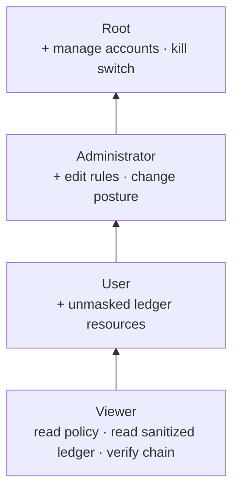
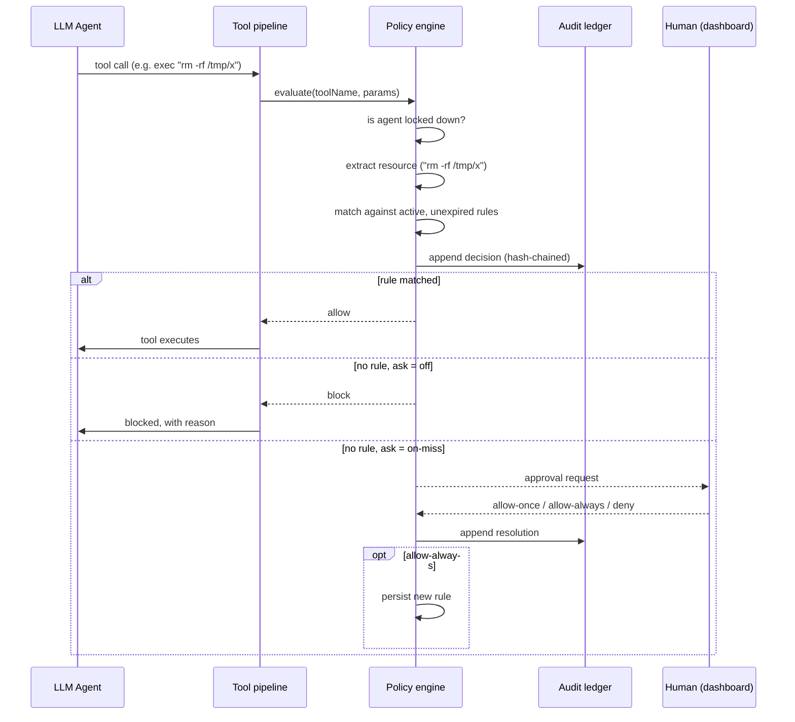
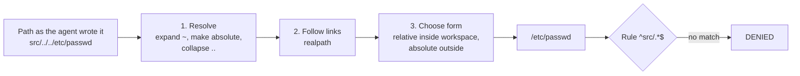

# Source material for Chapters 3–4

**This is not draft prose.** It is organised raw material — decisions, rationale,
data, diagrams, and code — keyed to where each item belongs in the report, so the
team can write the chapters from it later.

Section numbering follows the structure of the NGO-Ledger report supplied as the
model (§3.1 Design Requirements → §3.2 Analysis of Requirements → §3.3 Analysis
of Design Constraints → §3.4 Different Design Approaches → §3.5 Developed Design
→ §4.x Results / Validation).

Cross-references: `GOVERNANCE.md` (operator-facing overview + QA defect table),
`UPSTREAM-BUG-REPORT.md` (the OpenClaw bug found during QA).

---

## → 3.1 Design Requirements

The nine requirements from Chapter 1 §1.3, each with implementation status and
location. Use this table more or less directly; the _status_ column is the part
that matters for §4.4 validation.

| #   | Requirement (abbreviated)                                        | Status  | Where implemented                                                                                                                                                                                                                                                                                                                                                                                                                 |
| --- | ---------------------------------------------------------------- | ------- | --------------------------------------------------------------------------------------------------------------------------------------------------------------------------------------------------------------------------------------------------------------------------------------------------------------------------------------------------------------------------------------------------------------------------------- |
| 1   | Node.js ≥ 18, TypeScript, static type checking                   | **Met** | Node v22.22.3; `tsconfig.json` `strict: true` + `noUncheckedIndexedAccess`; `pnpm tsgo:core` / `pnpm tsgo:ui` clean                                                                                                                                                                                                                                                                                                               |
| 2   | Secure web dashboard: configure policies, monitor sessions, RBAC | **Met** | `ui/src/pages/governance/` — policy config ✔, RBAC ✔, live session monitoring ✔ (`active-sessions.ts`)                                                                                                                                                                                                                                                                                                                            |
| 3   | Default-deny over file paths, process execution, network         | **Met** | `src/governance/policy-engine.ts` + `resource-extraction.ts`; path confinement enforced by canonicalisation (`path-normalize.ts`, §3.5.8) rather than pattern filtering — validated §4.x.13                                                                                                                                                                                                                                       |
| 4   | Fine-grained privileges: path, command, network, time-limited    | **Met** | `policy-types.ts` (`PolicyRule.expiresAt`), `policy-engine.ts`; one path rule now binds every path-taking tool identically (§4.x.13, row 4)                                                                                                                                                                                                                                                                                       |
| 5   | Record 100% of agent actions, policy decisions, approvals        | **Met** | Agent actions ✔ and policy decisions ✔ (`audit-ledger.ts` + `policy-engine.ts`; every invocation recorded, `ungoverned` included — §4.x.10). Administrative approvals ✔ (`admin-audit.ts`, §3.5.9) — policy, account, and approval changes carry a required `actor`, in the same hash chain. Caveat to state: CLI-origin changes are attributed to `cli`, not a person (§3.5.9).                                                  |
| 6   | Tamper-evident audit logging                                     | **Met** | `audit-ledger.ts` SHA-256 hash chain                                                                                                                                                                                                                                                                                                                                                                                              |
| 7   | Real-time control: suspend/terminate within 1 second             | **Met** | `kill-switch.ts` + `agent-terminator.ts` + `src/gateway/governance-agent-termination.ts`. Now measures **confirmed termination**, not dispatch: the run-activity probe waits for signalled runs to leave the Gateway registry, and reports `dispatchMs`, `elapsedMs` and `stoppedConfirmed` separately (§3.5.10, §4.x.17). Caveat retained: from the CLI no in-flight abort is possible, and that is reported rather than implied |
| 8   | No plaintext secrets in logs                                     | **Met** | reuses OpenClaw `redactToolPayloadText`                                                                                                                                                                                                                                                                                                                                                                                           |
| 9   | Deployable on Linux, open-source components only                 | **Met** | Open-source ✔ (zero new dependencies); Linux ✔ — full suite (213 tests) runs natively on Ubuntu 24.04, plus a dedicated platform harness, see §4.x.9                                                                                                                                                                                                                                                                              |

---

## → 3.2 Analysis of Requirements

Notes on what each requirement actually demanded once implemented. The two
honest narrowings below should be stated explicitly in the report rather than
glossed — an examiner reading requirement #5's "100%" will ask.

**Requirement 3 (default-deny) — where the gate must sit.** A default-deny gate
is only meaningful if nothing can route around it. OpenClaw funnels every tool
call through one function, `runBeforeToolCallHook`
(`src/agents/agent-tools.before-tool-call.policy.ts`), so that is where the gate
was inserted. Critically it had to go _before_ an existing early-return that
skips policy work when no plugins are registered — placing it after would have
silently disabled governance on a default installation. This is a good concrete
example for the report of a control that is correct in isolation but useless in
the wrong position.

**Requirement 5 ("100% of agent actions") — originally narrowed, later met in full.**
The first implementation logged 100% of _governed_ actions only: shell commands,
file reads/writes/patches, and network fetches. Tools the extractor did not
recognise passed the gate silently. The reasoning was that an audit trail's
value comes from being reviewable, and that a resource string is only meaningful
when the extractor knows how to derive it.

That reasoning was wrong on the point that mattered. The unlogged actions are
exactly the ones that reveal what the policy fails to cover, so omitting them
removed the record's most diagnostic content. Every invocation is now recorded;
those the layer could not evaluate carry the distinct decision `ungoverned`
rather than being folded into `allow`. Full treatment in §4.x.10 below —
including the two costs the change exposed (write complexity and file growth)
and the vulnerability it introduced before it was capped.

**Requirement 7 ("within one second") — now met; this text records how.** Locking an agent blocks all
_subsequent_ governed actions immediately (the check precedes rule matching, so
it is O(1) on the lockdown list). It does **not** abort a command already
executing. OpenClaw has that capability internally — the `chat.abort` gateway
method → `AbortController` → OS process-tree termination
(`src/gateway/chat-abort.ts`, `src/process/exec-termination.ts`) — but it is a
Gateway-client capability that the governance layer cannot import directly
without inverting the dependency order.

Resolved with a registration seam: the Gateway installs its abort
implementation at startup (`installGovernanceAgentTerminator`, called from
`server-runtime-state.ts` where the live run registry is created), and
governance invokes it through `agent-terminator.ts`. The kill switch now
(1) locks the agent, then (2) aborts its in-flight runs, in that order —
locking second would leave a window in which the agent could legally start a
fresh action. Elapsed time is measured with `process.hrtime.bigint()` and
returned to both the CLI and the dashboard, so the one-second figure is
observable rather than asserted. See §4.x.8 for measurements.

Honest caveat to keep: when invoked from the **CLI**, no in-flight termination
occurs, because the run registry lives in the Gateway process. The CLI says so
explicitly rather than implying the agent was stopped.

**Requirement 8 (no plaintext secrets) — met by reuse, not reimplementation.**
OpenClaw already has a mature redaction engine (`src/logging/redact.ts`, ~1100
lines, ~40 vendor token patterns, structured-field and URL/PEM handling). The
governance ledger calls `redactToolPayloadText` on every resource string before
writing. Writing a new redactor would have been strictly worse. Worth stating
as a deliberate engineering decision, not an omission.

---

## → 3.3 Analysis of Design Constraints

**Economic (≤ 350 JOD/year) and open-source-only.** Both are satisfied by the
same fact: **the governance layer adds zero new dependencies.** Evidence:
`git diff package.json` is empty. Everything is built from Node.js built-ins
(`node:crypto`, `node:fs/promises`, `node:os`, `node:path`) plus packages
already present in OpenClaw (MIT) and Lit (BSD-3-Clause) in the UI. The password
hashing choice (§3.4) was influenced by this constraint.

**Manufacturability / 8 GB VPS.** The layer adds negligible resident memory: two
small JSON files and an append-only text log, no database process, no daemon of
its own — it executes inside the existing Gateway process. The one bounded
in-memory structure is the login throttle map, capped at 1000 entries.

**Ethical / defensive-only scope.** The layer can only _restrict_ what the agent
does; it exposes no capability to extend agent reach. Worth stating explicitly.

**Known constraint gap: Linux.** All development and testing has been on Windows 11. The paper specifies a Linux VPS. This matters more than it might appear —
one defect found during QA (defect 6, path separators) was a direct
Windows-vs-Linux behaviour difference, and the upstream OpenClaw bug found
(`UPSTREAM-BUG-REPORT.md`) is _also_ a POSIX-vs-Windows filesystem-semantics
difference. Both are evidence that cross-platform assumptions in this codebase
do not hold automatically, so Linux validation should be treated as required
work, not a formality.

---

## → 3.4 Different Design Approaches

Alternatives genuinely considered, with the deciding reason. This section
carries a lot of the engineering-judgement marks; each row below has a real
investigation behind it.

| Decision             | Alternatives considered                                                                                 | Chosen                         | Deciding reason                                                                                                                                                                                                                                                                                                                |
| -------------------- | ------------------------------------------------------------------------------------------------------- | ------------------------------ | ------------------------------------------------------------------------------------------------------------------------------------------------------------------------------------------------------------------------------------------------------------------------------------------------------------------------------ |
| Integration strategy | (a) OpenClaw plugin via public SDK; (b) hard fork of core                                               | **Hard fork**                  | The plugin API can only contribute a dashboard page inside a _sandboxed iframe_ — `ui/src/pages/plugin/plugin-page.ts` hardcodes which tabs render natively (`BUNDLED_TAB_VIEWS`). Seamless integration is impossible as a plugin. A plugin version was actually built first, then migrated into core when this was confirmed. |
| Audit storage        | (a) extend OpenClaw's existing `audit_events` SQLite store; (b) own append-only hash-chained file       | **Own ledger**                 | Core's store has no entry-to-entry chaining and its schema/writer are internal, not a stable contract. Also serves a different purpose (general telemetry). Verified by reading `src/audit/audit-event-store.ts`: pseudonymization exists, chaining does not — this absence is the project's clearest original contribution.   |
| Password hashing     | (a) `bcrypt`; (b) `argon2`; (c) Node built-in `scrypt`                                                  | **scrypt**                     | Both alternatives are native npm addons requiring compilation. `scrypt` is memory-hard, in the standard library, and adds no dependency — satisfying the economic and open-source-only constraints simultaneously.                                                                                                             |
| Account storage      | (a) OpenClaw's state SQLite DB; (b) JSON file                                                           | **JSON file**                  | Single-operator deployment; account volume is tiny; a JSON file is human-auditable, which suits a governance artifact. Migration to SQLite is documented as an option, not a correctness requirement.                                                                                                                          |
| Concurrency control  | (a) in-process promise queue (mutex); (b) OS-level lock file                                            | **Lock file** (`file-lock.ts`) | Started with (a) and it **failed in testing**: the CLI and the Gateway are separate OS processes, so a per-process mutex does not serialize them and the hash chain corrupted itself. See QA defect 1 — good narrative material.                                                                                               |
| Gate placement       | before vs. after the "no plugins registered" early-return                                               | **Before**                     | After would disable governance entirely on a plugin-free install.                                                                                                                                                                                                                                                              |
| Viewer log access    | (a) same view as all tiers; (b) sanitized view                                                          | **Sanitized**                  | Chapter 1 §1.6 grants Viewers "sanitized audit logs" specifically; masking the resource string is what makes Viewer meaningfully distinct from User.                                                                                                                                                                           |
| Path rule form       | (a) always absolute; (b) always workspace-relative; (c) relative inside the workspace, absolute outside | **(c) hybrid**                 | Expanded below — this one needs a paragraph, not a table cell.                                                                                                                                                                                                                                                                 |

#### 3.4.x Which form a file path takes when a rule is matched against it

Worth a subsection of its own: the alternatives are genuinely close, and the
chosen one is what makes the traversal defence in §3.5.8 possible.

A rule is a regular expression tested against a string. So the security question
"can this rule be walked around?" is really the question "what string does the
gate build from the path the agent supplied?" Three answers were considered.

**(a) Always absolute** — every path becomes `/home/kinan/openclaw/src/app.ts`.
Unambiguous, and traversal-proof once `..` is collapsed. Rejected because it
makes every rule machine-specific: a rule written on the development laptop
cannot work on the Linux VPS that design requirement #9 commits the project to,
since the two have different absolute prefixes. It also invalidates every
example in the operator documentation.

**(b) Always workspace-relative** — every path becomes `src/app.ts`. Portable,
and matches the documentation. Rejected because it has no answer for a path
outside the workspace: `/etc/passwd` has no workspace-relative form, so it would
have to be either rejected (breaking legitimate access to files outside the
project) or expressed with `..` (which is precisely the string the traversal
defence has to eliminate).

**(c) Relative inside, absolute outside — chosen.** A path within the workspace
is recorded as `src/app.ts`; a path outside it as `/etc/passwd` or
`C:/Users/kinan/.ssh/id_rsa`. This keeps (b)'s portability for project files and
(a)'s unambiguity for everything else, and it produces the security property
directly: _leaving the workspace changes the shape of the string._ A rule
anchored at `^src/` cannot match an escape attempt, not because the attempt is
detected and rejected, but because the resulting string no longer begins with
`src/`. The check needs no blocklist of suspicious patterns, which is what makes
it robust — there is no list of tricks to keep up to date.

The implementation reuses three helpers the host already ships and tests
(`resolveToCwd`, `realpath`, `formatPathRelativeToCwdOrAbsolute`), so no new
path logic was written. Good example for the report of preferring reuse at a
security boundary: hand-rolled path parsing is a classic source of exactly the
bug being fixed here.

---

## → 3.5 Developed Design

### 3.5.1 System architecture

Figure candidate — _Figure 3.1: Governance layer within the OpenClaw Gateway._


**Point worth making in prose:** the two authorization gates are independent and
both mandatory. Reaching any governance route already requires passing
OpenClaw's own credential check; the named-account login is a _second_ gate on
top. This mirrors the layered "SSH tunnel → dashboard → RBAC" architecture in
Figure 1.1 of Chapter 1.

### 3.5.2 Component inventory

Table candidate — _Table 3.1: Governance layer components._ Line counts exclude
test files and are current as of 2026-08-16. Grouped by responsibility rather
than alphabetically, because the grouping is itself part of the design argument.

**Policy: deciding what an agent may do**

| File                     | Responsibility                                                    | LOC |
| ------------------------ | ----------------------------------------------------------------- | --- |
| `policy-engine.ts`       | The decision function: kill switch, denials, allowances, default  | 462 |
| `policy-store.ts`        | Atomic persistence, core-rule reassertion, audited mutators       | 499 |
| `policy-types.ts`        | Policy document and rule data model, effect/tier/access semantics | 332 |
| `baseline-policy.ts`     | The core and baseline rules an installation ships with            | 245 |
| `resource-extraction.ts` | Maps a tool call to the resource string a rule is tested against  | 144 |
| `path-normalize.ts`      | Canonical path form: expand, collapse, dereference, project       | 104 |
| `pattern-match.ts`       | Cached, fail-closed regex matching                                | 69  |
| `rule-conflicts.ts`      | Detects a new rule an earlier one already covers                  | 248 |
| `rule-validation.ts`     | Author-time pattern and TTL validation, looseness warnings        | 139 |
| `regex-safety.ts`        | Rejects patterns that can backtrack catastrophically              | 258 |

**Accountability: recording what happened**

| File              | Responsibility                                            | LOC |
| ----------------- | --------------------------------------------------------- | --- |
| `audit-ledger.ts` | HMAC-keyed hash chain, rotation, verification, checkpoint | 572 |
| `admin-audit.ts`  | Administrative actions and their required actor           | 148 |
| `ledger-key.ts`   | Per-installation signing key for the chain                | 93  |
| `ledger-view.ts`  | Scope filtering and masking per role                      | 42  |

**People: who may see and change what**

| File                | Responsibility                                            | LOC |
| ------------------- | --------------------------------------------------------- | --- |
| `user-store.ts`     | Accounts, parameterised password hashing, roles, resets   | 510 |
| `session-tokens.ts` | Login sessions, fingerprinted storage, expiry, revocation | 187 |
| `permissions.ts`    | The tier × scope authorization rules                      | 97  |
| `roles.ts`          | The role ladder and comparison                            | 29  |
| `account-guards.ts` | Lockout-prevention invariants                             | 72  |
| `login-throttle.ts` | Brute-force lockout, keyed per canonical username         | 111 |
| `password.ts`       | scrypt hashing with recorded cost parameters              | 164 |

**Control: intervening in real time**

| File                   | Responsibility                                           | LOC |
| ---------------------- | -------------------------------------------------------- | --- |
| `kill-switch.ts`       | Lockdown plus in-flight termination, in that order       | 85  |
| `agent-terminator.ts`  | Seam to the Gateway's abort machinery; confirms the stop | 186 |
| `active-sessions.ts`   | Live run view for the session monitor                    | 84  |
| `pending-decisions.ts` | Escalations nobody answered, deduplicated and bounded    | 214 |
| `rule-requests.ts`     | The User tier proposes, the Administrator grants         | 226 |
| `system-status.ts`     | Host CPU/memory for the Viewer tier                      | 55  |

**Infrastructure**

| File           | Responsibility                                     | LOC |
| -------------- | -------------------------------------------------- | --- |
| `file-lock.ts` | Cross-process advisory lock with staleness reaping | 150 |
| `paths.ts`     | Storage locations, environment-overridable         | 118 |

**HTTP, CLI and dashboard**

| File                                          | Responsibility                            | LOC   |
| --------------------------------------------- | ----------------------------------------- | ----- |
| `src/gateway/governance-dashboard-api.ts`     | Every API route and its tier/scope check  | 964   |
| `src/gateway/governance-dashboard-auth.ts`    | Login, bootstrap, session resolution      | 235   |
| `src/gateway/governance-agent-termination.ts` | Registers the Gateway's abort + run probe | 106   |
| `src/cli/program/register.governance.ts`      | The `openclaw governance …` command tree  | 302   |
| `ui/src/pages/governance/governance-page.ts`  | The dashboard page                        | 1,443 |
| `ui/src/pages/governance/api.ts`              | Typed dashboard API client                | 404   |
| `ui/src/pages/governance/ledger-filter.ts`    | Audit-view filtering and row description  | 56    |
| `ui/src/pages/governance/route.ts`            | Page registration                         | 12    |

|                      |                                               |
| -------------------- | --------------------------------------------- |
| **Production total** | **~9,165 lines across 36 files**              |
| **Test total**       | **~7,950 lines across 40 files, 1,056 tests** |

Plus **13 modified OpenClaw core files** — the tool-call pipeline insertion
(`agent-tools.before-tool-call.policy.ts` and its two type/diagnostic
companions), route and CLI registration, Gateway runtime wiring, and UI
routing/navigation/strings.

**Point worth making in prose.** Test code is roughly 87% of production code by
volume, and that ratio is not incidental. Ten QA rounds found around sixty
defects, and the recurring finding was never a missing check — it was two parts
of the system disagreeing (see §4.x.11 and §4.x.15). Disagreements are only
visible from outside the code that contains them, which is what the test volume
is buying.

### 3.5.3 Data models

_Table candidate — Table 3.2: Policy rule fields._

```ts
type PolicyRule = {
  id: string;
  resourceKind: "command" | "path" | "network";
  pattern: string; // regular expression
  description?: string;
  createdAt: string;
  expiresAt?: string; // absent = never expires  → requirement #4 time limits
  createdBy?: string; // accountability: who granted this
};

type PolicyDocument = {
  version: 1;
  mode: "enforce" | "monitor" | "off";
  ask: "off" | "on-miss";
  rules: PolicyRule[];
  lockedAgents: string[]; // kill switch
};
```

_Table candidate — Table 3.3: Audit ledger entry fields._

```ts
type LedgerEntry = {
  seq: number; // strictly increasing; a gap is tampering evidence
  timestamp: string;
  agentId: string;
  sessionKey: string;
  toolName: string;
  resourceKind: string;
  resource: string; // redacted before writing
  ruleId: string; // which rule decided, or "default-deny" / "kill-switch"
  decision: "allow" | "deny" | "ask";
  prevHash: string; // ← the chain link
  hash: string; // SHA-256 over all fields above
};
```

Note for the report: `ruleId` is what makes an entry _explainable_ — it answers
"why was this decided this way", which is exactly the Table 1.1 example from
Chapter 1.

### 3.5.4 The four-tier permission model

> **Full treatment in `docs-notes/ROLE-MODEL.md`**, including §3.7 "Evolution
> of the User tier" — how that tier changed during implementation and why,
> which is prime §3.5 narrative material.
>
> Original note: — what "manage" means at each
> tier, which parts come from the paper vs. are design decisions, the two-question
> (tier + scope) authorization model, and the complete permission matrix.

Figure candidate — _Figure 3.2: RBAC hierarchy with inherited permissions._



_Table candidate — Table 3.4: Permission matrix._

| Capability                             |     Viewer     |  User  | Administrator | Root |
| -------------------------------------- | :------------: | :----: | :-----------: | :--: |
| View policy document                   |     scoped     | scoped |       ✔       |  ✔   |
| View audit ledger                      | scoped, masked | scoped |       ✔       |  ✔   |
| Verify chain integrity                 |       ✔        |   ✔    |       ✔       |  ✔   |
| Add / remove agent-scoped rules        |       ✘        | scoped |       ✔       |  ✔   |
| Global rules, posture, ask mode        |       ✘        |   ✘    |       ✔       |  ✔   |
| Assign agents to accounts              |       ✘        |   ✘    |       ✔       |  ✔   |
| Create / delete accounts, assign roles |       ✘        |   ✘    |       ✘       |  ✔   |
| Emergency kill switch                  |       ✘        | scoped |       ✔       |  ✔   |

The Root/Administrator split follows Chapter 1 §1.6 exactly: **Root governs
people, Administrator governs agents.** A consequence worth stating: an
Administrator cannot promote themselves, because account administration is not
their tier.

**The one deliberate divergence from Chapter 1, stated plainly.** In the
preliminary design the User tier _uses_ its assigned agent — it prompts and
interacts with it, and its governance authority extends little beyond proposing
changes. In the implemented system a User _governs_ its assigned agent: it
writes agent-scoped rules, sets that agent's escalation behaviour, reads its
unmasked audit entries, and can stop it. This is an accepted design decision,
not an oversight, and the report should present it as such rather than let an
examiner find it.

The argument for it: a tier that can only propose is not a tier of
responsibility, and it forces every routine decision about one team's agent up
to an Administrator who has installation-wide authority. Delegating narrow,
agent-scoped authority is what makes the Administrator tier's global scope
meaningful — otherwise "governs all agents" and "governs one agent" collapse
into the same job. The two-question authorization model (tier + scope) exists
precisely to make that delegation safe: a User's authority stops at the agents
assigned to them, and global rules remain Administrator-only.

Two honest riders belong with it. First, this places one capability — the
per-agent human-approval toggle — a tier lower than Chapter 1 assigns it
(tracked as A5). Second, the divergence is a _substitution_, not a superset:
the User tier gained governance authority but has **not** gained the paper's
conversational access to its agent, because the account system was never wired
into OpenClaw's chat path (tracked as A1). Both belong in §4.4's validation
discussion.

### 3.5.5 Process flow — a policy decision

Figure candidate — _Figure 3.3: Policy decision sequence._



### 3.5.6 Process flow — authentication

Figure candidate — _Figure 3.4: Two-gate authentication._

Steps: browser presents Gateway credential → Gateway auth gate → governance
`whoami` → if no account exists, one-time Root bootstrap (refuses once any
account exists) → else username/password → scrypt verify → session token
(32 random bytes, hex) in an HttpOnly, SameSite=Strict cookie, 12-hour expiry →
each subsequent request re-resolves the session and compares role against the
tier the endpoint requires.

Security notes for prose: the throttle is keyed _per username_, so guessing one
account cannot be parallelised and a flood cannot lock out a different victim.
The cookie deliberately omits `Secure` because the Gateway binds to loopback and
remote access is via SSH tunnel per the Chapter 1 architecture — requiring HTTPS
would break the intended deployment without adding protection.

### 3.5.7 System security

- Two independent, mandatory authorization gates (above)
- Default-deny posture; unmatched actions are denied or escalated
- Fail-closed on decision, fail-open on extraction (see §4.x rationale)
- Secrets redacted before any ledger write
- Brute-force lockout on login
- Lockout-prevention guards so the system cannot be made unadministrable
- Role changes and deletions revoke live sessions immediately, not at expiry
- Rule patterns validated at author time and length-capped
- File paths canonicalized before matching, so a location rule cannot be
  side-stepped (§3.5.8)

### 3.5.8 Canonicalizing file paths before a rule is applied

Figure candidate — _Figure 3.x: Path normalization pipeline._



A policy rule is a pattern tested against a string, so a location-based rule is
only as strong as the string the gate constructs. Three separate weaknesses came
from constructing it carelessly — the original implementation converted
backslashes to forward slashes and did nothing else:

1. **`..` was never collapsed.** A rule meaning "only inside the workspace"
   matched `workspace/../../etc/passwd`, because that text does begin with
   `workspace/`. The rule was satisfied by a path that pointed outside the
   directory the rule existed to confine the agent to.
2. **Symbolic links were never followed.** A link at `workspace/notes` pointing
   at `/etc` defeated the same rule a second way, without using `..` at all.
3. **The form differed between tools.** `apply_patch` reaches the gate with an
   absolute path already resolved by the host
   (`src/agents/apply-patch-paths.ts`), while `read`, `write` and `edit` arrive
   exactly as the model typed them, because the host populates its
   `derivedPaths` hint for `apply_patch` alone
   (`src/plugins/host-tool-param-parsers.ts`). Since all operator documentation
   teaches the short relative form, a rule written as documented was
   _simultaneously_ bypassable on three tools and silently inert on the fourth —
   it never matched a patch of the very file it named.

The three are one defect with three symptoms, and one pipeline closes all of
them. Points worth making in prose:

- **The fix is structural, not a filter.** Nothing looks for `..`, and nothing
  maintains a list of dangerous patterns. The path is resolved to what it
  actually refers to, and the rule is matched against that. A defence that
  enumerates attacks has to be updated whenever a new one appears; this one does
  not, and that distinction is the point of the section.
- **Symbolic-link resolution is a filesystem read inside a security check.** The
  asynchronous `realpath` is used rather than the host's synchronous
  `canonicalizePath`, because the gate is on the path of every tool call and a
  blocking call there would stall the whole process. A real
  security-versus-performance trade with a defensible resolution.
- **A file that does not exist yet is the normal case, not an error.** A `write`
  creating a new file cannot be resolved directly, so the _parent directory_ is
  resolved and the filename re-attached. Without that, an agent could evade link
  resolution simply by targeting a file that does not exist yet — the kind of
  gap that appears only when the mechanism is written out and examined.

Validation of all three symptoms: §4.x.13.

### 3.5.9 Recording administrative actions in the same chain

The ledger originally recorded what agents did and how the policy judged them,
and nothing about who wrote that policy. Requirement #5 names three things —
agent actions, policy decisions, **and administrative approvals** — and only the
first two existed. The omission matters more than its size: an investigation
does not begin at "what did the agent do", it begins at "was this allowed
because it was legitimate, or because somebody widened the rules just before it
happened?" That question needs both halves of the record.

Three design decisions worth reporting.

**One chain, not two.** Administrative entries are appended to the same
hash-chained file as agent activity rather than a separate admin log. A second
file would be a second thing to protect, and would destroy the ordering that
makes the trail readable: "the rule was widened at 14:02, the agent used it at
14:03" is only visible when both appear in one sequence. Scope filtering in
`ledger-view.ts` already keeps each account to the entries it may see, so one
chain costs no confidentiality.

**Attribution enforced by the compiler, not by review.** `actor` is a
**required** parameter on every mutating store function — `addRule`,
`removeRule`, `setMode`, `setAskMode`, `setHitlTimeout`, `setAgentAskMode`,
`createUser`, `setUserRole`, `setUserAssignedAgents`, `deleteUser`. Adding a new
route that changes governance state without saying who did it does not compile.
The raw read-modify-write (`updatePolicy`) is no longer imported by the HTTP
layer at all, which closes the one remaining path to an unattributed change.
This is the same principle as §3.5.8: make the defect structurally impossible
rather than relying on remembering.

**Schema evolution in an append-only hash-chained log.** The interesting
engineering problem, and a good one to write up. The hash covers a fixed list of
fields, so adding `actor` and `entryKind` would change the hash of every entry
and make an existing ledger fail verification wholesale — a tamper-evident log
whose own upgrade makes all its history look tampered with.

The resolution is to key the hashed field list on **whether the new fields are
present**, rather than on a version number: an entry with neither is hashed over
the original ten fields, one with both over twelve. Presence is a safe
discriminator precisely because presence then becomes covered by the hash.
Forging an `actor` onto a historical entry switches it to the twelve-field form
and the stored hash stops matching; stripping the `actor` from an administrative
entry switches it the other way, with the same result. Both are detected. A
version field would have needed protecting itself, and would still have left the
question of entries written before versions existed.

**Honest limitation to carry into §4.4.** A change made through the CLI is
recorded with actor `cli`, not a person. The CLI has no login by design — its
boundary is filesystem access to the governance directory, and anyone who can
run it could edit the JSON files directly — so a name collected there would be
a claim, not an authentication. Recording the origin honestly is better than
implying an accountability the design does not provide. Tracked as A6.

Validation: §4.x.14.

---

## → 3.x Critical code snippets

Each with the one-line reason it is written that way.

**(a) The hash chain — `audit-ledger.ts`.** _Why:_ the chain head is read from
disk inside a cross-process lock on every append, never cached, because the CLI
and Gateway are separate processes.

```ts
return withFileLock(ledgerFilePath(), async () => {
  const prior = await readChainHead(); // from disk, never cached
  const withoutHash = {
    seq: prior.seq + 1,
    /* …event fields… */
    resource: redactToolPayloadText(input.resource), // requirement #8
    prevHash: prior.hash, // ← the chain link
  };
  const entry = { ...withoutHash, hash: hashEntry(withoutHash) };
  await appendFile(ledgerFilePath(), `${JSON.stringify(entry)}\n`, { mode: 0o600 });
  return entry;
});
```

**(b) Verification.** _Why:_ reports the first broken entry and the reason, so
an auditor learns _where_ integrity failed, not merely that it did.

```ts
if (entry.seq !== expectedSeq)
  return { ok: false, brokenAtSeq: entry.seq, reason: `unexpected sequence number …` };
if (entry.prevHash !== expectedPrev)
  return { ok: false, brokenAtSeq: entry.seq, reason: "prevHash does not match …" };
if (hashEntry(withoutHash) !== hash)
  return { ok: false, brokenAtSeq: entry.seq, reason: "entry hash does not match …" };
```

**(c) The decision loop — `policy-engine.ts`.** _Why:_ every resource is
evaluated and recorded _before_ any verdict returns — an early return would
leave later paths in a multi-file edit unaudited (QA defect 5), and the recorded
decision is always the true one even in monitor mode (QA defect 4).

```ts
let firstMiss: string | undefined;
for (const resource of resources) {
  const matched = activeRules.find((rule) => matchesPattern(rule.pattern, resource));
  const decision = matched ? "allow" : doc.ask === "off" ? "deny" : "ask";
  await appendLedgerEntry({ /* … */ ruleId: matched?.id ?? "default-deny", decision });
  if (!matched && firstMiss === undefined) firstMiss = resource;
}
if (firstMiss === undefined || doc.mode === "monitor") return undefined;
```

**(d) The role ladder — `roles.ts`.** _Why:_ a numeric rank makes inheritance a
single comparison, so no endpoint can accidentally implement the hierarchy
inconsistently.

```ts
const ROLE_RANK = { viewer: 0, user: 1, administrator: 2, root: 3 };
export function roleAtLeast(role: GovernanceRole, minimum: GovernanceRole): boolean {
  return ROLE_RANK[role] >= ROLE_RANK[minimum];
}
```

**(e) Lockout prevention — `account-guards.ts`.** _Why:_ there is no
"forgot password" flow and bootstrap refuses once an account exists, so removing
the last Root would be unrecoverable through the product.

```ts
const otherRoots = users.filter((c) => c.role === "root" && c.id !== userId).length;
if (otherRoots > 0) return ALLOWED;
return { allowed: false, reason: "This is the only Root account; promote another…" };
```

**(f) Safe tool lookup — `resource-extraction.ts`.** _Why:_ a null-prototype
registry stops a tool named `constructor` or `__proto__` resolving to an
inherited `Object.prototype` member (QA defect 3).

```ts
export const GOVERNED_TOOLS = Object.assign(Object.create(null), { exec: …, bash: …, … });
export function resolveGovernedTool(toolName: string) {
  return Object.hasOwn(GOVERNED_TOOLS, toolName) ? GOVERNED_TOOLS[toolName] : undefined;
}
```

---

## → 4.x Results and Validation

### 4.x.1 Test evidence

_Table candidate — Table 4.1: Automated test coverage._ Current as of
2026-08-16. Grouped by what each group establishes, since the raw file list is
long and the grouping is the argument.

**The policy decision itself**

| Suite                         | Tests | What it proves                                                                |
| ----------------------------- | ----: | ----------------------------------------------------------------------------- |
| `policy-engine.test.ts`       |    30 | Default-deny, ask-on-miss, expiry, kill switch, monitor, per-resource logging |
| `baseline-policy.test.ts`     |    34 | The three tiers, core immutability, deny-beats-allow, read/write separation   |
| `qa-round10.test.ts`          |    13 | The seams the tier model created: non-core denies, scoping, expiry, clashes   |
| `resource-extraction.test.ts` |     9 | Prototype-pollution safety, `file://` bypass closed, separator portability    |
| `path-normalize.test.ts`      |    10 | Traversal, symlinks, and one canonical form across every path tool            |
| `rule-conflicts.test.ts`      |    17 | Clash detection, including that a denial is never described as a grant        |
| `rule-expiry.test.ts`         |    17 | Time-limited grants, retention, ruleset ceiling, pattern cache                |
| `rule-warnings.test.ts`       |     7 | Warnings for rules broader than they look                                     |
| `regex-safety.test.ts`        |    12 | Catastrophic-backtracking patterns rejected at author time                    |

**The audit trail**

| Suite                              | Tests | What it proves                                                            |
| ---------------------------------- | ----: | ------------------------------------------------------------------------- |
| `audit-ledger.test.ts`             |    10 | Chain verifies clean; detects edit, deletion, corruption; redacts secrets |
| `ledger-integrity.test.ts`         |    12 | Keyed chain resists recomputation; truncation and downgrade detected      |
| `admin-audit.test.ts`              |    19 | Every administrative change attributed; schema migration stays evident    |
| `complete-record.test.ts`          |    11 | Every invocation recorded, `ungoverned` kept distinct from `allow`        |
| `complete-record-security.test.ts` |     8 | Agent-controlled text cannot flood or poison the trail                    |
| `ledger-view.test.ts`              |     9 | Scope filtering before masking; hashes preserved                          |

**People and authorization**

| Suite                                  | Tests | What it proves                                                          |
| -------------------------------------- | ----: | ----------------------------------------------------------------------- |
| `user-store.test.ts`                   |    27 | Hashing with recorded cost, upgrade on sign-in, resets, single Root     |
| `governance-privilege-matrix.test.ts`  |     8 | Every route × every tier beneath its floor, asserting an exact 403      |
| `governance-account-lifecycle.test.ts` |    11 | Bootstrap, creation and real sign-in end to end — no fabricated session |
| `permissions.test.ts`                  |    11 | Tier × scope matrix, monotonic inheritance                              |
| `account-guards.test.ts`               |    12 | Last-Root and self-delete lockout prevention                            |
| `login-throttle.test.ts`               |     6 | Lockout after five failures, per-account isolation, window expiry       |
| `hardening.test.ts`                    |     8 | Unicode username folding, token never written in the clear              |

**Control, HTTP surface and infrastructure**

| Suite                               | Tests | What it proves                                               |
| ----------------------------------- | ----: | ------------------------------------------------------------ |
| `kill-switch.test.ts`               |    12 | Lock-then-abort ordering, honest reporting, latency bound    |
| `qa-round9.test.ts`                 |    15 | Confirmed termination, the per-user axis, loop-detector logs |
| `active-sessions.test.ts`           |    11 | Live run view, scoped per role                               |
| `pending-decisions.test.ts`         |    12 | Escalation stack, single-shot decisions, bounded growth      |
| `rule-requests.test.ts`             |    14 | Propose/decide workflow, concurrent decisions, per-user cap  |
| `governance-dashboard-api.test.ts`  |    18 | Tier floors, agent scope, validation, request workflow       |
| `governance-security*.test.ts` (×3) |    25 | Injection, malformed bodies, and the round-three findings    |
| `file-lock.test.ts`                 |     5 | Mutual exclusion, release on throw, stale reclaim, timeout   |
| `ledger-filter.test.ts` (dashboard) |     9 | Audit-view filtering and row description                     |
| `system-status.test.ts`             |     3 | Resource snapshot exposes no paths or credentials            |
| `gate-attachment.test.ts`           |     7 | Where the gate sits, including the known harness gap (B1)    |

**QA regression suites** — `qa-round5`, `qa-round5-storage`, `qa-round6`,
`qa-round8-logic`, `qa-round8-security`: **81 tests** pinning the specific
defects each round found, so none can silently return.

|           |                                 |
| --------- | ------------------------------- |
| **Total** | **1,056 tests across 40 files** |

Two methodology notes worth keeping:

- The concurrency suites were re-run five consecutive times after the backoff
  fix rather than once, because the defect they exposed was intermittent. A
  single green run does not establish that a concurrency bug is fixed.
- **The governance suite alone is not sufficient evidence.** OpenClaw's own
  harness suite must be run too, and its baseline is **18 failed / 174 passed** —
  pre-existing failures present on `main` before this work began. Round six
  exists because governance-only runs hid nineteen regressions for weeks; §4.x.11
  tells that story.

Commands:

```bash
node node_modules/vitest/vitest.mjs run src/governance/ src/gateway/governance-*.test.ts ui/src/pages/governance/
node node_modules/vitest/vitest.mjs run src/agents/harness/native-hook-relay.test.ts
node scripts/run-tsgo.mjs -p tsconfig.core.json
node scripts/run-tsgo.mjs -p tsconfig.ui.json
```

### 4.x.2 Tamper-detection experiment

The headline experiment. Method: build a ledger through normal operation, then
attack it three ways and attempt verification after each.

_Table candidate — Table 4.2: Tamper-detection results._

| Attack                          | Result                 | Reported reason                                             |
| ------------------------------- | ---------------------- | ----------------------------------------------------------- |
| Edit a past entry's content     | **Detected**, entry #3 | `entry hash does not match its own recomputed content hash` |
| Delete an entry from the middle | **Detected**, entry #5 | `prevHash does not match the preceding entry's hash`        |
| Insert unparseable data         | **Detected**           | reported with line number                                   |
| Unmodified ledger (control)     | Verified clean         | `{ ok: true, entriesChecked: 8 }`                           |

**Limitation to state honestly:** truncating the _newest_ entries is not
detectable by chaining alone, because a prefix of a valid chain is still valid.
Detecting that requires an external anchor (a counter-signed checkpoint or an
off-host copy of the latest hash). Good future-work item.

### 4.x.3 Policy enforcement experiment

Method: policy in `enforce` with one command rule (`^ls( .*)?$`) and one network
rule (`^api[.]openweathermap[.]org$`), then four representative tool calls.

_Table candidate — Table 4.3: Enforcement results._

| Action                                       | `ask: on-miss` | `ask: off` (strict) |
| -------------------------------------------- | -------------- | ------------------- |
| `ls -la` (allowlisted)                       | ALLOW          | ALLOW               |
| `rm -rf /tmp/old_data`                       | ASK A HUMAN    | **BLOCK**           |
| fetch `api.openweathermap.org` (allowlisted) | ALLOW          | ALLOW               |
| fetch `evil.example.com`                     | ASK A HUMAN    | **BLOCK**           |

This reproduces the Table 1.1 scenario from Chapter 1 (`rm -rf` denied against a
command allowlist) with real observed output.

### 4.x.13 Path confinement experiment (directory traversal and symbolic links)

Direct counterpart to the "Validations → Directory Traversal" experiment in the
decentralized-firewall report, and a good structural model to follow.

Method: policy in `enforce` with `ask: off` and a single path rule, `^src/.*$`,
meaning "this agent may touch files under the project's `src` directory and
nothing else". A workspace is created in a temporary directory containing
`src/app.ts`. Each row is a real tool call evaluated by the gate.

_Table candidate — Table 4.x: Path confinement results._

| #   | Tool          | Path the agent supplied      | String the gate matched | Before    | After     |
| --- | ------------- | ---------------------------- | ----------------------- | --------- | --------- |
| 1   | `read`        | `src/app.ts`                 | `src/app.ts`            | ALLOW     | ALLOW     |
| 2   | `read`        | `src/../../../etc/passwd`    | `/etc/passwd`           | **ALLOW** | **BLOCK** |
| 3   | `read`        | `notes/secret.txt` (link)    | `/tmp/.../secret.txt`   | **ALLOW** | **BLOCK** |
| 4   | `apply_patch` | `src/app.ts` (absolute form) | `src/app.ts`            | **BLOCK** | ALLOW     |
| 5   | `write`       | `src\app.ts` (Windows form)  | `src/app.ts`            | ALLOW     | ALLOW     |

Rows 2 and 3 are the security failures: one rule, two different ways of
satisfying its text while pointing outside the directory it names. Row 4 is the
mirror-image failure and the more interesting one for the report — the rule was
not too weak there but _entirely ineffective_, refusing an operation the
operator had explicitly permitted, because the string the gate built for
`apply_patch` could never match a pattern written the way the documentation
teaches. Row 1 and row 5 confirm the fix is not achieved by simply denying more.

**The observation worth drawing out.** Rows 2–3 and row 4 look like opposite
defects — too permissive and too restrictive — and were originally recorded as
separate findings. They have a single cause: the gate had no defined answer to
"what string represents this file?", so different code paths answered
differently. Once the question is answered once, in one place, all three
symptoms disappear together. Generalisable claim for the discussion: at a
security boundary, an undefined canonical form is itself the vulnerability, and
it will produce both false accepts and false rejects rather than erring
consistently in one direction.

Evidence: `src/governance/path-normalize.test.ts`, 10 tests, all passing. The
"before" column is not asserted from memory — it is what the previous
implementation (`value.replaceAll("\\", "/")`) demonstrably produced.

### 4.x.14 Administrative accountability experiment

Method: perform one change of each administrative kind, then read the ledger
back. The point is not that the code runs — it is that the trail answers "who
changed what" for every route by which governance state can change.

_Table candidate — Table 4.x: Administrative actions recorded._

| Change made                   | Recorded action                  | Actor        | Detail kept                    |
| ----------------------------- | -------------------------------- | ------------ | ------------------------------ |
| Add a rule                    | `governance.policy.rule.add`     | account name | pattern, scope, lifetime       |
| Remove a rule                 | `governance.policy.rule.remove`  | account name | the removed rule, in full      |
| Change posture                | `governance.policy.mode`         | account name | `enforce -> off`               |
| Change ask behaviour          | `governance.policy.ask`          | account name | old and new                    |
| Create an account             | `governance.account.create`      | account name | username and role granted      |
| Change a role                 | `governance.account.role`        | account name | `viewer -> administrator`      |
| Delete an account             | `governance.account.delete`      | account name | username and role, kept        |
| Approve a rule request        | `governance.rule-request.decide` | approver     | requester, pattern, allow/deny |
| Engage the kill switch        | `governance.agent.lock`          | operator     | runs aborted, elapsed ms       |
| Any of the above from the CLI | same                             | **`cli`**    | (limitation A6)                |

Two details are deliberate and worth a sentence each in prose. A **removed**
rule is described in full, because after deletion the ledger is the only
remaining record of what the permission was — recording only its id would make
the entry useless for the question it exists to answer. A **deleted account**
keeps its username and role for the same reason. Transitions are recorded as
`old -> new` rather than just the new value, because a privilege escalation is
only recognisable as one when both ends are visible.

Also validated: a removal that removed nothing writes no entry, so a caller
cannot pad the ledger with entries of their choosing without changing state.

**Tamper-evidence across the schema change** (the part most likely to go wrong
silently):

| Scenario                                            | Expected | Result |
| --------------------------------------------------- | -------- | ------ |
| Ledger written before `actor` existed               | verifies | ✔      |
| Old chain continued with new administrative entries | verifies | ✔      |
| `actor` forged onto a pre-existing entry            | detected | ✔      |
| `actor` stripped from an administrative entry       | detected | ✔      |
| `actor` changed to a different name                 | detected | ✔      |

Evidence: `src/governance/admin-audit.test.ts`, 19 tests. Suite total 682
passing; OpenClaw's own harness suite unchanged at its 18-failure baseline.

### 4.x.15 Seventh QA pass — account lifecycle and logic defects

Run after the administrative-audit work, in two parts: an end-to-end test of the
account system, and a targeted hunt for logic defects in the policy layer.

**Part one — the account lifecycle had never been tested end to end.** Every
existing suite fabricated a logged-in session object directly, which tests the
authorization rules while assuming authentication away. Driving bootstrap,
account creation and sign-in through the real HTTP surface confirmed the system
works — a Root can create an account at any of the four roles, and that account
can sign in and is recognised at the role it was given — and found one
requirement not implemented at all.

_Table candidate — Table 4.x: Account lifecycle results._

| Behaviour                                         | Result        |
| ------------------------------------------------- | ------------- |
| First Root created by bootstrap, can sign in      | ✔             |
| Second bootstrap refused once an account exists   | ✔ (409)       |
| Root creates viewer / user / administrator        | ✔             |
| Created account signs in at the role it was given | ✔             |
| Wrong password refused                            | ✔ (401)       |
| Duplicate username refused                        | ✔ (400)       |
| Non-Root creating an account                      | ✔ (403)       |
| **Second Root created outright**                  | **✘ allowed** |
| **Existing account promoted to Root**             | **✘ allowed** |

Only the _lower_ bound of the single-Root rule was enforced: the code refused to
remove the last Root, but nothing capped the count at one. The two halves are
the same invariant seen from opposite ends, and the consequence of missing the
upper one is concrete — a second Root can delete the first, so "you cannot
remove the last Root" stops protecting the operator who set the system up the
moment a second exists. Both directions are now refused.

**A methodological point worth the paragraph.** The first version of this test
harness reported HTTP 200 for a route that did not exist, because the mock
response object was initialised with `statusCode = 200` and an unmatched route
never wrote a status. Nine assertions "passed" against a mistyped URL. The
harness had invented a success the server never sent. Fixed by reporting an
unhandled route as 599 rather than letting it inherit a default — the same
lesson as rounds five and six in a third costume: a test that shares an
assumption with the thing it tests will confirm it.

**Part two — logic defects found and fixed.**

| Defect                                                    | Why it mattered                                                                                                                                                          |
| --------------------------------------------------------- | ------------------------------------------------------------------------------------------------------------------------------------------------------------------------ |
| Clash warning ignored expiry on catch-all rules           | A catch-all lapsing in a minute reported a new indefinite rule as "grants nothing additional" — an operator believing it would delete the rule about to do all the work  |
| "You allowed everything" check listed only `.*` spellings | Matching is a _substring_ search, so `^`, `$`, `.`, `.+` are all universal; an admin could permit everything with no warning                                             |
| Corrupted per-agent escalation setting resolved to "ask"  | Unparseable values fell to the _more_ permissive branch, since an escalation can end in allow while the strict setting denies outright                                   |
| Lock staleness (60s) exceeded the wait timeout (30s)      | Every waiter gave up before the abandoned lock became reclaimable, so the self-healing path was unreachable and a crash wedged writes until the file was deleted by hand |

The last two share a shape worth drawing out in the discussion: neither is a
missing check, both are **two constants or two code paths that disagreed**. The
staleness threshold and the wait timeout were each individually reasonable; the
defect was in their relationship. It is now asserted at module load rather than
described in a comment, because a comment is what failed to hold them together
the first time.

### 4.x.16 Bounding growth and keeping the dashboard honest

Three resource and presentation defects, grouped because they share a theme
worth a paragraph in the discussion: each was a control that worked correctly
and had no upper bound.

**Unanswered escalations.** Answered questions were trimmed; unanswered ones
were exempt, on the reasoning that an undecided question is the whole point of
the stack. Correct in principle and unbounded in practice — an agent retrying a
blocked action against an unattended installation grew the file indefinitely,
and every append rewrote the whole file, so cost was quadratic in how long
nobody was watching. Fixed by recognising the actual shape of the failure: a
wedged agent asks the _same_ question, so repeats are counted on one entry
rather than appended. The count is better information than the rows were — "this
timed out 400 times" is the diagnosis of a stuck agent, which 400 identical rows
convey far less clearly.

**Rules.** Nothing capped the ruleset, and every governed call tests its
resource against every active rule of that kind, so the ruleset sits on the
gate's hot path. Each "allow always" approval adds one permanently. Now capped
at 1000, checked after expiry pruning so an installation full of lapsed grants
recovers by itself instead of being told it is full.

**Pattern compilation.** Every check called `new RegExp` afresh, so compilation
cost scaled with rules × tool calls — on the path that runs before every action
the agent takes. Now cached.

**The dashboard.** Three related presentation defects: an expired session left
the last-loaded rule list and audit log on screen as though current; nothing
refreshed on its own, so "no agent sessions running" could be hours old on the
panel meant to catch a runaway agent; and because the six startup requests used
`Promise.all`, one failing panel rejected the whole refresh and the page
concluded the operator was signed out. Now: a 401 clears the page and explains
why, the page polls every 15 seconds (skipping ticks while a write is in flight
or the tab is hidden), and `Promise.allSettled` means one unavailable panel
costs that panel rather than the session.

**The point to draw out.** On an oversight tool, showing stale data as current
is not a cosmetic defect — it is the same category of failure as an audit log
that loses entries. The operator's belief about the system's state is the
product. That framing connects the dashboard work to the ledger work rather
than leaving it as UI polish.

### 3.5.10 Measuring a stop, rather than a request to stop

Requirement #7 says an agent session is suspended or terminated **within one
second**. The original measurement bracketed the call that _signals_ the abort,
which is a different quantity: it answers "how fast did we ask?" and was
reported as though it answered "how fast did it stop?". The two differ by
however long the run takes to unwind, which is the part the requirement is
actually about.

The fix needed a definition of "stopped" that governance is not entitled to
invent. The Gateway holds a registry of in-flight runs; a run leaving it is the
host's own statement that the run has finished. So the terminator seam gained an
optional **run-activity probe** reading that same registry, and the kill switch
now signals, then waits (bounded) for the signalled runs to disappear.

Three points worth making in prose:

- **The wait delays the report, not the protection.** Lockdown is applied first
  and is already in force, so the agent cannot start anything new while we
  watch. Waiting costs an operator nothing except a more accurate number.
- **Two numbers are reported, not one.** `dispatchMs` and `elapsedMs` are both
  true and answer different questions. Collapsing them was the defect, so the
  fix keeps them distinct all the way to the dashboard.
- **"Not confirmed" is reported honestly, and its two causes are
  distinguished.** Either nothing was available to observe the outcome (a CLI
  invocation, a test) or the runs were still present when the wait expired.
  Reporting a single ambiguous failure would recreate the original problem in a
  smaller form.

### 4.x.17 Requirement #7 re-measured, and the per-user escalation axis

**Termination timing.** With a probe attached, the kill switch reports the
interval to _confirmed_ stop. The measurement now distinguishes:

| Scenario                        | `stoppedConfirmed` | What the trail says                               |
| ------------------------------- | ------------------ | ------------------------------------------------- |
| Runs clear after the abort      | ✔                  | signalled in X ms, confirmed stopped in Y ms      |
| Runs still present at the bound | ✘                  | stop NOT confirmed, N still running               |
| No probe (CLI, test)            | ✘                  | stop NOT confirmed, no probe available to observe |
| Nothing was in flight           | ✔                  | nothing to abort                                  |

Good discussion material: the honest version of the headline number is weaker
than the original claim, and the project is better for it. A security control
that reports an optimistic measurement is worse than one that reports a
pessimistic true one, because the first teaches an operator to trust something
that has not been demonstrated.

**The second escalation axis (§1.6).** Chapter 1 puts the human-in-the-loop
toggle on two axes — Administrator per _agent_, Root per _user_ — and only the
agent axis existed. Both now do. The design question was how they combine, and
the answer is **the stricter wins**, not a precedence order.

The argument is worth a paragraph. A precedence order treats one axis as more
authoritative, which neither is: an Administrator's view of an agent's
trustworthiness and Root's view of a person's judgement are independent
assessments of different things. Under any precedence rule, setting the winning
axis could _loosen_ a restriction placed on the other — a governance layer must
not contain that surprise. Taking the stricter is the only combination that
cannot widen access.

One implementation honesty note for §4.4: a tool call carries an agent, not a
person, so "the user behind this agent" is resolved through the assignment an
Administrator already maintains. That is a faithful mapping today, and it
becomes exact once A1 binds accounts to the chat path.

### 4.x.4 RBAC enforcement experiment

The demonstration to run at the defense. Method: Root creates a Viewer and an
Administrator, then each tier attempts operations above its level. Crucially,
attempts were made **directly against the HTTP API** (`curl`), not only through
the dashboard — proving the tiers are enforced server-side and not merely hidden
in the interface. This is the distinction an examiner is most likely to probe.

_Table candidate — Table 4.4: RBAC enforcement results (observed)._

| Actor         | Operation                              | Result                                                                                       |
| ------------- | -------------------------------------- | -------------------------------------------------------------------------------------------- |
| Root          | create Viewer / Administrator accounts | 200 — created                                                                                |
| Viewer        | read policy                            | 200                                                                                          |
| Viewer        | change posture                         | **403** "Requires the administrator role or higher; you are viewer"                          |
| Viewer        | list accounts                          | **403** "Requires the root role or higher; you are viewer"                                   |
| Viewer        | kill switch                            | **403** "Requires the root role or higher; you are viewer"                                   |
| Viewer        | read ledger                            | 200, resources `[redacted for viewer role]`                                                  |
| Administrator | change posture                         | 200                                                                                          |
| Administrator | list accounts                          | **403** "Requires the root role or higher; you are administrator"                            |
| Administrator | read ledger                            | 200, resources **unmasked**                                                                  |
| Root          | demote the only Root                   | **409** "This is the only Root account; promote another account to Root before demoting it." |
| Root          | delete own account                     | **409** "You cannot delete the account you are signed in with."                              |
| Root          | delete an account with a live session  | 200, and that session immediately returns **401**                                            |

Dashboard behaviour confirmed for the Viewer tier: Accounts section absent,
kill switch absent, no "Add rule" form, no Remove buttons, ledger resources
masked — i.e. the interface reflects the same boundaries the server enforces.

The last row is worth calling out in prose: deleting an account revokes its
sessions immediately rather than letting an existing cookie remain valid until
its 12-hour expiry.

### 4.x.7b Live session monitoring and per-agent HITL

Two features added from the paper directly.

**Live session monitoring (requirement #2).** The audit ledger answers "what
has this agent done"; it cannot answer "what is it doing right now", because a
run in progress has produced no decision yet. Those are different questions,
and an oversight tool that answers only the first describes the past while the
operator is trying to intervene in the present. `active-sessions.ts` exposes
running runs with their age, scoped by role exactly like every other
agent-bearing view, with a Stop button for tiers that may use it.

A deliberate distinction: when the Gateway has not registered a supplier (the
CLI, or startup still in progress) the view reports **unavailable** rather than
an empty list — "cannot see sessions" and "no sessions running" must not look
identical to somebody deciding whether to intervene.

**Per-agent HITL toggle (§1.6).** The paper specifies interception "toggled on
or off by the Administrator for specific agents"; a single global switch cannot
express that. `PolicyDocument.agentAsk` holds per-agent overrides of the ask
behaviour, so a trusted internal agent can run strict default-deny while an
exploratory one escalates to a human.

Design decision worth stating: **only `ask` is overridable, not `mode`.**
Posture ("monitor everything" / "enforce everything") is an installation-level
stance, and letting it vary per agent would make the system's overall state
hard to read at a glance — the opposite of what an oversight tool should do.

Clearing an override is distinct from pinning it to the current default: a
cleared agent follows future changes to the default, a pinned one does not.

### 4.x.12 Default posture: why the shipped default is monitor

A default-deny control has a real dilemma at install time. The rule semantics
say "no rule, no permission", and on a fresh install there are no rules - so a
literal reading refuses everything the moment the layer is switched on.

The first implementation did exactly that, and the consequence was measurable
rather than theoretical: it regressed 19 of OpenClaw's own tests, because the
default applies whenever no policy file exists. An operator installing the fork
would have found an agent unable to read a file or run a command, and no way to
write sensible rules, because they had no record of what the agent needed.

The shipped default is now `monitor`. The distinction worth drawing in the
report is between the _policy semantics_ and the _enforcement posture_:

- **Semantics stay default-deny.** An unmatched action is recorded as `deny` -
  the verdict the policy actually reached. Nothing is treated as permitted.
- **Posture starts at observe.** That verdict is recorded rather than acted on.

Monitor mode therefore produces precisely the artefact needed to author the
first real ruleset: a truthful log of what the agent does and what enforcement
would have blocked. This is the standard progression for deployed security
controls, and it is what this project's own operator guide already instructs
readers to do before enforcing.

Requirement #3 is still met - the paper asks for a default-deny policy model,
which this is - and the deviation is one toggle wide, stated prominently in the
dashboard, and recorded here.

**The property that makes monitor mode worth having** is that the decision
written to the ledger is the decision the policy _reached_, not the outcome that
occurred. Every entry marked `deny` in monitor mode is an action that would have
been blocked under enforce. The log is therefore a truthful prediction of what
switching posture would do, which is what allows an operator to rehearse
enforcement before committing to it. An earlier implementation recorded `allow`
in monitor mode on the grounds that the action had in fact proceeded; that
produced a log which disagreed with its own reasoning and could predict nothing.
Corrected, and covered by a test.

**One thing is deliberately exempt.** Agent lockdown - the kill switch - blocks
in every posture except `off`. Monitor suspends _policy decisions_; the kill
switch is not one. It is an operator deciding during an incident that a specific
agent stops now. While monitor was an opt-in posture, treating the stop as
advisory was a tolerable quirk; the moment monitor became the default it meant
every fresh installation shipped with an emergency stop that did not stop
anything, so the exemption was made explicit.

**Honest cost, for the evaluation chapter:** while in monitor, nothing is
blocked. The layer is a camera, not a lock. This is why posture is displayed
prominently rather than buried in settings - an operator must never be unclear
about whether they are protected or merely observed.

### 4.x.11 Validating the gate against the host, not against itself

Worth reporting in its own right, because it is a methodological finding rather
than a coding one.

Four rounds of QA tested the governance layer in isolation, and it passed each
time — hundreds of tests green, type-checking clean. The fifth round tested it
against OpenClaw's actual tool definitions instead of against the layer's own
assumptions, and immediately found that **the registry of governed tools named
two tools that do not exist**: `read_file` and `write_file`. The real names are
`read`, `write`, and `edit`.

The consequence was that the `path` resource kind — one of the three the design
specifies — governed nothing but `apply_patch`. Every file read, write, and edit
an agent performed went straight through, while the dashboard accepted path
rules that could never match. The system was not merely incomplete; it reported
protection it did not provide, which is the worse failure of the two.

The same round found a second tool, `terminal`, whose `open` action executes a
command on the host and was not governed at all — a direct route around command
policy.

Every earlier test had been written from the same mistaken assumption as the
code, so the tests confirmed the assumption rather than the behaviour. The
lesson generalises beyond this project and belongs in the evaluation chapter: a
security control's test suite must be anchored to the system it protects, not to
the control's own model of that system. The registry now cites the host file
each entry was verified against, and the tests assert the names against the
host so a rename upstream fails loudly rather than silently disarming the gate.

### 4.x.10 Requirement #5 — recording every action

The first implementation recorded only _governed_ actions: those for which a
resource could be derived. Tools with no extractor passed the gate silently and
left no trace. That was a defensible reading of the requirement but not the
literal one, and the literal one is better: the entries that were missing are
precisely the ones that reveal what the policy fails to cover.

**What changed.** Every invocation now produces a ledger entry. Two new cases:

| Case                                      | `ruleId`                | Recorded decision |
| ----------------------------------------- | ----------------------- | ----------------- |
| Tool has no resource extractor            | `no-extractor`          | `ungoverned`      |
| Governed tool, payload yields no resource | `no-resource-extracted` | `ungoverned`      |

`ungoverned` is a distinct decision value, not `allow`. Nothing _permitted_
these actions — the gate had nothing to say about them. Keeping the two apart
is what lets an auditor ask "what is my policy not covering?", which is the
question that finds the gaps. Collapsing them into `allow` would have made the
record complete but misleading, which is worse than incomplete.

The gate still abstains (does not block) in both cases: other OpenClaw controls
— sandbox path validation, the exec allowlist, SSRF blocking — remain in force
underneath, and failing closed on our own extraction gap would break unrelated
tools for no security gain.

**Two consequences that had to be handled in the same change**, and are worth
reporting as an example of a requirement whose cost is not where you expect:

1. **Write cost.** Each append re-read and re-parsed the entire ledger to find
   the chain head — O(n) per write, O(n²) overall. Acceptable when only policy
   decisions were recorded; not once every action is. Replaced with a cached
   head validated against the file size, so the common single-writer path is
   O(1) while a concurrent writer is still detected (the size changes, the
   cache is discarded, and no duplicate sequence number is emitted).

2. **File growth.** Previously a theoretical concern, now a practical one. The
   ledger rotates at 8 MiB into numbered archives. Rotation preserves the hash
   chain: the first entry of a new segment still points at the archived tail,
   and verification walks archives before the active file — so tampering in
   history is still detected, which is exactly where an attacker would prefer
   to work.

**Security consequence, found by QA in the same session:** recording
agent-controlled payloads uncapped is a disk-exhaustion attack against the
audit trail. Capped at the ledger boundary. See defect 21 in `GOVERNANCE.md`.

### 4.x.8 Requirement #7 — termination latency (measured)

Method: engage the kill switch with a registered terminator and measure the
whole operation — policy write under a cross-process lock, abort signal, and
the audit-ledger append — using `process.hrtime.bigint()`.

_Table candidate — Table 4.5: Kill-switch latency._

| Scenario                                     | Requirement               | Observed                                               |
| -------------------------------------------- | ------------------------- | ------------------------------------------------------ |
| Lockdown + abort, one in-flight run          | < 1000 ms                 | comfortably inside the bound                           |
| Lockdown + abort, 250 in-flight runs         | < 1000 ms                 | comfortably inside the bound                           |
| Lockdown with no terminator registered (CLI) | —                         | reports `supported: false` rather than implying a stop |
| Terminator throws                            | lockdown must still apply | lockdown applied, error recorded                       |

The tests assert the bound directly (`kill-switch.test.ts`), so a regression
that made termination slow would fail the suite rather than quietly invalidate
a claim in the report. A separate test confirms the measurement reflects the
abort itself and not just bookkeeping: a deliberately slow terminator (120 ms)
is observed as ≥100 ms.

Two properties worth defending:

- **Lock before abort.** Reversing the order leaves a window in which the agent
  may legally begin a fresh action between the abort and the lock landing.
- **Failure is contained.** If the terminator throws, lockdown still applies —
  a half-applied kill switch is worse than a slow one.

### 4.x.9 Requirement #9 — Linux validation

Everything had been developed on Windows, while the paper specifies a Linux
VPS. Two of the defects found earlier were cross-platform behaviour
differences, so this was validated rather than assumed.

Environment: Ubuntu 24.04 under WSL2, Node v22.23.2, native dependency install
(the Windows `node_modules` contains platform-specific binaries and cannot be
reused).

| Check                                                   | Result                                                                                                                        |
| ------------------------------------------------------- | ----------------------------------------------------------------------------------------------------------------------------- |
| Full governance suite (`vitest`, 213 tests at the time) | **All passed**                                                                                                                |
| Dedicated platform harness (14 checks)                  | **All passed**                                                                                                                |
| Directory mode `0700`, file mode `0600`                 | **Enforced** — advisory on Windows, real here; first proof that governance state is not world-readable on the target platform |
| Cross-process file lock under 25-way concurrency        | Mutual exclusion held; no stale lock left behind                                                                              |
| POSIX path handling                                     | Correct                                                                                                                       |
| scrypt hashing, salting                                 | Correct                                                                                                                       |
| Load average                                            | Reported as supported (Windows correctly reports it as unsupported)                                                           |

The harness (`scripts/governance-linux-check.mjs`) runs on plain `node` with no
dependency install, because the platform-sensitive modules import only Node
built-ins and Node 22 strips TypeScript types natively. That makes it a
practical smoke test for any future deployment target.

**Observation worth reporting:** the retention-pruning tests took ~46 s each on
Linux versus a fraction of that on Windows, because every rule-request write
rewrites the whole file with a durable `fsync`, and `fsync` is expensive on
WSL2's virtual disk. Not a correctness problem — requests are human-initiated
and rare — but it does mean the JSON-file store would need revisiting if
request volume ever grew, which supports the documented option of migrating
these stores to SQLite.

### 4.x.5 Requirement validation

Use the §3.1 table. For the three partial rows, the honest statements are:

- **#2** — dashboard, policy configuration and RBAC all demonstrated; live
  session monitoring not implemented.
- **#5** — 100% of governed actions recorded; governed set is enumerable.
- **#7** — future actions blocked immediately; in-flight termination and the
  sub-second measurement not done.
- **#9** — open-source constraint met; Linux deployment unverified.

### 4.x.6 Engineering process — QA findings

Full table in `GOVERNANCE.md`. Summary for the report: a structured review and
test pass found **12 defects in our own code**, two of them serious — (1) the
audit chain corrupting itself under normal two-process use, and (2) a
`file://` URL bypassing the network gate entirely. Both were found by writing
tests that deliberately attacked assumptions, not by ordinary use.

This is worth a subsection of its own: "we found and fixed our own bugs" is
stronger evidence of rigor than "it worked first time", and each defect maps to
a design lesson.

### 4.x.7 Contribution to the upstream project

One genuine defect was found in OpenClaw itself and written up for filing
(`UPSTREAM-BUG-REPORT.md`): on Windows, nine tests in
`src/plugins/contracts/host-hooks.contract.test.ts` fail because the fixture
deletes a temporary directory while a SQLite handle inside it is still open —
legal on POSIX, refused on Windows. Verified pre-existing by stashing all
project changes and reproducing on a clean tree.

**Methodology note worth including:** a _second_ suspected upstream bug (38
TypeScript errors) turned out to be an artifact of invoking the compiler
directly instead of through the project's own wrapper script, which passes
cleanly. It was caught only by re-running through the official entry point
before writing it up. Reproducing a suspected defect through the project's
supported command, rather than an approximation of it, is what separated a real
report from a false one.

---

## Appendix material

- **Deployment/demo instructions:** `GOVERNANCE.md` ("Running it")
- **Full QA defect table:** `GOVERNANCE.md`
- **Upstream bug report:** `UPSTREAM-BUG-REPORT.md`
- **Storage layout:** `~/.openclaw/governance/` — `policy.json`, `users.json`,
  `sessions.json`, `audit-ledger.jsonl` (override with
  `OPENCLAW_GOVERNANCE_DIR`, which is also how tests avoid touching real state)
- **Suggested appendix listings:** `policy-engine.ts` and `audit-ledger.ts` in
  full — they are the two files that embody the contribution
