# Figures — three forms of each, and a keep/cut recommendation

**Written 2026-08-30 (T17).** Every "Figure candidate" marked in
`CHAPTER3-MATERIAL.md`, in three interchangeable forms:

- **Prose** — a paragraph that carries the same argument with no figure at all.
  Use this where the figure would not earn its page.
- **Mermaid** — for drafting, for the repository documents, and for anything you
  want to keep editable as the design moves.
- **TikZ** — for the report itself. Native LaTeX, so it uses the thesis fonts and
  stays sharp at any zoom or print size.

Each entry carries a recommendation. **They are advice, not decisions** — the
brief was to give you all three for every candidate so the choice is yours while
writing.

**Summary of the recommendations: keep 10, cut 7, merge 3.** Twenty figures is a
lot for two chapters, and several candidates were notes-to-self rather than
arguments. The ten recommended keeps are the ones where a reader genuinely
understands something faster from the picture than from the paragraph.

---

### Reviewed against the code, 2026-09-01

Every figure re-read against what the system now does. **Where a recommendation
changed, the new one is added beside the old rather than replacing it** — F2 and
F17 carry an "Updated suggestion" block, and the reasoning in each is written in
plain terms.

|                                               |                                                                                                                                                                                                                                                                                                                                                                                                                |
| --------------------------------------------- | -------------------------------------------------------------------------------------------------------------------------------------------------------------------------------------------------------------------------------------------------------------------------------------------------------------------------------------------------------------------------------------------------------------- |
| **F2 corrected, and it is the important one** | It put the emergency stop at **Root**. The route has admitted a **User** acting on their own agents since T5 — `T42` exists because three surfaces described that tier three ways, and this figure was a **fourth**, the only one bound for the report. It also said one machine "may hold several Roots", which stopped being true when the one-organisation cap landed on 2026-08-30. All three forms fixed. |
| **F2's recommendation reversed**              | From _cut_ to _keep it, and keep it small_ — because it was wrong, and a four-box picture is where that class of error gets noticed                                                                                                                                                                                                                                                                            |
| **F17's recommendation reversed**             | From _keep_ to _cut and replace_: its data table is still empty after months, because no register records how old code was when a defect was found. The replacement it now proposes is computable from data the project already has                                                                                                                                                                            |
| **F14 and F17 gained real Mermaid**           | Both said "Mermaid has no bar chart". True when written; `xychart-beta` exists now                                                                                                                                                                                                                                                                                                                             |
| **F22 added**                                 | The folder grant (T32) had no figure at all — the newest operator-facing feature, and the only control that writes an allow and a deny as one act, which is exactly the confusion that produced finding 178                                                                                                                                                                                                    |
| **Everything else verified accurate**         | 21 figures, each with prose, Mermaid and TikZ. F18 is a cross-reference and correctly has none                                                                                                                                                                                                                                                                                                                 |

**Counts in figure captions and cautions were re-derived rather than trusted.**
F17's own warning about stale numbers said "148 findings" when there were 182 —
a stale count inside a caution about stale counts.

---

## What to add to the LaTeX preamble

The PSUT template loads no drawing package, so add these to `main.tex` after
`\usepackage{booktabs}`:

```latex
\usepackage{tikz}
\usetikzlibrary{arrows.meta, positioning, shapes.geometric, fit, backgrounds, calc}
\usepackage{pgfplots}
\pgfplotsset{compat=1.18}
```

`tikz` draws the diagrams; the libraries supply arrow heads, relative
positioning, the diamond decision shape, and the ability to draw a box around a
group of nodes. `pgfplots` is needed only for the two bar charts (Figures 15 and
17). If you drop both charts, drop `pgfplots` with them.

### One shared style block

Put this in the preamble too, directly after the lines above. Every figure below
uses it, which is what keeps them looking like one set rather than twenty
drawings. Greyscale by design: it survives black-and-white printing, and the
PSUT template is not a colour document.

```latex
\tikzset{
  gbox/.style   = {draw=black!55, fill=black!3, rounded corners=2pt,
                   align=center, font=\small, inner sep=5pt, minimum height=9mm},
  gnote/.style  = {draw=none, fill=none, align=center, font=\scriptsize\itshape},
  gdec/.style   = {draw=black!55, fill=black!8, diamond, aspect=2.2,
                   align=center, font=\scriptsize, inner sep=1pt},
  gstore/.style = {draw=black!55, fill=black!6, align=center,
                   font=\scriptsize, inner sep=5pt},
  ggroup/.style = {draw=black!35, dashed, rounded corners=3pt, inner sep=7pt},
  gflow/.style  = {-{Stealth[length=2mm]}, draw=black!70},
  gdash/.style  = {-{Stealth[length=2mm]}, draw=black!70, dashed},
  glab/.style   = {font=\scriptsize, fill=white, inner sep=1.5pt},
  glife/.style  = {draw=black!45, dashed}
}
```

A note on sizing: if a figure runs wide, wrap it in
`\resizebox{\textwidth}{!}{ ... }` rather than changing the font sizes. That
keeps every figure's type at the same relative scale.

---

# Chapter 3 figures

## F1 — Governance layer within the OpenClaw Gateway

**Source:** §3.5.1 · **Proposed number:** Figure 3.1

**Recommendation: KEEP.** This is the one figure the chapter cannot do without.
It is the only place a reader sees the whole system at once, and it establishes
the two-gates-plus-pipeline shape that the rest of the chapter refers back to.
If you keep only one figure, keep this one.

**Merge into it:** F4 (two-gate authentication). This diagram already shows both
gates, and a second figure that only expands them repeats the point.

### Prose form

The governance layer sits inside the OpenClaw Gateway process rather than beside
it. An operator reaches it from a browser over an SSH tunnel, and their request
passes two independent checks before it reaches any governance route: first
OpenClaw's own credential check, and then the governance account session, which
resolves the signed-in account's role. Agent activity enters by a different door
entirely. A tool call travels through the host's tool-call pipeline into the
policy engine, which resolves the agent's organisation, reads that organisation's
policy document, writes its decision to the hash-chained audit ledger, and
returns one of three verdicts: allow, deny, or escalate to a human. Both doors
lead to the same state on disk under `~/.openclaw/governance/`, and neither can
reach it any other way. That state is split at one boundary: accounts, sessions,
the agent registry and the ledger checkpoint are installation-wide, while each
organisation's policy document, ledger, rule requests and attachments live under
`groups/<groupId>/`.

### Mermaid form

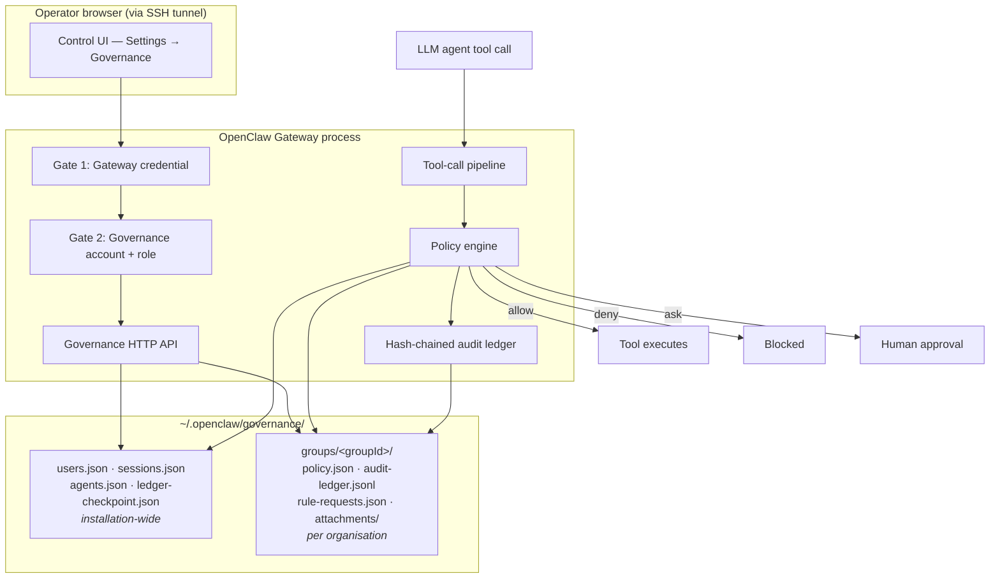

### TikZ form

```latex
\begin{figure}[htbp]
\centering
\begin{tikzpicture}[node distance=6mm and 10mm]
  \node[gbox] (ui) {Control UI\\Settings $\rightarrow$ Governance};
  \node[gnote, above=1mm of ui] {Operator browser, via SSH tunnel};

  \node[gbox, below=9mm of ui] (auth) {Gate 1\\Gateway credential};
  \node[gbox, below=of auth]   (rbac) {Gate 2\\Account session + role};
  \node[gbox, below=of rbac]   (api)  {Governance HTTP API};

  \node[gbox, right=28mm of ui]   (agent)  {LLM agent\\tool call};
  \node[gbox, below=9mm of agent] (pipe)   {Tool-call pipeline};
  \node[gbox, below=of pipe]      (engine) {Policy engine};
  \node[gbox, below=of engine]    (ledger) {Hash-chained\\audit ledger};

  \node[gstore, below=16mm of api, xshift=16mm] (disk)
    {\texttt{users.json} \quad \texttt{sessions.json} \quad \texttt{agents.json}
     \quad \texttt{ledger-checkpoint.json}\\[2pt]
     \texttt{groups/<groupId>/}\;\{\texttt{policy.json},
     \texttt{audit-ledger.jsonl}, \texttt{attachments/}\}};
  \node[gnote, below=0.5mm of disk]
    {\textasciitilde/.openclaw/governance/ --- top row installation-wide, bottom row per organisation};

  \node[gbox, right=12mm of ledger, yshift=9mm]  (allow) {Tool executes};
  \node[gbox, right=12mm of ledger]              (deny)  {Blocked};
  \node[gbox, right=12mm of ledger, yshift=-9mm] (ask)   {Human approval};

  \draw[gflow] (ui)     -- (auth);
  \draw[gflow] (auth)   -- (rbac);
  \draw[gflow] (rbac)   -- (api);
  \draw[gflow] (agent)  -- (pipe);
  \draw[gflow] (pipe)   -- (engine);
  \draw[gflow] (engine) -- (ledger);
  \draw[gflow] (api)    -- (disk);
  \draw[gflow] (ledger) -- (disk);
  \draw[gflow] (engine.west) -- ++(-6mm,0) |- (disk.west);

  \draw[gflow] (engine.east) -- ++(4mm,0) |- (allow.west) node[glab, pos=0.75] {allow};
  \draw[gflow] (engine.east) -- ++(4mm,0) |- (deny.west)  node[glab, pos=0.75] {deny};
  \draw[gflow] (engine.east) -- ++(4mm,0) |- (ask.west)   node[glab, pos=0.75] {ask};

  \begin{scope}[on background layer]
    \node[ggroup, fit=(auth)(rbac)(api)(pipe)(engine)(ledger)] (gw) {};
  \end{scope}
  \node[gnote, anchor=north west] at (gw.north west) {OpenClaw Gateway process};
\end{tikzpicture}
\caption{Governance layer within the OpenClaw Gateway.}
\label{fig:architecture}
\end{figure}
```

---

## F2 — RBAC hierarchy with inherited permissions

**Source:** §3.5.4 · **Proposed number:** Figure 3.2

**Recommendation: CUT the figure, keep the table.** The hierarchy is four boxes
in a straight line, and the permission matrix immediately below it in your
material says everything the figure says and a great deal more. A four-node chain
is one of the clearest signs of a figure included because a figure felt expected.
Spend the page on the table instead. The forms are here in case you disagree.

> **Updated suggestion, 2026-09-01 — KEEP it, and keep it small.** _(Added
> beside the original, not replacing it.)_
>
> **Why I changed my mind: this figure was wrong, and being wrong is the
> argument for drawing it.** It said the kill switch belongs to Root. It does
> not — the route has admitted a **User** acting on their own agents since T5,
> and `T42` (2026-09-01) had to be raised because _three separate surfaces_ were
> each describing that tier differently. This figure was a fourth, and the only
> one bound for the report.
>
> In lay terms: the thing this project got wrong more than once is **who is
> allowed to do what**, and a table of thirty rows is where that kind of error
> hides. Four boxes with the interesting capability written on the right box is
> where a supervisor notices it in two seconds. The table is better reference;
> the figure is better _review_, and this project's own history says review is
> what the tier model needed.
>
> Keep both, and put the figure first — one column wide, no more than the four
> boxes and one capability each.

### Prose form

The four tiers are strictly cumulative. A **Viewer** may read the policy and the
sanitised ledger and verify the chain's integrity; it is oversight only and
writes nothing. A **User** inherits all of that and gains the capabilities that
concern _the agents assigned to it_: unmasked ledger resources, prompting those
agents, asking an Administrator for a rule through the request queue, and —
the one most often misstated — **stopping and releasing those agents with the
emergency kill switch**. An **Administrator** inherits both and manages agents
rather than one agent: creating and registering them, assigning them to accounts,
editing rules, changing the posture, and deciding rule requests. **Root**
inherits everything and adds the capabilities that concern the installation
itself: account management, the approval timeout, switching a shipped core denial
off, the agent backend, and the deployment report. Because each tier is a
superset of the one below, no capability needs to be listed twice, and the only
question at any endpoint is which tier it requires.

Two scope qualifications apply. Every capability above is bounded by the
organisation the account belongs to. And an installation holds **one
organisation and therefore one Root**: the Root cap is enforced per organisation,
and a second organisation cannot be created on one installation, so the two rules
together make Root unique per machine.

_(Corrected 2026-09-01. This paragraph placed the kill switch at Root, which the
route has never required — `T42` exists because three surfaces disagreed about
that same tier, and this was a fourth. It also said one machine "may hold several
Roots who are invisible to one another", which stopped being true on 2026-08-30
when the one-organisation-per-installation cap landed.)_

### Mermaid form

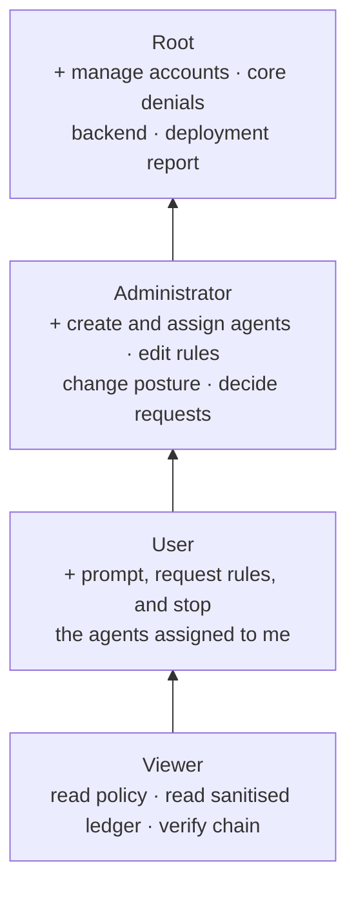

### TikZ form

```latex
\begin{figure}[htbp]
\centering
\begin{tikzpicture}[node distance=5mm]
  \node[gbox, minimum width=86mm] (v) {\textbf{Viewer} — read policy, read sanitised ledger, verify chain};
  \node[gbox, minimum width=86mm, above=of v] (u) {\textbf{User} — \textit{and} prompt, request rules, and stop \emph{my} agents};
  \node[gbox, minimum width=86mm, above=of u] (a) {\textbf{Administrator} — \textit{and} create and assign agents, edit rules, decide requests};
  \node[gbox, minimum width=86mm, above=of a] (r) {\textbf{Root} — \textit{and} manage accounts, core denials, backend, deployment report};
  \draw[gflow] (v) -- (u);
  \draw[gflow] (u) -- (a);
  \draw[gflow] (a) -- (r);
  \node[gnote, right=3mm of u, rotate=90, anchor=south] {inherits};
\end{tikzpicture}
\caption{Role hierarchy. Each tier inherits every capability below it. The emergency stop sits at \textbf{User}, scoped to the agents assigned to that account, not at Root.}
\label{fig:rbac}
\end{figure}
```

---

## F3 — Policy decision sequence

**Source:** §3.5.5 · **Proposed number:** Figure 3.3

**Recommendation: KEEP.** This is the central mechanism of the whole project and
it is a sequence, which is precisely what prose handles worst. A reader following
five participants across a branch will lose the thread in a paragraph and hold it
easily in a diagram. Second most important figure after F1.

**One change from the draft:** the Mermaid version shows the `allow-always` rule
being persisted, which is a nice detail but crowds the picture. The TikZ version
below drops it into the caption instead.

### Prose form

When an agent requests a tool call, the host's pipeline hands the tool name and
its parameters to the policy engine before anything executes. The engine first
resolves which organisation the agent belongs to, by consulting the agent
registry. An agent with no record there is refused outright, because registration
is mandatory and no policy document applies to an unregistered agent; that
refusal is recorded against the installation-wide trail, since there is no
organisation ledger to record it in. Otherwise the engine loads that
organisation's policy, checks whether the agent is under an active lockdown, then
extracts the resource the call would touch, then matches that resource against
every active, unexpired rule. Whatever it concludes is appended to the
hash-chained ledger before the
verdict is returned, so the record exists whether or not the call proceeds, and
each entry also carries what the model said it was doing on the turn that
produced the call. If a
rule matches, the verdict is allow and the tool runs. If none matches and
escalation is switched off, the call is blocked and the agent is told why. If
none matches and escalation is on, the decision is put to a human on the
dashboard, whose answer is itself appended to the ledger; an "allow always"
answer additionally becomes a new persisted rule.

### Mermaid form

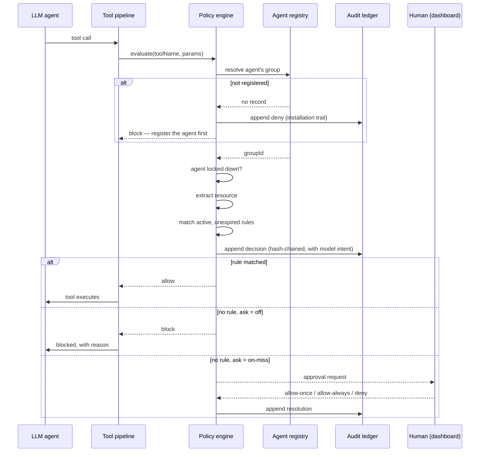

### TikZ form

```latex
\begin{figure}[htbp]
\centering
\begin{tikzpicture}[yscale=0.86]
  \foreach \x/\n in {0/{LLM agent}, 2.9/{Tool pipeline}, 5.8/{Policy engine},
                     8.7/{Agent registry}, 11.3/{Audit ledger}, 13.9/{Human}} {
    \node[gbox, minimum width=19mm] at (\x,0) {\n};
    \draw[glife] (\x,-0.45) -- (\x,-8.9);
  }
  \draw[gflow] (0,-1.0)   -- node[glab,above] {tool call} (2.9,-1.0);
  \draw[gflow] (2.9,-1.7) -- node[glab,above] {evaluate(tool, params)} (5.8,-1.7);

  \draw[gflow] (5.8,-2.4) -- node[glab,above] {resolve group} (8.7,-2.4);
  \draw[gdash] (8.7,-3.0) -- node[glab,above] {groupId, or no record} (5.8,-3.0);
  \draw[gdash] (5.8,-3.6) -- node[glab,above] {block: register the agent first} (0,-3.6);

  \draw[gflow] (5.8,-4.3) -- ++(0.8,0) -- ++(0,-0.5) -- (5.8,-4.8);
  \node[glab, right=32mm of {(5.8,-4.55)}, anchor=west]
    {locked down? \quad extract resource \quad match rules};

  \draw[gflow] (5.8,-5.5) -- node[glab,above] {append decision + intent} (11.3,-5.5);

  \draw[gdash] (5.8,-6.2) -- node[glab,above] {allow} (2.9,-6.2);
  \draw[gflow] (2.9,-6.8) -- node[glab,above] {tool executes} (0,-6.8);
  \draw[gdash] (5.8,-7.5) -- node[glab,above] {block, with reason} (0,-7.5);

  \draw[gflow] (5.8,-8.2) -- node[glab,above] {approval request} (13.9,-8.2);
  \draw[gdash] (13.9,-8.8) -- node[glab,above] {allow once / always / deny} (5.8,-8.8);
\end{tikzpicture}
\caption{Policy decision sequence. An unregistered agent is refused before any
policy is read. Of the remaining paths, the first is taken when a rule matches
and the other two when none does, depending on whether escalation is enabled. An
``allow always'' answer is additionally persisted as a new rule.}
\label{fig:decision}
\end{figure}
```

---

## F4 — Two-gate authentication

**Source:** §3.5.6 · **Proposed number:** would have been Figure 3.4

**Recommendation: MERGE into F1.** Figure 3.1 already draws both gates in
sequence. What this candidate adds is the detail of the login exchange, which is
a linear list of steps and reads perfectly well as a sentence. Drawing it twice
invites the reader to hunt for a difference between the two pictures.

### Prose form

Reaching any governance route requires passing two independent checks. The
browser first presents the Gateway's own credential, which is OpenClaw's existing
mechanism and is unchanged by this project. Only then does the governance layer
ask who the caller is. A caller with no account may sign up, which creates a Root
account and, with it, a new organisation for that Root to be responsible for; an
existing account supplies a username and password, verified with scrypt. Success
issues a session token of
thirty-two random bytes in an HttpOnly, SameSite=Strict cookie that expires after
twelve hours, and every subsequent request re-resolves that session and compares
the account's role against the tier the endpoint requires. Three details are
worth noting. The login throttle is keyed per username, so guessing one account
cannot be parallelised across many and a flood against one account cannot lock
out another. The cookie deliberately omits the Secure attribute, because the
Gateway binds to loopback and remote access arrives through an SSH tunnel;
requiring HTTPS would break the intended deployment without adding any
protection. And the signup route is itself ungated, which is defensible only
because of that same loopback binding: reaching it at all already requires the
tunnel and the Gateway credential. The report should state this plainly rather
than leave an examiner to find it.

### Mermaid form

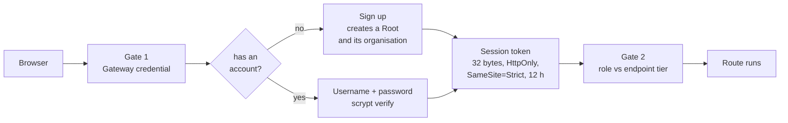

### TikZ form

```latex
\begin{figure}[htbp]
\centering
\begin{tikzpicture}[node distance=7mm and 9mm]
  \node[gbox] (b) {Browser};
  \node[gbox, right=of b]  (g1) {Gate 1\\Gateway credential};
  \node[gdec, right=of g1] (w)  {has an\\account?};
  \node[gbox, above right=4mm and 9mm of w] (boot) {Sign up: creates a Root\\and its organisation};
  \node[gbox, below right=4mm and 9mm of w] (cred) {Username + password\\scrypt verify};
  \node[gbox, right=24mm of w] (tok) {Session token\\32 bytes, HttpOnly\\SameSite=Strict, 12\,h};
  \node[gbox, right=of tok] (g2) {Gate 2\\role vs endpoint tier};

  \draw[gflow] (b)  -- (g1);
  \draw[gflow] (g1) -- (w);
  \draw[gflow] (w) -- node[glab,above] {no}  (boot);
  \draw[gflow] (w) -- node[glab,below] {yes} (cred);
  \draw[gflow] (boot) -| (tok);
  \draw[gflow] (cred) -| (tok);
  \draw[gflow] (tok) -- (g2);
\end{tikzpicture}
\caption{Two-gate authentication. Both gates are mandatory and independent.}
\label{fig:auth}
\end{figure}
```

---

## F5 — Path normalisation pipeline

**Source:** §3.5.8 · **Proposed number:** Figure 3.4 (renumbered)

**Recommendation: KEEP.** A short linear pipeline with a concrete example
travelling through it, ending in a rule that no longer matches. It supports one
of your strongest findings — that three separate bypasses were one defect — and
the example path does the explaining. Cheap to draw, high value.

**Note the draft has a bug:** the Mermaid in `CHAPTER3-MATERIAL.md` declares
nodes `S1`, `S2`, `S3` and then draws `M1 --> M2 --> M3`, so it renders three
empty boxes. Fixed in both versions below.

### Prose form

A policy rule is a pattern tested against a string, so a location-based rule is
only as strong as the string the gate builds. The path the agent wrote is
therefore resolved before any rule sees it. First it is made absolute, with the
home shortcut expanded and any parent-directory steps collapsed. Then symbolic
links are followed, so the path names the file it actually refers to rather than
one that points at it. Finally a single form is chosen: relative if the result
lies inside the workspace, absolute if it lies outside. Only then is the rule
applied. The example makes the consequence plain: `src/../../etc/passwd` begins
with the characters `src/` and so satisfies a naive rule meaning "only inside
src", but resolves to `/etc/passwd`, which does not, and is refused. The defence
is structural rather than a filter: nothing searches for dangerous patterns, the
path is simply reduced to what it really means before being judged. One later
addition completes the picture: the resolved path is not only matched against the
rule but handed onward to the tool, so the file the gate judged is the file the
tool opens. Without that the pipeline would answer correctly about a path the
tool then resolved a second time, which is the race Figure~\ref{fig:toctou}
describes.

### Mermaid form

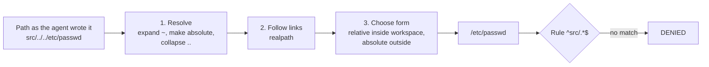

### TikZ form

```latex
\begin{figure}[htbp]
\centering
\resizebox{\textwidth}{!}{%
\begin{tikzpicture}[node distance=8mm]
  \node[gbox] (raw) {Path as the agent wrote it\\\texttt{src/../../etc/passwd}};
  \node[gbox, right=of raw] (s1) {1. Resolve\\expand \textasciitilde, make absolute,\\collapse \texttt{..}};
  \node[gbox, right=of s1]  (s2) {2. Follow links\\\texttt{realpath}};
  \node[gbox, right=of s2]  (s3) {3. Choose form\\relative inside workspace,\\absolute outside};
  \node[gbox, right=of s3]  (out) {\texttt{/etc/passwd}};
  \node[gdec, right=of out] (rule) {Rule\\\texttt{\^{}src/.*\$}};
  \node[gbox, right=of rule] (deny) {\textbf{DENIED}};

  \draw[gflow] (raw) -- (s1);
  \draw[gflow] (s1)  -- (s2);
  \draw[gflow] (s2)  -- (s3);
  \draw[gflow] (s3)  -- (out);
  \draw[gflow] (out) -- (rule);
  \draw[gflow] (rule) -- node[glab, above] {no match} (deny);
\end{tikzpicture}}
\caption{Path normalisation. The rule is matched against what the path resolves
to, not against what the agent typed.}
\label{fig:pathnorm}
\end{figure}
```

---

## F6 — The governed prompt path

**Source:** §3.5.11 · **Proposed number:** Figure 3.5

**Recommendation: KEEP, simplified.** This carries a real design argument — that
prompting reuses the host's ordinary ingress rather than opening a second way in
— and that argument is about a path, so a path diagram earns its place. The draft
has eleven nodes, which is two or three too many; the versions below drop the
"no runtime attached" branch to a caption note.

**Merge into it:** F10 (prompt lifecycle), whose stages are the same journey
viewed as time rather than as structure.

### Prose form

A User with an assigned agent may prompt it from the dashboard, and the design
constraint that shaped the feature was that prompting must not become a second
way into the agent. The request first passes the role check and the ownership
check, and is refused outright if either fails. It is then refused again, without
being sent, if the agent is currently locked down, and that refusal is itself
recorded with the account that attempted it. Only then is the prompt written to
the ledger, before the run rather than after it, attributed to the username
rather than to the agent. The run is finally handed to OpenClaw's ordinary
ingress, the same entry point the HTTP surface uses, with the sender marked as
not the owner and a session key naming both the agent and the account. Everything
downstream is unchanged, which is the point: had the layer built its own run
path, every guarantee this project makes about tool calls would have had to be
earned a second time on it.

### Mermaid form

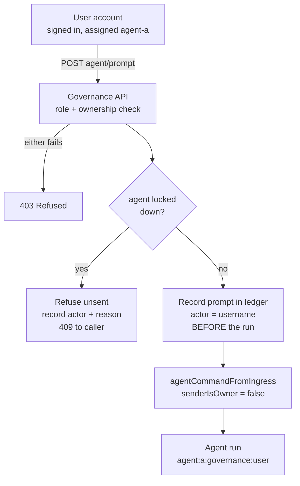

### TikZ form

```latex
\begin{figure}[htbp]
\centering
\begin{tikzpicture}[node distance=7mm and 14mm]
  \node[gbox] (u) {User account\\signed in, assigned \texttt{agent-a}};
  \node[gbox, below=of u]   (api)  {Governance API\\role check + ownership check};
  \node[gdec, below=9mm of api] (lock) {agent locked\\down?};
  \node[gbox, below=9mm of lock] (rec) {Record prompt in ledger\\actor = username,\\\textit{before} the run};
  \node[gbox, below=of rec] (ing) {\texttt{agentCommandFromIngress}\\\texttt{senderIsOwner = false}};
  \node[gbox, below=of ing] (run) {Agent run\\\texttt{agent:a:governance:user}};

  \node[gbox, right=of api]  (deny) {403 Refused};
  \node[gbox, right=of lock] (ref)  {Refuse unsent,\\record actor + reason,\\409 to caller};

  \draw[gflow] (u)    -- node[glab,right] {\texttt{POST agent/prompt}} (api);
  \draw[gflow] (api)  -- (lock);
  \draw[gflow] (lock) -- node[glab,right] {no} (rec);
  \draw[gflow] (rec)  -- (ing);
  \draw[gflow] (ing)  -- (run);
  \draw[gflow] (api)  -- node[glab,above] {either fails} (deny);
  \draw[gflow] (lock) -- node[glab,above] {yes} (ref);
\end{tikzpicture}
\caption{The governed prompt path. Where no runtime is attached to the agent, the
ingress step returns an explicit ``no runtime attached'' rather than failing
silently.}
\label{fig:promptpath}
\end{figure}
```

---

## F7 — The deployment-status seam

**Source:** §3.5.14 · **Proposed number:** —

**Recommendation: CUT.** Your own note argues it "illustrates the project's
layering discipline better than any prose", and I disagree: the layering claim is
made in one sentence, and a reader does not need a picture to accept that a pure
function takes plain data. It is an internal code-organisation detail, not a
design argument a reader will carry forward. The page is better spent on F11.

### Prose form

The deployment check is split at a deliberate seam. Everything that must touch
the running Gateway — its configuration and its security audit — stays on the
Gateway side and produces a plain data record. That record crosses one boundary
into the governance side, where a single pure function turns it into the
deployment verdict. The payoff is larger than tidiness: because the verdict
function depends on nothing but its input, every check is testable on any
platform with no Gateway, no socket and no configuration file, which is what
allowed the permission table to be verified on Windows CI where the real answer
is that those bits are not meaningful. The same shape recurs in the agent runner
and the agent terminator.

### Mermaid form

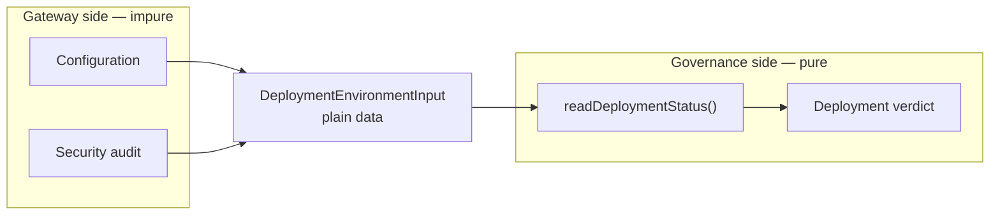

### TikZ form

```latex
\begin{figure}[htbp]
\centering
\begin{tikzpicture}[node distance=6mm and 12mm]
  \node[gbox] (cfg) {Configuration};
  \node[gbox, below=of cfg] (sec) {Security audit};
  \node[gbox, right=of cfg, yshift=-6mm] (in) {\texttt{DeploymentEnvironmentInput}\\plain data};
  \node[gbox, right=of in] (fn) {\texttt{readDeploymentStatus()}\\pure function};
  \node[gbox, right=of fn] (out) {Deployment verdict};

  \draw[gflow] (cfg) -- (in);
  \draw[gflow] (sec) -- (in);
  \draw[gflow] (in)  -- (fn);
  \draw[gflow] (fn)  -- (out);

  \begin{scope}[on background layer]
    \node[ggroup, fit=(cfg)(sec)] (g1) {};
    \node[ggroup, fit=(fn)(out)]  (g2) {};
  \end{scope}
  \node[gnote, above=0.5mm of g1] {Gateway side, impure};
  \node[gnote, above=0.5mm of g2] {Governance side, pure};
\end{tikzpicture}
\caption{The deployment-status seam: one plain-data record crosses the boundary.}
\label{fig:seam}
\end{figure}
```

---

## F8 — Two paths through the host to the gate

**Source:** §3.5.15 · **Proposed number:** Figure 3.6

**Recommendation: KEEP, and it has become more important twice over.** When this
was marked it illustrated finding B1. As of 2026-08-30 it also explains the T7
limitation, since the in-process and native-harness split is exactly why a search
result can be filtered on one path and not the other — and that split is now a
built control on one side and a documented impossibility on the other. One
figure, three arguments, across two chapters.

> **Consider adding a second panel** showing the _result_ direction rather than
> the _call_ direction: tool result → `afterToolCall` → model on the in-process
> path, versus tool result → observers only on the Codex path, with the model
> unreachable from the hook. The call direction is symmetric between the two
> runtimes and the result direction is not, which is the whole of §3.5.61.

**Merge into it:** F13 (two entry points, one gate). Both say "several routes,
one gate"; F13's Discord and dashboard entries can become two extra boxes feeding
the in-process path.

### Prose form

OpenClaw can run an agent in either of two arrangements, and the difference is
invisible from the dashboard. In the in-process arrangement the agent's tool
calls are executed by the same process that holds the Gateway, and each one
passes through the host's before-tool-call hook, where the gate is mounted.
Nothing optional stands between the call and the check. In the native-harness
arrangement, used by the Codex backend, the agent runs inside a separate helper
process that executes tools itself and knows nothing of OpenClaw's hooks. The
host reaches it by writing a relay hook into that helper's own configuration at
session start: a command the helper runs before each tool call, which calls back
into the host, which then runs the same hook and returns allow or block. The gate
is identical in both arrangements. The difference is that the second is governed
only if the relay was installed, and whether to install it was decided by a
question that counted plugin policies. This layer is not a plugin, so the answer
was no, and every tool call in that arrangement ran ungoverned.

### Mermaid form

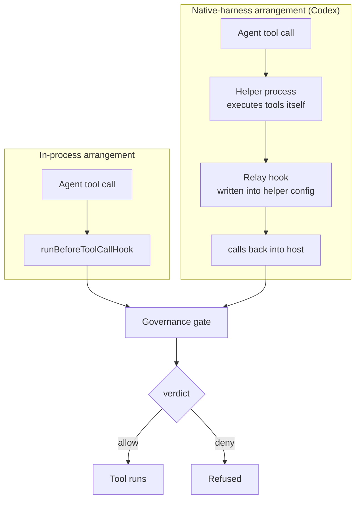

### TikZ form

```latex
\begin{figure}[htbp]
\centering
\begin{tikzpicture}[node distance=7mm and 11mm]
  \node[gbox] (a1) {Agent tool call};
  \node[gbox, right=of a1] (h1) {\texttt{runBeforeToolCallHook}};

  \node[gbox, below=16mm of a1] (a2) {Agent tool call};
  \node[gbox, right=of a2] (help) {Helper process\\executes tools itself};
  \node[gbox, right=of help] (relay) {Relay hook\\written into helper config};

  \node[gbox, right=26mm of h1, yshift=-11mm] (gate) {Governance gate};
  \node[gbox, right=of gate, yshift=6mm]  (ok) {Tool runs};
  \node[gbox, right=of gate, yshift=-6mm] (no) {Refused};

  \draw[gflow] (a1) -- (h1);
  \draw[gflow] (a2) -- (help);
  \draw[gflow] (help) -- (relay);
  \draw[gflow] (h1.east) -- ++(5mm,0) |- (gate.west);
  \draw[gflow] (relay.east) -- ++(5mm,0) |- (gate.west);
  \draw[gflow] (gate) -- node[glab, above] {allow} (ok);
  \draw[gflow] (gate) -- node[glab, below] {deny}  (no);

  \begin{scope}[on background layer]
    \node[ggroup, fit=(a1)(h1)] (g1) {};
    \node[ggroup, fit=(a2)(help)(relay)] (g2) {};
  \end{scope}
  \node[gnote, above=0.5mm of g1] {In-process};
  \node[gnote, below=0.5mm of g2] {Native harness (Codex)};
\end{tikzpicture}
\caption{Two arrangements, one gate. The lower path is governed only if the relay
hook was installed.}
\label{fig:twopaths}
\end{figure}
```

---

## F9 — Four modules, one definition

**Source:** §3.5.16 · **Proposed number:** —

**Recommendation: CUT.** A before-and-after of a refactoring. It is a good
engineering story and it belongs in the prose, but the picture is four boxes
pointing at one box, which tells a reader nothing they did not get from the
sentence. Keep the prototype-pollution detail in the text, which is the genuinely
interesting part and is not drawable anyway.

### Prose form

Four modules each needed to decide what an account name meant, and each wrote the
intention down slightly differently. The fix replaced them with one exported
definition that all four import. One subtlety made the change less mechanical
than it looks: the guard against prototype keys had to move to run after the
case-folding rather than before it, because lowercasing turns `__PROTO__` into
`__proto__`. Canonicalising the key space without moving the guard would have
opened a prototype-pollution route that had not previously existed.

### Mermaid form

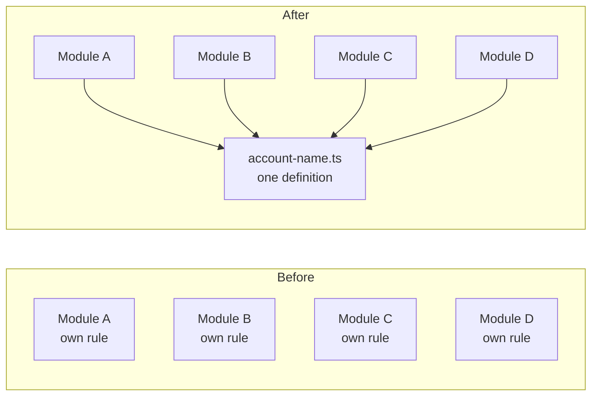

### TikZ form

```latex
\begin{figure}[htbp]
\centering
\begin{tikzpicture}[node distance=4mm and 16mm]
  \node[gbox] (m1) {Module A};
  \node[gbox, below=of m1] (m2) {Module B};
  \node[gbox, below=of m2] (m3) {Module C};
  \node[gbox, below=of m3] (m4) {Module D};
  \foreach \m in {m1,m2,m3,m4} { \node[gnote, right=2mm of \m] {own rule}; }

  \node[gbox, right=42mm of m1] (n1) {Module A};
  \node[gbox, below=of n1] (n2) {Module B};
  \node[gbox, below=of n2] (n3) {Module C};
  \node[gbox, below=of n3] (n4) {Module D};
  \node[gbox, right=of n2, yshift=-6mm] (def) {\texttt{account-name.ts}\\one definition};
  \foreach \n in {n1,n2,n3,n4} { \draw[gflow] (\n) -- (def); }

  \begin{scope}[on background layer]
    \node[ggroup, fit=(m1)(m4)] (gb) {};
    \node[ggroup, fit=(n1)(n4)(def)] (ga) {};
  \end{scope}
  \node[gnote, above=0.5mm of gb] {Before};
  \node[gnote, above=0.5mm of ga] {After};
\end{tikzpicture}
\caption{Four modules, one definition.}
\label{fig:accountname}
\end{figure}
```

---

## F10 — The prompt lifecycle

**Source:** §3.5.17 · **Proposed number:** —

**Recommendation: MERGE into F6.** F6 shows the same journey as structure; this
shows it as time. Two figures of one path, a few pages apart, will read as a
duplication the reader has to reconcile. If you would rather keep this one and
cut F6, that also works — but not both.

### Prose form

A prompt is a live thing an operator watches rather than a request that returns.
Its lifecycle has five stages. It first claims one of a bounded number of
concurrent slots, which matters because unbounded concurrency is a denial of
service available to the lowest tier that can act. It then records its intent in
the ledger before anything runs. While running it streams snapshots to the
dashboard, so the operator sees progress rather than a spinner. It ends in one of
three ways: a reply, an explicit cancellation, or a timeout, the last two
existing because a disconnected client previously left the agent working and a
wedged provider previously held a connection open indefinitely. Whichever way it
ends, the outcome is recorded.

### Mermaid form

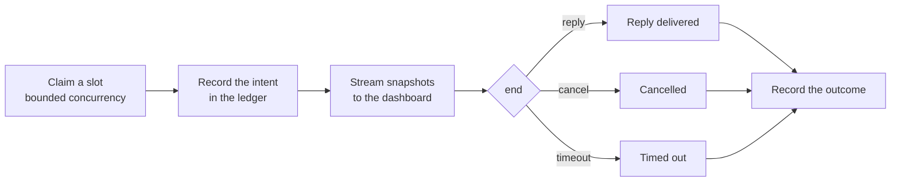

### TikZ form

```latex
\begin{figure}[htbp]
\centering
\begin{tikzpicture}[node distance=6mm and 10mm]
  \node[gbox] (s)  {Claim a slot\\bounded concurrency};
  \node[gbox, right=of s]  (i)  {Record the intent\\in the ledger};
  \node[gbox, right=of i]  (st) {Stream snapshots\\to the dashboard};
  \node[gdec, right=of st] (e)  {end};
  \node[gbox, above right=3mm and 9mm of e] (r) {Reply};
  \node[gbox, right=9mm of e]               (c) {Cancelled};
  \node[gbox, below right=3mm and 9mm of e] (t) {Timed out};
  \node[gbox, right=34mm of e] (o) {Record the outcome};

  \draw[gflow] (s) -- (i);
  \draw[gflow] (i) -- (st);
  \draw[gflow] (st) -- (e);
  \draw[gflow] (e) -- (r);
  \draw[gflow] (e) -- (c);
  \draw[gflow] (e) -- (t);
  \draw[gflow] (r) -| (o);
  \draw[gflow] (c) -- (o);
  \draw[gflow] (t) -| (o);
\end{tikzpicture}
\caption{The prompt lifecycle.}
\label{fig:promptlife}
\end{figure}
```

---

## F11 — The check-then-open window

**Source:** §3.5.29 (T23) · **Proposed number:** Figure 3.7

**Recommendation: KEEP, and it is the best candidate on the list after F1 and
F3.** A time-of-check-to-time-of-use race is genuinely hard to explain in prose,
because the reader has to hold two timelines and an interleaving in their head.
Two parallel timelines with the swap drawn between them makes it obvious in
seconds. Your own note states the requirement exactly: the figure must show that
both resolutions are correct and that having two of them is the defect.

### Prose form

The gate resolves the path the agent named, decides about the file that path
referred to at that instant, and then hands the original string back for the tool
to resolve a second time. A symbolic link is the easy way to exploit the gap
between the two. The link `workspace/notes` points at a harmless file when the
gate looks, so the gate allows it; the link is then repointed at a sensitive
file; and the tool, resolving the same string a moment later, opens the sensitive
one. Neither resolution is wrong. Each correctly reports where the link pointed
when it was asked. The defect is that there are two of them, with a window in
between, and the fix removes the second rather than trying to make it agree with
the first: the gate now hands the tool the canonical path it actually judged.

### Mermaid form

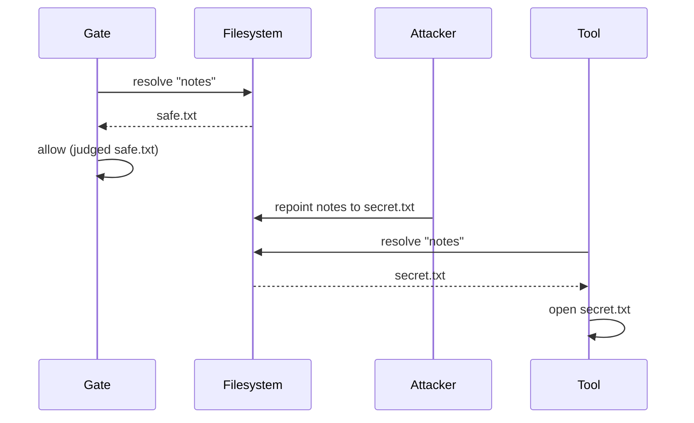

### TikZ form

```latex
\begin{figure}[htbp]
\centering
\begin{tikzpicture}[xscale=1.0]
  \draw[gflow] (0,0) -- (10.5,0) node[right, font=\scriptsize] {time};

  \node[gbox, above=8mm of {(1.6,0)}]  (g)  {Gate resolves \texttt{notes}\\$\rightarrow$ \texttt{safe.txt}};
  \node[gbox, above=8mm of {(4.3,0)}]  (a)  {Gate allows\\(judged \texttt{safe.txt})};
  \node[gbox, below=8mm of {(6.0,0)}]  (x)  {Attacker repoints\\\texttt{notes} $\rightarrow$ \texttt{secret.txt}};
  \node[gbox, above=8mm of {(8.6,0)}]  (t)  {Tool resolves \texttt{notes}\\$\rightarrow$ \texttt{secret.txt}};

  \foreach \p in {1.6, 4.3, 8.6} { \draw[glife] (\p,0) -- (\p,0.8); }
  \draw[glife] (6.0,0) -- (6.0,-0.8);
  \foreach \p in {1.6, 4.3, 6.0, 8.6} { \fill (\p,0) circle (1.1pt); }

  \draw[decorate, decoration={brace, amplitude=4pt}, draw=black!60]
    (4.3,-0.35) -- (8.6,-0.35) node[midway, below=4pt, font=\scriptsize\itshape] {the window};
\end{tikzpicture}
\caption{The check-then-open window. Both resolutions are correct; the defect is
that there are two of them.}
\label{fig:toctou}
\end{figure}
```

_(This one needs `\usetikzlibrary{decorations.pathreplacing}` added to the
preamble for the brace.)_

---

## F12 — Two groups on one installation

**Source:** §3.5.30 (M3) · **Proposed number:** Figure 3.8

**Recommendation: KEEP.** Multi-tenancy is a substantial feature added late, and
the whole claim rests on what does not cross the line between two groups. A
figure with a literal dividing line, labelled with what cannot cross it, makes
the isolation argument in one glance. Prose has to enumerate the same facts and
the reader has to assemble the picture themselves.

### Prose form

An installation may hold more than one organisation, and each is a closed world.
Every account belongs to exactly one group, and every User and Viewer has exactly
one Administrator answerable for it. Within a group there is one Root, who
manages people, and one or more Administrators, who manage agents; Users and
Viewers hang off individual Administrators. Nothing crosses between groups:
neither accounts, nor the list of accounts, nor agent assignment. The
single-Root rule was originally enforced per machine and is now enforced per
group, which the report should present as a scope correction rather than a
reversal. The original argument was that one Root must be answerable for the
thing a Root is responsible for, and that thing is now a group; only the accident
that a single organisation had ever existed made the machine look like the right
boundary.

### Mermaid form

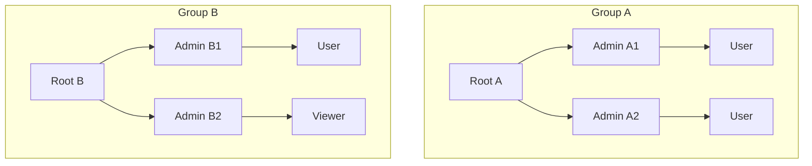

### TikZ form

```latex
\begin{figure}[htbp]
\centering
\begin{tikzpicture}[node distance=6mm and 7mm]
  \node[gbox] (ra) {Root A};
  \node[gbox, below left=8mm and 3mm of ra]  (a1) {Admin A1};
  \node[gbox, below right=8mm and 3mm of ra] (a2) {Admin A2};
  \node[gbox, below=of a1] (u1) {User};
  \node[gbox, below=of a2] (u2) {User};
  \draw[gflow] (ra) -- (a1); \draw[gflow] (ra) -- (a2);
  \draw[gflow] (a1) -- (u1); \draw[gflow] (a2) -- (u2);

  \node[gbox, right=44mm of ra] (rb) {Root B};
  \node[gbox, below left=8mm and 3mm of rb]  (b1) {Admin B1};
  \node[gbox, below right=8mm and 3mm of rb] (b2) {Admin B2};
  \node[gbox, below=of b1] (v1) {User};
  \node[gbox, below=of b2] (v2) {Viewer};
  \draw[gflow] (rb) -- (b1); \draw[gflow] (rb) -- (b2);
  \draw[gflow] (b1) -- (v1); \draw[gflow] (b2) -- (v2);

  \begin{scope}[on background layer]
    \node[ggroup, fit=(ra)(a1)(a2)(u1)(u2)] (ga) {};
    \node[ggroup, fit=(rb)(b1)(b2)(v1)(v2)] (gb) {};
  \end{scope}
  \node[gnote, above=0.5mm of ga] {Group A};
  \node[gnote, above=0.5mm of gb] {Group B};

  \draw[draw=black!70, thick, dash pattern=on 3pt off 2pt]
    ($(ga.north east)!0.5!(gb.north west) + (0,4mm)$) --
    ($(ga.south east)!0.5!(gb.south west) - (0,4mm)$);
  \node[gnote, align=center] at ($(ga.east)!0.5!(gb.west) + (0,-26mm)$)
    {does not cross:\\accounts\\the account list\\agent assignment};
\end{tikzpicture}
\caption{Two groups on one installation, and what does not cross between them.}
\label{fig:groups}
\end{figure}
```

---

## F13 — Two entry points, one gate

**Source:** §4.x.19 · **Proposed number:** —

**Recommendation: MERGE into F8.** Both figures make the claim "however the work
arrives, it reaches the same gate". F8 makes it about execution arrangements and
F13 about user-facing entry points, but a reader sees one idea drawn twice. Add
the Discord and dashboard boxes to F8 as inputs and delete this one.

### Prose form

Agent activity starts in more than one place and every route converges on the
same check. A message arriving from Discord or Telegram is routed by the host
into a session keyed by channel and peer. A prompt typed into the governance
dashboard produces a session keyed by agent and account instead. Both become an
ordinary agent run, and every tool call in either passes through the host's
before-tool-call hook and into the gate, which recovers the agent's identity from
the session key. The verdict is written to the ledger and then applied: the tool
runs, is refused, or is escalated into OpenClaw's existing approval machinery,
which surfaces as buttons in the chat client or as a request on the dashboard.

### Mermaid form

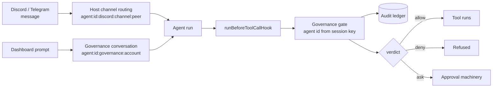

### TikZ form

```latex
\begin{figure}[htbp]
\centering
\resizebox{\textwidth}{!}{%
\begin{tikzpicture}[node distance=7mm and 11mm]
  \node[gbox] (d) {Discord / Telegram\\message};
  \node[gbox, below=of d] (g) {Dashboard prompt};
  \node[gbox, right=of d] (hs) {Host channel routing};
  \node[gbox, right=of g] (gs) {Governance conversation};
  \node[gbox, right=of hs, yshift=-9mm] (run) {Agent run};
  \node[gbox, right=of run] (hook) {\texttt{runBeforeToolCallHook}};
  \node[gbox, right=of hook] (gate) {Governance gate};
  \node[gstore, below=9mm of gate] (l) {Audit ledger};
  \node[gbox, right=of gate, yshift=9mm]  (t) {Tool runs};
  \node[gbox, right=of gate]              (x) {Refused};
  \node[gbox, right=of gate, yshift=-9mm] (a) {Approval machinery};

  \draw[gflow] (d) -- (hs); \draw[gflow] (g) -- (gs);
  \draw[gflow] (hs) -- (run); \draw[gflow] (gs) -- (run);
  \draw[gflow] (run) -- (hook); \draw[gflow] (hook) -- (gate);
  \draw[gflow] (gate) -- (l);
  \draw[gflow] (gate) -- node[glab, above] {allow} (t);
  \draw[gflow] (gate) -- node[glab, above] {deny}  (x);
  \draw[gflow] (gate) -- node[glab, below] {ask}   (a);
\end{tikzpicture}}
\caption{Two entry points, one gate.}
\label{fig:entrypoints}
\end{figure}
```

---

# Chapter 4 figures

## F14 — Tool coverage, before and after

**Source:** §4.x.20 · **Proposed number:** Figure 4.1

**Recommendation: KEEP, and it is the most honest figure in the report.** Your
own note has the argument exactly right: the "after" bar is not full, and the
figure must not let anyone read it as if it were. A stacked bar showing governed,
deliberately ungoverned with a written reason, and still-unexamined makes the
coverage claim and its limit in the same image. A "requirements met" table cannot
do that.

**Merge into it:** F15, which is the same data drawn a second way.

### Prose form

The host's catalogue declares fifty-two tools. Seven were governed when the
coverage question was first asked, and eighteen are governed now. The remaining
thirty-four are not an unmeasured gap: each carries a written justification for
why it is not governed, asserted by a test that refuses to let any of those
justifications be empty. Eighteen and thirty-four account for all fifty-two, so
nothing in the catalogue is unexamined. That is the honest shape of the claim.
Coverage improved, and the part that remains uncovered changed from something
nobody had counted into a set of recorded decisions.

The four tools round thirteen named as the materially load-bearing gaps are all
governed now, and the prose should say so rather than repeat the older framing:
`process`, which types into a background shell; `computer`, which drives a
desktop with synthetic keyboard and mouse events; and `code_execution` and
`sessions_spawn`, which run code and start further agents. Closing them needed no
change to the rule language, only a registry entry and a resource extractor each,
which is what made the earlier gap one of coverage rather than of mechanism.

> **Do not "correct" 52 to 56.** The `GOVERNED_TOOLS` registry has twenty-two
> entries and `qa-round11.test.ts` checks fifty-six names, because four governed
> tools (the search tools and an alias) are in the session-tool barrel and not in
> `tool-catalog.ts`. Both framings are internally consistent — 18 + 34 = 52 and
> 22 + 34 = 56 — and the documents use the catalogue framing throughout.
> `QA-IN-PLAIN-TERMS.md` §on round thirteen explains the discrepancy, which is
> itself part of how the original coverage gap stayed invisible.

### Mermaid form

**Mermaid can draw this now** — `xychart-beta` post-dates the note that used to
sit here saying it could not. It has no _stacked_ bar, so the honest rendering is
the governed count against the constant catalogue size, which is the comparison
the figure is actually making:

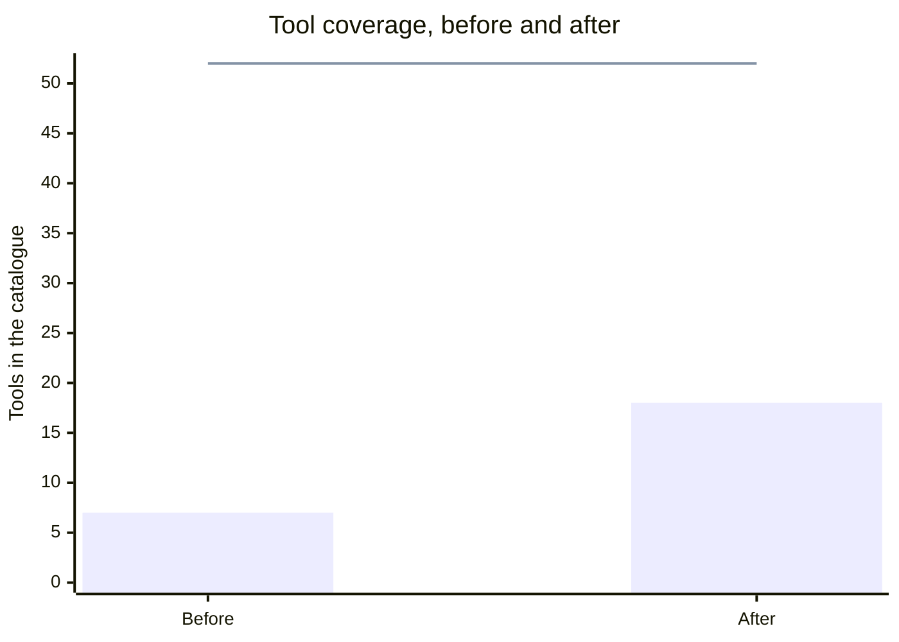

The bar is _governed_; the flat line is the catalogue. Use the table below when
drafting the composition, and the TikZ or prose form in the report:

| Stage  | Governed | Ungoverned, with reason | Unexamined | Catalogue |
| ------ | -------: | ----------------------: | ---------: | --------: |
| Before |        7 |                       0 |         45 |        52 |
| After  |       18 |                      34 |          0 |        52 |

Both rows total fifty-two, so the two bars are the same length and only their
composition changes. That is the point of the figure.

### TikZ form

```latex
\begin{figure}[htbp]
\centering
\begin{tikzpicture}
\begin{axis}[
  xbar stacked, width=0.86\textwidth, height=34mm,
  xmin=0, xmax=52, bar width=7mm,
  ytick=data, symbolic y coords={After, Before},
  axis lines*=left, tick style={draw=none},
  xlabel={Tools shipped by the host},
  legend style={at={(0.5,-0.55)}, anchor=north, legend columns=3, draw=none,
                font=\scriptsize},
  every node near coord/.append style={font=\scriptsize},
  nodes near coords=\pgfmathprintnumber\pgfplotspointmeta,
]
  \addplot+[fill=black!55, draw=black!55] coordinates {(7,Before) (18,After)};
  \addplot+[fill=black!25, draw=black!45] coordinates {(0,Before) (34,After)};
  \addplot+[fill=black!5,  draw=black!45] coordinates {(45,Before) (0,After)};
  \legend{Governed, Ungoverned with a written reason, Unexamined}
\end{axis}
\end{tikzpicture}
\caption{Tool coverage before and after. The ``after'' bar is not full: what
changed is that the uncovered part became a set of recorded decisions rather than
an unmeasured gap.}
\label{fig:coverage}
\end{figure}
```

---

## F15 — Tool catalogue, governed entries highlighted

**Source:** §4.x.20 · **Proposed number:** —

**Recommendation: MERGE into F14 (or cut).** This is the same data as F14 drawn
differently. A two-column list of fifty-two tool names is also hard to read at
thesis figure size, and the eighteen highlighted entries would be a wall of
small type. F14 carries the argument better and fits the page.

### Prose form

Covered by F14's prose above. If you want the catalogue itself, it belongs in an
appendix as a table with a "governed" column, not as a figure.

### Mermaid form

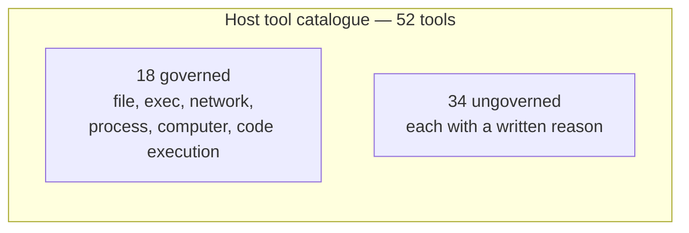

### TikZ form

```latex
\begin{figure}[htbp]
\centering
\begin{tikzpicture}[node distance=4mm]
  \node[gbox, fill=black!18, minimum width=38mm, minimum height=22mm] (g)
    {18 governed\\\scriptsize file, exec, network,\\\scriptsize process, computer, code execution};
  \node[gbox, right=0mm of g, minimum width=58mm, minimum height=22mm] (n)
    {34 ungoverned\\\scriptsize each with a written justification};
  \node[gnote, above=1mm of $(g.north)!0.5!(n.north)$] {Host tool catalogue --- 52 tools};
\end{tikzpicture}
\caption{Proportion of the host's tool catalogue reached by the gate.}
\label{fig:catalogue}
\end{figure}
```

---

## F16 — Rule row, before and after

**Source:** §4.x.24 · **Proposed number:** —

**Recommendation: CUT as a drawn figure. Use two screenshots instead.** This is a
user-interface change, and a redrawn approximation of a UI is strictly worse
evidence than the UI itself. You already have a running dashboard, so crop two
narrow screenshots of one rule row and place them side by side in a single
figure. A hand-drawn version invites the question of whether the real thing looks
like that.

### Prose form

The rule list originally led with the pattern, so an operator scanning it read a
column of regular expressions and had to decode each one to find the rule they
wanted. The replacement leads with the rule's description and demotes the pattern
to secondary text beneath it. The change matters more than presentation: this
panel is where somebody answers the question "what actually permits this?" during
an incident, and a list that has to be decoded under pressure is a control that
fails when it is needed most.

### Mermaid form

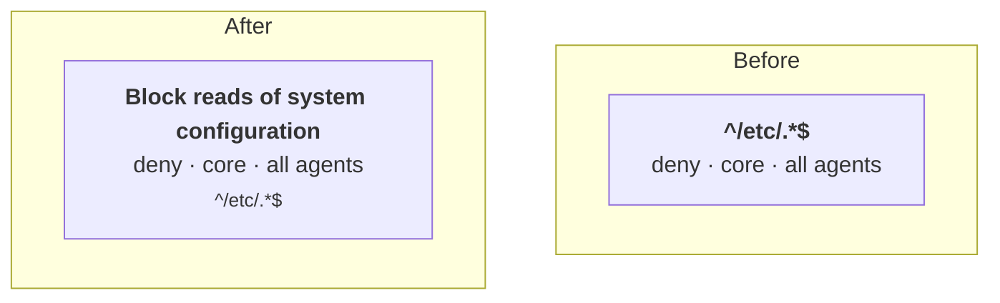

### TikZ form

```latex
\begin{figure}[htbp]
\centering
\begin{tikzpicture}[node distance=6mm]
  \node[gbox, align=left, minimum width=70mm] (b)
    {\texttt{\^{}/etc/.*\$}\\[2pt]\scriptsize deny \quad core \quad all agents};
  \node[gbox, align=left, minimum width=70mm, below=of b] (a)
    {\textbf{Block reads of system configuration}\\[2pt]
     \scriptsize deny \quad core \quad all agents\\[2pt]
     \scriptsize\texttt{\^{}/etc/.*\$}};
  \node[gnote, left=2mm of b] {Before};
  \node[gnote, left=2mm of a] {After};
\end{tikzpicture}
\caption{One rule row: pattern-first, and the description-first replacement.}
\label{fig:rulerow}
\end{figure}
```

---

## F17 — Defects by the age of the code containing them

**Source:** §4.x.29 · **Proposed number:** Figure 4.2

**Recommendation: KEEP.** This is the quantitative backbone of your continuous-
review argument, and it is the kind of claim a reader will not accept on
assertion. The argument the figure must carry, in your own words: the
distribution is not flat and does not favour old code. Draw it and the point
makes itself.

**One caution, and it is the reason this figure is dangerous as well as
valuable.** Your note says "across all seventeen rounds". There are now
**182 findings** _(this sentence said 148 until 2026-09-01 — a stale count
inside the caution about stale counts, which is the joke this project keeps
making at its own expense)_, so the figure would misreport the
project if drawn from the old note. Worse, the classification is not mechanically
derivable: no field in the registers records how old the code was when a defect
was found, so the four buckets have to be assigned by reading each finding.
**The values in the code below are placeholders and must be replaced.** Until
they are, do not put this figure in a draft anyone else reads. A chart carries
more apparent authority than a sentence, which is exactly why an unverified one
is worse than none.

> **Updated suggestion, 2026-09-01 — CUT, and replace it with a claim you can
> actually compute.** _(Added beside the original, not replacing it.)_
>
> The original recommendation has now stood unfilled for the life of the
> document: the table below is still **empty**, across two rounds of editing and
> 182 findings. That is information. A figure nobody has been able to fill in
> during months of work is not waiting on effort, it is waiting on data that
> does not exist — no register records how old the code was when a defect was
> found, so every one of the 182 would have to be re-read and judged, by hand,
> under deadline, to produce four numbers.
>
> In lay terms: you would be spending a day of the last week manufacturing a
> statistic, and a reader who asks "how did you classify these?" gets "I decided,
> afterwards" — which is the weakest possible footing for the one chart in the
> chapter.
>
> **What to draw instead, from data the project already has:** findings per QA
> round, over time. It is mechanically derivable from `REMAINING-WORK.md` — the
> rounds are numbered and the findings are numbered — it needs no judgement, and
> it supports the same argument better. It shows review finding defects _at a
> steady rate that does not fall off_, which is the actual claim: the reviews
> never stopped paying. The last four rounds alone found 21, 11 and 2 defects in
> code that was days old.
>
> Keep the prose version of the age argument in the text, where "I judged these
> by reading them" is an honest thing to write and a chart cannot say it.

### Prose form

The project's 148 findings, across twenty-eight review rounds, were classified by
the age of the code they were found in. The distribution is markedly uneven and
does not favour old code.
The largest group by a wide margin is code written within the same week as the
round that found it, and a substantial share is code written the same day.
Long-standing code inherited from the host accounts for the smallest group. This
matters because it is the argument for reviewing continuously rather than once at
the end: if defects were distributed evenly across the age of the code, an
end-of-project audit would find as many as a running series of rounds, and the
case for the method used here would be much weaker. The sharpest instance is a
compliance claim and its violation being written in the same commit, which no
review of older code could ever have caught.

### Mermaid form

**Mermaid can draw this now** — `xychart-beta` post-dates the note that used to
sit here. The shape, once the counts exist:

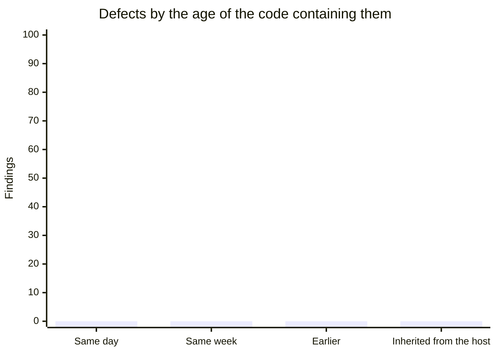

**The counts are zero because they have never been compiled.** Draft as a table
first:

| Age of the code when the defect was found | Findings |
| ----------------------------------------- | -------: |
| Same day                                  |          |
| Same week                                 |          |
| Earlier in the project                    |          |
| Inherited from the host                   |          |

### TikZ form

```latex
\begin{figure}[htbp]
\centering
\begin{tikzpicture}
\begin{axis}[
  ybar, width=0.8\textwidth, height=52mm,
  ymin=0, bar width=11mm,
  symbolic x coords={Same day, Same week, Earlier, Inherited},
  xtick=data, axis lines*=left, tick style={draw=none},
  ylabel={Findings}, nodes near coords,
  every node near coord/.append style={font=\scriptsize},
  x tick label style={font=\small},
]
  % PLACEHOLDER VALUES. These four numbers sum to 148, the current finding
  % total, but the split between the buckets is NOT measured — it has to be
  % assigned by reading each finding. Replace before use.
  \addplot+[fill=black!45, draw=black!55]
    coordinates {(Same day,21) (Same week,58) (Earlier,44) (Inherited,25)};
\end{axis}
\end{tikzpicture}
\caption{Defects by the age of the code containing them. The distribution does
not favour old code, which is the argument for reviewing continuously rather than
once.}
\label{fig:defectage}
\end{figure}
```

---

## F18 — The M-series as a whole (cross-reference)

**Source:** §3.5.51 · **Proposed number:** —

**Recommendation: CUT — it is not a figure.** This candidate is a pointer saying
"see §3.5.56", which is F19. Delete the marker so the count of figures stops
being inflated by a cross-reference. No forms are given because there is nothing
here to draw that F19 does not draw.

---

## F19 — The tenant model

**Source:** §3.5.56 · **Proposed number:** Figure 3.9

**Recommendation: KEEP.** The M-series is six subtasks that are far easier to
defend as one argument than as six features, and the reason is structural: each
supplies a noun the next one needs. That dependency chain is exactly what a
diagram shows well and a list shows badly.

### Prose form

The multi-tenancy work is six subtasks, and each supplies a noun the next one
needs. M3 introduces the group: one Root and its own accounts. M4 adds the agent
record, which carries an identifier, a name, the group it belongs to, and the one
Administrator who owns it; the group is the thing that record belongs to, so M4
needs M3. M5 then isolates storage, giving each group its own policy document,
ledger, rule requests and attachments, while keeping one installation-wide
signing key and a single checkpoint file keyed by group, so that the
tamper-evidence claim survives word for word. M6 finally adds the Administrator
panel and provisioning, which creates an agent in the host's roster and the
registry as one transaction. Read in that order the series is one argument about
making a single-tenant system multi-tenant without weakening any claim it already
made.

### Mermaid form

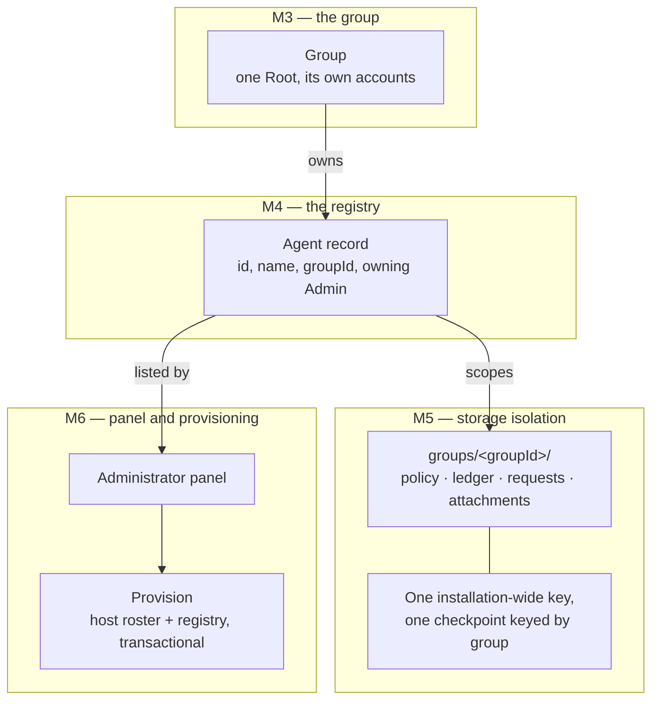

### TikZ form

```latex
\begin{figure}[htbp]
\centering
\begin{tikzpicture}[node distance=9mm and 12mm]
  \node[gbox] (g) {Group\\\scriptsize one Root, its own accounts};
  \node[gbox, below=of g] (a) {Agent record\\\scriptsize id, name, groupId, owning Admin};
  \node[gbox, below left=10mm and 2mm of a]  (s) {\texttt{groups/<groupId>/}\\\scriptsize policy, ledger, requests, attachments};
  \node[gbox, below right=10mm and 2mm of a] (ui) {Administrator panel};
  \node[gstore, below=of s]  (k) {One installation-wide key,\\one checkpoint keyed by group};
  \node[gbox,  below=of ui]  (p) {Provision\\\scriptsize host roster + registry, transactional};

  \draw[gflow] (g)  -- node[glab, right] {owns} (a);
  \draw[gflow] (a)  -- node[glab, left]  {scopes} (s);
  \draw[gflow] (a)  -- node[glab, right] {listed by} (ui);
  \draw[gflow] (ui) -- (p);
  \draw[draw=black!55] (s) -- (k);

  \node[gnote, left=2mm of g]  {M3};
  \node[gnote, left=2mm of a]  {M4};
  \node[gnote, left=2mm of s]  {M5};
  \node[gnote, right=2mm of ui] {M6};
\end{tikzpicture}
\caption{The tenant model. Each subtask supplies a noun the next one needs.}
\label{fig:tenant}
\end{figure}
```

---

## F20 — The same secret, several spellings

**Source:** §3.5.60 · **Proposed number:** —

**Recommendation: CUT the figure, keep the table.** I marked this candidate
myself when writing §3.5.60, and on reflection the table already in that section
is better than any drawing of it. The content is a list of flag spellings with
two outcomes each, which is what a table is for. A figure would only add boxes
around the words.

### Prose form

The masker recognised credential flags only when the key stood alone. A flag
written as `--password=` was masked, and one written as `--db-password=` was not,
because the pattern anchored the key immediately after the two dashes and
`db-password` is not the word `password`. A single component of prefix therefore
defeated the entire list, so `--http-password=`, `--admin-password=`,
`--gateway-password=` and `--http-token=` all reached the tamper-evident ledger
verbatim. The fix applies the host's own prefix-matching convention, which
already existed for configuration assignments and environment variables, to
command-line flags. Two words are deliberately excluded and suffixes are not
matched, so `--first-pass=2`, `--sort-key=name` and `--password-file=/etc/pw.txt`
remain readable, because a masker that hides ordinary arguments makes the ledger
describe something other than what ran.

### Mermaid form

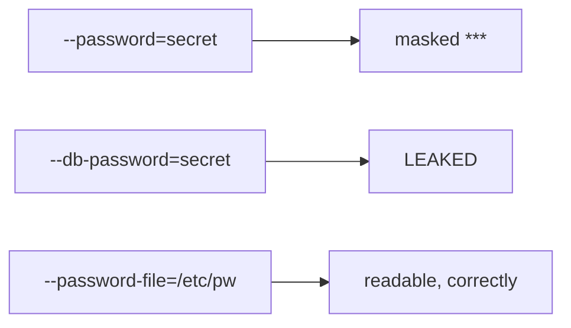

### TikZ form

```latex
\begin{figure}[htbp]
\centering
\begin{tikzpicture}[node distance=4mm and 16mm]
  \node[gbox] (p1) {\texttt{-{}-password=secret}};
  \node[gbox, below=of p1] (p2) {\texttt{-{}-db-password=secret}};
  \node[gbox, below=of p2] (p3) {\texttt{-{}-password-file=/etc/pw}};
  \node[gbox, right=of p1] (m1) {masked \texttt{***}};
  \node[gbox, right=of p2, fill=black!12] (m2) {\textbf{leaked}};
  \node[gbox, right=of p3] (m3) {readable, correctly};
  \draw[gflow] (p1) -- (m1);
  \draw[gflow] (p2) -- (m2);
  \draw[gflow] (p3) -- (m3);
\end{tikzpicture}
\caption{Before the fix: one component of prefix defeated the whole key list.}
\label{fig:masking}
\end{figure}
```

---

# Summary table

| #   | Figure                         | Recommendation        | Where           |
| --- | ------------------------------ | --------------------- | --------------- |
| F1  | Governance layer in Gateway    | **Keep** (absorb F4)  | Fig 3.1         |
| F2  | RBAC hierarchy                 | Cut, keep the table   | —               |
| F3  | Policy decision sequence       | **Keep**              | Fig 3.3 → 3.2   |
| F4  | Two-gate authentication        | Merge into F1         | —               |
| F5  | Path normalisation             | **Keep**              | Fig 3.3         |
| F6  | Governed prompt path           | **Keep** (absorb F10) | Fig 3.4         |
| F7  | Deployment-status seam         | Cut                   | —               |
| F8  | Two paths to the gate          | **Keep** (absorb F13) | Fig 3.5         |
| F9  | Four modules, one definition   | Cut                   | —               |
| F10 | Prompt lifecycle               | Merge into F6         | —               |
| F11 | Check-then-open window         | **Keep**              | Fig 3.6         |
| F12 | Two groups on one installation | **Keep**              | Fig 3.7         |
| F13 | Two entry points, one gate     | Merge into F8         | —               |
| F14 | Tool coverage before/after     | **Keep** (absorb F15) | Fig 4.1         |
| F15 | Tool catalogue highlighted     | Merge into F14        | —               |
| F16 | Rule row before/after          | Cut — use screenshots | Fig 4.x (photo) |
| F17 | Defects by age of code         | **Keep**, re-derive   | Fig 4.2         |
| F18 | M-series cross-reference       | Cut — not a figure    | —               |
| F19 | The tenant model               | **Keep**              | Fig 3.8         |
| F20 | Same secret, several spellings | Cut, keep the table   | —               |
| F21 | Two-layer Codex permission     | **Keep**              | Fig 3.10        |

**Eleven figures: nine in Chapter 3, two in Chapter 4**, plus one screenshot pair
for F16 if you want it. That is a normal, defensible number for two chapters of
this length, and every one of the ten earns its page by explaining something a
paragraph explains worse.

---

## F21 — The two-layer Codex permission

**Source:** §3.5.62 · **Proposed number:** Figure 3.10

**Recommendation: KEEP.** Added 2026-08-30. Two gates in series is a shape prose
handles badly and a picture handles in one glance, and the claim it carries —
_they compose in the safe direction_ — is exactly the sort a reader accepts
visually and doubts in a sentence. It also does double duty: it shows the tier
split, which is the strongest evidence in the report that the role model is
applied rather than asserted.

### Prose form

Two separate permissions stand between an agent and the Codex runtime, and they
belong to different tiers. Root decides whether the backend exists on this
installation at all, which is a deployment question: disabling it also withdraws
the Codex-managed model catalogue and media understanding, and leaves supervised
chats locked. An Administrator decides, per agent, which agents may use it, which
is an agent's security boundary. Both must be open for an agent to reach that
runtime, so neither permission alone opens the gap. The in-process runtime needs
no permission at all and is always available, which is what makes default-off
cost an operator nothing until they choose otherwise.

### Mermaid form

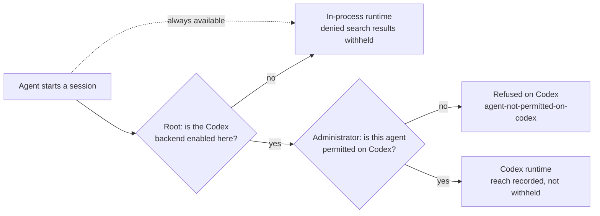

### TikZ form

```latex
\begin{figure}[htbp]
\centering
\begin{tikzpicture}[node distance=8mm and 13mm]
  \node[gbox] (a) {Agent starts\a session};
  \node[gdec, right=of a]  (r)  {Root:\backend\enabled?};
  \node[gdec, right=of r]  (ad) {Administrator:\agent\permitted?};
  \node[gbox, right=of ad] (cx) {Codex runtime\\scriptsize reach recorded, not withheld};
  \node[gbox, below=16mm of ad] (ip) {In-process runtime\\scriptsize denied results withheld};
  \node[gbox, below=9mm of cx]  (ref) {Refused\\scriptsize \texttt{agent-not-permitted-on-codex}};

  \draw[gflow] (a)  -- (r);
  \draw[gflow] (r)  -- node[glab, above] {yes} (ad);
  \draw[gflow] (ad) -- node[glab, above] {yes} (cx);
  \draw[gflow] (r)  -- node[glab, left]  {no}  (ip);
  \draw[gflow] (ad) -- node[glab, right] {no}  (ref);
  \draw[gdash] (a.south) |- node[glab, below, pos=0.25] {always available} (ip.west);

  \node[gnote, above=1mm of r]  {deployment};
  \node[gnote, above=1mm of ad] {agent boundary};
\end{tikzpicture}
\caption{The two-layer Codex permission. Both gates must be open; the in-process
runtime needs neither.}
\label{fig:codexgates}
\end{figure}
```

---

## F22 — Grant a folder, except… (added 2026-09-01)

**Source:** §3.5.66 · **Proposed number:** Figure 3.10

**New figure, not a revision.** T32 shipped on 2026-08-31 and this document was
last touched the same day without gaining a candidate for it, so the newest
operator-facing feature had no figure at all.

**Recommendation: KEEP.** This is the only control in the layer that writes
**two opposite kinds of rule as a single act**, and that is precisely what a
reader gets wrong. In lay terms: an operator types "let the agent have `/srv/app`
but not `/srv/app/secrets`", and what actually lands in the policy is one
_allow_ and one _deny_ — after which the deny wins wherever the two overlap,
because forbid always beats allow regardless of the order the rules are in. Three
sentences of prose, or one picture of a box with a hole in it.

There is a second reason to draw it, and it is evidence rather than taste. On
2026-09-01 this exact feature produced **finding 178**: the two rules it writes
appeared in the audit ledger as two entries that were _identical in form and
opposite in meaning_, because the entry never recorded which direction a rule
went. The confusion the figure removes is the confusion that already cost a
defect.

**If you are short of pages, this is a better cut than F5 or F11** — but do not
cut it in favour of F16, which is a screenshot of a table row.

### Prose form

A folder grant is a shortcut, not a new mechanism. The operator names one folder
and any number of paths inside it that must stay out of reach. The layer writes
ordinary rules: one **allow** rule binding the named folder and everything
beneath it, and one **deny** rule for each exception, likewise covering
everything beneath it. Nothing else is created, and every rule it writes appears
in the ordinary rule list where it can be read, edited or removed one at a time.

Two properties make the result behave the way the operator meant. First,
**forbid beats allow whatever the order**, so an exception carves a hole in the
grant rather than racing it. Second, a path pattern binds the folder _and its
subtree_ by ending in "either a separator or the end of the string", so a grant
on `work` cannot accidentally cover a sibling called `work-other`.

Two deliberate asymmetries are worth stating because they surprise people. The
denials are written **before** the allow, so that a failure part-way through
leaves less access than intended rather than more. And an exception is never
narrowed to reads or writes even when the grant is: "except this" means the whole
path is out, and a read-only exception inside a read-only grant would leave the
excepted path writable — the opposite of what was typed.

Finally, the exception must lie inside the folder being granted. One outside it
is almost always a typo, and its effect would be to write a denial somewhere the
operator was not looking, so it is refused with both paths named and nothing is
written.

### Mermaid form

```mermaid
flowchart TB
  IN["Operator types:<br/>folder = /srv/app<br/>except = /srv/app/secrets"]
  CHK{"Is every exception<br/>inside the folder?"}
  REF["Refused — nothing written<br/><small>a denial outside the grant is a typo</small>"]
  D["1 · DENY  ^/srv/app/secrets(/|$)<br/><small>written first: a partial failure leaves less access</small>"]
  A["2 · ALLOW ^/srv/app(/|$)<br/><small>narrowable to read or write</small>"]
  OUT["Two ordinary rules in the policy<br/><small>editable and removable one at a time</small>"]
  GATE["At evaluation: forbid beats allow,<br/>whatever the order"]

  IN --> CHK
  CHK -->|no| REF
  CHK -->|yes| D --> A --> OUT --> GATE
```

### TikZ form

```latex
\begin{figure}[htbp]
\centering
\begin{tikzpicture}[node distance=7mm and 12mm]
  \node[gbox] (in) {Operator types\\\scriptsize folder \texttt{/srv/app}, except \texttt{/srv/app/secrets}};
  \node[gdec, below=of in] (chk) {every exception\\inside the folder?};
  \node[gbox, right=of chk] (ref) {Refused\\\scriptsize nothing is written};
  \node[gbox, below=of chk] (d) {\textbf{1 · DENY} \texttt{\^{}/srv/app/secrets(/\textbar\$)}\\\scriptsize written first, so a partial failure leaves \emph{less} access};
  \node[gbox, below=of d]   (a) {\textbf{2 · ALLOW} \texttt{\^{}/srv/app(/\textbar\$)}\\\scriptsize narrowable to read or write};
  \node[gbox, below=of a]   (out) {Two ordinary rules in the policy\\\scriptsize editable and removable one at a time};
  \node[gnote, below=6mm of out] (gate) {at evaluation: \textbf{forbid beats allow}, whatever the order};

  \draw[gflow] (in)  -- (chk);
  \draw[gflow] (chk) -- node[glab, above] {no} (ref);
  \draw[gflow] (chk) -- node[glab, right] {yes} (d);
  \draw[gflow] (d)   -- (a);
  \draw[gflow] (a)   -- (out);
  \draw[gdash] (out) -- (gate);
\end{tikzpicture}
\caption{A folder grant writes one allow and one deny per exception, denials
first. The exception carves a hole in the grant because forbid beats allow
independently of order.}
\label{fig:foldergrant}
\end{figure}
```
