# Figures: three forms of each, and a keep/cut recommendation

**Written 2026-08-30 (T17).** Every "Figure candidate" marked in
`CHAPTER3-MATERIAL.md`, in three interchangeable forms:

- **Prose**: a paragraph that carries the same argument with no figure at all.
  Use this where the figure would not earn its page.
- **Mermaid**: for drafting, for the repository documents, and for anything you
  want to keep editable as the design moves.
- **TikZ**: for the report itself. Native LaTeX, so it uses the thesis fonts and
  stays sharp at any zoom or print size.

Each entry carries a recommendation. **They are advice, not decisions**. The
brief was to give you all three for every candidate so the choice is yours while
writing.

**The current recommendations are the summary table, "# Summary table" below:
sixteen figures, fourteen in Chapter 3 and two in Chapter 4 (2026-09-23).** The rest of
this paragraph is as first written. **Summary of the recommendations: keep 10, cut 7, merge 3.** _(Written for F1–F20. F22 was added 2026-09-01 as a keep, and **F23 and F24 were added 2026-09-11 for T60 and T63, both keeps** — so the drawable total is now 23, F18 being a cross-reference.)_ Twenty figures is a
lot for two chapters, and several candidates were notes-to-self rather than
arguments. The ten recommended keeps are the ones where a reader genuinely
understands something faster from the picture than from the paragraph.

---

### Reviewed against the code, 2026-09-01

Every figure re-read against what the system now does. **Where a recommendation
changed, the new one is added beside the old rather than replacing it**, F2 and
F17 carry an "Updated suggestion" block, and the reasoning in each is written in
plain terms.

|                                               |                                                                                                                                                                                                                                                                                                                                                                                                               |
| --------------------------------------------- | ------------------------------------------------------------------------------------------------------------------------------------------------------------------------------------------------------------------------------------------------------------------------------------------------------------------------------------------------------------------------------------------------------------- |
| **F2 corrected, and it is the important one** | It put the emergency stop at **Root**. The route has admitted a **User** acting on their own agents since T5, `T42` exists because three surfaces described that tier three ways, and this figure was a **fourth**, the only one bound for the report. It also said one machine "may hold several Roots", which stopped being true when the one-organisation cap landed on 2026-08-30. All three forms fixed. |
| **F2's recommendation reversed**              | From _cut_ to _keep it, and keep it small_, because it was wrong, and a four-box picture is where that class of error gets noticed                                                                                                                                                                                                                                                                            |
| **F17's recommendation reversed**             | From _keep_ to _cut and replace_: its data table is still empty after months, because no register records how old code was when a defect was found. The replacement it now proposes is computable from data the project already has                                                                                                                                                                           |
| **F14 and F17 gained real Mermaid**           | Both said "Mermaid has no bar chart". True when written; `xychart-beta` exists now                                                                                                                                                                                                                                                                                                                            |
| **F22 added**                                 | The folder grant (T32) had no figure at all. The newest operator-facing feature, and the only control that writes an allow and a deny as one act, which is exactly the confusion that produced finding 178                                                                                                                                                                                                    |
| **Everything else verified accurate**         | 21 figures, each with prose, Mermaid and TikZ. F18 is a cross-reference and correctly has none                                                                                                                                                                                                                                                                                                                |

**Counts in figure captions and cautions were re-derived rather than trusted.**
F17's own warning about stale numbers said "148 findings" when there were 182,
a stale count inside a caution about stale counts.

### Re-checked against the seventh and eighth segment sweeps, 2026-09-02

Findings 209–219 changed authorization, session state, organisation deletion and
the Codex ledger entries, so every figure touching those was read again.
**Nothing needed redrawing**, and the two near misses are worth recording
because they are the figures that _would_ have been wrong under a slightly
different fix:

|                                     |                                                                                                                                                                                                                                                                                                  |
| ----------------------------------- | ------------------------------------------------------------------------------------------------------------------------------------------------------------------------------------------------------------------------------------------------------------------------------------------------ |
| **F2 stayed correct. Narrowly**     | Its User box reads "prompt, request rules, and stop **my** agents", which is right and does **not** claim posture. `permissions.ts` and `GOVERNANCE.md` both did claim it (finding 218). The figure corrected on 2026-09-01 was therefore the artefact that stayed true while two others drifted |
| **F21 unaffected**                  | It draws the two runtime gates, not the ledger. Finding 217 split `governance.backend.codex` into a request/completion pair, which is a record shape rather than a decision path                                                                                                                 |
| **F10 (prompt lifecycle) verified** | It shows the four checks the prompt path makes. Finding 216 was that the **transcript** command made two of them; the figure was already drawing the route's behaviour, which is what both surfaces now do                                                                                       |
| **F19 (tenant model) verified**     | Finding 211 changed what survives a deletion, the ledger **and the attachments its entries name**, which the figure does not enumerate                                                                                                                                                           |

**One caption is worth adding if F2 is used**: the emergency stop sits at User,
_scoped to the agents assigned to that account_, and finding 215 was the
dashboard disabling that very button for an agent the operator does hold,
because it compared the typed id without folding it. The figure's claim was
right and the implementation of it was not, which is the case a reviewer looking
at four boxes is placed to catch.

---

### T17 audit: every figure read against the code, 2026-09-05

**All 21 figures compared to the source they describe, and all three forms
checked for completeness. Two defects found, both fixed, and one of them would
have stopped the report compiling.**

**Completeness first, because it is the cheapest thing to get wrong.** Twenty-two
`F` headings, twenty-one of each form. The gap is **F18**, and it is correct: F18
is a _cross-reference_ marked CUT, a pointer at F19 rather than a figure, and it
carries no forms because there is nothing there to draw. So **every real figure
has prose, Mermaid and TikZ**, verified by counting headings rather than by
reading.

| Defect                         | Figure  | What it was                                                                                                                                                                                                                                                                                                                                                                                                                                                                                                                                                                                                                                                               |
| ------------------------------ | ------- | ------------------------------------------------------------------------------------------------------------------------------------------------------------------------------------------------------------------------------------------------------------------------------------------------------------------------------------------------------------------------------------------------------------------------------------------------------------------------------------------------------------------------------------------------------------------------------------------------------------------------------------------------------------------------- |
| **The TikZ would not compile** | **F21** | Five line breaks had lost a backslash — `{Agent starts\a session}`, `{Root:\backend\enabled?}`, `{Administrator:\agent\permitted?}` — so LaTeX would read `\a`, `\backend`, `\enabled`, `\agent` and `\permitted` as undefined control sequences. Three more nodes wrote `\\scriptsize`, a line break followed by the **literal word** "scriptsize", which would have printed that word inside the box. The house form, used correctly by every other figure, is `\\\scriptsize`: a break, then the command. Fixed, and the whole file re-scanned: **no unknown control sequence remains in any of the 23 LaTeX blocks, and all 15 `\\\scriptsize` are the correct form** |
| **A claim the cap made false** | **F12** | Every form said an installation **may hold more than one organisation**. `createUser` has refused that since 2026-08-30: `DuplicateOrganisationError` for a second group and `DuplicateRootError` for a second Root, both checked inside the write's own lock. Corrected in prose, caption and recommendation                                                                                                                                                                                                                                                                                                                                                             |

**F12 is worth dwelling on, because the same correction had already been made
once and this figure was missed.** The 2026-09-01 note above records F2 being
fixed for saying a machine "may hold several Roots". **F12 is the figure that
claim actually belongs to** — it is _the_ multi-tenancy picture — and the earlier
pass corrected the figure that mentioned the fact in passing while leaving the
one built on it. A correction applied to the first artefact it was noticed in
rather than to the one that owns the subject.

The drawing itself was left alone and is still right: two closed worlds and a
line nothing crosses is exactly what the code enforces per group. What changed is
the claim about how many such worlds an installation can have. That is the T49
tension in one picture, and the caption now states it — the isolation is real and
is **verified by test rather than by deployment**. _(T49 was decided on 2026-09-15,
option (b), and F12 is now recommended for cutting: see its section.)_

**Figures confirmed correct against the code, and why each was checked:**

| Figure                                | Checked because                                                                                                          | Verdict                                                                                                                                                                                                                                   |
| ------------------------------------- | ------------------------------------------------------------------------------------------------------------------------ | ----------------------------------------------------------------------------------------------------------------------------------------------------------------------------------------------------------------------------------------- |
| **F21** (two-layer Codex)             | 2026-09-05 measured the Codex scope and found the backend switch is installation-wide while its setter takes a `groupId` | **Content correct, and better than the code reads.** The figure already says Root decides "whether the backend exists on this **installation** at all", which is exactly what `readCodexBackendState()` — taking no group id — implements |
| **F19** (tenant model)                | Describes the M-series, which the cap most affects                                                                       | Correct. It describes the _dependency chain_ between M3–M6, not how many organisations may exist, so the cap does not touch it                                                                                                            |
| **F13** (two entry points)            | T51 found the CLI cannot see the Gateway's runs                                                                          | Correct and unaffected. It draws tool-call routing into the gate; T51 is about `governance agent runs`, which is not on this path                                                                                                         |
| **F9** (four modules, one definition) | Finding 256 found three more stores keyed by canonical username                                                          | Correct. It is about the consumers of the folding _function_, not about everything keyed by a username, and it is marked CUT in any case                                                                                                  |
| **F2** (RBAC hierarchy)               | Corrected twice before                                                                                                   | Still correct; the 2026-09-01 fix holds                                                                                                                                                                                                   |

**The method note.** The compile defect was found by scanning the LaTeX blocks
mechanically for control sequences that are not commands, not by reading them —
and reading is what three previous passes over this file did. **A figure file is
source code for a document, and the same rule applies to it as to everything
else here: run it, or at least parse it, rather than reading it.** Nobody had
compiled these, which is why a figure that cannot compile survived three
reviews. **That gap is closed: the fourteen kept figures were compiled on
2026-09-20** (see the audit at the foot of this section list), which found two
more defects that three readings had not.

### 2026-09-07: re-read against three days of change, and one figure described a removed feature

**The 2026-09-05 audit read every figure against the code and this pass found
three more, because the code moved underneath it on 2026-09-06 and 2026-09-07.**
A figure audit has a shelf life measured in commits, and this one lasted two
days.

| Figure  | What was wrong                                                                                                                                                                                                                                                                                           |
| ------- | -------------------------------------------------------------------------------------------------------------------------------------------------------------------------------------------------------------------------------------------------------------------------------------------------------- |
| **F3**  | The prose **and** the TikZ caption said an "allow always" answer "is additionally persisted as a new rule" — the exact behaviour QA round 13 removed as a security defect, and the one the 2026-09-06 restoration deliberately did not bring back. It now files a rule request an administrator approves |
| **F6**  | Drew the dashboard as _the_ governed prompt path. Since T57 a prompt arriving on any other surface is recorded too, under a labelled origin. The figure's claim is now about attribution rather than about coverage                                                                                      |
| **F13** | Draws one choke point. Since T57 there are two: `runBeforeToolCallHook` for actions and `agentCommandInternal` for instructions. Drawing one understates the layer by the half §1.6 asks for                                                                                                             |

**F3 is the one with a method lesson in it.** The 2026-09-05 pass compared every
figure against the source it describes, and it could not have caught this: the
claim had been false since long before that audit, because it described a
capability that at the time **did not exist in the code at all**. A check that
asks "does the code do what this figure says?" cannot see a figure describing
something the code no longer has — there is nothing to compare against, so the
sentence sails through. The complementary check is the reverse direction: **take
each removed or changed feature and grep the figures for it.** That is how these
three were found, from a three-day commit list rather than from a read.

**Done on 2026-09-20, and it was the biggest remaining risk here:** nobody had
compiled these. F21's TikZ would not have compiled until 2026-09-05 and survived
three reviews. The fourteen kept figures now compile clean, and compiling them
found two defects reading had missed.

### 2026-09-14: re-read against 2026-09-12 to 14, and the central figure drew the gate without its denials

**Every change of the last three days grepped for in the figures**, the direction
the 2026-09-07 pass recommends, and every figure it touched read against the code.

| Figure            | What was wrong, or is now incomplete                                                                                                                                                                                                                                                                                                                                                                                                                                                                                                                                               |
| ----------------- | ---------------------------------------------------------------------------------------------------------------------------------------------------------------------------------------------------------------------------------------------------------------------------------------------------------------------------------------------------------------------------------------------------------------------------------------------------------------------------------------------------------------------------------------------------------------------------------- |
| **F3**            | **The prose and the Mermaid said a matching rule means allow.** A matching _deny_ rule refuses first, at every tier and under `monitor`, before any allowance is consulted (`policy-engine.ts`), so the tier model's central property, that no later grant reopens a denial, was missing from the report's central figure. And the human who answers is not always "on the dashboard": a dashboard prompt's escalation is answered on the governance page by the accounts that manage the agent (T68), a chat run's in the Control UI or the channel. Corrected in all three forms |
| **F10**           | Three endings of a prompt. Since finding 364 there is a fourth: the kill switch ends the agent's prompt runs, with the ending `kill-switch`                                                                                                                                                                                                                                                                                                                                                                                                                                        |
| **F24**           | _Stopping_ was reached by Cancel or the timeout. The kill switch reaches it too (364)                                                                                                                                                                                                                                                                                                                                                                                                                                                                                              |
| **F23**           | Its follow-up reached "the operators who review approvals" in the Control UI. Still true of a chat run; since T68 a dashboard prompt's follow-up reaches the accounts that manage the agent, on the governance page                                                                                                                                                                                                                                                                                                                                                                |
| **F2**            | The prose gave Root "the approval timeout", which an Administrator has set since 2026-09-03, and left out that a User answers its own agents' escalations (T68). The four boxes were right                                                                                                                                                                                                                                                                                                                                                                                         |
| **F22**           | Nothing wrong. A note added: the shape the grant writes, `(/\|$)`, is no longer warned as unanchored (2026-09-13)                                                                                                                                                                                                                                                                                                                                                                                                                                                                  |
| **Summary table** | Listed F1–F21 only. F22–F24, all keeps, are added, and F22's proposed number no longer collides with F21's                                                                                                                                                                                                                                                                                                                                                                                                                                                                         |

**Checked and still right:** F13, whose "approval machinery" box holds for both
origins; and F14, whose two framings were re-measured and are both true, 18 of the
52 catalogued tools governed and 22 of the 56 names `qa-round11.test.ts` checks. No
other figure mentions anything changed in the three days. **Still not done:**
nobody has compiled these. The TikZ edited in this pass keeps to the shared style
block and the `\\\scriptsize` form.

### 2026-09-19: every figure read against the code again, and the Mermaid parsed for the first time

**Kinan asked for each figure to be checked against the project, to exist in prose,
Mermaid and TikZ, and to carry a recommendation.** Every figure was read against the
source it describes, not only against the last few days' changes, and three
mechanical checks were run over the file. **Fifteen figures needed a correction,
among them one Mermaid block that did not parse and two TikZ blocks not in the house
form.**

| Figure       | What was wrong                                                                                                                                                                                                                                                                             |
| ------------ | ------------------------------------------------------------------------------------------------------------------------------------------------------------------------------------------------------------------------------------------------------------------------------------------ |
| **F3**       | **Its Mermaid did not parse.** The 2026-09-14 correction put a semicolon in a participant label, which ends a statement in a sequence diagram, so the report's central figure would not render. And no form said it drew the `enforce` posture; `monitor` and `off` end differently        |
| **F10**      | **The order of the first two steps was backwards in every form**, and in `CHAPTER3-MATERIAL.md` §3.5.17. The code records the prompt and _then_ claims a slot, and has since 2026-08-21, so a prompt refused at capacity is still on the record                                            |
| **F4**       | "A caller with no account may sign up." False since the one-organisation cap: sign-up works once, on an unclaimed installation, then answers 409                                                                                                                                           |
| **F5**       | "A single form is chosen." Since findings 253 and 254 (2026-09-04) a workspace path is tested in both its short and absolute forms                                                                                                                                                         |
| **F7**       | Called `readDeploymentStatus` a pure function. It is `async` and reads files, disk, memory and environment through injectable readers. Also named "Windows CI", which this repository does not run                                                                                         |
| **F2**       | Gave the User only a _request_ for a rule, when a User writes rules and folder grants for its own agents unless Root withholds it (T27); and never said an Administrator acts on one agent only when it owns it (finding 375's subject)                                                    |
| **F21**      | "An Administrator decides, per agent." It is the agent's owning Administrator, or Root (375)                                                                                                                                                                                               |
| **F8**       | Described the ungoverned Codex relay and stopped, so the defect read as the current state. The fix is now stated                                                                                                                                                                           |
| **F13**      | Drew one funnel; since T57 there are two. All three forms now draw `agentCommandInternal`, where every instruction is recorded, beside the tool-call hook                                                                                                                                  |
| **F6**       | Silent on the concurrency slot, now that it absorbs F10. Added                                                                                                                                                                                                                             |
| **F1**       | Its storage list left out the ledger's signing key and two per-organisation files                                                                                                                                                                                                          |
| **F15**      | Its "prose form" was one line pointing at F14. Written, with the 34 reasons grouped from `qa-round11.test.ts`                                                                                                                                                                              |
| **F17**      | Prose said "148 findings across twenty-eight rounds" (376 now), and the summary table said _keep_ while its section said _cut and replace_. Now cut; the replacement is a Chapter 4 number, compile last, and it is less mechanical than assumed (below)                                   |
| **F23, F24** | **F24's TikZ would have printed the word "footnotesize" in three boxes** (`\\footnotesize`, the defect F21 had on 2026-09-05), and left the kill switch off its Stopping edge. Both lacked a figure environment, caption and label, and used private styles. Rewritten in the shared style |

**Also:** the preamble lacked `decorations.pathreplacing`, which F11's brace needs;
and the summary table disagreed with two figures' own recommendations (F2 keep, F17
cut), so it was rebuilt and its numbers closed up: **fourteen figures, twelve in
Chapter 3 and two in Chapter 4.**

**The checks, and what each returned.**

- **Forms, counted by heading** (`figures-check.mjs`, in the 2026-09-19 session's
  scratchpad): 23 figures carry all three forms; F18 carries none because it is a
  cross-reference, not a figure.
- **LaTeX, scanned mechanically:** no line break that swallows a command, balanced
  braces, only shared styles, and every block with a figure environment, caption
  and a unique label (23 labels). **Run against the committed file first, it found
  F24's three `\\footnotesize` and F23's and F24's missing environments**, so its
  clean result on the new file means something.
- **Mermaid, parsed and rendered by Mermaid 11** in a browser: 23 of 23 after the F3
  fix; before it, F3 failed at line 7.
- **Done 2026-09-20: compiling the TikZ.** MiKTeX was installed and the fourteen
  kept figures compiled, individually and together. The scan above caught the
  defects found before; the compile caught two it could not see.

**F17's replacement, measured rather than assumed.** Of 376 findings, 176 carry a
date in their `GOVERNANCE.md` index row; findings 1 to about 120 were recorded by QA
pass without one. Findings over time is therefore counting from pass headings and
commits, not a script over one table.

**New work since 2026-09-14 checked for a figure it needs, and none does.** C13's two
deletions, 372–376 and A12 are each a short table or a sentence: what each deletion
removes is two rows, and a registry control drawn on ownership is a caption on F2.

---

### 2026-09-20: compiled for the first time, and two defects that four readings had missed

**T17's compile half, decided by Kinan on 2026-09-20.** MiKTeX was installed on the
Windows machine and the **fourteen figures the summary table keeps** were compiled,
each one on its own and then all together. Everything here is a measurement, not a
reading.

**The apparatus, so it can be re-run.** `docs-notes/figures/build-figures.mjs` takes
the TikZ out of this file for the figures the summary table keeps, in the numbering
that table assigns, and writes `docs-notes/figures/report-figures.tex`: one figure to
a page, with the preamble and style block from the section below. This file stays the
source of truth. Edit a figure here, re-run the script, compile again.

```bash
node docs-notes/figures/build-figures.mjs
pdflatex -interaction=nonstopmode docs-notes/figures/report-figures.tex
```

**Result: 14 of 14 compile, with no dropped characters and nothing overflowing the
text block.** Getting there took two fixes. **A second pass the same day looked at the
rendered pages** and found twelve more defects across nine figures, which the compile
could not see; it is the sub-section after this table.

| Defect                                      | Figures         | What it was                                                                                                                                                                                                                                                                                                                                                                                  |
| ------------------------------------------- | --------------- | -------------------------------------------------------------------------------------------------------------------------------------------------------------------------------------------------------------------------------------------------------------------------------------------------------------------------------------------------------------------------------------------- |
| **Five characters silently dropped**        | **F11**, **F3** | Both positioned nodes relative to a braced coordinate, `above=8mm of {(1.6,0)}`. That form makes TikZ typeset its own closing bracket with no font selected, and the character is dropped: `Missing character: There is no ) in font nullfont`. Four in F11, one in F3, matching their four and one uses exactly. Both now declare a `\coordinate` and position off its name, which is clean |
| **Three figures wider than the text block** | F1, F3, F21     | 58, 39 and 13 pt over. Each is now wrapped in `\resizebox{\textwidth}{!}{…}`, which is what the sizing note below already prescribed for a wide figure, and which adapts to whatever text width the template sets rather than to the one measured here                                                                                                                                       |

**Why a reading could not have found the first one.** It is not a malformed command.
`above=8mm of {(1.6,0)}` is ordinary-looking TikZ, every brace balances, every control
sequence exists, and the mechanical scan of 2026-09-19 passed it. The figure still
draws correctly; what is lost is one bracket of printed text per use, which a reader
of the source cannot see and a reader of the output would have to be looking for.
**It took running the thing.** That is the same lesson as the Mermaid parse of
2026-09-19 and the 2026-09-05 audit, arriving a third time: a figure file is source
code, and source code is run rather than read.

**Proved before it was fixed.** A two-case probe compiled the braced form and the
declared-coordinate form side by side: two uses of the first produced exactly two
dropped characters, the second produced none.

#### The second half of the same day: looking at them

**Compiling proved LaTeX accepted the figures. It said nothing about whether they
read.** So every page was rasterised and examined: is each label inside the box it
belongs to, is there room for every line, does every arrow start and end where it
should, and does the diagram make its point. **Nine of the fourteen had something
wrong, and twelve defects were fixed.** Three figures were clean at the first look:
F19, F21 and F22.

```bash
node docs-notes/figures/build-figures.mjs
pdflatex -interaction=nonstopmode -output-directory=<scratch> docs-notes/figures/report-figures.tex
pdftocairo -png -r 200 <scratch>/report-figures.pdf <scratch>/page
```

| Figure  | What was wrong                                                                                                                                                                                                                                                   |
| ------- | ---------------------------------------------------------------------------------------------------------------------------------------------------------------------------------------------------------------------------------------------------------------- |
| **F1**  | The three outcome boxes overlapped each other: `gbox` is 9mm tall and they were shifted 9mm apart, so they stacked edge to edge. Now 13mm, with one `minimum width` so they read as a set                                                                        |
| **F1**  | The _allow_ and _deny_ arrow heads were painted over by their own labels, which are filled white. Only _ask_ looked connected. The labels now sit above the run                                                                                                  |
| **F1**  | The policy engine's line to the store was routed `\|- (disk.west)`, which drew it **through the store, across two rows of filenames, and out of the left side**. It now drops onto the top edge                                                                  |
| **F1**  | The group label sat inside the dashed box, on top of Gate 1. Moved above the border and filled                                                                                                                                                                   |
| **F2**  | _inherits_ was positioned off the User row, which is narrower than the Administrator row, so the rotated label landed on the boxes. Now beside the stack                                                                                                         |
| **F3**  | The self-call's three steps were one line 32mm to the right: it crossed three lifelines and **ran off the figure**. Now two lines beside the loop                                                                                                                |
| **F5**  | _no match_ is wider than the 8mm gap it sat in, so it overlapped **DENIED**. Gap widened to 20mm                                                                                                                                                                 |
| **F6**  | _either fails_ overlapped **403 Refused** the same way. Gap widened to 28mm                                                                                                                                                                                      |
| **F8**  | The relay hook's arrow turned to the right of the gate, so it was **drawn back through the gate box and struck out the words "Governance gate"**. It now rises out of the relay and meets the in-process arrow at the same point, which is the figure's argument |
| **F11** | The first two boxes overlapped: the marks were 2.7cm apart and the boxes ~3.8cm wide, so **"Gate resolves notes" lost its last two letters** behind the next box. Marks respaced                                                                                 |
| **F11** | _the window_ was struck through by the Attacker box, and then by a lifeline. The box was dropped to 14mm and the label filled                                                                                                                                    |
| **F14** | `\addplot+` takes pgfplots' default cycle, which **coloured the value labels blue, red and brown** in a file that is greyscale by design. Set explicitly, with white text on the dark segments and no label on a zero                                            |
| **F17** | The same colour leak. Its caption now says in its first three words that the values are placeholders, because the figure is legible enough to be mistaken for a measurement                                                                                      |
| **F23** | _the action runs once_ had a lifeline running through the words. Filled                                                                                                                                                                                          |
| **F24** | _Cancel, timeout or kill switch_ was wider than the gap and overlapped **both** boxes. Two lines                                                                                                                                                                 |

**One caption contradicted its own figure.** F14's said "the `after` bar is not
full", and in the drawing both bars run the full fifty-two. What is not full is the
_governed_ part of it. Rewritten to say what the picture shows.

**What the compile could and could not catch, stated plainly, because it is the
lesson.** A compile catches what LaTeX refuses and what runs past the margin. It
does not catch a box on top of another box, an arrow drawn through the thing it
points at, a label covering its own arrow head, or a word cut in half: all of those
compiled silently and would have reached the panel. **A figure needs three passes,
and this file has now had all three: read against the code, run through a parser,
and looked at.**

**What this does not cover.** The figures were compiled **on their own**, against the
preamble in the section below, not inside `main.tex`. The PSUT template sets its own
text width, loads its own fonts and may load packages that interact, so **a first
compile inside the template is still worth doing** and the `\resizebox` widths will
settle themselves when it happens. `graphicx` must be loaded for `\resizebox`; the
template already loads it for its images.

---

## What to add to the LaTeX preamble

The PSUT template loads no drawing package, so add these to `main.tex` after
`\usepackage{booktabs}`:

```latex
\usepackage{tikz}
\usetikzlibrary{arrows.meta, positioning, shapes.geometric, fit, backgrounds, calc,
                decorations.pathreplacing}
\usepackage{pgfplots}
\pgfplotsset{compat=1.18}
```

`tikz` draws the diagrams; the libraries supply arrow heads, relative
positioning, the diamond decision shape, the ability to draw a box around a
group of nodes, and the brace F11 draws under its window
(`decorations.pathreplacing`, which F11 needs and this list left out until
2026-09-19). `pgfplots` is needed only for the two bar charts (F14 and F17). If
you drop both charts, drop `pgfplots` with them.

### One shared style block

Put this in the preamble too, directly after the lines above. Every figure below
uses it, which is what keeps them looking like one set rather than twenty
drawings. Greyscale by design: it survives black-and-white printing, and the
PSUT template is not a colour document.

```latex
\tikzset{
  gbox/.style   = {draw=black!55, fill=black!3, rounded corners=2pt,
                   align=center, font=\small, inner sep=5pt, minimum height=9mm},
  gnote/.style  = {draw=none, fill=none, align=center, font=\scriptsize\itshape},
  gdec/.style   = {draw=black!55, fill=black!8, diamond, aspect=2.2,
                   align=center, font=\scriptsize, inner sep=1pt},
  gstore/.style = {draw=black!55, fill=black!6, align=center,
                   font=\scriptsize, inner sep=5pt},
  ggroup/.style = {draw=black!35, dashed, rounded corners=3pt, inner sep=7pt},
  gflow/.style  = {-{Stealth[length=2mm]}, draw=black!70},
  gdash/.style  = {-{Stealth[length=2mm]}, draw=black!70, dashed},
  glab/.style   = {font=\scriptsize, fill=white, inner sep=1.5pt},
  glife/.style  = {draw=black!45, dashed}
}
```

A note on sizing: if a figure runs wide, wrap it in
`\resizebox{\textwidth}{!}{ ... }` rather than changing the font sizes. That
keeps every figure's type at the same relative scale. **`\resizebox` comes from
`graphicx`**, which the PSUT template already loads for its images; add it if you
are compiling the figures on their own. **F1, F3 and F21 are wrapped this way
already**: compiling them on 2026-09-20 measured them 58, 39 and 13 pt wider than
the text block, and nothing else overflowed.

---

# Chapter 3 figures

## F1: Governance layer within the OpenClaw Gateway

**Source:** §3.5.1 · **Final placement:** Figure 3.2

**Recommendation: KEEP.** This is the one figure the chapter cannot do without.
It is the only place a reader sees the whole system at once, and it establishes
the two-gates-plus-pipeline shape that the rest of the chapter refers back to.
If you keep only one figure, keep this one.

**Merge into it:** F4 (two-gate authentication). This diagram already shows both
gates, and a second figure that only expands them repeats the point.

**QA correction, 2026-09-25.** The original straight-line operator path labelled
Gate 2 only as an existing account session. That was incomplete: bootstrap and
sign-in necessarily reach the governance authentication surface before such a
session exists. The corrected forms below describe Gate 2 as account
authentication followed by the role- and scope-bearing session required by
protected management routes. They also show that administrative writes and
agent decisions use the same ledger writer, identify the exact interception
functions, distinguish installation-wide from organization-scoped storage, and
avoid claiming that the governance files have no other readers, because the
independent verifier reads the ledger directly.

**Layout correction, 2026-09-26.** Four long dashed state-access arrows made
the lower half of the TikZ figure difficult to follow and could be mistaken for
execution order. The API and policy-engine boxes now state their data access
directly. Only the audit writer retains arrows into persistent storage, where
the direction and labels describe actual writes. The allow, deny, and ask
outcomes also use separate branches instead of a shared vertical trunk.

### Prose form

The governance layer operates inside the OpenClaw Gateway process. An operator
reaches the Governance page from a browser over an SSH tunnel. Every governance
HTTP request first passes OpenClaw's shared-secret or device-authentication
check. The governance authentication surface then bootstraps the first Root or
verifies a named account and issues an account session. Protected management
routes require that session and enforce its role, organization, and agent
scope. Agent activity enters through a separate path. A direct or relayed tool
call reaches `runBeforeToolCallHook`, which invokes
`evaluateGovernancePolicy` before execution. The policy engine reads the agent
registry and organization policy, records its decision through the HMAC-chained
ledger writer, and returns allow, deny, or ask for human approval.
Administrative writes use the same ledger writer. Both paths use state under
`~/.openclaw/governance/`: accounts, sessions, the agent registry, the ledger
key, and the checkpoint are installation-wide; policy, ledger, rule-request,
attachment, conversation, and pending-decision records are organization-scoped
under `groups/<groupId>/`. The ledger key may instead be supplied through the
protected environment-secret mechanism supported by the deployment.

### Mermaid form

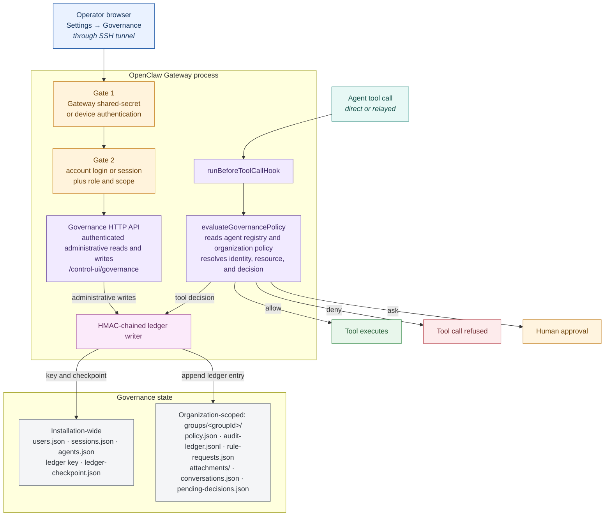
```mermaid
flowchart TB
  UI["Operator browser<br/>Settings → Governance<br/><i>through SSH tunnel</i>"]
  AGENT["Agent tool call<br/><i>direct or relayed</i>"]

  subgraph GW["OpenClaw Gateway process"]
    AUTH["Gate 1<br/>Gateway shared-secret<br/>or device authentication"]
    ACCOUNT["Gate 2<br/>account login or session<br/>plus role and scope"]
    API["Governance HTTP API<br/>authenticated administrative reads and writes<br/>/control-ui/governance"]
    HOOK["runBeforeToolCallHook"]
    ENGINE["evaluateGovernancePolicy<br/>reads agent registry and organization policy<br/>resolves identity, resource, and decision"]
    LEDGER["HMAC-chained ledger writer"]
  end

  subgraph STATE["Governance state"]
    INSTALL["Installation-wide<br/>users.json · sessions.json · agents.json<br/>ledger key · ledger-checkpoint.json"]
    GROUP["Organization-scoped: groups/&lt;groupId&gt;/<br/>policy.json · audit-ledger.jsonl · rule-requests.json<br/>attachments/ · conversations.json · pending-decisions.json"]
  end

  UI --> AUTH --> ACCOUNT --> API
  AGENT --> HOOK --> ENGINE
  API -->|administrative writes| LEDGER
  ENGINE -->|tool decision| LEDGER
  LEDGER -->|key and checkpoint| INSTALL
  LEDGER -->|append ledger entry| GROUP
  ENGINE -->|allow| EXEC["Tool executes"]
  ENGINE -->|deny| BLOCK["Tool call refused"]
  ENGINE -->|ask| HITL["Human approval"]

  classDef operator fill:#eaf2ff,stroke:#2f65ad,color:#17365d;
  classDef agent fill:#e7f8f5,stroke:#23877b,color:#124d46;
  classDef security fill:#fff3dc,stroke:#c47a16,color:#6b410b;
  classDef core fill:#f1eaff,stroke:#7452aa,color:#3d2865;
  classDef audit fill:#fbeafa,stroke:#a24c98,color:#612b5b;
  classDef store fill:#f4f5f7,stroke:#69727d,color:#30363d;
  classDef allow fill:#e8f6eb,stroke:#338a48,color:#1d562c;
  classDef deny fill:#fdebec,stroke:#ba4a52,color:#702a30;
  classDef ask fill:#fff4df,stroke:#c17b16,color:#6d4308;

  class UI operator;
  class AGENT agent;
  class AUTH,ACCOUNT security;
  class API,HOOK,ENGINE core;
  class LEDGER audit;
  class INSTALL,GROUP store;
  class EXEC allow;
  class BLOCK deny;
  class HITL ask;
```

### TikZ form

```latex
\begin{figure}[htbp]
\centering
\resizebox{\textwidth}{!}{%
\begin{tikzpicture}[
  node distance=7mm and 16mm,
  archOperator/.style={gbox, draw=blue!65!black, fill=blue!8,
    text=blue!30!black, minimum width=39mm},
  archAgent/.style={gbox, draw=teal!65!black, fill=teal!9,
    text=teal!30!black, minimum width=39mm},
  archSecurity/.style={gbox, draw=orange!70!black, fill=orange!11,
    text=orange!35!black, minimum width=43mm},
  archCore/.style={gbox, draw=violet!65!black, fill=violet!9,
    text=violet!35!black, minimum width=43mm},
  archAudit/.style={gbox, draw=magenta!55!black, fill=magenta!8,
    text=magenta!30!black, minimum width=46mm},
  archStore/.style={gstore, draw=black!50, fill=black!4,
    minimum width=62mm, minimum height=19mm},
  archAllow/.style={gbox, draw=green!55!black, fill=green!10,
    text=green!28!black, minimum width=31mm},
  archDeny/.style={gbox, draw=red!60!black, fill=red!8,
    text=red!35!black, minimum width=31mm},
  archAsk/.style={gbox, draw=orange!70!black, fill=orange!12,
    text=orange!35!black, minimum width=31mm},
  archAuditFlow/.style={-{Stealth[length=2mm]}, draw=magenta!55!black}
]
  % Two visually distinct entrances into one Gateway-hosted governance layer.
  \node[archOperator] (ui) {Operator browser\\
    \scriptsize Settings $\rightarrow$ Governance through SSH tunnel};
  \node[archAgent, right=54mm of ui] (agent) {Agent tool call\\
    \scriptsize direct or relayed from a secondary runtime};

  \node[archSecurity, below=10mm of ui] (auth) {Gate 1: Gateway authentication\\
    \scriptsize shared secret or trusted device};
  \node[archSecurity, below=of auth] (account) {Gate 2: governance identity\\
    \scriptsize login or session, then role and scope};
  \node[archCore, below=of account] (api) {Governance HTTP API\\
    \scriptsize authenticated administrative reads and writes\\
    \scriptsize \texttt{/control-ui/governance}};

  \node[archCore, below=10mm of agent] (hook) {\texttt{runBeforeToolCallHook}\\
    \scriptsize central pre-execution interception};
  \node[archCore, below=of hook] (engine) {\texttt{evaluateGovernancePolicy}\\
    \scriptsize reads the agent registry and organization policy\\
    \scriptsize resolves identity, resource, and decision};

  \node[archAllow, right=19mm of engine, yshift=13mm] (allow) {\textbf{ALLOW}\\
    \scriptsize tool executes};
  \node[archDeny, right=19mm of engine] (deny) {\textbf{DENY}\\
    \scriptsize call refused};
  \node[archAsk, right=19mm of engine, yshift=-13mm] (ask) {\textbf{ASK}\\
    \scriptsize human approval};

  \coordinate (coremid) at ($(api)!0.5!(engine)$);
  \node[archAudit, below=20mm of coremid] (ledger) {HMAC-chained audit writer\\
    \scriptsize tool decisions and administrative changes};

  \node[archStore, below=15mm of ledger, xshift=-39mm] (installation)
    {\textbf{Installation-wide state}\\[2pt]
     \scriptsize \texttt{users.json} $\cdot$ \texttt{sessions.json} $\cdot$ \texttt{agents.json}\\
     \scriptsize ledger key $\cdot$ \texttt{ledger-checkpoint.json}};
  \node[archStore, below=15mm of ledger, xshift=39mm] (group)
    {\textbf{Organization-scoped state}\\[2pt]
     \scriptsize \texttt{groups/<groupId>/policy.json} $\cdot$ \texttt{audit-ledger.jsonl}\\
     \scriptsize rule requests $\cdot$ attachments $\cdot$ conversations $\cdot$ pending decisions};
  \coordinate (statemid) at ($(installation.south)!0.5!(group.south)$);
  \node[gnote, below=1mm of statemid]
    {Stored below \textasciitilde/.openclaw/governance/};

  \draw[gflow, draw=blue!55!black] (ui) -- (auth);
  \draw[gflow, draw=orange!65!black] (auth) -- (account);
  \draw[gflow, draw=violet!55!black] (account) -- (api);
  \draw[gflow, draw=teal!55!black] (agent) -- (hook);
  \draw[gflow, draw=violet!55!black] (hook) -- (engine);

  \draw[gflow, draw=green!50!black] (engine.north east) --
    node[glab, above] {allow} (allow.west);
  \draw[gflow, draw=red!55!black] (engine.east) --
    node[glab, above] {deny} (deny.west);
  \draw[gflow, draw=orange!65!black] (engine.south east) --
    node[glab, below] {ask} (ask.west);

  % Both entry paths record security-relevant changes through one writer.
  \draw[archAuditFlow] (api.south) -- node[glab, left] {administrative writes} (ledger.north west);
  \draw[archAuditFlow] (engine.south) -- node[glab, right] {tool decisions} (ledger.north east);

  % The API and policy-engine boxes name their state access directly. This
  % avoids long crossing arrows that can be mistaken for execution order.
  \draw[archAuditFlow] (ledger.south west) --
    node[glab, left, pos=0.55] {key + checkpoint} (installation.north east);
  \draw[archAuditFlow] (ledger.south east) --
    node[glab, right, pos=0.55] {append ledger} (group.north west);

  \begin{scope}[on background layer]
    \node[draw=violet!35, fill=violet!2, dashed, rounded corners=4pt,
      inner sep=8pt, fit=(auth)(account)(api)(hook)(engine)(ledger)] (gw) {};
    \node[draw=black!25, fill=black!1, rounded corners=4pt,
      inner sep=7pt, fit=(installation)(group)] (state) {};
  \end{scope}
  \node[gnote, fill=white, text=violet!35!black, anchor=south west,
    xshift=1mm] at (gw.north west) {OpenClaw Gateway process};
  \node[gnote, fill=white, anchor=south west,
    xshift=1mm] at (state.north west) {Governance state};
\end{tikzpicture}}
\caption[Governance layer within the OpenClaw Gateway]
{\footnotesize Governance layer within the OpenClaw Gateway. Operator requests
first pass Gateway shared-secret or device authentication. Governance login
then creates a named account session, and protected routes enforce its role and
scope. Direct and relayed agent tool calls pass through
\texttt{runBeforeToolCallHook} and \texttt{evaluateGovernancePolicy} before
execution. Administrative writes and tool decisions share the HMAC-chained
audit writer and the same installation-wide and organization-scoped state.}
\label{fig:gov-architecture}
\end{figure}
```

---

## F2: RBAC hierarchy with inherited permissions

**Source:** §3.5.4 · **Final placement:** Figure 3.12

**Recommendation: CUT the figure, keep the table.** The hierarchy is four boxes
in a straight line, and the permission matrix immediately below it in your
material says everything the figure says and a great deal more. A four-node chain
is one of the clearest signs of a figure included because a figure felt expected.
Spend the page on the table instead. The forms are here in case you disagree.

> **Updated suggestion, 2026-09-01, KEEP it, and keep it small.** _(Added
> beside the original, not replacing it.)_
>
> **Why I changed my mind: this figure was wrong, and being wrong is the
> argument for drawing it.** It said the kill switch belongs to Root. It does
> not. The route has admitted a **User** acting on their own agents since T5,
> and `T42` (2026-09-01) had to be raised because _three separate surfaces_ were
> each describing that tier differently. This figure was a fourth, and the only
> one bound for the report.
>
> In lay terms: the thing this project got wrong more than once is **who is
> allowed to do what**, and a table of thirty rows is where that kind of error
> hides. Four boxes with the interesting capability written on the right box is
> where a supervisor notices it in two seconds. The table is better reference;
> the figure is better _review_, and this project's own history says review is
> what the tier model needed.
>
> Keep both, and put the figure first, one column wide, no more than the four
> boxes and one capability each.

### Prose form

The four tiers are strictly cumulative. A **Viewer** may read the policy and the
sanitised ledger and verify the chain's integrity; it is oversight only and
writes nothing. A **User** inherits all of that and gains the capabilities that
concern _the agents assigned to it_: unmasked ledger resources, prompting those
agents, answering the escalations their dashboard prompts raise (T68), writing
rules and folder grants that bind only those agents (unless Root has withheld that
account's authoring, T27), setting one of those agents' approval timeout, asking
an Administrator for a rule or a setting through the request queue, and, the one
most often misstated, **stopping and releasing those agents with the emergency
kill switch**. An **Administrator** inherits both and manages agents rather than
one agent: creating and registering them, assigning them to accounts, writing
global rules, changing the posture and escalation for the installation or for one
agent (A12), setting the approval timeout, and deciding requests. **What it does
to one agent it does only to the agents it owns**: renaming, re-owning,
unregistering, deleting from the host (where it chooses which of two deletions
runs, C13) and permitting Codex all require ownership, with Root exempt (finding
375 was the dashboard offering two of these to an Administrator who did not own
the agent). **Root** inherits everything and adds the capabilities that concern the
installation itself: account management, switching a shipped core denial off or
back on, the agent backend, the deployment report, and, since T44, **deleting the
organisation**, the one act that removes Root's own account. _(Until 2026-09-14
this paragraph gave Root the approval timeout, which an Administrator has set since
2026-09-03. Until 2026-09-19 it gave the User only a *request* for a rule, when
the route lets a User write agent-scoped rules for its own agents unless Root
withholds it, and it did not say an Administrator's agent-level acts are limited to
the agents it owns.)_ Because each tier is
a superset of the one below, no capability needs to be listed twice, and the only
question at any endpoint is which tier it requires.

Two scope qualifications apply. Every capability above is bounded by the
organisation the account belongs to. And an installation holds **one
organisation and therefore one Root**: the Root cap is enforced per organisation,
and a second organisation cannot be created on one installation, so the two rules
together make Root unique per machine.

_(Corrected 2026-09-01. This paragraph placed the kill switch at Root, which the
route has never required, `T42` exists because three surfaces disagreed about
that same tier, and this was a fourth. It also said one machine "may hold several
Roots who are invisible to one another", which stopped being true on 2026-08-30
when the one-organisation-per-installation cap landed.)_

### Mermaid form

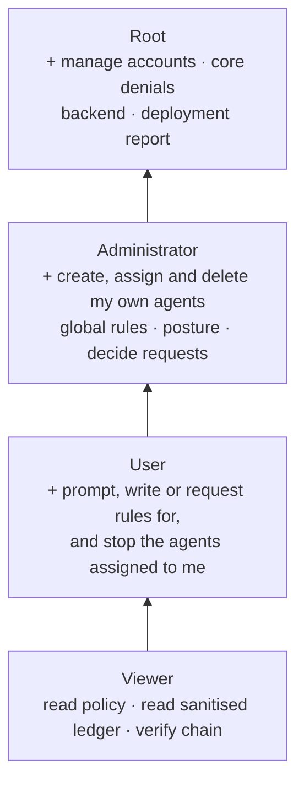
```mermaid
flowchart BT
  V["Viewer<br/>read policy · read sanitised ledger · verify chain"]
  U["User<br/>+ prompt, write or request rules for,<br/>and stop the agents assigned to me"]
  A["Administrator<br/>+ create, assign and delete my own agents<br/>global rules · posture · decide requests"]
  R["Root<br/>+ manage accounts · core denials<br/>backend · deployment report"]
  V --> U --> A --> R
```

### TikZ form

```latex
\begin{figure}[htbp]
\centering
\begin{tikzpicture}[node distance=5mm]
  \node[gbox, minimum width=86mm] (v) {\textbf{Viewer}, read policy, read sanitised ledger, verify chain};
  \node[gbox, minimum width=86mm, above=of v] (u) {\textbf{User}, \textit{and} prompt, write or request rules for, and stop \emph{my} agents};
  \node[gbox, minimum width=86mm, above=of u] (a) {\textbf{Administrator}, \textit{and} create, assign and delete \emph{my own} agents, global rules, decide requests};
  \node[gbox, minimum width=86mm, above=of a] (r) {\textbf{Root}, \textit{and} manage accounts, core denials, backend, deployment report};
  \draw[gflow] (v) -- (u);
  \draw[gflow] (u) -- (a);
  \draw[gflow] (a) -- (r);
  % Beside the stack and clear of it. "right=3mm of u" measured off the User row,
  % which is narrower than the Administrator row, so the label landed on top of the
  % boxes (found by looking, 2026-09-20).
  \node[gnote, rotate=90] at ([xshift=6mm]a.east |- u) {inherits};
\end{tikzpicture}
\caption{Role hierarchy. Each tier inherits every capability below it. The emergency stop sits at \textbf{User}, scoped to the agents assigned to that account, not at Root. An Administrator acts on one agent only when it owns that agent; Root may act on any.}
\label{fig:gov-rbac}
\end{figure}
```

---

## F3: Policy decision sequence

**Source:** §3.5.2.2 · **Final placement:** Figure 3.6

**Recommendation: KEEP.** This is the central mechanism of the whole project and
it is a sequence, which is precisely what prose handles worst. A reader following
five participants across a branch will lose the thread in a paragraph and hold it
easily in a diagram. Second most important figure after F1.

**One change from the draft:** the Mermaid version shows what an `allow-always`
answer produces, which is useful but crowds the picture. The TikZ version keeps
the decision flow as the visual focus and leaves that detail to the surrounding
section prose. **What it produces is a rule _request_, not a rule** — see the
prose below.

### Prose form

When an agent requests a tool call, the host's pipeline hands the tool name and
its parameters to the policy engine before anything executes. The engine first
resolves which organisation the agent belongs to, by consulting the agent
registry. An agent with no record there is refused outright, because registration
is mandatory and no policy document applies to an unregistered agent; that
refusal is recorded against the installation-wide trail, since there is no
organisation ledger to record it in. Otherwise the engine loads that
organisation's policy, checks whether the agent is under an active lockdown, then
extracts the resource the call would touch. It checks **denials first**: a deny
rule that matches refuses the call whatever any allowance says, at every tier and
even while the agent is only being watched in `monitor`. Only then does it look
for an active, unexpired allow rule. Whatever it concludes is appended to the
hash-chained ledger before the verdict is returned, so the record exists whether
or not the call proceeds, and each entry also carries what the model said it was
doing on the turn that produced the call. If an allow rule matches, the verdict
is allow and the tool runs. If none matches and escalation is switched off, the
call is blocked and the agent is told why. If none matches and escalation is on,
the decision is put to a human, whose answer is itself appended to the ledger:
for a prompt sent from the dashboard, the accounts that manage the agent, on the
governance page (T68); for a chat run, whoever holds the Gateway credential in the
Control UI, or the channel's own approval buttons. An "allow always" answer
permits that one call and **files a rule request** for an Administrator or Root to
approve while signed in; it does not write a rule itself, because the person
answering an approval prompt may hold no governance account at all.

The sequence above is the `enforce` posture, the shipped default. The other two
postures leave the early steps alone and change the ending. Under `monitor`, a
call that no allow rule covers is recorded with the verdict `enforce` would have
given and then allowed, with nobody asked; a matching deny rule still refuses.
Under `off`, the gate returns as soon as it has read the policy, before the
lockdown check, and records nothing. An Administrator can set the installation to
`off`; no tier can set one agent to `off`, and a per-agent `off` written into
`policy.json` by hand is dropped when the policy is loaded (finding 80).

_(Added 2026-09-19. The figure never said which posture it drew, and `monitor`
and `off` end differently from it (`policy-engine.ts`, `evaluateGovernancePolicy`).)_

_(Corrected 2026-09-14. This paragraph and the Mermaid drew one matching step,
"if a rule matches, the verdict is allow", which left out that a matching
**deny** rule refuses before any allowance is read: the property that no later
grant can reopen a denial. And it put every escalation "on the dashboard", which
has been true only of a dashboard prompt's since T68.)_

_(Corrected 2026-09-07, finding 282. Both this paragraph and the TikZ caption
said an "allow always" answer "is additionally persisted as a new rule". That is
the behaviour **QA round 13 removed as a security defect** — one button on a
prompt rendered in a chat client writing a permanent rule into `policy.json` —
and it is precisely what the 2026-09-06 restoration deliberately did not bring
back. The figure survived the 2026-09-05 audit because that pass read every
figure against the code and this claim had been false since well before it: it
described a capability that at the time **did not exist at all**, so nothing in
the code contradicted a sentence about it. A figure describing a removed feature
is invisible to a check that asks "does the code do this?" and answers "there is
no such code".)_

### Mermaid form

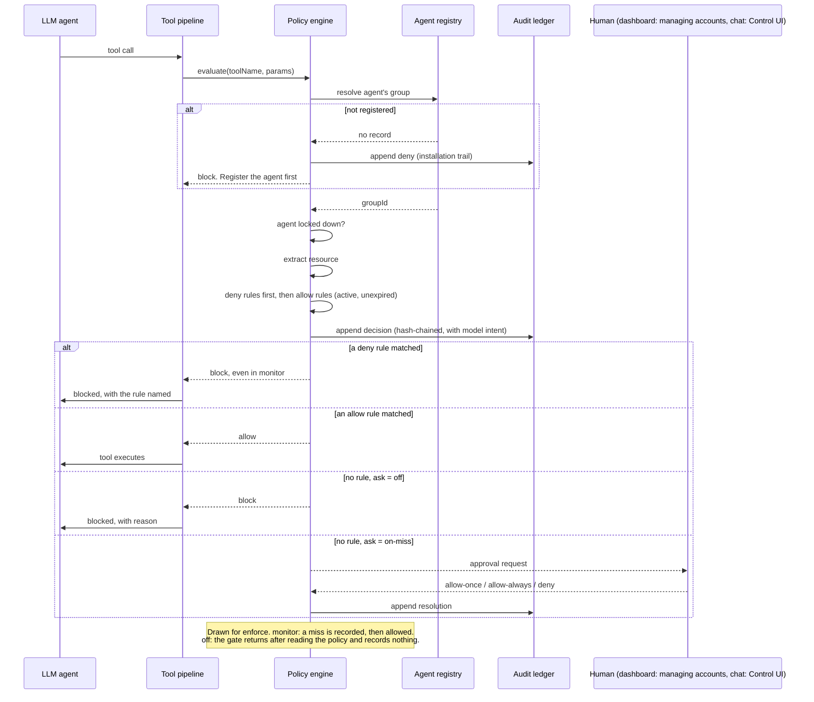
```mermaid
sequenceDiagram
  participant A as LLM agent
  participant P as Tool pipeline
  participant G as Policy engine
  participant R as Agent registry
  participant L as Audit ledger
  participant H as Human (dashboard: managing accounts, chat: Control UI)

  A->>P: tool call
  P->>G: evaluate(toolName, params)
  G->>R: resolve agent's group
  alt not registered
    R-->>G: no record
    G->>L: append deny (installation trail)
    G-->>P: block. Register the agent first
  end
  R-->>G: groupId
  G->>G: agent locked down?
  G->>G: extract resource
  G->>G: deny rules first, then allow rules (active, unexpired)
  G->>L: append decision (hash-chained, with model intent)
  alt a deny rule matched
    G-->>P: block, even in monitor
    P->>A: blocked, with the rule named
  else an allow rule matched
    G-->>P: allow
    P->>A: tool executes
  else no rule, ask = off
    G-->>P: block
    P->>A: blocked, with reason
  else no rule, ask = on-miss
    G-->>H: approval request
    H-->>G: allow-once / allow-always / deny
    G->>L: append resolution
  end
  Note over G: Drawn for enforce. monitor: a miss is recorded, then allowed.<br/>off: the gate returns after reading the policy and records nothing.
```

### TikZ form

```latex
\begin{figure}[htbp]
\centering
\resizebox{\textwidth}{!}{%
\begin{tikzpicture}[
  seqAgent/.style={gbox, draw=teal!65!black, fill=teal!9,
    text=teal!30!black, minimum width=20mm},
  seqPipeline/.style={gbox, draw=blue!65!black, fill=blue!8,
    text=blue!30!black, minimum width=22mm},
  seqEngine/.style={gbox, draw=violet!65!black, fill=violet!9,
    text=violet!35!black, minimum width=22mm},
  seqRegistry/.style={gbox, draw=cyan!55!black, fill=cyan!8,
    text=cyan!25!black, minimum width=22mm},
  seqLedger/.style={gbox, draw=magenta!55!black, fill=magenta!8,
    text=magenta!30!black, minimum width=22mm},
  seqHuman/.style={gbox, draw=orange!70!black, fill=orange!11,
    text=orange!35!black, minimum width=20mm},
  seqAgentLife/.style={draw=teal!45!black, dashed},
  seqPipelineLife/.style={draw=blue!45!black, dashed},
  seqEngineLife/.style={draw=violet!45!black, dashed},
  seqRegistryLife/.style={draw=cyan!45!black, dashed},
  seqLedgerLife/.style={draw=magenta!45!black, dashed},
  seqHumanLife/.style={draw=orange!55!black, dashed}
]
  \node[seqAgent]    at (0,0)    (agent)    {LLM agent};
  \node[seqPipeline] at (2.9,0)  (pipeline) {Tool pipeline};
  \node[seqEngine]   at (5.8,0)  (engine)   {Policy engine};
  \node[seqRegistry] at (8.7,0)  (registry) {Agent registry};
  \node[seqLedger]   at (11.5,0) (ledger)   {Audit ledger};
  \node[seqHuman]    at (14.2,0) (human)    {Human};

  \draw[seqAgentLife]    (0,-0.45)    -- (0,-9.25);
  \draw[seqPipelineLife] (2.9,-0.45)  -- (2.9,-9.25);
  \draw[seqEngineLife]   (5.8,-0.45)  -- (5.8,-9.25);
  \draw[seqRegistryLife] (8.7,-0.45)  -- (8.7,-9.25);
  \draw[seqLedgerLife]   (11.5,-0.45) -- (11.5,-9.25);
  \draw[seqHumanLife]    (14.2,-0.45) -- (14.2,-9.25);

  \draw[gflow, draw=teal!55!black]
    (0,-1.0) -- node[glab, above, text=teal!30!black] {tool call} (2.9,-1.0);
  \draw[gflow, draw=blue!55!black]
    (2.9,-1.7) -- node[glab, above, text=blue!30!black]
    {evaluate(tool, params)} (5.8,-1.7);

  \draw[gflow, draw=violet!55!black]
    (5.8,-2.4) -- node[glab, above, text=violet!35!black]
    {resolve group} (8.7,-2.4);
  \draw[gdash, draw=cyan!55!black]
    (8.7,-3.0) -- node[glab, above, text=cyan!25!black]
    {groupId, or no record} (5.8,-3.0);
  \draw[gdash, draw=red!55!black]
    (5.8,-3.7) -- node[glab, above, text=red!35!black]
    {block: register the agent first} (0,-3.7);

  \draw[gflow, draw=violet!55!black]
    (5.8,-4.4) -- ++(0.8,0) -- ++(0,-0.55) -- (5.8,-4.95);
  \coordinate (evaluation) at (5.8,-4.68);
  \node[glab, right=12mm of evaluation, align=left, text=violet!35!black]
    {locked down? \quad extract resource\\deny rules, then allow rules};

  \draw[gflow, draw=magenta!55!black]
    (5.8,-5.7) -- node[glab, above, text=magenta!30!black]
    {append decision + intent} (11.5,-5.7);

  \draw[gdash, draw=green!50!black]
    (5.8,-6.45) -- node[glab, above, text=green!28!black]
    {allow} (2.9,-6.45);
  \draw[gflow, draw=green!50!black]
    (2.9,-7.1) -- node[glab, above, text=green!28!black]
    {tool executes} (0,-7.1);
  \draw[gdash, draw=red!55!black]
    (5.8,-7.8) -- node[glab, above, text=red!35!black]
    {block, with reason} (0,-7.8);

  \draw[gflow, draw=orange!65!black]
    (5.8,-8.5) -- node[glab, above, text=orange!35!black]
    {approval request} (14.2,-8.5);
  \draw[gdash, draw=orange!65!black]
    (14.2,-9.15) -- node[glab, above, text=orange!35!black]
    {allow once / always / deny} (5.8,-9.15);
\end{tikzpicture}}
\caption[Policy decision sequence]{\footnotesize Policy decision sequence in the
shipped \texttt{enforce} posture. The engine resolves the registered agent, extracts
the governed resource, and checks denials before allowances. Each policy outcome is
recorded before the call is allowed, refused, or sent for human approval. An
``allow always'' answer permits the current call and files a rule request; it does
not write a permanent rule directly.}
\label{fig:gov-decision}
\end{figure}
```

---

## F4: Two-gate authentication

**Source:** §3.5.6 · **Final placement:** merged into Figure 3.2

**Recommendation: MERGE into F1.** Figure 3.2 already draws both gates in
sequence. What this candidate adds is the detail of the login exchange, which is
a linear list of steps and reads perfectly well as a sentence. Drawing it twice
invites the reader to hunt for a difference between the two pictures.

### Prose form

Reaching any governance route requires passing two independent checks. The
browser first presents the Gateway's own credential, which is OpenClaw's existing
mechanism and is unchanged by this project. Only then does the governance layer
ask who the caller is. On an installation nobody has claimed yet, the first
visitor may sign up, which creates the Root account and, with it, the
installation's one organisation; once that organisation exists the sign-up route
refuses (409) and the page shows the sign-in form instead (finding 205). Every
other account is created by Root from the dashboard, and signs in with a username
and password verified with scrypt. Success
issues a session token of
thirty-two random bytes in an HttpOnly, SameSite=Strict cookie that expires after
twelve hours, and every subsequent request re-resolves that session and compares
the account's role against the tier the endpoint requires. Three details are
worth noting. The login throttle is keyed per username, so guessing one account
cannot be parallelised across many and a flood against one account cannot lock
out another. The cookie deliberately omits the Secure attribute, because the
Gateway binds to loopback and remote access arrives through an SSH tunnel;
requiring HTTPS would break the intended deployment without adding any
protection. And the signup route is itself ungated, which is defensible only
because of that same loopback binding: reaching it at all already requires the
tunnel and the Gateway credential, and it works once, for whoever reaches an
unclaimed installation first. The report should state this plainly rather than
leave an examiner to find it.

_(Corrected 2026-09-19. This paragraph and both drawings said "a caller with no
account may sign up", which has been false since the one-organisation cap
(2026-08-30): the route answers 409 once the installation is claimed,
`governance-dashboard-auth.ts`.)_

### Mermaid form

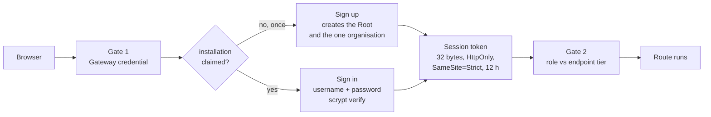
```mermaid
flowchart LR
  B["Browser"] --> G1["Gate 1<br/>Gateway credential"]
  G1 --> W{"installation<br/>claimed?"}
  W -->|no, once| BOOT["Sign up<br/>creates the Root<br/>and the one organisation"]
  W -->|yes| CRED["Sign in<br/>username + password<br/>scrypt verify"]
  BOOT --> TOK["Session token<br/>32 bytes, HttpOnly,<br/>SameSite=Strict, 12 h"]
  CRED --> TOK
  TOK --> G2["Gate 2<br/>role vs endpoint tier"]
  G2 --> OK["Route runs"]
```

### TikZ form

```latex
\begin{figure}[htbp]
\centering
\begin{tikzpicture}[node distance=7mm and 9mm]
  \node[gbox] (b) {Browser};
  \node[gbox, right=of b]  (g1) {Gate 1\\Gateway credential};
  \node[gdec, right=of g1] (w)  {installation\\claimed?};
  \node[gbox, above right=4mm and 9mm of w] (boot) {Sign up, once: creates the Root\\and the one organisation};
  \node[gbox, below right=4mm and 9mm of w] (cred) {Sign in: username + password\\scrypt verify};
  \node[gbox, right=24mm of w] (tok) {Session token\\32 bytes, HttpOnly\\SameSite=Strict, 12\,h};
  \node[gbox, right=of tok] (g2) {Gate 2\\role vs endpoint tier};

  \draw[gflow] (b)  -- (g1);
  \draw[gflow] (g1) -- (w);
  \draw[gflow] (w) -- node[glab,above] {no}  (boot);
  \draw[gflow] (w) -- node[glab,below] {yes} (cred);
  \draw[gflow] (boot) -| (tok);
  \draw[gflow] (cred) -| (tok);
  \draw[gflow] (tok) -- (g2);
\end{tikzpicture}
\caption{Two-gate authentication. Both gates are mandatory and independent. Sign-up
exists only until the installation is claimed.}
\label{fig:auth}
\end{figure}
```

---

## F5: Path normalisation pipeline

**Source:** §3.5.2.3 · **Final placement:** Figure 3.8

**Recommendation: KEEP.** A short linear pipeline with a concrete example
travelling through it, ending in a rule that no longer matches. It supports one
of your strongest findings, that three separate bypasses were one defect, and
the example path does the explaining. Cheap to draw, high value.

**Note the draft has a bug:** the Mermaid in `CHAPTER3-MATERIAL.md` declares
nodes `S1`, `S2`, `S3` and then draws `M1 --> M2 --> M3`, so it renders three
empty boxes. Fixed in both versions below.

### Prose form

A policy rule is a pattern tested against a string, so a location-based rule is
only as strong as the string the gate builds. The path the agent wrote is
therefore resolved before any rule sees it. First it is made absolute, with the
home shortcut expanded and any parent-directory steps collapsed. Then symbolic
links are followed, so the path names the file it actually refers to rather than
one that points at it. Finally the forms are chosen: a path inside the workspace
has two legitimate names, its short form relative to the workspace and its
absolute form, and a rule is tested against both, while the short form is the
one the ledger records; a path outside the workspace has only its absolute form.
Only then is the rule applied. _(Until 2026-09-19 this read "a single form is
chosen". Since 2026-09-04 a rule sees both names of a workspace path, because a
rule written in one form had been missing calls that arrived in the other
(findings 253 and 254; `resolveGovernedPathForms` in `path-normalize.ts`).)_ The example makes the
consequence plain: `src/../../etc/passwd` begins
with the characters `src/` and so satisfies a naive rule meaning "only inside
src", but resolves to `/etc/passwd`, which does not, and is refused. The defence
is structural rather than a filter: nothing searches for dangerous patterns, the
path is simply reduced to what it really means before being judged. One later
addition completes the picture: the resolved path is not only matched against the
rule but handed onward to the tool, so the file the gate judged is the file the
tool opens. Without that the pipeline would answer correctly about a path the
tool then resolved a second time, which is the race Figure~\ref{fig:gov-toctou}
describes.

### Mermaid form

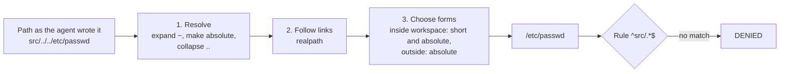
```mermaid
flowchart LR
  RAW["Path as the agent wrote it<br/>src/../../etc/passwd"]
  S1["1. Resolve<br/>expand ~, make absolute,<br/>collapse .."]
  S2["2. Follow links<br/>realpath"]
  S3["3. Choose forms<br/>inside workspace: short and absolute,<br/>outside: absolute"]
  OUT["/etc/passwd"]
  RULE{"Rule ^src/.*$"}
  RAW --> S1 --> S2 --> S3 --> OUT --> RULE
  RULE -->|no match| DENY["DENIED"]
```

### TikZ form

```latex
\begin{figure}[htbp]
\centering
\resizebox{\textwidth}{!}{%
\begin{tikzpicture}[node distance=8mm]
  \node[gbox] (raw) {Path as the agent wrote it\\\texttt{src/../../etc/passwd}};
  \node[gbox, right=of raw] (s1) {1. Resolve\\expand \textasciitilde, make absolute,\\collapse \texttt{..}};
  \node[gbox, right=of s1]  (s2) {2. Follow links\\\texttt{realpath}};
  \node[gbox, right=of s2]  (s3) {3. Choose forms\\inside workspace: short and absolute\\outside: absolute};
  \node[gbox, right=of s3]  (out) {\texttt{/etc/passwd}};
  \node[gdec, right=of out] (rule) {Rule\\\texttt{\^{}src/.*\$}};
  % 20mm, not the default 8: "no match" is wider than the gap and sat on the box
  % (found by looking, 2026-09-20).
  \node[gbox, right=20mm of rule] (deny) {\textbf{DENIED}};

  \draw[gflow] (raw) -- (s1);
  \draw[gflow] (s1)  -- (s2);
  \draw[gflow] (s2)  -- (s3);
  \draw[gflow] (s3)  -- (out);
  \draw[gflow] (out) -- (rule);
  \draw[gflow] (rule) -- node[glab, above] {no match} (deny);
\end{tikzpicture}}
\caption{Path normalisation. The rule is matched against what the path resolves
to, not against what the agent typed; a path inside the workspace is matched in
both its short and its absolute form.}
\label{fig:gov-pathnorm}
\end{figure}
```

---

## F6: The governed prompt path

**Source:** §3.5.5 · **Final placement:** Figure 3.13

**Recommendation: KEEP, simplified.** This carries a real design argument, that
prompting reuses the host's ordinary ingress rather than opening a second way in
and that argument is about a path, so a path diagram earns its place. The draft
has eleven nodes, which is two or three too many; the versions below drop the
"no runtime attached" branch to a caption note.

**Merge into it:** F10 (prompt lifecycle), whose stages are the same journey
viewed as time rather than as structure.

**Add one node since T57 (2026-09-06), and it changes what the figure claims.**
This drew the dashboard as _the_ governed prompt path, and until T57 it was the
only one recorded: `ADMIN_ACTIONS.agentPrompt` had a single writer. A task typed
into OpenClaw's own chat, sent from the command line or arriving over a channel
reached the agent with **no entry naming who asked**. It is now recorded at
`agentCommandInternal`, the single funnel every agent turn passes through, under
the labelled origin `host-prompt` with the channel named. So the honest caption
is not "this is how a prompt is governed" but "**this is the attributed path,
and every other path is recorded as unattributed rather than not recorded at
all**" — which is a stronger claim about §1.6 and a weaker one about the
dashboard's uniqueness.

### Prose form

A User with an assigned agent may prompt it from the dashboard, and the design
constraint that shaped the feature was that prompting must not become a second
way into the agent. The request first passes the role check and the ownership
check, and is refused outright if either fails. It is then refused again, without
being sent, if the agent is currently locked down, and that refusal is itself
recorded with the account that attempted it. Only then is the prompt written to
the ledger, before the run rather than after it, attributed to the username
rather than to the agent. Next it claims one of a bounded number of concurrent
slots, two per account and six per installation; a prompt refused here has
already been recorded, and its refusal is recorded beside it. The run is finally
handed to OpenClaw's ordinary
ingress, the same entry point the HTTP surface uses, with the sender marked as
not the owner and a session key naming both the agent and the account. Everything
downstream is unchanged, which is the point: had the layer built its own run
path, every guarantee this project makes about tool calls would have had to be
earned a second time on it.

### Mermaid form

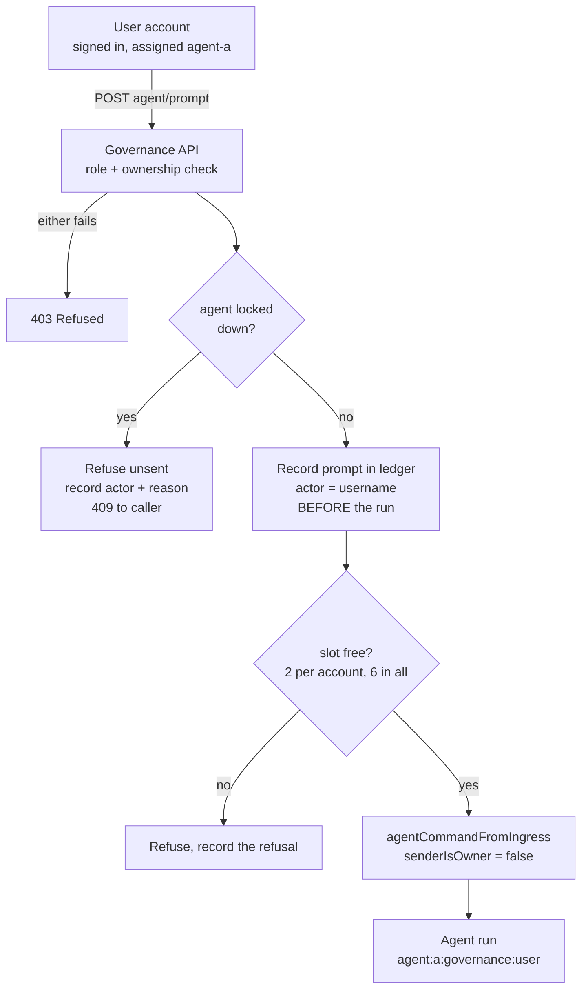
```mermaid
flowchart TD
  U["User account<br/>signed in, assigned agent-a"] -->|POST agent/prompt| API["Governance API<br/>role + ownership check"]
  API -->|either fails| DENY["403 Refused"]
  API --> LOCK{"agent locked<br/>down?"}
  LOCK -->|yes| REF["Refuse unsent<br/>record actor + reason<br/>409 to caller"]
  LOCK -->|no| REC["Record prompt in ledger<br/>actor = username<br/>BEFORE the run"]
  REC --> SLOT{"slot free?<br/>2 per account, 6 in all"}
  SLOT -->|no| FULL["Refuse, record the refusal"]
  SLOT -->|yes| ING["agentCommandFromIngress<br/>senderIsOwner = false"]
  ING --> RUN["Agent run<br/>agent:a:governance:user"]
```

### TikZ form

```latex
\begin{figure}[htbp]
\centering
\begin{tikzpicture}[node distance=7mm and 14mm]
  \node[gbox] (u) {User account\\signed in, assigned \texttt{agent-a}};
  \node[gbox, below=of u]   (api)  {Governance API\\role check + ownership check};
  \node[gdec, below=9mm of api] (lock) {agent locked\\down?};
  \node[gbox, below=9mm of lock] (rec) {Record prompt in ledger\\actor = username,\\\textit{before} the run};
  \node[gdec, below=9mm of rec] (slot) {slot free?};
  \node[gbox, below=9mm of slot] (ing) {\texttt{agentCommandFromIngress}\\\texttt{senderIsOwner = false}};
  \node[gbox, below=of ing] (run) {Agent run\\\texttt{agent:a:governance:user}};

  % 28mm, not the default 14: "either fails" is wider than the gap and sat on the
  % box (found by looking, 2026-09-20).
  \node[gbox, right=28mm of api]  (deny) {403 Refused};
  \node[gbox, right=of lock] (ref)  {Refuse unsent,\\record actor + reason,\\409 to caller};
  \node[gbox, right=of slot] (full) {Refuse,\\record the refusal\\\scriptsize 2 per account, 6 in all};

  \draw[gflow] (u)    -- node[glab,right] {\texttt{POST agent/prompt}} (api);
  \draw[gflow] (api)  -- (lock);
  \draw[gflow] (lock) -- node[glab,right] {no} (rec);
  \draw[gflow] (rec)  -- (slot);
  \draw[gflow] (slot) -- node[glab,right] {yes} (ing);
  \draw[gflow] (ing)  -- (run);
  \draw[gflow] (api)  -- node[glab,above] {either fails} (deny);
  \draw[gflow] (lock) -- node[glab,above] {yes} (ref);
  \draw[gflow] (slot) -- node[glab,above] {no} (full);
\end{tikzpicture}
\caption{The governed prompt path. Where no runtime is attached to the agent, the
ingress step returns an explicit ``no runtime attached'' rather than failing
silently.}
\label{fig:gov-promptpath}
\end{figure}
```

---

## F7: The deployment-status seam

**Source:** §3.5.14 · **Proposed number:**,

**Recommendation: CUT.** Your own note argues it "illustrates the project's
layering discipline better than any prose", and I disagree: the layering claim is
made in one sentence, and a reader does not need a picture to accept that a
function takes plain data and injectable readers. It is an internal code-organisation detail, not a
design argument a reader will carry forward. The page is better spent on F11.

### Prose form

The deployment check is split at a deliberate seam. Everything that must touch
the running Gateway, its configuration and its security audit, stays on the
Gateway side and produces a plain data record. That record crosses one boundary
into the governance side, where one function turns it into the deployment
verdict. That function does read the machine itself (the governance files'
permissions, free disk space, memory, the platform and the environment), but
through readers passed in as options, so a test replaces every one of them. The
payoff is larger than tidiness: every check is testable on any platform with no
Gateway, no socket and no configuration file, which is what allowed the
permission table to be verified on Windows, where the real answer is that those
bits are not meaningful. The same shape recurs in the agent runner and the agent
terminator.

_(Corrected 2026-09-19. This paragraph and both drawings called
`readDeploymentStatus` a pure function that "depends on nothing but its input". It
is `async`, takes the organisation's id, and reads the file system, disk, memory
and environment through injectable options (`deployment-status.ts`). It also said
"Windows CI", and this repository's Actions are switched off (T21).)_

### Mermaid form

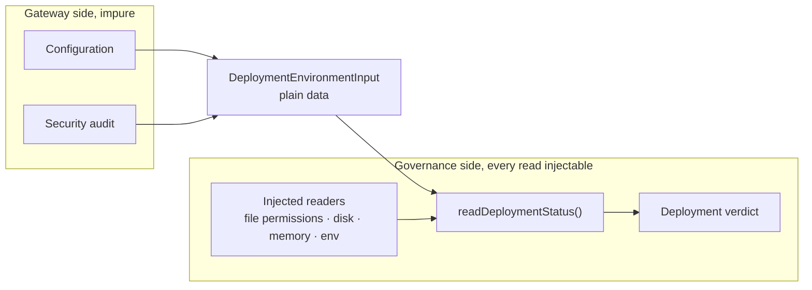
```mermaid
flowchart LR
  subgraph GW["Gateway side, impure"]
    CFG["Configuration"]
    SEC["Security audit"]
  end
  subgraph GOV["Governance side, every read injectable"]
    FN["readDeploymentStatus()"]
    RD["Injected readers<br/>file permissions · disk · memory · env"]
    OUT["Deployment verdict"]
  end
  CFG --> IN["DeploymentEnvironmentInput<br/>plain data"]
  SEC --> IN
  IN --> FN --> OUT
  RD --> FN
```

### TikZ form

```latex
\begin{figure}[htbp]
\centering
\begin{tikzpicture}[node distance=6mm and 12mm]
  \node[gbox] (cfg) {Configuration};
  \node[gbox, below=of cfg] (sec) {Security audit};
  \node[gbox, right=of cfg, yshift=-6mm] (in) {\texttt{DeploymentEnvironmentInput}\\plain data};
  \node[gbox, right=of in] (fn) {\texttt{readDeploymentStatus()}};
  \node[gbox, below=of fn] (rd) {Injected readers\\\scriptsize file permissions, disk, memory, env};
  \node[gbox, right=of fn] (out) {Deployment verdict};

  \draw[gflow] (cfg) -- (in);
  \draw[gflow] (sec) -- (in);
  \draw[gflow] (in)  -- (fn);
  \draw[gflow] (rd)  -- (fn);
  \draw[gflow] (fn)  -- (out);

  \begin{scope}[on background layer]
    \node[ggroup, fit=(cfg)(sec)] (g1) {};
    \node[ggroup, fit=(fn)(rd)(out)]  (g2) {};
  \end{scope}
  \node[gnote, above=0.5mm of g1] {Gateway side};
  \node[gnote, above=0.5mm of g2] {Governance side, every read injectable};
\end{tikzpicture}
\caption{The deployment-status seam: one plain-data record crosses the boundary,
and everything else the verdict reads is passed in, so a test can replace it.}
\label{fig:seam}
\end{figure}
```

---

## F8: Two paths through the host to the gate

**Source:** §3.5.8.2 · **Final placement:** Figure 3.1, placed in 3.4.2 Host Interception (3.5.8.2 cites it)

**Recommendation: KEEP, and it has become more important twice over.** When this
was marked it illustrated finding B1. As of 2026-08-30 it also explains the T7
limitation, since the in-process and native-harness split is exactly why a search
result can be filtered on one path and not the other, and that split is now a
built control on one side and a documented impossibility on the other. One
figure, three arguments, across two chapters.

> **Consider adding a second panel** showing the _result_ direction rather than
> the _call_ direction: tool result → `afterToolCall` → model on the in-process
> path, versus tool result → observers only on the Codex path, with the model
> unreachable from the hook. The call direction is symmetric between the two
> runtimes and the result direction is not, which is the whole of §3.5.61.

**Merge into it:** F13 (two entry points, one gate). Both say "several routes,
one gate"; F13's Discord and dashboard entries can become two extra boxes feeding
the in-process path. **Bring F13's second funnel with them** (its forms have drawn
`agentCommandInternal` since 2026-09-19): the merged figure should show where the
instruction is recorded as well as where the action is judged.

### Prose form

OpenClaw can run an agent in either of two arrangements, and the difference is
invisible from the dashboard. In the in-process arrangement the agent's tool
calls are executed by the same process that holds the Gateway, and each one
passes through the host's before-tool-call hook, where the gate is mounted.
Nothing optional stands between the call and the check. In the native-harness
arrangement, used by the Codex backend, the agent runs inside a separate helper
process that executes tools itself and knows nothing of OpenClaw's hooks. The
host reaches it by writing a relay hook into that helper's own configuration at
session start: a command the helper runs before each tool call, which calls back
into the host, which then runs the same hook and returns allow or block. The gate
is identical in both arrangements. The difference is that the second is governed
only if the relay was installed, and whether to install it was decided by a
question that counted plugin policies. This layer is not a plugin, so the answer
was no, and every tool call in that arrangement ran ungoverned. The fix made the
relay's installation depend on the layer itself: on any real installation the
relay is now always written (`governanceRequiresNativeToolRelay`, read by
`native-hook-relay-events.ts`), so both arrangements reach the gate.

_(Added 2026-09-19. The paragraph described the defect and stopped, so a reader
could take the ungoverned path for the current state.)_

### Mermaid form

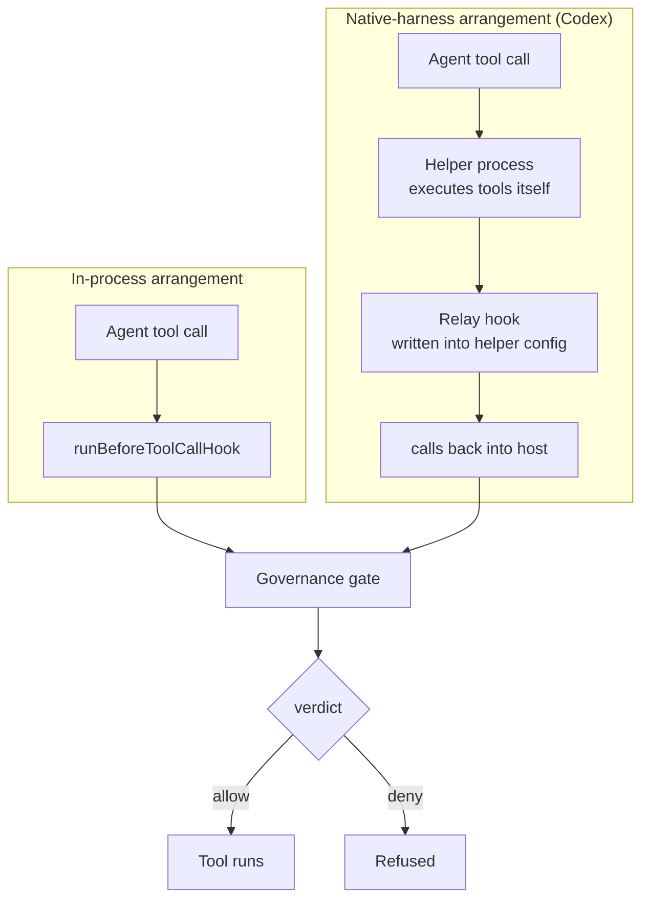
```mermaid
flowchart TB
  subgraph IP["In-process arrangement"]
    A1["Agent tool call"] --> H1["runBeforeToolCallHook"]
  end
  subgraph NH["Native-harness arrangement (Codex)"]
    A2["Agent tool call"] --> HELP["Helper process<br/>executes tools itself"]
    HELP --> RELAY["Relay hook<br/>written into helper config"]
    RELAY --> H2["calls back into host"]
  end
  H1 --> GATE["Governance gate"]
  H2 --> GATE
  GATE --> V{"verdict"}
  V -->|allow| OK["Tool runs"]
  V -->|deny| NO["Refused"]
```

### TikZ form

```latex
\begin{figure}[htbp]
\centering
\begin{tikzpicture}[node distance=7mm and 11mm]
  \node[gbox] (a1) {Agent tool call};
  \node[gbox, right=of a1] (h1) {\texttt{runBeforeToolCallHook}};

  \node[gbox, below=16mm of a1] (a2) {Agent tool call};
  \node[gbox, right=of a2] (help) {Helper process\\executes tools itself};
  \node[gbox, right=of help] (relay) {Relay hook\\written into helper config};

  \node[gbox, right=26mm of h1, yshift=-11mm] (gate) {Governance gate};
  \node[gbox, right=of gate, yshift=6mm]  (ok) {Tool runs};
  \node[gbox, right=of gate, yshift=-6mm] (no) {Refused};

  \draw[gflow] (a1) -- (h1);
  \draw[gflow] (a2) -- (help);
  \draw[gflow] (help) -- (relay);
  \draw[gflow] (h1.east) -- ++(5mm,0) |- (gate.west);
  % Up out of the relay, then into the gate's west side. Going right first put the
  % turn to the right of gate.west, so the line was drawn back through the gate and
  % struck out its label (found by looking, 2026-09-20).
  \draw[gflow] (relay.north) |- (gate.west);
  \draw[gflow] (gate) -- node[glab, above] {allow} (ok);
  \draw[gflow] (gate) -- node[glab, below] {deny}  (no);

  \begin{scope}[on background layer]
    \node[ggroup, fit=(a1)(h1)] (g1) {};
    \node[ggroup, fit=(a2)(help)(relay)] (g2) {};
  \end{scope}
  \node[gnote, above=0.5mm of g1] {In-process};
  \node[gnote, below=0.5mm of g2] {Native harness (Codex)};
\end{tikzpicture}
\caption{Two arrangements, one gate. The lower path is governed only if the relay
hook is installed, which on a governed installation it now always is.}
\label{fig:gov-twopaths}
\end{figure}
```

---

## F9: Four modules, one definition

**Source:** §3.5.16 · **Proposed number:**,

**Recommendation: CUT.** A before-and-after of a refactoring. It is a good
engineering story and it belongs in the prose, but the picture is four boxes
pointing at one box, which tells a reader nothing they did not get from the
sentence. Keep the prototype-pollution detail in the text, which is the genuinely
interesting part and is not drawable anyway.

### Prose form

Four modules each needed to decide what an account name meant, and each wrote the
intention down slightly differently. The fix replaced them with one exported
definition that all four import. One subtlety made the change less mechanical
than it looks: the guard against prototype keys had to move to run after the
case-folding rather than before it, because lowercasing turns `__PROTO__` into
`__proto__`. Canonicalising the key space without moving the guard would have
opened a prototype-pollution route that had not previously existed.

### Mermaid form

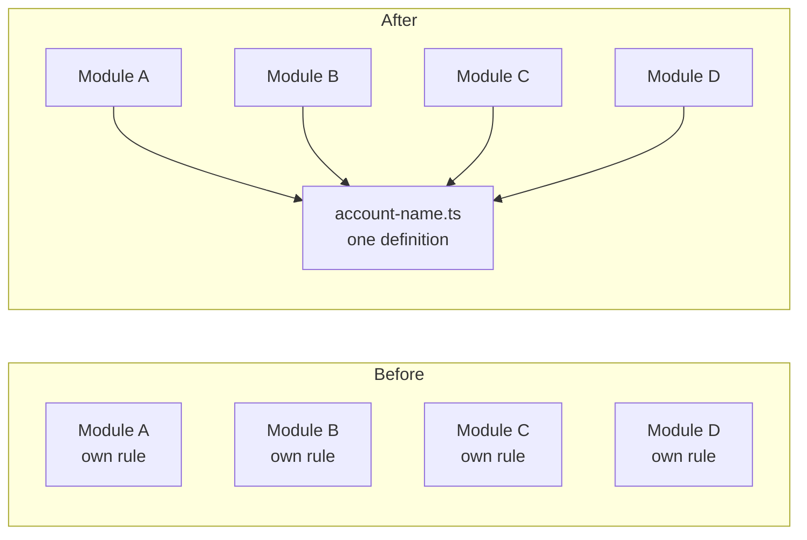
```mermaid
flowchart LR
  subgraph B["Before"]
    M1["Module A<br/>own rule"]
    M2["Module B<br/>own rule"]
    M3["Module C<br/>own rule"]
    M4["Module D<br/>own rule"]
  end
  subgraph A["After"]
    N1["Module A"] --> DEF["account-name.ts<br/>one definition"]
    N2["Module B"] --> DEF
    N3["Module C"] --> DEF
    N4["Module D"] --> DEF
  end
```

### TikZ form

```latex
\begin{figure}[htbp]
\centering
\begin{tikzpicture}[node distance=4mm and 16mm]
  \node[gbox] (m1) {Module A};
  \node[gbox, below=of m1] (m2) {Module B};
  \node[gbox, below=of m2] (m3) {Module C};
  \node[gbox, below=of m3] (m4) {Module D};
  \foreach \m in {m1,m2,m3,m4} { \node[gnote, right=2mm of \m] {own rule}; }

  \node[gbox, right=42mm of m1] (n1) {Module A};
  \node[gbox, below=of n1] (n2) {Module B};
  \node[gbox, below=of n2] (n3) {Module C};
  \node[gbox, below=of n3] (n4) {Module D};
  \node[gbox, right=of n2, yshift=-6mm] (def) {\texttt{account-name.ts}\\one definition};
  \foreach \n in {n1,n2,n3,n4} { \draw[gflow] (\n) -- (def); }

  \begin{scope}[on background layer]
    \node[ggroup, fit=(m1)(m4)] (gb) {};
    \node[ggroup, fit=(n1)(n4)(def)] (ga) {};
  \end{scope}
  \node[gnote, above=0.5mm of gb] {Before};
  \node[gnote, above=0.5mm of ga] {After};
\end{tikzpicture}
\caption{Four modules, one definition.}
\label{fig:accountname}
\end{figure}
```

---

## F10: The prompt lifecycle

**Source:** §3.5.17 · **Proposed number:**,

**Recommendation: MERGE into F6.** F6 shows the same journey as structure; this
shows it as time. Two figures of one path, a few pages apart, will read as a
duplication the reader has to reconcile. If you would rather keep this one and
cut F6, that also works, but not both.

### Prose form

A prompt is a live thing an operator watches rather than a request that returns.
Its lifecycle has five stages. It first records its intent in the ledger, before
anything runs. It then claims one of a bounded number of concurrent slots, two
per account and six per installation, which matters because unbounded
concurrency is a denial of service available to the lowest tier that can act; a
prompt refused for want of a slot has therefore already left its record, and the
refusal is recorded beside it. While running it streams snapshots to the
dashboard, so the operator sees progress rather than a spinner. It ends in one of
four ways: a reply, an explicit cancellation, a timeout, or the emergency kill
switch, the middle two existing because a disconnected client previously left the
agent working and a wedged provider previously held a connection open
indefinitely, and the last since finding 364 (2026-09-13), when a lockdown was
found to leave a dashboard prompt running. Closing the tab is not another ending:
since 2026-09-12 (finding 350) the run continues, still listed with its Cancel,
until one of the four occurs. A run that ends while its escalation waits withdraws
the escalation (T69). Whichever way it ends, the outcome is recorded.

_(Corrected 2026-09-19. Every form of this figure, and the candidate note in
`CHAPTER3-MATERIAL.md` §3.5.17, put the slot before the record. `promptAgent` in
`agent-conversation.ts` has recorded the prompt first and claimed the slot second
since the feature was built (`d977c4e3ae8`, 2026-08-21), and the order is the
stronger design: a refused prompt is still on the record.)_

### Mermaid form

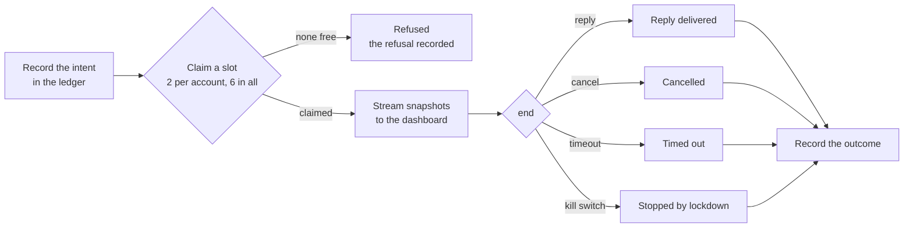
```mermaid
flowchart LR
  I["Record the intent<br/>in the ledger"] --> S{"Claim a slot<br/>2 per account, 6 in all"}
  S -->|none free| F["Refused<br/>the refusal recorded"]
  S -->|claimed| ST["Stream snapshots<br/>to the dashboard"]
  ST --> E{"end"}
  E -->|reply| R["Reply delivered"]
  E -->|cancel| C["Cancelled"]
  E -->|timeout| T["Timed out"]
  E -->|kill switch| K["Stopped by lockdown"]
  R --> O["Record the outcome"]
  C --> O
  T --> O
  K --> O
```

### TikZ form

```latex
\begin{figure}[htbp]
\centering
\begin{tikzpicture}[node distance=6mm and 10mm]
  \node[gbox] (i)  {Record the intent\\in the ledger};
  \node[gbox, right=of i]  (s)  {Claim a slot\\\scriptsize 2 per account, 6 in all};
  \node[gbox, below=of s]  (f)  {Refused,\\\scriptsize the refusal recorded};
  \node[gbox, right=of s]  (st) {Stream snapshots\\to the dashboard};
  \node[gdec, right=of st] (e)  {end};
  \node[gbox, above right=3mm and 9mm of e] (r) {Reply};
  \node[gbox, right=9mm of e]               (c) {Cancelled};
  \node[gbox, below right=3mm and 9mm of e] (t) {Timed out};
  \node[gbox, below=3mm of t]               (k) {Kill switch};
  \node[gbox, right=34mm of e] (o) {Record the outcome};

  \draw[gflow] (i) -- (s);
  \draw[gflow] (s) -- node[glab, above] {claimed} (st);
  \draw[gflow] (s) -- node[glab, right] {none free} (f);
  \draw[gflow] (st) -- (e);
  \draw[gflow] (e) -- (r);
  \draw[gflow] (e) -- (c);
  \draw[gflow] (e) -- (t);
  \draw[gflow] (e) |- (k);
  \draw[gflow] (r) -| (o);
  \draw[gflow] (c) -- (o);
  \draw[gflow] (t) -| (o);
  \draw[gflow] (k) -| (o);
\end{tikzpicture}
\caption{The prompt lifecycle. The prompt is recorded before it claims a slot, so
a prompt refused at capacity is still on the record. A run ends in a reply, a
cancellation, a timeout, or
the emergency kill switch (finding 364); closing the browser tab does not end it
(finding 350), and a run that ends while its escalation waits withdraws it.}
\label{fig:promptlife}
\end{figure}
```

---

## F11: The check-then-open window

**Source:** §3.5.12 (T23) · **Final placement:** Figure 3.18

**Recommendation: KEEP, and it is the best candidate on the list after F1 and
F3.** A time-of-check-to-time-of-use race is genuinely hard to explain in prose,
because the reader has to hold two timelines and an interleaving in their head.
Two parallel timelines with the swap drawn between them makes it obvious in
seconds. Your own note states the requirement exactly: the figure must show that
both resolutions are correct and that having two of them is the defect.

### Prose form

The gate resolves the path the agent named, decides about the file that path
referred to at that instant, and then hands the original string back for the tool
to resolve a second time. A symbolic link is the easy way to exploit the gap
between the two. The link `workspace/notes` points at a harmless file when the
gate looks, so the gate allows it; the link is then repointed at a sensitive
file; and the tool, resolving the same string a moment later, opens the sensitive
one. Neither resolution is wrong. Each correctly reports where the link pointed
when it was asked. The defect is that there are two of them, with a window in
between, and the fix removes the second rather than trying to make it agree with
the first: the gate now hands the tool the canonical path it actually judged.

### Mermaid form

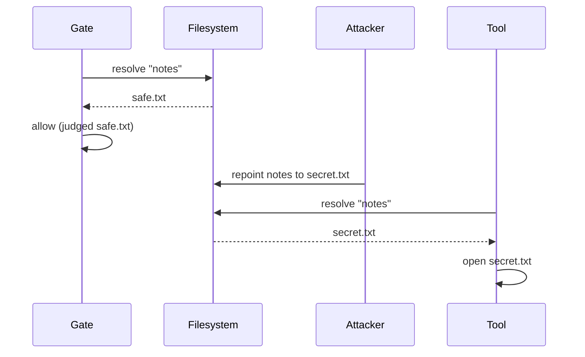
```mermaid
sequenceDiagram
  participant G as Gate
  participant FS as Filesystem
  participant X as Attacker
  participant T as Tool

  G->>FS: resolve "notes"
  FS-->>G: safe.txt
  G->>G: allow (judged safe.txt)
  X->>FS: repoint notes to secret.txt
  T->>FS: resolve "notes"
  FS-->>T: secret.txt
  T->>T: open secret.txt
```

### TikZ form

```latex
\begin{figure}[htbp]
\centering
\begin{tikzpicture}[xscale=1.0]
  \draw[gflow] (0,0) -- (15,0) node[right, font=\scriptsize] {time};

  % Positioning is taken off declared coordinates: "of {(x,y)}" typesets its own
  % closing bracket in nullfont and silently drops it (found by compiling, 2026-09-20).
  % The marks were 1.6/4.3/6.0/8.6 apart, which is narrower than the boxes hung off
  % them: the first two boxes overlapped and "Gate resolves notes" lost its last two
  % letters behind the second box (found by looking, 2026-09-20).
  \coordinate (m1) at (2.2,0);
  \coordinate (m2) at (6.4,0);
  \coordinate (m3) at (9.2,0);
  \coordinate (m4) at (12.8,0);

  \node[gbox, above=8mm of m1]  (g)  {Gate resolves \texttt{notes}\\$\rightarrow$ \texttt{safe.txt}};
  \node[gbox, above=8mm of m2]  (a)  {Gate allows\\(judged \texttt{safe.txt})};
  % 14mm, not 8: the brace's label sits in the gap, and at 8mm the box struck it out.
  \node[gbox, below=14mm of m3] (x)  {Attacker repoints\\\texttt{notes} $\rightarrow$ \texttt{secret.txt}};
  \node[gbox, above=8mm of m4]  (t)  {Tool resolves \texttt{notes}\\$\rightarrow$ \texttt{secret.txt}};

  \foreach \p in {2.2, 6.4, 12.8} { \draw[glife] (\p,0) -- (\p,0.8); }
  \draw[glife] (9.2,0) -- (9.2,-1.4);
  \foreach \p in {2.2, 6.4, 9.2, 12.8} { \fill (\p,0) circle (1.1pt); }

  \draw[decorate, decoration={brace, amplitude=4pt}, draw=black!60]
    (6.4,-0.35) -- (12.8,-0.35)
    node[midway, below=4pt, font=\scriptsize\itshape, fill=white, inner sep=1.5pt] {the window};
\end{tikzpicture}
\caption{The check-then-open window. Both resolutions are correct; the defect is
that there are two of them.}
\label{fig:gov-toctou}
\end{figure}
```

_(The brace needs `decorations.pathreplacing`, which the preamble above now
loads.)_

---

## F12: Two groups on one installation

**Source:** §3.5.30 (M3) · **Final placement:** cut

> **Recommendation changed to CUT on 2026-09-15 (T49, option b).** The report presents
> one organisation per installation as the boundary and makes no claim about separation
> between organisations (`CHAPTER3-MATERIAL.md` §3.5.89). This figure's whole argument is
> the line between two organisations: a claim the chapter no longer makes, about a
> deployment nobody can create. What it still shows correctly, that every account
> belongs to one organisation, is carried by F19 and by the role table. The
> recommendation below is kept as it was written.

**Recommendation (until 2026-09-15): KEEP, with the caption corrected.** Multi-tenancy is a
substantial feature added late, and the whole claim rests on what does not cross
the line between two groups. A figure with a literal dividing line, labelled
with what cannot cross it, makes the isolation argument in one glance. Prose has
to enumerate the same facts and the reader has to assemble the picture
themselves.

> **Corrected 2026-09-05, and this is the same correction F2 already carried.**
> Every form of this figure said an installation **may** hold more than one
> organisation. The **2026-08-30 cap made that false**: `createUser` raises
> `DuplicateOrganisationError` when an account would start a second group, and
> `DuplicateRootError` when it would be a second Root, both checked inside the
> same file lock as the write. The header note above records F2 being fixed for
> saying a machine "may hold several Roots"; **F12 is the figure that claim
> actually belongs to and it was missed.**
>
> The drawing is unchanged and still correct, because what it draws — two closed
> worlds and a line nothing crosses — is exactly what the code enforces per
> group. What changed is only the claim about how many of these an installation
> can have at once, which is a caption and a sentence rather than a shape. This
> is the T49 tension in one picture: the isolation is real and is verified by
> test rather than by deployment, and the figure should say so rather than imply
> a deployment nobody can create.

### Prose form

The layer models an installation as holding one or more organisations, each a
closed world. **A shipped installation holds exactly one**, capped since
2026-08-30 so that installation-wide controls have an unambiguous owner; the
second organisation in this figure is what the isolation is written and tested
against rather than something an operator can create. Every account belongs to
exactly one group, and every User and Viewer has exactly one Administrator
answerable for it. Within a group there is one Root, who
manages people, and one or more Administrators, who manage agents; Users and
Viewers hang off individual Administrators. Nothing crosses between groups:
neither accounts, nor the list of accounts, nor agent assignment. The
single-Root rule was originally enforced per machine and is now enforced per
group, which the report should present as a scope correction rather than a
reversal. The original argument was that one Root must be answerable for the
thing a Root is responsible for, and that thing is now a group; only the accident
that a single organisation had ever existed made the machine look like the right
boundary.

### Mermaid form

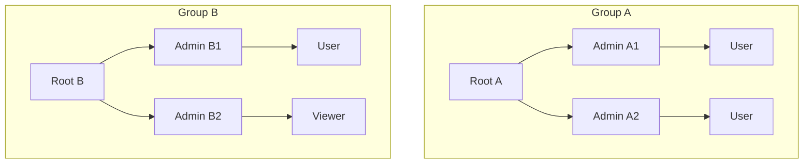
```mermaid
flowchart TB
  subgraph GA["Group A"]
    RA["Root A"] --> AA1["Admin A1"]
    RA --> AA2["Admin A2"]
    AA1 --> UA1["User"]
    AA2 --> UA2["User"]
  end
  subgraph GB["Group B"]
    RB["Root B"] --> AB1["Admin B1"]
    RB --> AB2["Admin B2"]
    AB1 --> UB1["User"]
    AB2 --> UB2["Viewer"]
  end
```

### TikZ form

```latex
\begin{figure}[htbp]
\centering
\begin{tikzpicture}[node distance=6mm and 7mm]
  \node[gbox] (ra) {Root A};
  \node[gbox, below left=8mm and 3mm of ra]  (a1) {Admin A1};
  \node[gbox, below right=8mm and 3mm of ra] (a2) {Admin A2};
  \node[gbox, below=of a1] (u1) {User};
  \node[gbox, below=of a2] (u2) {User};
  \draw[gflow] (ra) -- (a1); \draw[gflow] (ra) -- (a2);
  \draw[gflow] (a1) -- (u1); \draw[gflow] (a2) -- (u2);

  \node[gbox, right=44mm of ra] (rb) {Root B};
  \node[gbox, below left=8mm and 3mm of rb]  (b1) {Admin B1};
  \node[gbox, below right=8mm and 3mm of rb] (b2) {Admin B2};
  \node[gbox, below=of b1] (v1) {User};
  \node[gbox, below=of b2] (v2) {Viewer};
  \draw[gflow] (rb) -- (b1); \draw[gflow] (rb) -- (b2);
  \draw[gflow] (b1) -- (v1); \draw[gflow] (b2) -- (v2);

  \begin{scope}[on background layer]
    \node[ggroup, fit=(ra)(a1)(a2)(u1)(u2)] (ga) {};
    \node[ggroup, fit=(rb)(b1)(b2)(v1)(v2)] (gb) {};
  \end{scope}
  \node[gnote, above=0.5mm of ga] {Group A};
  \node[gnote, above=0.5mm of gb] {Group B};

  \draw[draw=black!70, thick, dash pattern=on 3pt off 2pt]
    ($(ga.north east)!0.5!(gb.north west) + (0,4mm)$) --
    ($(ga.south east)!0.5!(gb.south west) - (0,4mm)$);
  \node[gnote, align=center] at ($(ga.east)!0.5!(gb.west) + (0,-26mm)$)
    {does not cross:\\accounts\\the account list\\agent assignment};
\end{tikzpicture}
\caption{The group boundary. Two organisations and what does not cross between
them; a shipped installation is capped at one, so the second is what the isolation is
tested against rather than a deployment an operator can create.}
\label{fig:groups}
\end{figure}
```

---

## F13: Two entry points, one gate

**Source:** §4.x.19 · **Proposed number:**,

**Recommendation: MERGE into F8.** Both figures make the claim "however the work
arrives, it reaches the same gate". F8 makes it about execution arrangements and
F13 about user-facing entry points, but a reader sees one idea drawn twice. Add
the Discord and dashboard boxes to F8 as inputs and delete this one.

**There are two choke points as of T57 (2026-09-06), and this figure drew one**
_(until 2026-09-19, when all three forms below gained the second)_.
`runBeforeToolCallHook` is where every _action_ converges. `agentCommandInternal`
is where every _instruction_ converges — the local command path and every ingress
path alike — and it is where a prompt is now recorded whatever surface it arrived
on. Whichever figure survives the merge should show both, because the pair is the
argument: one funnel for what the agent is asked to do and one for what it then
tries, so a trail can answer "why did this happen?" and not only "what
happened?". Drawing only the tool-call funnel understates the layer by exactly
the half §1.6 asks for.

### Prose form

Agent activity starts in more than one place and every route converges on the
same check. A message arriving from Discord or Telegram is routed by the host
into a session keyed by channel and peer. A prompt typed into the governance
dashboard produces a session keyed by agent and account instead. Both become an
ordinary agent run, and every run starts in the same function,
`agentCommandInternal`, where every instruction is on the record before the run
starts: a dashboard prompt was recorded under the account's name by its route, so
this function passes it by, and anything else is recorded here under the labelled
origin `host-prompt`, naming the channel.
Every tool call in either run then passes through the host's before-tool-call hook
and into the gate, which recovers the agent's identity from the session key. So
there are two funnels, one for what the agent is asked to do and one for what it
then tries. The verdict is written to the ledger and then applied: the tool
runs, is refused, or is escalated into OpenClaw's existing approval machinery,
which surfaces as buttons in the chat client or as a request on the dashboard.

### Mermaid form

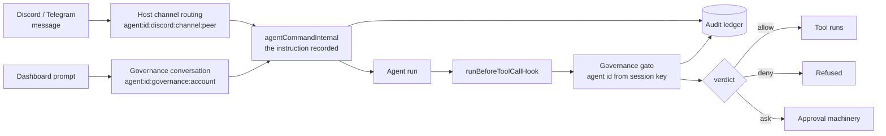
```mermaid
flowchart LR
  D["Discord / Telegram<br/>message"] --> HS["Host channel routing<br/>agent:id:discord:channel:peer"]
  G["Dashboard prompt"] --> GS["Governance conversation<br/>agent:id:governance:account"]
  HS --> CMD["agentCommandInternal<br/>the instruction recorded"]
  GS --> CMD
  CMD --> L
  CMD --> RUN["Agent run"]
  RUN --> HOOK["runBeforeToolCallHook"]
  HOOK --> GATE["Governance gate<br/>agent id from session key"]
  GATE --> L[("Audit ledger")]
  GATE --> V{"verdict"}
  V -->|allow| T["Tool runs"]
  V -->|deny| X["Refused"]
  V -->|ask| A["Approval machinery"]
```

### TikZ form

```latex
\begin{figure}[htbp]
\centering
\resizebox{\textwidth}{!}{%
\begin{tikzpicture}[node distance=7mm and 11mm]
  \node[gbox] (d) {Discord / Telegram\\message};
  \node[gbox, below=of d] (g) {Dashboard prompt};
  \node[gbox, right=of d] (hs) {Host channel routing};
  \node[gbox, right=of g] (gs) {Governance conversation};
  \node[gbox, right=of hs, yshift=-9mm] (cmd) {\texttt{agentCommandInternal}\\\scriptsize the instruction recorded};
  \node[gbox, right=of cmd] (run) {Agent run};
  \node[gbox, right=of run] (hook) {\texttt{runBeforeToolCallHook}};
  \node[gbox, right=of hook] (gate) {Governance gate};
  \node[gstore, below=14mm of run] (l) {Audit ledger};
  \node[gbox, right=of gate, yshift=9mm]  (t) {Tool runs};
  \node[gbox, right=of gate]              (x) {Refused};
  \node[gbox, right=of gate, yshift=-9mm] (a) {Approval machinery};

  \draw[gflow] (d) -- (hs); \draw[gflow] (g) -- (gs);
  \draw[gflow] (hs) -- (cmd); \draw[gflow] (gs) -- (cmd);
  \draw[gflow] (cmd) -- (run);
  \draw[gflow] (run) -- (hook); \draw[gflow] (hook) -- (gate);
  \draw[gflow] (cmd) |- (l);
  \draw[gflow] (gate) |- (l);
  \draw[gflow] (gate) -- node[glab, above] {allow} (t);
  \draw[gflow] (gate) -- node[glab, above] {deny}  (x);
  \draw[gflow] (gate) -- node[glab, below] {ask}   (a);
\end{tikzpicture}}
\caption{Two entry points, two funnels: every instruction is recorded in
\texttt{agentCommandInternal}, and every action it leads to is judged at
\texttt{runBeforeToolCallHook}.}
\label{fig:entrypoints}
\end{figure}
```

---

# Chapter 4 figures

## F14: Tool coverage, before and after

**Source:** §4.x.20 · **Proposed number:** Figure 4.1

**Recommendation: KEEP, and it is the most honest figure in the report.** Your
own note has the argument exactly right: the "after" bar is not full, and the
figure must not let anyone read it as if it were. A stacked bar showing governed,
deliberately ungoverned with a written reason, and still-unexamined makes the
coverage claim and its limit in the same image. A "requirements met" table cannot
do that.

**Merge into it:** F15, which is the same data drawn a second way.

### Prose form

The host's catalogue declares fifty-two tools. Seven were governed when the
coverage question was first asked, and eighteen are governed now. The remaining
thirty-four are not an unmeasured gap: each carries a written justification for
why it is not governed, asserted by a test that refuses to let any of those
justifications be empty. Eighteen and thirty-four account for all fifty-two, so
nothing in the catalogue is unexamined. That is the honest shape of the claim.
Coverage improved, and the part that remains uncovered changed from something
nobody had counted into a set of recorded decisions.

The four tools round thirteen named as the materially load-bearing gaps are all
governed now, and the prose should say so rather than repeat the older framing:
`process`, which types into a background shell; `computer`, which drives a
desktop with synthetic keyboard and mouse events; and `code_execution` and
`sessions_spawn`, which run code and start further agents. Closing them needed no
change to the rule language, only a registry entry and a resource extractor each,
which is what made the earlier gap one of coverage rather than of mechanism.

> **Do not "correct" 52 to 56.** The `GOVERNED_TOOLS` registry has twenty-two
> entries and `qa-round11.test.ts` checks fifty-six names, because four governed
> tools (the search tools and an alias) are in the session-tool barrel and not in
> `tool-catalog.ts`. Both framings are internally consistent, 18 + 34 = 52 and
> 22 + 34 = 56, and the documents use the catalogue framing throughout.
> `QA-IN-PLAIN-TERMS.md` §on round thirteen explains the discrepancy, which is
> itself part of how the original coverage gap stayed invisible.

### Mermaid form

**Mermaid can draw this now**, `xychart-beta` post-dates the note that used to
sit here saying it could not. It has no _stacked_ bar, so the honest rendering is
the governed count against the constant catalogue size, which is the comparison
the figure is actually making:

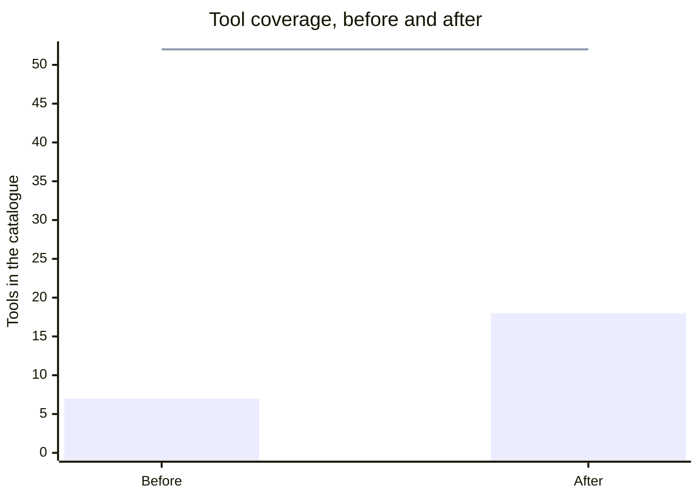
```mermaid
xychart-beta
  title "Tool coverage, before and after"
  x-axis ["Before", "After"]
  y-axis "Tools in the catalogue" 0 --> 52
  bar [7, 18]
  line [52, 52]
```

The bar is _governed_; the flat line is the catalogue. Use the table below when
drafting the composition, and the TikZ or prose form in the report:

| Stage  | Governed | Ungoverned, with reason | Unexamined | Catalogue |
| ------ | -------: | ----------------------: | ---------: | --------: |
| Before |        7 |                       0 |         45 |        52 |
| After  |       18 |                      34 |          0 |        52 |

Both rows total fifty-two, so the two bars are the same length and only their
composition changes. That is the point of the figure.

### TikZ form

```latex
\begin{figure}[htbp]
\centering
\begin{tikzpicture}
\begin{axis}[
  xbar stacked, width=0.86\textwidth, height=34mm,
  xmin=0, xmax=52, bar width=7mm,
  ytick=data, symbolic y coords={After, Before},
  axis lines*=left, tick style={draw=none},
  xlabel={Tools shipped by the host},
  legend style={at={(0.5,-0.55)}, anchor=north, legend columns=3, draw=none,
                font=\scriptsize},
  % "\addplot+" takes pgfplots' default cycle, which colours the value labels
  % blue, red and brown. This file is greyscale by design, so the plots are set
  % explicitly and the labels are told what colour to be (found by looking,
  % 2026-09-20). Explicit symbolic meta lets a zero segment carry no label.
  every node near coord/.append style={font=\scriptsize, text=black},
  point meta=explicit symbolic,
]
  \addplot[fill=black!55, draw=black!55, nodes near coords,
           every node near coord/.append style={text=white}]
    coordinates {(7,Before) [7] (18,After) [18]};
  \addplot[fill=black!25, draw=black!45, nodes near coords]
    coordinates {(0,Before) [] (34,After) [34]};
  \addplot[fill=black!5,  draw=black!45, nodes near coords]
    coordinates {(45,Before) [45] (0,After) []};
  \legend{Governed, Ungoverned with a written reason, Unexamined}
\end{axis}
\end{tikzpicture}
\caption{Tool coverage before and after. Both bars are the same length, because the
host ships the same fifty-two tools either way; what changed is their composition.
The governed share went from seven to eighteen, and, more to the point, the part
that is not governed stopped being an unexamined gap and became thirty-four
decisions each with a written reason.}
\label{fig:gov-coverage}
\end{figure}
```

---

## F15: Tool catalogue, governed entries highlighted

**Source:** §4.x.20 · **Proposed number:**,

**Recommendation: MERGE into F14 (or cut).** This is the same data as F14 drawn
differently. A two-column list of fifty-two tool names is also hard to read at
thesis figure size, and the eighteen highlighted entries would be a wall of
small type. F14 carries the argument better and fits the page.

### Prose form

Of the fifty-two tools in the host's catalogue, eighteen reach the gate: the ones
that read, write or edit files, run commands and background processes, fetch from
the network, drive a desktop, execute code, or start further agents. The other
thirty-four do not, and each carries a written reason, asserted by
`qa-round11.test.ts`. Most act on the conversation, the agent's own session
records, memory or the host's media and interface pipeline rather than on the
machine; the outbound messaging tools are left to the permission their channel
integration already requires; and the web search tools have no hostname for a
rule to match. If you
want the catalogue itself, it belongs in an appendix as a table with a "governed"
column, not as a figure.

_(Until 2026-09-19 this form read only "covered by F14's prose above". Counts
re-measured the same day from `tool-catalog.ts` and `GOVERNED_TOOLS`: 52 in the
catalogue, 18 of them governed; the registry's other four, `bash`, `grep`, `find`
and `ls`, are not catalogue entries, as F14's note says.)_

### Mermaid form

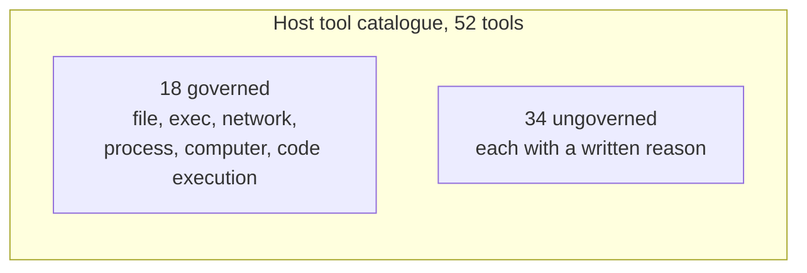
```mermaid
flowchart LR
  subgraph C["Host tool catalogue, 52 tools"]
    G["18 governed<br/>file, exec, network,<br/>process, computer, code execution"]
    N["34 ungoverned<br/>each with a written reason"]
  end
```

### TikZ form

```latex
\begin{figure}[htbp]
\centering
\begin{tikzpicture}[node distance=4mm]
  \node[gbox, fill=black!18, minimum width=38mm, minimum height=22mm] (g)
    {18 governed\\\scriptsize file, exec, network,\\\scriptsize process, computer, code execution};
  \node[gbox, right=0mm of g, minimum width=58mm, minimum height=22mm] (n)
    {34 ungoverned\\\scriptsize each with a written justification};
  \node[gnote, above=1mm of $(g.north)!0.5!(n.north)$] {Host tool catalogue --- 52 tools};
\end{tikzpicture}
\caption{Proportion of the host's tool catalogue reached by the gate.}
\label{fig:catalogue}
\end{figure}
```

---

## F16: Rule row, before and after

**Source:** §4.x.24 · **Proposed number:**,

**Recommendation: CUT as a drawn figure. Use two screenshots instead.** This is a
user-interface change, and a redrawn approximation of a UI is strictly worse
evidence than the UI itself. You already have a running dashboard, so crop two
narrow screenshots of one rule row and place them side by side in a single
figure. A hand-drawn version invites the question of whether the real thing looks
like that.

### Prose form

The rule list originally led with the pattern, so an operator scanning it read a
column of regular expressions and had to decode each one to find the rule they
wanted. The replacement leads with the rule's description and demotes the pattern
to secondary text beneath it. The change matters more than presentation: this
panel is where somebody answers the question "what actually permits this?" during
an incident, and a list that has to be decoded under pressure is a control that
fails when it is needed most.

### Mermaid form

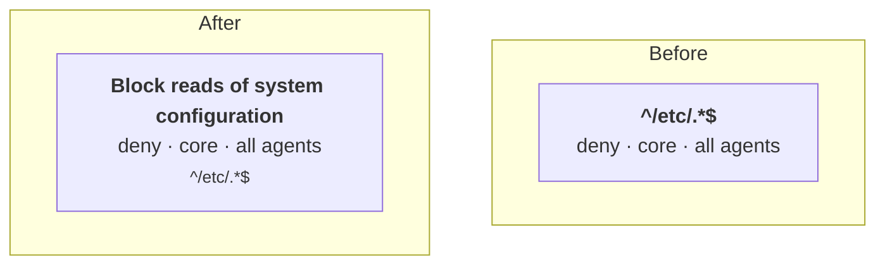
```mermaid
flowchart TB
  subgraph B["Before"]
    B1["<b>^/etc/.*$</b><br/>deny · core · all agents"]
  end
  subgraph A["After"]
    A1["<b>Block reads of system configuration</b><br/>deny · core · all agents<br/><small>^/etc/.*$</small>"]
  end
```

### TikZ form

```latex
\begin{figure}[htbp]
\centering
\begin{tikzpicture}[node distance=6mm]
  \node[gbox, align=left, minimum width=70mm] (b)
    {\texttt{\^{}/etc/.*\$}\\[2pt]\scriptsize deny \quad core \quad all agents};
  \node[gbox, align=left, minimum width=70mm, below=of b] (a)
    {\textbf{Block reads of system configuration}\\[2pt]
     \scriptsize deny \quad core \quad all agents\\[2pt]
     \scriptsize\texttt{\^{}/etc/.*\$}};
  \node[gnote, left=2mm of b] {Before};
  \node[gnote, left=2mm of a] {After};
\end{tikzpicture}
\caption{One rule row: pattern-first, and the description-first replacement.}
\label{fig:rulerow}
\end{figure}
```

---

## F17: Defects by the age of the code containing them

**Source:** §4.x.29 · **Proposed number:** Figure 4.2

**Recommendation: KEEP.** This is the quantitative backbone of your continuous-
review argument, and it is the kind of claim a reader will not accept on
assertion. The argument the figure must carry, in your own words: the
distribution is not flat and does not favour old code. Draw it and the point
makes itself.

**One caution, and it is the reason this figure is dangerous as well as
valuable.** Your note says "across all seventeen rounds". There are now
**182 findings** _(this sentence said 148 until 2026-09-01. A stale count
inside the caution about stale counts, which is the joke this project keeps
making at its own expense)_, so the figure would misreport the
project if drawn from the old note. Worse, the classification is not mechanically
derivable: no field in the registers records how old the code was when a defect
was found, so the four buckets have to be assigned by reading each finding.
**The values in the code below are placeholders and must be replaced.** Until
they are, do not put this figure in a draft anyone else reads. A chart carries
more apparent authority than a sentence, which is exactly why an unverified one
is worse than none.

> **Updated suggestion, 2026-09-01, CUT, and replace it with a claim you can
> actually compute.** _(Added beside the original, not replacing it.)_
>
> The original recommendation has now stood unfilled for the life of the
> document: the table below is still **empty**, across two rounds of editing and
> 182 findings. That is information. A figure nobody has been able to fill in
> during months of work is not waiting on effort, it is waiting on data that
> does not exist, no register records how old the code was when a defect was
> found, so every one of the 182 would have to be re-read and judged, by hand,
> under deadline, to produce four numbers.
>
> In lay terms: you would be spending a day of the last week manufacturing a
> statistic, and a reader who asks "how did you classify these?" gets "I decided,
> afterwards", which is the weakest possible footing for the one chart in the
> chapter.
>
> **What to draw instead, from data the project already has:** findings per QA
> round, over time. It is mechanically derivable from `REMAINING-WORK.md`, the
> rounds are numbered and the findings are numbered, it needs no judgement, and
> it supports the same argument better. It shows review finding defects _at a
> steady rate that does not fall off_, which is the actual claim: the reviews
> never stopped paying. The last four rounds alone found 21, 11 and 2 defects in
> code that was days old.
>
> Keep the prose version of the age argument in the text, where "I judged these
> by reading them" is an honest thing to write and a chart cannot say it.

> **State on 2026-09-19: CUT the age chart; the replacement is a Chapter 4 number,
> so fill its data last** (its TikZ compiles clean as of 2026-09-20, with placeholder
> counts; what is still open is the data, not the drawing) (`WRITING-GUIDE.md` says to
> leave Chapter 4's numbers until last). The summary table said "Keep, re-derive"
> while the updated suggestion above said cut, and the two now agree. **The
> replacement is less mechanical than the suggestion above assumed, measured
> today:** of the 376 findings, 176 carry a date in their `GOVERNANCE.md` index row
> and 200 do not, findings 1 to about 120 among them, which were recorded by QA
> pass rather than by date. Dating those needs the pass headings or the commit
> that first recorded each, and the commit route is lumpy because work was at
> times committed a fortnight after it was done. Either way it is counting, not
> judging, which is the argument for it. The forms below still draw the age chart,
> with its placeholder values, for the record.

### Prose form

_(A template for the age argument, kept for the record; its counts were never
compiled. The finding total is 376 as of 2026-09-19, and this paragraph said 148.)_

The project's findings, across its review rounds, were classified by
the age of the code they were found in. The distribution is markedly uneven and
does not favour old code.
The largest group by a wide margin is code written within the same week as the
round that found it, and a substantial share is code written the same day.
Long-standing code inherited from the host accounts for the smallest group. This
matters because it is the argument for reviewing continuously rather than once at
the end: if defects were distributed evenly across the age of the code, an
end-of-project audit would find as many as a running series of rounds, and the
case for the method used here would be much weaker. The sharpest instance is a
compliance claim and its violation being written in the same commit, which no
review of older code could ever have caught.

### Mermaid form

**Mermaid can draw this now**, `xychart-beta` post-dates the note that used to
sit here. The shape, once the counts exist:

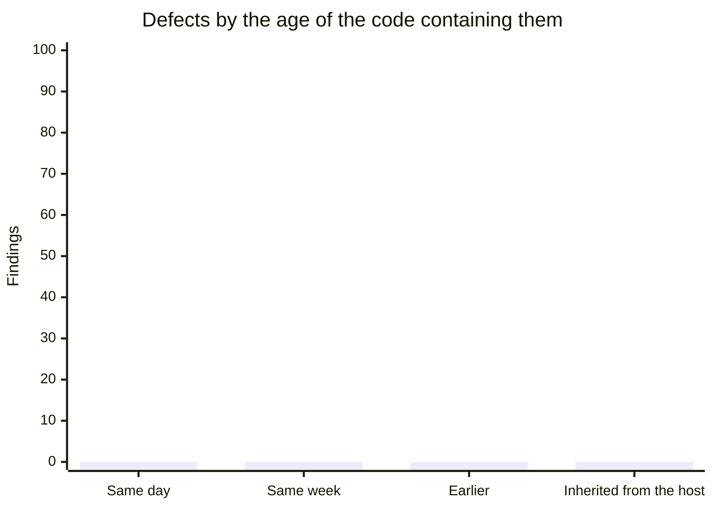
```mermaid
xychart-beta
  title "Defects by the age of the code containing them"
  x-axis ["Same day", "Same week", "Earlier", "Inherited from the host"]
  y-axis "Findings" 0 --> 100
  bar [0, 0, 0, 0]
```

**The counts are zero because they have never been compiled.** Draft as a table
first:

| Age of the code when the defect was found | Findings |
| ----------------------------------------- | -------: |
| Same day                                  |          |
| Same week                                 |          |
| Earlier in the project                    |          |
| Inherited from the host                   |          |

### TikZ form

```latex
\begin{figure}[htbp]
\centering
\begin{tikzpicture}
\begin{axis}[
  ybar, width=0.8\textwidth, height=52mm,
  ymin=0, bar width=11mm,
  symbolic x coords={Same day, Same week, Earlier, Inherited},
  xtick=data, axis lines*=left, tick style={draw=none},
  ylabel={Findings}, nodes near coords,
  % text=black: "\addplot+" would take pgfplots' cycle and colour the labels blue,
  % and this file is greyscale by design (found by looking, 2026-09-20).
  every node near coord/.append style={font=\scriptsize, text=black},
  x tick label style={font=\small},
]
  % PLACEHOLDER VALUES. These four numbers sum to 148, the finding total when
  % they were written (376 on 2026-09-19), and the split between the buckets
  % was NEVER measured. Recommended cut; see the state note above.
  \addplot[fill=black!45, draw=black!55]
    coordinates {(Same day,21) (Same week,58) (Earlier,44) (Inherited,25)};
\end{axis}
\end{tikzpicture}
\caption{\textbf{Placeholder values, not measured.} Defects by the age of the code
containing them. The four bars sum to 148, the finding total when they were
written, and the split between the buckets has never been derived from the
register. The shape is the argument (the distribution does not favour old code,
which is why reviewing continuously beats reviewing once) but the numbers must be
re-derived before this figure goes into the report.}
\label{fig:gov-defectage}
\end{figure}
```

---

## F18: The M-series as a whole (cross-reference)

**Source:** §3.5.51 · **Proposed number:**,

**Recommendation: CUT. It is not a figure.** This candidate is a pointer saying
"see §3.5.56", which is F19. Delete the marker so the count of figures stops
being inflated by a cross-reference. No forms are given because there is nothing
here to draw that F19 does not draw.

---

## F19: The tenant model

**Source:** §3.5.9 · **Final placement:** Figure 3.17

> **Still KEEP after T49 (2026-09-15), with its framing changed.** The figure draws one
> organisation's chain of records, not two organisations, so it stays true under option
> (b). Its prose and caption present the series as making the system multi-tenant; in the
> report, present it as how every record is labelled with its organisation, with one
> organisation per installation as the boundary (`CHAPTER3-MATERIAL.md` §3.5.89).

**Recommendation: KEEP.** The M-series is six subtasks that are far easier to
defend as one argument than as six features, and the reason is structural: each
supplies a noun the next one needs. That dependency chain is exactly what a
diagram shows well and a list shows badly.

### Prose form

The multi-tenancy work is six subtasks, and each supplies a noun the next one
needs. M3 introduces the group: one Root and its own accounts. M4 adds the agent
record, which carries an identifier, a name, the group it belongs to, and the one
Administrator who owns it; the group is the thing that record belongs to, so M4
needs M3. M5 then isolates storage, giving each group its own policy document,
ledger, rule requests and attachments, while keeping one installation-wide
signing key and a single checkpoint file keyed by group, so that the
tamper-evidence claim survives word for word. M6 finally adds the Administrator
panel and provisioning, which creates an agent in the host's roster and the
registry as one transaction. Read in that order the series is one argument about
making a single-tenant system multi-tenant without weakening any claim it already
made.

### Mermaid form

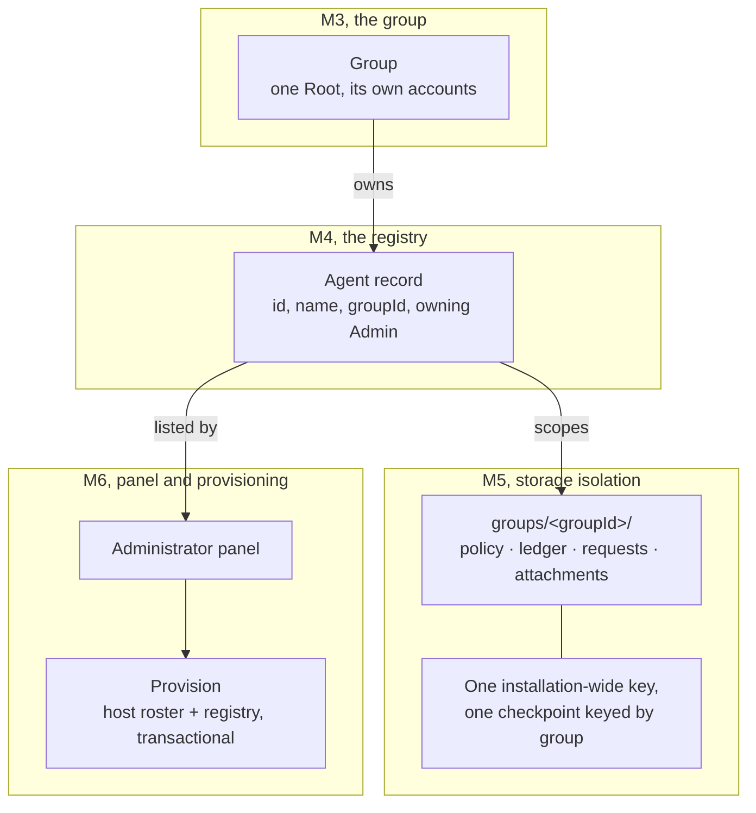
```mermaid
flowchart TB
  subgraph M3["M3, the group"]
    G["Group<br/>one Root, its own accounts"]
  end
  subgraph M4["M4, the registry"]
    A["Agent record<br/>id, name, groupId, owning Admin"]
  end
  subgraph M5["M5, storage isolation"]
    S["groups/&lt;groupId&gt;/<br/>policy · ledger · requests · attachments"]
    K["One installation-wide key,<br/>one checkpoint keyed by group"]
  end
  subgraph M6["M6, panel and provisioning"]
    P["Provision<br/>host roster + registry, transactional"]
    UI["Administrator panel"]
  end
  G -->|owns| A
  A -->|scopes| S
  S --- K
  A -->|listed by| UI
  UI --> P
```

### TikZ form

```latex
\begin{figure}[htbp]
\centering
\begin{tikzpicture}[node distance=9mm and 12mm]
  \node[gbox] (g) {Group\\\scriptsize one Root, its own accounts};
  \node[gbox, below=of g] (a) {Agent record\\\scriptsize id, name, groupId, owning Admin};
  \node[gbox, below left=10mm and 2mm of a]  (s) {\texttt{groups/<groupId>/}\\\scriptsize policy, ledger, requests, attachments};
  \node[gbox, below right=10mm and 2mm of a] (ui) {Administrator panel};
  \node[gstore, below=of s]  (k) {One installation-wide key,\\one checkpoint keyed by group};
  \node[gbox,  below=of ui]  (p) {Provision\\\scriptsize host roster + registry, transactional};

  \draw[gflow] (g)  -- node[glab, right] {owns} (a);
  \draw[gflow] (a)  -- node[glab, left]  {scopes} (s);
  \draw[gflow] (a)  -- node[glab, right] {listed by} (ui);
  \draw[gflow] (ui) -- (p);
  \draw[draw=black!55] (s) -- (k);

  \node[gnote, left=2mm of g]  {M3};
  \node[gnote, left=2mm of a]  {M4};
  \node[gnote, left=2mm of s]  {M5};
  \node[gnote, right=2mm of ui] {M6};
\end{tikzpicture}
\caption{The tenant model. Each subtask supplies a noun the next one needs.}
\label{fig:gov-tenant}
\end{figure}
```

---

## F20: The same secret, several spellings

**Source:** §3.5.60 · **Proposed number:**,

**Recommendation: CUT the figure, keep the table.** I marked this candidate
myself when writing §3.5.60, and on reflection the table already in that section
is better than any drawing of it. The content is a list of flag spellings with
two outcomes each, which is what a table is for. A figure would only add boxes
around the words.

### Prose form

The masker recognised credential flags only when the key stood alone. A flag
written as `--password=` was masked, and one written as `--db-password=` was not,
because the pattern anchored the key immediately after the two dashes and
`db-password` is not the word `password`. A single component of prefix therefore
defeated the entire list, so `--http-password=`, `--admin-password=`,
`--gateway-password=` and `--http-token=` all reached the tamper-evident ledger
verbatim. The fix applies the host's own prefix-matching convention, which
already existed for configuration assignments and environment variables, to
command-line flags. Two words are deliberately excluded and suffixes are not
matched, so `--first-pass=2`, `--sort-key=name` and `--password-file=/etc/pw.txt`
remain readable, because a masker that hides ordinary arguments makes the ledger
describe something other than what ran.

### Mermaid form

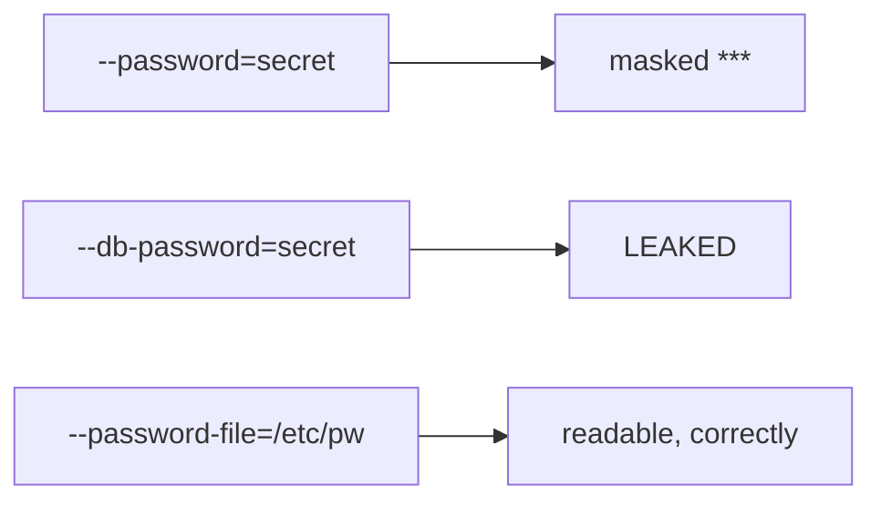
```mermaid
flowchart LR
  P1["--password=secret"] --> M1["masked ***"]
  P2["--db-password=secret"] --> M2["LEAKED"]
  P3["--password-file=/etc/pw"] --> M3["readable, correctly"]
```

### TikZ form

```latex
\begin{figure}[htbp]
\centering
\begin{tikzpicture}[node distance=4mm and 16mm]
  \node[gbox] (p1) {\texttt{-{}-password=secret}};
  \node[gbox, below=of p1] (p2) {\texttt{-{}-db-password=secret}};
  \node[gbox, below=of p2] (p3) {\texttt{-{}-password-file=/etc/pw}};
  \node[gbox, right=of p1] (m1) {masked \texttt{***}};
  \node[gbox, right=of p2, fill=black!12] (m2) {\textbf{leaked}};
  \node[gbox, right=of p3] (m3) {readable, correctly};
  \draw[gflow] (p1) -- (m1);
  \draw[gflow] (p2) -- (m2);
  \draw[gflow] (p3) -- (m3);
\end{tikzpicture}
\caption{Before the fix: one component of prefix defeated the whole key list.}
\label{fig:masking}
\end{figure}
```

---

# Summary table

| #   | Figure                         | Recommendation                             | Prints as, and the section it goes in                            |
| --- | ------------------------------ | ------------------------------------------ | ---------------------------------------------------------------- |
| F1  | Governance layer in Gateway    | **Keep** (absorb F4)                       | **Fig 3.2**, 3.5.1 System Architecture                           |
| F2  | RBAC hierarchy                 | **Keep**, small, beside the table          | **Fig 3.12**, 3.5.4 Access Control Model                         |
| F3  | Policy decision sequence       | **Keep**                                   | **Fig 3.6**, 3.5.2.2 Evaluation Order                            |
| F4  | Two-gate authentication        | Merge into F1                              | -                                                                |
| F5  | Path normalisation             | **Keep**                                   | **Fig 3.8**, 3.5.2.3 Path Canonicalization                       |
| F6  | Governed prompt path           | **Keep** (absorb F10)                      | **Fig 3.13**, 3.5.5 Prompt Execution Path                        |
| F7  | Deployment-status seam         | Cut                                        | -                                                                |
| F8  | Two paths to the gate          | **Keep** (absorb F13, both funnels)        | **Fig 3.1**, placed in 3.4.2 Host Interception; 3.5.8.2 cites it |
| F9  | Four modules, one definition   | Cut                                        | -                                                                |
| F10 | Prompt lifecycle               | Merge into F6                              | -                                                                |
| F11 | Check-then-open window         | **Keep**                                   | **Fig 3.18**, 3.5.12 System Security                             |
| F12 | Two groups on one installation | Cut (T49, 2026-09-15)                      | -                                                                |
| F13 | Two entry points, one gate     | Merge into F8                              | -                                                                |
| F14 | Tool coverage before/after     | **Keep** (absorb F15)                      | Fig 4.1                                                          |
| F15 | Tool catalogue highlighted     | Merge into F14                             | -                                                                |
| F16 | Rule row before/after          | Cut, use screenshots                       | Fig 4.x (photo)                                                  |
| F17 | Defects by age of code         | Cut; draw findings over time, compile last | Fig 4.2 (replacement)                                            |
| F18 | M-series cross-reference       | Cut, not a figure                          | -                                                                |
| F19 | The tenant model               | **Keep**                                   | **Fig 3.17**, 3.5.9 Tenancy and Agent Registry                   |
| F20 | Same secret, several spellings | Cut, keep the table                        | -                                                                |
| F21 | Two-layer Codex permission     | **Keep**                                   | **Fig 3.16**, 3.5.8.2 Secondary Runtime Governance               |
| F22 | Grant a folder, except…        | **Keep**                                   | **Fig 3.9**, 3.5.2.5 Folder Grants                               |
| F23 | "Always allow" after the card  | **Keep**                                   | **Fig 3.14**, 3.5.7.2 Persistent Approvals                       |
| F24 | A task's row and its slot      | **Keep**, small                            | **Fig 3.15**, 3.5.8.1 Task and Slot Model                        |
| F25 | Appending to the HMAC chain    | **Keep**                                   | **Fig 3.10**, 3.5.3.1 Entry Structure                            |
| F26 | Ledger verification            | **Keep**                                   | **Fig 3.11**, 3.5.3.2 Hash Chaining and Verification             |

**Sixteen design figures: fourteen in Chapter 3 and two in Chapter 4.** The
report also contains four source-code figures from `docs-notes/CODE-SNIPPETS.md`
(C1 in 3.5.1, C2 and C3 in 3.5.2.1, C4 in 3.5.2.2), giving Chapter 3 eighteen numbered
figures in its current form (corrected 2026-09-28 from the map in `chapter3.tex`, renumbered
2026-09-27; the report compiled that day prints the eight placed ones as 3.1 to 3.8). The original design figures compiled clean on 2026-09-20, and F25
and F26 were added and compiled on 2026-09-23. F17's replacement still carries
placeholder counts. The numbers in the last column include the code figures' positions, and
each retained design figure repeats its placement under its heading.

**Renumbered 2026-09-21, and the reason is worth keeping.** This column read
Fig 3.1 to Fig 3.12 in _this file's_ order (F1, F2, F3, F5, ...), and so did the
mapping table in `docs-notes/report/chapter3.tex`. But LaTeX numbers a figure by
where its `figure` environment sits in the source, and the placements recorded in
`chapter3.tex` put them in the chapter in a different order, so Figure 3.2 would
have printed after Figure 3.3 and anyone discussing "Figure 3.2" would have meant
a different drawing from the one LaTeX printed under that number. The column now
carries the number LaTeX will actually print **and** the section the figure
belongs in, derived from the `% FIGURE` comments in `chapter3.tex` on 2026-09-21.
No prose changed, because every citation uses a LaTeX cross-reference.
The printed figure numbers were updated again on 2026-09-26 after C1 was placed
after F1 in System Architecture. Every later Chapter 3 design figure therefore
moved forward by one. The section numbers were updated on 2026-09-22 after the planned standards
discussion was removed: Analysis of Design Constraints remains 3.3, Different
Design Approaches is 3.4, and Developed Design is 3.5.

_(Corrected 2026-09-19. This table said "Cut, keep the table" for F2 and "Keep,
re-derive" for F17, while each figure's own section had reversed that: F2 to keep
on 2026-09-01, F17 to cut and replace the same day. Counting F2 makes fourteen,
not thirteen, and F17's replacement keeps Chapter 4's slot. The Chapter 3 numbers
are closed up. Earlier: it read "Thirteen figures: eleven in Chapter 3" from
2026-09-15, when T49 cut F12, and "Eleven figures: nine in Chapter 3" until
2026-09-14, when F22–F24 were added.)_ F25 and F26 were added on 2026-09-23
because the audit ledger previously had no figure explaining its integrity
mechanism. If sixteen is more than the chapters can
carry, F24 and F10's merge into F6 are the first places to save a page; every other
keep earns its page by explaining something a paragraph explains worse.

---

## F21: The two-layer Codex permission

**Source:** §3.5.8.2 · **Final placement:** Figure 3.16

**Recommendation: KEEP.** Added 2026-08-30. Two gates in series is a shape prose
handles badly and a picture handles in one glance, and the claim it carries,
_they compose in the safe direction_, is exactly the sort a reader accepts
visually and doubts in a sentence. It also does double duty: it shows the tier
split, which is the strongest evidence in the report that the role model is
applied rather than asserted.

### Prose form

Two separate permissions stand between an agent and the Codex runtime, and they
belong to different tiers. Root decides whether the backend exists on this
installation at all, which is a deployment question: disabling it also withdraws
the Codex-managed model catalogue and media understanding, and leaves supervised
chats locked. The Administrator who owns an agent decides whether that agent may
use it, which is an agent's security boundary; Root may decide it for any agent,
and another Administrator may not (the dashboard offered that control to one until
finding 375, 2026-09-18). Both must be open for an agent to reach that
runtime, so neither permission alone opens the gap. The in-process runtime needs
no permission at all and is always available, which is what makes default-off
cost an operator nothing until they choose otherwise.

### Mermaid form

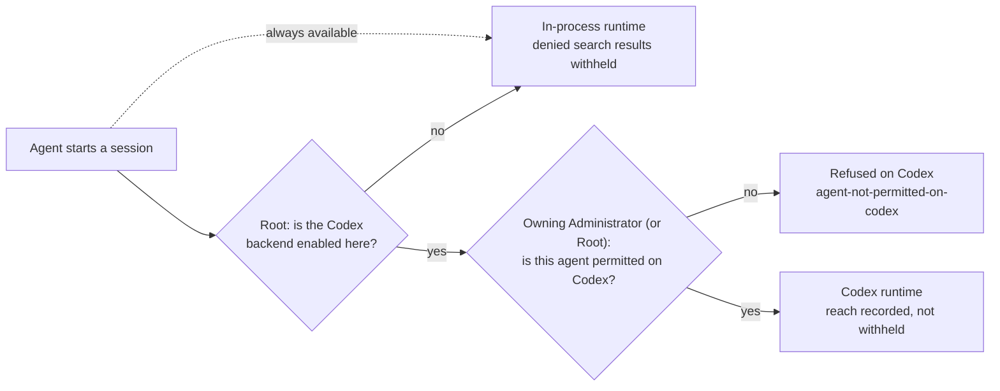
```mermaid
flowchart LR
  A["Agent starts a session"] --> R{"Root: is the Codex<br/>backend enabled here?"}
  R -->|no| IP["In-process runtime<br/>denied search results withheld"]
  R -->|yes| AD{"Owning Administrator (or Root):<br/>is this agent permitted on Codex?"}
  AD -->|no| REF["Refused on Codex<br/>agent-not-permitted-on-codex"]
  AD -->|yes| CX["Codex runtime<br/>reach recorded, not withheld"]
  A -.always available.-> IP
```

### TikZ form

```latex
\begin{figure}[htbp]
\centering
  % Measured too wide for the text block when compiled (2026-09-20), so it is
  % scaled to the text width rather than having its font sizes changed.
\resizebox{\textwidth}{!}{%
\begin{tikzpicture}[node distance=8mm and 13mm]
  \node[gbox] (a) {Agent starts\\a session};
  \node[gdec, right=of a]  (r)  {Root:\\backend\\enabled?};
  \node[gdec, right=of r]  (ad) {Its owner:\\agent\\permitted?};
  \node[gbox, right=of ad] (cx) {Codex runtime\\\scriptsize reach recorded, not withheld};
  \node[gbox, below=16mm of ad] (ip) {In-process runtime\\\scriptsize denied results withheld};
  \node[gbox, below=9mm of cx]  (ref) {Refused\\\scriptsize \texttt{agent-not-permitted-on-codex}};

  \draw[gflow] (a)  -- (r);
  \draw[gflow] (r)  -- node[glab, above] {yes} (ad);
  \draw[gflow] (ad) -- node[glab, above] {yes} (cx);
  \draw[gflow] (r)  -- node[glab, left]  {no}  (ip);
  \draw[gflow] (ad) -- node[glab, right] {no}  (ref);
  \draw[gdash] (a.south) |- node[glab, below, pos=0.25] {always available} (ip.west);

  \node[gnote, above=1mm of r]  {deployment};
  \node[gnote, above=1mm of ad] {agent boundary};
\end{tikzpicture}}
\caption{The two-layer Codex permission. Both gates must be open; the in-process
runtime needs neither. The second gate is set by the Administrator who owns the
agent, or by Root.}
\label{fig:gov-codexgates}
\end{figure}
```

---

## F22: Grant a folder, except… (added 2026-09-01)

**Source:** §3.5.2.5 · **Final placement:** Figure 3.9

**New figure, not a revision.** T32 shipped on 2026-08-31 and this document was
last touched the same day without gaining a candidate for it, so the newest
operator-facing feature had no figure at all.

**Recommendation: KEEP.** This is the only control in the layer that writes
**two opposite kinds of rule as a single act**, and that is precisely what a
reader gets wrong. In lay terms: an operator types "let the agent have `/srv/app`
but not `/srv/app/secrets`", and what actually lands in the policy is one
_allow_ and one _deny_. After which the deny wins wherever the two overlap,
because forbid always beats allow regardless of the order the rules are in. Three
sentences of prose, or one picture of a box with a hole in it.

There is a second reason to draw it, and it is evidence rather than taste. On
2026-09-01 this exact feature produced **finding 178**: the two rules it writes
appeared in the audit ledger as two entries that were _identical in form and
opposite in meaning_, because the entry never recorded which direction a rule
went. The confusion the figure removes is the confusion that already cost a
defect.

**If you are short of pages, this is a better cut than F5 or F11**, but do not
cut it in favour of F16, which is a screenshot of a table row.

### Prose form

A folder grant is a shortcut, not a new mechanism. The operator names one folder
and any number of paths inside it that must stay out of reach. The layer writes
ordinary rules: one **allow** rule binding the named folder and everything
beneath it, and one **deny** rule for each exception, likewise covering
everything beneath it. Nothing else is created, and every rule it writes appears
in the ordinary rule list where it can be read, edited or removed one at a time.

Two properties make the result behave the way the operator meant. First,
**forbid beats allow whatever the order**, so an exception carves a hole in the
grant rather than racing it. Second, a path pattern binds the folder _and its
subtree_ by ending in "either a separator or the end of the string", so a grant
on `work` cannot accidentally cover a sibling called `work-other`. That ending,
`(/|$)`, counts as the pattern's end anchor: until 2026-09-13 a hand-written copy of
the grant's own shape was warned as unanchored, a false warning on the one pattern
the product recommends.

Two deliberate asymmetries are worth stating because they surprise people. The
denials are written **before** the allow, so that a failure part-way through
leaves less access than intended rather than more. And an exception is never
narrowed to reads or writes even when the grant is: "except this" means the whole
path is out, and a read-only exception inside a read-only grant would leave the
excepted path writable. The opposite of what was typed.

Finally, the exception must lie inside the folder being granted. One outside it
is almost always a typo, and its effect would be to write a denial somewhere the
operator was not looking, so it is refused with both paths named and nothing is
written.

### Mermaid form

```mermaid
flowchart TB
  IN["Operator types:<br/>folder = /srv/app<br/>except = /srv/app/secrets"]
  CHK{"Is every exception<br/>inside the folder?"}
  REF["Refused. Nothing written<br/><small>a denial outside the grant is a typo</small>"]
  D["1 · DENY  ^/srv/app/secrets(/|$)<br/><small>written first: a partial failure leaves less access</small>"]
  A["2 · ALLOW ^/srv/app(/|$)<br/><small>narrowable to read or write</small>"]
  OUT["Two ordinary rules in the policy<br/><small>editable and removable one at a time</small>"]
  GATE["At evaluation: forbid beats allow,<br/>whatever the order"]

  IN --> CHK
  CHK -->|no| REF
  CHK -->|yes| D --> A --> OUT --> GATE
```

### TikZ form

```latex
\begin{figure}[htbp]
\centering
\begin{tikzpicture}[node distance=7mm and 12mm]
  \node[gbox] (in) {Operator types\\\scriptsize folder \texttt{/srv/app}, except \texttt{/srv/app/secrets}};
  \node[gdec, below=of in] (chk) {every exception\\inside the folder?};
  \node[gbox, right=of chk] (ref) {Refused\\\scriptsize nothing is written};
  \node[gbox, below=of chk] (d) {\textbf{1 · DENY} \texttt{\^{}/srv/app/secrets(/\textbar\$)}\\\scriptsize written first, so a partial failure leaves \emph{less} access};
  \node[gbox, below=of d]   (a) {\textbf{2 · ALLOW} \texttt{\^{}/srv/app(/\textbar\$)}\\\scriptsize narrowable to read or write};
  \node[gbox, below=of a]   (out) {Two ordinary rules in the policy\\\scriptsize editable and removable one at a time};
  \node[gnote, below=6mm of out] (gate) {at evaluation: \textbf{forbid beats allow}, whatever the order};

  \draw[gflow] (in)  -- (chk);
  \draw[gflow] (chk) -- node[glab, above] {no} (ref);
  \draw[gflow] (chk) -- node[glab, right] {yes} (d);
  \draw[gflow] (d)   -- (a);
  \draw[gflow] (a)   -- (out);
  \draw[gdash] (out) -- (gate);
\end{tikzpicture}
\caption{A folder grant writes one allow and one deny per exception, denials
first. The exception carves a hole in the grant because forbid beats allow
independently of order.}
\label{fig:gov-foldergrant}
\end{figure}
```

---

## F23: "Always allow", an approval that finishes after its card has closed (added 2026-09-11)

**Source:** §3.5.7.2 · **Final placement:** Figure 3.14

**Recommendation: KEEP.** The order of events is the thing a reader gets wrong,
and it is the whole design. The operator presses the button **before** the rule
request exists; the request is filed afterwards, in the agent's process, by the
policy's own callback. So a warning that the request could not be saved has
nowhere to go unless something carries it back through the Gateway — which is why
T60 needed a new Gateway method at all, and why a chat surface, which acts only on
the first resolved event, never shows that warning.

### Prose form

The agent's governed call reaches a path no rule covers, so the policy asks for
approval, and the request's description already explains that "Always allow"
allows this action once and asks an Administrator to make it permanent. The
Gateway shows the card. The operator presses **Always allow**; the decision
returns to the agent's process, the action runs once, and only then does the
policy's callback try to file the rule request. If it saves, nothing more
happens. If the organisation's queue — 40 requests plus 20 per account — is full,
the callback reports that outcome to the Gateway, which re-broadcasts it to the
operators who review approvals, and the Control UI shows a follow-up dialog
saying the request was not saved.

**Who sees the card and the follow-up depends on where the run came from**
(T68, 2026-09-13). For a chat run it is as drawn: the Control UI, which connects
as a Gateway operator. For a prompt sent from the dashboard, the card and its
follow-up appear on the governance page, to the accounts that manage the agent,
and to no Gateway connection. The sequence is otherwise the same, which is why
the figure keeps one lane labelled _Operator_; the caption, if the figure is used,
should say which of the two it shows.

### Mermaid form

```mermaid
sequenceDiagram
  participant Op as Operator (Control UI)
  participant GW as Gateway
  participant AG as Agent process (policy callback)
  participant Q as Rule requests
  AG->>GW: approval request (description explains "Always allow")
  GW->>Op: approval card
  Op->>GW: Always allow
  GW->>AG: decision: allow-always
  Note over AG: the action runs once
  AG->>Q: file a rule request
  alt saved
    Q-->>AG: pending
    AG->>GW: report outcome (nothing to say)
  else queue full (40 + 20 per account)
    Q-->>AG: capacity refused
    AG->>GW: report outcome (warning)
    GW->>Op: follow-up: "not saved"
  end
```

### TikZ form

```latex
\begin{figure}[htbp]
\centering
\begin{tikzpicture}[yscale=0.86]
  \foreach \x/\n in {0/{Operator}, 3.6/{Gateway}, 7.2/{Agent process}, 10.8/{Rule requests}} {
    \node[gbox, minimum width=24mm] at (\x,0) {\n};
    \draw[glife] (\x,-0.45) -- (\x,-7.6);
  }
  \draw[gflow] (7.2,-1.0) -- node[glab,above] {request, with explanation} (3.6,-1.0);
  \draw[gflow] (3.6,-1.7) -- node[glab,above] {card} (0,-1.7);
  \draw[gflow] (0,-2.4)   -- node[glab,above] {Always allow} (3.6,-2.4);
  \draw[gflow] (3.6,-3.1) -- node[glab,above] {allow-always} (7.2,-3.1);
  % Filled, so the lifeline it crosses does not run through the words.
  \node[gnote, fill=white] at (7.2,-3.8) {the action runs once};
  \draw[gflow] (7.2,-4.5) -- node[glab,above] {file a rule request} (10.8,-4.5);
  \draw[gdash] (10.8,-5.2) -- node[glab,above] {queue full} (7.2,-5.2);
  \draw[gflow] (7.2,-5.9) -- node[glab,above] {report outcome} (3.6,-5.9);
  \draw[gflow] (3.6,-6.6) -- node[glab,above] {follow-up: ``not saved''} (0,-6.6);
\end{tikzpicture}
\caption{``Always allow'': the operator answers before the rule request exists.
The action runs once, and the request is filed afterwards in the agent's process;
when the organisation's queue (40 requests plus 20 per account) is full, the
outcome travels back through the Gateway as a follow-up. Drawn for a chat run,
whose operator is the Control UI; for a dashboard prompt the card and follow-up
appear on the governance page, to the accounts that manage the agent.}
\label{fig:gov-alwaysallow}
\end{figure}
```

_(Rewritten 2026-09-19 in the shared style, with a figure environment, caption
and label; it was the only sequence without them, and it drew the same content
in local styles.)_

## F24: A task's row and its slot (added 2026-09-11)

**Source:** §3.5.8.1 · **Final placement:** Figure 3.15

**Recommendation: KEEP, and keep it small.** It draws the invariant a defect came
from. T63 keeps a task **listed** until its reply is saved, so that "it vanished"
can mean "it finished"; the first version also kept its **slot** under the
per-account cap of two for that long, and concurrent prompts lost their replies.
The figure makes the fix legible in one glance: the row and the slot are released
at different moments, and only the slot bounds concurrency.

### Prose form

A prompt that is accepted takes a slot and appears in both the conversation and
_Active agent sessions_, with Cancel enabled. Cancelling it, the five-minute
timeout, or the kill switch locking its agent (finding 364) moves it to
**Stopping**: still listed, still holding its slot, Cancel disabled. When the model returns — or a stopped run finishes unwinding — it moves
to **Saving reply**: still listed so recovery can see it, but its slot is released,
because it is no longer executing. Once the reply and its ledger entry are saved,
it leaves the list.

### Mermaid form

```mermaid
stateDiagram-v2
  [*] --> Running: prompt accepted (takes a slot)
  Running --> Stopping: Cancel, 5-minute timeout, or kill switch
  Running --> Saving: model returned
  Stopping --> Saving: run unwinds
  Saving --> [*]: reply and ledger entry saved
  note right of Running: listed, holds a slot, Cancel enabled
  note right of Stopping: listed, holds a slot, Cancel disabled
  note right of Saving: listed, slot released, Cancel disabled
```

### TikZ form

```latex
\begin{figure}[htbp]
\centering
\begin{tikzpicture}[node distance=10mm and 26mm]
  \node[gbox, minimum width=34mm] (run)  {Running\\\scriptsize listed $\cdot$ holds a slot $\cdot$ Cancel};
  \node[gbox, minimum width=34mm, right=of run] (stop) {Stopping\\\scriptsize listed $\cdot$ holds a slot};
  \node[gbox, minimum width=34mm, below=14mm of stop] (save) {Saving reply\\\scriptsize listed $\cdot$ \textbf{slot released}};
  \node[gnote, below=of save] (gone) {gone from the list};
  % Two lines: on one it was wider than the 26mm gap and overlapped both boxes
  % (found by looking, 2026-09-20).
  \draw[gflow] (run)  -- node[glab, above, align=center] {Cancel, timeout\\or kill switch} (stop);
  \draw[gflow] (stop) -- node[glab, right] {run unwinds} (save);
  \draw[gflow] (run)  |- node[glab, pos=0.25, left] {model returned} (save);
  \draw[gflow] (save) -- node[glab, right] {reply and ledger entry saved} (gone);
\end{tikzpicture}
\caption{A task's row and its slot. The row stays listed until the reply is saved,
so a reopened page can recover it; the slot, which alone bounds concurrency, is
released as soon as the task stops executing.}
\label{fig:gov-taskslot}
\end{figure}
```

_(Rewritten 2026-09-19. The previous TikZ wrote `\\footnotesize` three times, a
line break followed by the literal word "footnotesize", which would have printed
that word in every box, the defect F21 had on 2026-09-05. It also labelled the
edge to Stopping "Cancel / timeout" without the kill switch the prose and Mermaid
name (finding 364), and had no caption or label.)_

---

## F25: Appending an entry to the HMAC chain

**Source:** §3.5.3.1 · **Final placement:** Figure 3.10

**Recommendation: KEEP.** The ledger's integrity mechanism is a sequence, and
the security claim depends on the order of that sequence. This figure shows the
complete append path: serialization occurs under the per-organization ledger
lock, the new entry incorporates the preceding hash, HMAC-SHA256 binds the
canonical payload to the installation key, the JSON line reaches the ledger
before the checkpoint advances, and rotation preserves the same chain instead
of beginning a new one. Those relationships are difficult to recover from an
entry-field table alone.

### Prose form

An agent action, policy decision, approval, or administrative action first
becomes a bounded ledger record. Resource text and model intent are redacted and
length-limited before they enter the record. The writer then obtains the
organization's ledger lock, reads the current head, and assigns the next sequence
number. A new chain begins with a 64-zero genesis value; every later entry places
the preceding entry's hash in `prevHash`. The entry's ordered canonical payload
contains its sequence number, timestamp, agent and session identity, tool,
resource kind and value, applicable rule, decision, `prevHash`, and any present
intent or administrative actor fields. The writer computes the new `hash` as
HMAC-SHA256 over that payload using the installation's 256-bit ledger key, then
appends the complete entry as one JSON line to the organization's
`audit-ledger.jsonl`. Only after that append succeeds does it update the
installation-wide checkpoint with the organization's new sequence number and
head hash. This ordering prevents the checkpoint from claiming that an entry was
stored before it actually reached the ledger. When the active file reaches
8 MiB, it is renamed to the next numbered archive. The following active entry
still uses the archived tail's hash as `prevHash`, so rotation divides storage
without dividing the cryptographic chain.

### Mermaid form

```mermaid
flowchart LR
  EVENT["Agent or administrative event<br/>action, decision, approval, or change"]
  CLEAN["Redact and bound fields<br/>resource and model intent"]
  LOCK["Acquire organization ledger lock<br/>read head: sequence n, hash Hn<br/>or genesis: 0 and 64 zeros"]
  PAYLOAD["Build canonical payload P(n+1)<br/>event fields + optional actor/intent<br/>prevHash = Hn; keyed = true"]
  KEY[("Installation key K<br/>ledger.key or protected environment secret")]
  MAC["H(n+1) = HMAC-SHA256(K, P(n+1))"]
  APPEND[("groups/groupId/audit-ledger.jsonl<br/>append one JSON line")]
  CHECKPOINT[("ledger-checkpoint.json<br/>groupId: sequence n+1, hash H(n+1)")]
  SIZE{"Active file<br/>at least 8 MiB?"}
  ARCHIVE[("Rename to next numbered archive<br/>audit-ledger.jsonl.1, .2, ...")]
  CONTINUE["Next entry continues from H(n+1)<br/>including after rotation"]

  EVENT --> CLEAN --> LOCK --> PAYLOAD --> MAC --> APPEND --> CHECKPOINT --> SIZE
  KEY --> MAC
  SIZE -->|no| CONTINUE
  SIZE -->|yes| ARCHIVE --> CONTINUE
```

### TikZ form

```latex
\begin{figure}[htbp]
\centering
\resizebox{\textwidth}{!}{%
\begin{tikzpicture}[node distance=9mm and 10mm]
  \node[gbox] (event) {Agent or administrative event\\
    \scriptsize action, decision, approval, or change};
  \node[gbox, right=of event] (prepare) {Prepare under ledger lock\\
    \scriptsize redact and bound text\\
    \scriptsize read $(n,H_n)$, or genesis\\
    \scriptsize build $P_{n+1}$ with \texttt{prevHash} $=H_n$};
  \node[gbox, right=of prepare] (mac) {$H_{n+1}=$\\
    \scriptsize $\mathrm{HMAC\!\mbox{-}\!SHA256}(K,P_{n+1})$};
  \node[gstore, right=of mac] (ledger) {Append one JSON line\\
    \scriptsize \texttt{groups/<groupId>/audit-ledger.jsonl}};

  \node[gstore, above=10mm of mac] (key) {Installation key $K$\\
    \scriptsize 256-bit \texttt{ledger.key}, or protected environment secret};
  \node[gstore, below=14mm of ledger] (checkpoint) {Then update checkpoint\\
    \scriptsize \texttt{groupId}: $(n+1,H_{n+1})$};
  \node[gdec, left=12mm of checkpoint] (size) {Active file\\at least 8 MiB?};
  \node[gstore, left=12mm of size] (archive) {If yes, next archive\\
    \scriptsize \texttt{audit-ledger.jsonl.1}, \texttt{.2}, \ldots};
  \node[gbox, left=12mm of archive] (continue) {Next append uses $H_{n+1}$\\
    \scriptsize the chain continues across rotation};

  \draw[gflow] (event) -- (prepare);
  \draw[gflow] (prepare) -- node[glab, above] {$P_{n+1}$} (mac);
  \draw[gflow] (key) -- node[glab, right] {secret key} (mac);
  \draw[gflow] (mac) -- node[glab, above] {$H_{n+1}$} (ledger);
  \draw[gflow] (ledger) -- (checkpoint);
  \draw[gflow] (checkpoint) -- (size);
  \draw[gflow] (size) -- node[glab, above] {yes} (archive);
  \draw[gflow] (archive) -- (continue);
  \draw[gflow] (size.south) -- ++(0,-5mm) -| node[glab, below, pos=0.25] {no} (continue.south);
\end{tikzpicture}%
}
\caption[Appending an entry to the HMAC-protected audit chain]
{\footnotesize Appending an entry to the HMAC-protected audit chain. The writer
serializes each organization's appends with a file lock, redacts and bounds
agent-controlled text, and places the preceding head $H_n$ in the new entry's
\texttt{prevHash} field. It then computes $H_{n+1}$ from the entry's canonical
payload and the installation key $K$, appends the complete entry as one JSON
line, and only then records $(n+1,H_{n+1})$ in the separate checkpoint file.
If the active ledger has reached 8\,MiB, it is renamed to the next numbered
archive; the next entry still points to the archived head, so the chain remains
continuous across every segment.}
\label{fig:gov-ledger-append}
\end{figure}
```

---

## F26: Verifying the ledger and locating tampering

**Source:** §3.5.3.2 · **Final placement:** Figure 3.11

**Recommendation: KEEP.** F25 explains how the evidence is created; this figure
explains what verification proves. Keeping the two concerns separate prevents
the creation path from becoming a wall of branches, and lets this figure name
the distinct failure detected at each stage. It also makes the checkpoint's
purpose visible: internal chain checks cannot detect removal from the end of an
otherwise valid chain.

### Prose form

Verification reads every numbered archive in ascending order and then the active
ledger, treating the files as one continuous sequence. Each nonblank line must
be valid JSON with the required sequence and hash fields. Starting from sequence
1 and the 64-zero genesis hash, the verifier checks that sequence numbers are
consecutive and that every `prevHash` equals the hash of the preceding entry. It
then reconstructs each entry's canonical payload and recomputes its stored hash.
Keyed entries require the installation key and HMAC-SHA256; older unkeyed entries
use their original SHA-256 form for migration compatibility, but the chain may
move from unkeyed to keyed only once and may never move back. If the installation
has a ledger key, the newest entry must be keyed, which detects a complete rewrite
into the forgeable legacy format. After all entries pass, the verifier compares
the resulting chain head with the organization's record in the independent
checkpoint file. A checkpoint ahead of the ledger proves that entries were
removed from the end, and a checkpoint at the same sequence with a different
hash proves that the final entry was replaced. On keyed installations, a missing
checkpoint is itself a failure because truncation could no longer be tested. A
lagging checkpoint is accepted because a crash can occur after an entry is
appended and before the checkpoint is updated. Success reports the number of
entries checked, the final sequence and hash, the checkpoint sequence, and
whether the newest entry was keyed; failure reports the first broken entry and a
specific reason.

### Mermaid form

```mermaid
flowchart LR
  SEGMENTS[("Archives oldest first<br/>.1, .2, ...<br/>then active ledger")]
  PARSE{"Every line valid JSON<br/>with sequence and hash?"}
  SEQ{"Sequence starts at 1<br/>and increases by one?"}
  LINK{"prevHash equals<br/>preceding stored hash?"}
  KEY[("Installation key K<br/>read without creating one")]
  HMAC{"Stored hash equals recomputed<br/>SHA-256 or HMAC-SHA256?"}
  MODE{"No unkeyed entry after keyed,<br/>and keyed installation ends keyed?"}
  CP[("Independent checkpoint<br/>for this organization")]
  HEAD{"Checkpoint present when required,<br/>not ahead, and same hash at same sequence?"}
  OK["INTACT<br/>entries checked + head evidence"]
  BAD["BROKEN<br/>first failing sequence + reason"]

  SEGMENTS --> PARSE
  PARSE -->|yes| SEQ
  SEQ -->|yes| LINK
  LINK -->|yes| HMAC
  KEY --> HMAC
  HMAC -->|yes| MODE
  MODE -->|yes| HEAD
  CP --> HEAD
  HEAD -->|yes| OK
  PARSE -->|no| BAD
  SEQ -->|no| BAD
  LINK -->|no| BAD
  HMAC -->|no| BAD
  MODE -->|no| BAD
  HEAD -->|no| BAD
```

### TikZ form

```latex
\begin{figure}[htbp]
\centering
\resizebox{\textwidth}{!}{%
\begin{tikzpicture}[node distance=9mm and 10mm]
  \node[gstore] (segments) {Read one continuous chain\\
    \scriptsize archives oldest first, then active ledger};
  \node[gdec, right=of segments] (parse) {Valid JSON\\and required fields?};
  \node[gdec, right=of parse] (seq) {Sequence\\consecutive?};
  \node[gdec, right=of seq] (link) {\texttt{prevHash}\\matches?};

  \node[gdec, below=17mm of link] (hash) {Recomputed\\hash matches?};
  \node[gdec, left=of hash] (mode) {Keyed mode\\valid?};
  \node[gdec, left=of mode] (cpcheck) {Checkpoint\\consistent?};
  \node[gbox, left=of cpcheck] (ok) {\textbf{INTACT}\\
    \scriptsize count, head, checkpoint, keyed status};

  \node[gstore, right=11mm of hash] (key) {Ledger key $K$\\
    \scriptsize read without creating one};
  \node[gstore, below=12mm of cpcheck] (checkpoint) {Independent checkpoint\\
    \scriptsize organization head $(n,H_n)$};
  \node[gbox, below=25mm of mode, minimum width=50mm] (bad)
    {\textbf{BROKEN}\\
     \scriptsize first failing sequence and a specific reason};

  \draw[gflow] (segments) -- (parse);
  \draw[gflow] (parse) -- node[glab, above] {yes} (seq);
  \draw[gflow] (seq) -- node[glab, above] {yes} (link);
  \draw[gflow] (link) -- node[glab, right] {yes} (hash);
  \draw[gflow] (hash) -- node[glab, above] {yes} (mode);
  \draw[gflow] (mode) -- node[glab, above] {yes} (cpcheck);
  \draw[gflow] (cpcheck) -- node[glab, above] {yes} (ok);
  \draw[gflow] (key) -- (hash);
  \draw[gflow] (checkpoint) -- (cpcheck);

  \node[gnote, above=3mm of bad] (failed) {any failed check};
  \draw[gdash] (failed) -- node[glab, right] {no} (bad);

  \node[gnote, below=2mm of bad, align=center]
    {Malformed entry; sequence gap; broken link; edited payload or wrong HMAC;\\
     downgrade to unkeyed history; missing, advanced, or mismatched checkpoint};
\end{tikzpicture}%
}
\caption[Verification of the complete audit chain]
{\footnotesize Verification of the complete audit chain. Numbered archives and
the active JSONL file are read as one sequence from the 64-zero genesis value.
For each entry, the verifier checks its structure, sequence number,
\texttt{prevHash}, recomputed SHA-256 or HMAC-SHA256 value, and keyed-state
transition. It then compares the final head with the organization's independent
checkpoint. The internal checks expose malformed records, insertion, deletion,
reordering, edited fields, broken links, and downgrade to the unkeyed format;
the checkpoint adds detection of tail truncation, which a chain alone cannot
detect. A lagging checkpoint is accepted because the ledger entry is written
first, but a missing checkpoint on a keyed installation, a checkpoint ahead of
the ledger, or a different hash at the same sequence is reported as broken.}
\label{fig:gov-ledger-verify}
\end{figure}
```
